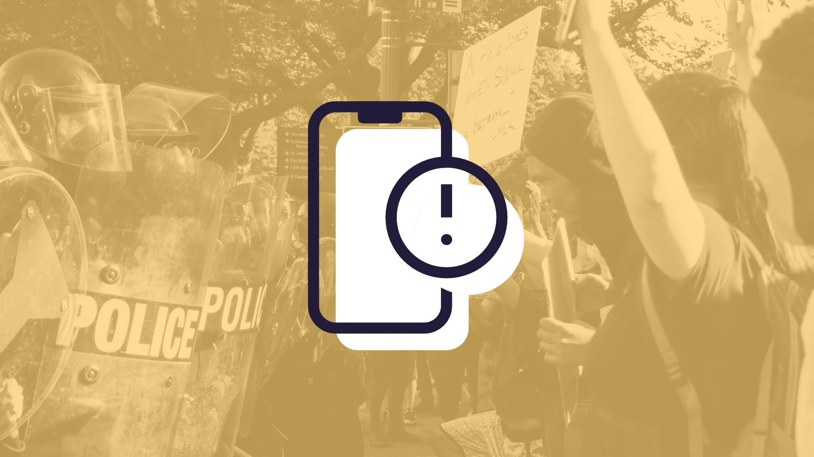

---
date:
    created: 2025-01-23T19:15:00Z
    updated: 2025-01-27T20:00:00Z
categories:
    - Tutorials
authors:
    - jonah
description: Your phone is an essential tool, but it also represents a huge risk to your privacy and security. Understanding these best practices when it comes to securing your smartphone will help keep you and your data safe.
schema_type: AnalysisNewsArticle
---
# The Protesters' Guide to Smartphone Security

<small aria-hidden="true">Illustration: Jonah Aragon / Privacy Guides | Photo: Koshu Kunii / Unsplash</small>

For most protesters, activists, and journalists, your smartphone is an essential tool you depend on for organizing with your peers, accessing and distributing information, and helping others. It also represents a great risk, as a tool that is easily appropriated by authorities for targeted and mass surveillance.<!-- more -->

The perennial question when it comes to protests is whether you should bring your phone at all. If you leave your phone at home, that is probably the safest your data will get, and you will be at very low risk of being tracked by mass surveillance tools. On the other hand, your phone is a critical resource when it comes to coordinating with others, getting updates on the protest from social media, or simply documenting what is going on with your phone's camera.

If possible, bringing a separate device like a "burner phone," an old phone you can reset, or even a regular old-fashioned camera is a much better option than bringing your primary phone. Any data you don't bring with you can't be taken from you at the scene.

However, getting access to or affording devices like these aren't a realistic option for many people. Whether you decide to take your smartphone or a secondary smartphone with you to the event, this guide will cover how to maximize that device's security and minimize risks to your privacy.

**Update (2025-01-27):** This article has been updated based on some community [feedback](https://discuss.privacyguides.net/t/24316), notably I added the [Burner Phones](#burner-phones), [Minimize Your Stored Data](#minimize-your-stored-data), [Use Public Wi-Fi](#use-public-wi-fi), and [Check Your Keyboard](#check-your-keyboard) sections.

## Your Risks at a Protest

There are plenty of risks you should consider if you use your smartphone at a protest. We are going to try and cover the following in this guide:

1. Losing your device.

2. Authorities confiscating your smartphone.

3. Service disruption, either due to intentional interference by authorities or caused by networks being overloaded by large groups of people.

4. Targeted surveillance:
    - Disrupting your service.
    - Blocking delivery of calls/SMS to your number.
    - Monitoring your unencrypted traffic.
    - Monitoring communications over local radios like walkie-talkies, etc.

5. Mass surveillance:
    - Interference with web services. Popular communication platforms like Twitter or TikTok could be throttled or blocked.
    - Interference with messengers and voice services like Signal or WhatsApp.
    - Authorities could use public Wi-Fi networks in the area to monitor traffic and identify nearby devices.
    - Cell phone companies could provide records to authorities of devices near cell towers in the area to track and identify protesters.

Like all of our guides, we are going to cover the general best practices and provide helpful tips, but your individual situation may be different. You should always research and plan according to what you specifically are doing, and if you need legal advice you should always consult a qualified and licensed attorney.

## "Burner Phones"

Cell phones are generally tracked by law enforcement using two identifiers:

1. Your **IMSI**, which uniquely identifies your SIM card
2. Your **IMEI**, which uniquely identifies your phone

Thus, simply using a prepaid SIM in your primary/personal device is not a foolproof method of avoiding tracking, because your IMEI is still correlatable between networks.

Buying a secondary, disposable device is an option that will provide you with much greater protection than bringing your personal device. However, if the threat you face is serious enough that you feel the need to do this, you should strongly consider not bringing a phone at all. Properly securing a disposable/burner phone is fairly challenging and may not be worth it.

If you *do* buy a secondary device for this purpose, you should buy it in-person, with **cash**.

**Do not activate or power it on at home**. The location of a phone is tracked by network carriers for at least a year at minimum, but you should assume that location history is just kept forever. Therefore, you should activate and set up the device in a very public place that is not significant to your daily life, then always keep it powered off at locations associated with you. You don't want the phone's location to ever be recorded at your home or workplace.

If possible, you should try to purchase and set up this phone well in advance. This certainly depends on your plans, but spreading out your purchase, activation, and use of the device makes it less easy to detect. It also makes it less likely that the store you bought the phone from still has security footage of your purchase.

You will also want to make sure you do not identify yourself when purchasing a cellular plan. This is highly dependent on your country, but many prepaid plans will not require any identification to activate. There are also some global eSIM providers which will accept payment without the need to identify yourself to them.

One last thing: Your secondary device should still be a reasonably modern smartphone. The security measures we cover below regarding [hardware and software security](#consider-your-phones-security-patches) still apply. Smartphones are more secure against the sort of threats that activists are likely to face—such as someone trying to crack into your device's data—than a simple/feature/"dumb" phone will be. They also have many more options for secure & encrypted communication methods that we'll cover below as well.

Using a secondary device only at the protest allows you to leave your primary device powered on and at home. This potentially provides some plausible deniability, if someone requests the location of your phone during the time of the event later.

## Secure Your Device

If your phone falls into the wrong hands, the information on it could be hugely damaging to yourself or others. Make sure you've taken the necessary steps to prevent it from being broken into.

### Use a Strong Screen Lock

At a bare minimum, you should use a 6-digit PIN, but ideally you should protect your phone with an alphanumeric passphrase. This prevents people from trivially accessing your data, and additionally protects your data with strong encryption.

Barring a massive security exploit (more on this [later](#consider-your-phones-security-patches)), most law enforcement tools work by essentially brute-forcing your PIN, running tons of guesses until it gets one right. This makes a long and unique passphrase your strongest protection against your data being stolen by people in possession of your device.

In the United States and many other countries it is legal to refuse to unlock your phone or provide your passcode to law enforcement. **Know your rights** wherever you're located before attending a protest, so you aren't blindly following orders later.

### Disable Biometric Authentication

We commonly recommend using biometric features like Face ID or Touch ID to prevent "shoulder surfing" attacks, where an attacker steals your PIN by discreetly watching you enter it, or where your PIN is recorded by surveillance cameras in the area.

**However**, in this situation it may make more sense to disable biometric authentication. Authorities are trained and known to use biometrics quickly to forcefully unlock your device, so you should be mindful of this fact when deciding what to do. If you disable biometrics, be wary of shoulder surfing attacks and prying eyes by obscuring or covering your phone whenever you unlock it.

Whatever you do, make sure you know how to quickly shut down your phone or disable biometrics at a moment's notice. Many phones have begun replacing the standard "hold down the power button" function with voice assistants or other features, so practice performing the actual shutdown method beforehand to familiarize yourself.

Modern iPhones require you to hold down the side button and either volume button before the power-off slider appears. Even if you don't get a chance to slide to power off, getting to this screen will at least disable biometric authentication, making your phone a bit more secure than it otherwise might be.

In the United States, it is still a legal gray area when it comes to whether law enforcement can force you to use biometrics, but many court decisions have leaned toward saying they **can** compel you to use your fingerprint. Using a passphrase and disabling biometrics gives you more robust 5th Amendment rights. In other countries you should again familiarize yourself with your rights in this scenario, so that you can make the most informed decision.

### Hide Your Notifications

Even with your device locked, law enforcement can see everything you're up to simply by scrolling through your notifications. Reducing the amount of information accessible on the lock screen improves your security and the security of those you're messaging, so make sure your notifications are only visible when your device is unlocked.

On an iPhone:

1. Open **Settings**
2. Navigate to **Notifications**
3. Navigate to **Show Previews**
4. Select **Never** (or, **When Unlocked**)

On Android:

1. Open **Settings**
2. Navigate to **Notifications**
3. Touch **Notifications on lock screen**
    - Select **Don't show any notifications**
4. Switch **Sensitive notifications** to **off**

### Minimize Your Stored Data

The best way to protect your data is to not have it on your phone in the first place. If you're using a secondary device, simply don't install anything other than what will be absolutely necessary during the protest, like a secure messenger.

Otherwise, delete any cloud storage apps you don't need access to during the protest. If you're able to delete an app and then download it later and log in without experiencing any data loss, then that app probably doesn't *need* to be on your phone all the time.

Some [password managers](https://www.privacyguides.org/en/passwords/) have the option to temporarily remove certain vaults from your devices, 1Password calls this [Travel Mode](https://support.1password.com/travel-mode/) for example. You can do this manually as well, by having a separate password manager or vault with only the essentials you will need at the time, and removing your primary password manager from your device for the duration of the event.

### Disable Lock Screen Actions

In a similar vein, any functionality you have enabled while your device is unlocked can pose a security risk. It is always best practice to reduce your attack surface by disabling these options whenever possible. Even though these features are typically designed to not pose a security risk to your data, they have been known to be exploited in the past to bypass lock screens and other security features.

On an iPhone:

1. Open **Settings**
2. Navigate to **Face ID & Passcode**
3. Scroll to the **Allow Access When Locked** section
4. Switch all features you don't need **off**

On Android, disabling functionality while the phone is locked will vary widely by manufacturer. Some like Samsung provide more flexible options in their lock screen settings, but others like Google do not provide the option to disable the quick settings panel or other similar features.

### Avoid External Storage

Your Android phone might have the option to store files or photos on a microSD card, but these cards are not always subject to the same encryption standards as your phone's built-in storage. You should check whether your microSD card can be encrypted in your phone's settings, although this will prevent it from being read by other devices like your computer later.

Additionally, even *if* it's encrypted, it still won't benefit from the same security protections that your phone's built-in storage provides, such as advanced brute-force protections. Ideally you should remove all external storage devices from your phone during the event, and save photos, videos, and other files to your phone's encrypted internal storage.

### Consider Your Phone's Security Patches

Exploits against smartphones are discovered on a very regular basis, and spyware companies that work with law enforcement—like Cellebrite—abuse these exploits to crack into stolen devices. If your phone is no longer receiving regular updates from its manufacturer, you are in a very dangerous position as you may be vulnerable to the exploits used.

In general, we consider the latest iPhone and latest Google Pixel to be the most secured against this sort of threat. You can increase your security further by using a [hardened alternative operating system](https://www.privacyguides.org/en/android/distributions/) on your Google Pixel.

Robust security information about phones from other manufacturers is less common. If you use a different device you may still consider the risks to be worth it, but if confiscation is of *particular* concern to you, or especially if your phone no longer receives security patches, you may want to consider leaving the phone at home.

## Protect Against Surveillance

### Disable AirDrop

One of the most innocuous features enabled on millions of iPhones is also one of the most dangerous for those seeking to protect their privacy in public. Apple's AirDrop protocol [uses](https://www.usenix.org/system/files/sec21-heinrich.pdf) trivially bypassed security measures that authorities like the Chinese government have openly [bragged](https://arstechnica.com/security/2024/01/hackers-can-id-unique-apple-airdrop-users-chinese-authorities-claim-to-do-just-that/) about cracking to identify users since at least 2022.

You should assume that any device with AirDrop enabled is constantly broadcasting your name, email address, and phone number to everyone around you, **even if** you have it set to "Contacts Only." Apple has known about this [flaw](https://www.macrumors.com/2021/04/23/airdrop-researchers-security-flaw/) since 2019 and has not issued any fix.

1. Open the **Settings** app
2. Navigate to **General**
3. Navigate to **AirDrop**
4. Select **Receiving Off**

### Lock Down Your Network

Your phone signals can be used to track you even if you don't make a call or send a text. Some law enforcement agencies use "stingrays," devices which can impersonate a cell tower to track visitors to an area. It is speculated that more advanced ones can intercept unencrypted text messages and phone calls as well, making the use of an [encrypted messenger](#use-signal) during the event even more critical.

While the capabilities of the most modern ones isn't fully known, you should definitely protect yourself from the subset of stingrays which abuse the lower security standards of older, 2G networks.

On Android:

1. Open **Settings**
2. Navigate to **Network & internet**
3. Navigate to **SIMs**
4. Select your carrier or SIM card
5. Switch **Allow 2G** to **off**

You might also consider installing Privacy Cell ([F-Droid](https://f-droid.org/en/packages/com.stoutner.privacycell/) / [Google Play](https://play.google.com/store/apps/details?id=com.stoutner.privacycell)), an app that tells you whether you are connected to a cell network using the most modern security. Even the "5G" indicator on your phone alone doesn't guarantee you are using the latest-generation protocol.

On iPhone:

1. Open **Settings**
2. Navigate to **Privacy & Security**
3. Navigate to **Lockdown Mode**
4. Select **Turn On Lockdown Mode**

Note that enabling [Lockdown Mode](https://www.privacyguides.org/articles/2022/10/27/macos-ventura-privacy-security-updates/#lockdown-mode) on an iPhone will change a variety of settings to harden its security. Many of them are smart improvements, but certain apps and features [won't work](https://support.apple.com/HT212650) normally, so read the previous links here for more details.

### Use Airplane Mode Frequently

Even after mitigating the risks of 2G networks, your cellular activity can still be tracked. If not by law enforcement then by your carrier, who will likely be responsive to law enforcement's requests for data after the fact.

To prevent this, you should keep your phone turned off or use Airplane Mode to disable cellular connections whenever possible. Ideally you should only connect to networks in an emergency situation to communicate with others in your group, otherwise keeping messages and network transmissions to a minimum is key.

If you absolutely need internet connectivity, and if it's possible, you should keep Airplane Mode on and connect to a public Wi-Fi network instead, which brings me to:

### Use Public Wi-Fi

If you're able, scope out businesses in the area that provide public Wi-Fi in advance. This is better than using cellular service, because less information about your device is shared with Wi-Fi networks as opposed to cell towers. Most modern phones support MAC address randomization, which makes it even harder to correlate your cell phone's connections between different Wi-Fi access points.

There is a danger that public Wi-Fi services will be set up by authorities or others in the area to track protesters. You could consider using a [VPN service](https://www.privacyguides.org/en/vpn/) while connected to them to minimize the amount of metadata about your traffic that the Wi-Fi operator is able to collect.

### Disable Location Services

If you have to keep your device powered on and connected, you can at least minimize the number of parties who have access to your location data. Be mindful of apps that you choose to share your location with, and consider disabling location services entirely while you're at the event.

On an iPhone:

1. Open **Settings**
2. Navigate to **Privacy & Security**
3. Navigate to **Location Services**
4. Switch **Location Services** to **off**

On Android:

1. Open **Settings**
2. Navigate to **Location**
3. Switch **Use location** to **off**

If you use an Android phone, you should also check your Google account settings to [ensure location history is disabled](https://support.google.com/accounts/answer/3118687). Google is frequently tapped by law enforcement to provide location data, because they don't protect your personal information with strong, zero-knowledge encryption.

### Check Your Keyboard

An often overlooked security risk is the software keyboard installed on your device. The best encrypted messenger in the world is no match for all of your inputs being read by third-parties as you type them.

If you are on [GrapheneOS](#consider-your-phones-security-patches), the default keyboard from AOSP that it comes with makes no internet connections, so if you don't install a third-party keyboard you should be fine. Most other Android users are using Google's *Gboard*, which does make internet connections you may decide you don't trust, so you could consider installing an offline alternative. iOS users are able to control whether their third-party keyboard has network access in their system settings, although it may be wiser to not install a third-party keyboard in the first place.

This is [particularly relevant](https://xcancel.com/RealSexyCyborg/status/1197695344575799296) to people typing in languages like Chinese or others where you use an Input Method Editor (IME) to convert Latin letters to characters in the target language. These IMEs are very often third-party apps that have full internet access.

## Other Tips

### Use Signal

[**Signal**](https://www.privacyguides.org/en/real-time-communication/#signal) is the most secure app for sending text messages and making voice calls with others. It is also impossible to configure Signal to lower its encryption security or other security standards, so you know that everyone in your group is using settings that are safe by default.

You should turn on disappearing messages with a reasonably short interval for sensitive communications. You can do this by default in the Privacy section of Signal's app settings, and you can also do it on a per-conversation basis in each conversation's settings panel. This way there is a time limit for an attacker to crack your phone and extract your messages before they permanently disappear.

Signal is battle-tested for this situation. [Signal has responded to 6 government requests](https://signal.org/bigbrother/) since 2016, and in each case the only information they were able to provide was at most:

1. Whether the user was registered with Signal
2. When that user registered with Signal
3. When that user connected to Signal last

Keep in mind that using Signal could still expose your phone's location, simply due to making a network request as we covered above. You should still keep your phone in [Airplane Mode](#use-airplane-mode-frequently) and minimize the use of Signal or any other networked app during the event.

There *are* other [encrypted messengers](https://www.privacyguides.org/en/real-time-communication/), some of them even making use of technologies developed by Signal. However, they all come with trade-offs that could easily compromise your security. WhatsApp and Facebook Messenger are end-to-end encrypted for example, but they collect copious amounts of *metadata* about your messages, such as whom you're sending them to, when you're sending them, your location when you're sending them, etc. Apple's iMessage service in the Messages app has strong encryption but similar metadata concerns, and only works if everyone in your group has an iPhone.

### Protect Your Access to Information

Phones can be easily lost, taken, broken, or they can simply run out of juice. Bring a spare mobile battery or a charged power bank with you, and try to minimize your phone usage to preserve power. You should also make sure your mobile plan is topped up and you have enough mobile data prior to the event.

You should also write down the number of an emergency contact or a lawyer on a physical piece of paper, or [even](https://xcancel.com/madeleine_rae/status/1266528386878443522) in Sharpie on your arm. You'll want this information easily accessible if you're arrested regardless of your phone's state or location.

### Change Your Camera Settings

Check your camera settings for things which may draw unwanted attention, like the flash or a shutter sound. You should go through these settings in advance and configure it for the safest possible use.

### Back Up Your Data

You should be prepared to have your phone taken or lost during a protest. You can limit the potential costs and headache to you if this happens by making sure you have an updated, encrypted backup of your data.

If you have an iPhone, you can make a local backup to a macOS computer or a Windows computer with iTunes. You can also back up to iCloud, but these backups are only secure if you enable [Advanced Data Protection](https://www.privacyguides.org/en/os/ios-overview/#icloud) on your iCloud account. We strongly encourage [enabling Advanced Data Protection](https://support.apple.com/en-us/108756) for all iCloud users in any case, as it protects not only device backups but most iCloud account data as well.

The backup situation on Android is not nearly as robust unfortunately, but you can back up photos and files with a variety of services. If you use an online backup service we recommend choosing one with strong, zero-knowledge encryption so that the service provider is unable to access your data.

- [Recommended Photo Backup Services](https://www.privacyguides.org/en/photo-management/)
- [Recommended Cloud Drive Services](https://www.privacyguides.org/en/cloud/)
- [Recommended File Sync Services](https://www.privacyguides.org/en/file-sharing/)

## At The Protest

### Keep Your Device Locked

You should always use your camera to take pictures or videos while your phone is locked, in case your device is taken while filming. This is easier if you've [disabled biometrics](#disable-biometric-authentication), because Face ID or similar features might unlock your device automatically when you don't want that to happen.

On an iPhone you can hold down the camera icon on the lock screen to open the camera without unlocking your device. You could also configure the Action Button to open the camera, or use the dedicated camera button on the latest iPhone model.

On a Google Pixel and most other Android devices, double-tapping the power button will open the camera without needing to unlock your device.

You should learn and/or set up device shortcuts to do things quickly, ideally while the device remains locked whenever possible, and ensure you're familiar with the shortcuts before the event.

### Have a Backup Communications Network

In the event of an internet blackout, it might be a good idea to have a backup network prepared, organized with other attendees. Messaging apps like [Briar](https://www.privacyguides.org/en/real-time-communication/#briar) can operate in a local mesh mode, connecting to other devices in the area with Bluetooth or local Wi-Fi connections instead of relying on centralized internet services. Another newer option is [Meshtastic](https://meshtastic.org/), which uses peer-to-peer/mesh radio that is much more reliable than using either Wi-Fi or Bluetooth, but requires purchasing dedicated hardware that you connect to your phone.

You might also want to consider local radios like walkie-talkies, although keep in mind these devices are nearly always unencrypted and can be easily monitored by others, so you won't want to use them to transmit sensitive information.

## After The Event

### If Your Phone Was Taken

If you lose your phone, you may be able to locate or wipe your phone remotely depending on the model. Here are some instructions for common devices you can try:

- [Finding a lost Android device](https://support.google.com/android/answer/3265955?hl=en)
- [Finding a lost iPhone](https://support.apple.com/en-us/104978)

If you were logged in to any online services on your phone, you should try and get them signed out. On many social media websites for example, you can go to your account's settings to see what devices are signed in and revoke their access remotely.

Please be aware of the **legal consequences** of these actions. Wiping your device or revoking online account access could lead to obstruction of justice or destruction of evidence charges in some jurisdictions. You should always speak with your licensed attorney before deciding how to proceed. If your phone was taken by law enforcement you may have legal recourse to get it back.

### Be Mindful of Others

If you post your photos online, be mindful of identifiable faces or other characteristics of your fellow protesters or bystanders. Law enforcement or vigilantes use these photos to track down other attendees and arrest or harass them.

To prevent this, you can obscure the faces of anyone in the image. Most phones have [built-in photo editing tools](https://www.privacyguides.org/en/os/ios-overview/#redacting-elements-in-images) that allow you to draw on an image. Blurring can sometimes be reversed, so blocking it out entirely is generally preferable.

Be careful of the editing tools you use, and don't select highlighters or other semi-transparent editing tools. Even if you scribble over an area of a photo multiple times with a dark/black "highlighter" tool until it *appears* black, that can often be reversed with photo editing software by adjusting the contrast of the image. Using a shape/rectangle tool to draw a black box over areas you wish to redact is much better than trying to manually cross out image elements with drawing tools.

The Signal app also has built-in tools for photo editing and blurring. You can send a photo to yourself in the "Notes to Self" chat, then save the edited image from that chat for sharing. Signal also automatically removes photo metadata, so if you use it you're already covered with our next section:

### Scrub Photo Metadata

Photos have hidden information, or *metadata*, embedded in them which include the type of phone/camera you used, the photo's location, and other potentially sensitive data.

You should use a [metadata removal tool](https://www.privacyguides.org/en/data-redaction/) to remove this data from images before you share them with others. If you send a photo to someone using Signal, that app removes this metadata automatically.
