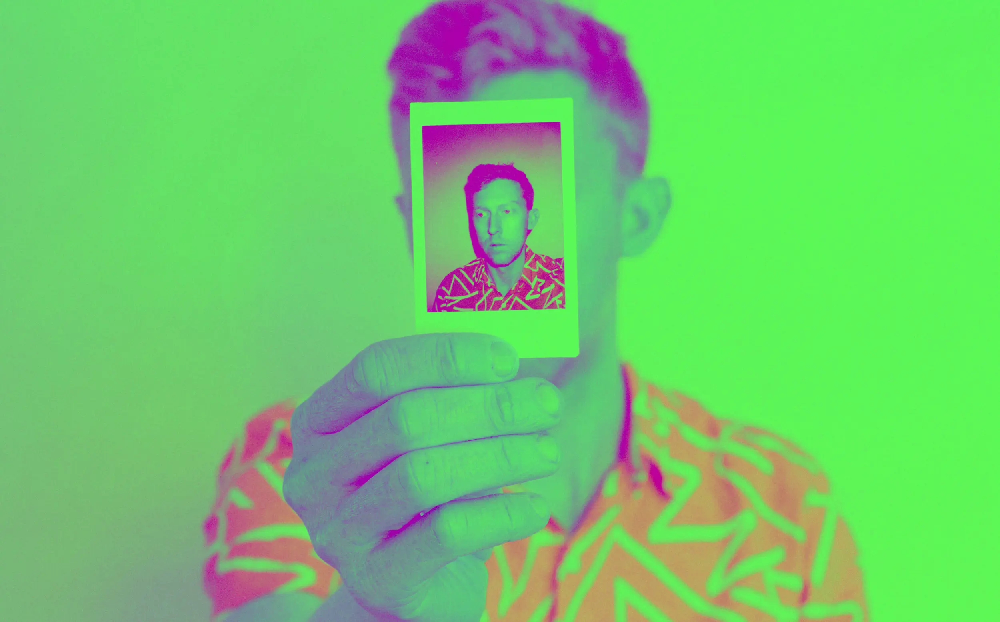

---
date:
    created: 2025-05-06T21:45:00Z
categories:
    - News
authors:
    - em
description: Age verification laws and propositions forcing platforms to restrict content accessed by children and teens have been multiplying in recent years. The problem is, implementing such measure necessarily requires identifying each user accessing this content, one way or another. This is bad news for your privacy.
schema_type: AnalysisNewsArticle
preview:
  cover: blog/assets/images/age-verification-wants-your-face/ageverification-cover.webp
---

# Age Verification Wants Your Face, and Your Privacy

<small aria-hidden="true">Photo: Kyle Glenn / Unsplash</small>

Age verification laws and propositions forcing platforms to restrict content accessed by children and teens have been multiplying in recent years. The problem is, implementing such measures necessarily requires identifying each user accessing this content, one way or another. This is bad news for your privacy.<!-- more -->

For a few years now, several legislators in North America, Europe, and Australia have expressed concern about children and teens accessing certain types of content online. While there is no doubt some online content can be worrisome, implementing a technological solution for this is [extremely problematic](https://www.jonaharagon.com/posts/age-verification-is-incompatible-with-the-internet/).

By mandating platforms to be legally responsible to verify a user's age, regulators effectively force them to identify each user requesting access to content deemed inappropriate under a certain age threshold.

If these regulations continue to proliferate, this could lead to the end of pseudonymity online.

## How can age be verified online

Verifying age online is [difficult](https://www.woodhullfoundation.org/fact-checked/online-age-verification-is-not-the-same-as-flashing-your-id-at-a-liquor-store/). There isn't any magical solution to it, it's either recording how a user looks or scanning official documents.

Conducting verification "on-device" offers only few additional protections considering this information still has to be checked and reported with an external service, somehow.

Moreover, processes used to keep this data "on-device" are often opaque. Taking into account how valuable this information is, it becomes very difficult to trust any for-profit third-party services which such a sensitive task.

Users' faces and official documents are two types of very sensitive information. Who becomes responsible to collect, process, store, and safeguard this data? With whom does this data get shared, and for which other purposes? And how accurate is this data anyway?

### Facial scans

Some platforms and third-party providers of the rapidly growing "[identity verification industry](https://www.businessresearchinsights.com/market-reports/digital-identity-verification-market-118180)" have started to use facial recognition and face scan systems in order to determine a user's age.

The problem is, the systems are [horrible for everyone's privacy](https://www.liberties.eu/en/stories/facial-recognition-privacy-concerns/44518), extremely problematic to use due to [racist and gendered biases](https://www.aclu-mn.org/en/news/biased-technology-automated-discrimination-facial-recognition), [inaccurate](https://www.eff.org/deeplinks/2025/01/face-scans-estimate-our-age-creepy-af-and-harmful) to determine the correct age, and on top of all that, [can be cheated](https://www.theregister.com/2022/05/22/ai_in_brief/).

### Official documents

The second solution is to require users to provide an official piece of ID. Considering an official ID often contain a photo, full legal name, date of birth, home address, and government specific codes, this is even worse.

All this sensitive data then gets collected by either the platform itself or a third-party provider with little oversight or incentive to protect this data at all. Leaks and breaches for this enormous data trove are just around the corner. Unfortunately, this isn't speculative, [data leaks have already occurred](https://www.404media.co/id-verification-service-for-tiktok-uber-x-exposed-driver-licenses-au10tix/).

The more copies of your official documents exist online, the greater the risk this data *will get exposed*, and the less value this document has to actually identify you when it's *truly* needed.

And again, this sort of verification is easy to cheat. Any determined teenager will soon learn how to either create a fake ID, use someone else's ID, or go around this verification system in another way.

Age verification laws will *without a doubt* support a flourishing criminal industry to provide fake or stolen IDs even more easily online.

## Where age verification is (or will be) required

In April this year, [Discord started to test age verification systems](https://www.theverge.com/news/650493/discord-age-verification-face-id-scan-experiment) using facial or ID scans, as a way to comply with [Australia](https://www.bbc.co.uk/news/articles/c89vjj0lxx9o)'s and [UK](https://www.theverge.com/2023/10/26/23922397/uk-online-safety-bill-law-passed-royal-assent-moderation-regulation)'s new laws.

This measure only applies to access certain protected posts for users located in Australia and the United Kingdom and at this time, but don't be surprised if it soon gets implemented at the account level for users everywhere.

In the [United States](https://action.freespeechcoalition.com/age-verification-resources/state-avs-laws/), many states have already passed some types of age verification laws, and several others have proposed such laws. In [Canada](https://www.eff.org/deeplinks/2024/09/canadas-leaders-must-reject-overbroad-age-verification-bill) and [Europe](https://digital-strategy.ec.europa.eu/en/funding/call-tenders-development-consultancy-and-support-age-verification-solution), legislators have also been pushing for similar regulations to block content online subject to age verification.

There is no doubt the more countries pass similar prohibitive laws, the more other countries will soon follow.

Some hope however, this month a US federal judge ruled an age verification [law in Arkansas unconstitutional](https://thehill.com/homenews/state-watch/5228836-judge-blocks-social-media-age-verification-law-in-arkansas/).

## Who decides what is sensitive content

When talking about age verification, most assume this only applies to obvious pornographic content. However, many of these laws have [much wider reach](https://www.eff.org/deeplinks/2025/01/impact-age-verification-measures-goes-beyond-porn-sites).

For example, the Australian law prohibits access to social media altogether for anyone under the age of 16. This means that, once the law comes into full effect after its transitional period, anyone who uses social media in Australia will have to prove they are older than this age. It is likely that all Australian users will have to provide some form of identifying data to continue using their social media accounts. **This is a privacy nightmare.**

When laws target specific content, definition of what is appropriate and what isn't is often too broad. Moreover, this definition is subject to change from one administration to another.

There are also wide differences from one country to another. For example, some countries sadly consider simple discussions of gender identity or sexual orientation to be sensitive content. What is deemed inappropriate to children in one culture might not be the same in another.

Automating this sort of censorship leads to a lot of misfiring. There has already been numerous instances of [breastfeeding photos mislabelled](https://www.cbc.ca/news/world/facebook-clarifies-breastfeeding-pics-ok-updates-rules-1.2997124) for nudity. Important educational material for sex education could get censored and inaccessible to children, who critically need access to it *before* adulthood.

Who will decide which content should be censored and which shouldn't? Will countries hosting the big tech platforms end up having a greater decision power in the matter? Will platforms simply decide to apply the strongest level of restriction worldwide?

## Age verification isn't effective

Even if we could somehow find a global consensus that is perfectly ethical and never misfires on which content children shouldn't access, it will likely fail.

Children, and teenagers especially, are and have always been incredibly effective at going around such limitation to feed their curious minds.

First, there are technical tools such as VPNs and proxies of all sort to go around location-based restrictions. Then, there's the classic fake ID, and its modern evolution: deepfake face. There will also be without a doubt a growing market of pre-verified "adult" accounts up for sale online.

Perhaps age verification measures will work for a couple of months, until products to evade it get the word out, then they'll become useless. Only leaving the ashes of your social media legal consenting adult pseudonymity in its path.

## Why it's bad news for everyone's privacy

Age verification will require all platforms and/or third-party identification service providers to collect an enormous trove of sensitive data on everyone.

This goes against all principles of data minimization, generally a vital part of data protection regulations.

Daily occurrences of data breach incidents have taught us we cannot trust these services to safeguard our data. Data breaches for this sensitive information are only a matter of time.

The concentration of such valuable data will likely be monetized and resold either by the platforms themselves, by the for-profit third-party "age assurance" providers they use, or eventually by the criminals who stole it from them.

This data trove will include face scans of children with their location (trying to pass as adults), and faces and official documents from every adult in the world using social media, if this kind of regulation gets implemented at large.

**The privacy and safety implications of this are absolutely disastrous**.

## Age verification is not the solution

Sadly, age verification legislation will not help safeguard children from harmful content online, but it will effectively remove protection for anyone needing pseudonymity online to [stay safe](privacy-means-safety.md). Moreover, it will put everyone at a much greater risk of victimization by identify theft, impersonation, stalking, and worse.

Despite the perhaps well-intended legislators, technological solutions aren't always adequate to solve every problem we have. Here again, education and content moderation are likely much better ways to deal with this sort of issues.

In the meantime, don't be surprised if you cross a teenager on the street suddenly pointing their phone to scan *your* adult face, or a young relative looking in your wallet. They probably won't be looking for your money, but most likely for your adult ID.
