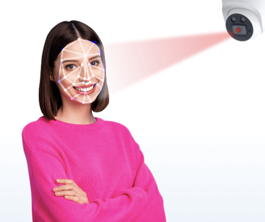
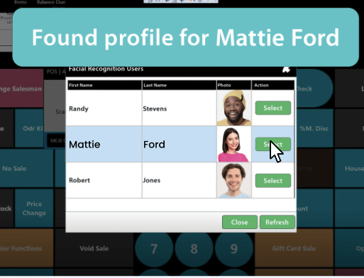

---
date:
    created: 2025-09-02T17:30:00Z
categories:
    - Explainers
authors:
    - fria
tags:
    - Biometrics
license: BY-SA
schema_type: BackgroundNewsArticle
description: Biometrics are widely used for both malicious and legitimate reasons. How widespread is the abuse of biometric data, and is there anything you can do about it?
preview:
  cover:
---

# An Overview of Biometric Abuses

Almost everyone has dealt with biometric data at some point, whether it's for authentication on your phone, or taking a photo for your driver's license, any time you're using data derived from your body to be identified it's biometrics.

There's nothing inherently wrong with biometric authentication, in fact it's one of the pillars of secure [multi-factor authentication](https://csrc.nist.gov/glossary/term/Multi_Factor_Authentication): something you know, something you have, and **something you are**. Plenty of systems use biometrics in a private way. Your phone, for example, stores your biometric data safely inside its [secure element](https://support.apple.com/guide/security/biometric-security-sec067eb0c9e/1/web/1); it never leaves your device and can't easily be extracted. This is one of the most important aspects of **ethical biometrics**: the data should never be stored on a server somewhere or accessible to anyone, even you.<!-- more -->

But many biometric systems in place today aren't designed to preserve your privacy and simply exist to track you around. I touched on a few of these in a [previous article](https://www.privacyguides.org/articles/2025/02/13/biometrics-explained/) but I'd like to expand on just how pervasive the issue is.

## Surveillance Systems

Plenty of organizations want to be able to track you around for a multitude of reasons, from governments to grocery stores. Unfortunately, your human body has plenty of unique signatures that can identify you individually.

Since you can't change your body (without extensive surgical modification which would then quickly become your new permanent identifier anyway), measuring its characteristics is the perfect way to surveil you everywhere you go, from the grocery store to public spaces, anywhere could be hiding Big Brother-style surveillance apparatus.

### FTx Identity

First up on the wall of shame, [FTx](https://ftxidentity.com/industry/in-store-age-verification/). They promise to revolutionize "in-store age verification & customer tracking" using a network of cameras set up all over the store, allowing for constant monitoring and identification via facial recognition.

<figcaption>"Help me"</figcaption>

You're then recorded under the permanent profile they keep for you that's displayed on the POS systens the employees see.

They say it "monitors movement from entry to exit with real-time visuals". It's a bit creepy to think there's a real-time updated map of where I am in the store at all times.

They also keep track of "customer history—previous purchases, preferences, and identity status". If you thought tracking profiles of your purchases and actions were exclusive to the web, you're wrong.

The tracking is stated to be used for marketing and anti-theft purposes. Since the system is AI-driven, hopefully it doesn't randomly decide you're a thief and sound the alarm on you.