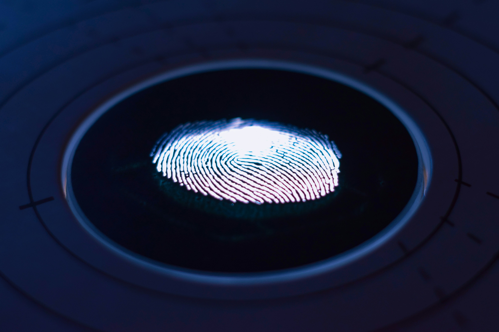

---
date:
    created: 2024-12-29
categories:
    - Opinion
authors:
    - fria
tags:
    - Biometrics
license: BY-SA
---
# Biometrics Explained

Biometrics are a convenient and secure way to authenticate our devices. Many of us use and trust the biometrics of our devices without much thought, but are they really secure? With so many different [options](https://www.biometricsinstitute.org/what-is-biometrics/types-of-biometrics/), which ones are the best?<!-- more -->

## :material-fingerprint: Fingerprint

One of the most recognizable types of biometric authentication has to be the fingerprint reader. The idea is that everyone has a fairly unique fingerprint, so we should be able to distinguish between your fingerprint and someone else's reliably. (1)
{ .annotate }

1. :material-fingerprint: It's theorized that the reason humans have fingerprints in the first place is to [enhance our sense of touch](https://www.science.org/doi/10.1126/science.1166467).

There are [three](https://www.androidauthority.com/how-fingerprint-scanners-work-670934/) main ways we accomplish this in consumer devices: optical sensors, capacitive sensors, and ultrasonic sensors.

### :material-camera: Optical Fingerprint Sensors

An optical sensor works just like you'd think it would: by taking a picture of your fingerprint and turning it into data. These are the cheapest and least secure option. They're potentially vulnerable to an attacker simply taking a picture of your fingerprint, since they only capture a two-dimensional image.

Many devices implement one of these sensors under the display. You can tell if yours does because it will flash you with a bright light when you try to scan your finger. This happens so the optical sensor can capture a clear image of your finger.

Optical sensors can also struggle in the presence of bright sunlight, which is an issue on a mobile device that you take around with you and use wherever you are.

### :material-lightning-bolt: Capacitive Fingerprint Sensors

Capacitive sensors measure the electrical conductivity of your finger. These are much more secure than optical sensors since they can't be fooled with an image. They're also tough to fool with prosthetics as different materials will have different electical properties.

Capacitive sensors won't work if the [tissue is dead](https://www.livescience.com/62393-dead-fingerprint-unlock-phone.html), since dead tissue loses all electical charge. So morbid worries about someone using your dead body to unlock your phone can be assuaged.

Conveniently they also don't require a light source under them to work, although they will struggle in the presence of moisture.

### :material-volume-high: Ultrasonic Fingerprint Sensors

Ultrasonic fingerprint sensors use sound to create a detailed 3D representation of your fingerprint. This is the most expensive type of sensor but it produces the most accurate readings with the highest reliability. It doesn't matter if your finger is a bit dirty or wet, it will still work unlike optical or capacitive sensors.

One downside is that you lose the protection against dead tissue that capacitive sensors offer, but this is not relevant for most people.

### Additional Considerations

Fingerprint unlock will inherently be vulnerable to someone forcing you to put your finger on the sensor to unlock your device, so keep this in mind when threat modeling.

They also won't work with gloves and sometimes screen protectors can interfere, so make sure that the sensor is uncovered and making direct contact with your actual finger.

Fingerprint authentication will protect you against someone filming you surreptitiously while typing in your password or shoulder surfing. This is an especially relevant attack if your threat model includes thieves as a common attack is watching you type your passcode in and then stealing your phone.

## :material-face-recognition: Face Unlock

Many devices come with the capability to unlock them using your face. The [implementations](https://www.androidauthority.com/face-unlock-smartphones-3043993/) of this technology can vary wildly between manufacturers since a secure implementation requires a lot of special hardware, so many OEMs choose to cheap out. All forms of face unlock are more likely to allow a twin or sibling into your device since their face is more similar to yours than a random person off the street, so keep that in mind in your threat model.

### :material-camera-front: 2D Camera Face Unlock

Every phone already has a camera, so why not use it for face unlock? There are many reasons.

If you're relying on a plain 2D image, then there's always the possibility that it could be fooled by a regular photo. Someone getting in to your phone because they have a picture of your face is a security nightmare scenario and the only thing stopping it is the whims of whatever algorithm was programmed into your phone.

This form of face unlock is also less likely to work in low-light conditions than infrared variants.

### :material-heat-wave: 2D Infrared Face Unlock

The next step up in security is an infrared sensor. This requires dedicated hardware to be built into the device, which eats up space and adds cost. But what you get in return is a form of face unlock that's more reliable in low-light conditions and more resistant to photographs.

### :material-cube-scan: 3D Face Unlock

The potential of this technology truly shines when 2D face unlock is combined with an infrared flood illuminator. These are able to shine thousands of invisible infrared dots on your face and record the distance of each one, creating a 3D map of your face. As you can probably imagine, this tech takes up quite a bit of space and adds yet more cost to the device, as well as likely being the main reason for the "notch" on iPhones. This drawback is well worth it though. According to [Apple](https://support.apple.com/en-us/102381):

>The probability that a random person in the population could look at your iPhone or iPad Pro and unlock it using Face ID is less than 1 in 1,000,000 with a single enrolled appearance whether or not you're wearing a mask.

They put the odds for Touch ID around [1 in 50,000](https://support.apple.com/en-us/105095) for comparison.

3D face unlock is immune to 2D images and requires a 3D reconstruction of a face before it has a chance of being fooled.

### Additional Considerations

You'll likely want an implementation with some protection against another person pointing your phone at your face to unlock it. iOS allows you to enable a setting where you need to be looking at the phone before it will unlock, look for a similar feature when shopping for a device.

## :material-eye: Iris Sensors

A spy movie classic but newcomer in the consumer electronics field, iris sensors offer authentication via the unique properties of your eyes. The Apple Vision Pro is the most notable example with its [Optic ID](https://support.apple.com/en-us/118483).

It uses near-infrared light to reveal highly unique patterns independent of the pigmentation of your eyes. Apple estimates the liklihood of a random person being able to unlock your Optic ID at less than 1 in 1,000,000, similar to Face ID.

The extremely short distance this technology operates at makes it very difficult for someone to unlock your device without you noticing, and you can simply close your eyes to prevent someone from forcing you to unlock it.

## :material-keyboard: Typing Biometrics

Companies like [TypingDNA](https://www.typingdna.com) claim to be able to identify users by how they type.

The stated usecase is 2FA and continuous authentication for employee devices. Likely you'll only encounter this technology on work devices, especially since this type of biometrics will be affected by the type of keyboard you're using. It only really makes since to authenticate on a specific device that you'll be using continuously and typing on a lot, such as a work laptop.

It could also be used on websites to uniquely identify you, so type in a text editor program then copy/paste into the browser window to avoid this specific type of fingerprinting.

## :material-walk: Gait Biometrics

Possibly the most insidious of the biometrics in widespread use is gait recognition. Yes, you can be uniquely identified just by how you walk. Combined with the huge network of cameras deployed in most cities, you can potentially be identified and tracked around even with a fully covered face.

This type of biometric is mainly useful for surveillance purposes rather than authentication but it's good to be aware of since it will likely be used against you in any highly populated area.

## :material-chip: Secure Element

All forms of biometric authentication rely on proper hardware such as a secure element in order to be secure. You should avoid devices that lack a secure element; they won't be able to properly implement secure biometrics without one.

## :material-matrix: Algorithm

Because biometrics need to translate the physical properties of your body to data, they rely on an algorithm to determine if their reading matches closely enough. 

Since these algorithms rely on machine learning most of the time, the only way to verify their security is through testing. [Android](https://source.android.com/docs/security/features/biometric) has guidelines on how OEMs should implement biometrics and how they can [test](https://source.android.com/docs/security/features/biometric/measure) them for security. If you're performing your own security research, you should look here for guidance on testing methodology.

There is also independent research into the security of biometric systems. This combination of external and internal rigor helps ensure the security of these systems, although more well known brands like Apple and Google will receive more scrutiny than lesser-known ones.