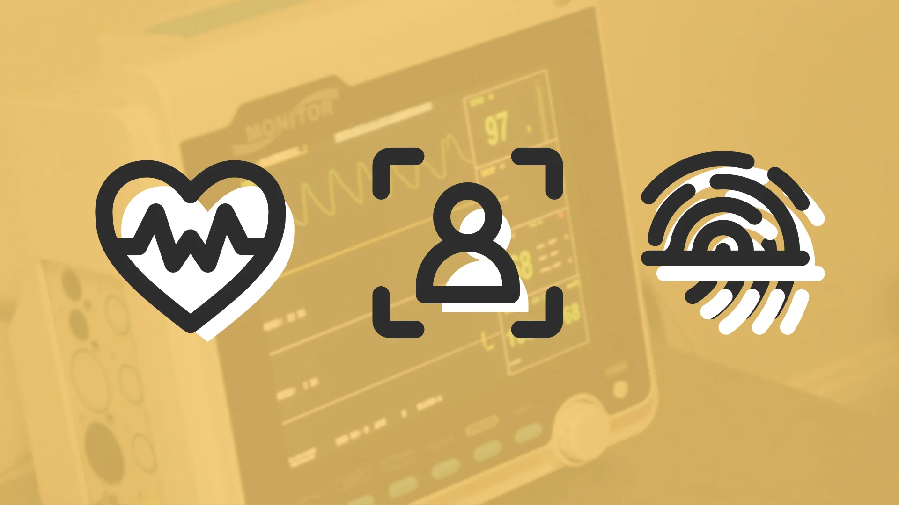
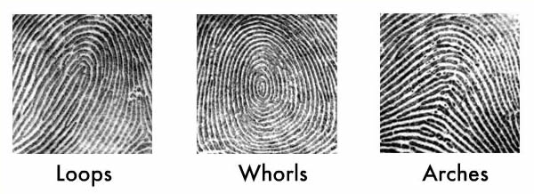
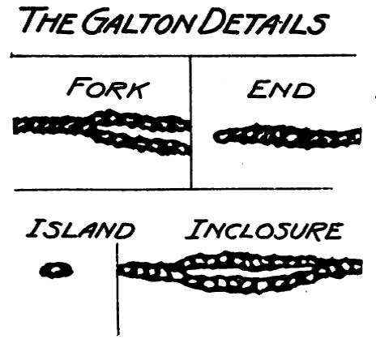
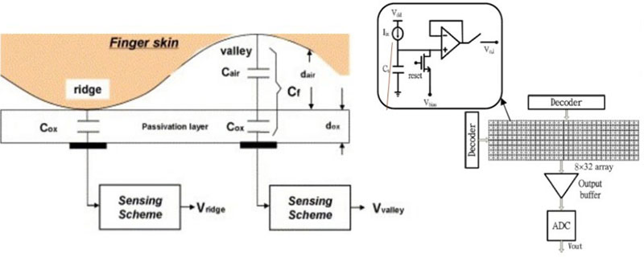
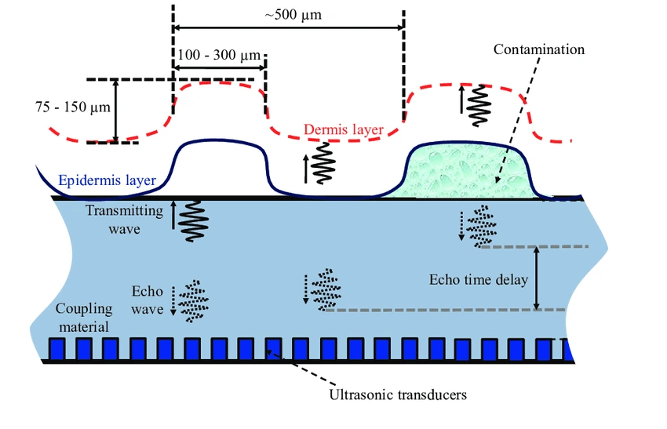
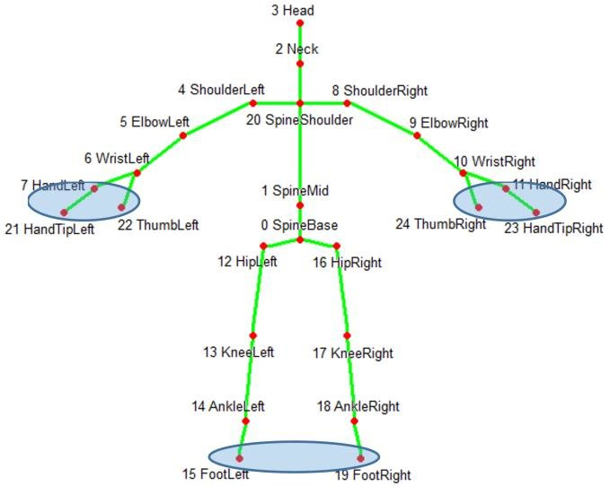
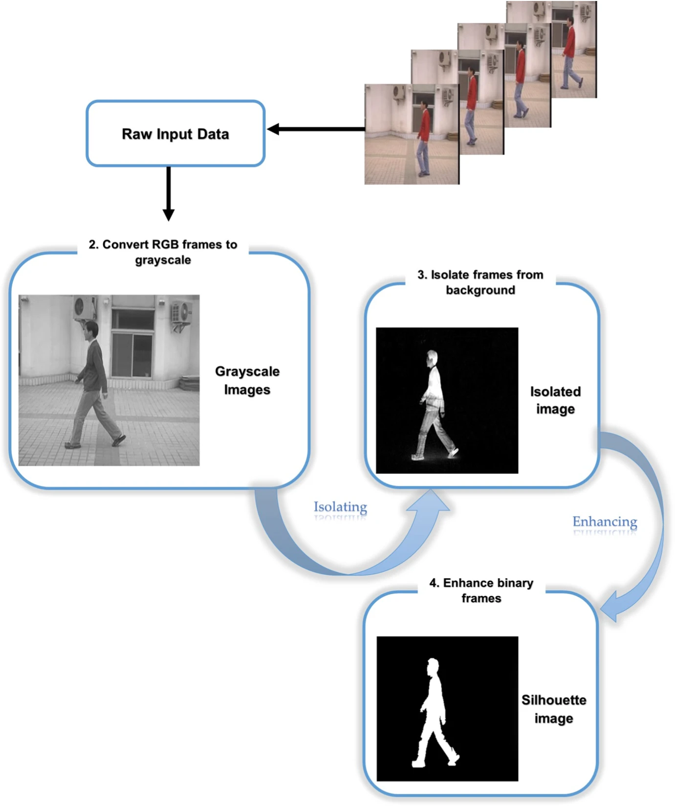

---
date:
    created: 2025-02-13T19:00:00Z
categories:
    - Explainers
authors:
    - fria
tags:
    - Biometrics
license: BY-SA
schema_type: BackgroundNewsArticle
description: |
  Biometrics are a convenient and secure way to authenticate our devices. Many of us use and trust the biometrics of our devices without much thought, but are they really secure? With so many options, which ones are the best?
---
# Biometrics Explained

<small aria-hidden="true">Illustration: Jonah Aragon / Privacy Guides | Photo: Jair Lázaro / Unsplash</small>

Biometrics are a convenient and secure way to authenticate our devices. Many of us use and trust the biometrics of our devices without much thought, but are they really secure? With so many [options](https://www.biometricsinstitute.org/what-is-biometrics/types-of-biometrics/), which ones are the best?<!-- more -->

## :material-fingerprint: Fingerprint sensors

One of the most recognizable types of biometric authentication has to be the fingerprint reader. The idea is that everyone has a fairly unique fingerprint, so we should be able to distinguish between your fingerprint and someone else's reliably.

There are three main types of fingerprint: loops, whorls, and arches. Fingerprint sensors categorize your finger into these groups before using other details to uniquely identify your fingerprint. You might think that you could count the number of arches/whorls/loops, but there can be many people with the same configuration and number of these. Also fingerprint sensors won't be able to see your entire fingerprint most of the time, they are designed to work at weird angles and with a partial scan, so it's not viable to use the whole fingerprint for authentication.

<small aria-hidden="true">Image Credit: <a href="https://engines.egr.uh.edu/episode/2529">University of Houston</a></small>

[Finger minutiae](https://sites.rutgers.edu/fingerprinting/no-two-finger-prints-are-alike/) data is used to identify a fingerprint as unique. This data consists of the points on your fingerprint where lines split, abruptly end, individual dots, etc. Two people can have the same number of arches, loops, and whorls, but they won't have the exact same configurations of minutiae. (1)
{ .annotate }

1. :material-fingerprint: It's theorized that the reason humans have fingerprints in the first place is to [enhance our sense of touch](https://www.science.org/doi/10.1126/science.1166467).

<small aria-hidden="true">Image Credit: <a href="https://sites.rutgers.edu/fingerprinting/no-two-finger-prints-are-alike/">Rutgers University</a></small>

Using these details for identification gives several advantages over trying to read the whole fingerprint. It allows the device to use less processing power, as well as providing some flexibility in case your finger is smudged or at a strange angle. The sensor doesn't even need to see your whole fingerprint. You might notice some fingerprint readers are very thin and might be located in a convenient place like a power button; finger minutiae is what allows them to still operate securely.

There are [three](https://www.androidauthority.com/how-fingerprint-scanners-work-670934/) main ways we accomplish this in consumer devices: optical sensors, capacitive sensors, and ultrasonic sensors.

### :material-camera: Optical

An optical sensor works by taking a picture of your fingerprint and turning it into data. They are the cheapest and least secure option. Since optical sensors capture two-dimensional images, an attacker may gain access by simply taking a picture of your fingerprint.

<small aria-hidden="true">Image Credit: <a href="https://clockit.io/fingerprint-scanner/">clockit.io</a></small>

Many devices implement one of these sensors under the display.

Optical sensors can struggle in the presence of bright sunlight, which is an issue on a mobile device that you take around with you and use wherever you are.

### :material-lightning-bolt: Capacitive

Capacitive sensors measure the electrical conductivity of your finger. These are much more secure than optical sensors since they can't be fooled with an image. They're also tough to fool with prosthetics as different materials will have different electrical properties.

<small aria-hidden="true">Image Credit: <a href="https://www.bayometric.com/capacitive-vs-optical/">Bayometric</a></small>

Capacitive sensors won't work if the [tissue is dead](https://www.livescience.com/62393-dead-fingerprint-unlock-phone.html), since dead tissue loses all electrical charge. So morbid worries about someone using your dead body to unlock your phone can be assuaged.

Conveniently they also don't require a light source under them to work, although they will struggle in the presence of moisture.

### :material-volume-high: Ultrasonic

Ultrasonic fingerprint sensors use sound to create a detailed 3D representation of your fingerprint using ultrasound waves (sound waves with a frequency greater than 20khz). It's a similar concept to what's used to map the ocean floor: sound is emitted from transducers and bounces off your skin. By measuring the time it takes for the sound to reach the microphones, your phone can create a detailed map of the ridges and valleys in your finger.

<small aria-hidden="true">Image Credit: <a href="https://www.researchgate.net/publication/285770473_Piezoelectric_Micromachined_Ultrasonic_Transducers_for_Fingerprint_Sensing">Yipeng Lu</a></small>

This is the most expensive type of sensor, but it produces the most accurate readings with the highest reliability. It doesn't matter if your finger is a bit dirty or wet, it will still work unlike optical or capacitive sensors.

Ultrasonic sensors can't be fooled by 2D images.

One downside is that you lose the protection against dead tissue that capacitive sensors offer, but this is not relevant for most people.

### Additional considerations

Fingerprint unlock will inherently be vulnerable to someone forcing you to put your finger on the sensor to unlock your device, so keep this in mind when threat modeling.

They also won't work with gloves and sometimes screen protectors can interfere, so make sure that the sensor is uncovered and making direct contact with your actual finger, or otherwise using an OEM-approved covering.

Fingerprint authentication will protect you against someone filming you surreptitiously while typing in your password or shoulder surfing. This is an especially relevant attack if your threat model includes thieves as a common attack is watching you type your passcode in and then stealing your phone.

## :material-face-recognition: Face unlock

Many devices come with the capability to unlock them using your face. The [implementations](https://www.androidauthority.com/face-unlock-smartphones-3043993/) of this technology can vary wildly between manufacturers since a secure implementation requires a lot of special hardware, so many OEMs choose to cheap out. All forms of face unlock are more likely to allow a twin or sibling into your device since their face is more similar to yours than a random person off the street, so keep that in mind in your threat model.

### :material-camera-front: 2D camera-based

Every phone already has a camera, so why not use it for face unlock?

If you're relying on a plain 2D image, then there's always the possibility that it could be fooled by a [regular photo](https://www.theregister.com/2023/05/19/2d_photograph_facial_recog/). Someone getting in to your phone because they have a picture of your face is a security nightmare scenario and the only thing stopping it is the whims of whatever algorithm was programmed into your phone.

This form of face unlock is also less likely to work in low-light conditions than infrared variants.

### :material-heat-wave: 2D infrared-based

The next step up in security is an infrared sensor. This requires dedicated hardware to be built into the device, which eats up space and adds cost. But what you get in return is a form of face unlock that's more reliable in low-light conditions and more resistant to photographs.

### :material-cube-scan: 3D mapping

The potential of this technology truly shines when 2D face unlock is combined with an infrared flood illuminator. These are able to shine thousands of invisible infrared dots on your face and record the distance of each one, creating a 3D map of your face. As you can probably imagine, this tech takes up quite a bit of space and adds yet more cost to the device, as well as likely being the main reason for the "notch" on iPhones. This drawback is well worth it though. According to [Apple](https://support.apple.com/en-us/102381):

>The probability that a random person in the population could look at your iPhone or iPad Pro and unlock it using Face ID is less than 1 in 1,000,000 with a single enrolled appearance whether or not you're wearing a mask.

They put the odds for Touch ID around [1 in 50,000](https://support.apple.com/en-us/105095) for comparison.

3D face unlock is immune to 2D images and requires a 3D reconstruction of a face before it has a chance of being fooled.

### Additional considerations

You'll likely want an implementation with some protection against another person pointing your phone at your face to unlock it. iOS allows you to enable a setting where you need to be looking at the phone before it will unlock (called "Require Attention for Face ID"), look for a similar feature when shopping for a device.

Some devices allow for unlocking with a facemask. This is less secure than without a facemask, so keep that in mind when enabling this setting.

## :material-eye: Iris sensors

A spy movie classic but newcomer in the consumer electronics field, iris sensors offer authentication via the unique properties of your eyes. The Apple Vision Pro is the most notable example with its [Optic ID](https://support.apple.com/en-us/118483).

It uses near-infrared light to reveal highly unique patterns independent of the pigmentation of your eyes. Apple estimates the likelihood of a random person being able to unlock your Optic ID at less than 1 in 1,000,000, similar to Face ID.

The extremely short distance this technology operates at makes it very difficult for someone to unlock your device without you noticing, and you can simply close your eyes to prevent someone from forcing you to unlock it.

## :material-matrix: Algorithm

Because biometric systems need to translate the physical properties of your body to data, they rely on an algorithm to determine if their reading matches closely enough.

[Android](https://source.android.com/docs/security/features/biometric) has guidelines on how OEMs should implement biometrics and how they can [test](https://source.android.com/docs/security/features/biometric/measure) them for security. If you're performing your own security research, you should look here for guidance on testing methodology.

There is also independent research into the security of biometric systems. This combination of external and internal rigor helps ensure the security of these systems, although more well known brands like Apple and Google will receive more scrutiny than lesser-known ones.

## :material-keyboard: Typing biometrics

Companies like [TypingDNA](https://www.typingdna.com) claim to be able to identify users by how they type.

The stated use case is 2FA and continuous authentication for employee devices. Likely you'll only encounter this technology on work devices, especially since this type of biometrics will be affected by the type of keyboard you're using. It only really makes sense to authenticate on a specific device that you'll be using continuously and typing on a lot, such as a work laptop.

It could also be used on websites to uniquely identify you, so type in a text editor program then copy/paste into the browser window to avoid this specific type of fingerprinting.

## :material-walk: Gait biometrics

Possibly the most insidious of the biometric systems in widespread use is gait recognition. Yes, you can be uniquely identified just by how you walk.

### :material-camera: Camera

This technology can work using only 2D footage and doesn't even require close proximity or high resolution sensors like other forms of biometrics. Combined with the huge network of cameras deployed in most cities, you can potentially be identified and tracked around even with a fully covered face.

This type of biometric can work without your consent and when other identifiable features such as face and fingerprints are hidden. It's also very difficult to impersonate someone else's gait.

There are two approaches for extracting biometric data from video.

#### Model-based

This approach attempts to model the human body in order to track the different parts of it. A well-known example of this approach is the Microsoft Kinect, which only consists of a fairly low-resolution camera. It simplifies the human body into a stick figure, which you can see in footage of the [Kinect](https://www.youtube.com/watch?v=33AsuE-WP64) in action. It then uses the distances and joint angles of the model for gait recognition.

<small aria-hidden="true">Image Credit: <a href="https://www.researchgate.net/publication/334049964_Markerless_Human_Motion_Tracking_Using_Microsoft_Kinect_SDK_and_Inverse_Kinematics">Alireza Bilesan, Saeed Behzadipour, Teppei Tsujita, Shunsuke Komizunai, and Atsushi Konno</a></small>

#### Model-free

Model-free approaches don't try to model the human body but instead use the whole motion of human silhouettes. This gives a few advantages: it works regardless of camera quality, and it takes significantly fewer resources.

<small aria-hidden="true">Image Credit: <a href="https://doi.org/10.1007/s11227-023-05156-9">Yousef, R.N., Khalil, A.T., Samra, A.S. et al.</a></small>

### :material-axis-arrow: Accelerometer

Accelerometers such as those found in your smartphone can also be used for gait recognition. These need to be worn on a person's body, so they can't be used from long distance like camera-based approaches.

Accelerometers work by measuring the accelerations in 3D space in X, Y, and Z coordinates. They tend to also utilize gyroscopes, which measure the orientation of a device.

### :material-foot-print: Floor sensor

It's possible to identify individuals using [sensors](https://www.amti.biz/product/bms464508/) in the floor that measure the pressure of your steps as you take them. There are already companies offering software/hardware [installations](https://www.scanalyticsinc.com/how-it-works) for tracking customers within a store using this technology.

>Scanalytics floor sensors capture up to 100% of foot traffic through your buildings and spaces. Capturing individual footsteps and the paths they form, we are able to monitor and analyze complete space movements and usage.

Floor sensors are especially concerning since they're completely invisible to you.

### :material-radar: Radar

Radar works by transmitting a signal and measuring how long it takes for that signal to return, allowing you to measure how far an object is from you. In addition, if an object is moving relative to the sensor, the reflected waves will be a different frequency than when they were transmitted due to the [Doppler effect](https://www.noaa.gov/jetstream/doppler/how-radar-works). This can be used to determine the speed of an object and whether it's moving toward or away from you.

Using a continuous wave (CW) radar that's constantly emitting a signal, it's possible to measure the movements of all the different parts of your body during your gait to identify you uniquely. This is called a [micro-Doppler](https://books.google.com/books?hl=en&lr=&id=SVCQDwAAQBAJ&oi=fnd&pg=PA1&ots=cqJxAh_rPv&sig=bBz1w4h-C4nDrzNwiRvZUexKbnc#v=onepage&q&f=false) signature. These sensors can even be sensitive enough that they can pick up breathing and heartbeats of humans trapped in rubble during rescue operations.

[GaitMetrics](https://gaitmetrics.com/applications/) is a company claiming to offer mmWave gait recognition technology.

>It is also possible to identify the intruder’s unique radio gait IDs and capture them in a database. Any intruder with an unknown radio gait ID detected within the premises will trigger an alarm, and the intruder’s location will be tracked down.

They claim it can uniquely identify individuals as well as penetrate walls, a worrying combination.

## What makes biometrics private?

### :material-cloud-off: Local Storage

As with most things, keeping everything on your device is the key to private biometrics. A secure and private biometric authentication system should store any biometric data fully on-device and further, shouldn't make it accessible at all, even to the user. Biometric data is so incredibly sensitive and uniquely identifying that it needs to be treated with the utmost care. For example, apps on your phone don't have direct access to your fingerprint or face data, they must use an [API](https://developer.apple.com/documentation/localauthentication) to use biometric authentication.

On the other end of the spectrum we have companies like [IDEMIA](https://www.idemia.com) which boast about their [Augmented Vision](https://www.idemia.com/wp-content/uploads/2021/01/augmented-vision-platform-idemia-brochure-202102.pdf), designed to take video data from the myriad surveillance cameras littering every US city and track you around everywhere you go. It combines facial recognition, object recognition, plate reading, and much more to create an Orwellian surveillance apparatus that stores all your data in some server somewhere, fully accessible to their customers (or any hackers that want a treasure trove of surveillance data). They also have a product called [Mobile Biometric Check](https://www.idemia.com/wp-content/uploads/2021/02/mobile-biometric-check-idemia-brochure-202007.pdf) that allows cops to use their phone camera to take a picture of your fingerprints and compare them to a database. This is the exact opposite of responsible biometrics.

### :material-chip: Secure Element

All forms of biometric authentication rely on proper hardware such as a secure element in order to be secure. The secure element provides a secure and tamper-resistant place to store your biometric data separate from the rest of the system, so it can't be easily extracted. Examples include Apple's [Secure Enclave](https://support.apple.com/guide/security/secure-enclave-sec59b0b31ff/web) and Google's [Titan M](https://security.googleblog.com/2021/10/pixel-6-setting-new-standard-for-mobile.html) series of chips. You should avoid devices that lack a secure element; they won't be able to properly implement secure biometrics without one.

### Final thoughts

Like all technology, biometrics aren't inherently good or bad. They're used to secure our devices and make authentication smooth and easy, but they're also used for [mass surveillance](https://therecord.media/europe-gait-recognition-study-pilot-program). Especially now with the rise of AI, we've started to leave the realm of scientifically rigorous usages and into the realm of digital snake oil, with companies like Cursor Insight launching their [MotionScore](https://www.motionscore.ai) product.

>Our patent-pending AI technology identifies hidden patterns in signatures and online or mobile user interactions. These patterns can reflect behaviors and personal characteristics relevant to creditworthiness and reliability.

It should go without saying that making decisions about whom to give a loan to based on... how they sign their name or some other mystery movement data is ludicrous, laughable if it wasn't affecting real people's lives. Now more than ever we need to be educated about the biometric technology that we use and that's used against us. The [EFF](https://sls.eff.org/technologies/biometric-surveillance) is a great resource that documents and fights against abuses of biometric technology.

Many of the same technologies used for mass surveillance are also used for [helpful](https://www.amti.biz/2024/08/28/amti-technology-featured-in-triple-crown-power-5-fastpitch-tournament/) purposes. It's up to us to ensure responsible use of technology going forward.
