---
date:
    created: 2025-01-30T21:50:00
categories:
    - Tutorials
authors:
    - kevpham
tags:
    - Browsers
    - Firefox
license: BY-SA
description: A beginner's guide to clearing browsing data - such as cookies, website cache, and browsing history, on Chrome, Firefox, and Safari.
schema_type: BackgroundNewsArticle
---
# How to Clear Your Browsing Data on Chrome, Firefox, and Safari

<small aria-hidden="true">Photo: Dimmis Vart / Unsplash</small>

Your browsing data — such as cache, cookies, and browsing history — can accumulate over time, potentially damaging your privacy. Whether you trying to free up storage, limit tracking, or protect yourself from digital forensics, clearing browsing data is an important first step on your privacy journey. In this guide, we will explain how to clear your browsing data on five popular web browsers: Chrome, Firefox, Safari, Brave, and Edge.<!-- more -->

## Understanding Browsing Data

Cookies are [small files that a website generates and sends to a browser](https://www.cloudflare.com/learning/privacy/what-are-cookies/). They associate browsing activity to a given user session, allowing people to visit websites without logging in repeatedly. Cookies also facilitate [__personalization__](https://www.forbes.com/councils/forbestechcouncil/2023/04/11/the-internet-of-you-how-web-personalization-is-shaping-the-future/), where websites "remember" your preferences and actions. Websites utilize personalization cookies to send targeted advertisements and track your location.

Website cache data [refers to offline website data that your browser stores](https://learn.g2.com/what-is-cached-data). By preloading content like webpages and images, subsequent visits to a website becomes faster. Unlike cookies, a cache does not expire and must be manually cleared. If you are concerned about [digital forensics](https://hawkeyeforensic.com/2024/03/30/browser-forensics-examining-browser-artifacts/), consider clearing it.

Similarly, your browsing history must be deleted. As its name suggest, your web browser keeps a record of all visited websites offline. Your [internet service provider could still view your history](https://www.androidauthority.com/isp-tracking-1167088/); however, you might want to prevent access from someone living with you.

## Clearing Browsing Data on Google Chrome

To start, ____launch____ Google Chrome. On the upper right-hand corner, click on the ____three-dots icon____ to see a list of options. Then, click on ____Settings____

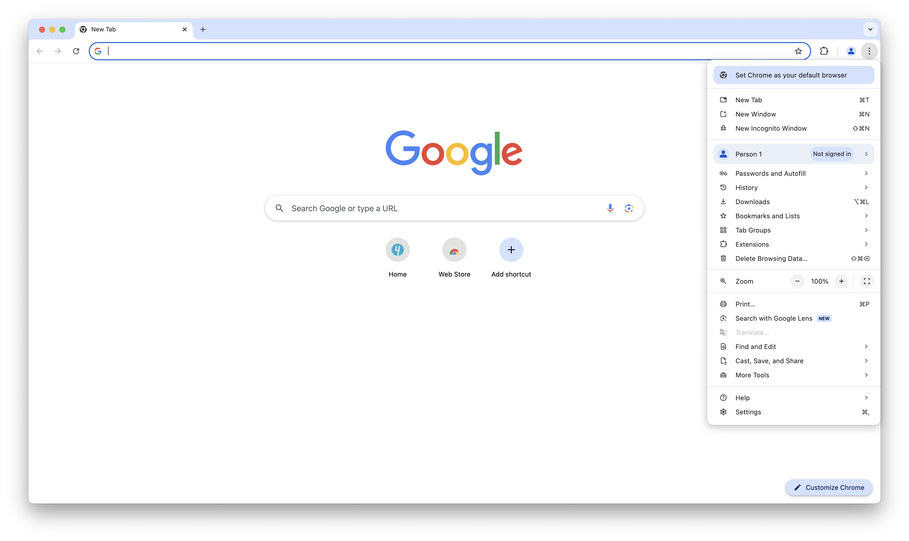

You should see the following menu.

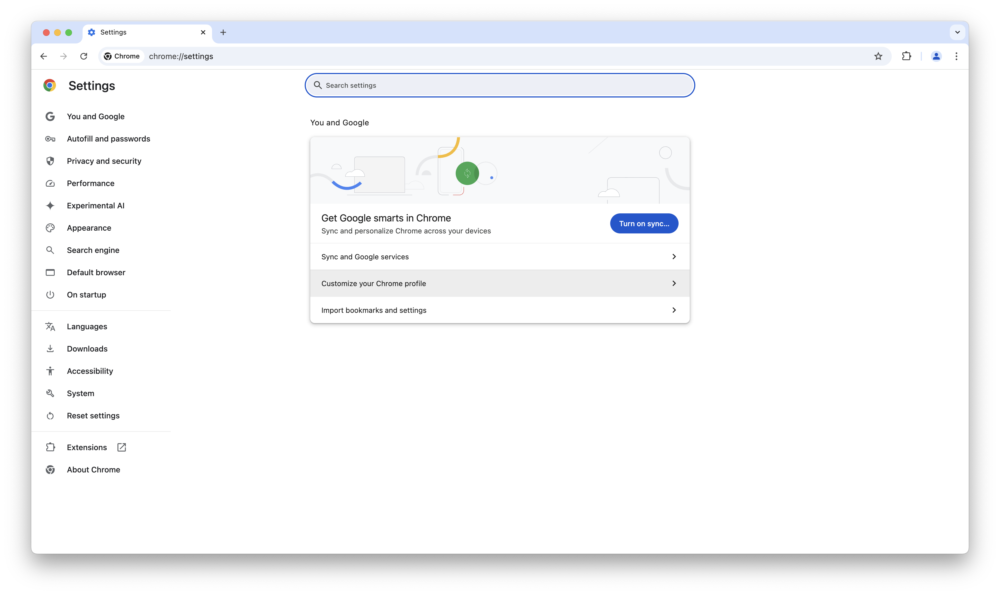

On the left, navigate to ____Privacy and Security____. You should see the following screen.

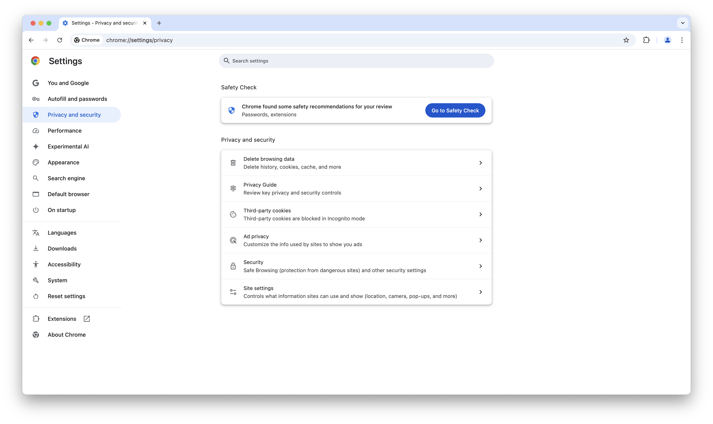

Click ____Delete browsing data.____ Here, you can check whether to clear your ____browsing history____, ____cookies____, and __cached images & files__. Chrome also allows you select the ____time range____ of the data marked for deletion.

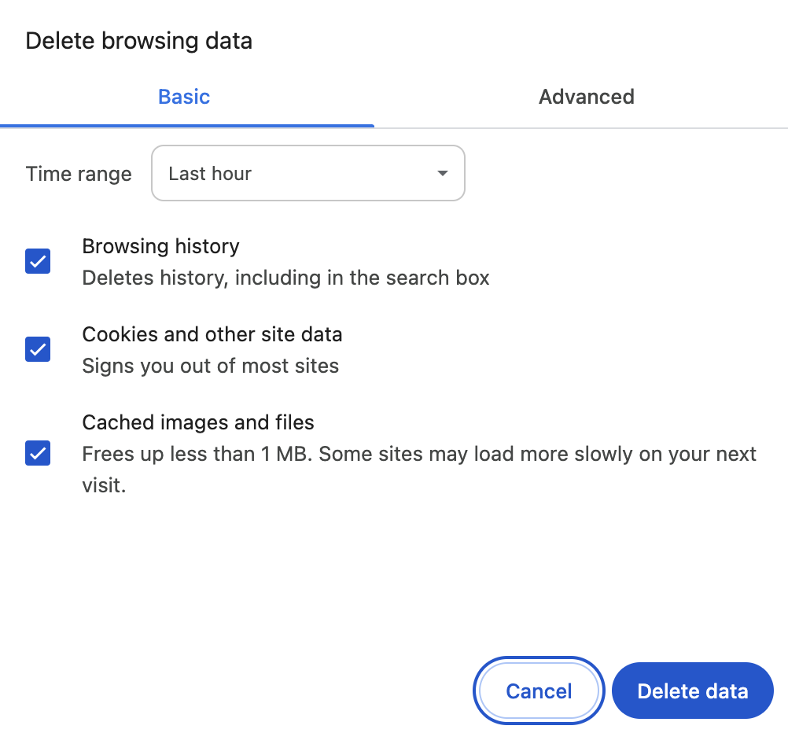

After making any necessary changes, click ____Delete data____.

## Clearing Browsing Data on Firefox

Start by launching ____Firefox____. On the upper right-hand corner, click on the ____three-dot icon____ to see a list of options. There, click on ____Settings____.

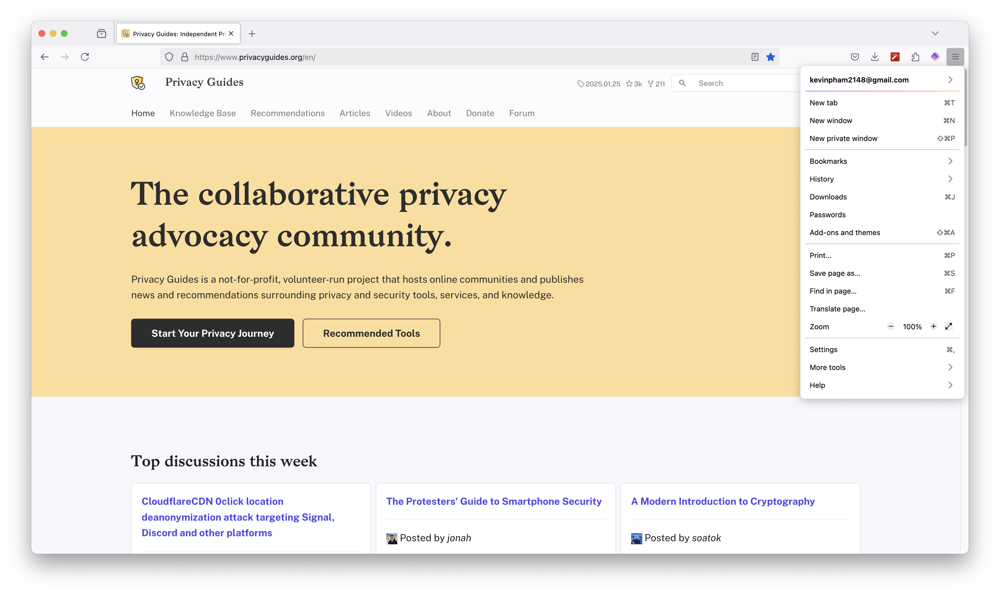

On the left, navigate to ____Privacy and Security____. You should see the following screen.

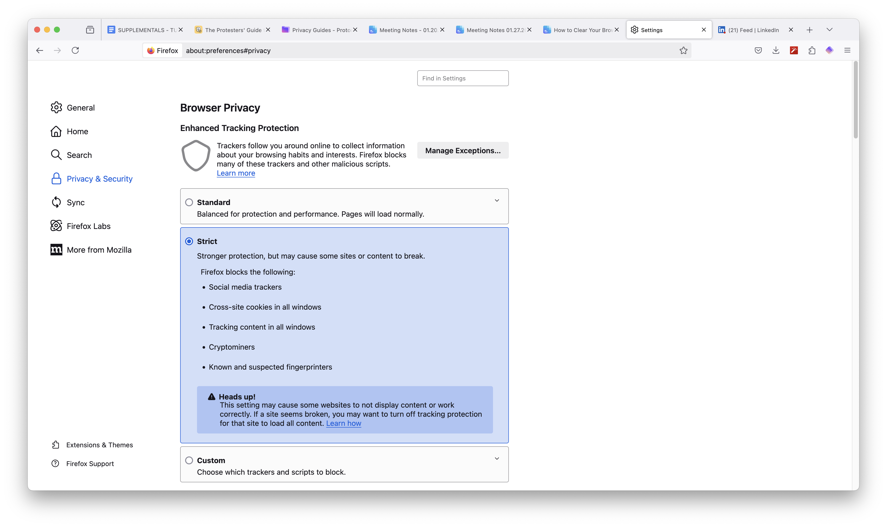

Scroll down to ____Cookies and Site Data____.

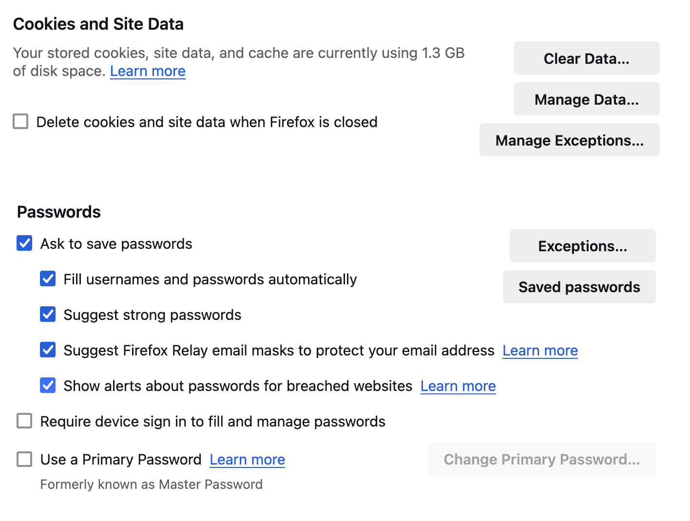

You have the option of either clearing your browsing data within a time range or in selected websites. Note that the latter deletes the website's cookies and cache, not history.

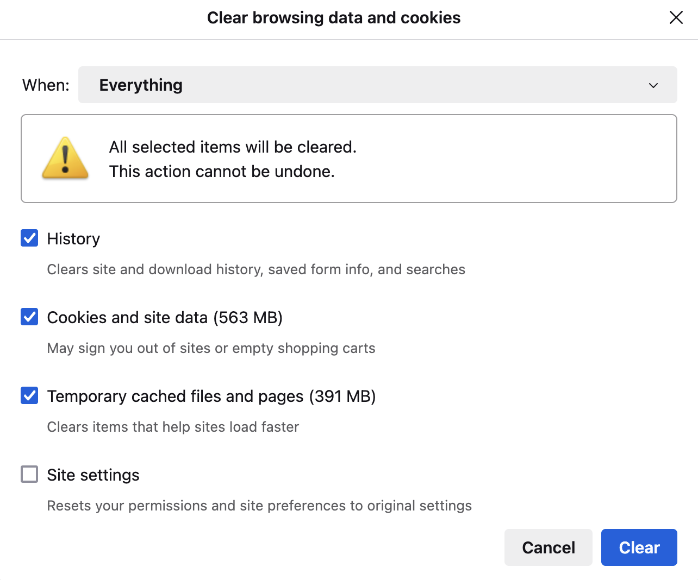

Click on ____Clear data____ if you prefer the former. Like Google Chrome, you can chose what types of data to delete and its time range. After making your selection, click ____Clear____ to finalize the process.

## Clearing Browsing Data on Safari

Unlike Chrome and Firefox, Safari separates history settings from its privacy settings. For the purposes of this guide, we will delete browsing history first.

After opening Safari, move your cursor to the upper left-hand corner. Click ____History____ once the title bar appears.

If you want to clear browsing history in a specified time range, select ____Clear History____ at the bottom and follow the prompt. Otherwise, click ____Show All History____.

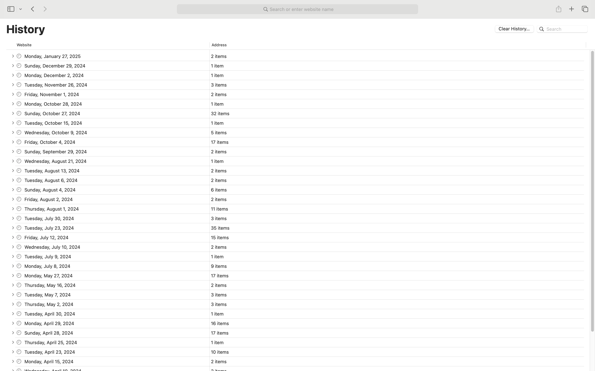

In this menu, you can choose websites to delete from your history. Use the search bar to find the exact name of the website. You can also navigate to a specific data and time.

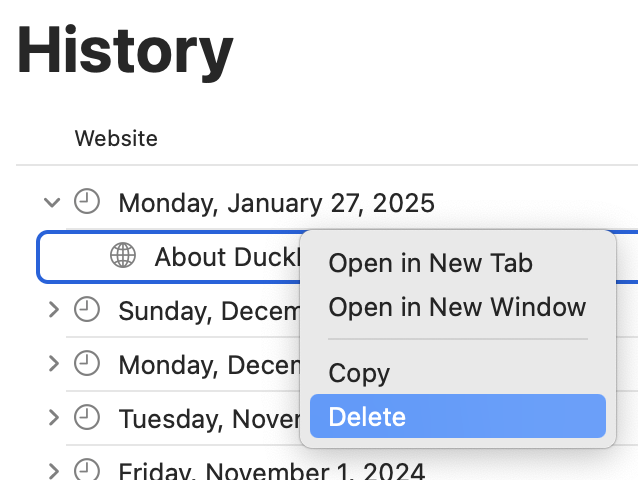

Now, lets delete the cookies and cache data. Move your cursor to the title bar again and click ____Safari____ to see a drop down menu.

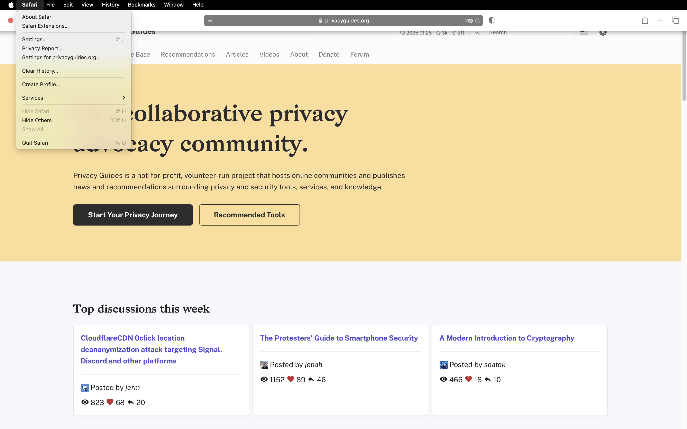

Then, click ____Settings____ and then navigate to ____Privacy____. You will see this screen.

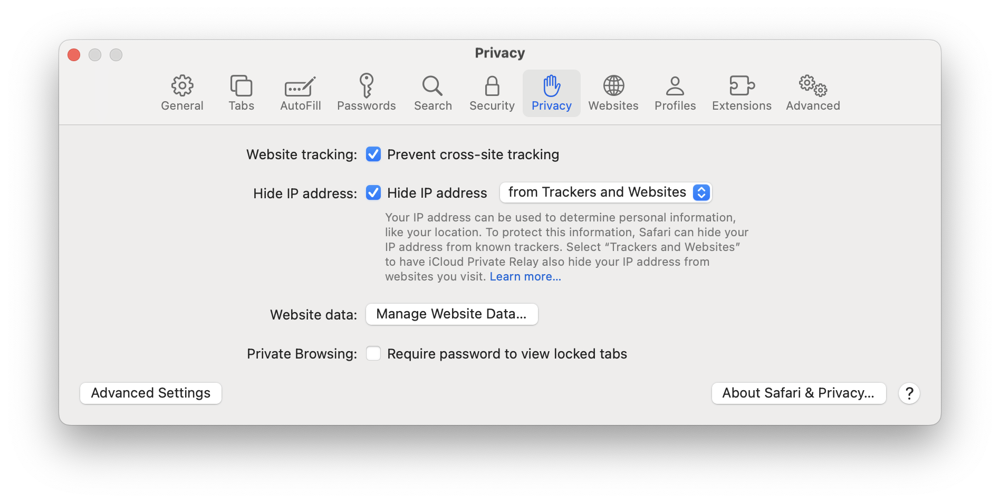

Click ____Manage Website Data...____

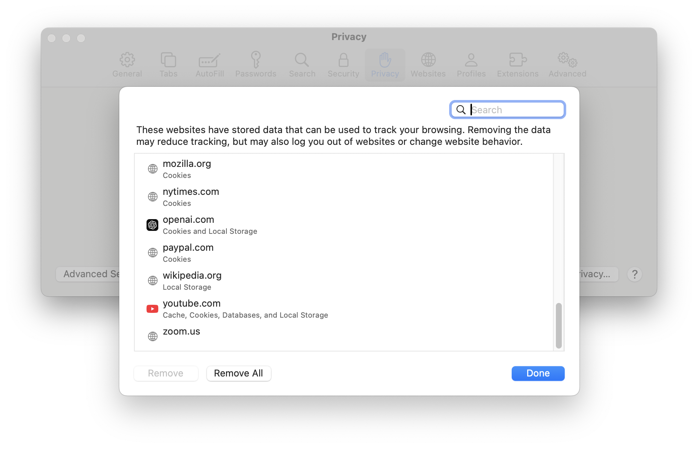

Another menu will appear with a list of websites and their corresponding browsing data types. As always, you can mark specified websites for deletion. Once you are done, click ____Remove____.
