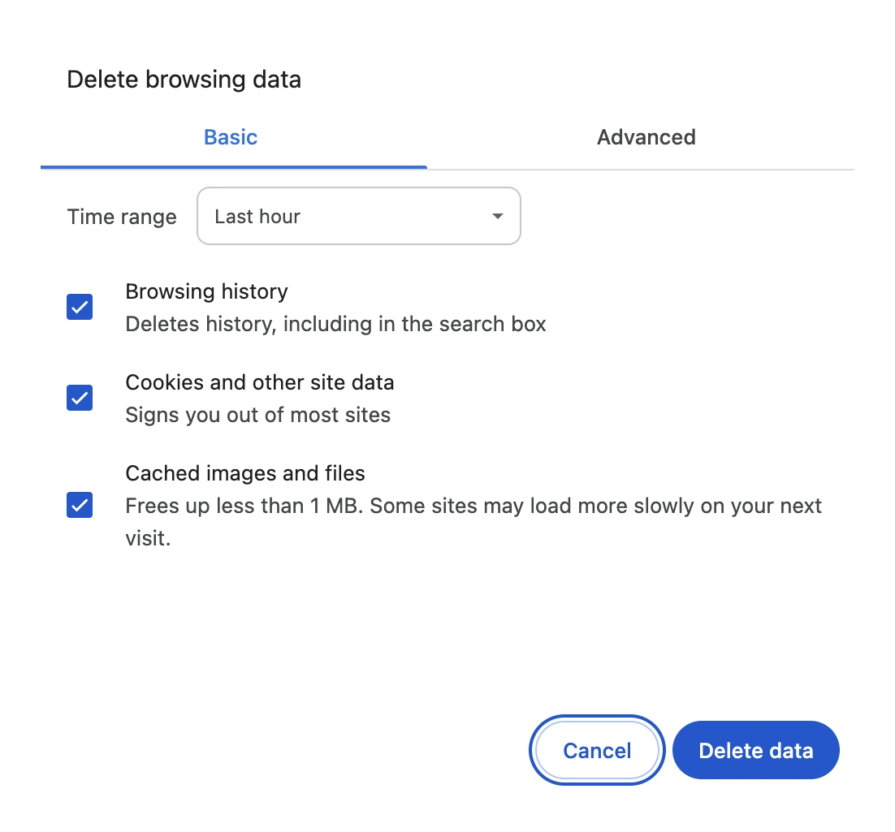
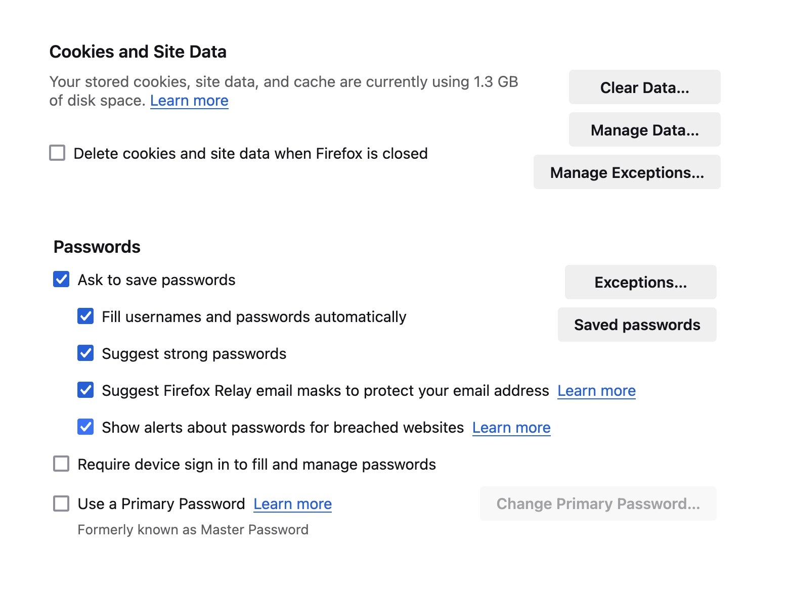
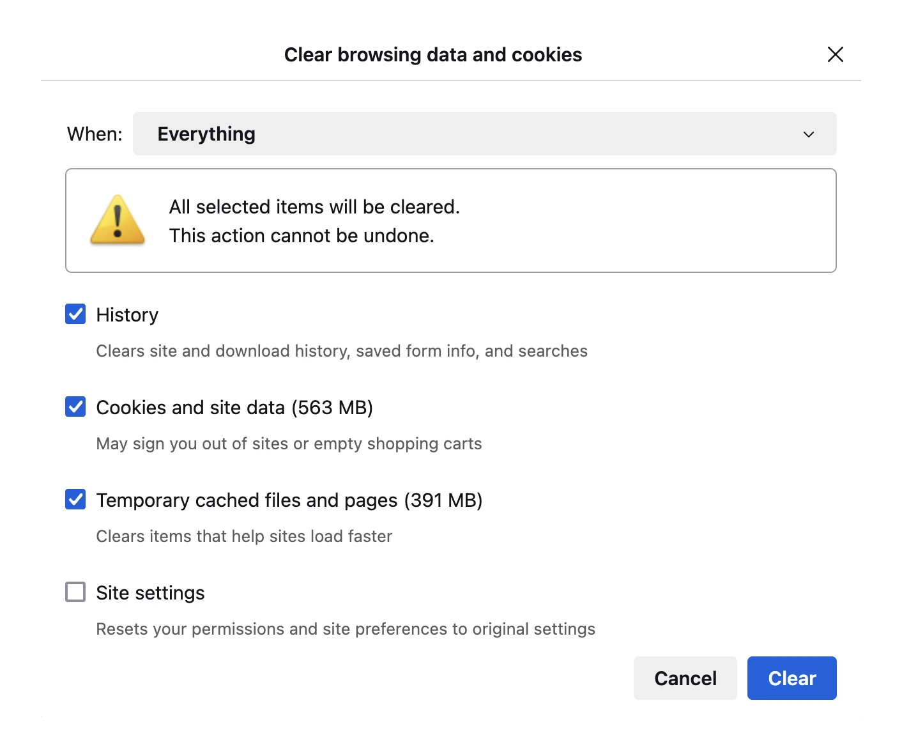
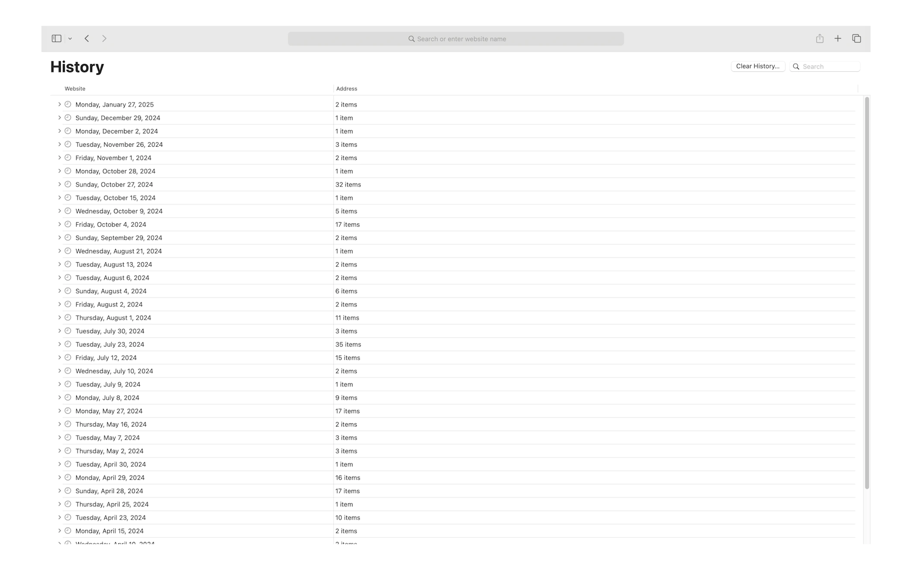
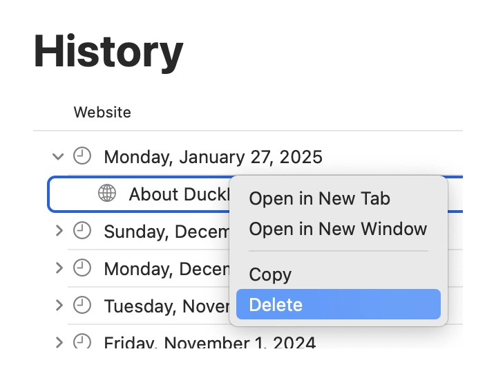
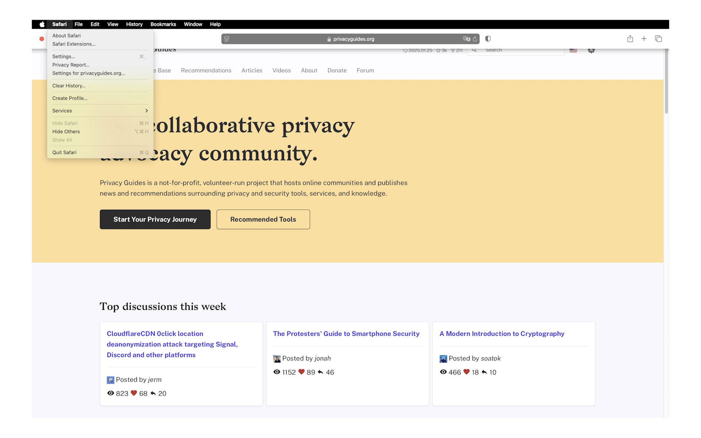
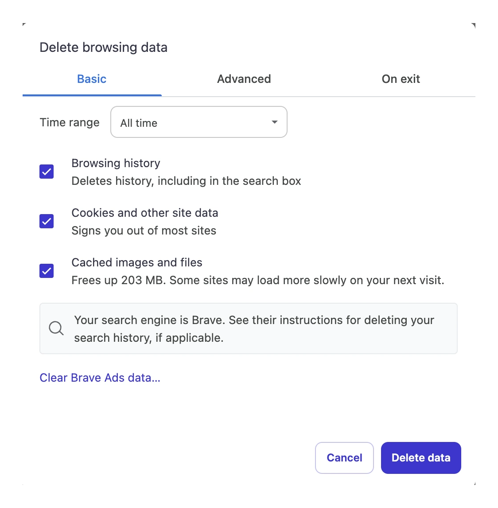
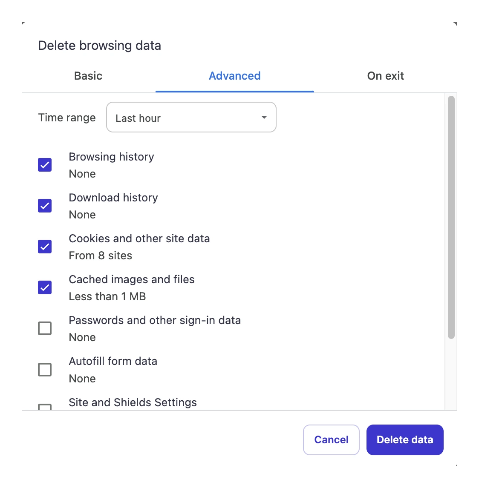
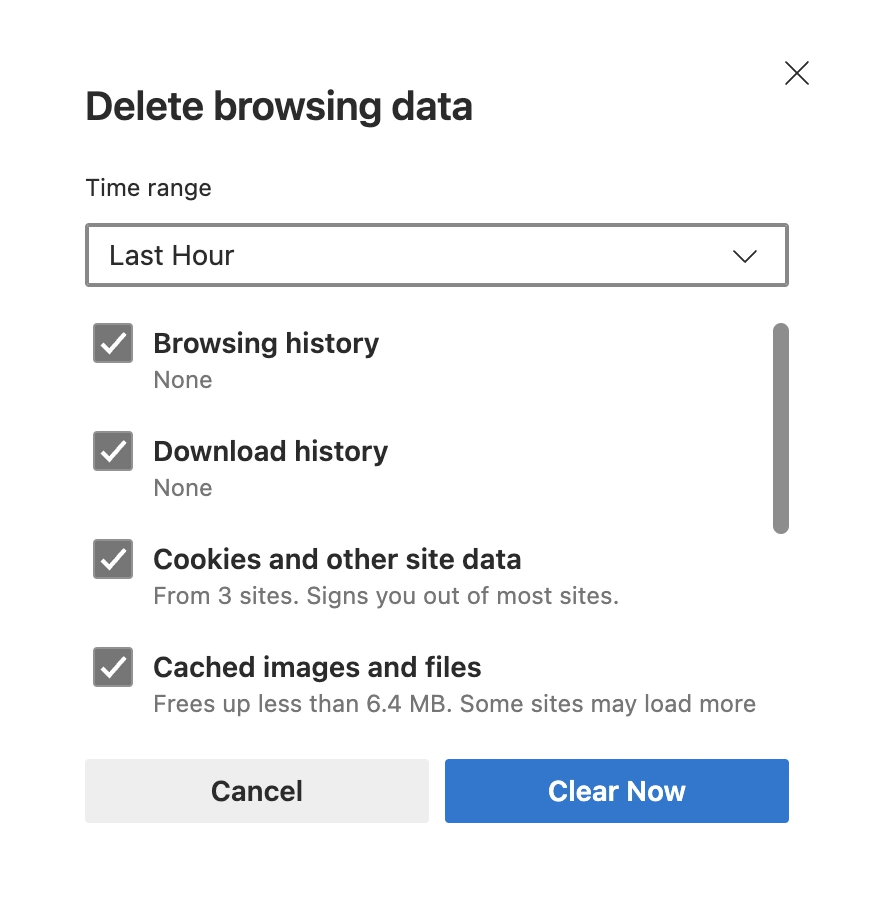

---
date:
    created: 2025-02-13T21:00:00Z
categories:
    - Tutorials
authors:
    - kevpham
tags:
    - Browsers
    - Chrome
    - Firefox
    - Safari
license: BY-SA
description: A beginner's guide to clearing browsing data — such as cookies, website cache, and browsing history — on Chrome, Firefox, Safari, Edge, and Brave.
schema_type: BackgroundNewsArticle
---
# How to Clear Your Browser History on Chrome, Firefox, and Other Browsers

<small aria-hidden="true">Photo: Dimmis Vart / Unsplash</small>

Your browsing data — such as cache, cookies, and browsing history — can accumulate over time, potentially damaging your privacy. Whether you trying to free up storage, limit tracking, or protect yourself from digital forensics, clearing browsing data is an important first step on your privacy journey. In this guide, we will explain how to clear your browsing data on five popular web browsers: Chrome, Firefox, Safari, Brave, and Edge.<!-- more -->

## Understanding Browsing Data

Cookies are [small files that a website generates and sends to a browser](https://www.cloudflare.com/learning/privacy/what-are-cookies/). They associate browsing activity to a given user session, allowing people to visit websites without logging in repeatedly. Cookies also facilitate [**personalization**](https://www.forbes.com/councils/forbestechcouncil/2023/04/11/the-internet-of-you-how-web-personalization-is-shaping-the-future/), where websites "remember" your preferences and actions. Websites utilize personalization cookies to send targeted advertisements and track your location.

Website cache data [refers to offline website data that your browser stores](https://learn.g2.com/what-is-cached-data). By preloading content like webpages and images, subsequent visits to a website becomes faster. Unlike cookies, a cache does not expire and must be manually cleared. If you are concerned about [digital forensics](https://hawkeyeforensic.com/2024/03/30/browser-forensics-examining-browser-artifacts/), consider clearing it.

Similarly, your browsing history must be deleted. As its name suggest, your web browser keeps a record of all visited websites offline. Your [internet service provider could still view your history](https://www.androidauthority.com/isp-tracking-1167088/); however, you might want to prevent access from someone living with you.

## Clearing Browsing Data on Google Chrome

To start, **launch** Google Chrome. On the upper right-hand corner, click on the **three-dots icon** to see a list of options. Then, click on **Settings**

You should see the following menu.

On the left, navigate to **Privacy and Security**. You should see the following screen.

Click **Delete browsing data.** Here, you can check whether to clear your **browsing history**, **cookies**, and **cached images & files**. Chrome also allows you select the **time range** of the data marked for deletion.

After making any necessary changes, click **Delete data**.

## Clearing Browsing Data on Firefox

Start by launching **Firefox**. On the upper right-hand corner, click on the **three-dot icon** to see a list of options. There, click on **Settings**.

On the left, navigate to **Privacy and Security**. You should see the following screen.

Scroll down to **Cookies and Site Data**.

You have the option of either clearing your browsing data within a time range or in selected websites. Note that the latter deletes the website's cookies and cache, not history.

Click on **Clear data** if you prefer the former. Like Google Chrome, you can chose what types of data to delete and its time range. After making your selection, click **Clear** to finalize the process.

## Clearing Browsing Data on Safari

Unlike Chrome and Firefox, Safari separates history settings from its privacy settings. For the purposes of this guide, we will delete browsing history first.

After opening Safari, move your cursor to the upper left-hand corner. Click **History** once the title bar appears.

If you want to clear browsing history in a specified time range, select **Clear History** at the bottom and follow the prompt. Otherwise, click **Show All History**.

In this menu, you can choose websites to delete from your history. Use the search bar to find the exact name of the website. You can also navigate to a specific data and time.

Now, lets delete the cookies and cache data. Move your cursor to the title bar again and click **Safari** to see a drop down menu.

Then, click **Settings** and then navigate to **Privacy**. You will see this screen.

Click **Manage Website Data...**

Another menu will appear with a list of websites and their corresponding browsing data types. As always, you can mark specified websites for deletion. Once you are done, click **Remove**.

## Clearing Browsing Data on Brave Browser

As a Chromium-based browser, Brave is quite similar to Chrome. To start, **launch** Brave. On the upper right-hand corner, click on the **three-bars icon** to see a list of options. Then, click on **Settings**

You should see the following menu.

On the left, select **Privacy and Security**. You should see the following screen.

Click **Delete browsing data.** Here, you can check whether to clear your **browsing history**, **cookies**, and **cached images & files**.

Under **Advanced**, Brave also allows you select the **time range** of the data marked for deletion.

After making any necessary changes, click **Delete data**.

## Clearing Browsing Data on Microsoft Edge

Finally, we will finish this tutorial with Microsoft Edge. Start by launching the browser. On the upper right-hand corner, click on the **three-dots icon**. Next, click  **Settings**.

In the settings page, navigate to **Privacy, Search, and Services**

Under **Delete Browsing Data**, click on **Choose What to Clear**.

Modify the time range and data to be deleted. Afterwards, click **Clear Now**.

