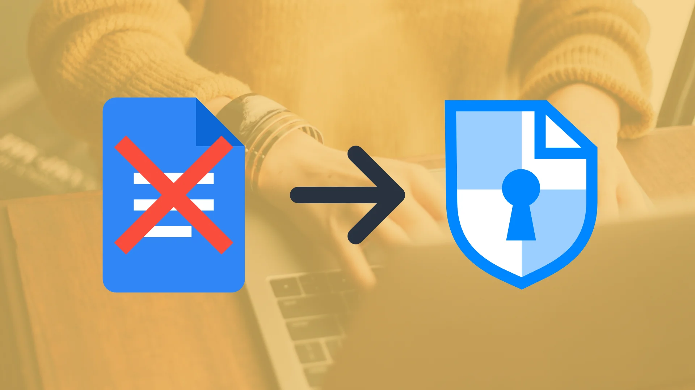

<small aria-hidden="true">Illustration: Jordan Warne / Privacy Guides | Photo: Christin Hume / Unsplash</small>

If you have been thinking about migrating to a privacy-focused replacement to Google Docs, **now is the time**. Google products, as convenient and popular as they might be, are *atrocious* for data privacy (not to mention [ethics](https://www.theverge.com/google/607012/google-dei-hiring-goals-internal-memo)).<!-- more -->

Google's own Privacy Policy [clearly explains](https://policies.google.com/privacy#infocollect):

> We also collect the content you create, upload, or receive from others when using our services. This includes things like email you write and receive, photos and videos you save, docs and spreadsheets you create, and comments you make on YouTube videos.

Firstly, no matter what Google claims to do (or not do) with your data now, there isn't much preventing Google from using it for a different purpose later on. Secondly, there isn't much preventing Google from doing what it pleases regardless of laws or their promises, and asking for forgiveness later, as demonstrated by the many [lawsuits](https://www.reuters.com/legal/google-reaches-93-million-privacy-settlement-with-california-2023-09-14/) Google has already been subjected to. [We cannot trust Google](https://arstechnica.com/tech-policy/2025/01/google-loses-in-court-faces-trial-for-collecting-data-on-users-who-opted-out/) with *any* sensitive or personal information.

But you shouldn't trust anyone else either.

**The real solution to this is end-to-end encryption.** This is what CryptPad offers.

## Why use CryptPad instead?

{ align=right itemprop="image" }

[CryptPad](https://cryptpad.org/) is an open-source collaborative office suite that offers everything that Google Docs offers, but better. And most importantly, in private.

It was built from the ground up respecting the principles of [Privacy by Design](https://en.wikipedia.org/wiki/Privacy_by_design). All content kept in CryptPad is secured using solid end-to-end encryption, meaning that only the intended recipients can access the content. CryptPad itself cannot read, scan, or utilize your content in any way.

[:octicons-home-16: Website](https://cryptpad.org/){ .md-button }
[:octicons-eye-16:](https://cryptpad.fr/pad/#/2/pad/view/GcNjAWmK6YDB3EO2IipRZ0fUe89j43Ryqeb4fjkjehE/){ .card-link title="Privacy Policy" }

CryptPad is developed by a team from the French software company [XWiki](https://www.xwiki.com). Because [CryptPad is open-source](https://github.com/cryptpad), anyone can add contributions to it, inspect its code, or submit feature recommendations.

There are many reasons that CryptPad is a great tool and a perfect replacement to Google Docs. Let's dig into its pros and cons, why you should use it, why you can trust it, and how you can keep it secure.

## What makes CryptPad trustworthy

Why trust CryptPad more than Google? First, the end-to-end encryption the CryptPad software utilizes uses [strong and modern algorithms](#privacy-and-encryption). When encryption like this is well implemented, it means the content of your data can never be accessed by the CryptPad instance (server) operators. In contrast, services like Google hold the decryption keys to your data at all times, placing it at risk of being misused or compromised in a data breach. With CryptPad, if a CryptPad instance that has well implemented the software experienced a data breach and your encrypted content was stolen, your content would still be protected as long as you've used a unique, complex, and long password and protected it well.

Second, because CryptPad's code is open, what it promises can be verified. Making source code open doesn't magically make it secure, but the CryptPad software is a project that had many eyes on in GitHub, has been around for over 10 years, and is actively maintained by a team experienced with open-source software.

Additionally, if you decide to use CryptPad's flagship instance, your data will be hosted in France. This isn't magical either, but because European Union countries are all subjected to the GDPR most have adopted stronger data privacy practices by default. While these other factors are not technical guarantees, they all serve to increase the level of trust we feel comfortable giving CryptPad's software and flagship instance.

Finally, if you do not trust CryptPad at all, the good news is you don't have to. If you prefer to use an instance that is not run by the CryptPad team, you can look for [other organizations](https://cryptpad.org/instances/) hosting instances of CryptPad open to the public. Of course make sure to pick an instance worthy of your trust. If you decide you do not trust anyone else, you can [download the code for yourself](https://github.com/cryptpad/cryptpad) and create your own CryptPad instance only controlled by you.

## Starting with CryptPad

Using CryptPad is very easy. CryptPad can be self-hosted if you prefer, but if this is not something you want to think about you can simply use CryptPad's [flagship instance](https://cryptpad.fr/) hosted in France. You can even start using it without an account. If you prefer to have an account to keep all your documents together you can create one for free, or you can have a look at CryptPad's [paid plans](https://cryptpad.org/pricing/) for users with greater needs.

### Without an account

Without an account, you can go to [https://cryptpad.fr/](https://cryptpad.fr/) and just click on a type of "New document" to start right away. Your username will be "Guest" and you will automatically be attributed a cute emoji for your Guest profile.

You can create a new document, modify it, copy the URL link, then close the web page. To return to it, simply paste the same URL in a browser. To share this document, simply share the URL with someone else.

File security warning

Anyone with the link will be able to see your file. Additionally, if this link includes "Edit" access, anyone with this link will be able to edit the file. Consider this when using this method.

Whether you create an account or not, the only information that could identify you when using CryptPad on a trustworthy instance is your IP address and your browser and device information. Depending on your threat model, to mitigate this you might want to use a trustworthy [VPN service](https://www.privacyguides.org/en/vpn/) and/or the [Tor network](https://www.privacyguides.org/en/tor/), coupled with a [browser](https://www.privacyguides.org/en/desktop-browsers/) hardened to reduce [fingerprinting](https://coveryourtracks.eff.org/).

If you are at risk of targeted attacks

If you would be at risk if your CryptPad usage was discovered later, and you do not want to leave any traces on your local computer that you have visited a CryptPad instance, you might want to use [Tails](https://www.privacyguides.org/articles/2025/01/29/installing-and-using-tails/).

### Creating an account

You will see that *Privacy by Design* starts at the account creation level with CryptPad. You do not even have to provide an email address to start. All that you need to create an account is a cool username and a [secure and unique password](https://www.privacyguides.org/en/basics/passwords-overview/) (like all passwords should be).

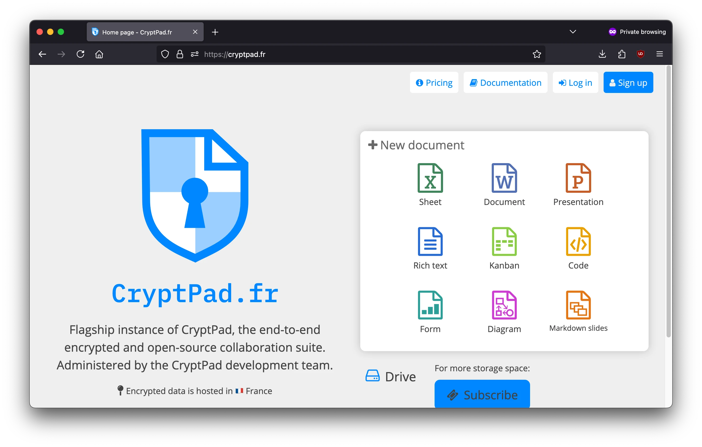

<small aria-hidden="true">Unless credited otherwise, all screenshots from: Privacy Guides</small>

Password security

Make sure you note your unique, long, and complex password and username in a safe place. Due to the nature of end-to-end encryption, if you lose your username or password, there will be **no account recovery possible** and all your files will be lost.

### Basic security

Once you've created an account, the first thing you should do is secure it with a [second factor of authentication](https://www.privacyguides.org/en/basics/multi-factor-authentication/). To do this, click on your username on the upper-right, then select "Settings" > "Security & Privacy" and follow the instructions for "Two-Factor Authentication".

On the same "Settings" page, depending on your [threat model](https://www.privacyguides.org/en/basics/threat-modeling/), you might also want to enable "Safe Links", disable "Feedback" (disabled by default), and disable "Cache". Disabling the cache can hinder performance though, so if your local device isn't at risk it may be unnecessary.

### Destroying data

Another option that CryptPad offers on the "Settings" page is a quick way to "Destroy all owned documents" at once. This can be a lifesaver feature for people at particularly high risk. Take good note of where this feature is in the menu.

You can also delete files individually. To do this, once you have created a document you can click on the "Access" button on the top menu, and you will see an option to "Destroy this document or folder permanently". After you've clicked on "Destroy" once, you will see the button change to "Are you sure?" and you'll have to click it again to confirm. This is a well-designed safeguard because this action is irrevocable. Test it with an empty document just to see how it works first.

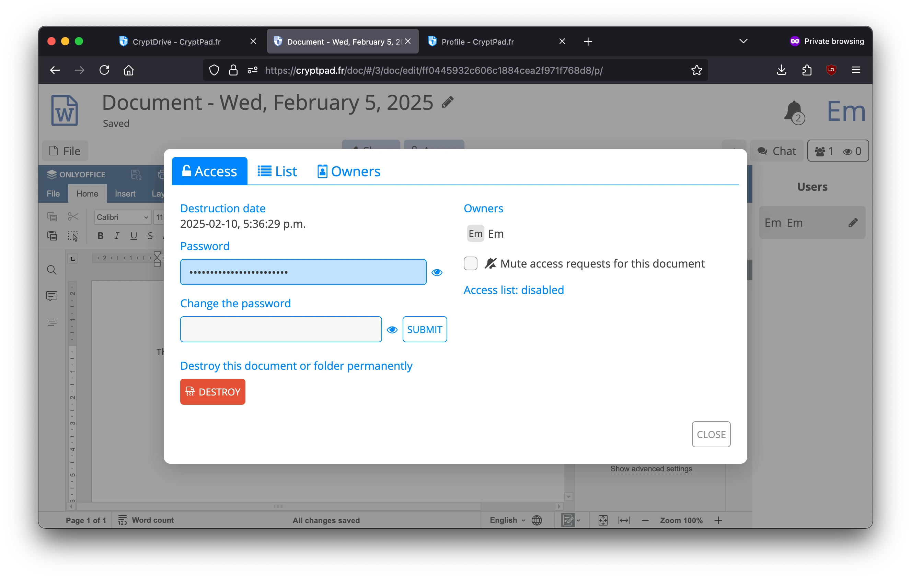

### Backing up data

There are several options to back up and export your data. From a document page, you can click on the "File" button on the upper-left, then select "Export". To back up all your documents at once, you can click on your username on the upper-right, then select "Settings" > "CryptDrive" > "Backup". This will create a zip file containing all your documents in plain text (unencrypted). Be careful where you store this file if it contains sensitive information.

### Additional settings

Another setting you should pay attention to is your Display name. You can change it in the "Account" section. This will be shown to your contacts in CryptPad if you add any.

Additionally, you can change the theme to either Light or Dark in "Appearance", you can change the color associated with your account and file modifications in "Cursor", you can adjust the code editor indentation spaces in "Code", and you can make many other adjustments following your preferences.

## CryptPad's instances & hosting

The CryptPad team offers a flagship instance at [CryptPad.fr](https://cryptpad.fr/) that makes it easy to start using CryptPad quickly. Depending on your preference and circumstances, you might choose a different instance or even choose to host an instance yourself.

### Different instances

For a list of third-party instances that have passed a series of checks from the CryptPad team to ensure they are up-to-date and use recommended settings, you can visit this page: [https://cryptpad.org/instances/](https://cryptpad.org/instances/)

When using third-party instances

Always consider your threat model when selecting an instance. Although the content of your files will be end-to-end encrypted, the instance's owner could have access to some metadata about you, such as your IP address or other activities. Additionally, an instance administrator could technically modify the CryptPad software they run to introduce malicious code. You should trust the instance you use as much as the code.

### Self-hosting

To learn how to host your own CryptPad instance, you should consult [CryptPad's documentation](https://docs.cryptpad.org/en/admin_guide/index.html#admin-guide).

## User Experience

The user experience will likely feel pretty familiar to people who are already using Google Docs, Microsoft Office, OnlyOffice, or other similar office suites.

### User interface

For document creation, CryptPad's user interface is rather straightforward. However, there are a few details in the interface that might be confusing at first. For example, clicking on your username (or Display name) on the upper-right will show an important dropdown menu, so you should remember to look there as it is not always obvious. This is the menu where you will find options for your "Profile", "Calendar", "Contacts", "Settings", "Log out", and more.

Once inside a document, click on the "File" button on the upper-left to see the file's "History", "Export", or "Print" features, and more.

To destroy a document, you will need to click on the "Access" button at the top of a document page.

### Export and import documents

You can export or import documents to CryptPad in HTML format, but keep in mind there might be some formatting issues with certain document types.

## Document Options

Each time you create a new document, no matter which type, you will have the following options: to make it an "Owned document", which means having full control over it (you need to be the owner of a document to delete it); to pick a "Destruction date", to **make the document self-destroy** after a certain number of months, days, or even hours; and to "**Add a password"** to password-lock the document.

### Self-destruction

For any sensitive document, it's a great idea to enable the auto-destruction feature, even if it's far in the future. This adds a layer of security in case you lose your password, forget about an important file that shouldn't be lingering around, or for any other sensitive situations.

### Password lock

Because sharing the link to a document without a password makes it accessible to anyone with this link, you should add a password to any sensitive document and share this password on a secure channel only. Make sure you select a password that is different from your account password and is also unique from other passwords you use. Ideally, always prefer a *passphrase*.

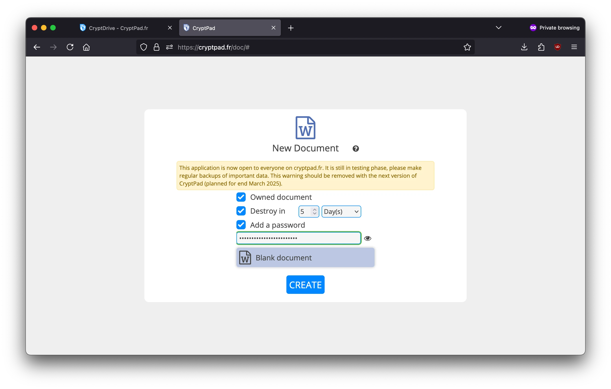

### Access control

For any document you can control how it is accessed by clicking on the "Access" button at the top. There, you can change the document's password, delete the document, see the list of accesses and ownership.

When you share a document by clicking on the "Share" button at the top, you can select different types of access rights, such as "View", "Edit", and "View once and self-destruct". The latter can be a particularly useful feature for people in highly sensitive situations.

## Applications Available

CryptPad offers a wide variety of applications, or document types, making CryptPad a complete office suite. To create a new file from your *CryptDrive* page, click on the large "+ New" button. You will see a popup menu where you can select: "Folder", "Shared folder", Upload files", "Upload folder", "New Link", "Sheet", "Document", "Presentation", "Rich text", "Kanban", "Code", "Form", "Whiteboard", "Markdown slides", and "Diagram".

That's a lot of choice!

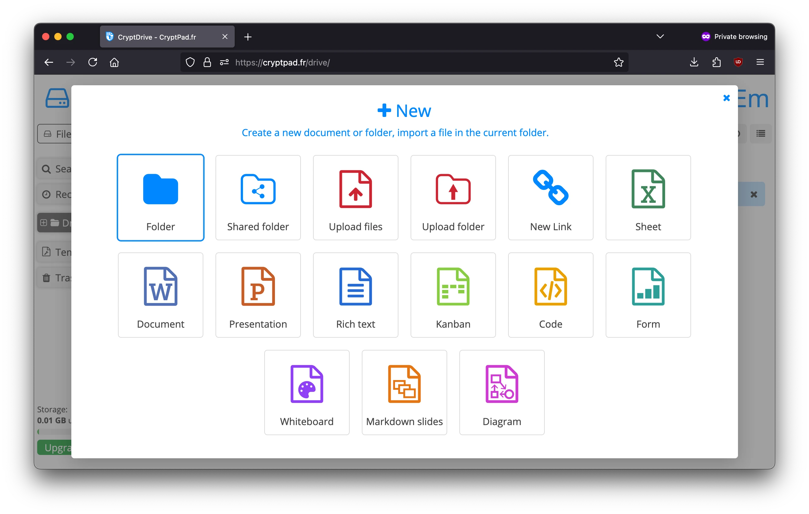

New from this week!

==*Document* and *Presentation* applications have just been unlocked to all users on CryptPad.fr this week!==

This is fantastic for collaborative work because the new *Document* type allows tracking changes within a document. These two new types of document are still in testing phase however, so make sure to back up your data regularly. Improvements will likely be added slowly in the coming weeks, until the final release planned for the end of March 2025.

Here are screenshots of each application included in CryptPad to give you a better idea of what possibilities are in there:

### Sheet

The usual classic spreadsheet for all your calculation needs. If you are familiar with Google Docs' spreadsheet, you will likely find this one easy to use:

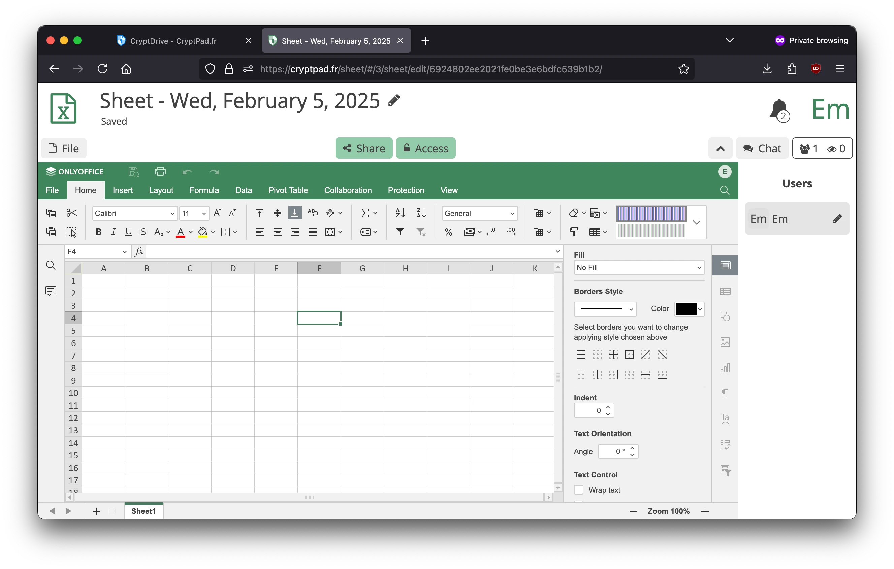

### Document

The classic text document with advanced formatting features:

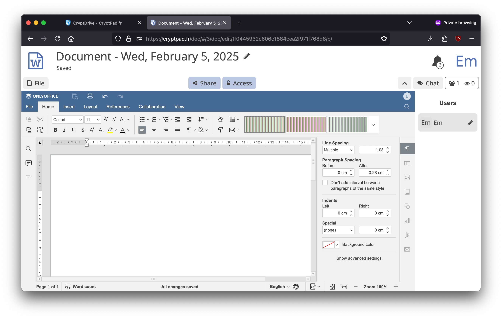

#### Tracking changes

If you want to enable change tracking in this application, click on the "Collaboration" tab, then click on the "Track Changes" button, and select your preferred tracking option:

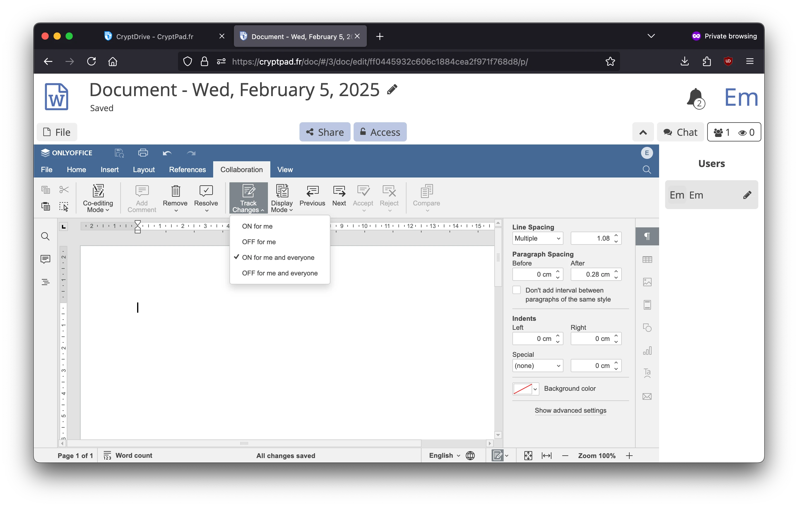

### Presentation

Another classic application to help you create slideshows:

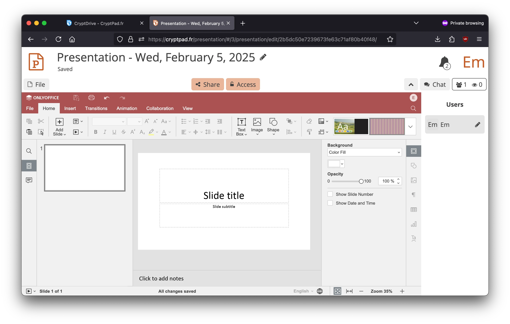

### Rich text

A basic text document type for simpler text files:

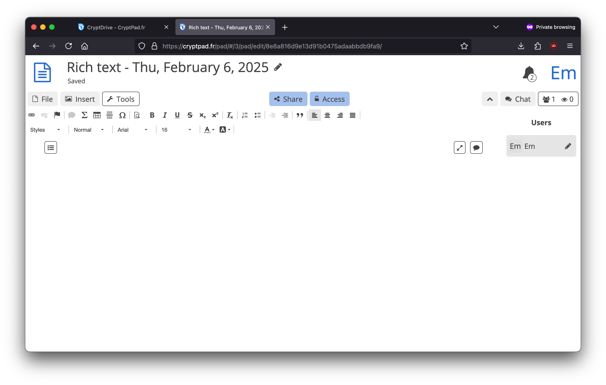

### Kanban

A useful kanban organization tool to plan your projects:

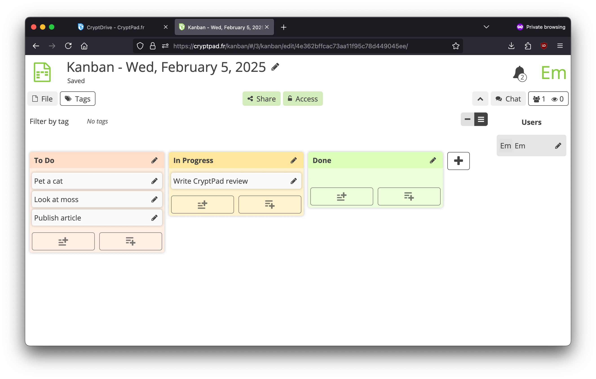

### Code

A light code editor with previewing feature. This is especially useful for HTML files:

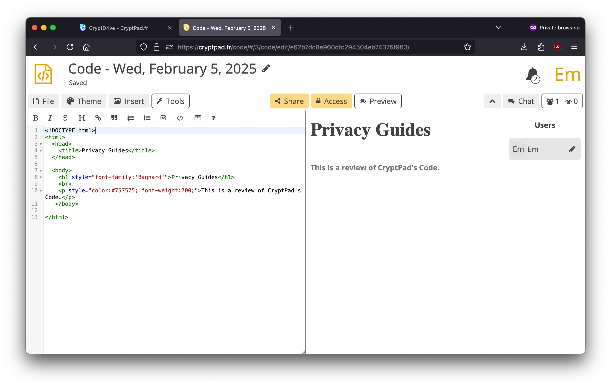

### Form

A form tool to create and share surveys, without sharing your survey data with unwanted third-parties:

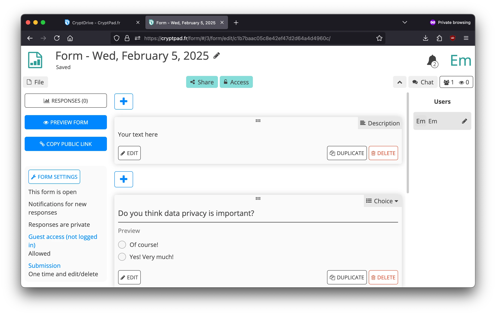

### Whiteboard

A fun whiteboard tool if you feel creative, need to draw to explain, need to write and collaborate on complex math equations, and much more:

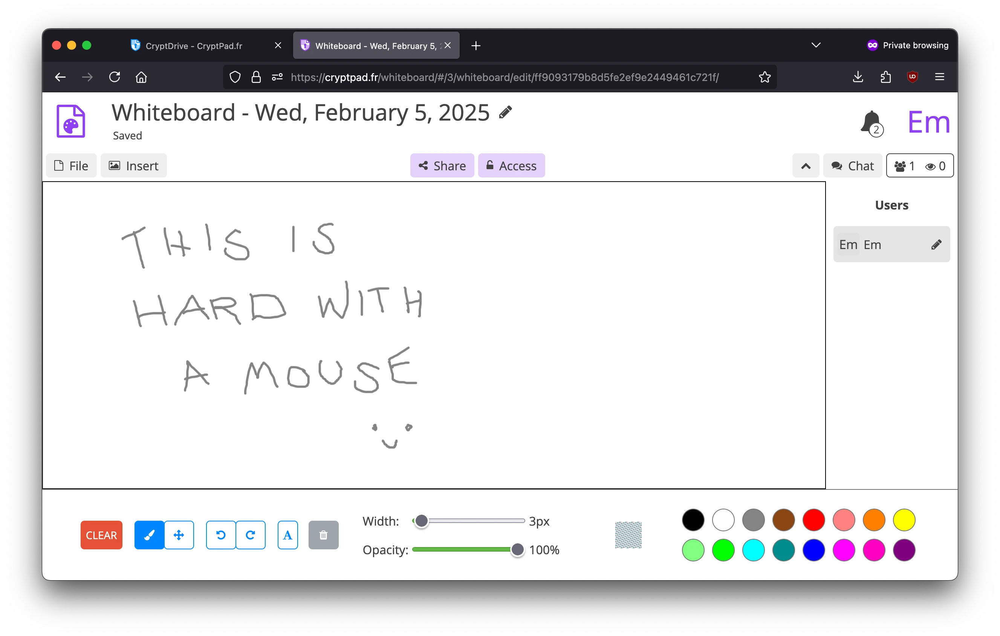

### Markdown slides

A simple application to quickly create and preview slides in Markdown format:

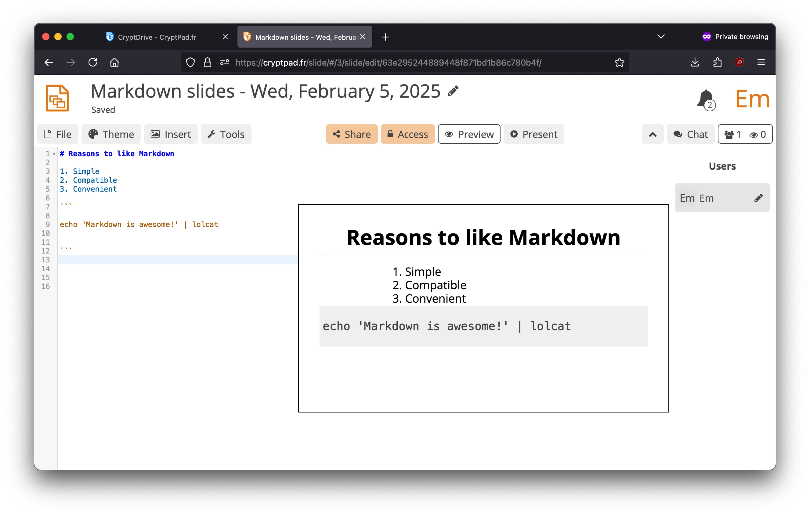

### Diagram

A flexible tool to create diagrams, for all your visual explanatory needs:

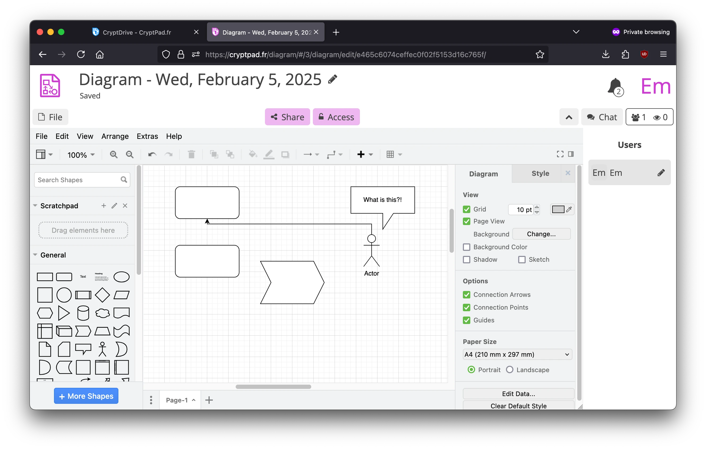

### Calendar

And finally, this isn't a document type per se, but you might be happy to hear CryptPad also integrates a Calendar application. This can be a fantastic tool to organize with your team and events. You can access it by clicking on your username on the upper-right, then selecting "Calendar":

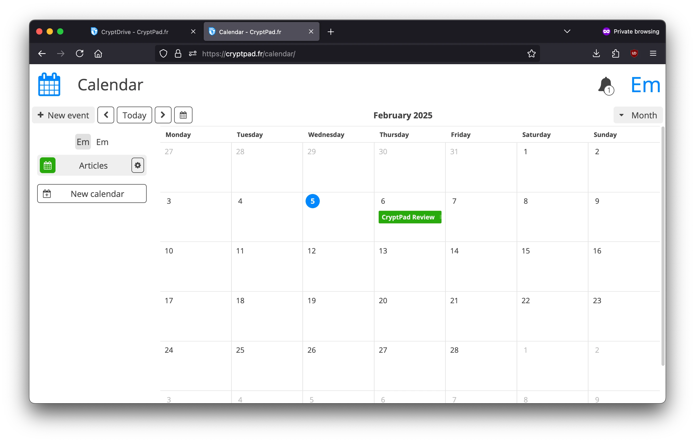

## Privacy and Encryption

Everything in CryptPad is designed to minimize data collection. It's also designed to minimize the data visible to the instance's operators as much as feasible. This is great for privacy and significantly improves data security. If the data isn't accessible to even the instance's operators, then it also isn't accessible to thieves or abusive authorities.

### What encryption does CryptPad use?

With CryptPad, all your data is encrypted on your device before it is sent to the remote server. You never have to worry about data being readable in-transit or at-rest on the server. Only authorized users, senders and intended recipients, can access the decrypted data.

To lock your account, CryptPad creates cryptographic keys derived from your username and password together. This means CryptPad servers never even see your username or password. In fact, a normal CryptPad server cannot even know if you are using the software with an account or not. Additionally, this makes it so that multiple people could use the same username, as long as they register with a different password.

To secure documents, CryptPad uses [symmetric encryption](https://en.wikipedia.org/wiki/Symmetric-key_algorithm) with a [secret key unique to each document](https://blog.cryptpad.org/2024/03/14/Most-Secure-CryptPad-Usage/). This ensures your document is unreadable to anyone who doesn't have the corresponding key.

Keep in mind however than when you share a link to a document, this link contains the symmetric key to encrypt and decrypt the document, and to verify and issue the signatures. This access is irrevocable. Which means that if you want to stop someone who received the link to a document from accessing it later on, you will need to make a copy of this document and destroy the original you have shared.

### Your public key

If you want to access your own CryptPad public key, you can click on your username on the upper-right, then select "Profile" and click on "View my profile". There you can click on "Copy public key" and this will copy your key to your device's clipboard.

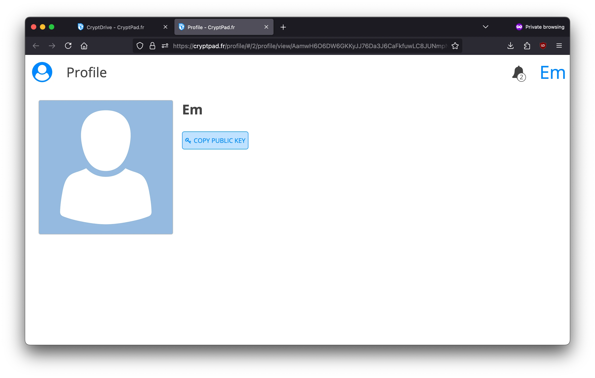

### Encryption algorithms

CryptPad uses a variety of reputable algorithms for its encryption needs. Here's a summary of what type of encryption CryptPad implements:

- For login authentication: The [scrypt](https://en.wikipedia.org/wiki/Scrypt) key derivation function (KDF).
- For symmetric encryption: The [XSalsa20](https://en.wikipedia.org/wiki/Salsa20)-[Poly1305](https://en.wikipedia.org/wiki/Poly1305) algorithms.
- For public-key encryption: The [x25519](https://en.wikipedia.org/wiki/Curve25519)-[XSalsa20](https://en.wikipedia.org/wiki/Salsa20)-[Poly1305](https://en.wikipedia.org/wiki/Poly1305) algorithms.
- For signatures: The [Ed25519](https://en.wikipedia.org/wiki/EdDSA#Ed25519) signature scheme.
- For hashes: The [SHA-512](https://en.wikipedia.org/wiki/SHA-2) algorithm.
- For all other cryptographic operations: The [TweetNaCl.js](https://tweetnacl.js.org/#/) library.

You can read more details about how CryptPad implements encryption in [CryptPad's white paper](https://blog.cryptpad.org/2023/02/02/Whitepaper/).

You can read more on a comparison of cryptography libraries CryptPad uses in [CryptPad's Blueprints](https://blueprints.cryptpad.org/review/libraries/).

### Post-quantum encryption

Like many other applications using encryption, CryptPad is preparing for the [post-quantum age](https://en.wikipedia.org/wiki/Post-quantum_cryptography) evaluating how quantum-resistant its current algorithms are, and following closely recommendations for standards improvement.

This is all very new as the [National Institute of Standards and Technology](https://www.nist.gov/) (NIST) just selected newly proposed post-quantum resistant algorithms [last summer](https://www.nist.gov/news-events/news/2024/08/nist-releases-first-3-finalized-post-quantum-encryption-standards) to establish new encryption standards and recommendations.

Preparing now to harden encryption standards against future quantum computers possibly capable of breaking currently used cryptographic algorithms is very important. The CryptPad development team is already preparing for this and [plans to transition](https://blueprints.cryptpad.org/review/agility/) towards NIST's post-quantum new standards.

### Perfect forward secrecy

CryptPad's team is also [planning](https://xwiki.com/en/Blog/CryptPad-overview-2024/) on implementing [perfect forward secrecy](https://www.geeksforgeeks.org/perfect-forward-secrecy/) for its next generation. This will be a great improvement to secure communication within CryptPad, because it makes each session key unique. This means that if a session key was to be compromised, this would not affect any other sessions, significantly reducing the scope and damage of an attack.

### Keeping CryptPad secure

Like any privacy-focused product, CryptPad isn't magical. While CryptPad offers some of the very best protections for your privacy, you still have to take certain measures to secure your CryptPad data properly. CryptPad cannot control this part.

Here's a few things you should remember to keep your CryptPad data secure and private:

**Trustworthy server:** It's important to select a CryptPad instance that is trustworthy. Keep in mind that the instance operators could have access to your IP address or could theoretically maliciously modify the CryptPad's code they use to make it insecure.

**Safe device:** Your device also needs to be safe and secure. There isn't much that *any* external service can do to protect your data if your device is compromised.

**IP address:** Don't forget that whenever you connect to a server, website, or any service online, you are sharing your IP address, which can be used to identify and locate you, more or less accurately. If this is a threat to you, consider using a trustworthy VPN or the Tor network to protect your IP address.

**HTTPS:** Make sure the CryptPad instance's address you use starts with "HTTPS".

**Document links:** Because CryptPad includes the keys to decrypt your document in the links you use and share, anyone who can access your browsing history could potentially read your decrypted document. This is also true for anything in your browser or device that can access your browser's history (extensions, synced accounts, screen-sharing, Windows Recall, etc.). To mitigate this, you should [enable](https://docs.cryptpad.org/en/user_guide/user_account.html#security-privacy) the option "Safe links" in "Settings" > "Security & Privacy".

**Password:** It's important to safeguard your password properly and *choose a password that is unique, complex, and long*. No matter how good the encryption is, if someone guesses your password, it's game over.

**Multifactor authentication:** As soon as you create an account, you should enable a second factor of authentication. This will help protect your data against account takeover, in case your password were to be guessed or leaked. This is true for any account you have.

**Document accesses:** Be careful to reduce the document's access to the minimum access required for functionality. For example, if you share a document link publicly, make sure it's a read-only link that doesn't allow anyone to edit it.

**File history:** By default, files keep history of document changes and who viewed or modified a document. You can see this in "File" > "History". If you need to erase this history for safety but keep the document, you can go to "File" > "Make a copy", then go back to the original document with the history you need to erase, click on "Access", then "Destroy", then click again on "Are you sure?". This will permanently destroy your original document. Be careful, there is no recovery after this.

**Static keys:** CryptPad uses static keys to encrypt your documents. This means that once you have shared a document, and therefore its static keys, you cannot revoke this access. By default, anyone you have shared a link to your document with will retain this access indefinitely. If you wish to revoke access, you can make a copy of the document then destroy the original. This will also erase the document's history.

To learn more about the CryptPad team's recommendations on the most secure way to use CryptPad, you can read [this article](https://blog.cryptpad.org/2024/03/14/Most-Secure-CryptPad-Usage/).

## Downsides

There are a few downsides in using CryptPad as your office suite.

First, due to the nature of end-to-end encryption, it is slower. Naturally, each file needing to get decrypted before each use can slow down your workflow. The CryptPad instance you have chosen to use, your internet connection's speed, and your device's speed are all factors that can contribute in making this operation slower or faster. But remember, you are trading speed for security and privacy.

Second, there is no mobile or desktop app available at this time. CryptPad only runs in the browser (for now). Depending on your type of usage, this can be inconvenient. Additionally, this means there is no way to access your data locally unless you create a copy of it in plain text on your device. Other end-to-end document applications such as [Standard Notes](https://standardnotes.com/) or [Anytype](https://anytype.io/) allow users to access documents offline, but they do not offer collaborative and office suite features like CryptPad does.

## Conclusion

Finally, if you are looking for a replacement to Google Docs, switching to CryptPad is an obvious choice.

With solid end-to-end encryption for all your document content and minimal data collection at all steps of the registration process, CryptPad is an excellent option for your data privacy *and* your data security.

If data privacy is important to you, **there is no reason to keep your sensitive information in the Google ecosystem**, especially with everything that we know about it now.

Switching to CryptPad, you will benefit from the same type of applications (and more), still be able to share links with external parties without requiring them to create an account, and store information remotely in a secure way.

But *in addition* to Google Docs, you will benefit from strong end-to-end encryption on everything you wish to keep private, true document destruction for everything that you want gone, and a complete office suite that only you and your team can access, away from intrusive Google scans or even CryptPad's knowledge.

If you need a remote collaborative office suite that is secure and respects your privacy, there is no reason not to switch to CryptPad.

## Support CryptPad

If you wish to support this free and open-source project, you can help CryptPad by:

- [Following CryptPad on Mastodon](https://fosstodon.org/@cryptpad)
- [Donating on Open Collective](https://opencollective.com/cryptpad/contribute/)
- [Contributing on GitHub](https://github.com/cryptpad)
- [Watching CryptPad's videos on PeerTube](https://peertube.xwiki.com/c/cryptpad_channel/videos)

---

***Editor's Note (Feb. 12):** This article was updated to clarify the difference between CryptPad (the open source software) and instances of CryptPad like CryptPad.fr (the hosted cloud instance of CryptPad operated by CryptPad's creators) in certain contexts.*
