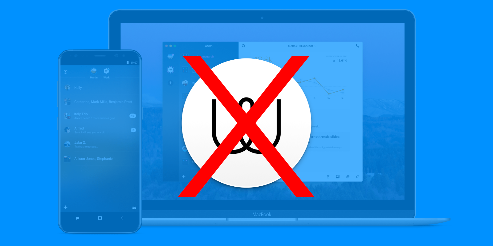

---
date:
    created: 2019-11-19
categories:
    - Announcements
authors:
    - danarel
links:
    - Real Time Communication: https://www.privacyguides.org/en/real-time-communication/
    - Types of Communication Networks: https://www.privacyguides.org/en/advanced/communication-network-types/
tags:
    - Instant Messengers
description: Wire has been removed from Privacy Guides' recommendations following their acquisition by a US holding company and VC investments.
schema_type: NewsArticle
---
# Delisting Wire From Privacy Guides

It has recently come to the attention of the *Privacy Guides* team that **Wire**, the popular end-to-end encryption messaging platform [has been sold or moved to a US company](https://web.archive.org/web/20201128215737/https://forum.privacytools.io/t/wire-swiss-gmbh-is-now-owned-by-a-usa-holding-company/1932). After a week of questioning, Wire finally confirmed they had changed holding companies and would now be a US based company in a move they called “simple and pragmatic,” as they worked to expand their foothold in the enterprise market. This also came alongside the news that Wire had accepted more than $8 million in Venture Capital (VC) funding from Morpheus Ventures, as well as other investors.<!-- more -->

Morpheus Ventures holds a [portfolio](https://web.archive.org/web/20201128215737/https://morpheus.com/portfolio/) including companies in healthcare, voice AI, life insurance, and retail customer data analytics: All sectors that have historically used invasive data collection methods to survive. Why would a VC with a portfolio centered on consumer data want to invest in a company whose mission claims to protect that very same information?

Earlier this year, Wire announced they had entered a partnership with [FedResults](https://web.archive.org/web/20201128215737/https://www.globenewswire.com/news-release/2019/07/10/1880912/0/en/Wire-and-FedResults-Partner-to-Offer-End-to-End-Encrypted-Collaboration-Platform-to-Government-Agencies.html), in a move that would bring Wire's secure messaging platform to US federal agencies. This raised a few eyebrows, but did not alarm the privacy community as Wire remained Swiss based and beholden to Switzerland's strict privacy laws. Today however, while much of Wire's business will continue to be run out of their Swiss offices, with new US-based ownership it is not entirely clear how much jurisdiction the United States will have over Wire data.

This is alarming because it is well known that Wire [stores unencrypted metadata](https://web.archive.org/web/20201128215737/https://www.vice.com/en_us/article/gvzw5x/secure-messaging-app-wire-stores-everyone-youve-ever-contacted-in-plain-text) for every user.

In an interview with [TechCrunch](https://web.archive.org/web/20201128215737/https://techcrunch.com/2019/11/13/messaging-app-wire-confirms-8-2m-raise-responds-to-privacy-concerns-after-moving-holding-company-to-the-us/), Wire CEO Morten Brøgger said of privacy laws: “We are in Switzerland, which has the best privacy laws in the world” — it’s subject to Europe’s General Data Protection Regulation framework (GDPR) on top of its own local laws — “and Wire now belongs to a new group holding, but there no change in control.” [sic]

Even if he is correct, the move and statement do bring up further questions. With Wire now being a US company with contracts partnering it with US federal authorities, will those authorities now have leverage to compel Wire to give up metadata on users? Wire has investors to answer to and will not be able to risk losing large deals with clients like the US federal government. This is of course a hypothetical situation, but one to be considered nonetheless as we decide which services to recommend on [*Privacy Guides*](https://www.privacyguides.org/en/tools/).

Wire also quietly made an adjustment to its own privacy policy. A [previous version](https://web.archive.org/web/20180324221043/https://wire.com/en/legal/#privacy-7) of the policy (July 18, 2017) stated it would only share user data when required by law. Now (Updated September 1, 2018), it reads they will share user data when "necessary." What does necessary mean, and necessary to whom? Necessary to law enforcement, shareholders, or advertisers? The word "necessary" is an alarming change because "necessary" is purposefully vague terminology that could conceivably be used as a tool to justify any action. This change doesn't leave the user with much confidence as to when the company may share your data.

Yet another red flag, and one of the more important ones to us, was is that Wire decided not to disclose this policy change to its users, and when asked why, Brøgger was flippant in his response, stating: “Our evaluation was that this was not necessary. Was it right or wrong? I don’t know.”

We feel we do know, and the answer was that it was wrong. Privacy and security are not built solely on strong technology, but on trust. Yes, we can review Wire's open source code on GitHub, but we can't ever be sure that code is the same exact code that runs on their servers in practice. Yet, we have trusted them in the past because Wire had built a trustworthy reputation for themselves. We now feel that Wire has lost this reputation. By deciding to withhold information regarding its ownership and policies from its users, Wire has broken the trust our community has placed in it, and worse yet sounds almost dismissive of the worries voiced by the privacy community that had long held them in high regard.

Because of these ongoing concerns, and this break in trust in Wire's organization, *Privacy Guides* has made the decision to remove Wire from its recommendations. It is worth noting that does not necessarily mean Wire is unsafe, but we believe it is our duty to recommend products that we as a team feel comfortable standing behind. We need to believe in the security, privacy, and integrity of our recommendations, and we no longer feel we can do that with Wire at this time.

---

**2023-10-23:** This post has been edited to reflect the team's move from [PrivacyTools](https://www.privacyguides.org/en/about/privacytools/) to Privacy Guides.
