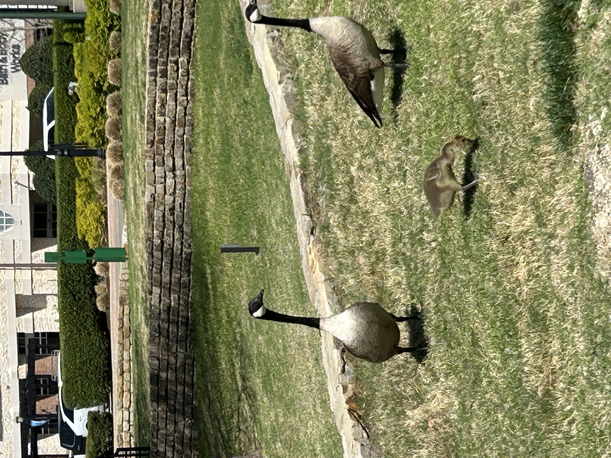
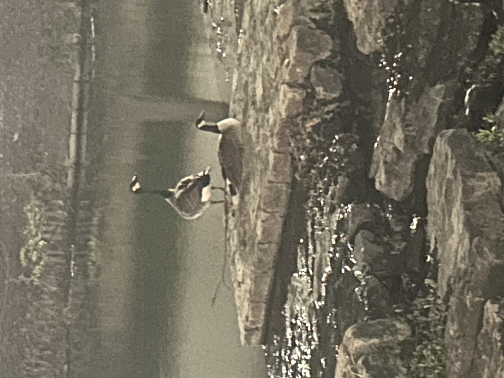
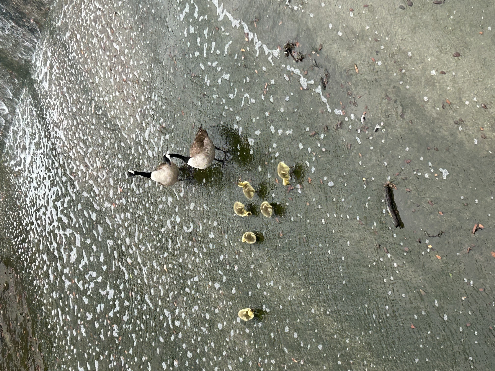

---
date:
    created: 2025-04-09T19:00:00Z
categories:
    - Explainers
authors:
    - fria
tags:
    - Privacy Guides
license: BY-SA
---
# Digital Provenance: Implications on Privacy

With the popularity of generative AI, it's becoming more and more difficult to [distinguish](https://uwaterloo.ca/news/media/can-you-tell-ai-generated-people-real-ones) reality from fiction. Can this problem be solved using cryptography? What are the privacy implications of the currently proposed systems?<!-- more -->

## The Problem

Can you tell which of these images are AI generated?

Actually, they're all real. But the fact that you believed some of them were AI generated poses a problem: how can we tell where an image came from, if it was AI generated, whether it was edited?

## Provenance

[Provenance](https://youtu.be/K56EhgfCDjs) is the history of ownership of an object, typically used when referring to antiques or art. Knowing the history of a piece of art can affect the value a lot, but you need a way to prove it's an original piece by the artist instead of a reproduction, or was owned by a famous person.

Provenance can take many [forms](https://artbusiness.com/provwarn.html), from an original receipt or documentation from the artist themself to stickers from a gallery attached to it. Typically, you want a signed [certificate](https://www.artcertificate.co.uk/?id_article=2267) from an expert on the artist in order to verify its authenticity.

## Hoaxes

It's important for historical preservation as well to know that an object is really from a certain time period. There's no shortage of [historical hoaxes](https://www.history.com/articles/7-historical-hoaxes). These can distort our view of history and make us all a bit dumber.

### Cardiff Giant

One of the most famous hoaxes was that of the [Cardiff Giant](https://www.history.com/articles/the-cardiff-giant-fools-the-nation-145-years-ago).

An atheist named George Hull got into an argument with a preacher. Hull was frustrated with the preacher's literal interpretation of the bible, particularly his belief that giants were real.

Hull devised a plan to trick the religious and make some money at the same time. He would have a statue of a giant man constructed and pass it off as a petrified human.

After securing the materials needed, specifically a soft material called gypsum, he convinced a marble dealer to help him with his scheme. A pair of sculptors carved out the visage of a giant 10-foot man, with Hull posing as a model. They even poured sulfuric acid over it to give it an aged look.

He settled on burying the giant in Cardiff, New York, where he cut a deal with a distant relative and farmer named William "Stub" Newell.

On October 16, 1869, Newell hired an unsuspecting pair of workers to dig a well on his property. After they inevitably uncovered the giant, it wasn't long before the whole town was in a frenzy.

Speculation that the sculpture was an ancient, petrified man quickly began to spread. Eventually, a syndicate of businessmen offered Newell $30,000 (worth $[705,438.97](https://www.in2013dollars.com/us/inflation/1869?amount=30000) in today's money).

P.T. Barnum even tried to buy the sculpture, and after being turned down, he had a replica built and displayed it in a Manhattan museum. Several other copies were made afterward, and soon, there were petrified giants being exhibited all over the country.

In a way that seems familiar to us now, you couldn't even be sure you were looking at the *real* hoax. Misinformation can so easily mutate and spread when left unchecked.

A famed Yale paleontologist named Othniel Charles Marsh declared it "of very recent origin, and a most decided humbug." Unfortunately, as is so often the case, Hull had already cashed in on the furvor by the time experts had properly debunked his hoax.

### AI Hoaxes

Many modern hoaxes tend to make use of social media and focus on getting views and clicks over selling a physical object.

[Miniminuteman](https://youtu.be/Pc2psN0PFTk) is a great YouTube channel covering misinformation on the internet, specifically about archaeology. Misinformation can spread quickly, especially now with the rise of generative AI that can make convincing fake images and videos.

[Here](https://www.mediamatters.org/media/4016186/embed/embed) you can see an example of AI being used to make a fake Joe Rogan podcast clip. Now, whether or not you view Joe Rogan as a reliable source of information is another topic, but as one of the [most popular podcasts](https://podcastcharts.byspotify.com), his reach could be leveraged to spread dangerous misinformation like that a meteor is going to hit earth and kill everyone.

The effort required is low and the return is high. With TikTok's [Creator Rewards Program](https://www.tiktok.com/creator-academy/en/article/creator-rewards-program), content that's at least 60 seconds long and has high engagement will be rewarded. That means longer videos with alarming content like conspiracy theory videos will do very well since they will have lots of comments from people either fooled by the content posting about how scared they are or people debunking the claims. The insidious thing is the creators get rewarded either way.

[Several](https://youtu.be/E4I6K8OEyho?si=wbWAUcLsjOA7yDnO) [history](https://youtu.be/cqrHmjGD1ds?si=k60RTO9MH177ASTS) [channels](https://youtu.be/HG1324unhcA?si=MuwglKd52FQ7iKU3) on YouTube have expressed their concerns about misinformation being spread about history through AI generated images and videos and how they can distort our view of the past. There's even the possibility that these AI generated images could end up polluting the historical record.

## Project Origin

## Content Authority Initiative

## C2PA

The Coalition for Content Provenance and Authenticity, or [C2PA](https://c2pa.org), combines the efforts of Project Origin and the Content Authenticity Initiative. 

## Content Credentials

Content Credentials are the implementation of digital provenance by the C2PA, the culmination of years of research and development by major tech companies, from camera manufacturers to photo editing software and AI companies to social media sites.

The way content credentials work draws on concepts both familiar and alien. The standard is designed to be flexible and cover the myriad ways media is used online.

### Signatures

The foundation is based around cryptographic signatures, similar to how you'd cryptographically sign software or text with a PGP signature.

#### Certificate Authorities

There are certificate authorities similar to how HTTPS works, which allows only signatures from trusted sources. Non-trusted signatures will give a warning in whatever C2PA-enabled software you're using.

Content credentials allow for each application to provide its own *trust lists*: lists of certificate authorities trusted by the application.

The C2PA gives a few examples to illustrate. A news organization might rely on a non-profit organization that verifies the authenticity of sources through real-world due diligence. An insurance company might operate its own internal CA to verify only its own employees handled the images.

### Ingredients

However, what's interesting is content credentials can cover multiple assets being combined together and still be able to verify each element of the image. Each element is called an "ingredient." When the ingredients come together, the result is called a "composed asset," with "asset" referring to a digital media file or data stream.

### Chain of Provenance

It also supports a chain of provenance, showing all steps in the life cycle of the file that change its contents such as edits. These are referred to as "actions." 

The specification supports a list of per-defined actions such as edits, changing the color, translating to a different language, etc. It's really quite flexible 

## Try it Out

There are several online verification tools you can use to try out content credentials. contentcredentials.org offers a [verification tool](https://contentcredentials.org/verify) that lets you upload a media file and check its content credentials.

### BBC

The BBC is doing a limited trial run of content credentials with [BBC Verify](https://www.bbc.com/news/bbcverify). Not all media in these articles have content credentials attached. [This article](https://www.bbc.com/news/world-latin-america-68462851) has content credentials for the video at the bottom. They also ask for feedback, so feel free to provide some. I'd like to see more content credentials show up in news reporting, so please add your voice.

### OpenAI

OpenAI has embraced content credentials, with images generated using ChatGPT identifying themselves using content credentials. Try [generating an image](https://chatgpt.com) and upload it to the verification tool. You should see it identify the origin as OpenAI.

### TikTok

[TikTok](https://newsroom.tiktok.com/en-us/partnering-with-our-industry-to-advance-ai-transparency-and-literacy) became the first social media platform to support content credentials. For now, it's limited to being able to read content credentials from certain AI platforms. They say in the future they'll start labeling all content from TikTok with content credentials, but it seems they haven't enabled that yet, as if you download a video from TikTok, the C2PA verify tool will say it doesn't have any content credentials.

### Nikon

Nikon are planning to release a firmware update for their Z6III camera that will support Content Credentials.

### Adobe

Much of Adobe's software supports Content Credentials, including Photoshop, Lightroom, and Adobe Camera Raw as well as Adobe's Firefly AI.

## Limitations

### Lack of Support

Content Credentials will need widespread support at every level, from hardware OEMs to photo editing software vendors and AI generators to sites that host and display images. The rollout of Content Credentials will be slow as more and more companies start to support them. 

There are still major players missing support like Apple and Android, which is a big problem considering how many images are taken, edited, and shared on smartphones. Once photos taken from your phone can be embued with Content Credentials in the default camera app, we'll see much wider adoption I think.