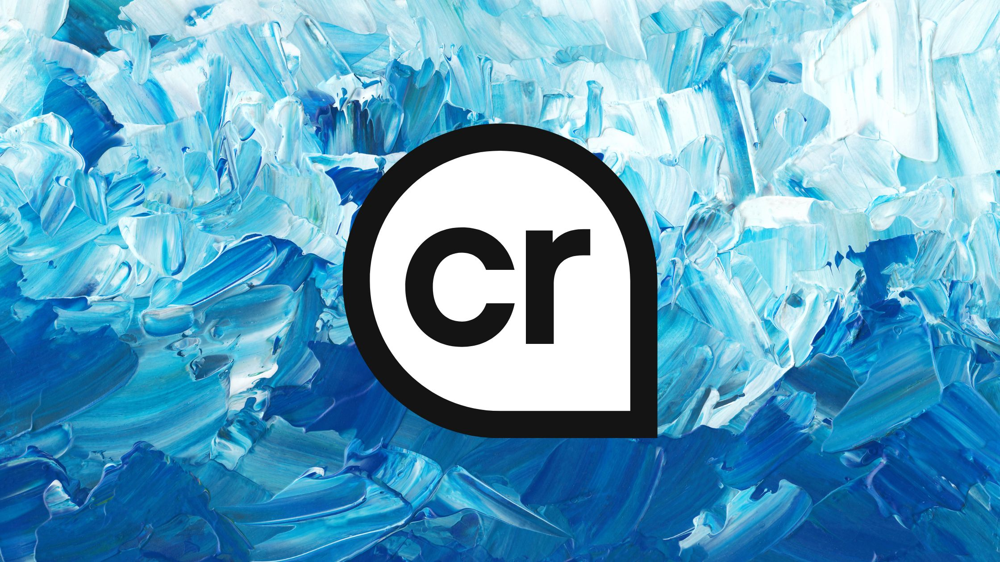
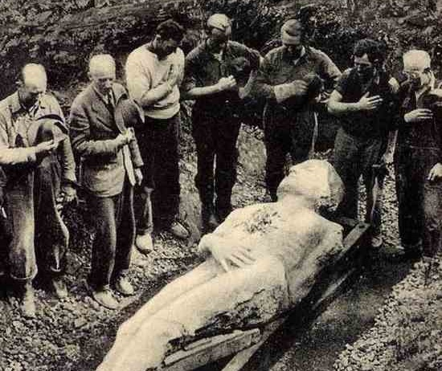

---
date:
    created: 2025-05-19T20:15:00Z
categories:
    - Opinion
authors:
    - fria
tags:
    - AI
    - Content Credentials
---
# The Power of Digital Provenance in the Age of AI



<small aria-hidden="true">Photo: Kseniya Lapteva / Pexels | Logo: Content Credentials</small>

With the popularity of generative AI, it's becoming more and more difficult to [distinguish](https://uwaterloo.ca/news/media/can-you-tell-ai-generated-people-real-ones) reality from fiction. Can this problem be solved using cryptography? What are the privacy implications of the currently proposed systems?<!-- more -->

## The Problem

Can you tell which of these images are AI generated?

<div class="grid" markdown>


</div>

...Have a guess?

---

Actually, they're all real. But the fact that you may have believed some of them were AI generated poses a problem: How can we tell where an image came from, if it was AI generated, and whether it was edited?

## Provenance

[Provenance](https://youtu.be/K56EhgfCDjs) is the history of ownership of an object, typically used when referring to antiques or art. Knowing the history of a piece of art can affect the value a lot, but you need a way to prove it's an original piece by the artist instead of a reproduction, or was owned by a famous person.

Provenance can take many [forms](https://artbusiness.com/provwarn.html), from an original receipt or documentation from the artist themselves to stickers from a gallery attached to it. Typically, you want a signed [certificate](https://www.artcertificate.co.uk/?id_article=2267) from an expert on the artist in order to verify its authenticity.

## Hoaxes

It's important for historical preservation as well to know that an object is really from a certain time period. There's no shortage of [historical hoaxes](https://www.history.com/articles/7-historical-hoaxes). These can distort our view of history and make us all a bit dumber.

### Cardiff Giant

One of the most famous hoaxes was that of the [Cardiff Giant](https://www.history.com/articles/the-cardiff-giant-fools-the-nation-145-years-ago).

An atheist named George Hull got into an argument with a preacher. Hull was frustrated with the preacher's literal interpretation of the bible, particularly his belief that giants were real.

Hull devised a plan to trick the religious and make some money at the same time. He would have a statue of a giant man constructed and pass it off as a petrified human.

After securing the materials needed, specifically a soft material called gypsum, he convinced a marble dealer to help him with his scheme. A pair of sculptors carved out the visage of a giant 10-foot man, with Hull posing as a model. They even poured sulfuric acid over it to give it an aged look.

He settled on burying the giant in Cardiff, New York, where he cut a deal with a distant relative and farmer named William "Stub" Newell.

On October 16, 1869, Newell hired an unsuspecting pair of workers to dig a well on his property. After they inevitably uncovered the giant, it wasn't long before the whole town was in a frenzy.



<small aria-hidden="true">Photo: Wikimedia Commons (Public Domain)</small>

Speculation that the sculpture was an ancient, petrified man quickly began to spread. Eventually, a syndicate of businessmen offered Newell $30,000 (worth $[705,438.97](https://www.in2013dollars.com/us/inflation/1869?amount=30000) in today's money) for a three-fourths stake, and he took them up on that offer.

P.T. Barnum even tried to buy the sculpture, and after being turned down, he had a replica built and displayed it in a Manhattan museum. Several other copies were made afterward, and soon, there were petrified giants being exhibited all over the country.

In a way that seems familiar to us now, you couldn't even be sure you were looking at the *real* hoax. Misinformation can so easily mutate and spread when left unchecked.

A famed Yale paleontologist named Othniel Charles Marsh declared it "of very recent origin, and a most decided humbug." Unfortunately, as is so often the case, Hull had already cashed in on the fervor by the time experts had properly debunked his hoax.

### AI Hoaxes

Many modern hoaxes tend to make use of social media and focus on getting views and clicks over selling a physical object.

[Miniminuteman](https://youtu.be/Pc2psN0PFTk) is a great YouTube channel covering misinformation on the internet, specifically about archaeology. Misinformation can spread quickly, especially now with the rise of generative AI that can make convincing fake images and videos.

[Here](https://www.mediamatters.org/media/4016186/embed/embed) you can see an example of AI being used to make a fake Joe Rogan podcast clip. Now, whether or not you view Joe Rogan as a reliable source of information is another topic, but as one of the [most popular podcasts](https://podcastcharts.byspotify.com), his reach could be leveraged to spread dangerous misinformation like that a meteor is going to hit earth and kill everyone.

The effort required is low, and the return is high. With TikTok's [Creator Rewards Program](https://www.tiktok.com/creator-academy/en/article/creator-rewards-program), content that's at least 60 seconds long and has high engagement will be rewarded. That means longer videos with alarming content like conspiracy theory videos will do very well since they will have lots of comments from people either fooled by the content posting about how scared they are or people debunking the claims. The insidious thing is the creators get rewarded either way.

[Several](https://youtu.be/E4I6K8OEyho?si=wbWAUcLsjOA7yDnO) [history](https://youtu.be/cqrHmjGD1ds?si=k60RTO9MH177ASTS) [channels](https://youtu.be/HG1324unhcA?si=MuwglKd52FQ7iKU3) on YouTube have expressed their concerns about misinformation being spread about history through AI generated images and videos and how they can distort our view of the past. There's even the possibility that these AI generated images could end up polluting the historical record.

## Content Authenticity Initiative

In 2019, [Adobe announced](https://contentauthenticity.org/blog/test) that it was partnering with the New York Times and Twitter on a project to develop an industry standard for digital content attribution called the Content Authenticity Initiative.

Twitter has since dropped out of the partnership.

## Project Origin

At the same time, [Project Origin](https://www.originproject.info) was designing their system for content transparency. This started as a partnership between Microsoft and the BBC.

## C2PA

The Coalition for Content Provenance and Authenticity, or [C2PA](https://c2pa.org), combines the efforts of Project Origin and the Content Authenticity Initiative. Together, they created the [C2PA standard](https://c2pa.org/specifications/specifications/2.1/specs/C2PA_Specification.html) used to add verifiable provenance data to files, which they dub "Content Credentials."

## Content Credentials

[Content Credentials](https://contentcredentials.org) are the implementation of digital provenance by the C2PA, the culmination of years of research and development by major tech companies, from camera manufacturers to photo editing software and AI companies to social media sites.

The way Content Credentials work draws on concepts both familiar and alien. The standard is designed to be flexible and cover the myriad ways media is used online.

It's important to note that Content Credentials aren't attempting to determine "truth"; that's a much more complex and philosophical topic. Rather, they're trying to show where an image came from, edits made to it, its constituent parts, etc. so that you can decide for yourself if you trust the source. It's trying to show you that an image came from the BBC, rather than whether you should trust the BBC.

### Manifest

Content Credentials are contained in what's called the **manifest**. The manifest consists of the claim, claim signature, and assertions.


<small aria-hidden="true">Illustration: [C2PA](https://c2pa.org/specifications/specifications/2.1/specs/C2PA_Specification.html)</small>

The manifest is created by hardware or software called a "claim generator."

Files can have multiple manifests, and the set of manifests comprise its provenance data.

#### Assertions

An assertion is labelled data such as the type of camera used, actions performed on the image such as color corrections, a thumbnail image, or other types of data.

#### Claim

The claim gathers together all the assertions and then hashes and cryptographically signs them. The claim is the part that backs up the assertions with cryptography; without it, there wouldn't be a way to verify the authenticity of the data.

### Signatures

The foundation is based around cryptographic signatures, similar to how you'd cryptographically sign software or text with a PGP signature.

The parts of a file that are cryptographically verified are called "hard bindings." This allows programs to detect tampering.

#### Certificate Authorities

There are certificate authorities similar to how HTTPS works, which allow only signatures from trusted sources. Non-trusted signatures will give a warning in whatever C2PA-enabled software you're using.

Content Credentials allow for each application to provide its own *trust lists*: lists of certificate authorities trusted by the application.

The C2PA gives a few examples to illustrate. A news organization might rely on a non-profit organization that verifies the authenticity of sources through real-world due diligence. An insurance company might operate its own internal CA to verify only its own employees handled the images.

### Ingredients

However, what's interesting is Content Credentials can cover multiple assets being [combined](https://contentcredentials.org/verify?source=https%3A%2F%2Fcontentcredentials.org%2F_app%2Fimmutable%2Fassets%2Fhome2.91ab8f2d.jpg) and still be able to verify each element of the image. Each element is called an "ingredient." When the ingredients come together, the result is called a "composed asset," with "asset" referring to a digital media file or data stream.

### Chain of Provenance

It also supports a chain of provenance, showing all steps in the life cycle of the file that change its contents such as edits. These are referred to as "actions."

The specification supports a list of pre-defined actions such as edits, changing the color, translating to a different language, etc. It's really quite flexible, but the flexibility of information that can be provided allows for more opportunities for errors and means you need to trust the entity providing the information more.

An issue I noticed is when making edits using software that doesn't support Content Credentials, they will be corrupted and can't be read by verification programs. This poses a problem for the "unbroken chain of provenance" that the standard promises.

These verification programs tend to offer a way to check against a database of images with Content Credentials, so you can find an image with unbroken provenance data. They use "soft bindings" or a type of fingerprinting of the image in order to find similar images in the database.

I think this problem will be less and less of an issue when more software supports the standard. It will need to be so ubiquitous that image viewing programs don't trust images without provenance data, similar to how browsers don't trust websites without HTTPS. But for now with its very limited availability, that's not the case.

### Privacy

Since Content Credentials are all about attaching extra data to images, concerns about privacy are reasonable.

However, it's important to remember that metadata has always existed in relation to digital files. Just like the metadata we've always had, Content Credentials are optional.

Of course, it'll be up to programs we use to mediate what data is included. In order for the system to work as intended, certain things like "this photo was edited in Adobe Photoshop" will need to be automatically applied. Clear lines between personal data such as names, location, etc. need to be kept up to the user to add.

Privacy was one of the stated goals when the C2PA was designing Content Credentials, and I think they've done a good job giving users control over their information.

## Support

There are several online verification tools you can use to try out Content Credentials. [ContentCredentials.org](https://contentcredentials.org) offers a [verification tool](https://contentcredentials.org/verify) that lets you upload a media file and check its Content Credentials. They have some example images on their site you can try, or you can upload images from elsewhere and see where Content Credentials are supported, for example you can upload any image generated in ChatGPT.

Content Credentials also offers an official [command line tool](https://github.com/contentauth/c2pa-rs/releases?q=c2patool), so you can view exactly what data is being stored in the image. They provide some samples as well that you can play around with. To view the content credentials, just run

```sh
c2patool sample/C.jpg
```

for any image you want to inspect, replacing sample/C.jpg with a path to your image.

### BBC

The BBC is doing a limited trial run of Content Credentials with [BBC Verify](https://www.bbc.com/news/bbcverify). Not all media in these articles have Content Credentials attached. [This article](https://www.bbc.com/news/world-latin-america-68462851) has Content Credentials for the video at the bottom. They also ask for feedback, so feel free to provide some. I'd like to see more Content Credentials show up in news reporting, so please add your voice.

### OpenAI

OpenAI has embraced Content Credentials, with images generated using ChatGPT identifying themselves using Content Credentials. Try [generating an image](https://chatgpt.com) and upload it to the verification tool. You should see it identify the origin as OpenAI.

### TikTok

[TikTok](https://newsroom.tiktok.com/en-us/partnering-with-our-industry-to-advance-ai-transparency-and-literacy) became the first video sharing platform to support Content Credentials. For now, it's limited to being able to read Content Credentials from certain AI platforms. They say in the future they'll start labeling all content from TikTok with Content Credentials, but it seems they haven't enabled that yet, as if you download a video from TikTok, the C2PA verify tool will say it doesn't have any Content Credentials.

### Leica

Leica's [M11-P camera](https://leica-camera.com/en-US/photography/cameras/m/m11-p-black) is the first camera in the world to support Content Credentials. That's a huge step toward adoption; camera manufacturers need to support Content Credentials if they're going to be included from the creation of the image.

### Nikon

Nikon is planning to release a firmware update for their [Z6III](https://www.nikon.co.uk/en_GB/learn-and-explore/magazine/gear/nikon-z6iii-firmware-update-to-feature-content-verification) camera that will support Content Credentials.

### Adobe

Much of Adobe's [software](https://helpx.adobe.com/creative-cloud/help/content-credentials.html) supports Content Credentials, including Photoshop, Lightroom, and Adobe Camera Raw as well as Adobe's Firefly AI.

### Qualcomm

With the Snapdragon 8 Gen 3 chipset, Qualcomm is embedding Content Credential capabilities into the Trusted Execution Environment, allowing for Content Credentials to be added right as the photo is produced.

## Limitations

### Lack of Support

Content Credentials will need widespread support at every level, from hardware OEMs to photo editing software vendors and AI generators to sites that host and display images. The rollout of Content Credentials will be slow, although more and more companies are starting to support them.

There are still major players missing support like Apple and Android, which is a big problem considering how many images are taken, edited, and shared on smartphones. Once photos taken from your phone can be imbued with Content Credentials in the default camera app, we'll see much wider adoption I think.

### Easy to Remove

In my testing, any edits from a program that doesn't support Content Credentials will render them unreadable after that point. This problem won't be as bad if and when support for Content Credentials becomes widespread, since you can just decide not to trust images without them, sort of like not trusting a website without HTTPS. Platforms could even display a warning.

But for now, removing Content Credentials won't be noticed.

### Reliant on Certificate Authorities

The system shares a flaw with HTTPS in that you need to rely on trusted Certificate Authorities to verify the validity of the information, except that Content Credentials are trying to verify a lot more information than just who originally made the image.

Since anyone can add their own Content Credentials to an image, a warning is displayed similar to a certificate warning in your browser that the Content Credentials come from an untrusted entity.

### Complexity

One of the issues I ran into while researching was just how complex the standard is, since it needs to cover so many use cases and situations. This is pure speculation, but I can imagine the sheer complexity makes it unattractive for platforms to implement and maintain, which could be contributing to the very slow and partial rollout we're seeing on the platforms of even founding members of the project like the BBC.

I think this will be less of an issue as it rolls out however, as platforms will likely be able to use each other's implementations, or at least reference them when implementing it on their platform.

The standard is still in early stages and there's plenty of room to shape it and improve it in the future, so make your voice heard about how you want to see it implemented. I think with more awareness about Content Credentials, platforms will feel more pressure to support them, so if you want to see this feature on your favorite platform, speak up and gather support.
