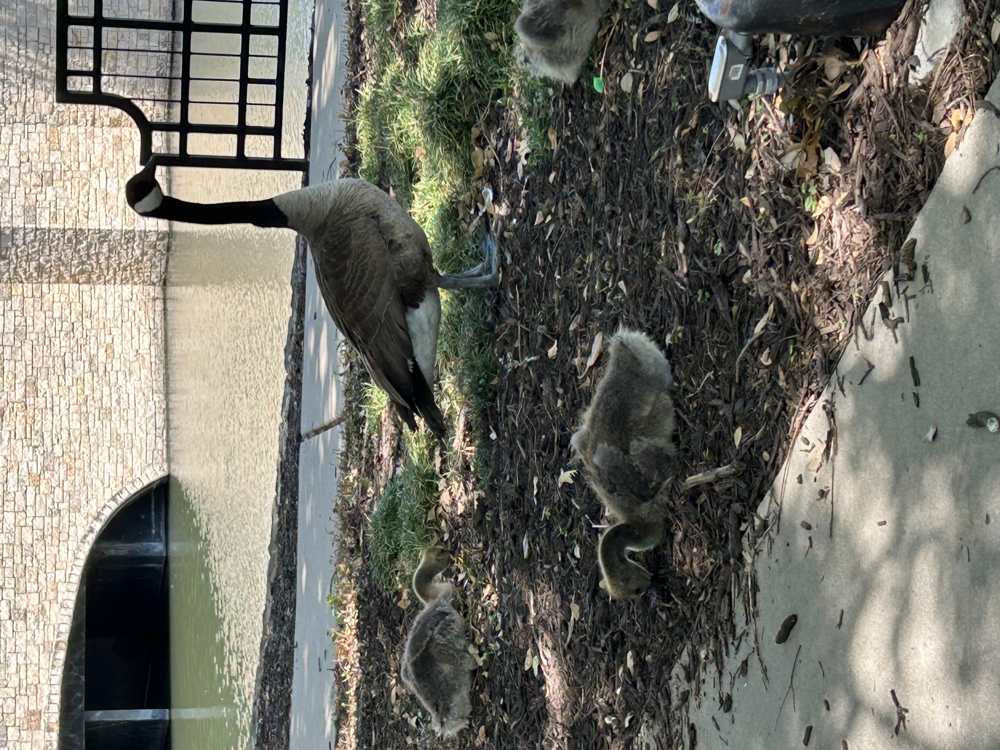
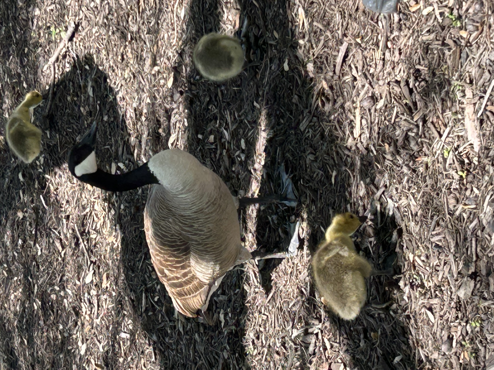
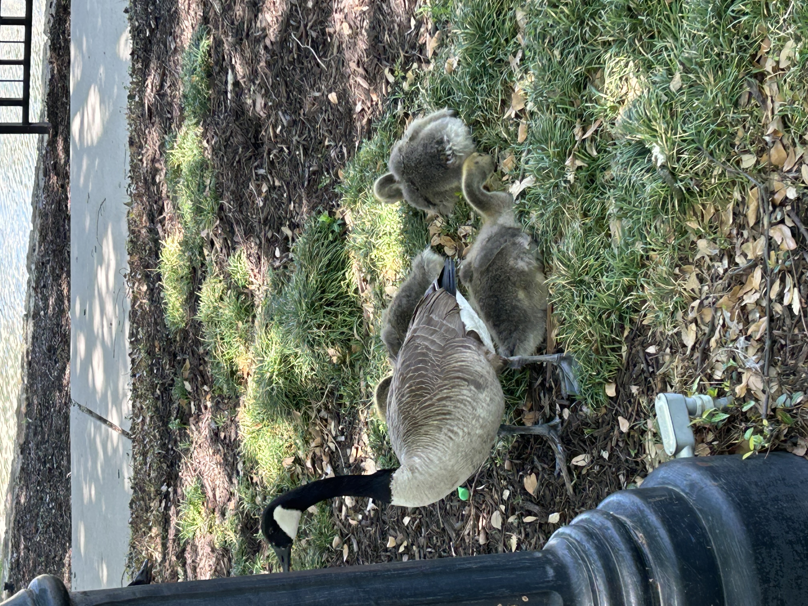

---
date:
    created: 2025-04-09T19:00:00Z
categories:
    - Explainers
authors:
    - fria
tags:
    - Privacy Guides
license: BY-SA
---
# Digital Provenance: Implications on Privacy

With the popularity of generative AI, it's becoming more and more difficult to [distinguish](https://uwaterloo.ca/news/media/can-you-tell-ai-generated-people-real-ones) reality from fiction. Can this problem be solved using cryptography? What are the privacy implications of the currently proposed systems?<!--more-->

## The Problem

Can you tell which of these images are AI generated?

Actually, they're all real. But the fact that you believed some of them were AI generated poses a problem: how can we tell where an image came from, if it was AI generated, whether it was edited?

