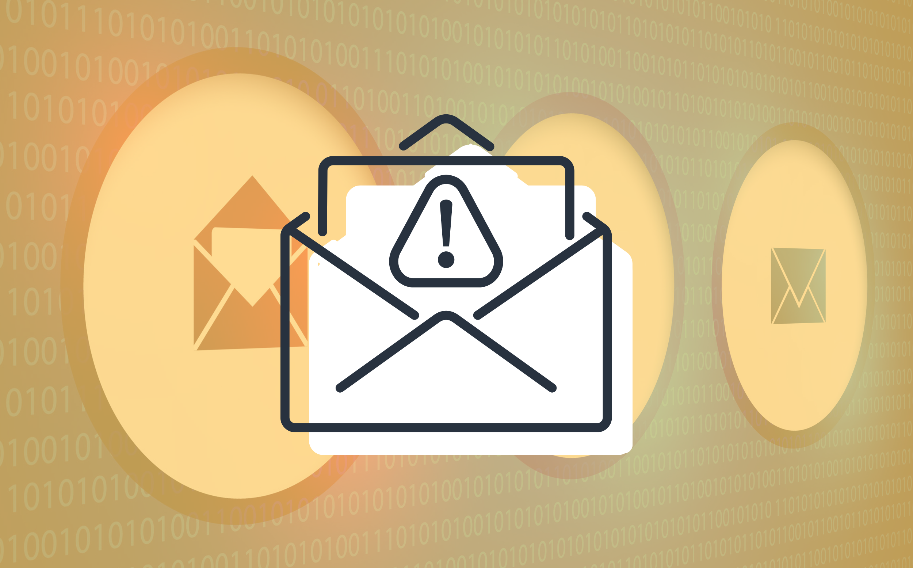

---
date:
    created: 2025-08-18T19:00:00Z
categories:
    - Explainers
authors:
    - fria
tags:
    - Email
license: BY-SA
schema_type: BackgroundNewsArticle
description: Email is ubiquitous. If you want to function in modern society, you pretty much have to have an email address. But is it really a good idea to still be relying on the same decades old techology? What can we do about replacing it?
preview:
  cover: blog/assets/images/email-security/cover.png
---

<small aria-hidden="true">Illustration: fria / Privacy Guides</small>

# Email Security: Where We Are and What the Future Holds

Email is ubiquitous. If you want to function in modern society, you pretty much have to have an email address. What was originally just a simple protocol to send messages between machines has morphed beyond what it was originally intended for into the defacto authentication, identity, and "secure" communication channel for almost all technology users today. It's been updated many many times to fix security issues and there's more updates to come, but is it worth trying to fix a decades-old protocol or should we scrap it all and start over?<!-- more -->

## Current State of Email Security

The [**Simple Mail Transport Protocol (SMTP)**](https://www.rfc-editor.org/rfc/rfc5321.html) is the standard used to send emails.

Over the years, multiple protocols have been introduced to fix security issues and improve the usability of email, resulting in a complex mess that we're still feeling the consequences of to this day.

### Encryption

By default, there's no encryption in SMTP. Not transport encryption or end-to-end encrpytion, it's just a plaintext protocol.

To remedy this, several solutions have been created.

#### STARTTLS

[STARTTLS](https://www.rfc-editor.org/rfc/rfc3207) is a command that allows email clients to negotiate TLS encryption. Importantly, the negotiation phase happens in plaintext which leaves it vulnerable to attackers.

STARTTLS allows a bit more flexibility at the cost of some security. Since you don't really know if the recipient's email client supports TLS or not, it allows you to continue with the SMTP session anyway if you want to.

Since it's just using TLS, STARTTLS can't provide E2EE, just transport encryption. The encryption looks something like:

Encrypted between your email client and your SMTP server → decrypted at your SMTP server → Encrypted between your SMTP server and recipient's SMTP server → decrypted at recipient's SMTP server → encrypted between their SMTP server and email client

At each point in the process TLS encrytion is not guaranteed. Now consider that you can have multiple recipients with their own SMTP servers as well and you start to see how flimsly this protection can be. And since the initial negotiation is in plaintext, an attacker can simply strip away the STARTTLS command, preventing a secure connection from being established.

Authentication is left to another protocol to solve, this just handles the transport encryption.

#### SMTPS

Also known as "Implicit TLS" (as opposed to the "Explicit TLS" of STARTTLS), SMTPS starts with an encrypted connection, similar to HTTPS, removing the potential for an adversary to downgrade the connection.

The [current](https://datatracker.ietf.org/doc/html/rfc8314) recommendations are to use port 465 for SMTPS and port 587 for STARTTLS. Unfortunately, these ports aren't standardized and thus there is disagreement and confusion about what port should be used for SMTPS.

In the past, ports 25, 465, 587, and 2525 have all been used for SMTP at various points. This lack of a standardized port means that you end up with services using different ports and being unable to establish a secure connection. Particularly, there is still confusion in some email providers whether to use port 465 or port 587 for SMTPS, althought the current recommendation is port 465.

#### POP3S

POP3 also supports implicit TLS over port 995.

#### IMAPS

Ditto for IMAP, the implicit TLS port is 993.

#### PGP

The above features only protect the email in transit and don't protect against the email providers involved, which is a massive security issue if you don't trust your email provider. On top of that, you as a user have no control over which parts of the chain are encrypted. If you want to be sure that no party in between you and your recipient can read or alter your emails, you need to use end-to-end encryption. Unfortunately, by default, email doesn't support end-to-end encrytion.

[Pretty Good Privacy (PGP)](https://www.openpgp.org/about/) was originally created in 1997 by [Phil Zimmerman](https://github.dev/friadev/privacyguides.org/tree/Email-security). While originally proprietary software, an open source version of PGP called OpenPGP has been standardized by the [IETF](https://www.rfc-editor.org/rfc/rfc9580.html). As you can imagine from software originally conceived in the 90's, the user experience isn't the smoothest.

Unlike modern messengers like [Signal](https://signal.org), OpenPGP requires you to [manaully manage your keys](https://dev.to/adityabhuyan/how-to-generate-your-own-public-and-secret-keys-for-pgp-encryption-1joh). This is a problem not only because it's cumbersome, but the security of E2EE rests on protecting the private key. If the private key is compromised, your messages are compromised.

PGP also lacks [forward secrecy](https://en.wikipedia.org/wiki/Forward_secrecy), meaning that if your private key is ever exposed, all previous messages you've ever sent using that key are also exposed. All it takes is a slight user error for a catastrophic compromise.

PGP encryption also usually doesn't encrypt important metadata like `To`, `From`, `Cc`, `Date`, and `Subject`, stored in the [email header](https://en.wikipedia.org/wiki/Email#Message_header); usually, only the body of the email is encrypted, which can be a major privacy issue. What the email is about, who you are, and who you're messaging can all be revealed even with E2EE. Some email clients use their hidden headers that can reveal more data about you.

#### S/MIME

Another common option for email encryption is [S/MIME](https://www.digicert.com/faq/email-trust/what-is-smime-or-encrypted-email), or Secure/Multipurpose Internet Mail Extensions. S/MIME works a bit like HTTPS, using [X.509 digital certificates](https://www.ssl.com/faqs/what-is-an-x-509-certificate/) and [certificate authorities](https://www.digicert.com/blog/what-is-a-certificate-authority) to encrypt and verify the authenticity of emails.

While a step up from the manual keys of PGP, S/MIME is still a pain to use, particularly because it usually requires purchasing and managing a certificate from a CA, which can be expensive and annoying. S/MIME also lacks forward secrecy just like PGP, so if there's ever a compromise of your private key, all previously sent messages are also compromised.

These issues make S/MIME unviable for most people outside of business settings.

#### Web Key Directory

A problem with PGP is getting your public key out to people without manually exchanging keys. This problem can be solved with Web Key Directory (WKD), which allows you to upload your public PGP key to a server and clients that want to send E2EE emails to you can ask that server to send you their public key.

You can read more on our [email security](https://www.privacyguides.org/en/basics/email-security/?h=email#what-is-the-web-key-directory-standard) page.

### Authentication

SMTP by default essentially has no authentication and allows spoofing the `MAIL FROM` header. Your email client will just blindly accept whoever the sender says they are without any authentication. Luckily, there are several solutions for this.

There are multiple methods that email providers can implement to verify the authenticity of an email sender.

#### SPF

The first solution implemented was [Sender Policy Framework (SPF)](https://datatracker.ietf.org/doc/html/rfc7208). SPF uses [DNS TXT records](https://www.cloudflare.com/learning/dns/dns-records/dns-txt-record/).

Just like the name sounds, a DNS TXT record allows you to store text in a [DNS record](https://www.cloudflare.com/learning/dns/dns-records/). Here's an example of what a DNS TXT record might look like:

| example.com | record type | value | TTL |
|-------------|--------------|--------|-----|
| @           | TXT          | "color=blue" |99999|

SPF lists all the servers that are authorized to send from a specific domain. When an email is received, it checks the sending server against the list of authorized servers for that domain. An SPF record might look like this:

| example.com | record type | value | TTL |
|-------------|--------------|--------|-----|
| @ | TXT | "v=spf1 ip4:200.56.78.99 ip4:156.67.109.43 include:_spf.google.com -all" |99999|

The IP addresses are the ones that are authorized to send email from this domain. The `include:` tag denotes what third-party domains are allowed to send email on behalf of `example.com`. The third-party SPF record will be checked and included in the allowed IP addresses.

While a good start, SPF still has several glaring weaknesses. Since it relies on DNS, an attack on the DNS infrastructure could cause spoofed DNS data to be accepted.

Since SPF doesn't authenticate individual users, it's still possible for a sender to impersonate another user. SPF does not authenticate the `MAIL FROM` header. If you try to send an email from a gmail.com domain but server doesn't match gmail.com, it will fail.

SPF has a few different modes, allowing for a hard fail, soft fail, or completely ignoring it. `-all` means an email that fails will be rejected, `~all` will mark emails that fail as insecure or spam but still send them, and `+all` will specify that any server is allowed to send emails on behalf of your domain.

This flexibility, while convenient, allows for the security benefits of SPF to be completely undermined.

#### DKIM

[DomainKeys Identified Mail (DKIM)](https://www.cloudflare.com/learning/dns/dns-records/dns-dkim-record/) relies on public key cryptography to verify the domain of an email.

Example of a DKIM DNS TXT record:

| name | record type | value | TTL |
|-------------|--------------|--------|-----|
| test-email._domainkey.example.com | TXT | "v=DKIM1; k=rsa; p=MIIBIjANBgkqhkiG9w0BAQEFAAOCAQ8AMIIBCgKCAQEAtY+7sGVwvyS8w+3HgJk7EviazH+C4L8gV4gOJzAq9oKJjZ5En7LDEw3FqAh8C0M59c9sBQcC+Kj8VxMBY9y+E0Pm1fPK9V7sI3Gm7yE7Y9yU4uVZr8R3N+5z+qZ+7V76RU4oZ0mtSvw8m3pX1hZyHd7NZfXaFfKfgd18W5T7YQIDAQAB" | 9999 |

DKIM records are stored under a specific name following the format

`[selector]_domainkey.[domain]`

The public and private keys are generated by the email provider, such as gmail.com. The public key is stored in a publicly available DNS TXT record like the one seen above and is used by the receiver to verify messages. The private key is kept secret by the email provider.

Emails sent from the email provider contain a DKIM header with a signature generated from the private key and the content of the message. If the email message is altered or signed with the wrong key, when the receiver verifies the signature using the public key it will be obvious it was altered.

An example of a DKIM header:

`v=1; a=rsa-sha256; d=example.com; s=test-email; h=from:to:subject bh=uMixy0BsCqhbru4fqPZQdeZY5Pq865sNAnOAxNgUS0s=;b=LiIvJeRyqMo0gngiCygwpiKphJjYezb5kXBKCNj8DqRVcCk7obK6OUg4o+EufEbBtRYQfQhgIkx5m70IqA6dP+DBZUcsJyS9C+vm2xRK7qyHi2hUFpYS5pkeiNVoQk/Wk4wZG4tu/g+OA49mS7VX+64FXr79MPwOMRRmJ3lNwJU=`

`v=` shows the version of DKIM, currently version one is the latest (we'll come back to that later). `a=` shows the algorithm used. `d=` shows the domain of the sender. `s=` denotes the selector that is used in the TXT record. `h=` shows the headers that were used to create the signature. `bh=` shows a hash of the body of the email. `b=` is the signature computed from the listed headers and the hash of the body listed in `bh`.

In this way, not only does DKIM provide assurance that the email was sent from the correct domain, it also protects the integrity of the message. However, since the keys are controlled by your email provider, it can't stop your email provider from tampering with your messages.

Note also that this has nothing to do with encryption of the message, only verifying the authenticity and sender. The message is still sent in plaintext unless another component encrypts it.

#### DMARC

[Domain-based Message Authentication Reporting and Conformance (DMARC)](https://www.cloudflare.com/learning/dns/dns-records/dns-dmarc-record/) is an authentication method that builds on SPF and DKIM. DMARC tells a receiving email server what to do after checking the SPF and DKIM. If the email fails, the DMARC policy tells the receiver whether to mark it as spam, block it, or allow it through. 

DMARC also uses TXT records. An example DMARC policy might look like

`v=DMARC1; p=quarantine; adkim=s; aspf=s;`

The `v=` shows the version of DMARC to use. The `p=` shows what should be done with emails if they fail, in this case `quarantine` means the receiver should put the email in the user's spam folder. `reject` can be specified as well to show that emails that fail should be outright blocked. `adkim=` tells how DKIM should be enforced, with `s` meaning "strict"; for relaxed, `r` is listed instead. Ditto for `aspf=`.

### General Security

#### Email as a Backdoor into Your Accounts

Something seldom discussed is the fact that email is the default 2FA method for most accounts and also can be used to bypass your password through the password reset function on the login screen of most services. This essentially means the security of all of your accounts rests on the security of your email, which can be very shaky and lacks E2EE usually. It's most comparable to SMS 2FA which is also used a lot of the time as a method for getting into accounts when you forgot your password.

I touched on this a bit in my passkey article, but we need to stop relying on email for security critical applications and start using proper recovery methods like recovery codes. Email should be used for what it's intended for: sending messages and updates to people, anouncements, etc.

#### Third-Party Clients

Many email providers such as gmail provide their own clients for you to view your inbox, send messages, etc. But, many people choose to use third-party clients for their email needs.

While it's great that email can support that, it does mean you need to trust another party with your sensitive email and essentially the security of all of your accounts. Not to mention that email clients can have [vulnerabilties](https://www.mozilla.org/en-US/security/known-vulnerabilities/thunderbird/), so you need to be very careful about which one you trust.

#### Email Attack Surface

A big part of the reason email clients can be so vulnerable to exploits is the vast attack surface afforded by things like JavaScript support in emails. This puts email clients dangerously close to the same territory as browsers in terms of attack surface but without the same level of scrutiny or hardening effort that goes into browsers.

Since almost anyone can send you an email at any time, you have to trust that your email client vendor is able to protect you against [vulnerabilities](https://www.csoonline.com/article/1308164/microsoft-outlook-flaw-opens-door-to-1-click-remote-code-execution-attacks.html) and also has timely patches when they're found.

Luckily, lots of email clients let you disable JavaScript and HTML if you want, but not all do, and email clients can have lots of other vulnerabilities as well not related to JavaScript.

## Future of Email Security

It's been a multi-decade cross-industry effort to bring email up to snuff as a modern communication system and we still have a long way to go. There's still efforts to improve the state of email security, so look out for these in the future.

### Improvements to PGP

The IETF has a [working group](https://datatracker.ietf.org/wg/openpgp/about/) for OpenPGP that wants to add many improvments to OpenPGP, including post-quantum encryption, forward secrecy, and usability improvements.

### DKIM2

[DKIM2](https://www.ietf.org/archive/id/draft-gondwana-dkim2-motivation-00.html) is the planned next version of DKIM.

An issue with the current version of DKIM is a malicious actor taking emails signed with DKIM from a different domain and replaying them, spamming them out to thousands of people and eroding trust in the original domain. The new DKIM2 specification would force each hop the email takes along its path to sign it, so any issues will be the fault of the previous hop.

### DMARCbis

[DMARCbis](https://datatracker.ietf.org/doc/draft-ietf-dmarc-dmarcbis/) is a proposed updated version of DMARC.

The `pct` tag is going away, which was a tag that would only allow a specified percentage of emails, say 50%, to be sent if they failed. Apparently, this wasn't implemented properly so now it's being replaced with the `t` mode that is a binary pass or fail.

The new `np` tag adds the ability to define what to do with a non-existent subdomain of a real domain. This will prevent cybercriminals from subverting DMARC by using a fake subdomain.

They are also adding [requirements](https://datatracker.ietf.org/doc/html/draft-ietf-dmarc-dmarcbis-41#name-conformance-requirements-fo) that mail providers must meet to fully conform to the specification, which should eliminate questions about best practices and how DMARC should be implemented.

### SMTP End-to-End Encryption

The biggest obstacle in the way of email privacy is it's not E2EE by default like most modern messengers we use daily. Some providers like ProtonMail will automatically encrypt emails between proton users. The obvious next step is to build E2EE into SMTP itself.

An [RFC proposal](https://dcrubro.com/files/smtp-ee2esign-latest.txt) exists for just such an idea. I'm hopeful something like this can be standardized and widely adopted, and finally bring email into the 21st century.