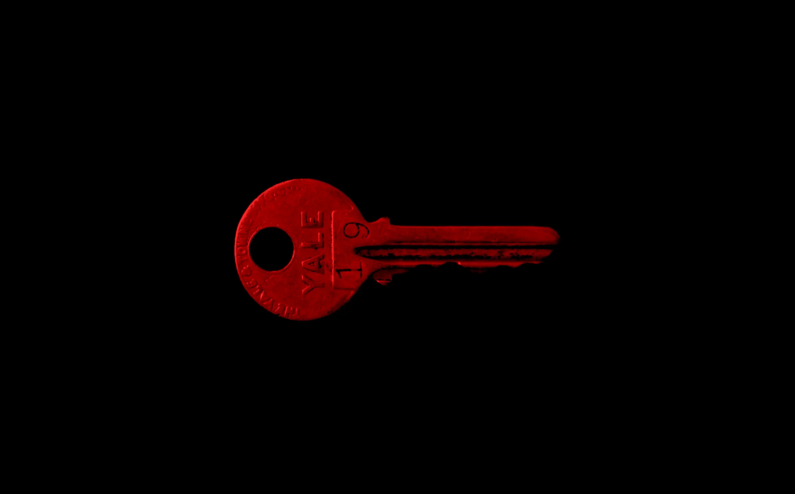

---
date:
    created: 2025-04-11T16:00:00Z
categories:
    - Opinion
authors:
    - em
description: Encryption is not a crime, encryption protects all of us. Encryption, and especially end-to-end encryption, is an essential tool to protect everyone online. Attempts to undermine encryption are an attack to our fundamental right to privacy and an attack to our inherent right to security and safety.
schema_type: OpinionNewsArticle
preview:
  cover: blog/assets/images/encryption-is-not-a-crime/encryption-is-not-a-crime-cover.webp
---
# Encryption Is Not a Crime

<small aria-hidden="true">Photo: Matt Artz / Unsplash</small>

Contrary to what some policymakers seem to believe, whether naively or maliciously, encryption is not a crime. Anyone asserting encryption is a tool for crime is either painfully misinformed or is attempting to manipulate legislators to gain oppressive power over the people.<!-- more -->

Encryption is not a crime, encryption is a shield.

Encryption is the digital tool that protects us against all sorts of attacks. It is the lock on your digital door preventing harmful intruders from entering your home. Encryption is also the door itself, protecting your privacy and intimacy from creepy eavesdroppers while you go about your life.

It's not a crime to lock your home's door for protection, **why would it be a crime to lock your digital door?**

[Encryption protects you](privacy-means-safety.md) from cyberattack, identity theft, discrimination, doxxing, stalking, sexual violence, physical harm, and much more.

## Who says encryption is a crime

Anyone who is well-informed will find it hard to believe someone could want to sabotage such fantastic protection.

Yet, [year](https://www.wired.com/1993/02/crypto-rebels/) after [year](https://www.wired.com/story/a-new-era-of-attacks-on-encryption-is-starting-to-heat-up/), oppressive regimes and lazy or greedy [law enforcement](https://www.techradar.com/computing/cyber-security/anonymity-is-not-a-fundamental-right-experts-disagree-with-europol-chiefs-request-for-encryption-back-door) entities around the world have attempted to [undermine encryption](https://www.howtogeek.com/544727/what-is-an-encryption-backdoor/) using the pretext this is needed to "solve crime", despite all the experts *repeatedly* warning on how [unnecessary](https://arstechnica.com/tech-policy/2019/08/post-snowden-tech-became-more-secure-but-is-govt-really-at-risk-of-going-dark/) and [dangerous](https://www.globalencryption.org/2020/11/breaking-encryption-myths/) this would be. And this is without accounting for all the countries where encryption is *already* [severely restricted](https://www.gp-digital.org/world-map-of-encryption/), such as Russia, China, India, Iran, Egypt, Cuba, and others.

Whether breaking encryption is brought up naively by misinformed authorities, or as a disguised excuse for mass surveillance is up for debate.

Nevertheless, the result is the same: An attempt to destroy **a tool we all need to stay safe**.

## Encryption is a protective shield

Encryption, moreover end-to-end encryption, is a tool we all use in our digital life to stay safe.

In today's world, the boundary between online and offline life is largely dissolved. Almost everything we do "offline" has a record of it "online". Online life is regular life now. It's not just your browsing history.

Your medical record from a visit at the clinic, your purchase transaction from a trip to the store, your travel photos saved in the cloud, your text conversations with your friends, family, and children, are all likely protected with encryption, perhaps even with *end-to-end* encryption.

Such a large trove of personal data needs to be protected against eavesdropping and malicious attacks for everyone to stay safe.

Encryption offers this protection. End-to-end encryption all the more.

## What is end-to-end encryption, and what is the war against it

End-to-end encryption is a type of encryption where only the intended recipient(s) have the ability to decrypt (read) the encrypted data.

This means that if you send a message through [Signal](https://signal.org/) for example, only the participants to this conversation will be able to read the content of this conversation. Even Signal cannot know what is being discussed on Signal.

This greatly annoys some over-controlling authorities who would like to be granted unlimited power to spy on anyone anytime they wish, for vaguely defined purposes that could change at any moment.

End-to-end encryption can also mean a situation where you are "both ends" of the communication.

For example, when enabling Apple's [Advanced Data Protection for iCloud](https://support.apple.com/en-ca/guide/security/sec973254c5f/web) (ADP), it activates end-to-end encryption protection for almost all of iCloud data, including photos. This means that even Apple could not see your photos, or be forced to share your photos with a governmental entity.

Without ADP, Apple can read or share your photos (or other data) if they are legally compelled to, or if they feel like it. The same is true for Google's services, Microsoft's services, and any other online services that aren't end-to-end encrypted.

This is at the root of the latest attack on encryption:

In February this year, it was reported that [Apple was served with a notice](uk-forced-apple-to-remove-adp.md) from the UK's Home Office to force it to break ADP's end-to-end encryption. In response, Apple removed access to ADP from the UK entirely, making this protection unavailable to UK residents.

Do not mistakenly think this attack is limited to the UK and Apple users, however. If this regulation notice or a similar one gets enforced, it would **impact the whole world.** Other countries would likely soon follow, and other services would likely soon get under attack as well.

Moreover, do not feel unaffected just because you use end-to-end encryption with [Signal](https://www-svt-se.translate.goog/nyheter/inrikes/signal-lamnar-sverige-om-regeringens-forslag-pa-datalagring-klubbas?_x_tr_sl=auto&_x_tr_tl=en&_x_tr_hl=en-US&_x_tr_pto=wapp) or [Proton](https://www.techradar.com/vpn/vpn-privacy-security/secure-encryption-and-online-anonymity-are-now-at-risk-in-switzerland-heres-what-you-need-to-know) services instead of Apple, they are both **under attack** as well in this war.

Just in recent years, the war against encryption has affected the [US](https://www.eff.org/deeplinks/2023/04/earn-it-bill-back-again-seeking-scan-our-messages-and-photos), the [UK](https://www.bbc.co.uk/news/articles/cgj54eq4vejo), [Sweden](https://www.globalencryption.org/2025/04/joint-letter-on-swedish-data-storage-and-access-to-electronic-information-legislation/), [France](https://www.laquadrature.net/en/warondrugslaw/), [Australia, New Zealand, Canada, India, Japan](https://www.theverge.com/2020/10/12/21513212/backdoor-encryption-access-us-canada-australia-new-zealand-uk-india-japan), and all the European Union countries with proposals such as [Chat Control](the-future-of-privacy.md/#chat-control-wants-to-break-end-to-end-encryption).

## The arguments given to break encryption make no sense

Authoritarian entities generally use the same populist excuses to justify their senseless demands. "Protecting the children" is always a fashionable disingenuous argument.

Because no one would disagree that protecting the children is important, it is often used as an attempt to deceitfully make an irrefutable argument to justify breaking encryption.

The problem is, **breaking encryption doesn't protect the children**, it [endangers](https://www.theguardian.com/technology/2022/jan/21/end-to-end-encryption-protects-children-says-uk-information-watchdog) them.

When law enforcement officials claim they need to be able to read everyone's messages and see everyone's personal photos to be able to fight child predators, they seem to neglect that:

- This means they will expose the children's messages, contact information, locations, and photos in the process, potentially *endangering the children further*.

- Exposing everyone's data will make this data much more likely to be found and exploited by criminals, making *everyone* more vulnerable to attacks.

- Predators will simply move to underground channels, [unbothered](https://www.schneier.com/blog/archives/2015/07/back_doors_wont.html).

They use the same kind of deceptive argument trying to justify weakening the protections we have to supposedly catch "criminals" and "terrorists".

Of course the exact definition of what is a "criminal" or a "terrorist" is always vague and subject to change. In the past, human rights activists and authoritarian regime dissidents have been labeled as such, climate change activists as well, LGBTQ+ people even in some countries. Maybe next year this label will include "DEI advocates", who knows where they draw the line and what can be considered a "criminal" worth spying on.

You *cannot* remove everyone's right to privacy and protection from harm while pretending it is to protect them. No one who is well-informed and well-intended could possibly consider this a smart thing to do.

**An attack on end-to-end encryption isn't an attack on criminals, it's an attack on all of us.**

## Magical backdoor only for "the good guys" is a complete fantasy

Let's say the strategy is akin to creating a MagicalKey that unlocks every door (a magical key because thinking encryption backdoors would only be used by "the good guys" is a great example of [magical thinking](https://www.britannica.com/science/magical-thinking)).

Imagine, for the sake of this exercise, the MagicalLock for this MagicalKey is impossible to pick, and imagine only police officers have MagicalKeys. Let's say one thousand police officers each have a MagicalKey.

They argue they need to be able to unlock anyone's door if they suspect a crime is happening inside. "It's for safety!"

Overtime, let's say only 1% of the police officers accidentally lose their MagicalKey. This kind of things happen. Now 10 MagicalKeys are lost in the wild and could be used by anyone else, for any purposes, including crime.

Then, let's say only 0.1% of police officers get corrupted by a crime gang. That's just one right? This corrupted "good guy" lets the gang create a double of the MagicalKey. Which crime gang wouldn't want a key that can magically open any door? They pay the police officer good money for this. It's an investment.

Now, the gang creates doubles of the MagicalKey they have. They obfuscate its serial number, so it cannot be traced back to them. They use it subtly at first to avoid detection. They make sure they never leave traces behind, so victims have no idea their door got unlocked.

During this time, they steal your data, they sell it, they use it to impersonate you, they use it to harm you and your loved ones.

Then, another criminal figures out on their own how to emulate a MagicalKey without even having access to one. The criminal creates a reproducible mold for this Emulated-MagicalKey and sells it to other criminals on the criminal market. Now, the MagicalKey™️ is available to any criminals looking for it. Restrictions on the backdoor are off. **Your personal data is up for grabs.**

This is what is going to happen if backdoors are implemented in end-to-end encryption. But don't worry they say, "it's only for the good guys!".

At least, the criminals' data will also be up for grabs, right?

Nope! The criminals knew about this, so they just started using different channels that weren't impacted. Criminals will have their privacy intact, they don't care about using illegal tools, but **your legal privacy protections will be gone**.

*Backdoored* end-to-end encryption isn't end-to-end anymore, it's just open-ended encryption. This offers pretty much no protection at all.

## Ignoring experts doesn't make facts disappear

Where is the opposition to this? Where are the experts pushing against this nightmare? Everywhere.

Thankfully, opposition has been strong, despite the relentless ignorance or malevolence from authoritarian authorities repeatedly pushing against encryption.

Many people and groups have been fighting valiantly to defend our collective right to privacy and security. Countless experts have patiently taken the time to explain [again](https://signal.org/blog/uk-online-safety-bill/) and [again](https://www.globalencryption.org/2020/10/cdt-gpd-and-internet-society-reject-time-worn-argument-for-encryption-backdoors/) and [again](https://www.schneier.com/wp-content/uploads/2016/09/paper-keys-under-doormats-CSAIL.pdf) how an encryption backdoor only for "the good guys" is simply impossible.

Weakening encryption to let "the good guys" enter, lets *anyone* enter, including criminals. There is no way around this.

Seemingly ignoring warnings and advice from the most respected specialists in the field, authoritarian officials continue to push against encryption. So much so that it has become difficult to assume good intent misguided by ignorance at this point.

Unfortunately, ignoring the experts or silencing the debate will not make the facts magically disappear.

In an encouraging development this week, Apple [won a case](https://www.bbc.co.uk/news/articles/cvgn1lz3v4no) fighting an attempt from the UK Home Office to hide from the public details of their latest attack on encryption.

This battle and all battles to protect our privacy rights, *must* be fought is broad daylight, for all to see and to support.

## Fight for encryption rights everywhere you can

The war against encryption isn't anything new, it has been happening for decades. However, the quantity of data, personal and sensitive data, that is collected, stored, and shared about us is much larger today. It is essential we use the proper tools to secure this information.

This is what have changed, and what is making encryption and end-to-end encryption even more indispensable today.

Mass surveillance will not keep us safe, it will endanger us further and damage our democracies and freedoms in irreparable ways.

We must fight to keep our right to privacy, and use of strong end-to-end encryption to protect ourselves, our friends, our family, and yes also to protect the children.

### How can you support the right to encryption?

- [x] Use end-to-end encryption everywhere you can.

- [x] Talk about the benefits of end-to-end encryption to everyone around you, especially your loved ones less knowledgeable about technology. Talk about how it is essential to protect everyone's data, including the children's.

- [x] Use social media to promote the benefits of end-to-end encryption and post about how it protects us all.

- [x] Write or call your government representatives to let them know you care about end-to-end encryption and are worried about dangerous backdoors or chat control proposals.

- [x] Support organizations fighting for encryption, such as:

    - [Global Encryption Coalition](https://www.globalencryption.org/)

    - [Open Rights Group](https://www.openrightsgroup.org/campaign/save-encryption/)

    - [Fight For The Future](https://www.makedmssafe.com/)

    - [Signal app](https://signal.org/donate/)

    - [Internet Society](https://www.internetsociety.org/open-letters/fix-the-take-it-down-act-to-protect-encryption/)

    - [Electronic Frontier Foundation](https://www.eff.org/issues/end-end-encryption)

    - [Privacy Guides](https://www.privacyguides.org/en/about/donate/) 💛

Finally, have a look at our [recommendations](https://www.privacyguides.org/en/tools/) if you want to start using more tools protecting your privacy using end-to-end encryption.

This is a long war, but the importance of it doesn't allow us to give up.

We must continue fighting for the right to protect our data with end-to-end encryption, **we owe it to ourselves, our loved ones, and the future generations.**
