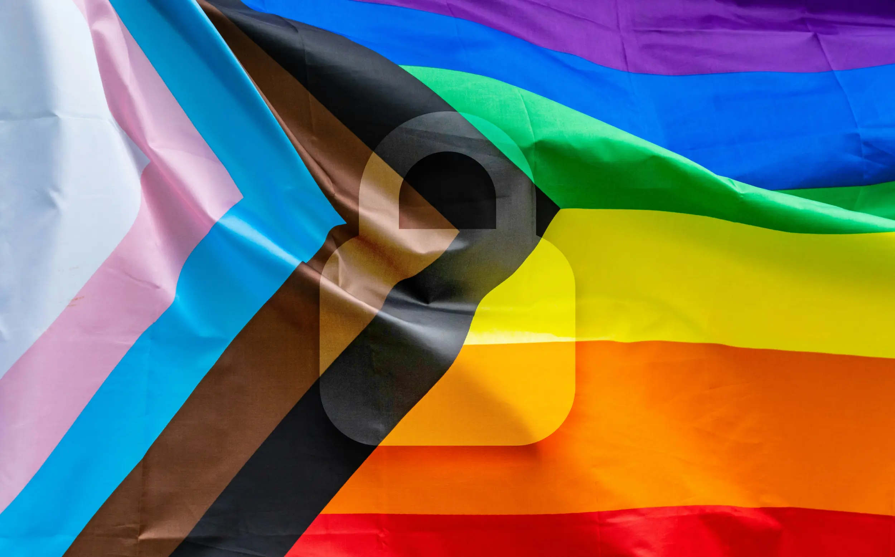

---
date:
    created: 2025-06-03T17:00:00Z
categories:
    - News
tags:
    - Pride Month
authors:
    - em
description: Data privacy is important for everyone. But for some marginalized populations, data privacy is indispensable for social connection, access to information, and physical safety. For Pride month this year, we will discuss topics at the intersection of data privacy and experiences specific to the LGBTQ+ community.
schema_type: AnalysisNewsArticle
preview:
  cover: blog/assets/images/importance-of-privacy-for-the-queer-community/pride-cover.webp
---
# The Importance of Data Privacy For The Queer Community

<small aria-hidden="true">Illustration: Em / Privacy Guides | Photo: Chris Robert / Unsplash</small>

Data privacy is important for everyone. But for some marginalized populations, data privacy is indispensable for social connection, access to information, and physical safety. For [Pride month](../tags.md#tag:pride-month) this year, we will discuss topics at the intersection of data privacy and experiences specific to the LGBTQ+ community.<!-- more -->

While it's difficult to get a complete estimate on this, due to fear of discrimination and other factors, a 2021 [survey](https://www.ipsos.com/sites/default/files/ct/news/documents/2021-06/LGBT%20Pride%202021%20Global%20Survey%20Report_3.pdf) conducted by Ipsos in 27 countries revealed that only 80% of the population surveyed identified as heterosexual. Additionally, about 1% of adults identified as a gender different from the one they were assigned at birth. This percentage is even higher for Gen Z and Millennials.

In the United States alone, it's [estimated](https://www.lgbttech.org/_files/ugd/d77b01_0e1e02c938e94ae3aad4ce21312bdde4.pdf) there are 20 million adults who are part of the LGBTQ+ community. That's a lot of people!

Despite the progress of the past decades, the queer population still faces many challenges to being free and safe from discrimination.

Discrimination online, at work, at school, at the national or even the familial level, can put LGBTQ+ individuals in dangerous situations, where data privacy may be the only shield available for protection.

In this context, it's essential for the queer community to be well-informed on the tools and practices that can help mitigate the risks, so that information, services, and support can still be accessed safely.

## Higher risk when data gets exposed

Unfortunately, LGBTQ+ people are still at a higher risk when their personal data gets exposed.

First, for people living in environments hostile to their sexual orientation or gender identity, keeping personal information private can literally mean life or death. Tragically, even today many countries still criminalize homosexuality and gender identities different from cisgender. When this personal information gets exposed, people might lose support from their family, lose their job, get arrested, or even be [executed](https://en.wikipedia.org/wiki/Capital_punishment_for_homosexuality) in some countries.

People in these very vulnerable situations have to be *extremely* careful about protecting their data in order to stay safe, online and offline.

Moreover, organizations collecting data that could put anyone at risk of getting accidentally or maliciously outed should feel a *strong responsibility* to protect this data fiercely, and be held legally accountable when they fail.

### Being outed against one's will

For a queer person, deciding when, how, and to whom to reveal their sexuality or gender identity is a very important and intimate moment. It *must* be a personal choice, and only on the person's own terms.

Even in countries where queer identities and sexualities are legal and accepted, [being outed against one's will can have devastating consequences](https://www.pridecorner.org/post/how-to-support-someone-who-has-been-outed-against-their-will).

If someone lives with family members who do not accept who they are, getting outed against their will could mean losing their home and familial support. In other situations, perhaps their family is supportive, but their employer isn't, or maybe some of their friends or co-workers are hostile. They might want to keep this information from them in order to avoid conflicts at work, or avoid losing friendships. Further, there is of course the risk for discrimination, online harassment, and worse.

No matter the situation, coming out as queer should always be an individual and intentional choice.

It is an act of violence to out someone against their consent, even when performed by the intermediary of an algorithm or a neglectful data leak.

Each time there is a data breach that includes information about gender identity, sexuality, browsing history, location history, installed applications, or legal names, this data leak risks outing people against their will.

For all these reasons, it is vital that information be safeguarded so that a queer person is empowered to choose when, how, and to whom to come out on their own terms.

In today's political climate, this is unfortunately even truer for trans people, who are at a greater risk of getting outed against their will when data about their gender, sex, or legal name leaks. Sadly, there are still too many online forms and software that needlessly collect gender data when it's completely unnecessary. Similarly, requiring full *legal* name is completely irrelevant in many situations where it is currently asked.

Developers must take responsibility and design software and forms considering these risks. As data scientist and civic technologist Soren Spicknall explains brilliantly, gender data [should never be collected](https://medium.com/@SorenSpicknall/protecting-queer-communities-through-data-4707ae0cb562) unless *absolutely* necessary and *absolutely* protected, which in most instances it really isn't:

> "Is the danger to your LGBT+ users worth the ability to roughly guess whether somebody is buying a purse for themselves or as a gift, or to assume you know what kind of movie they want to watch?"

Algorithms shouldn't be able to target sexuality and gender identity as markers for advertising purposes. Unfortunately, there have already been reported incidents where [people were outed against their will by Facebook](https://www.dailydot.com/irl/facebook-ads-lgbtq/) spitting around rainbow ads everywhere, because of Facebook secretly tying someone's browsing activity back to their profile.

Facebook (and most other commercial platforms) uses cookies and other tracking technologies to follow users online and [build an advertising profile](https://www.makeuseof.com/tag/facebook-tracking-stop/) based on their online activity, even outside of Facebook. Then, it shows ads on Facebook related to that activity, no matter if this information was shared or not on the platform.

This kind of non-consensual outing can have devastating consequences, and should be forbidden by law. Everyone should be able to come out when and how they see fit, and not be aggressively outed by some Facebook or Google ad algorithm, or by some negligent data leak.

### Online harassment and extortion

The risk of having data about one's sexuality or gender identity revealed against one's will can be very dangerous for some people.

With online harassment on the rise, this intimate information can be weaponized by bigots and extortionists to cause severe harm. Unfortunately, this isn't a rare occurrence, even in countries where the LGBTQ+ community is well accepted. Regrettably, some platforms have even started to [roll back previous protections against hate speech](https://apnews.com/article/social-media-lgbtq-tiktok-x-facebook-instagram-glaad-f790bda1bc3f169ef28ca3f441ea8447) and harassment. This will have a severely detrimental impact on the safety of the queer community online.

This year, the LGBTQ advocacy organization GLAAD produced a [Social Media Safety Index](https://glaad.org/smsi/2025/platform-scorecard/) rating six major platforms: TikTok, Facebook, Instagram, YouTube, Threads, and X. X (formerly Twitter) received the worst safety score of them all.

### Seeking health information

People questioning their gender identity or sexuality might seek information online about the health procedures or treatments they need.

This sensitive search history can reveal a lot of personal details that should never be exposed against one's will. Sadly, browsing the internet without any tracking is a task that becomes harder every year, and many people aren't aware of the protections they can use against this tracking.

People can suffer from severe harm when sensitive data related to their gender-affirming care or sexual health is exposed, ranging from non-consensual outing to imprisonment. Discrimination related to this type of health information is still rampant in every country in the world.

### Seeking community online

Seeking the support of online communities is common for queer people who can more easily feel isolated. This is especially true for youth living in hostile or rural environments, where smaller population density often means less supportive local resources and venues.

For people in these situations, finding community online can be essential to survival.

Despite all its flaws, the internet still offers a wonderful way to connect with others regardless of physical distances, and this is doubly true for the queer community.

The need for social connection and support from peers is a fundamental human need. No matter how dangerous this can be, not sharing information online is simply not a viable option for many queer people.

## Privacy-invasive practices that are exponentially worse for queer people

### Real-name policies

Many privacy-invasive practices and policies are significantly more dangerous for LGBTQ+ people. For example, [the "real-name" policies](https://en.wikipedia.org/wiki/Real-name_system) on Facebook and other platforms are absolutely horrendous for transgender people.

If a trans person uses an older account, or has not changed their name on official documentation, a real-name policy could either out them against their will, force them to keep their [deadname](https://en.wikipedia.org/wiki/Deadnaming) online, or even lock them out of their account if official ID is requested for account recovery and doesn't match the name they used for the account.

For many people around the world, the use of pseudonyms or chosen names online means safety, and this is even truer for trans people and other queer people.

### Single-account policies

Thankfully, most platforms aren't using such policies yet. But unfortunately, it does seem there could be a push to implement single-account policies in the near future.

With the multiplication of age verification laws and the proliferation of unregulated AI systems, there has been some talk of using unique identifiers to prevent the creation of multiple accounts. This is **a horrible idea for everyone**, and should never be allowed, but it's even worse for LGBTQ+ people.

Creating multiple accounts for different purposes, for example to separate work life from personal life, is a great privacy practice for anyone.

Multiple accounts on a same platform, or "alt accounts", are regularly used by queer people in order to be their full selves online, when they aren't fully out in their public or personal life, or just because they prefer to keep their queer identity and activities separated.

Sadly, if single-account policies begin to be implemented on platforms, this great privacy protection could soon disappear.

### Facial recognition

Facial recognition is an especially problematic technology for transgender people. Many times, these algorithms will not only create a faceprint from the data, but will also try to infer gender from it.

These systems are deeply flawed and have discrimination biases built-in. They can't even reliably identify the correct gender of cisgender people. Because of the way these algorithms were developed, the use of this technology is [worse for transgender people](https://www.theswaddle.com/how-facial-recognition-ai-reinforces-discrimination-against-trans-people), and [exponentially worse](https://sciencepolicy.hsites.harvard.edu/blog/racial-discrimination-face-recognition-technology) for transgender people of color.

Tragically, privacy legislation is lagging behind at protecting us by regulating this biased, invasive, and inaccurate technology that is spreading faster and further every year.

### Public photos during events

These days, it's pretty much impossible to attend many events without having our photo intrusively taken by a stranger and posted on Instagram without our consent.

This is a generally bad behavior that we should all work on improving culturally. Posting photos of strangers online without their consent can be much more harmful for queer people.

For example, taking photos at a Pride event and posting it online can out people against their will. While it's perhaps fair to assume most people *performing* in a Pride parade or on a stage might implicitly be comfortable with it, this isn't necessarily the case for people in the *audience*.

This non-consensual practice, coupled with the corporate social media tendency to use facial recognition to tag everyone's faces, can cause harm in all sorts of ways.

We should all [develop more respectful practices](the-privacy-of-others.md) when taking photos at events, and be mindful not to post anything online which could identify anyone in the audience who did not give their explicit consent.

### Background checks and algorithmic biases

Even for people who are publicly out and live in regions that are supportive, discrimination and biases are still there. Despite new legislations and a more progressive culture, data remnants of previous oppressive times can still have a severe negative impact on someone's life. Too few efforts are made by institutions to correct records properly after legislation has passed.

This is especially problematic with opaque systems where embedded discrimination might not be obvious. Algorithmic decision-making is a growing danger for this, considering there is often no way to trace back the reasons a decision was made, and no accountability for whomever fed biased data to the black-box algorithm, whether negligently or maliciously.

There are also older systems of decision-making, such as background checks. Last year, a 78-year-old woman from West Sussex [learned](https://www.bbc.co.uk/news/articles/c3v5pwnpnvko) that she had a criminal record for 56 years for being a lesbian in the military (at a time when it was illegal). Completely unaware of this outdated data trail, this woman spent her whole life with this discriminatory tag attached to her records. This likely cost her countless opportunities throughout the decades, without her ever knowing the cause.

Unfortunately, this kind of incident is likely to multiply by millions with the increased use of algorithmic decision-making using closed systems, often impossible to audit.

### Dating apps data

Last but not least, data collected by dating apps is an especially sensitive issue for the queer population.

Regrettably, there have already been numerous data breaches showing this risk is very real. Intimate photos have been leaked, location data has been leaked, health data has been leaked, and even private messages have been [leaked](https://www.pride.com/think-your-privacy-is-safe-on-the-gay-dating-apps-this-data-leak-could-change-your-mind).

The harm caused by these leaks and breaches have consequences ranging from accidental outing, to loss of employment, extortion by criminals, imprisonment, and even *death*.

In countries where homosexuality is criminalized, cruel state authorities and homophobic bigots are [weaponizing dating apps to entrap](https://www.article19.org/resources/apps-traps-dating-apps-must-protect-communities-middle-east-north-africa/) LGBTQ+ people to attack or arrest them. Weighing the need for support, love, and affection, with the very real risk of physical aggression is a dreadful challenge many queer people face.

## Things to keep in mind to stay safe

Despite the increased risks the queer community is exposed to, staying offline and disconnected from the world isn't a viable option.

Indeed, disconnection and isolation can be a *worse* risk for many LGBTQ+ people, especially younger people. Tragically, queer youth are more than four times as likely to attempt suicide. Disconnecting from the internet communities that accept them isn't an option, and would pose dangers of its own.

Thankfully, there are many tools and practices that can be adopted to improve privacy online, and reduce the risk of sensitive data getting exposed. Here are a few ideas that might help yourself or your loved ones to stay safer online:

### Using better social media

Social media usage leaves *a lot* of digital footprints online, and some platforms are worse than others for this. Staying mindful about which platform to choose, and how to use it, can greatly improve one's experience and security.

Favoring alternative social media platforms that do not have a commercial incentive to monetize data can really help.

For example, platforms that are developed and managed by a community of volunteers, rather than a for-profit corporation, tend to keep their users' benefits and safety in mind much more.

If you are ready to make a change, [Mastodon](https://joinmastodon.org/) is a non-profit platform that [we recommend](https://www.privacyguides.org/en/social-networks/#mastodon).

Mastodon is a social media platform that somewhat resembles Twitter prior to its rebranding. It is composed of multiple servers you can choose from, which makes it easier to move your account if you aren't satisfied with the moderation on one particular server.

To get started, you can choose the server administrated by the team who develops the Mastodon software ([mastodon.social](https://mastodon.social/about)), or you can choose a smaller server run by volunteers (you can also self-host, but that's a longer story).

Don't let this choice intimidate you too much though, these servers connect with each other, and you can always move later on. Just pick one you like. Some servers will have a focus on a region, a topic, a hobby, and there are even servers focused on LGBTQ+ communities, such as [tech.lgbt](https://tech.lgbt/about), [lgbtqia.space](https://lgbtqia.space/about), and [more](https://joinmastodon.org/servers).

All the servers listed on the Mastodon website have [committed](https://joinmastodon.org/covenant) to hold active moderation against racism, sexism, homophobia, and transphobia.

Additionally, Mastodon connects with other social media platforms that are also part of the larger [Fediverse](https://fediverse.info/) network.

If you prefer something similar to Instagram, you can replace it with [Pixelfed](https://pixelfed.org/). For something similar to Facebook, look for [Friendica](https://friendi.ca/). For something more like TikTok, try [Loops](https://loops.video/). For a replacement to YouTube, check videos on [PeerTube](https://joinpeertube.org/), and [more](https://fediverse.info/explore/projects)!

These alternative platforms often benefit from stronger moderation and better respect for their users' data. Because they aren't for-profit corporations, they have no interest in collecting your data, tracking you, or imposing invasive "real-name" policies. Additionally, they run **no ads**!

#### Secure any social media you use

No matter what social media platform(s) you choose to use, the first step should always be to make sure you go through all the settings to secure your account ([enable multifactor authentication](https://www.privacyguides.org/en/basics/multi-factor-authentication/)!), and adjust the available privacy options to your needs and preferences (consider [locking](https://www.privacyguides.org/en/social-networks/#public-profile) your account if you wish to restrict visibility to your followers).

This is true for Mastodon as well, but you should make adjusting all the privacy and security options an *absolute priority* for *any* corporate social media, especially [if you stay on Facebook](https://www.digitaltrends.com/social-media/how-to-opt-out-of-targeted-ads-on-facebook/).

Additionally, keep in mind that many platforms, including X, Facebook, and Reddit, will now use all your posted content to train their AI systems, making this information and embedded biases likely impossible to delete in the future.

Developing an awareness of what data is shared, who can access it, how it is secured, and how it is used is very important for staying safe online.

### Securing data when communicating

Outside of social media platforms, many tools are available to help you secure your intimate and private communications.

While chatting on dating apps may be the first step to meeting new people, moving early to end-to-end encrypted channels is likely a good idea for data security and privacy.

That being said, also take into account that because your communications there will be fully end-to-end encrypted (only visible by its intended sender and recipient), there will be no moderation with it. Make sure you trust a person enough before moving the discussion to an end-to-end encrypted, more personal channel.

#### Instant messaging communication

[Signal](https://www.privacyguides.org/en/real-time-communication/#signal) is a wonderful end-to-end encrypted and free-to-use instant messaging app. Signal will collect your phone number to create the account, but nothing else.

When using Signal, you should [enable the username feature](https://support.signal.org/hc/en-us/articles/6712070553754-Phone-Number-Privacy-and-Usernames). That way, you can (and should) share your *username* only, instead of sharing your phone number to connect with others.

Additionally, you should [enable the disappearing messages](https://support.signal.org/hc/en-us/articles/360007320771-Set-and-manage-disappearing-messages) feature from Signal, to help clean up the data you no longer need as time goes, and reduce the risk of leaks.

Only send sensitive information to people you genuinely trust!

Keep in mind that even when using end-to-end encrypted apps and a disappearing message features, this will not prevent a malicious person from downloading this data on their device or taking a screenshot of it.

Be especially careful when sending very sensitive information, such as intimate photos for example. No matter how secure the application is, you should only send sensitive information and pictures to people you know and sincerely trust.

#### Email communication

For email communication, migrating to an end-to-end encrypted alternative can make a big difference for your privacy.

For example, services like Gmail (Google) and Hotmail (Microsoft) could access the content of all your communications, and often use this information in various ways to build advertising profiles. Because email content isn't end-to-end encrypted, this data could get requested by authorities as well, and handed to them in plain text (unencrypted).

For secure and more private end-to-end encrypted email services, we recommend [Proton Mail](https://www.privacyguides.org/en/email/#proton-mail) or [Tuta](https://www.privacyguides.org/en/email/#tuta). These services will not make you anonymous when you email someone (email address, IP address, and subject line, could still identify you), but the content of your communication will be encrypted end-to-end (if used with a compatible service), and only visible to its intended recipient(s).

Encrypted email service limitations

Stay aware that if you email someone who is not using the same end-to-end encrypted email service as you, and you aren't using any additional measures to encrypt the message, this email will likely be accessible to the service you sent it to.

For example, if you send an email from a Proton Mail address, to someone using a Gmail address, without asking the recipient to use your encryption key or use any additional services, then the email you sent will be stored on Google's servers, and could get accessed by Google.

If you send a Proton Mail email to another Proton Mail user, the *content* of the message will be fully end-to-end encrypted and Proton could not access it.

The same is true for any other email providers. Make sure to verify compatibility fully before sending any sensitive information that way.

### Securing data when traveling

When traveling, keep in mind that different countries or regions might have different laws related to LGBTQ+ people.

Your marriage might not be recognized in the location you are visiting. Your new legal name might also not get the same recognition, sadly. The first step to take when planning a trip should always be to gather information on the legal and cultural differences between your own region and the one you are visiting.

If you are visiting a country hostile to your sexuality or gender identity, make sure to take the proper precautions to secure your data *before* you cross the border.

This could mean leaving your phone at home and only bringing a burner phone with you. It could also mean bringing additional (or different) types of official ID that are less likely to get you in trouble, and more likely to get accepted by the authorities of your visiting country.

Be extremely careful when connecting to Wi-Fi services from a foreign country. If you were to connect to a service or website that is illegal there, and could accidentally out yourself as queer, you could get in trouble with few recourses. Using a [trustworthy VPN](https://www.privacyguides.org/en/vpn/) can help mitigate some of this risk.

### Securing data when protesting

For this month of Pride, you might feel the need to join a protest more than a parade.

If you decide to join the action, make sure to secure your data properly to stay safe. Prepare your devices adequately to be ready and resist surveillance targeted at protesters. Consult our [Protesters' Guide to Smartphone Security](activists-guide-securing-your-smartphone.md), and make sure you understand well the level of risk of this particular protest. **Different protests in different regions require different levels of data protection.**

If you are organizing actions, try to stay away from corporate platforms who will willingly and quickly share your data with authorities (even private messages). If you must use corporate platforms, then make sure to limit the personal data you share there, and ensure attendees have alternative ways to contact you that do not require them to create an account, to register, or to use their legal name.

Having an independent website, or using a Fediverse-connected platform that will be accessible to everyone even without an account, are better ways to organize.

For example, if you create a Mastodon account for your organization, people will not need to create a Mastodon account to read your posts and event announcements. All your posts will be accessible just like any independent website would be (if you leave your posts' visibility public).

Setting up an end-to-end encrypted email address and using an [alias email address](https://www.privacyguides.org/en/email-aliasing/) are also good ways to stay accessible without requiring attendees to use a Facebook account.

Additionally, there are federated platforms, such as [Mobilizon](https://mobilizon.org/), that can be a great non-commercial way to organize in a safer and more accessible space.

Data shared on federated platforms isn't necessarily end-to-end encrypted, and could also get shared with authorities if requested. But by using non-commercial platforms, this data will not be compiled and attached to an account the same way this would happen on a for-profit corporate platform such as Facebook. Using alternative not-for-profit platforms isn't perfect nor anonymous, but it's still a great improvement from the corporate default.

### Protections for extreme situations

Finally, if you are living in an extreme situation where being yourself is dangerous to your physical safety, caution must be a priority.

There isn't a single solution that can protect all your data at once, and anyone telling you there is one is lying to sell you something. Remain skeptical of such claims.

However, there are a *multitude* of practices and tools that can help *reduce* your data trails, and improve your privacy greatly. The tools and practices you need to adopt will depend on the [threat model](https://www.privacyguides.org/en/basics/threat-modeling/) specific to your situation.

Take the time to evaluate well which data could put you in danger, and focus on protecting this first.

If you are in a situation where someone hostile to you has access to your device, for example because you are living with an unsupportive family and need to browse the internet on a family device, Tails may be a tool that can help you. If you can use this computer unobserved, by [using the live system Tails](installing-and-using-tails.md) installed on a USB stick, you can keep your browsing activity hidden from this device. Your Internet Service Provider (ISP) could still know you have been visiting a special network, however. Make sure to read our tutorial thoroughly if you decide to use Tails.

If the information stored on your computer isn't a risk to you, but visiting LGBTQ+ websites from your country could be dangerous, perhaps [using Tor](in-praise-of-tor.md) with a Bridge or through a [trustworthy VPN](https://www.privacyguides.org/en/vpn/) could be another solution to allow you to access this information in a safer way.

It's impossible to cover every specific situation, but know that there are [many solutions](https://www.privacyguides.org/en/tools/) to reduce the risks greatly, and improve data protection to allow you to **stay connected, stay yourself, and stay safe** 💛

Caution: This isn't an exhaustive list!

This is only a short introduction to some practices and tools that *can* improve your privacy online. Not one solution will be enough to be anonymous online.

It's important to stay aware of what data will still be shared and which will be better protected, but nothing will make you 100% anonymous.

For more information on how to improve further your data protection online, you can consult our various guides. If you are just starting in your privacy-improving journey, be patient. Adopt one small improvement at the time, then add another one. Each additional step you take will slowly but surely reduce your data trails, and improve your privacy overtime.

## Improving data privacy is vital for everyone, but critical for the queer community

Every situation is different and requires different protections. While data privacy is important for everyone, it's also essential to acknowledge that marginalized populations are often at a heightened risk when their data gets exposed.

Protection *cannot* be only an individual responsibility. **Protecting vulnerable and marginalized populations is a societal responsibility that concerns everyone.**

We *all* have a **duty of care** to protect the data of others. Whether it's from the photos we take at public events, or the discussions we have about others on Facebook or X-Twitter's direct messages, *everyone* must improve their practices on this.

Moreover, anyone in a position to improve how data is collected from users *must* be held accountable, and must feel morally liable on the decisions taken that could endanger anyone, but especially marginalized groups like the queer community.

In an ideal world, laws and cultures would protect everyone and particularly the most vulnerable *by default*.

But until we get there, we have to empowered ourselves to bring change and stop predatory data collection, prevent negligent data security, and educate everyone on the tools we can use to help ourselves and the most vulnerable to stay safe.

## Additional resources

### Helplines

- [Mindline Trans+ (UK)](https://www.mindinsomerset.org.uk/our-services/adult-one-to-one-support/mindline-trans/): A confidential emotional, mental health support helpline for people who identify as Trans, Agender, Gender Fluid or Non-Binary.

- [Trans Lifeline Hotline (US and Canada)](https://translifeline.org/hotline/): Trans peer support over the phone.

- [Suicide & Crisis Helpline (US and Canada)](https://988lifeline.org/): General support 24/7 phone number 988.

- [Suicide & Crisis Helpline (International)](https://en.wikipedia.org/wiki/List_of_suicide_crisis_lines): List of suicide crisis lines around the world.

### Supportive organizations

- [Egale (Canada, International)](https://egale.ca/asylum/): Resources for LGBTQ+ asylum and immigration requests from outside and inside Canada.

- [SOS Homophobie (France)](https://www.sos-homophobie.org/international-content): Non-profit, volunteer-run organization committed to combatting hate-motivated violence and discrimination against LGBTI people.

- [The Trevor Project (US)](https://www.thetrevorproject.org/): Suicide prevention and crisis intervention non-profit organization for LGBTQ+ young people.

- [Trans Rescue (International)](https://transrescue.org/): Organization assisting trans and queer individuals in relocating from dangerous areas to safer places.

- [Twenty10 (Australia)](https://twenty10.org.au/): Sydney-based organization providing a broad range of free support programs to the LGBTIQA+ community.

### International advocacy

- [Amnesty International](https://www.amnesty.org/en/what-we-do/discrimination/lgbti-rights/): Human rights organization running campaigns to protect and uphold the rights of LGBTI people globally.

- [Human Rights Watch](https://www.hrw.org/topic/lgbt-rights): Human rights non-profit who documents and exposes abuses based on sexual orientation and gender identity worldwide, and advocate for better protective laws and policies.

Stay aware of your data trail

If the traces of this article in your browsing history could put you at risk, visit [our guide](clearing-browsing-data.md) to properly delete this data from your device.

