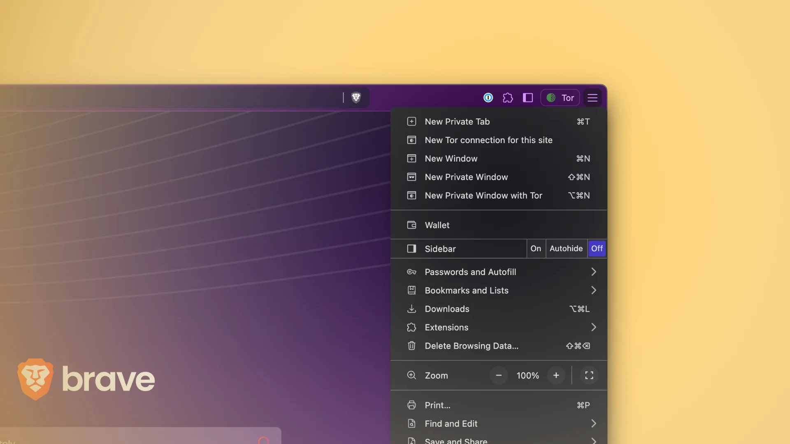

---
date:
    created: 2025-02-29T19:00:00Z
categories:
    - Opinion
authors:
    - jonah
tags:
    - Brave
    - Tor
license: BY-SA
description: Brave integrating Tor into its browser isn't as bad as many believe.
schema_type: OpinionNewsArticle
canonical_url: https://www.triplebit.org/blog/2025/02/26/in-defense-of-braves-private-window-with-tor/
preview:
  logo: theme/assets/img/browsers/brave.svg
---
# In Defense of Brave's Private Window with Tor

<small aria-hidden="true">Illustration: Privacy Guides</small>

An article from XDA Developers about [Brave](https://www.privacyguides.org/en/desktop-browsers/#brave) has been making the rounds in privacy circles lately. The article claims that much of Brave's popularity stems solely from its marketing, and that its features including "fingerprinting protection" are easily replicated in "basically any other browser."<!-- more -->

Brave is not a perfect browser, and there is some merit to some of the author Adam Conway's [claims](https://www.xda-developers.com/brave-most-overrated-browser-dont-recommend/). At the same time, browser fingerprinting is a massively complex topic that is also frequently misunderstood, and to my knowledge only three browsers are actually taking it remotely seriously: Brave, Mullvad Browser, and Tor Browser. Brave takes a different approach than the others, but they are still using relatively novel ideas that I would not assume are easily possible in any other browser with simple user configuration.

It's easy to discount some of Brave's more impressive achievements in this field because they are not easily visible to the user, but this is part of the magic of Brave. They are making advancements in anti-fingerprinting without many of the downsides that come with hardening other browsers, and making that accessible to regular people is a big accomplishment.

I hope to write more about browser fingerprinting in the future, but in the meantime Arkenfox has a [helpful summary on fingerprinting](https://github.com/arkenfox/user.js/wiki/3.3-Overrides-%5BTo-RFP-or-Not%5D) in their wiki that I would encourage reading if this is a topic that interests you.

This isn't *really* an article about Brave though. I actually want to talk about **Tor hidden services**, and the benefits they offer to publishers. This quote from Conway's article regarding Brave implementing Tor in its private browsing windows stood out to me:

> as an aside, you should never use Tor in anything but the official client

This is certainly something many consider to be "common knowledge" when it comes to Tor... but is it actually true?

## What is Tor useful for?

When people talk about the Tor network, it's usually to promote a way of browsing the internet anonymously.

This is certainly a huge use-case, and it's what Tor themselves will talk about the most when you visit their [website](https://www.torproject.org/):

> Browse Privately. Explore Freely. Defend yourself against tracking and surveillance. Circumvent censorship.

However, this is only one side of Tor. While Tor provides great protections to *readers* of internet content, it **also** provides great protections to *publishers* of internet content.

You see, Tor works in two directions: For people using *Tor Browser*, it puts three relays in between your browser and the website you're visiting. On the flip side, for people using *Tor hidden services*, it puts three relays in between their web server and their visitors.

This means that just as a user browsing the web with Tor has their real IP address hidden, a website operating as a Tor hidden service has its real IP address hidden. This provides the website with **strong protections against censorship, surveillance, and attacks**.

## Advantages of hidden services

For publishers of web content, there are many benefits of operating a hidden service that have nothing to do with the protections that Tor Browser provides readers.

Having a hidden IP address not only protects the publisher's privacy, but it protects their server against DDoS and other targeted attacks. If the IP address to attack the server directly isn't discoverable, then hidden services automatically gain a degree of resilience against these threats.

There is also a security benefit to `.onion` domains, namely that they are cryptographically tied to the server its running on. This ensures end-to-end encryption between readers and your web server, without the need for intermediaries like Certificate Authorities with HTTPS.

Finally, there is a cost benefit to running a hidden service. You are not required to own a domain name for example, because `.onion` domains are freely generated. You also don't need to port forward or have a static IP address to host web content from. Tor hidden services can be run from any network without special requirements besides the ability to access the Tor network, meaning you could easily run a website from your own home without exposing your network to potential threats or dealing with Dynamic DNS services to work with your changing residential IP address.

This makes publishing content much more accessible to people, and it's increasingly important to do this in a *decentralized* manner, like via a hidden service. We can't rely on centralized services and social media platforms to host our content for free forever. Taking back some of that control from "free" platforms is crucial for protecting our free access to knowledge in the long-term.

## Should you only use Tor Browser?

Returning to the original claim that you should never use anything besides Tor Browser, the reality is a bit more nuanced. Tor Browser is certainly the *most* private way to browse Tor, but that doesn't mean other implementations are inherently unsafe. What matters is how they are implemented, and what you actually need from them in your specific threat model.

If your personal anonymity is critical, and you need maximum protection, then yes, Tor Browser is the right choice. It was specifically designed to protect you against fingerprinting and prevent leaks.

On the other hand, if you want access to the *full* wealth of information available on the internet including via hidden services on Tor, but you aren't doing something that might put yourself in danger, more casual browsing tools like Brave's *can* make sense for you.

I'll give you a real-world example of why Tor Browser might not be *necessary*. I often encounter websites and guides that are only accessible on Tor for a variety of reasons, usually because the author wants to remain anonymous.

To me *personally*, these guides are fairly mundane, covering things like how to secure your smartphone if you are going to a protest for example. This is a topic I already feel comfortable [posting about publicly](https://www.privacyguides.org/articles/2025/01/23/activists-guide-securing-your-smartphone/), as I frequently do in my work with *Privacy Guides*, and I have no concerns whatsoever if it's discovered that I'm accessing this content.

To the author of those guides on the other hand, this is clearly a topic that they *don't* feel comfortable writing about publicly, so using a hidden service is one of the few ways for them to make that content accessible at all. It's very important that publishers have the option to do this, and it's just as important that readers have the tools to access that content in a very accessible way.

It's this sort of casual browsing that I feel perfectly safe relegating to something like a Brave window with Tor.

In my case this is certainly a place of privilege, and many people in oppressive regimes can't say the same. But there are still many people in a position more similar to my own, and casual browsing tools like Brave make that content more easily accessible to them, *while upholding the anonymity and security of the publisher.*

For **both** privacy-conscious users *and* publishers of content, I believe that understanding the full scope of what Tor offers is crucial.

**Hidden services are a powerful tool that should be embraced far more widely, especially in an era where online censorship and surveillance are growing concerns.**

Brave's approach to making Tor hidden services more accessible to casual browsers is something I *do* like to see, and it's something I would like other browsers and operating systems to consider implementing.

---

*This was originally posted to [triplebit.org](https://www.triplebit.org/blog/2025/02/26/in-defense-of-braves-private-window-with-tor/) on Feb. 26, 2025. It has been republished here with the author's permission.*
