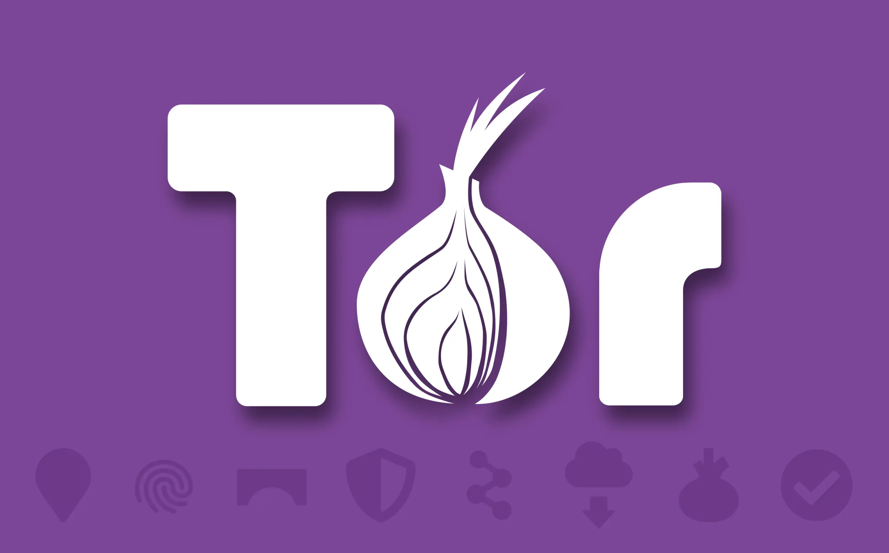
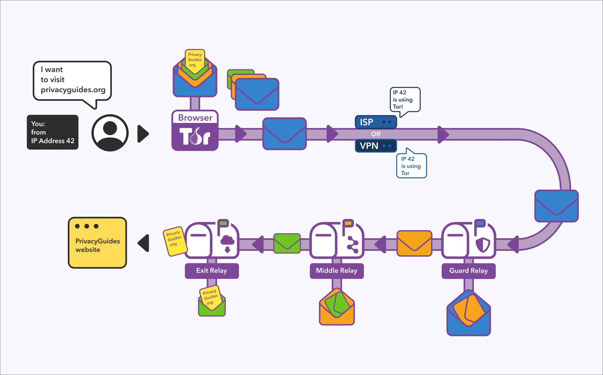
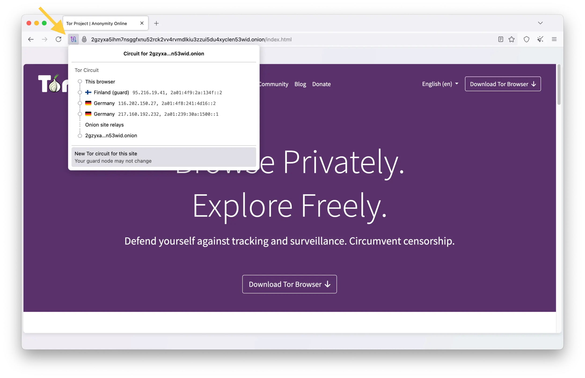
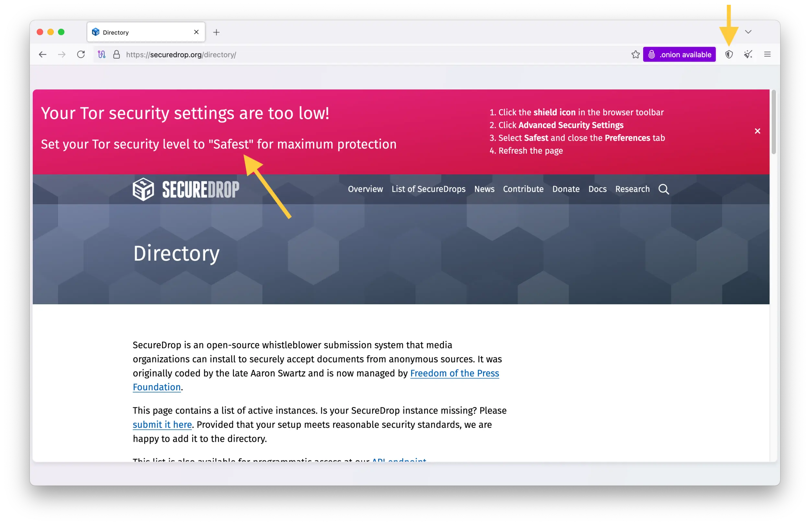
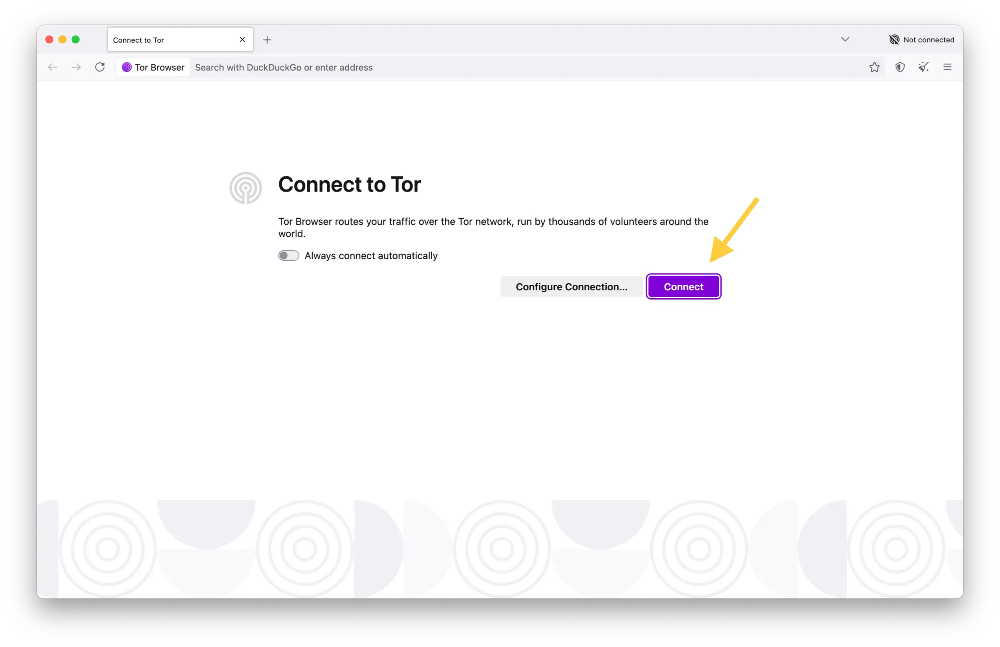
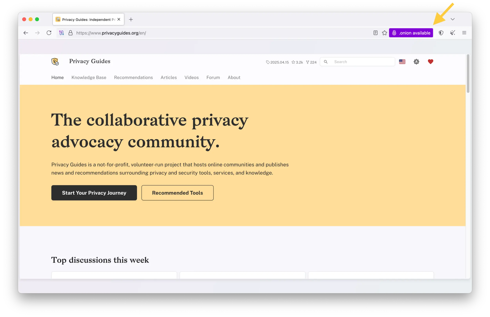
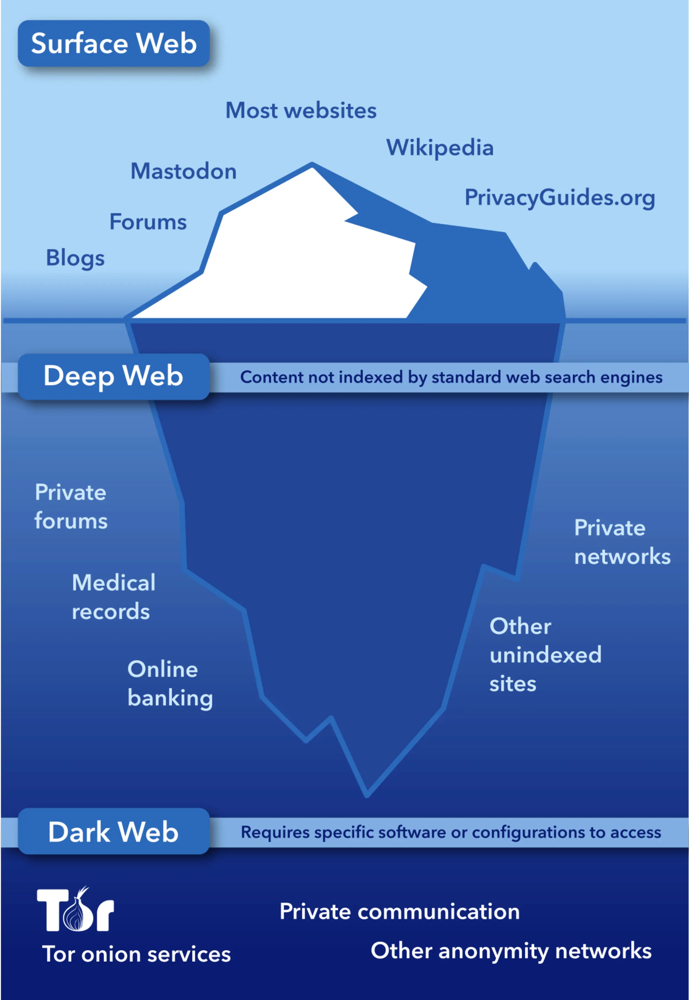

---
date:
    created: 2025-04-30T20:30:00Z
    updated: 2025-05-06T18:00:00Z
categories:
    - Explainers
tags:
    - Tor
authors:
    - em
description: You might have heard of Tor in the news a few times, yet never dared to try it yourself. Despite being around for decades, Tor is still a tool too few people know about. Today, Tor is easy to use for anyone. It not only helps journalists and activists, but anybody who seeks greater privacy online or access to information regardless of location. But what is Tor exactly? How can Tor help you? And why is it such an important tool?
schema_type: OpinionNewsArticle
preview:
  cover: blog/assets/images/in-praise-of-tor/tor-cover.webp
---

# In Praise of Tor: Why You Should Support and Use Tor

<small aria-hidden="true">Illustration: Em / Privacy Guides | Logo and icons: The Tor Project</small>

You might have heard of Tor in the news a few times, yet never dared to try it yourself. Despite being around for decades, Tor is still a tool too few people know about.

Today, Tor is easy to use for anyone. It helps not only journalists and activists, but anybody who seeks greater privacy online or access to information regardless of location. But what is Tor exactly? How can Tor help you? And why is it such an important tool?<!-- more -->

## :simple-torbrowser: What is Tor

Tor is an overlay network that was specifically designed to protect the privacy of its users. The Tor Network uses multiple layers of encryption and relays in order to protect a person's location and other potential identifiers, such as an IP address.

Its name comes from the acronym for **The Onion Router**, a [routing system](https://en.wikipedia.org/wiki/Onion_routing) using multiple layers that can get peeled off at each step, like an onion 🧅

This special network can be easily accessed by anyone, for free, through the Tor Browser. The Tor Browser is as easy to use as any other browser you are familiar with already.

Both the tools for the Tor Network and the Tor Browser are maintained by a nonprofit organization called the Tor Project.

### The Tor Network

The [Tor Network](https://en.wikipedia.org/wiki/Tor_(network)) was deployed in 2002, although its core principle was developed in the mid 1990s. It was first created at the United States Naval Research Laboratory in order to protect intelligence communication online.

In 2004, the laboratory released the project's code under a free and open source license, and the Electronic Frontier Foundation (EFF) began funding its development. A few years later, the onion routing project officially became the Tor Project.

Today, Tor is one of the [largest](https://metrics.torproject.org/) anonymity networks, with thousands of relays and millions of users worldwide.

#### How does it work

The Tor Network is run by a community of volunteers who operate the relays required for the network to function.

Each time someone uses the Tor Network, the communication passes through at least 3 relays: A Guard Relay, a Middle Relay, and an Exit Relay. Each relay has a different function to protect the communication.

**The Guard Relay** knows where the communication is from (IP address), but doesn't know where it's going (which website is visited, for example). This relay only knows that you want to access the Tor Network. Its task is to send your encrypted communication to a Middle Relay, but it cannot read it.

**The Middle Relay** doesn't really know anything. It doesn't know who you are nor where you are going. It only knows a Guard Relay wants to send encrypted data to an Exit Relay. The Middle Relay transfers this communication from one relay to another, and it cannot read it either.

**The Exit Relay** has no idea who you are. It only knows someone, somewhere, wants to access this website (or other content). The Exit Relay will get the information from the website, then send it back to the Middle Relay, so that you can receive it from the Guard Relay. If you only visit pages using HTTPS, the Exit Relay can know someone is visiting this website, but cannot know what they are doing on it. Visiting *non-onion* websites using HTTPS instead of just HTTP is **[very important](https://support.torproject.org/https/https-1/)** for security and privacy.

Onion service websites

Onion service websites are special websites that can only be accessed using the Tor Network.

They are easy to recognize because they use the .onion domain at the end, and are often composed of a long string of seemingly random characters. Onion websites offer protections equivalent to HTTPS.

You can see this represented by the [onion padlock icon](https://support.torproject.org/onionservices/onionservices-5/) in the Tor Browser.

#### How Tor works using a letter and envelopes analogy

Tor works a bit as if you put a letter (request) into an envelope with someone's address. Then, you put this envelope in another envelope addressed to someone else, with instructions. Finally, you put this second envelope in yet another one.

Each envelope protects the content of the other, and can only be opened one at the time by each recipient. In this analogy, each recipient (relay) has a key that can only open the envelope addressed to them, and not the others.

<small aria-hidden="true">Illustration: Em / Privacy Guides</small>

#### What is a Tor Circuit

The network of randomly selected relays to complete a request on the Tor Network is called a Tor Circuit. This circuit changes each time a new connection is established.

From the Tor Browser, you can see each relay that was selected for a circuit, and even change it manually. To generate a new circuit, click on the "Tor Circuit" button on the upper-left of the browser, then on "New Tor circuit for this site" at the bottom.

### The Tor Browser

The [Tor Browser](https://www.torproject.org/download/) was created in 2008 to facilitate access to the Tor Network. It is a modified version of Mozilla's Firefox browser, and can be installed on Linux, macOS, Windows, and Android systems.

The Tor Browser start configuration is private by default. No additional extensions are required to make it more secure or more private. Actually, it's even discouraged to install any additional extensions, as this would weaken its [fingerprinting resistance](https://blog.torproject.org/browser-fingerprinting-introduction-and-challenges-ahead/).

Highest security settings

Even if the Tor Browser is configured to be private by default, if you are in an especially sensitive situation, for example if you are using Tor as a whistleblower or a dissident activist, you might want to adjust the Tor Browser security level to "Safest".

For this, click on the shield icon on the upper-right, then on the "Settings" button in blue, and select "Safest" instead of the default "Standard".

**Important:** Each time you change the security level, you **must** make sure to restart the browser to ensure all changes have taken effect. Otherwise, [some changes](tor-security-slider-flaw.md) might not have been applied yet.

The default search engine is the privacy-focused [DuckDuckGo](https://www.privacyguides.org/en/search-engines/#duckduckgo). You will not even find Google in the options for the default search engine. More browsers should follow this good practice.

The first page opening with the Tor Browser will give the option to Connect to Tor. From there, you can click on "Connect" to start browsing through Tor, or on "Configure Connection" if you need additional settings. For example, if you need to set up a [Bridge](https://bridges.torproject.org/) because Tor is blocked from your country.

Only connect to Tor if it is safe for you

Be careful when using Tor from a country where Tor might be blocked or perceived as suspicious. Similarly, be careful if you connect from a location where revealing you have been using Tor [could](#depending-on-where-you-are-using-tor-is-likely-safe) be dangerous to you.

Once connected to the Tor Network, you will be directed to the DuckDuckGo welcome page, and you can search or type any URLs in the address bar, like you would with any other browser.

If you know an organization has an onion site (a website that is only accessible through Tor), you can type this onion address directly in the address bar.

If you don't know if an organization has an onion site, you might find it from its regular URL. For example, if you visit privacyguides.org from the Tor Browser, you will notice a purple button on the right informing you that an onion version of this website is available, click on it to get redirected to it.

Mullvad Browser and the Tor Project

If you are familiar with the Mullvad Browser, know that the Mullvad Browser was developed by the Tor Project team!

The Mullvad Browser was born of a [collaboration](https://blog.torproject.org/releasing-mullvad-browser/) between Mullvad VPN and the Tor Project, to build a browser that offers similar privacy features to the Tor Browser, but while using it through a VPN instead of through the Tor Network (both offering different benefits).

The Mullvad Browser can also be used without a VPN, and will still provide better privacy protections than most other browsers. It cannot be used to access the Tor Network, however.

### The Tor Project

The [Tor Project](https://www.torproject.org/) is the US-based nonprofit organization maintaining the software and community for the Tor Network, and developing and maintaining the Tor Browser. It's also a privacy advocacy organization, with a mission to advance human rights and freedoms around the world through the free technology it creates.

The nonprofit was founded in 2006 and gets its funding from [various sources](https://www.torproject.org/about/supporters/) including government grants, independent contributors, and individual [donations](https://donate.torproject.org/).

## :octicons-lock-16: What Tor can do

### Improve Privacy

Tor is not magical, but it's by far one of the best privacy tool we have. Using Tor will not make you perfectly anonymous online, but it will greatly reduce the traces your leave online.

Here are a few benefits Tor can provide for your privacy:

- Tor can prevent the websites you are visiting from collecting your IP address (and your IP address can indeed lead to identifying *you*).

- Tor can prevent your Internet Service Provider (ISP), Virtual Private Network (VPN) provider, or authorities requesting information from them to collect a list of the websites you have visited. They will know however that you have been using Tor.

- The Tor Browser isolates each website you visit. This prevents ads and trackers from following you around, potentially popping up later in your [Facebook ads and accidentally outing you](https://www.intomore.com/culture/you/facebook-ads-outed-me/).

- The Tor Browser is fingerprinting resistant. This reduces the ways you can be tracked and identified online, even without your IP address.

- When keeping the default settings, the Tor Browser only uses private windows and will not keep any traces of your browsing history. It will also delete all cookies and site data when closing.

### Circumvent censorship

Because of how the Tor Network redirects traffic, it's a perfect tool to resist censorship. Using Tor can give access to websites or services that aren't accessible from a country blocking them.

Even from a region where Tor itself is actively blocked, the network can still be accessed using [pluggable transports](https://tb-manual.torproject.org/circumvention/).

Using this type of measures to circumvent government censorship will make Tor accessible even from countries with heavily censored internet, such as [China](https://support.torproject.org/censorship/connecting-from-china/), [Russia](https://blog.torproject.org/call-for-webtunnel-bridges/), [Iran](https://forum.torproject.org/t/iran-circumventing-censorship-with-tor/4590), and many others.

If you can't download the Tor Browser from your country

If you cannot download the Tor Browser because of your country's censorship, and **if it is safe for you to do**, you can try downloading the browser from a proxy website such as the [EFF website](https://tor.eff.org/), the [Calyx Institute website](https://tor.calyxinstitute.org/).

You can even directly email **<gettor@torproject.org>** and send the name of your operating system (Linux, macOS, Windows) to get a direct link to download the Tor Browser.

If you want to help people around the world access the internet freely, you can volunteer to run a [Tor Snowflake](https://snowflake.torproject.org/) proxy. For more tech-savvy volunteers, you can also help by running a [Tor Bridge](https://community.torproject.org/relay/setup/bridge/), or even a [WebTunnel Bridge](https://community.torproject.org/relay/setup/webtunnel/).

## :octicons-heart-16: Why Tor is so important

### Tor is vital for human rights and democracy

Tor is an essential tool for journalists, activists, whistleblowers, dissidents, and people in vulnerable situations everywhere. It is one of the best tool we have to increase privacy online, and to resist censorship from oppressive regimes.

Thanks to Tor, activists have a safe way to continue fighting for human rights.

Some of the most respected human rights organizations use Tor to offer safe access to their services and information. This includes organizations such as [Amnesty International](https://www.amnesty.org/en/latest/news/2023/12/global-amnesty-international-website-launches-on-tor-network-to-help-universal-access/), [Electronic Frontier Foundation](https://www.eff.org/deeplinks/2023/04/eff-now-has-tor-onions), Freedom of The Press Foundation, and of course the Tor Project.

Without Tor, journalists would lose invaluable sources of information provided by courageous whistleblowers reporting in the public interest.

Without Tor, brave citizens fighting against authoritarian governments would be at much greater risk when organizing and bringing vital information to the public's attention.

Without Tor, victims of domestic violence and LGBTQ+ people living in hostile environments could be in much greater danger when researching life-saving information online.

Without Tor, people living in oppressive regimes would not have access to the crucial information they need to fight for freedom, democracy, and peace.

Add an onion service for your organization's website

If you would like to add this service for your website to help more people access it safely, you can [read more](https://blog.torproject.org/more-onions-porfavor/) about onion services on the Tor Project Blog. As of 2021, you can even [get](https://blog.torproject.org/tls-certificate-for-onion-site/) domain-validated certificates for your onion site using HARICA, an operator founded by a nonprofit civil society from Greece.

### Tor is for everyone to use

Tor is a tool that can help so many people. But Tor isn't *only* for people in highly sensitive situations like whistleblowers and journalists, Tor is for everyone!

Of course, people in more dangerous situations will *need* Tor to stay safe, but everyone can benefit from Tor's privacy protections in their daily lives. I personally use Tor when I am forced to visit Google Map. Not because it's dangerous to me, but just because I greatly dislike the idea of Google tracking my location activities.

Tor can also help fighting surveillance capitalism!

Moreover, you can considerably help people in dangerous situations by using Tor for trivial reasons like I do.

By using Tor for banal activities, when you aren't in any danger worse than a nasty ad-attack, you help to normalize the use of Tor and add more noise to the traffic. The more people do this, the more using Tor becomes just something people do when they care about privacy online, and nothing more.

### Who uses Tor?

- Anyone who cares about privacy!
- Journalists who need to conduct research and protect their sources.
- Whistleblowers using special websites to communication information to newspapers anonymously.
- Democracy activists fighting against authoritarian governments who require anonymity online to stay safe from persecution.
- People living under oppressive regimes who need to circumvent their country's censorship to access information freely.
- Victims of domestic violence who need to research safe shelters and supportive resources without raising suspicion from their aggressor.
- LGBTQ+ people living in hostile environments who need to access information online and stay connected with their community.
- Generous people who want to [help and support](https://blog.torproject.org/support-tor-project-share-your-story/) all the above 💜

The Tor community has gathered this [wonderful collection of anonymous user stories](https://community.torproject.org/outreach/stories/) from people describing why they use Tor.

### Tor is critical public infrastructure

To keep Tor strong for everyone, it's essential to support and grow the network of volunteer-operated relays forming the Tor Network.

Thousands of journalists and activists rely on the Tor Network every day to stay safe and to continue their important work.

Furthermore, **countless privacy-oriented projects depend on the Tor Network**.

To name only a few, the messaging applications [Briar](https://briarproject.org/), [Cwtch](https://docs.cwtch.im/), and [SimpleX](https://simplex.chat/) all use Tor to harden some of their privacy-preserving features.

For whistleblowers to stay safe, both [SecureDrop](https://securedrop.org/) and [Hush Line](https://hushline.app/) use the Tor Network. Many [newsrooms around the world](https://securedrop.org/directory/) host onion services to protect sources, such as The Guardian in the UK, CBC in Canada, ProPublica in the US, and many more.

There's also all the applications protecting people with the highest needs such as [Tails](https://tails.net/), [OnionShare](https://onionshare.org/), and [more](https://github.com/Polycarbohydrate/awesome-tor).

**Losing the Tor Network would mean losing all the applications and features relying on it.**

This would be disastrous for the privacy community, journalists, activists, dissidents, victims of domestic violence, LGBTQ+ population, and so many worldwide.

From a human rights perspective, **we simply cannot afford to lose Tor**.

## :octicons-question-16: Things to consider when using Tor

### Tor compared to VPN protections

When using a VPN, your ISP will not know which websites you visit online (or other activities). Your ISP will see that you are connecting to a VPN, but will not know what you do from there. Your VPN however *could* know which websites you visit. Using a VPN is a transfer of trust from your ISP. When using a VPN, you should always trust your VPN provider more than your ISP.

The websites you visit will see the IP address of your VPN provider instead of yours. This can help protect your identity and location, but they will know this connection uses a VPN.

VPNs can offer great benefits for your privacy. However, if your VPN provider was compelled by law to provide the logs of the websites you visited (or will visit), it is *technically* possible to do for them.

When using the Tor Network correctly, no one knows which websites *you visited*, or other services you accessed. Your ISP or VPN provider will only know you have accessed Tor, but will not know which websites you have visited from there. Even if compelled by law, they could only share that you have accessed Tor, at this specific time.

The websites you have visited also won't know who you are (unless you tell them). They will only know someone accessed their websites through Tor, at this specific time.

The relays used for a Tor Circuit cannot alone re-recreate the link between your IP address and the websites you visit either. This offers much stronger protection for your privacy than a VPN does.

### Who knows you are using Tor

When using the Tor Network, your ISP and the Guard Relay will both know you (the IP address you are using) are using Tor.

To prevent this, you [could](https://www.privacyguides.org/en/advanced/tor-overview/#safely-connecting-to-tor) use Tor from a [trustworthy VPN](https://www.privacyguides.org/en/vpn/).

If you do so, your VPN provider will know you are using Tor, but your ISP will not. Your ISP will only see you are accessing your VPN, and the Tor Guard Relay will see your VPN's IP address instead of yours.

### HTTPS for non-onion websites

The Exit Relay from the Tor Circuit will see someone is accessing this website (or other service).

If you were to use Tor to visit a non-onion website that isn't protected with HTTPS, and log in with your credentials, this Exit Relay *could* technically read this information. Using HTTPS with non-onion websites is *very* important when using Tor. Onion sites offer protections that are equivalent to HTTPS.

### Be careful with files when using Tor

While it's safe to visit secured websites through Tor, be careful when downloading files or opening documents.

Depending on what kind of files it is, there are a number of problems that could arise. For example, it's a [bad idea](https://blog.torproject.org/blog/bittorrent-over-tor-isnt-good-idea) to download torrent files over Tor. Additionally, Tor will not protect you from downloading malware or exposing metadata with shared files.

If you need to share files through Tor with a *trusted* contact, [OnionShare](https://www.privacyguides.org/en/file-sharing/#onionshare) is a good option.

## :octicons-stop-16: Addressing misconceptions

There has been misconceptions floating around about Tor. Most of them repeat similar misinformation attributed to many other privacy tools: Why using this if you have nothing to hide? But this argument is incredibly flawed and comes from a naive understanding of privacy rights and needs.

Most people use privacy tools for protection, and everyone needs protection. Moreover, [privacy is a fundamental right](https://www.privacyguides.org/videos/2025/04/17/is-privacy-dead/) intrinsically connected to democracy and civil liberties.

### The dark web, the deep web, and the surface web

Some misconceptions have spread from confusion on what the *deep* web and the *dark* web are. Because yes, Tor is part of the dark web.

While using the term "dark web" might make for great sensationalist news title, the dark web isn't anything to fear.

It's not "dark" as in "dark intent" or the "dark side of the Force". It's really just dark as in "it's so dark on this road, I can't read the addresses around".

This dark web needs special software, configuration, or authorization to access it. For example, **the Tor Browser is the streetlight you need to navigate on the Onion roads**.

If you use Tor to visit the Privacy Guides onion site, you will be using the dark web. It's a website (or website version) that can only be accessed using a specialized tool. That's it!

The dark web is part of the deep web, which is simply all the online information that isn't indexed by any standard web search engines. Aren't you happy your bank account is on the deep web?

<small aria-hidden="true">Illustration: Em / Privacy Guides | Inspired by: [Ranjithsiji](https://commons.wikimedia.org/wiki/File:Iceberg_of_Webs.svg)</small>

### Criminals use envelopes, doors, and clothing too

Some fear that Tor is used by criminals. While that might be true some criminals use Tor, a lot of people who aren't criminals at all also use Tor.

This kind of argument really leads nowhere. Criminals also use Google, Facebook, and Twitter (a lot actually). Criminals use envelopes to hide their ransom letters, closed doors to hide their crimes, and clothing to conceal weapons! Are we going to forbid clothing because some (all?) criminals use clothing to hide their weapons?

**We shouldn't ban clothing, and we shouldn't ban Tor either.** There are other better ways to catch criminals than removing a tool millions use to stay safe online.

### Tor receives government funding

Yes, Tor does receive government funding, and that's a good thing. A lot of nonprofit organizations receive government funding as a stable ([usually](https://www.privacyguides.org/articles/2025/02/03/the-future-of-privacy/#the-tools-you-use-might-depend-on-government-funding)) source of income. Our governments *should* be contributing financially to the tools we all use to improve our security and privacy for free, moreover if they are using it themselves.

While any organization should thrive to diversify its sources of income to reduce its dependency on large contributors, it's not always easy to do.

If you feel uneasy about a privacy tool you use receiving government funding, the best thing you can do to fight this is to [donate](https://donate.torproject.org/) directly to reduce its dependence to it.

### Depending on where you are, using Tor is likely safe

If you are not living under an oppressive regime with heavy censorship, it's likely that using Tor is safe for you, and will not put you on "a list". Even if it was putting you on "a list", it likely is a list full of great people working to defend human rights and privacy rights online.

That being said, **if you are living in a region where using Tor is dangerous**, and could put you on a list of anti-regime dissidents, you *should absolutely* be careful and take special measures to hide your usage of Tor.

Additionally, **if you are in a vulnerable situation** where an aggressor has access to your device or ISP information, and could hurt you if they knew you have used Tor, you should use a Tor Bridge and only [access Tor through Tails](https://www.privacyguides.org/articles/2025/01/29/installing-and-using-tails/).

### Tor is fantastic for your privacy, but is not magical

Tor is a great tool to improve your privacy online and make it much harder to identify you, your location, and the content you access online. However, it will not make you magically anonymous.

If you use Tor with files containing metadata about you, this metadata can still identify you.

If you use Tor to log in your Facebook account, then of course Facebook still knows it's you, and now also knows you are using Tor.

If you use Tor to create a new account, but use an email address, phone number, username, or profile picture you used elsewhere when not connected through Tor, then your Tor activity can get linked to your previous activity.

If you use Tor to reveal information so specific that only you, or only someone at your company, or only someone in this small government department could know, then of course authorities can identify you this way.

You should also consider correlation in time when using Tor. If your activity is so specific that it can be narrowed down to only a few people, and your ISP or VPN knows you have accessed Tor at this specific time (and shares this information with authorities), a correlation in time could be enough to de-anonymize you.

### Misconceptions are very detrimental to Tor, and other privacy tools

We need to be extremely careful when spreading information that could be inaccurate or hasn't been verified when talking about Tor (or any other privacy tools).

Misinformation can create mistaken fears and stop people from using a tool they would greatly benefit from.

If someone is so scared of Tor because of some rumor they heard, that they continue their activism from the surface web instead, they could needlessly put themselves at risk.

Furthermore, unjustified bad reputations can severely hurt funding for tools like Tor. This leads to less resources to continue developing the browser, the network, and to advocate for privacy everywhere.

We all have a responsibility to verify which information we share with others, make sure we stop misinformation at its root, and correct harmful misconceptions everywhere we hear them.

## :material-hand-heart-outline: Tor needs our support

**Tor is at risk, and needs our help.** Despite its strength and history, Tor isn't safe from the same attacks oppressive regimes and misinformed legislators direct at encryption and many other privacy-enhancing technologies.

Moreover, due to its US government funding, Tor has already been on the destruction path of the recent hectic government cuts. Thankfully, the US Agency for Global Media finally [rescinded the grant termination](https://www.theregister.com/2025/03/25/otf_tor_lets_encrypt_funding_lawsuit/?td=rt-3a) it had announced on March 15th to the Open Technology Fund, which the Tor Project benefits from. Sadly, considering the unpredictability of the current US administration, this doesn't mean the Tor Project is safe from cuts later on.

As much as the Tor Network relies on generous volunteers to run it, the nonprofit Tor Project relies on grants and donations to survive.

The good news is, we can help with both!

The more individuals donate to the Tor Project, the less it depends on government funding, and the more stable its donation income becomes.

Similarly, the more people volunteer to run a Tor relay, the more stable and reliable the Tor Network becomes.

Tor is a privacy tool so many people, organizations, and applications need to stay safe and secure. It is **our collective responsibility to contribute what we can** to keep Tor strong and thriving for all of us.

### How to support Tor

There are many ways to help Tor survive and thrive! You can help by:

- [Donating to the Tor Project (includes really neat merch!)](https://donate.torproject.org/)

- [Spreading the word about Tor](https://community.torproject.org/outreach/)

- [Joining the Tor community](https://community.torproject.org/)

- [Making your website accessible as an onion service](https://community.torproject.org/onion-services/setup/)

- [Asking your university to run a Tor relay](https://toruniversity.eff.org/)

- [Running a Tor relay yourself](https://community.torproject.org/relay/)

- [Running a Snowflake proxy to help fight censorship](https://community.torproject.org/relay/setup/snowflake/)

- Using Tor for anything from important to trivial

- Sharing this article 💜

## :octicons-bookmark-16: Onion sites you can visit using the Tor Browser

- [Privacy Guides website](http://www.xoe4vn5uwdztif6goazfbmogh6wh5jc4up35bqdflu6bkdc5cas5vjqd.onion/en/) 💛
- [Privacy Guides forum](http://discuss.6xotdxvg7pexnean3xu6b7ivs7g52zcwsdbnz4mdm4byivc3yfv65aid.onion/)
- [Amnesty International](https://www.amnestyl337aduwuvpf57irfl54ggtnuera45ygcxzuftwxjvvmpuzqd.onion)
- [Electronic Frontier Foundation](https://www.iykpqm7jiradoeezzkhj7c4b33g4hbgfwelht2evxxeicbpjy44c7ead.onion/)
- [Freedom of the Press Foundation](http://fpfjxcrmw437h6z2xl3w4czl55kvkmxpapg37bbopsafdu7q454byxid.onion/)
- [Secure Drop directory (for whistleblowers)](http://sdolvtfhatvsysc6l34d65ymdwxcujausv7k5jk4cy5ttzhjoi6fzvyd.onion/directory/)
- [ProPublica](http://p53lf57qovyuvwsc6xnrppyply3vtqm7l6pcobkmyqsiofyeznfu5uqd.onion/)
- [Internet Archive](https://archivep75mbjunhxc6x4j5mwjmomyxb573v42baldlqu56ruil2oiad.onion/)
- [OnionShare (file sharing)](http://lldan5gahapx5k7iafb3s4ikijc4ni7gx5iywdflkba5y2ezyg6sjgyd.onion/)
- [Proton Mail](https://protonmailrmez3lotccipshtkleegetolb73fuirgj7r4o4vfu7ozyd.onion/)
- [Tor Project](http://2gzyxa5ihm7nsggfxnu52rck2vv4rvmdlkiu3zzui5du4xyclen53wid.onion)

***

For more in-depth information about Tor, you can consult our [Tor Overview](https://www.privacyguides.org/en/advanced/tor-overview/).

<small aria-hidden="true">Unless credited otherwise, all screenshots from: Privacy Guides</small>

---

**Update (5/6):** This article was updated to note [the importance of restarting Tor Browser](tor-security-slider-flaw.md) when changing security level settings.
