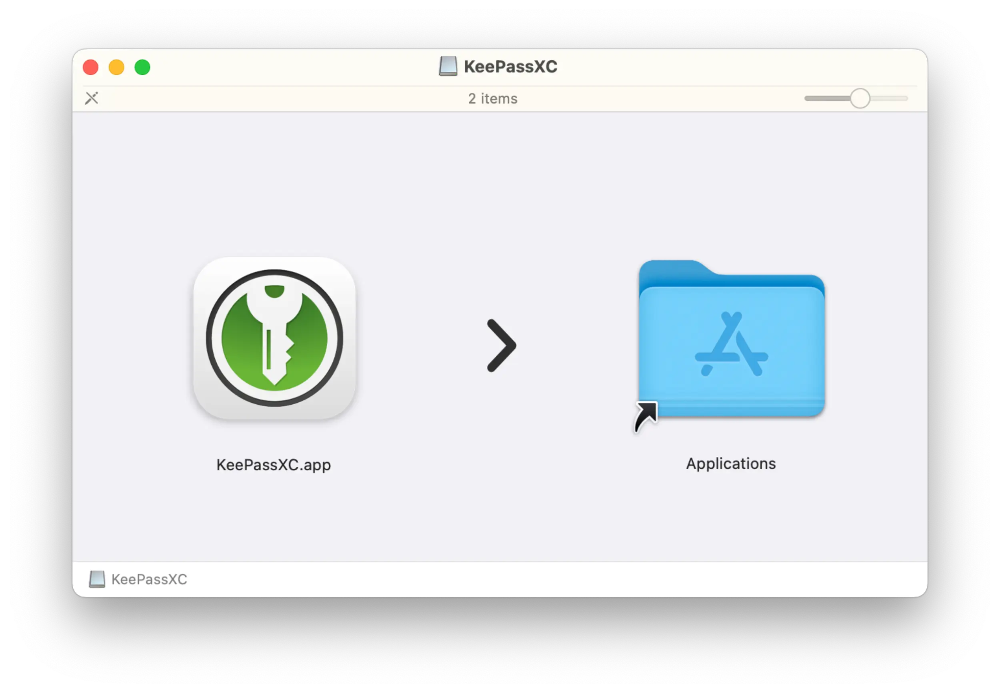
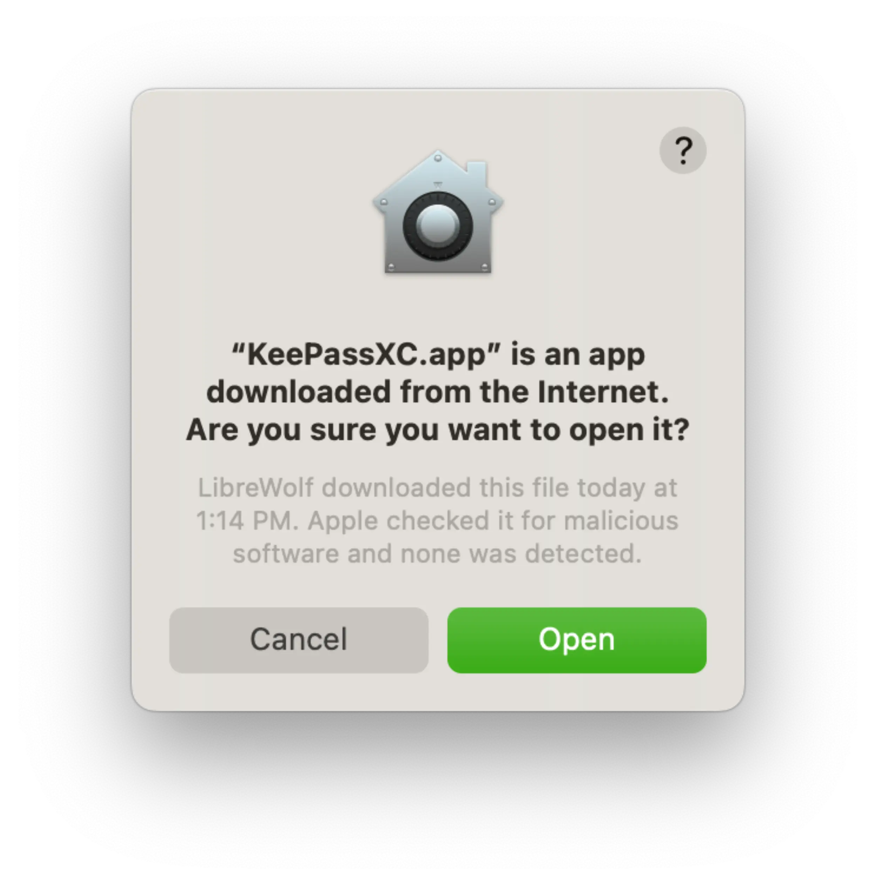

---
date:
    created: 2025-03-18T17:00:00Z
categories:
    - Tutorials
authors:
    - em
description: This tutorial demonstrates how to install the local-only password manager KeePassXC and secure a password database with YubiKey.
schema_type: AnalysisNewsArticle
---
# KeePassXC + YubiKey: How to set up a local-only password manager

<small aria-hidden="true">Illustration: Privacy Guides | Graphics: Yubico | Logo: KeePassXC</small>

If you are looking for a good remote password manager you can use from anywhere, there are plenty of excellent [options](https://www.privacyguides.org/en/passwords/) to choose from. However, if you prefer to only store your passwords locally, [KeePassXC](https://www.privacyguides.org/en/passwords/#keepassxc) is what you need. In this tutorial, we will set up KeePassXC to work with [YubiKey](https://www.privacyguides.org/en/security-keys/#yubikey) as an additional factor to secure your local-only password database.<!-- more -->

## :simple-keepassxc: KeePassXC summary

KeePassXC is a free, open-source, and desktop-only password manager. The community-driven project was first released in 2012 and is a fork of both the *KeePass Password Safe* application and *KeePassX*, which is no longer actively maintained.

In addition to having its [code](https://github.com/keepassxreboot/keepassxc) available for all to see, KeePassXC also went through an independent [security review](https://keepassxc.org/blog/2023-04-15-audit-report/) in 2023.

Because it does not automatically sync with any remote cloud service, KeePassXC works offline by default. This offers additional protections for your privacy, and potentially for your security as well, depending on your specific situation.

### Platforms

KeePassXC can run on Linux, macOS, and Windows computers. There is no direct option for a KeePassXC application on mobile. The KeePassXC team [suggests](https://keepassxc.org/docs/#faq-platform-mobile) using [KeePassDX](https://www.keepassdx.com/) or [KeePass2Android](https://play.google.com/store/apps/details?id=keepass2android.keepass2android) on Android phones, and [Strongbox](https://strongboxsafe.com/) or [KeePassium](https://keepassium.com/) on iPhones.

### Database cloud backup

KeePassXC is local-first and will not automatically back up your password database in the cloud. This can be both an advantage for security and privacy, and a disadvantage if something were to happen to your device.

To prevent losing access to your passwords, it is recommended to regularly back up your encrypted database `.kdbx` file in a remote [cloud storage](https://www.privacyguides.org/en/cloud/) of your choice, or on an encrypted external drive or USB stick.

When copying this file to a third-party cloud service, it will [remain fully encrypted](https://keepassxc.org/docs/KeePassXC_UserGuide#_storing_your_database) and only get decrypted locally on your device. That being said, it's still always best to select an end-to-end encrypted cloud storage whenever possible.

### Feature overview

This tutorial only covers the basic installation to get you ready using KeePassXC locally, with a main password secured with a YubiKey. However, KeePassXC offers a lot of features you might also want to have a look at.

In addition to the features we will set up here, KeePassXC offers the following:

- [Passkey support](https://keepassxc.org/docs/KeePassXC_UserGuide#_passkeys)

- [Password generator](https://keepassxc.org/docs/KeePassXC_UserGuide#_password_generator)

- [Command line tool](https://keepassxc.org/docs/KeePassXC_UserGuide#_command_line_tool)

- [SSH agent integration](https://keepassxc.org/docs/KeePassXC_UserGuide#_ssh_agent_integration)

- [KeeShare and groups](https://keepassxc.org/docs/KeePassXC_UserGuide#_database_sharing_with_keeshare)

- [Import password databases from 1Password, Bitwarden, Proton Pass, KeePass, CSV files](https://keepassxc.org/docs/KeePassXC_UserGuide#_importing_databases)

- [Export databases to CSV, HTML, or XML files](https://keepassxc.org/docs/KeePassXC_UserGuide#_exporting_databases)

- [And more](https://keepassxc.org/docs/KeePassXC_GettingStarted#_features)

### What's new with KeePassXC 2.7.10

On March 4th, KeePassXC released its most recent update. This update includes the capacity to import Proton Pass databases, to generate passphrases using *mixed* case (a mix of uppercase and lowercase), and many other [useful features](https://keepassxc.org/blog/2025-03-04-2.7.10-released/).

## :material-toolbox: Requirements and preparation

Operating systems

This tutorial was completed using macOS, but your experience shouldn't be much different if you are using Linux or Windows.

For this tutorial you will need:

- [x] Computer running Linux, macOS, or Windows
- [x] Internet connection
- [x] Ability to install software on this computer
- [x] One or two YubiKeys (ideally two)

## :material-download-circle: Setting up KeePassXC

### Step 1: Download and Install KeePassXC

Go to KeePassXC's download page and download the application version for your operating system. If the website doesn't detect your system automatically, you can change it on the top menu, or click on the "See more options" yellow button for previous versions.

Verifying signatures

For ideal security, you can verify the authenticity and integrity of the file you just downloaded by verifying the file's signatures. To do this, [follow the instructions](https://keepassxc.org/verifying-signatures/) from the website to guarantee the file you downloaded was created by the KeePassXC Team and has not been tampered with.

Complete the process for your respective OS to install and open the application once verified.

On macOS, you will be prompted with a warning message saying "**“KeePassXC.app” is an app downloaded from the Internet. Are you sure you want to open it?**", click "Open".

KeePassXC blocks screenshots by default

Interestingly, KeePassXC has a security feature that [blocks](https://keepassxc.org/docs/KeePassXC_UserGuide#_screenshot_security) screenshots and recordings of the application window on macOS and Windows.

This is a great feature to prevent accidentally sharing your decrypted password database information during a meeting presentation, for example.

Thankfully for writing this tutorial, there is a way to disable it temporarily, but **you** should definitely keep it on.

### Step 2: Adjust the settings

Once you have installed and opened KeePassXC, before creating a database for your passwords, click on the "Settings" gear button on the upper-right, on the *toolbar*.

From there, you will see many options you can adjust to your preferences. The default settings are already good, but you might want to tweak a few things to your specific usage.

#### Keep a previous version backup (recommended)

Scrolling down to the "File Management" section, you might want to enable the option to "Backup database file before saving". This will ensure you always have a backup of the previous version of your database, in case you accidentally delete important information for example.

You can store this backup in the same or a different directory. You can change this backup's name or keep the default that will append `.old` to your database filename.

#### Add icons specific to each service (optional)

If you want to use icons specific to each service for your password entries, you can go to the "Security" subsection on the left-side menu, then in "Privacy" at the bottom *enable* "Use DuckDuckGo service to download website icons". This isn't enabled by default. Then click "OK" on the lower-right.

Offline only?

Do not enable this if you wish to use KeePassXC offline only. You will still be able to use different default icons for you entries instead of downloading specific icons from the internet.

### Step 3: Create a database

A database in KeePassXC is an encrypted file that will contain all the passwords you register.

You can use multiple separate databases with KeePassXC. For example, you could have a database for work, a database for your family, and a database for your personal accounts. All stored in separate files with separate main passwords. In the application, each database can be opened in its own tab.

To create a new database, from the Welcome section click on the "Create Database" button on the lower-left.

If you want to create a secondary database, you can also click on the dropdown Database menu on the application menu bar, then select "New Database".

Importing an existing database

If you already have a password database file in the format `.kdbx`, you can import it from the Welcome page by clicking on "Import File" on the lower-right.

You will see a window pop up with "General Database Information". Pick a name and description for your database and click on "Continue" at the bottom.

For the second step, an "Encryption Settings" section will pop up. From there, you will be able to change the settings to your preferences. If you are not familiar with encryption algorithms, simply keep the defaults on and click "Continue" again.

For the next step, a "Database Credentials" section will pop up. From there, you will be able to choose a main password to lock your entire password database.

At this step, it is very important to [choose a password](https://www.privacyguides.org/en/basics/passwords-overview/#best-practices) that is **unique, complex, and long**. This is the password that will protect all your other passwords. It should be easy to remember for you, but it must be *unique* and *long*. Ideally, pick a **passphrase**.

#### Generate a main password (optional)

If you do not feel inspired, you can use the "Generate password" dice button on the right to help you pick a strong password.

No matter if you invent or generate your main password/passphrase, **make sure to remember this main password well**. You cannot rely on your password manager for this one.

This step isn't over yet!

This is where you will be adding your YubiKey to further secure your database. Keep the "Database Credentials" application window open and **continue with the step below** :material-arrow-down-bold:

## :material-shield-key: Securing your database with a YubiKey

To add a YubiKey to secure your KeePassXC database, you will first need to prepare your YubiKey(s) for it, if it's not already ready to use with a [Challenge-Response](https://docs.yubico.com/yesdk/users-manual/application-otp/challenge-response.html) application.

Using a YubiKey will not add authentication per se (read more)

Technically speaking, adding a YubiKey to your KeePassXC database isn't a second factor of authentication because KeePassXC isn't a service, therefore it cannot "authenticate" you.

However, adding a YubiKey to secure your KeePassXC database will make decryption of your database more secure by enhancing the encryption key of your database.

The Challenge-Response will remain the same each time you decrypt your database, *however*, it will change each time the database is updated (each time there is a change to it, such as adding an entry, removing an entry, adding a note, etc.). Note that the previous versions of your database could get unlocked with your main password + your key's previous Challenge-Response, however.

If your key's Challenge-Response were to become compromised, you could update your database (by adding or changing an entry for example), then fully delete all previous versions of your database. This would effectively make all previous Challenge-Response obsolete to unlock your current database.

You can read more on this in KeePassXC's [documentation](https://keepassxc.org/docs/).

### Step 4: Prepare your YubiKey(s)

Because you cannot register two YubiKeys for this type of application, you should first make sure that you either have a secure backup for this Challenge-Response, or that you have cloned it to two YubiKeys, or more. This is important in case you were to lose your YubiKey.

If you do have two YubiKeys, we have a [guide on how to reset your YubiKeys entirely and set up multiple keys as a backup](yubikey-reset-and-backup.md) which you may be interested in.

If you only need to learn more about the Challenge-Response YubiKey application, jump to [this section](yubikey-reset-and-backup.md#step-9-create-and-clone-your-keys-challenge-response) of the tutorial directly.

### Step 5: Add your YubiKey

Once your YubiKey's Challenge-Response slot has been properly configured and backed up, return to the KeePassXC's "Database Credentials" window, and click on the "Add additional protection" button in the middle.

This will open a new section with "Key File" and "Challenge-Response" options. Scroll down to "Challenge-Response". Plug in your YubiKey in your computer's port (only plug one key at the time), then click on the "Add Challenge-Response" button.

YubiKey or OnlyKey

You can also use an OnlyKey to secure your KeePassXC database in the same way.

You should see your YubiKey's model and serial number listed, and also which YubiKey slot you have stored your Challenge-Response in. Once the correct key is selected, click on "Done" at the bottom.

A window will pop up to ask where you want to save your password database. Name your database file and save it in a secure directory on your computer. You will then be asked to touch your YubiKey.

Touch the gold part of your YubiKey to save your database file. You will have to touch your YubiKey each time you save this database, and the file will be saved each time you make changes to it.

Important! Unlocking your database

Each time you unlock your KeePassXC database, make sure to first plug in your YubiKey and verify that the "Use hardware key" checkbox is checked. Then, enter your main password and touch the gold part of your YubiKey when prompted.

If you do not plug in your YubiKey first, an error will be triggered, and you will be unable to unlock your database.

## :fontawesome-solid-unlock-keyhole: Using KeePassXC

Using KeePassXC is quite simple and resembles most other password manager applications. The biggest difference is that your passwords will remain stored locally, unless you decide to back up your password database to a cloud service of your choice.

All the options to manage and use your entries credentials will be located on the *toolbar* at the top.

Locking the database

At all time when the application is open, you can click in the "Lock Database" padlock button on the toolbar to lock your database. You can also adjust the settings to lock your database each time you minimize the application window (this is disabled by default).

Your database will already lock itself automatically when your laptop lid is closed, the session is locked, or if your switch user (unless you disabled these options manually in settings).

### Step 6: Create a password entry

To create a [new entry](https://keepassxc.org/docs/KeePassXC_GettingStarted#_entry_handling) for a password, click on the "Add a new entry" plus-shaped button on the toolbar.

From this section, you will be able to register a "Title", "Username", "Password" (or generate one), "URL" (this is important if you use the browser extension), "Tags", "Expires" date, "Notes", and more.

Keep your YubiKey plugged in when changing your database

When adding/removing entries or changing your database in any other way, make sure your YubiKey is plugged in. You will have to touch it each time you save changes to your database.

Before saving your entry by clicking "OK" on the lower-right, explore the options on the left-side menu.

For example, in the "Advanced" section you can add additional attributes and store attachments, in the "Icon" section you can select an icon to represent your password entry (or download one from the web), in the "Auto-type" section you can enable/disable Auto-type, and in the "Properties" section you will see additional metadata for this entry.

Once you have set up all the information you need for this password entry, click "OK" to save it to your database. You will be prompted to touch the gold part of your YubiKey to complete the operation. You should now see your entry listed in your database.

Each time you need this information, you can select an entry and click on the "Copy username to clipboard" character-shaped button, or the "Copy password to clipboard" key-shaped button, or the "Copy URL to clipboard" earth-shaped button on the toolbar.

The data will stay in your computer's clipboard for 10 seconds then will get cleared (unless you changed this from the default setting). Once copied, paste this information in the appropriate field for your service.

Accidental deletion danger!

Be careful not to mistakenly click on the dangerous "Delete Entry" trash-shaped button left to the "Copy username to clipboard" button on the toolbar!

You would have to touch your YubiKey to confirm deletion, but remain careful. If you click on it accidentally, do NOT touch your YubiKey to confirm!

If this accident happened to you, you might see your entry has been moved to a "Recycle Bin" directory on the left. Right-click on your entry and select "Restore Entry" at the top of the entry menu. Touch your YubiKey when prompted. You should now see your entry back in the "Root" directory on the left-side menu.

### Step 7: Back up your database

There are many ways to [back up](https://keepassxc.org/docs/KeePassXC_UserGuide#_database_backup_options) your KeePassXC database:

#### Automatic local backup

If you enabled this setting on [Step 2](#step-2-adjust-the-settings), you will see a second file getting saved in the same directory with the same name but with an appended `.old` to it when you make a change to your password database.

This is the previous version of your database. If you delete a password entry by mistake for example, you can easily restore it with this secondary database backup file.

#### Manual backup from the application menu

When your database is unlocked, you can click on the dropdown "Database" menu in the application menu bar (not the toolbar), then select "Save Database Backup".

You will have the option to rename this file and choose a different location. Then, you will be prompted to touch your YubiKey to confirm.

#### Manual backup from copying the database file

Another way to keep a backup of your password database is to simply copy the database `.kdbx` file somewhere else.

You can copy this file to another local directory, an external drive (ideally encrypted), or a secure [cloud service](https://www.privacyguides.org/en/cloud/) of your choice (ideally an end-to-end encrypted one). Even if your database will be encrypted, it's always better to choose secure cloud services that offer solid end-to-end encryption.

Entry history

Within your database, KeePassXC also maintains a history of changes made to each of your entries. You can read more about this feature from KeePassXC's [documentation](https://keepassxc.org/docs/KeePassXC_UserGuide#_history).

### Step 8: Install the browser extension (optional)

When you need to use KeePassXC to fill credentials in a browser or an app, you can always copy the entry field you need manually, as explained on [Step 6](#step-6-create-a-password-entry). But if you prefer, to facilitate filling credentials for web-based services, you can take advantage of KeePassXC's [browser extension](https://keepassxc.org/docs/KeePassXC_UserGuide#_browser_integration).

To install the extension, go to [this page](https://keepassxc.org/download/#browser) from the KeePassXC website and click on your browser's *category*.

This means that for any Firefox-based browser, you can click on the Firefox logo, and for any Chromium-based browser, you can click on the Chrome logo. Some browsers might not be supported, however.

Privacy warning

Keep in mind that although browser extensions can be very convenient, they can also introduce some risk to your privacy.

Even if the KeePassXC browser extension only [runs locally](https://keepassxc.org/privacy/), it does need to collect some information for its functionalities, and any additional extension installed has the potential to [introduce](https://www.privacyguides.org/en/browser-extensions/) a new attack surface.

Additionally, the more unique your combination of hardware, software, and browser extensions is, the more you are vulnerable to [browser fingerprinting](https://neat.tube/w/fdszTYBKzeoE3ySQUGTzmo). Always be mindful to consider your specific threat model when installing new browser extensions.

Once you have installed the extension for your browser, go back to the KeePassXC application and click on the "Settings" gear button on toolbar. Click on "Browser Integration" on the left-side menu and check the box for "Enable browser integration" at the top of the section.

From this [section](https://keepassxc.org/docs/KeePassXC_UserGuide#_configure_keepassxc_browser), check the box for the browser(s) or browser type(s) you have installed the extension on. You can also enable the option "Search in all opened databases for matching credentials" if you are using multiple databases. Then click "OK" on the lower-right to save these options.

Make sure your KeePassXC database is *unlocked*, then **restart your browser**.

#### If you encounter an error while running the extension

You don't have to use the extension

If you are not able to make the KeePassXC extension work with the browser you use, you can still use KeePassXC by manually copy-pasting your entries' credentials. It can even be a more secure and more private way to use it.

After installing the extension and enabling it from the KeePassXC settings, you might encounter an error where the KeePassXC icon in a credential field is [marked](https://keepassxc.org/docs/KeePassXC_GettingStarted#_using_the_browser_extension) with a red "**X**", a red "**!**", or a padlock icon.

If this happens, try the following:

1. Make sure your KeePassXC application is open, and your database is *unlocked*.

2. Check if your YubiKey is *plugged* in your computer's port.

3. Verify that your browser is *compatible* and does not use protections that could block the extension from working.

4. Follow KeePassXC's [instructions](https://keepassxc.org/docs/KeePassXC_UserGuide#_using_the_browser_extension) to connect your KeePassXC database to your KeePassXC browser extension.

5. Look for possible solutions from KeePassXC's [troubleshooting guide](https://github.com/keepassxreboot/keepassxc-browser/wiki/Troubleshooting-guide).

#### Filling credentials using the extension

The database is connected but the logo is greyed out

If you do not have an entry for this website, or if you have not registered a URL (or the correct one) for this entry, your will see the KeePassXC logo greyed out. This simply means your database could not find any credentials matching this website's URL.

Once configured and connected properly, you should see a green KeePassXC logo in the credential fields, when you have a corresponding entry in your database.

Click on the green KeePassXC logo to populate all credential fields automatically.

Congratulation! You're in!

You are now logged in, thanks to KeePassXC!

## :material-hand-heart: Consider supporting KeePassXC

KeePassXC is a free and open-source project built by the community. If you use and love this application, it's always a great idea to support the project if you can.

Here are a few ways you can help keep KeePassXC thriving:

- [Contributing on GitHub](https://github.com/keepassxreboot/keepassxc/blob/develop/.github/CONTRIBUTING.md)
- [Following KeePassXC on Mastodon](https://fosstodon.org/@keepassxc)
- [Donating to KeePassXC to help with the development and maintenance of the application](https://keepassxc.org/donate/)

For more information on KeePassXC and its many features, you can consult the official [Documentation and FAQ](https://keepassxc.org/docs/) or even have a look at KeePassXC's [code](https://github.com/keepassxreboot/keepassxc) on GitHub.

<small aria-hidden="true">Unless credited otherwise, all screenshots from: Privacy Guides</small>
