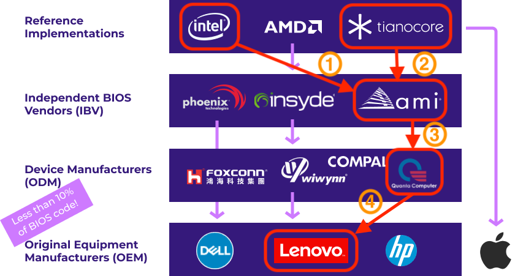

---
date:
    created: 2025-09-27T17:00:00Z
categories:
    - Opinion
authors:
    - fria
tags:
    - Security
    - iOS
    - Android
preview:
---

# iOS vs Android Security: What They Can Learn From Each Other

Both Android and iOS run on the vast majority of our mobile devices, meaning they are entrusted with our most sensitive data. While they trade blows, there are areas where the two differ in security features and philosophy.<!-- more -->

## Source Model

One of the most glaring differences is the source model of each operating system: iOS is *mostly* closed source while Android is *mostly* open source, I'll get to what I mean by that in a bit.

### iOS

iOS is a closed-source operating system, but it's based on the open-source [XNU kernel](https://github.com/apple-oss-distributions/xnu). The kernel handles almost everything on the operating system, so it's good that such a vital component is openly available to examine and do what you want with.

It's important to note that being open-source doesn't [inherently make software secure](https://seirdy.one/posts/2022/02/02/floss-security), but it can be helpful for anyone wanting to audit the code.

I'd like to see Apple release its entire operating system as open source in order to foster a spirit of openness and allow for [reproducible builds](https://reproducible-builds.org), allowing third parties to verify that the downloaded binaries match the released source code. As of now, that's impossible thanks to iOS's closed nature. A fully open-source iOS would also be the first step in third-party operating system support on the platform.

### Android

The beating heart of Android is the [Android Open Source Project](https://source.android.com) (AOSP). AOSP is essentially a complete open-source mobile operating system on its own. Android was designed from the beginning to be used by lots of different companies for their own mobile phone offerings, so the open nature is useful toward that goal.

However, AOSP is only a bare-bones operating system. OEMs are expected to add their own proprietary components to make their own, custom user experience. This is why most Android phones you buy are full of proprietary software like Facebook and other OEM software; companies that sell Android phones mainly use AOSP as a secure base to then run on their phones with proprietary drivers and their own custom Android. While the openness of AOSP is great, the OEMs making the phones ultimately ruin it.

Because AOSP is open source though, non-OEM third parties such as [GrapheneOS](https://grapheneos.org) have made their own fully open-source Android operating systems. GrapheneOS supports [reproducible builds](https://grapheneos.org/build#reproducible-builds).

Many custom AOSP operating systems, while being open source, actually reduce security from AOSP through delayed updates and not supporting important Android security features like [Verified Boot](https://source.android.com/docs/security/features/verifiedboot) (this problem applies to many open source Android operating systems, but not GrapheneOS as they explicitly aim to never downgrade security from AOSP).

A problem inherent to being downstream of AOSP, third-party operating systems also must wait for Google to [ship patches and updates](https://x.com/grapheneos/status/1964561043906048183) for them to apply. Ultimately they are up to the whims of the upstream project which is not ideal.

## Hardware

Hardware is vital to security. Modern smartphones are complicated, with lots of different processors and components, all running their own firmware and with their own potential security vulnerabilities. It's important to lock down these components as much as possible.

### iOS

Apple makes their own SoC on their platforms, which affords them a lot of control over how it works. You can read about how they integrate their hardware tightly on their [Apple Platform Security](https://support.apple.com/guide/security/hardware-security-overview-secf020d1074/web) page.

Apple has started to replace other components as well, with their newest phones boasting their N1 wireless chip that handles Wi-Fi, Bluetooth, and Thread connectivity as well as their in-house cellular modem. Apple has a lot of control over the components in their phones which avoids supply-chain issues that other OEMs run into, with each third-party component relying on a third party to [patch security vulnerabilities](https://binarly.io/blog/the-firmware-supply-chain-security-is-broken-can-we-fix-it) and fix bugs in their firmware.

<small aria-hidden="true">Photo: [Binarly](https://binarly.io/blog/the-firmware-supply-chain-security-is-broken-can-we-fix-it)</small>

Apple can deal with vulnerabilities themselves when they're reported instead of waiting for a third party to fix it. According to their [docs](https://support.apple.com/guide/security/peripheral-processor-security-seca500d4f2b/1/web/1):

>Whenever possible, Apple works to reduce the number of peripheral processors necessary and to avoid designs that require firmware. But when separate processors with their own firmware are required, efforts are taken to help ensure an attacker can’t persist on that processor.

They take care to reduce attack surface by disabling debug interfaces and signing the firmware with keys stored in Apple's own hardware security modules.

Apple also supports all the important hardware security features you'd want, like a [Secure Element](https://support.apple.com/guide/security/secure-enclave-sec59b0b31ff/1/web/1) for secure cryptography and secret storage, secure [biometric hardware](https://support.apple.com/guide/security/biometric-security-sec067eb0c9e/1/web/1) including 3D face scans for Face ID, hardware-backed [indicator lights](https://theapplewiki.com/wiki/Secure_Indicator_Light) for camera and microphone, [hardware kill switches](https://support.apple.com/guide/security/hardware-microphone-disconnect-secbbd20b00b/1/web/1) for the microphone on iPads, and [MTE](https://security.apple.com/blog/memory-integrity-enforcement) for their latest iPhones.

Processors that deal with networking are isolated via an [IOMMU](https://support.apple.com/guide/security/security-features-connecting-wireless-sec8a67fa93d/1/web/1#sec7e0184776) so that they can't access each other's memory.

Overall, Apple does an excellent job with hardware security, most Android OEMs could stand to learn from them.

### Android

Because Android is used by so many different OEMs, you often don't know what you're getting in terms of hardware security. Android devices, particularly cheaper phones, often lack security features such as a [secure element](https://developer.android.com/privacy-and-security/keystore) or [MTE support](https://developer.android.com/ndk/guides/arm-mte#hwsupport).

There aren't really many examples in the Android world of an OEM with the same level of control over their hardware as Apple. Most Android OEMs are going to use third party SoC's and other components, which introduces possible supply chain issues with trusting third-party firmware and potential delays with security updates.

## App Store

Android and iOS have very different approaches in terms of downloading and acquiring apps.

### iOS

iOS restricts app downloads to their own App Store. Apple claims this is for security purposes, but it restricts user freedom and makes it possible for Apple to [censor](https://9to5mac.com/2024/09/28/apple-cooperating-with-russia-to-remove-vpn-apps-from-app-store) apps in certain regions.

The App Store does enforce certain [security](https://support.apple.com/guide/security/about-app-store-security-secb8f887a15/1/web/1) properties, mainly through the App Review process. This process can't catch everything though, and [malware](https://securelist.com/sparkcat-stealer-in-app-store-and-google-play/115385) still slips through the cracks.

The lack of third-party app store support means that it's not possible to use an app store with better security properties than the Apple App Store. For example, apps in the App Store have Apple's DRM, which makes reproducible builds [impossible](https://github.com/signalapp/Signal-iOS/issues/641#:~:text=So%20while%20truly%20reproducible%20builds%20are%20not%20possible). If one wanted to use an app store without this security regression, they'd be out of luck.

One positive of the App Store though is they enforce things like a [minimum SDK](https://developer.apple.com/app-store/submitting) requirement. Apps built targeting earlier SDK's can be missing newer security improvements and potentially have access to more data.

In the EU, Apple was forced to allow [third-party app stores](https://developer.apple.com/support/dma-and-apps-in-the-eu) and sideloading in iOS. In order to accommodate the extra security risk, they implemented the same [notarization](https://developer.apple.com/documentation/Security/notarizing-macos-software-before-distribution) feature from macOS. It would be nice to see them roll this out globally, but it seems to be locked to the EU for now.

### Android

Android takes the opposite approach and lets you simply download and run apps from the internet. This gives you much more freedom as a user but could potentially open you up to more malicious apps, for example apps that abuse [accessibility permissions](https://blog.pradeo.com/accessibility-services-mobile-analysis-malware) to gain deep access to your device.

The Google Play Store sets a strict [SDK level requirement](https://developer.android.com/google/play/requirements/target-sdk), but apps downloaded outside the Google Play Store have much more leniency. Sideloaded apps can target very old SDK levels, which means they won't have the same security restrictions as apps targeting newer SDK's. The biggest restriction that seems to exist in the OS preventing running older SDK's is if an app targets an SDK at or below Android 5.1 (!?) you'll get a warning message. For reference, Android 5 came out in 2014.

I think Android could stand to enforce a higher SDK level and simply refuse to run apps that target lower than say a few versions ago. There's no reason to support apps that think they're on Android 5.

GrapheneOS raises the minimum SDK from AOSP.

Because of Android's support for third-party app stores, it's possible to use an app store with superior security to the Google Play Store. [Accrescent](https://accrescent.app) is just such an example.

Accrescent allows for developers to control their own signing keys, and doesn't require an account, among other improvements. This is an improvement over the Google Play Store where Google controls the signing keys, and you need a Google account to use it.

## Alternate OS Support

Support for installing alternate operating systems isn't just important for user freedom, it's needed so that third parties can make their own, more secure and more private operating systems than what comes pre-installed.

### iOS

In order to install any apps or use many features on iOS, you need an [Apple Account](https://account.apple.com). Apple Accounts ask for your real name and require a phone number to use, on top of tying your app and other purchases to an account. While iOS is known to be privacy-friendly, Apple's [privacy policy](https://www.apple.com/legal/privacy/en-ww/) leaves a lot to be desired.

iOS doesn't allow you to unlock the bootloader to install another operating system. While [jailbreaking](https://en.wikipedia.org/wiki/IOS_jailbreaking) is possible, it requires exploiting your device and ultimately your security will be much worse.

iOS should allow for fully unlocking and relocking the bootloader for alternate operating systems, so a version of iOS without any user data being sent to Apple can be installed.

This goes along with open sourcing their OS as well. When Apple eventually drops support for devices, it would be good to still be able to get updates through a third-party OS, although they wouldn't be able to update the firmware.

Alternate OS's can also allow people to more fully utilize the hardware security features. For example, the [MTE](https://security.apple.com/blog/memory-integrity-enforcement/) support in newer iPhones currently doesn't cover everything in the OS, just "the kernel and over 70 userland processes" as well as being optional for app developers to enable. An alternate OS could be more strict and enable it for everything in the OS as well as apps by default, with a toggle to disable it if they crash.

Apple's refusal to allow unlocking the bootloader on iPhones also stifles security researchers' ability to do their work, many of them having to resort to exploiting the phone just to have the access they need.

Apple's [Security Research Device](https://security.apple.com/research-device/) program is an acknowledgement of this problem. It offers built-in access to make security research much easier. However, it's only offered as a "12-month renewable loan" (meaning you never own the device) and is only available to people with "a proven track record of success in finding security issues on Apple platforms, or other modern operating systems and platforms". This means if you're not already an established security researcher, you won't have access to it.

In my opinion, this strict locking down of the platform stifles up-and-coming security researchers. Apple should allow users to unlock the bootloader on their devices if they want, with a warning about the security implications.

### Android

While on paper Android is much more free in this regard, many OEMs don't properly support fully [unlocking and relocking](https://source.android.com/docs/core/architecture/bootloader/locking_unlocking) the bootloader. Google Pixels are really your only option on Android in this regard.

The open nature of Android is ruined a bit by most of the OEMs, like [Samsung](https://x.com/GrapheneOS/status/1960374409572610192#m).

GrapheneOS is probably the best example of what an alternate OS can achieve. They've made [significant security improvements](https://grapheneos.org/features) over the default Pixel OS and AOSP.

GrapheneOS utilizes hardware features like MTE, which is locked behind [Advanced Protection](https://support.google.com/accounts/answer/9764949?hl=en) normally, by default and with significantly [more coverage](https://x.com/GrapheneOS/status/1965810573066768865#m).

They also disable USB at the [hardware level](https://grapheneos.org/features#usb-c-port-and-pogo-pins-control). This is a demonstrable security improvement, as forensics companies like [Cellebrite](https://discuss.grapheneos.org/d/14344-cellebrite-premium-july-2024-documentation) have leaked documentation showing they're not able to get into GrapheneOS devices above a 2022 patch level.

The ability to unlock the bootloader on Android devices is a huge boon for security research as well.

## Permissions

Both operating systems sandbox their apps to prevent access to most of the system, but many things like the camera and microphone are left to users to decide if they allow them or not. iOS and Android differ in what permissions they offer and the granularity of the permissions.

### iOS

iOS has historically been ahead of AOSP in terms of the permissions it offers.

iOS's [paste permission](https://developer.apple.com/documentation/uikit/uipasteboard/) prevents apps from nefariously reading data from your clipboard without your permission, something AOSP lacks still.

Since iOS 13, apps need to go through the [system file picker](https://developer.apple.com/documentation/uikit/providing-access-to-directories) and are only granted access to the specific files the user allows via a security-scoped URL, they don't gain access to the full filesystem.

iOS added the [Local Network](https://developer.apple.com/documentation/technotes/tn3179-understanding-local-network-privacy) permission in iOS 14, preventing apps from accessing other devices on your local network such as other phones or computers, maybe even network drives with sensitive data on them. Android later [added this permission](https://developer.android.com/privacy-and-security/local-network-permission) in Android 16, albeit currently as opt-in for developers.

Their [contact picker](https://support.apple.com/guide/iphone/control-access-to-contacts-iph9536aa9a5/ios) from iOS 18 allows you to select specific individual contacts you want an app to have access to without giving the app access to your full contact list, a feature which AOSP has yet to implement (although GrapheneOS has a more [granular version](https://grapheneos.org/usage#contact-scopes) of this that they made first).

iOS 26 recently added a [Wired Accessories](https://support.apple.com/en-us/111806) setting as well so you can change how the phone behaves when a wired accessory is connected.

While iOS tends to lead in terms of the sheer number of permissions, they could stand to be more granular. On iOS, once you grant a permission, it tends to stay until you remove it. They have a "one time" option for location, but seemingly not for anything else.

iOS's permissions also tend to lean toward individual apps rather than global permissions. There's no global toggle for the camera or microphone for example like on Android. When you try to disable WiFi or Bluetooth globally through the Control Center on iOS, they won't actually fully disable: you need to go to the settings in order to properly disable them (unless you have Airplane Mode on for some reason).

There's also the matter of some permissions only being available in certain regions, like apparently Chinese iPhones have a granular [network permission](https://sspai.com/post/35720) that can allow you grant specific apps network access. This would be a huge security improvement on iOS, and it's a feature that's already been implemented so it's quite confusing why they wouldn't ship this feature globally.

These permissions might protect you from third-party apps, but Apple's own apps can actually [bypass the system permissions](https://blog.xpnsec.com/bypassing-macos-privacy-controls/#:~:text=A%20quick%20review%20of%20Calendar's,How%20can%20we%20subvert%20this?). Allowing their own apps privileged access in the system is, in my opinion, both a privacy and security issue. This means that any Apple app could access your camera, microphone, etc without you knowing about it. I'd like to see Apple not make their own apps privileged, I think that would make users more comfortable and give them more controll over their system.

### Android

Android's permissions tend to lag behind iOS, but they usually end up implementing them in the end. The strength on Android is the global toggles for things like camera and microphone, and much wider use of "one time" permissions.

GrapheneOS greatly expands on the permissions AOSP offers, giving highly granular options such as [Contact Scopes](https://grapheneos.org/usage#contact-scopes) that allow you not only to pick what specific contacts you want, but also specific information from each contact.

GrapheneOS also implements a user-facing Network permission allowing apps to individually be granted network access.

You would think with examples of these features already being implemented on *their own platform*, AOSP would go ahead and add them, but that doesn't seem to be the case. I'd like to see Android implement equivalent versions of these permissions to what GrapheneOS offers, the research and development work has already been done on how they should work, they just need to copy it.

The stock OS you get on your phone suffers from a similar problem as iOS in that Google Play Services are [highly privileged](https://developers.google.com/android/guides/permissions#:~:text=Google%20Play%20services%20automatically%20obtains%20all%20permissions%20it%20needs%20to%20support%20its%20APIs.) in the system. GrapheneOS's [Sandboxed Google Play Services](https://grapheneos.org/features#sandboxed-google-play) provides to option to install it inside the standard app sandbox, preventing it from having any access outside what a normal app would have. This is a massive boost in security and privacy and is how Google Play Services should operate by default.
