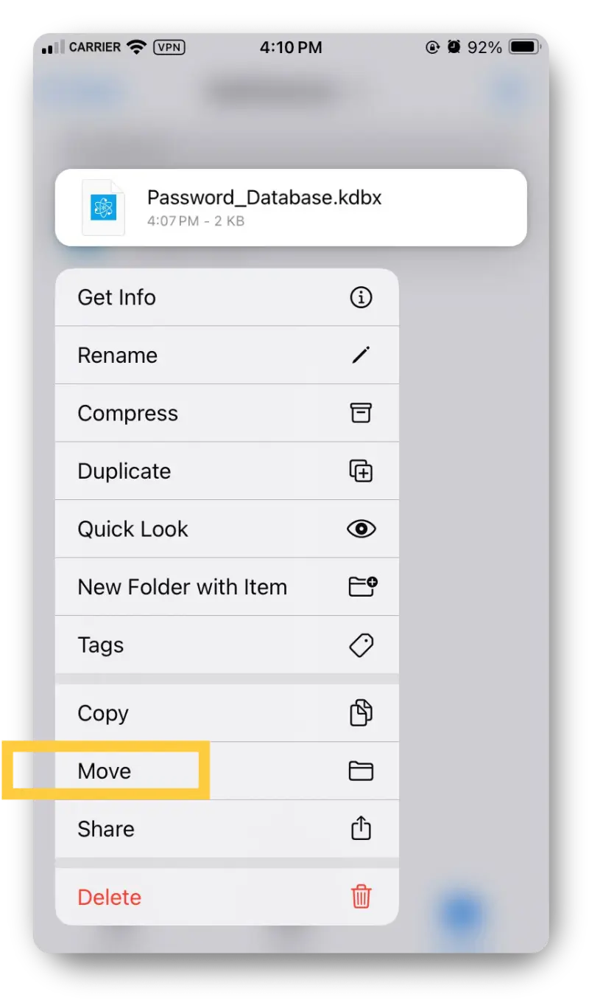
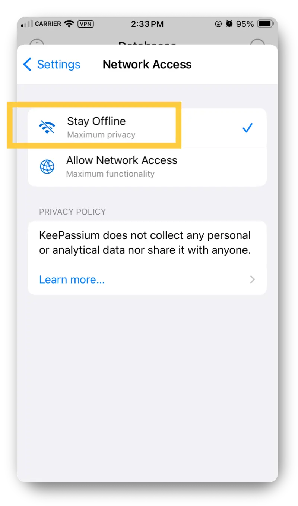
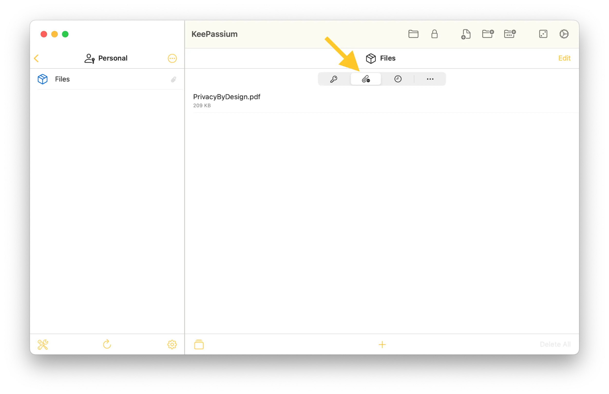

<small aria-hidden="true">Illustration: Em / Privacy Guides | Photo: PicJumbo / Pexels</small>

If you have been looking for a password manager giving you full control over your data, KeePassium is a fantastic option. The application available for iOS and macOS keeps your password database offline by default. KeePassium still offers synchronization and backup options, but allows you to choose which storage provider to trust with your database, and change it whenever you want.<!-- more -->

{align=right itemprop="image"}

[KeePassium](https://keepassium.com/) is a commercial open-source application made by KeePassium Labs, based in Luxembourg.

Because it's open-source, anyone can inspect and download its [code](https://github.com/keepassium/KeePassium) if they wish. Anyone could even [build](https://github.com/keepassium/KeePassium?tab=readme-ov-file#is-it-free) the entire application by themselves, and use the advanced features completely for free.

However, if you do not want to bother with code, you can use either the basic plan for free, or pay for a premium plan to access advanced features and to support the project.

KeePassium is a [KeePass](https://keepass.info/)-compatible project. If you are already familiar with any software from the [KeePass ecosystem](https://github.com/lgg/awesome-keepass), you will feel right at home with KeePassium.

KeePassium's strength resides in how it integrates KeePass' security and features into a well-rounded and well-designed application, that is very instinctive to use, while not compromising on flexibility and customizability.

The KeePassium application

For this review, the words "KeePassium" and "application" refer to both the KeePassium iOS and macOS applications simultaneously, unless otherwise specified. The mobile application was tested first and will be more prominent in the examples and screenshots.

## :material-apple: Platforms and Compatibility

KeePassium is written in Apple's Swift programming language and is available for Apple devices.

### Mobile

- For iPhone and iPad, KeePassium works on iOS 17.0 or later.

### Desktop

- For Mac computers, KeePassium works on macOS 14.0 (Sonoma) or later.
- KeePassium is compatible with both Apple Silicon and Intel hardware.
- The desktop application is new and was [released](https://keepassium.com/blog/2024/12/keepassium-2.0/) on December 17th, 2024.

### Apple Vision

- For Apple Vision, KeePassium works on visionOS 1.0 or later.

### Languages

The KeePassium application is available in the following languages: English, Arabic, Czech, Dutch, French, German, Italian, Japanese, Korean, Polish, Portuguese, Russian, Simplified Chinese, Slovak, Spanish, Swedish, Thai, Traditional Chinese, Turkish, and Ukrainian.

### Cross-compatibility

One great strength of any applications derivative of KeePass is compatibility with other KeePass applications. This is due to implementing of the same `.kdbx` file format for password databases, and often sharing similar features as well.

If you use KeePassium to store your passwords, you will be able to easily transfer your password database to other KeePass-compatible applications, and vice versa. This offers powerful portability for your password database.

File formats and encryption

KeePassium supports the KDB, KDBX3, and KDBX4 file formats, and implements AES, ChaCha20, Twofish, and Argon2 for encryption algorithms.

Even if compatibility with older database formats is available, it is recommended to use the more recent and [more secure](https://keepass.info/help/kb/kdbx_4.html) KDBX4 format. This latest format will be the default when you create a new database in KeePassium.

This cross-compatibility is so versatile that you could, for example, use KeePassium on mobile but sync it with [KeePassXC](installing-keepassxc-and-yubikey.md) on desktop.

Similarly, if you have a Mac computer but an Android phone, you could use KeePassium on desktop but KeePassDX on mobile, and so on and so forth. You can consult KeePassium's documentation for a list of all [compatible apps](https://support.keepassium.com/kb/compatible-apps/).

Testing compatibility

If you plan on using KeePassium with cloud storage and synchronization between devices, make sure to test your settings well before adding all your passwords to it.

Depending on your usage and settings, glitches in synchronization *could* corrupt your database file. This has more chances to happen if you use a cloud storage that isn't fully supported, or a KeePass-compatible application that isn't listed in KeePassium's documentation.

Ideally, if you use synchronization, create a dummy database at first to test that synchronization works properly with your specific cloud configuration and between all the devices you use.

It's also advisable to enable the backup feature and even keep a backup copy of your database file in a different directory. That way, if your main synced file were to get corrupted or lost somehow, you could always rely on this secondary backup.

This is important because there is no remote database management done by KeePassium. **You are fully in control of your own data, but you are also fully responsible to protect it.**

## :material-wallet-bifold-outline: Pricing

KeePassium can be used completely for free!

That being said, if you need advanced features, you might want to [pay](https://keepassium.com/pricing/) for a [Premium](https://keepassium.com/articles/why-upgrade-to-premium/) plan (monthly or yearly), or a Pro or Business plan. Fortunately, the monthly Premium plan is very affordable, allowing users to test the Premium features one month at the time before committing to a longer subscription.

Alternatively, if you do not need any advanced features but would like to support the project, you could use the free plan and [donate](https://keepassium.com/donate/) a fix amount to KeePassium.

#### Rent-to-own

Something interesting about KeePassium Premium's plan is that it offers a "[rent-to-own](https://support.keepassium.com/kb/license-rent-own/)" license. This means that if you pay for a KeePassium subscription for 12 months or more, you will always "own" the features you've paid for, even if you stop paying.

For example, if you pay for Premium for only one year then stop, you will keep access to all the Premium features that were available while you paid for Premium, but will not have access to new features added after your stopped paying. This is an excellent model that more applications should adopt.

## :octicons-shield-check-16: Security and Trust

Security and trust are without a doubt the most important characteristics of a good password manager.

While functionality and features are also important, there is no point in having a pretty application that doesn't safeguard your passwords properly. It would defeat the whole purpose of the password manager.

KeePassium does not neglect security for convenience, and has done its homework to earn its users' trust. The database format it uses, its transparency with open source, and its independent security audit, are all factors contributing to build trust in KeePassium.

### Trusted database format

The application is using an encrypted database file format developed by [KeePass](https://en.wikipedia.org/wiki/KeePass), an open-source project with a good reputation in the security and privacy community. KeePass' code and formats are trusted by many other KeePass-compatible projects, including KeePassXC, KeeWeb, OneKeePass, ModernKeePass, MacPass, Keepass2Android, and [more](https://github.com/lgg/awesome-keepass).

Even if the KeePassium application is relatively recent with its first [launch](https://keepassium.com/blog/2019/07/introducing-keepassium-for-ios/) in 2019, the formats it uses to secure password databases had many eyes on since the initial KeePass release in 2003. The fact that so many people have inspected, used, tested, and improved the security foundation of this file format through the years contributes to KeePassium's security as well.

### Open-source code

KeePassium was [created](https://keepassium.com/articles/who-created-keepassium/) by [Dr. Andrei Popleteev](https://popleteev.com/), who founded KeePassium Labs, and continues as its director to develop and maintain the app with a small team of [contributors](https://github.com/keepassium/KeePassium/graphs/contributors). Like KeePass, KeePassium's code is open-source under a [GNU General Public License](https://github.com/keepassium/KeePassium/blob/master/LICENSE.txt).

Open-source code isn't magical, but it helps to build trust by providing full transparency. Because all of KeePassium's code is publicly accessible, anyone could inspect it. This can help to detect and reporting potential vulnerabilities early on, and quickly verifying any claims made. Of course, at least *some* independent qualified people have to inspect the code in order to make this meaningful at all. But this is true for any open-source projects.

#### A note on KeePassium's open-source commercial model

More precisely, KeePassium is a *commercial* open-source application. This means its code is fully open and available to inspect, download, and use (within its license's limits). However, users can also purchase paid plans to access advanced features, without having to build and manage the code themselves.

Paid plans provide a source of revenue to KeePassium, which helps to maintain the application adequately to keep it compatible and secure, providing support to customers, and adding new features down the line.

This commercial model can actually add stability to a project, making it more likely to survive long term. This is reassuring considering all the other KeePass-compatible projects that have stopped getting maintained and are unfortunately no longer usable.

Furthermore, there is some [conflict](https://www.engadget.com/2011-01-09-the-gpl-the-app-store-and-you.html) between certain open-source licenses and publication on Apple's App Store. Because it isn't possible to download an iOS app outside of Apple's App Store (unless you adventure in the perilous waters of [jailbreaking](https://en.wikipedia.org/wiki/IOS_jailbreaking)), KeePassium and all other iOS apps are confined to operate within the App Store's requirements.

Also for this reason, the KeePassium projects cannot accept external contributions to its code, but can still [accept contributions](https://github.com/keepassium/KeePassium?tab=readme-ov-file#how-to-contribute) for bug reports, feature suggestions, and translations.

### Independent security audit (iOS)

Perhaps one of the most compelling argument for trusting KeePassium is the [independent security audit](https://support.keepassium.com/kb/security-audits/) the iOS application went through last year.

The Berlin-based cybersecurity firm [Cure53](https://en.wikipedia.org/wiki/Cure53) conducted a full evaluation and professional pentest of the mobile application in November 2024.

The review included an audit of the source code, application, network communications, and the implemented cryptography. The few vulnerabilities found were all fixed following reception of the report.

It's important to note that only KeePassium for iOS was audited, and not KeePassium for macOS, which was released after the audit. However, many aspects of KeePassium for iOS that were included in the audit are likely to be similar for KeePassium for macOS.

Interestingly, Cure53 has [audited](https://cure53.de/) many other well-known security and privacy-focused or open-source applications such as Proton Pass, 1Password, Bitwarden, Obsidian, Mullvad VPN, Onion Browser, Threema, Briar, SecureDrop, Mastodon, and much [more](https://github.com/cure53/Publications).

### Recommended by other applications

Finally, if you already trust KeePassXC for your desktop password manager, know that KeePassium is one of the apps [suggested](https://keepassxc.org/docs/) by KeePassXC to use on iOS.

## :octicons-lock-16: Privacy and Encryption

Data privacy and encryption are fundamental aspects of any password managers. Because pretty much all data stored in a password manager is highly sensitive data, all data should be protected by strong end-to-end encryption.

### Data collection

On this point, KeePassium delivers. First, a quick look at Apple's privacy label indicates that "the developer does not collect any data from this app". This is a good start, and this description is true for both the iOS and macOS applications.

Second, in its current version, KeePassium's [Privacy Policy](https://keepassium.com/privacy/app/) is excellent. This is never a guarantee of course, but the app's [security audit](#independent-security-audit-ios) shows the Privacy Policy statements are likely founded.

KeePassium separates its privacy policies for the application and the website. This is an excellent practice way too rarely adopted by companies. This approach provides much more clarity for what data is collected from where, and is a positive sign that an organization understands well data privacy legal requirements.

The Privacy Policy for the app is detailed and thorough, which are essential qualities to any respectable privacy policies.

It starts by stating clearly that KeePassium does not send any personal data to KeePassium Labs, the company developing the app. Then, it lists all instances where data *could* be collected through the purchase or use of KeePassium, and gives clear instructions on how to opt out for each. This is the kind of privacy policy that shows an organization genuinely values and understands data privacy. I highly encourage you to have a look at it from the link above.

Worth noting as well, KeePassium's Privacy Policy for its *website* states it [does not use any cookies](https://keepassium.com/privacy/website/#our-use-of-cookies-and-tracking). This is certainly refreshing to read.

### Encryption

Although the application is compatible with older formats, KeePassium by default will use the newer KDBX4 file format to encrypt password databases.

This is important because the KDBX4 format offers [significant security improvements](https://keepass.info/help/kb/kdbx_4.html) over the previous KDBX3 format. If you import an older database in KeePassium, it is recommended to upgrade it to KDBX4 and use a different main password for the upgraded database if you keep a backup of the previous one.

Upgrade from KDB to KDBX

If you need to upgrade an older database file to the newest file format to benefit from better security and KeePassium's full functionality, you can follow KeePassium's [instructions](https://support.keepassium.com/kb/convert-kdb-kdbx/).

To secure the database, and all the content included in it, KeePassium uses AES256, ChaCha20, Twofish, HMAC, and Argon2 (for KDBX4 only). Because the [KeePass database file format](https://keepass.info/help/kb/kdbx.html) (and so KeePassium's as well) encrypts the whole database, this means that not only passwords are encrypted but also usernames, website URLs, notes, attachments, etc.

Encrypting all data, not just passwords

Encrypting all user data contained in a password manager entry is *extremely* important, because encrypting passwords only just isn't enough.

In August 2022, the password manager [LastPass suffered a security breach](https://blog.lastpass.com/posts/notice-of-recent-security-incident) where users' password vaults (databases) were stolen from LastPass' servers.

This is bad enough even with end-to-end encrypted data (because vaults with a weak main password could get cracked), but even worse than this, some important data like website URLs were *not encrypted at all*, so this information was [stolen in plain text](https://www.pwndefend.com/2022/12/24/lastpass-breach-the-danger-of-metadata/).

This is the perfect example of why **encrypting all data *and* metadata** input by the user is *crucial* for data privacy and security.

Additionally, the LastPass' breach is a great argument in favor of keeping one's password database *offline,* whenever possible. Something that KeePassium makes possible even by default.

#### Encryption algorithms used by KeePassium

[AES256](https://en.wikipedia.org/wiki/Advanced_Encryption_Standard): The Advanced Encryption Standard (AES) is a trusted and commonly used block cipher symmetric-key algorithm. It was established in 2001 by NIST, the American National Institute of Standards and Technology. The number following the acronym describes the key size in bits (128, 192, or 256 bits).

[Twofish](https://en.wikipedia.org/wiki/Twofish): Twofish is another block cipher symmetric-key algorithm, which KeePassium can use to secure databases, in 256-bit key size as well. Famous cryptographer Bruce Schneier was part of the team who designed Twofish.

[ChaCha20](https://en.wikipedia.org/wiki/Salsa20#ChaCha_variant) (KDBX4 only): The ChaCha20 algorithm is a variant of Salsa20, both stream ciphers that encrypt and decrypt data in continuous stream instead of blocks. The number refers to the number of rounds in its structure.

[HMAC](https://en.wikipedia.org/wiki/HMAC) (Key Derivative Function): Hash-based Message Authentication Code (HMAC) is a robust hash function. In KeePass-compatible apps, it is used to [verify](https://keepass.info/help/kb/kdbx.html#hbs) the integrity and authenticity of the database before decryption.

[Argon2](https://en.wikipedia.org/wiki/Argon2) (Key Derivative Function, for KDBX4 only): Argon2 is a memory-hard function that offers better resistance against GPU cracking attacks compared to AES-KDF. Argon2 was the winner of the Password Hashing Competition in 2015.

[AES-KDF](https://keepass.info/help/kb/kdbx_4.html#intro) (Key Derivative Function, for KDBX3 only): AES-KDF is a key derivative function based on AES. This method was previously used for the KDBX3 database format, but has since been replaced by Argon2 for KDBX4. This is partly because AES-KDF is not memory-hard, which makes it easier to crack for an attacker using modern technologies.

{width="400"}

## :octicons-apps-16: Usage and Features

Once solid security and privacy protections have been confirmed, the second important part of a good password manager is how easy it is to use and the features it offers.

In this regard, KeePassium excels again. Not only does KeePassium offer the features users familiar with KeePass-compatible applications will recognize, but importantly, it implements these features with a polished user interface and obvious consideration for accessibility and user experience.

### Starting with KeePassium on iOS

Installing the app from the App Store is a smooth process. Once installed, make sure to go in Apple's "Settings" > "KeePassium" > "Siri & Search" and disable the Siri options you are not using. Apple very annoyingly puts them all on by default for each new app installed.

Additionally, you can follow KeePassium's [instructions](https://keepassium.com/privacy/app/) from its Privacy Policy to opt out of other Apple settings related to KeePassium.

After installing the app, KeePassium will guide you step-by-step to set up an application PIN (you can also enable application lock with biometrics), and import or create a new database.

If you are not familiar with it already, it's a good idea to read each popup from the welcome screen.

Secure the application properly

When prompted to select a Passcode to lock the application (which is different from the main password to secure your database), you will have the option to switch from the numeric keypad to a full alphanumeric keyboard. This is recommended to set up a stronger Passcode to protect the application, where your database(s) might be kept unlocked if you choose this option.

If you create a new database to store your passwords, make sure to choose a [strong main password](https://www.privacyguides.org/en/basics/passwords-overview/#passwords) (or "Master Key") that is *unique*, *complex*, and *long*.

KeePassium will guide you to determine if your main password is sufficiently strong. However, the app cannot know if you have used this password before, so you should make sure that you haven't and this main password is unique.

Be careful to remember your main password!

This is the only password that cannot be stored in your password manager, so it's important to secure it properly and also ensure you can **remember it well**.

Due to the nature of end-to-end encryption, there is no way for KeePassium to recover a lost password. Not remembering your main password could mean **getting locked out of your password database permanently**.

After creating a new database, you will be prompted to unlock it with your new main password ("Master Key").

{width="400"}

After you have either created or imported a database, you are ready to explore KeePassium's features.

### Starting with KeePassium on macOS

To download KeePassium on macOS, you will need to go through Apple's App Store. Alternatively, you could also [build](https://github.com/keepassium/KeePassium) the application from the source code, but that is an entirely different process.

Installing the application is a breeze, and the macOS app shares the same welcome sections and features the iOS version has, with a slightly different format.

The application will guide you to either create or import a database, then you will recognize the same features described below for the iOS version.

### Accessibility

There are a few great accessibility features with KeePassium. First, KeePassium fully works with Apple's VoiceOver. To enable it on iPhone, you can go in the iOS "Settings" > "Accessibility" > "VoiceOver" and enable "VoiceOver".

Second, from the KeePassium app you can tap on the "Settings" gear button on the lower-right to access the "Appearance" menu. From there, you will see a sliding option to adjust the entry's text size. This will change the size of the text in all entries' sections. You also have the option to change the font type from there.

Additionally, when tapping on a Password in an entry section, you can quickly tap on the magnified "a" button (while the blue "Copied" overlay appears) to display the password in large font, with each character separated in an indexed table.

### Security features

In the "Access Control" category of "Settings", there are some important options to customize the app's security features:

#### App Protection

This section gives options to secure the application itself. It includes using the device's biometric lock instead of the app's Passcode, changing the app's Passcode, and choosing when the app gets locked.

#### Data Protection

This section gives options to enable or disable if the database(s)' main password(s) is remembered locally in the device's secure keychain, or if it must be re-entered each time to unlock a database. It also allows you to choose when (if remembered) the database will lock itself again, how long to keep data (including copied passwords) in the device's clipboard, and other security preferences.

A fun (and useful) feature you will find there is that you can decide what happens when the device is "shaken". This can be an important security feature for people in sensitive situations.

#### Protection against weak passwords

When first creating a database, KeePassium will indicate if the main password chosen is too weak and display a warning.

This is an important security feature because **a database is only as protected as the strength of its main password**. It goes without saying the main password for a database should always be *unique* (has never been used elsewhere), *complex* (uses a variety of character types), and *long* (is long enough to not be vulnerable to brute-force attacks).

Passwords chosen for each entry will also display an indicator of strength under each field.

#### YubiKey support (Premium)

For users with Premium plans, KeePassium offers [support for YubiKey](https://www.yubico.com/works-with-yubikey/catalog/keepassium/) to add extra protection to a database using the challenge-response implementation.

The same feature is available on KeePassXC on desktop. For more details on this, you can check our [tutorial for KeePassXC](installing-keepassxc-and-yubikey.md), or our tutorial on [how to set up and back up a YubiKey](yubikey-reset-and-backup.md)'s challenge-response.

#### Passwords audit (Premium)

KeePassium offers to audit database's passwords for potential leaks. This feature works by comparing an obfuscated version of a password with the [Have I Been Pwned](https://haveibeenpwned.com/) service. The password is never shared externally during this process. This is helpful information to get an early warning and change a compromised password before the exposed account is attacked.

### Groups and Smart Groups

Before starting to add entries to a new database, it's a good idea to explore the Groups and Smart Groups features. Groups are directories that can be created inside a database to separate categories of passwords.

Smart Groups are simply Groups created from a search query. If you imported a database already full of passwords, you might not feel like sorting them manually. Smart Groups will help to create Groups using queries to [categorize](https://support.keepassium.com/docs/smart-groups/) entries automatically. This can be very convenient to organize larger databases.

When creating a new database, KeePassium will suggest some Groups, which you can be used as provided, changed, or deleted. To add a new Group or Smart Group, tap on the 3-dot button on the upper-right from inside a database and select "New Group" or "New Smart Group".

{width="400"}

Separate databases vs Groups

Using separate databases for different categories of passwords, for example one database for personal passwords, work-related passwords, and family-shared passwords is a good idea because it takes advantage of compartmentalization to add extra security and privacy.

Each database will have its own main password, and if one database were to get compromised, the others might still be protected. KeePassium's free plan only allow to use *one* database at the time, however.

Groups mainly serve to organize passwords and do not provide any additional security, privacy, or portability like separate databases do. For free plan users, Groups can still be a great feature to separate passwords when it isn't a security issue to encrypt them all together using a same main password.

### Entry options

Once inside a database, users can add a new entry there or first create/enter a Group directory. To create a new entry, tap on the 3-dot menu on the upper-right, then select "New Entry".

Each New Entry section will include a field for the entry's name, choice of icon (or option to download the service's favicon), "User Name", "Password", "URL", "Tags", "Notes", and option to "Set up one-time password (OTP)".

Tapping the plus-sign button at the top will create a new custom text field for an entry. Enabling the "Protected Field" option on the lower-right will hide this field as if it was a password field. That being said, all fields from an entry will be fully encrypted with the database.

An entry section from macOS:

Finally, to edit, move, copy or delete an entry on iOS, a long press over its name from the directory will show these options. Swiping left on a password entry will also show the edit and delete options.

{width="400"}

### Password generator

Conveniently, KeePassium includes a password generator. This is a common feature for password managers, and KeePassium implements this feature very well.

The generator can be used from either the die-shaped button on the right of every password field, the tool-shaped button menu on the lower-left from inside a database selecting "Random Generator", or the die-shaped button on the lower-left from the "Databases" section. The latter is a nice touch if you ever need to generate a random string while your database is locked.

Each time you open the Random Generator, it will automatically generate new random strings for all 3 modes: Basic, Expert, and Passphrase.

The Random Generator can also be customized. To customize each mode, tap on the gears-shaped button on the upper-right of the generator and change the mode to adjust the parameters for each. The app will remember the parameters every time it is used.

The customization for Passphrase does not include the options for "MIXED" case at this time, however, considering this option was just added to KeePassXC last month, maybe it will be added to KeePassium as well in the near future.

### One-Time Password (OTP)

KeePassium offers the option to store one-time password codes with each entry. This can be a convenient way to manage second-factor of authentication, and keep these codes stored locally only.

However, this can also introduce additional risks. If a database file was to get compromised at some point, it would also compromise all the OTP codes within it, making this second-factor protection useless against an attack of the whole database.

If this isn't a risk you are concerned with, then KeePassium's OTP can be a useful feature.

OTP codes are easy to set up and can be entered manually or using a QR code. Once set up, the code will be displayed as a field in the entry. Tap on it to copy it.

### AutoFill

Depending on your usage, AutoFill can be an important feature for a password manager. AutoFill will allow KeePassium to recognize a login page and automatically fill all in the login credentials.

To ensure AutoFill works smoothly, it's important to enter the correct website URL for each entry, specifically the page's URL where the credentials will be required.

Ultimately, it's possible some websites will just not work with KeePassium's AutoFill. Some [issues](https://github.com/keepassium/KeePassium/issues/405) have been experienced while testing the app for this review. If you experience the same issue with a website, you can simply copy-paste the credentials manually in each corresponding field.

AutoFill issues for some websites

A possible cause of AutoFill issues can be an incorrect entry URL that isn't the proper "Caller ID". To troubleshoot this, you can consult KeePassium's helpful [instructions](https://support.keepassium.com/kb/autofill-matching/) here.

#### AutoFill for iOS

When set up correctly on iOS, a "Passwords" button should appear above the keyboard for websites where credentials have been stored in your database. If it doesn't, this could mean AutoFill was not set up properly from the [iOS Settings](https://support.keepassium.com/kb/autofill-setup-ios/).

{width="400"}

#### AutoFill for macOS

There isn't a browser extension available for KeePassium on macOS. The desktop AutoFill feature integrates with the system as a [credential provider](https://www.reddit.com/r/KeePassium/comments/1isvjjd/comment/mdsbwwc/). Browser implementation depends on how each browser integrates this function. The desktop AutoFill feature does work flawlessly with Safari.

To set up AutoFill for KeePassium, you will have to enable it from the [macOS Settings](https://support.keepassium.com/kb/autofill-setup-macos/). KeePassium will guide you through the process with clear instructions to follow:

Once enabled, every website with a corresponding URL in your database will display a small key icon on the right of the credential fields.

Despite lacking a browser extension, integration with Safari and the macOS ecosystem works smoothly, and it will work with applications that aren't browsers as well.

### Backups

Backing up your database is essential with any KeePass-compatible app. Because there is no remote backup automatically stored by the application, you become responsible for protecting this data properly.

KeePassium offers many options to help users back up their databases.

#### Enable backup copies

The option to back up local copies automatically will be enabled by default. You can disable it if you prefer (ideally not), or enable the option to "Show Backup Files" in "Settings" > "Database Backup". You can also adjust for how long you wish to keep the local backups (the default value is 2 months).

#### Exclude from iCloud/iTunes

There is an important feature to exclude your database file and KeePassium's backups of your database from your device's iCloud or iTunes backups. If you do not trust Apple with your encrypted database, you should enable this everywhere (excluding from iCloud/iTunes is disabled by default).

If your database is stored locally (you might not see the option otherwise): From the "Databases" page, tap on the 3-dot button right to your database name (not the *circled* 3-dot button at the top, the one below). Then tap on "File Info" and *enable* the option "Exclude From iCloud/iTunes Backup" to make sure your database file stays outside your device's iCloud or iTunes backups.

Secondly, to also exclude the backups created by KeePassium, inside a database tap on the "Settings" gear button on the lower-right, then "Database Backup", and *enable* "Exclude Backup Files from System Backup".

You will find the same option on macOS:

#### Auto-delete backup files

You can choose the backup files to get deleted automatically after a certain period of time. For this, go to "Settings" then the "Database Backup" again, and scroll down to "Keep Backup Files". Select a retention period that is secure for your threat model. You can also tap on "Delete ALL Backup Files" below to delete all backups at any time.

#### Manual backups

Finally, you can simply back up your database `.kdbx` file manually. For this you have the options to transfer the file from KeePassium via cable, cloud storage, local network, AirDrop, email, or even Signal's [Note to Self](https://support.signal.org/hc/en-us/articles/360043272451-Note-to-Self)!

To [transfer](https://support.keepassium.com/kb/database-transfer/) your database file entirely offline to another Apple device, connect your device together via USB cable and follow these [instructions](https://support.apple.com/en-gb/guide/mac-help/mchl4bd77d3a/mac).

If you stored your database locally on iPhone, you will find the file in Apple's "Files" > "On My iPhone" > "KeePassium". From there, you can long press the file to see options to move or share it.

{width="400"}

#### Restore database from backup

If you encounter any errors while managing your database, you can always restore it from a backup. Keeping multiple backup versions is a good idea to ensure you always have a functional file. Glitches and bugs are more likely to happen if you handle your database in unusual ways, with other software that may not have been tested for this usage yet.

Restoring a database in KeePassium is a very straightforward operation. In the "Databases" section, tap on the 3-dot button on the upper-right, then select "Show Backup Files", if it isn't already on. Follow KeePassium's [instructions to restore](https://support.keepassium.com/kb/restore-backup/) a previous version.

### Synchronization and direct connection

While you can use KeePassium entirely offline, the app also offers options to synchronize your database with other KeePassium installations or other KeePass-compatible applications.

There are two ways to do this. You can either simply store your database file in a cloud service of your choice and let KeePassium access this file, or you can use KeePassium's direct connection with certain cloud providers.

You can see these two options from the app in "Settings" > "Network Access". From there, you have the option to select "Stay Offline", for maximum privacy, or "Allow Network Access", for maximum functionality.

Whether you choose simple file synchronization or a direct connection, you can consult [this list](https://support.keepassium.com/kb/sync/) of cloud storage providers that have been tested by the KeePassium team and users to determine if your provider is supported.

#### Stay offline, and synchronize through a cloud provider (recommended)

This is KeePassium's [recommended method](https://keepassium.com/articles/cloud-sync-sandboxing/) to synchronize your database file(s) while maximizing privacy and minimizing external accesses. By default, KeePassium will remain offline, but you can store your database file with a cloud provider of your choice.

This way, your cloud provider will manage the network communication, and KeePassium will only take care of decrypting your database. Because of system-enforced sandboxing, KeePassium will not have access to anything else on your cloud storage, only the database file(s) your have granted it access to.

For example, you can store your database file on a cloud storage of your choice, then open it from KeePassium for iOS and also from KeePassXC on desktop. Both applications will access and manage the same file, therefore synchronizing your database.

Be careful however when modifying your database. If synchronization isn't handled properly, this could cause errors that could corrupt your file. This is why it's important to test your setting first, and a good practice to keep a backup in a secure secondary location.

{width="400"}

Synchronization through Proton Drive

Proton Drive isn't part of the recommended and tested list of cloud providers for KeePassium. However, it was briefly tested during this review.

Between KeePassium iOS and KeePassXC on desktop, some synchronization was possible through Proton Drive, but with mixed results.

To make it work, first the Proton Drive app needed to stay unprotected by a PIN or biometrics, which isn't ideal if you have other sensitive files on this drive. There was also some delay to sync the database between mobile and desktop, and a few bugs occurred while testing.

That being said, synchronization was *possible* through Proton Drive between KeePassium for iOS and KeePassXC on desktop, but maybe not recommended. If you choose this setup for yourself, it is *strongly* recommended to conduct adequate testing first using a dummy database, and once set up with your actual database, to keep a secondary backup in a separate location.

Testing couldn't make synchronization work between KeePassium iOS and KeePassium macOS through Proton Drive. Issues seem to come from conflict resolutions on the Proton Drive side. Of course, because Proton Drive isn't even listed by KeePassium as a supported storage, this was simply conducted as an experiment and not an expectation.

Because many of our readers might use Proton Drive as a cloud provider, just be aware it probably isn't a usable synchronization solution at this time.

Using Proton Drive to simply back up a password database file manually without synchronization is still a viable option, however.

#### Allow network access, to connect directly from KeePassium

In 2022, KeePassium added direct connection options for certain cloud storage providers as a workaround solution for providers that were not integrating well with the system. This should however be a secondary choice only, as it will have some downsides for your data privacy.

You can find this option from the "Data Encryption" welcome window at the start where you can either create a database, import a database, or "Connect to Server".

Although KeePassium will only use what is necessary for this functionality, it [will access](https://keepassium.com/privacy/app/#direct-connections) more data than with the "Stay Offline" synchronization option. The data used for this functionality will however remain between your device and the cloud provider.

#### Supported cloud storage providers

KeePassium offers full support for iCloud Drive, Box, Dropbox, Google Drive, OneDrive, Resilio Sync, Nextcloud, SFTP / WebDAV, and limited support for Mega and Cryptomator.

You might be able to make it work with cloud providers that aren't listed here. However, if you decide to use a provider that isn't fully supported, make sure to properly test your setup with a dummy database first.

### Additional features

This review focused testing on the most commonly used features that are accessible from a free plan. Nonetheless, KeePassium offers many more features, and additional ones for paid plans. Here's a summary of some other interesting features that have not been covered yet:

#### Passkeys

Since December 2024, KeePassium added [support](https://keepassium.com/blog/2024/12/keepassium-2.0/#passkey-support) for passkeys with its 2.0 release.

#### Family sharing (Premium)

You can use Apple's Family Sharing feature to [share](https://support.keepassium.com/kb/family-sharing/) your KeePassium paid license with your family members.

#### Multiple databases (Premium)

With a paid plan, it's possible to create or import multiple databases with KeePassium. This can be very convenient if you use a separate database for work and for your personal life, for example.

#### Printing database

KeePassium has a quick option to print an entire database in plain text, in an easy-to-read format. If this is secure for you, it can be a convenient way to keep a backup paper copy of all your passwords in case of emergency (or for inheritance purposes).

To do this, while inside your database tap on the tool-shaped button on the lower-left, then select "Print". Of course make sure to secure this printed data *very well*, as it could be your weakest link.

Important security warning!

Depending on your printer's settings, you should be *very careful* when using the print function. This data will be sent in plain text to your printer, and even perhaps through a network (depending on your printer's settings).

This **can represent a very high security risk**, depending on your printer setup and situation. The file with your plain text passwords could also remain stored in the printer's queue!

The print function can be [disabled](https://support.keepassium.com/docs/mdm-appconfig/#allowDatabasePrint) for users with a Business license.

#### Read-only database

You can protect a database from accidental changes by enabling this option. This will prevent any entries from being added, removed, or modified.

It can be very useful if you have installed the app for someone who isn't comfortable with technology and want to make sure they cannot inadvertently delete an entry, for example.

To enable it from KeePassium on iOS, go to the "Databases" section, long press on your database file, select "Database Settings", then enable "Read Only" at the top.

#### File storage (attachments)

You can use your database to store files!

It's probably best to stay reasonable with this because files will quickly make your database very heavy. This could significantly slow down the encryption and decryption processes.

That being said, it's a great way to store more sensitive files securely. The files will be encrypted with your database.

You can either add files to an entry already created, or create a new entry named "Files" (or anything else you wish) to store all of your files together.

To add a file, select the paperclip-icon tab at the top of an entry, then tap the plus-sign button at the bottom. Your files (attachments) will be accessible from any other KeePass-compatible application, like KeePassXC for example.

Interestingly, KeePassium even uses a quite decent PDF viewer on iOS:

{width="400"}

## :material-thumb-up-outline: Nice to have

- You can see what was added, changed, or fixed for each KeePassium version from "Settings" in the "What's New" section.

- You can change the KeePassium and database icons from "Settings" > "Appearance" > in "App Icon" and "Database Icons".

- KeePassium has [excellent documentation](https://support.keepassium.com/)! This is handy to learn about features or to troubleshoot if you encounter any errors.

- You can see the full credits for the app from "Settings" in the "About KeePassium" section.

Check the credits!

KeePassium not only credits its direct contributors but also lists credits for each graphics, code, and encryption algorithms used. You will find the same list of credits on KeePassium's GitHub [page](https://github.com/keepassium/KeePassium?tab=readme-ov-file#author-and-credits). This is a wonderful idea that more software should get inspired by.

## :material-thumb-down-outline: Downsides

Even if KeePassium is a great secure application that is easy and pleasant to use, there are still a few downsides that should be mentioned:

- People with older versions of iOS or macOS will unfortunately not be able to use the application at all.

- KeePassium only works in the Apple ecosystem, and there are no versions for other systems at this time.

- If you are using a cloud provider that doesn't work smoothly with KeePassium and you need synchronization, you will unfortunately need to synchronize your database manually or change your cloud storage provider.

- AutoFill on iOS might not work for every account. This can be an inconvenience depending on your usage and which of your accounts (if any) are impacted.

- AutoFill on macOS might not work with your favorite browser (if it isn't Safari).

## :octicons-key-16: Conclusion

Overall, KeePassium is a privacy-focused, offline-first application, that has clearly prioritized user experience and user interface, while not neglecting security and privacy.

When used with the basic and supported settings, it works fairly smoothly and allows enough customization to adapt to a variety of user needs and situations.

The fact that KeePassium allows full compatibility with most other KeePass-compatible applications is an immense benefit compared to proprietary password managers.

If you already keep your database in the KeePass file format, there are no downsides in trying KeePassium. If you aren't using this database format yet, this is a great opportunity to start and free yourself from locked-in systems that secure your precious passwords with obscurity rather than with openness.

<small aria-hidden="true">Unless credited otherwise, all screenshots from: Privacy Guides</small>
