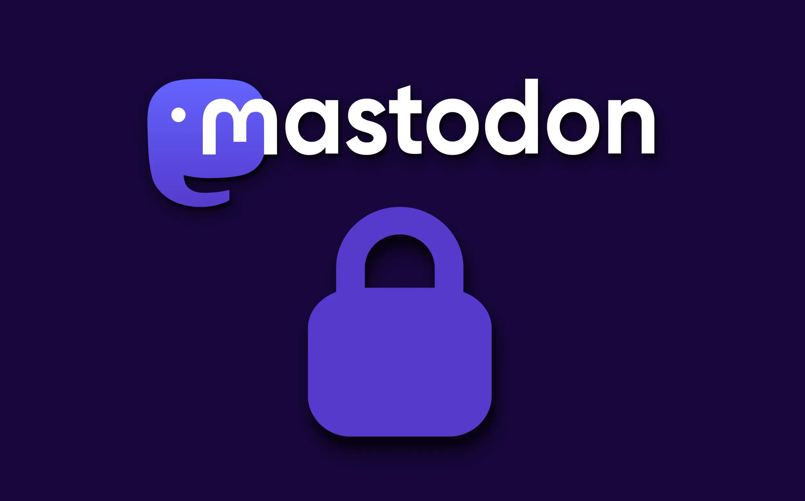
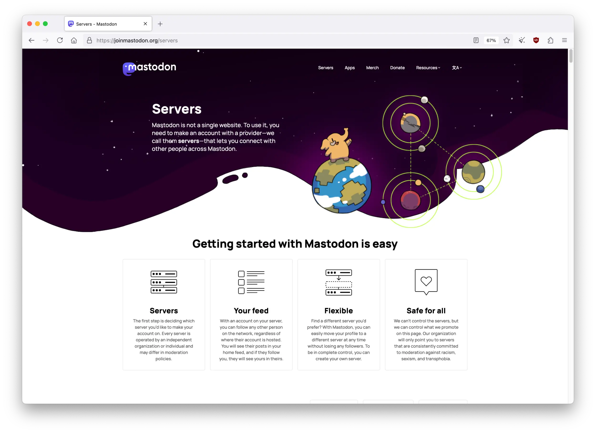
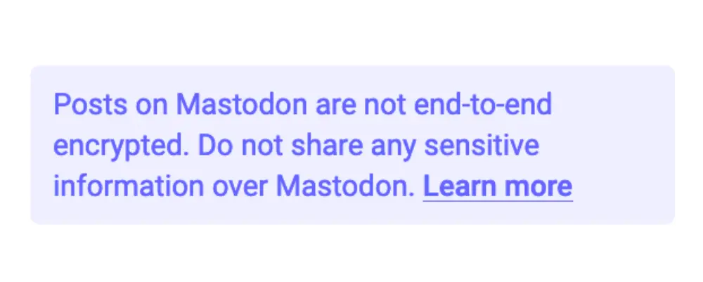

---
date:
    created: 2025-07-15T17:00:00Z
    updated: 2025-07-22T17:00:00Z
categories:
    - Explainers
authors:
    - em
description: While most social media rely on commercial models harvesting users' data, Mastodon offers an alternative that doesn't seek profits from your data and attention.
schema_type: AnalysisNewsArticle
preview:
  cover: blog/assets/images/mastodon-privacy-and-security/mastodon-cover.webp
---

# Privacy and Security on Mastodon



<small aria-hidden="true">Illustration: Em / Privacy Guides | Logo: Mastodon gGmbH</small>

Mastodon is an open-source and decentralized social network that has been growing in popularity for the past few years.

While most social media rely on commercial models harvesting users' data to sell to advertisers, Mastodon offers a human-centric alternative that doesn't seek profits from your data and attention. This means better social connections, better controls, and better privacy.<!-- more -->

Mastodon doesn't use your data to make money. This fact alone comes with incredible benefits for data privacy and security. Because the goal isn't to collect as much information as possible on its users, Mastodon embraces data minimization and only requires providing what is truly needed to run the service for you.

This article is the first of a **series of two** on Mastodon.

If you do not have a Mastodon account yet, but would like to learn more about its privacy and security practices and features before creating one, this first article will give you an overview of what they are.

If you already have a Mastodon account, the second article of this series will guide you to use and understand better the controls it offers. If you are already informed about Mastodon's privacy and security, you may want to jump directly to the [tutorial article](mastodon-tutorial-privacy-and-security.md).

If you're still unsure about using Mastodon, [this excellent video](https://news.elenarossini.com/fediverse-video/) from Elena Rossini might convince you.

<div class="admonition info" markdown>
<p class="admonition-title">Mastodon the software vs the network vs the instance</p>

Unless otherwise specified, the word *Mastodon* in this article will refer to the Mastodon *software,* in its default version. The Mastodon *software* is different from the Mastodon.Social original *instance* (server), and is different from the Mastodon *network*.

**Mastodon software**: The software used by people on the Mastodon network, and installed by administrators to run an instance (what you see).

**Mastodon network**: The network of interconnected instances using the Mastodon software (all the different Mastodon instances you interact with). The Mastodon network also connects to the larger Fediverse network.

**Mastodon.Social, the instance**: The largest Mastodon server, managed and moderated by the Mastodon nonprofit organization.

</div>

One of the wonderful possibility Mastodon offers is to [self-host your own Mastodon instance](https://docs.joinmastodon.org/user/run-your-own/). While this is the pinnacle of control, security, and privacy for a skilled administrator, self-hosting also means more responsibilities, where more expertise and resources are required. This isn't realistically accessible to everyone.

For this reason, this article will focus on the experience from the **user side**, and not from the administrator side.

## :octicons-home-16: Choosing a Mastodon instance

Another particularity of Mastodon compared to commercial social media is its true decentralization.

The Mastodon network is composed of a [multiplicity of instances](https://joinmastodon.org/servers) that connect with each other, through a protocol called [ActivityPub](https://docs.joinmastodon.org/#fediverse). This collection of connected instances, along with other connected software using the same protocol, is called [the Fediverse](https://jointhefediverse.net/).



This article will not go deep into this topic, but it's important to mention that different instances will offer different degrees of privacy and security. Choosing an instance can have an important impact on this.

This is because the administration team of each instance has the responsibility to configure the software properly, to keep it updated, and to safeguard the server hosting the data. This in itself implies many security duties. It's important to consider the capabilities of the administration team to secure the instance you choose to join.

Moreover, even when the security part of hosting is well managed, the administration team is also responsible for enforcing policies and moderation. The quality of moderation can have a significant impact on the safety and privacy of a community.

Choosing an instance where you trust the administration and moderation team is essential to have a good and secure experience on the network. This is true for any other social media as well, even the ones that sadly don't offer any option to move your account if you aren't happy with management.

To facilitate choosing an instance, the Mastodon official website keeps a list of instances that have all agreed to follow the [Mastodon Server Covenant](https://joinmastodon.org/covenant), committing to the following:

- Enforcing active moderation against racism, sexism, homophobia, and transphobia

- Conducting daily backup to avoid accidental data loss

- Having at least one other person with emergency access to the server

- Giving at least 3 months of advance notice if the server shuts down and users have to move (this isn't frequent)

### Changing instance

Despite these considerations, Mastodon newcomers **shouldn't feel [analysis paralysis](https://en.wikipedia.org/wiki/Analysis_paralysis) over choosing an instance**. This decision isn't permanent, and can be changed later on, once one has acquired a better sense of the platform.

Indeed, as shown in the tutorial article, Mastodon makes it possible to easily [move an account](mastodon-tutorial-privacy-and-security.md/#moving-to-another-instance) from one instance to another!

If trust is broken by an instance administration or moderation team, users can easily decide to migrate to another one with better practices. This account portability is quite unique to the Fediverse.

While account content (posts) will unfortunately not get transferred through this process on Mastodon (yet), account followers *and* follows will be moved unharmed during a Mastodon account migration.

Furthermore, this process might get improved soon! There is work currently being done to implement data portability between two ActivityPub servers (even for account content) with the [LOLA protocol](https://swicg.github.io/activitypub-data-portability/lola). This could eventually allow Mastodon's account migration process to include posts migration as well.

<div class="admonition success" markdown>
<p class="admonition-title">You can always keep a copy of your content!</p>

Even if the Mastodon migration process doesn't allow for automatic posts transfer (yet), you are still able to keep a local copy of all your content, before moving to another instance or for backup purposes. More on this in the [tutorial article](mastodon-tutorial-privacy-and-security.md).

</div>

## :octicons-shield-check-16: How secure is Mastodon

As explained previously, choosing an instance with a competent and trustworthy administration team is fundamental on Mastodon. Due to a plurality of instances, levels of security expertise can greatly vary from one server to another.

### Server security

As for any platform we use online (including commercial social media), it's important to evaluate properly the level of trust we are willing to give before subscribing to a service handling our data.

In this case, it means trusting the administration team of the instance you choose to safeguard the instance's server and data properly.

Additionally, like any other social media, Mastodon isn't immune to software vulnerability. When a problem arises, your server's security will depend on the responsiveness of your administrator(s).

Mastodon's development team has a good track record of acting promptly to fix and transparently inform the community when a critical [vulnerability is found](https://www.theregister.com/2024/02/02/critical_vulnerability_in_mastodon_is/). However, your instance's administration team must also act quickly to implement the fix.

Due to the decentralization of the Mastodon network, software patches cannot be automatically pushed to all instances at once. Administrators' reaction time may vary for each instance.

### Software security

Because the Mastodon software is open-source, anyone can inspect [its code](https://github.com/mastodon/mastodon). This *can* offer the benefit of getting more opportunities to spot and patch potential problems.

It also allows anyone to verify privacy and security claims, which greatly improves transparency and trust. This is something that cannot be done with proprietary closed-source software like most commercial social media use.

But open-source code isn't magically secure either. Experts still have to take the time to actually inspect the code for this to have any significant value.

In 2023, the Mozilla Foundation funded a penetration test for Mastodon that was conducted by the German cybersecurity firm [Cure53](https://cure53.de/). Following the results, the Mastodon development team [promptly fixed](https://arstechnica.com/security/2023/07/mastodon-fixes-critical-tootroot-vulnerability-allowing-node-hijacking/) the critical vulnerabilities found, and informed instance administrators to be ready to patch the software quickly. Mastodon instances updated to the most recent software now benefit from greater security, thanks to the excellent work of Cure53 and the Mastodon development team.

Additionally, anybody detecting a security vulnerability in Mastodon's code can [report it easily](https://github.com/mastodon/mastodon/security/policy) on the project's GitHub page. Known security vulnerabilities are also transparently reported to the public in the [security advisories](https://github.com/mastodon/mastodon/security/advisories) list.

Since April 1st this year, the Nivenly Foundation started the Fediverse Security Fund, a [security bounty program](https://nivenly.org/docs/programs/fediverse-security-fund/) to encourage more people to contribute to securing Mastodon and other Fediverse-connected software.

The experimental program will run **until September 30th, 2025**, and invites individual researchers and contributors to identify or patch vulnerabilities, rewarding them with a one-time sponsorship. If successful, the program could get extended, depending on member votes.

Regarding the software itself, Mastodon [uses](https://docs.joinmastodon.org/spec/security/) public key cryptography to secure HTTP Signatures and Linked Data Signatures. From [version 4.4](https://blog.joinmastodon.org/2025/07/mastodon-4.4/), Mastodon implemented a number of [security improvements](https://blog.joinmastodon.org/2025/07/mastodon-4-4-for-devs/) to authentication and authorization mechanisms. Mastodon 4.4 now [supports](https://docs.joinmastodon.org/spec/security/#http-message-signatures) incoming HTTP requests to be signed with RFC9421-compatible signatures. Additionally, the older (less secure) OAuth password grant type has been removed, and the OAuth Client Auth with HTTP Basic Auth with SSO has been fixed.

On the user side, Mastodon gives options to improve account security with the use of **multifactor authentication**, using an authenticator app or a physical security key. Already, this is better account security than what many (if not most) commercial social media platforms propose.

In addition, Mastodon users can see within their account lists of all sessions open, the authentication history, and all third-party software authorized to access the account. Users can quickly revoke access to any unauthorized or unused sessions or app, as necessary.

### Data security

Finally, because Mastodon only requires **minimal information** to create an account, less personal data risks getting exposed, in the unfortunate eventuality of a data breach. For example, no phone number, legal name, or official ID is required. This is excellent for both privacy and security.

Even if Mastodon has a much smaller security team than larger commercial platforms, its decentralization, transparency, and data minimization gives it significant advantages over for-profit social media.

Users' private data is protected reasonably well at the software level, but again, this protection also relies on the server security for each specific instance.

While security and privacy are related concepts that can enhance each other, they differ in many points. A piece of software could be very secure, yet collect and use a lot of private data, regardless of the user's consent or knowledge. Inversely, a seemingly privacy-respectful software could be collecting very little user data, yet not securing it properly.

Both privacy and security are important to consider for users, and both must be examined when evaluating software.

## :octicons-lock-16: How private is Mastodon

When using social media, there are always two sides to data privacy: The data collected by the service, and the data exposed by the user posting content.

### Data collected by the service

On Mastodon, the platform collects only minimal information from the user. Besides the content you decide to share for your profile and posts, the software only requires an *email address,* a *username,* and a *password* to sign up.

Starting from version 4.4, some instances might also collect a *date of birth,* if the instance implements a minimum age policy. This date of birth is only used to validate age requirements and isn't stored anywhere, but it is [checked](https://blog.joinmastodon.org/2025/07/mastodon-4-4-for-devs/) against the minimum age condition server-side.

Additionally, Mastodon will collect your *IP address(es)*, *applications* used, and the *times* you logged in. This is necessary to provide the service to you. You can increase your account privacy by registering with an [alias email address](https://www.privacyguides.org/en/email-aliasing) (if allowed by your instance), and logging in through a [trustworthy VPN](https://www.privacyguides.org/en/vpn/).

It's worth mentioning that Mastodon.Social, the instance administrated by the Mastodon organization, recently added to their terms of service an additional clause to [explicitly prohibit scraping](https://techcrunch.com/2025/06/17/mastodon-updates-its-terms-to-prohibit-ai-model-training/) users' data for unauthorized purposes, such as to train AI models. Many other instances might soon add similar clauses (or already have them).

While this provides little technical protections, it does provide some interesting *legal* protections. These are protections most commercial social media do not offer, as many already exploit users' content to train their own AI models or sell it to third-parties for this purpose.

This new Mastodon.Social policy is well aligned with the more human-centric values of the Fediverse.

<div class="admonition abstract" markdown>
<p class="admonition-title">Summary of data collected by Mastodon</p>

- Email address
- Username
- Password
- IP addresses (temporarily stored, may vary per instance)
- Browser and application types (temporarily stored, may vary per instance)
- Login history (temporarily stored, may vary per instance)
- Date of birth (not stored, may vary per instance)
- Optional: The data you decide to share with the service (profile information, posts, post timestamps, uploaded media, favorites, boosts, followers, follows, bookmarks, lists, blocks, mutes, personal notes)

</div>

### Data you post on the service

Regarding the content of your profile and posts (including private mentions), no matter how much you restrict access to your account, you should always consider that this content *can* technically be accessed by the administration and moderation team of your instance.

Concerning people outside your instance's administration team, the privacy of the data you upload yourself will greatly vary depending on how you use and configure your account.

For more information on how to adjust your account's configuration for better privacy, consult the [tutorial article](mastodon-tutorial-privacy-and-security.md) of this series of two.

### Who can access your private data

As described above, the administration team of your instance *can* always technically access *any* data related to your account, regardless of if you make it public or private. This is true for most commercial platforms as well.

That being said, administration teams are generally much smaller on the Mastodon network, so this might not represent a lot of people. It could even mean only *one* administrator.

This has both benefits and downsides: The benefit is that fewer people have access to your private account data. The downsides are that, due to limited resources, this data *could* get less protection. That said, large commercial platforms aren't immune to data breaches either, despite all the resources they could use in prevention.

### Account configuration

Outside access from the administration team, content privacy will vary per account, depending on configuration. Similarly to any other social media platforms.

Some people might prefer to share openly with everyone, even with people who do not have a Mastodon account. While others might prefer to lock their account entirely, and reduce content visibility to their approved followers only. Both types of usage are possible on Mastodon.

Additionally, Mastodon offers much better controls over your data. You can set up automated post deletion with specific thresholds, adjust post visibility for each post, adjust searchability and discoverability to your preferences, and allow or restrict the upcoming quote posts feature.

All these features are fantastic for data privacy, and often absent from commercial platforms.

### Users tracking and profiling

Most important of all, because Mastodon has no interest in monetizing your data, there is **no tracking, no advertising, and no "Mastodon-AI" profiling you** and scanning all your posts. Mastodon doesn't collect any data from you for a reason other than providing the service *to you*.

This is completely antithesis to commercial social media. And this alone makes Mastodon fundamentally **much more private than any other big tech platforms**.

## :material-lock-check-outline: Privacy benefits of Mastodon

Each Mastodon instance will have a different privacy policy that you should consult before creating an account, like for any other platforms. But unless the software was modified, data collection should be similar to what is described here, and remain minimal for the majority of connected instances.

Here's a summary of some benefits Mastodon can offer for your data privacy:

### Data minimization

Mastodon only collects what's necessary. The information required to create an account is minimal. There are no "real-name" policy and no phone number required. Only the data absolutely necessary to provide the service to you is required.

### Adjustable visibility

While profile information will be visible publicly, post visibility can be adjusted to your preference for each post. The list of who follows you and who you follow can be visible or hidden. Account searchability, discoverability, and quote posts from unmentioned users can all be disabled.

### Your data is yours

On Mastodon, you have full control over accessing and deleting your data. You don't need any third-party software to get your post deleted, and you don't need to wait after a company's customer service to download your data. Those controls are accessible to any user from their own account.

### No data monetization

The Mastodon software is developed and maintained by a nonprofit organization, the German [Mastodon gGmbH](https://joinmastodon.org/about). This software is free and accessible to anyone. There is no incentive to generate profit from your data on Mastodon. This is an *immense* privacy advantage over *any* commercial social platforms. There is nothing tracking you around or building an advertising profile on you. Your data is not for sale.

### Transparency and mobility

Because the Mastodon code is open-source, anyone can inspect it. This helps quickly verifying claims, proposing new features, and allowing other developers to create their own application for Mastodon.

With Mastodon, you are not stuck with only one app. If you don't like the official app, just use [another one](https://joinmastodon.org/apps)! Moreover, you can even move your account from one instance to another. This means you don't have to trust your administration team forever. **You can choose who you trust, and your trust (and consent) is revocable, as it should.**

### Respects your privacy protections

So many services and websites have adopted a hostile stance towards people using privacy protections such as a VPN server, a privacy-focused browser, or running their phone in [Lockdown Mode](https://support.apple.com/en-us/105120). But with Mastodon, you are free to use all the protections you love. **Mastodon isn't hostile to your privacy.**

## :octicons-alert-16: What to stay careful about

While the privacy benefits of Mastodon are numerous, there are also a few things to keep in mind when using the platform:

### Direct messages (private mentions)

Direct messages on Mastodon are better described at private mentions. Private mentions are like any other posts (and will sometimes show up in your feed! Don't panic!), but they will only be visible to the people you *mentioned* in it.

However, do **not** type the handle of someone to talk "in private" about them with someone else, because this *mentioned* person *will* also get included in this thread!

Additionally, private mentions on Mastodon, like private messages on other commercial social media, aren't end-to-end encrypted. The Mastodon interface shows this clearly:

{width="400"}

This means that all your private mention posts *could* be accessed by the administration and moderation team of your instance. **Never share any sensitive information using private mentions.** The same advice is applicable to any other social media.

<div class="admonition info" markdown>
<p class="admonition-title">End-to-end encryption could be coming soon!</p>

That being said, this could change soon! The ActivityPub team is currently [working on integrating end-to-end encryption](https://socialwebfoundation.org/program-protocol-e2ee/) for the protocol. This would be nothing less than revolutionary for platforms using ActivityPub, like Mastodon.

It's difficult to estimate when this feature could be available to Mastodon users however, because implementing end-to-end encryption properly isn't a simple task. Even once the integration is completed for the ActivityPub protocol, it might take some time before the Mastodon development team implements it for the software as well.

Nevertheless, Fediverse users can dare to hope this feature may be available relatively soon, perhaps in the next year or two.

</div>

### The open web is open to all

On Mastodon, you don't need an account to see people's profile page and public (or quiet-public) posts.

This is an **immense benefit for organizations**, to share information with the public without restricting access like on commercial platforms. However, this can also mean more account visibility than some individual users may prefer.

It's important to stay aware that your account *could* be seen by anyone on the internet visiting your Mastodon account's public page. Your account's public page address is your instance's website address followed by your account's username, in the following format:

```html
https://YOUR_INSTANCE_ADDRESS/@YOUR_USERNAME
```

For example, for the Privacy Guides Mastodon account hosted on the mastodon.neat.computer Mastodon instance, this account's public page address looks like this:

```html {.copy}
https://mastodon.neat.computer/@privacyguides
```

Whether you lock your account (approve followers and use followers-only posts) or not, your display name, biography, profile and header pictures, followers and follows counts, date joining the instance, and extra fields will always be visible to anyone from your account's public page.

Your public posts can even be accessed via [RSS feed](https://fedi.tips/following-mastodon-and-fediverse-accounts-through-rss/) on Mastodon. To limit this, you can adjust the settings to restrict the visibility of your posts.

### Connection with commercial social media

Some Mastodon instances [connect](https://www.howtogeek.com/threads-now-connects-to-mastodon-and-other-fediverse-platforms/) with larger commercial social media like Threads (from Meta), and Bluesky ([through a bridge](https://techcrunch.com/2024/06/05/bluesky-and-mastodon-users-can-now-talk-to-each-other-with-bridgy-fed/)).

The Fediverse community is quite [divided](https://wedistribute.org/2024/03/block-threads-to-remain-listed/) on this topic. Some people argue that more connectivity is good, while others want to stay away from commercial platforms entirely, partly due to their questionable data privacy, ethics, and [moderation practices](https://www.wired.com/story/meta-immigration-gender-policies-change/).

If this is important to you, you can check your instance's policies to see if it allows connections with these commercial social media. If it does, and you do not want this, you can block specific instances at the account level. This isn't a complete protection for your data, but it does reduce visibility from and to these platforms.

If this isn't enough for you, you can migrate your account to an [instance blocking Threads](https://fedipact.veganism.social/) (or other servers) at the administrator level. This offers stronger protections.

### Connection with other instances

It's important to remember that on Mastodon, there isn't only one centralized entity that receives your data.

For example, if you send a private mention post to someone on a different instance than yours, this person's instance administration team will now have access to your message as well, and your data *for this post* will also be stored on that instance.

This is very similar to how emails work. If you are a Tuta or Proton email user, and you send a message to someone using Gmail, now Google will also have a stored copy of your message.

### Decision paralysis trusting an instance

Finally, probably the biggest block people hit when starting to use Mastodon is *which instance to trust*.

Sadly, this simple decision has discouraged many potential users. Yet, having to choose an instance is indeed a feature and not a bug.

Because yes, this choice does burden you to pick who you trust, but **it also empowers you** to be able to *revoke* this trust at any time. No commercial social media gives you the option to stop trusting Mark Zuckerberg and move to another Facebook server that matches better your values, for example.

Be careful who you trust of course, but don't get paralyzed by this choice. Even if this might feel intimidating at first, this fear of choosing isn't worth staying with possibly even less trustworthy big tech administrators.

## :octicons-star-16: Mastodon keeps getting better

This article only presents an overview of Mastodon's features, and focuses on the features related to privacy and security. But Mastodon is so much more. It's a social platform that truly respects its community.

Mastodon is genuinely mindful of its users' experiences. In comparison, commercial social media are far behind in terms of customization and respect for their users.

**On Mastodon, you are not a product, you are a *person*.**

Moreover, the software and community keeps growing and getting even better every year. For the next Mastodon update planned later this year, we can expect Quote Posts to be fully implemented, while respecting users' consent to have their posts quoted or not.

Perhaps next year we can hope for improvement of the migration process, allowing users to also transfer their content to a new instance, thanks to the LOLA protocol. Then, we can dream of fully private direct messaging down the road, with the integration of end-to-end encryption.

Once again, all these features will put Mastodon and other Fediverse software well above any commercial platforms. Keep an eye on the [Mastodon roadmap for more](https://joinmastodon.org/roadmap)!

Mastodon isn't there to exploit your data and sell it to advertisers. There is no incentive to monetize you. On Mastodon, **you are a person who is part of a community**. This makes all the difference to respect your privacy rights 💛

## :material-hand-heart-outline: Consider supporting Mastodon

Mastodon doesn't sell your data, but it still needs money to survive and thrive. Mastodon is supported by its community!

If you enjoy the platform and can contribute, consider supporting the project by:

- [Donating to support Mastodon's development and operations](https://joinmastodon.org/sponsors)

- Donating to your Mastodon instance (ask your administrator)

- [Buying cute merch from the Mastodon organization](https://shop.joinmastodon.org/)

- [Contributing to the Mastodon project on GitHub](https://github.com/mastodon/.github/blob/main/CONTRIBUTING.md)

- [Starting your own Mastodon instance](https://docs.joinmastodon.org/user/run-your-own/)

- [Talking to your friends and family about joining the Fediverse!](https://jointhefediverse.net/join)

<div class="admonition success" markdown>
<p class="admonition-title">Mastodon Tutorial: How to Adjust and Improve Privacy and Security</p>

To continue learning about Mastodon's privacy and security features, consult the [second article](mastodon-tutorial-privacy-and-security.md) of this series with a step-by-step guide.

</div>

<small aria-hidden="true">Unless credited otherwise, all screenshots from: Privacy Guides</small>

---

**Update (2025-07-22):** This article was updated to split the tutorial part in a separate article, to segment the information better for readers.
