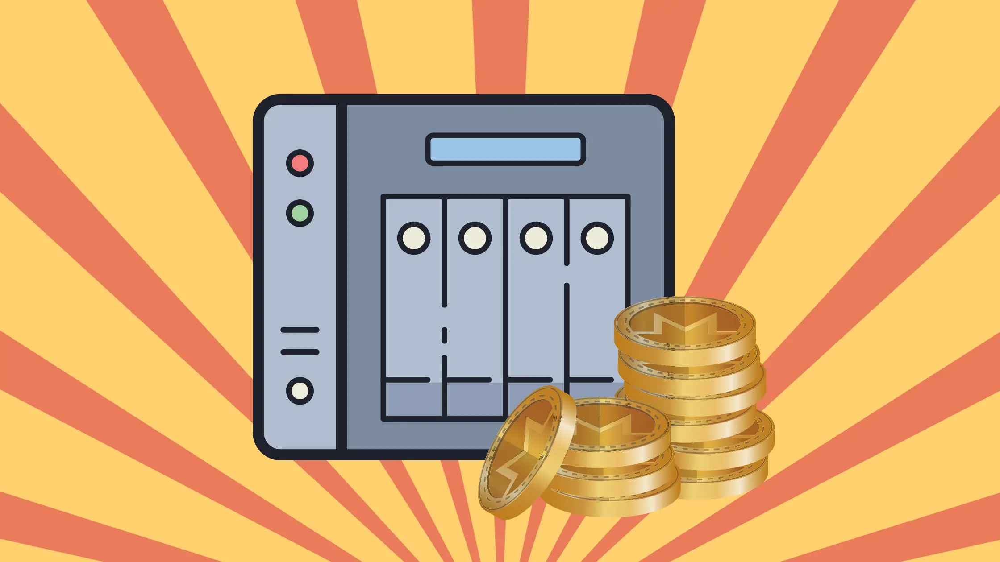
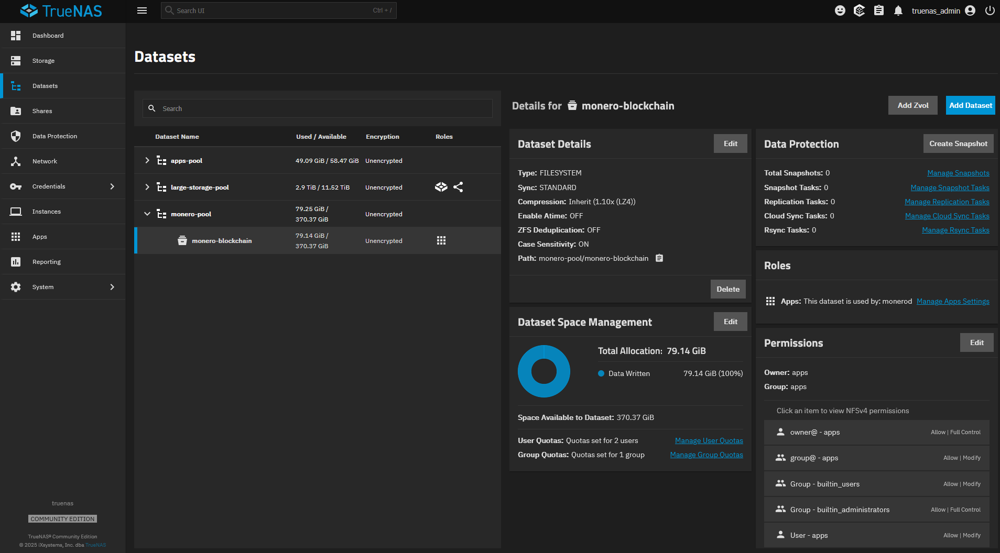
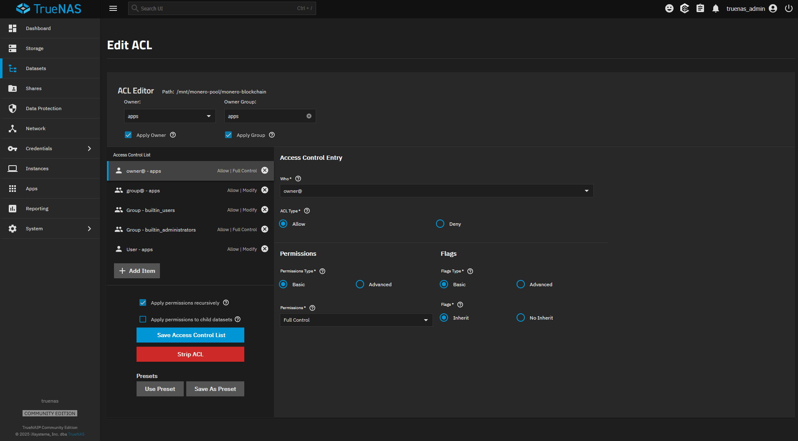
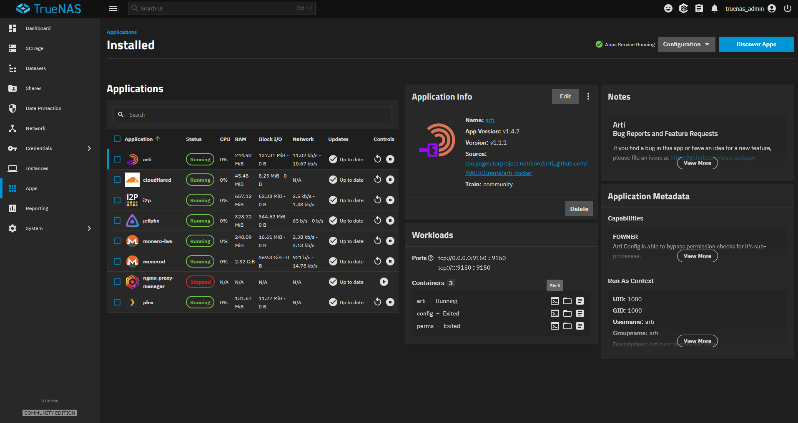
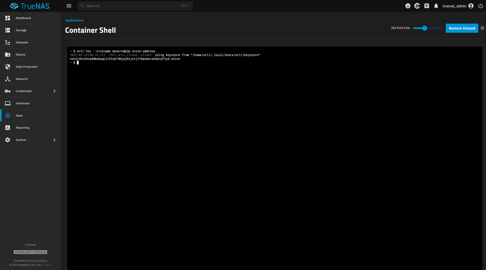
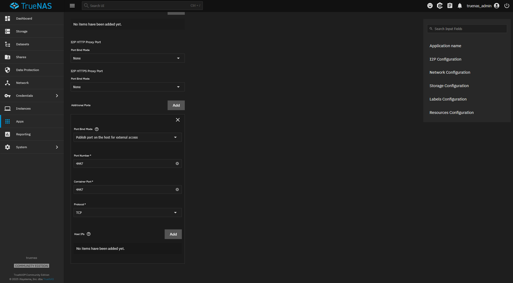
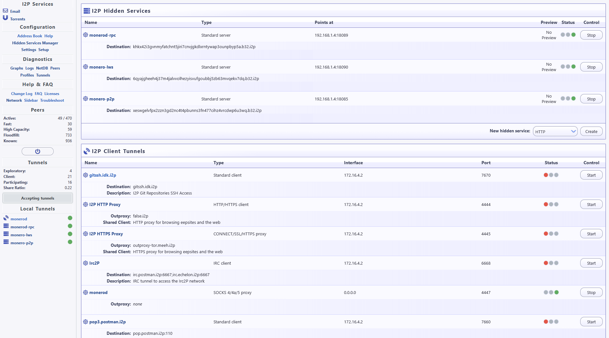
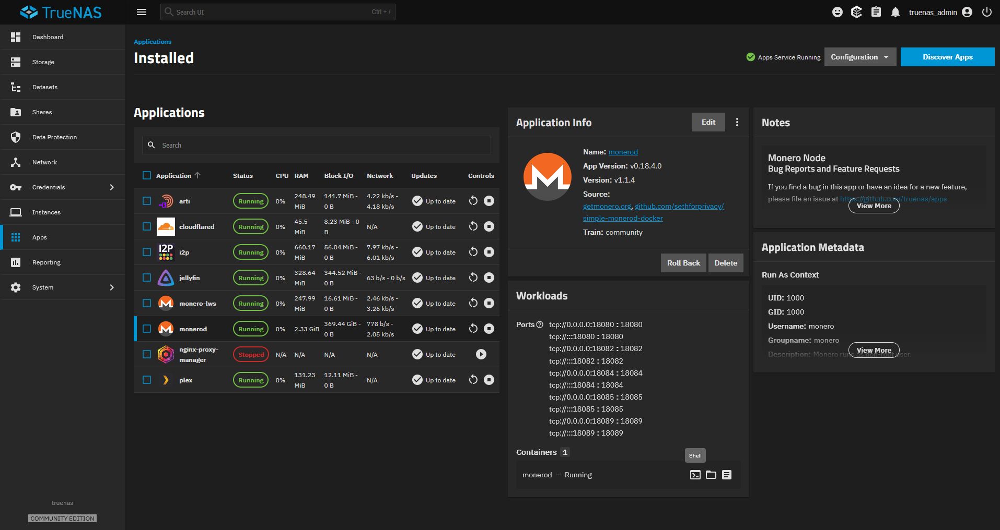
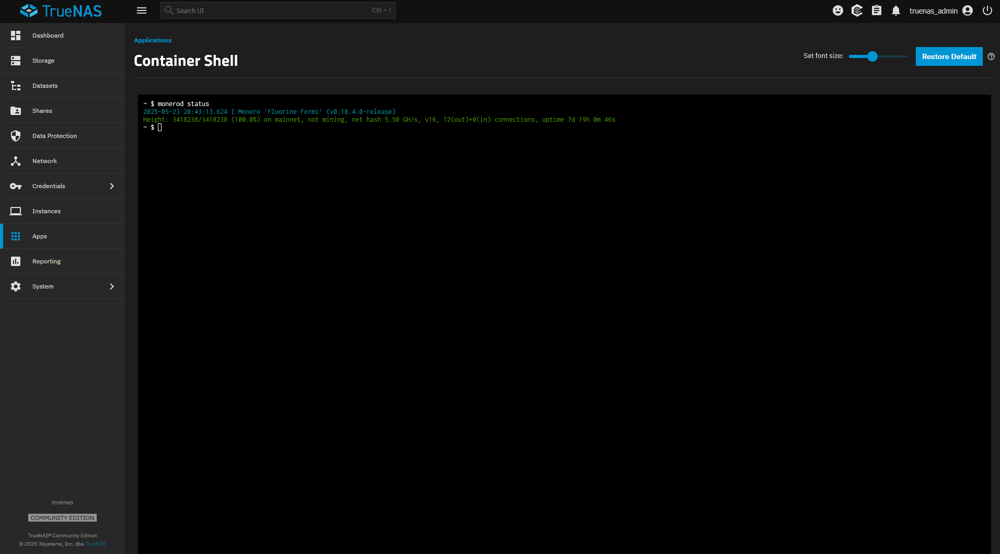
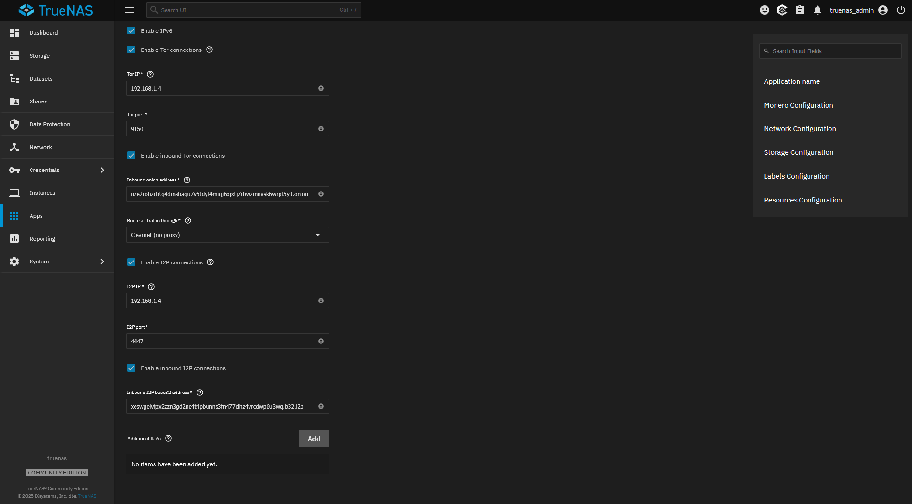

---
date:
    created: 2025-06-12T18:15:00Z
categories:
    - Tutorials
tags:
    - Self-Hosting
    - Cryptocurrency
    - TrueNAS
authors:
    - justin
description: In this guide, we will walk you through setting up a very powerful Monero server on TrueNAS.
schema_type: AnalysisNewsArticle
preview:
  cover: blog/assets/images/monero-server-using-truenas/cover.webp
---
# Creating a Tricked-Out Monero Server with TrueNAS



<small aria-hidden="true">Illustration: Jonah Aragon / Privacy Guides</small>

In this guide, we will walk you through setting up a very powerful [Monero](https://www.privacyguides.org/en/cryptocurrency/#monero) server on TrueNAS. By completing these steps, you will be able to connect to your own self-hosted Monero node with the official Monero wallet and Cake Wallet, and you will be able to connect to your own self-hosted Monero LWS server with Edge Wallet and MyMonero.<!-- more -->

<div class="admonition note" markdown>
<p class="admonition-title">Guest Contributor</p>

Please welcome Justin Ehrenhofer as a first-time guest contributor! Justin is the president of MAGIC Grants, a nonprofit which supports public cryptocurrency infrastructure and promotes privacy, and operates as Privacy Guides' [fiscal host](privacy-guides-partners-with-magic-grants-501-c-3.md). Privacy Guides does not publish guest posts in exchange for compensation, and this tutorial was independently reviewed by our editorial team prior to publication.

</div>

This guide assumes that you are using TrueNAS for the first time. TrueNAS is an open-source operating system that is meant to function primarily as a NAS, and it supports running arbitrary Docker apps. [MAGIC Grants](https://magicgrants.org) spent the last few months making dedicated apps on the TrueNAS store to make this setup process simpler than starting from scratch.

## Advantages of Running Your Own Node

Monero is a cryptocurrency with strong privacy properties by default, and it is the only cryptocurrency currently [recommended](https://www.privacyguides.org/en/cryptocurrency/) by Privacy Guides.

Despite Monero's privacy protections, your wallet needs to communicate with the rest of the Monero network. There are two main options:

1. Connecting to someone else's node; or
2. Connecting to your own node.

By connecting to your own node, you do not need to reveal when you are using your wallet and what transactions you send to the node operator.

By following this guide, your transaction broadcasts will be protected with the Tor and/or I2P [networks](https://www.privacyguides.org/en/alternative-networks/).

In short, if you *can* run your own node, you *should* run your own node.

## Hardware/Software Recommendations

* A spare machine (e.g., an old desktop computer) with:
    * One or more SSDs with >100 GB of free space
    * 4+ CPU cores
    * 4GB+ of RAM
    * TrueNAS already installed
* A domain name (optional, for encrypted clearnet connections)

It's possible to undercut these recommendations, but please don't do that to yourself.

## What We Will Set Up

All of these applications are optional. You can set up nearly any combination of these. For example, you can skip just the I2P app if you don't plan to use I2P.

| Software | Description | Purpose |
| -------- | -------- | -------- |
| Arti | A [Tor](https://www.privacyguides.org/en/advanced/tor-overview) client written in Rust. | Connect to Tor nodes, broadcast transactions over Tor, and connect to TrueNAS apps over Tor. |
| Java I2P | The officially distributed app to connect to the [I2P network](https://www.privacyguides.org/en/alternative-networks/#i2p-the-invisible-internet-project). | Connect to I2P nodes, broadcast transactions over I2P, and connect to TrueNAS apps over I2P. |
| Monero Node | The officially distributed app for communicating with the Monero network. | The app provides the necessary information to send and receive Monero transactions. Most wallets (including the official Monero wallets and Cake Wallet) connect to Monero nodes. |
| Monero-LWS | A "**L**ight**w**eight **S**erver" that allows "lightweight" wallets to send and receive Monero transactions. | Lightweight Monero wallet apps (including Edge Wallet and MyMonero) can connect to this server so that the wallet itself does not need to scan/sync Monero history; the server handles this scanning/syncing. |

## Configure TrueNAS Storage

We will configure storage for the Monero blockchain, and we will use default storage settings for other purposes. If you are an advanced user, you can configure the storage yourself.

### Create a Monero Pool

In TrueNAS, a pool is a collection of hard drives for a specific use-case. For simplicity, we will configure the entirety of a single SSD for Monero's use.

1. Click **Storage**.
2. Click **Create Pool**.
3. Type `monero-pool` for the name. Leave encryption disabled (this will only store public blockchain data). Click **Next**.
4. Choose the layout that you will be using. We will pick **Stripe** in this guide.
5. Select the entire storage space for the SSD. Click **Next**.
6. Skip all the remaining options for metadata, log, cache, spare, and dedup. Keep clicking **Next**.
7. Finish creating the pool by clicking **Create Pool**.

### Create a Monero Dataset

A dataset is effectively a folder inside a pool. We will make one folder for the Monero blockchain data:

1. Click **Datasets**.
2. Click on the `monero-pool` pool.
3. Click **Add Dataset**.
4. Set the name to `monero-blockchain`
5. Set the dataset preset to **Apps**.
6. Click **Save**.



Next, we will assign the ownership of that folder to the `apps` user:

1. While the `monero-blockchain` dataset is selected, click **Edit** under Permissions.
2. At the top, change the **Owner** and **Owner Group** from `root` to `apps`.
3. Check the boxes for **Apply Owner** and **Apply Group**.
4. Check **Apply permissions recursively**.
5. Click **Save Access Control List**.



## Configure Arti (Tor)

<div class="admonition example" markdown>
<p class="admonition-title">Experimental software</p>

Arti is experimental software. At the time of writing, Arti should not be used for privacy-critical applications. Connecting to your own Monero node is "low risk" in most circumstances. However, if you have very sensitive requirements you should not use Arti until it has been tested further by the community. By using Arti today, you are helping to make Arti better!

</div>

1. Click **Apps**.
2. Click **Discover Apps**.
3. Search for `Arti`. Click on the **Arti** app.
4. Click **Install**. This will pull up a form.
5. Under **Hidden Services**, click **Add**. For each of the functions below that you want to support, create a new hidden service:
    1. Monero Node (for incoming P2P connections)
        1. Name: `monerodp2p`
        2. App Port: `18084`
        3. Hidden Service Port: `18084`
    2. Monero Node (for incoming RPC (wallet) connections)
        1. Name: `monerodrpc`
        2. App Port: `18089`
        3. Hidden Service Port: `18089`
    3. Monero LWS
        1. Name: `monerolws`
        2. App Port: `18090`
        3. Hidden Service Port: `18090`
6. Leave the other settings as default. Click **Install**.

You will see the Applications screen after it installs. After the Arti app shows the status as **Running**, click on the shell icon under Workloads and to the right of `arti – Running` (not `config` or `perms`).



In the shell, type the command `arti hss --nickname monerodp2p onion-address`. This will return a string that ends in `.onion`. In notepad, Excel, or another app, save the `.onion` address and the service it is associated with (`monerodp2p`). You might need to copy from the shell with ++ctrl+ins++.



Do this again for the following two commands as well:

```console
arti hss --nickname monerodrpc onion-address
arti hss --nickname monerolws onion-address
```

You should have three saved and unique `.onion` addresses.

## Configure I2P

1. Click **Apps**.
2. Click **Discover Apps**.
3. Search for `I2P`. Click on the **I2P** app.
4. Click **Install**. This will pull up a form.
5. Change the **Port Bind Mode** for **I2P HTTP Proxy Port** to `None`.
6. Change the **Port Bind Mode** for **I2P HTTPS Proxy Port** to `None`.
7. To the right of **Additional Ports**, click **Add**.
8. In the newly exposed fields, set the Port Number as `4447`.
9. In the same newly exposed fields, set the Container Port as `4447`.
10. Leave the other settings as default. Click **Install**.



You will see the Applications screen after it installs. After the Arti app shows the status as **Running**, open a browser and direct it to the I2P configuration wizard. This is available at `<hostname>:7657`, for example `192.168.1.100:7657`.

Complete the initial I2P wizard using the default settings.

### Create I2P SOCKS Proxy

1. Click **Local Tunnels**.
2. Click on the I2P HTTP Proxy.
3. Uncheck **Automatically start tunnel when router starts**.
4. Click **Save**.
5. To the right of the I2P HTTP Proxy, click **Stop**.
6. Click on the I2P HTTPS Proxy.
7. Uncheck **Automatically start tunnel when router starts**.
8. Click **Save**.
9. To the right of the I2P HTTP Proxy, click **Stop**.
10. At the bottom and to the right of **New client tunnel:**, change the type in the dropdown from `Standard` to `SOCKS 4/4a/5` and click **Create**.
    1. Set the name as `monerod`.
    2. Check **Automatically start tunnel when router starts**.
    3. Set the Access Point **Port** to `4447`.
    4. Set **Reachable by** to `0.0.0.0`.
    5. Click **Save**.

### Create I2P Hidden Services

There is an optional step below to reduce the hidden service tunnel length from the default of 3 to 1. This will substantially increase the reliability of the server at the cost of anonymity.

However, the server's connection to the I2P network for connecting to Monero wallets and the rest of the Monero network is typically not sensitive, unless you want to completely conceal that you are running a Monero node. Thus, most users will prefer the higher performance of the shorter tunnel length.

We do not recommend shortening the tunnel lengths for the I2P SOCKS Proxy (in the previous section above) on the other hand, since transaction broadcasts tend to be sensitive.

1. Under **I2P Hidden Services** and to the right of **New hidden service:**, change the type in the dropdown from `HTTP` to `Standard` and click **Create**.
    1. Set the name as `monerodp2p`.
    2. Check **Automatically start tunnel when router starts**.
    3. Set the target host as the server's hostname, for example `192.168.1.100`.
    4. Set the target port as `18085`.
    5. *Optional:* Set the Tunnel Length Option to **1 hop tunnel (low anonymity)** for better performance.
    6. Click **Save**.
2. Create another `Standard` hidden service.
    1. Set the name as `monerodrpc`.
    2. Check **Automatically start tunnel when router starts**.
    3. Set the target host as the server's hostname, for example `192.168.1.100`.
    4. Set the target port as `18089`.
    5. *Optional:* Set the Tunnel Length Option to **1 hop tunnel (low anonymity)** for better performance.
    6. Click **Save**.
3. Create another `Standard` hidden service.
    1. Set the name as `monerolws`.
    2. Check **Automatically start tunnel when router starts**.
    3. Set the target host as the server's hostname, for example `192.168.1.100`.
    4. Set the target port as `18090`.
    5. *Optional:* Set the Tunnel Length Option to **1 hop tunnel (low anonymity)** for better performance.
    6. Click **Save**.

You will see the three I2P Hidden Services that you configured. Under each, you will see a `.b32.i2p` address after **Destination:**. You will need to use the destination `.b32.i2p` addresses in later steps (just like the `.onion` addresses), so keep them handy.



## Configure Monero Node

### Initial Setup

1. Click **Apps**.
2. Click **Discover Apps**.
3. Search for `Monero Node`. Click on the **Monero Node** app.
4. Click **Install**. This will pull up a form.
5. *Optional:* Uncheck **Prune the blockchain**. This will use significantly more storage.
6. Under **Storage Configuration** and **Blockchain storage location**, change the **Type** from `ixVolume` to `Host Path`.
7. Under **Host Path**, use the folder picker to select the `monero-blockchain` dataset. This should usually be `/mnt/monero-pool/monero-blockchain`.
8. *Optional:* Under **Resources Configuration**, increase the CPU resource limits to as high of a value as possible for your system. This will help the node sync faster.
9. Leave the other settings as default. Click **Install**.

#### Why not configure Tor and I2P settings to begin with?

Some users may be sensitive to a privacy risk where your Tor and I2P addresses could be matched with your public IPV4 address while it is syncing. By waiting to configure these settings until after your node is already fully synced, we minimize this risk.

### Check on the Sync Status

It will take a day or more for most systems to fully sync the Monero blockchain from scratch.

To check the status, go to the app page and click on the `monerod` app. Under Workloads and to the right of `monerod – Running`, click on the shell icon.



Type `monerod status` and press enter.

If the status reports `Height: ####/#### (100.0%) on mainnet`, then your node is fully synced. You can proceed to the next step.



### Add Tor and I2P

After your Monero node is fully synced, click on the `monerod` app and then click **Edit**. This will bring up the same form that you configured when installing the app.

1. Check **Enable Tor connections**.
2. Set the **Tor IP** as your hostname, for example `192.168.1.100`.
3. Set the **Tor port** as `9150`.
4. Check **Enable inbound Tor connections**.
5. Set the **Inbound onion address** as the `.onion` address for `monerodp2p` that you observed earlier.
6. Check **Enable inbound I2P connections**.
7. Set the **I2P IP** as your hostname, for example `192.168.1.100`.
8. Set the **I2P Port** as `4447`.
9. Check **Enable inbound I2P connections**.
10. Set the **Inbound I2P base32 address** as the `.b32.i2p` address for `monerodp2p` that you observed earlier.
11. If you wish to enable Monero LWS, under **ZMQ RPC Port**, change the **Port Bind Mode** from `None` to `Publish port on the host for external access`.
12. If you wish to enable Monero LWS, under **ZMQ Pub Port**, change the **Port Bind Mode** from `None` to `Publish port on the host for external access`.
13. Under **Tor inbound port**, change the **Port Bind Mode** from `None` to `Publish port on the host for external access`.
14. Under **I2P inbound port**, change the **Port Bind Mode** from `None` to `Publish port on the host for external access`.
15. Click **Update**.



## Configure Monero LWS

For security reasons, the Monero LWS app only accepts requests from allowlisted Monero addresses. Requests from other users will be rejected.

1. Click **Apps**.
2. Click **Discover Apps**.
3. Search for `Monero LWS`. Click on the **Monero LWS** app.
4. Click **Install**. This will pull up a form.
5. Under **Accounts**, you can add sets of allowlisted Monero wallets that will be supported by this server. Click **Add** to add a wallet. For each wallet, include the `Address`, `View Key`, and `Restore Height`. If a restore height is not provided, it will scan the entire blockchain (which is thorough but inefficient).
6. *Optional:* Under **Resources Configuration**, increase the CPU resource limits to as high of a value as possible for your system. This will help the server scan multiple wallets faster.
7. After you have added all the wallets, click **Install**.

You can add new Monero wallets in the future by adding them to the list of accounts.

## Configure Secure Clearnet Connections

It is insecure to connect your wallet to your server over an unencrypted connection.

If you only configure your wallet to connect to your server over its I2P or Tor addresses, then you're all set. The connection is already encrypted.

There are different ways to connect to your node over an encrypted clearnet connection, each with their pros and cons:

| Method | Pros | Cons |
| --- | --- | --- |
| Tor | No additional configuration necessary. Private. Secure. Reliable. | Slow for non-LWS wallets. |
| I2P | No additional configuration necessary. Private. Secure. | Slow. Unreliable. |
| Nginx Proxy Manager | High degree of user control. Secure. Reliable. Fast. | Requires a domain. Requires configuration. |
| Cloudflare Tunnels | Secure. Reliable. Fast. Easy to set up. Extra security settings. | Requires a domain. Decrypted traffic is shared with Cloudflare. |

### Nginx Proxy Manager (Recommended)

1. Click **Apps**.
2. Click **Discover Apps**.
3. Search for `Nginx Proxy Manager`. Click on the **Nginx Proxy Manager** app.
4. Click **Install**. This will pull up a form.
5. Leave the settings as default. Click **Install**.

You will see the Applications screen after it installs. After the Nginx Proxy Manager app shows the status as **Running**, open a browser to `<hostname>:30020`, for example `192.168.1.100:30020`.

#### Configure Your Domain and Router

You will need to create A and (optionally) AAAA records with your DNS provider that point to your public IPV4 and IPV6 IP addresses, respectively. You will then need to forward the ports in your router to your TrueNAS hostname. These steps are out of scope for this guide.

#### Add Proxy Hosts to Nginx Proxy Manager

From the Nginx Proxy Manager browser interface, click **Hosts**, **Proxy Hosts**, then **Add Proxy Host**. We recommend creating proxy hosts as follows:

| Domain Name | Scheme | Forward Hostname / IP | Forward Port |
| --- | --- | --- | --- |
| `monerod-rpc.<domain>` | `http` | `<hostname>` | `18089` |
| `monero-lws.<domain>` | `http` | `<hostname>` | `18090` |

For each entry, enable **Block common exploits**.  Configure the SSL settings with **Request a new SSL Certificate**, **Force SSL** enabled, and **HTTP/2 Support** enabled.

Optionally assign an access list.

You should now be able to access these services using your domain!

## A Note About Clearnet Networking

Making clearnet connections without encryption (without SSL/TLS) is insecure. This guide uses the Nginx Proxy Manager app to configure these secure connections, but you can alternatively use another approach such as Cloudflare Tunnels, Tailscale, or WireGuard.

## What About Bitcoin?

Bitcoin is not recommended by Privacy Guides due to its very weak privacy properties by default. Nevertheless, MAGIC Grants has made several Bitcoin oriented applications in the TrueNAS store that you may benefit from if you need to use Bitcoin.

## Test Connections

We will test connections to our node over Tor using [Cake Wallet](https://cakewallet.com), [Edge Wallet](https://edge.app), and [Orbot](https://orbot.app). Make sure you have these apps installed and already have Monero wallets set up.

Use **Full Device VPN** mode with Orbot for this guide.

### Test with Cake Wallet

Cake Wallet will connect to your Monero node. Follow [these steps](https://docs.cakewallet.com/features/advanced/tor-with-orbot/#switch-back-to-cake-wallet) to change the Monero node that Cake Wallet uses. Provide your `monerodrpc` onion address for the Monero Node app as the node address, `18089` as the port, no username, no password, and **Use SSL** unchecked.

You should see a green dot next to this newly added node, and you should notice that your wallet is able to sync. Syncing performance to a Monero node over Tor is slow.

### Test with Edge Wallet

Edge Wallet will connect to your Monero-LWS server. In Edge Wallet, click on the upper right hamburger menu, then **Settings**, then **Asset Settings**, then **Monero**. Select **Custom Light Wallet Server** and provide your `monerolws` onion address with the port. For example, `http://monerolws.onion:18090`, replacing `monerolws.onion` with your correct onion address.

Back in the main wallet overview, you should see that your Monero wallet is fully synced.
