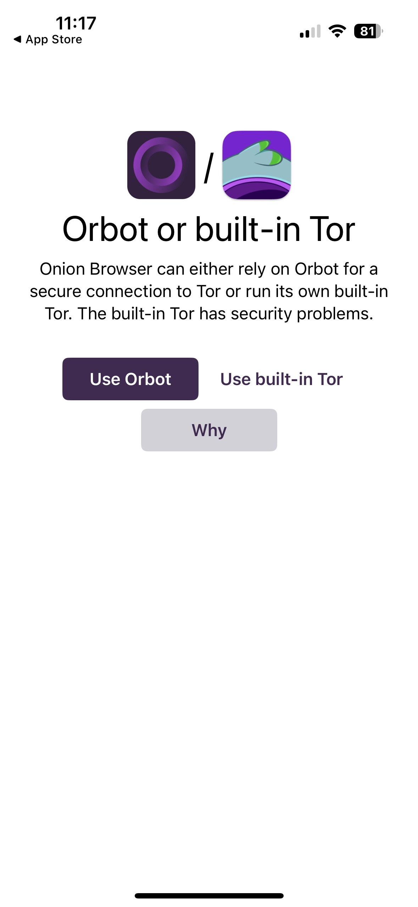
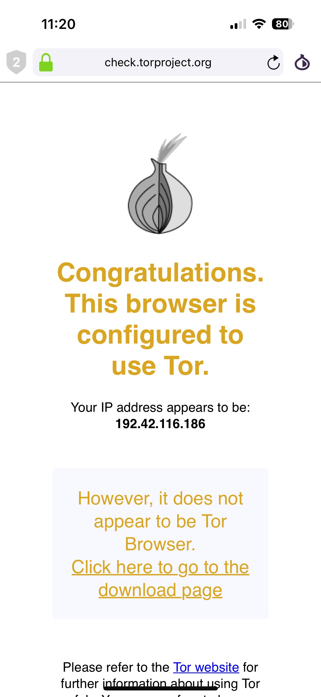
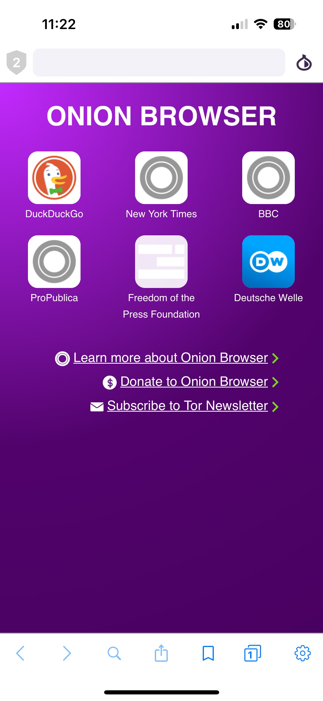
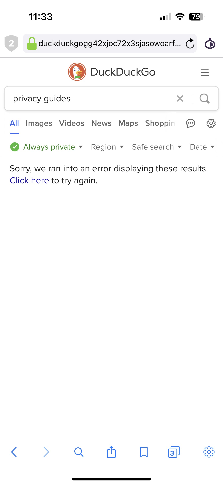
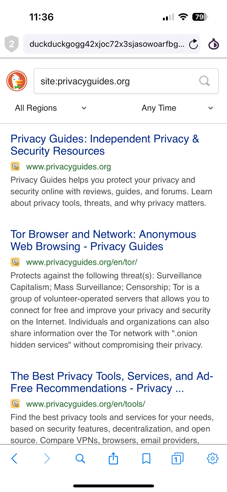
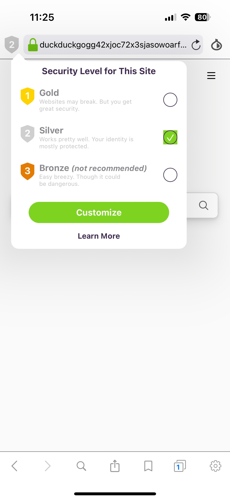

{ align=right }

Search the App Store for "Tor Browser" and you'll be flooded with a variety of ways to connect to the Tor network from your iPhone. However, there's only one solution officially [endorsed](https://support.torproject.org/tormobile/tormobile-3/) by the Tor Project themselves: **Onion Browser**.<!-- more -->

[:octicons-home-16: Homepage](https://onionbrowser.com){ .md-button }
[:octicons-eye-16:](https://onionbrowser.com/privacy-policy){ .card-link title="Privacy Policy" }
[:octicons-info-16:](https://onionbrowser.com/faqs){ .card-link title=Documentation}
[:octicons-code-16:](https://github.com/OnionBrowser/OnionBrowser){ .card-link title="Source Code" }
[:octicons-heart-16:](https://onionbrowser.com/donate){ .card-link title=Contribute }

Onion Browser is an open-source app created by Mike Tigas, who has worked closely with Tor Project in the past and was previously an investigative journalist at ProPublica (he is currently an advisor at the FTC). His company still maintains the app, although lately it is primarily [developed](https://github.com/OnionBrowser/OnionBrowser/graphs/contributors) by other maintainers.

!!! info inline end "Side info"

    - [:simple-appstore: App Store download](https://apps.apple.com/app/id519296448)

We already recommend Onion Browser for any iOS users out there, with the important caveat that it doesn't have all the privacy features that Tor Browser on *other* operating systems would provide.

## Usage

Of course installing Onion Browser is as easy as any other app on iOS, Apple ID unfortunately required. Onion Browser can be set as your default browser in system settings too, which is nice.

When you open Onion Browser for the first time you're given the option to connect to Tor via [Orbot](https://www.privacyguides.org/en/tor/#orbot), or with a built-in Tor network proxy. Using the built-in option is the easiest, it connects very quickly and doesn't require a separate app. It also allows you to [use Tor alongside another VPN app](https://www.privacyguides.org/en/advanced/tor-overview/#safely-connecting-to-tor), which may be helpful in certain circumstances. The Orbot app acts as its own "VPN connection" in iOS preventing the possibility of combining it with another VPN, but it is more flexible and it extends Tor network protections to every app on your device.

<figure markdown="span">
  { width="200" }
  <figcaption>You're presented with a choice at startup</figcaption>
</figure>

Using the dedicated Orbot app also provides more robust protections against IP address leaks. Onion Browser warns in its comparison that using the built-in option could leak your IP or network information to malicious JavaScript code.

I confirmed the built-in option works perfectly fine, in fact I occasionally had trouble connecting Orbot to Onion Browser, where it would re-prompt me to start Orbot even though it was already running until I restarted the Onion Browser app. The built-in proxy generally worked seamlessly. However, for most people using Onion Browser alongside Orbot probably still makes more sense. It's the official recommendation from Tor Project and the browser's developer themselves, so that's what I'll be sticking with for the rest of this review.

<figure markdown="span">
  { width="200" }
  <figcaption>You can check your connection at check.torproject.org, but you'll be warned you're not using Tor Browser</figcaption>
</figure>

Onion Browser comes with 6 `.onion` bookmarks preinstalled: DuckDuckGo, the New York Times, the BBC, ProPublica, Freedom of the Press Foundation, and Deutsche Welle, which provides you with a good entry point into Tor network resources.

<figure markdown="span">
  { width="200" }
  <figcaption>You can get started right away with built-in resources</figcaption>
</figure>

DuckDuckGo via its `.onion` address is also the default search engine. Unlike Safari, search engines in Onion Browser are completely configurable. Included by default are a few different DuckDuckGo configurations, Google, and Startpage, but you can add your own [search engine](https://www.privacyguides.org/en/search-engines/) easily if you prefer another option.

I ran into trouble with DuckDuckGo not being able to display results, however. Switching to the **DuckDuckGo HTML** search engine in settings helped, and I prefer that more lightweight version myself anyway. I'm curious whether this is a common issue or a momentary glitch with DuckDuckGo, but neither switching circuits nor reducing security levels fixed it. Speaking of...

<figure markdown="span">
  <div markdown="span" style="display: flex; gap: 1em; justify-content: center;">
    { width="200" }
    { width="200" }
  </div>
  <figcaption>DuckDuckGo wouldn't work until I used their HTML-only version</figcaption>
</figure>

### Security Levels

There are three configurable security levels in Onion Browser: Bronze, Silver (the default), and Gold. These levels roughly correlate to the *Safe, Safer, Safest* [security levels](https://tb-manual.torproject.org/security-settings/) in regular Tor Browser.

<figure markdown="span">
  { width="200" }
  <figcaption>You can toggle security levels on a per-site basis with two taps</figcaption>
</figure>

I had no issues browsing the web in the standard Silver level, which felt similar to just using Safari. Even websites which rely a bit more on JavaScript like our own [forum](https://discuss.privacyguides.net/) were unaffected, so this seems to be a sane default for most people.

The security level toggle next to the address bar is a bit dangerous, in my opinion. It changes the security level on a per-site basis, which can lead to inconsistent settings. I ran into this when I set the security level to Gold on privacyguides.**org**, then I navigated to our forum (hosted on privacyguides.**net**) and found the security level reset itself to Silver. Changing the security level for all sites requires going into the app's settings and changing the default security, which is something to keep in mind if you don't trust the sites you're visiting.

That being said, I also found that even the default security level setting didn't apply itself consistently after changing it. When I set the default security to Gold and opened DuckDuckGo, it opened at the lower Silver security level. I believe this is because I had manually set DuckDuckGo to Silver using the per-site toggle earlier, but changing the default setting *really* should reset those preferences.

The Gold browsing experience definitely broke more websites. Our forum didn't load at all, despite theoretically having a non-JavaScript version available. Other pages had broken elements: I loaded the Freedom of the Press Foundation's homepage fine, but I wasn't able to open the mobile navigation menu with the button in their header without switching back to Silver.

Something to note is that even the Gold level protections don't go nearly as far as Safest protections in Tor Browser. For example, the Safest setting on desktop Tor Browser will block resources like external fonts, which are not blocked on any level by Onion Browser. Onion Browser is meant to be a censorship circumvention tool, but it is not ready to defend your anonymity against any more dedicated adversaries.

### Other Settings

Onion Browser comes with reasonable defaults and a fairly sparse number of customization options, but there's some you'll probably want to change if you're using this every day.

The **Tab Security** setting defaults to *Forget in Background*, which I found closes your tabs even if you simply check your notifications. It's certainly good that it errs on the side of caution and closes your tabs when you do literally *anything* outside the app, but I think most people will probably prefer this set to *Forget at Shutdown* where the data is only wiped when the app is actually closed. If you're really not concerned about local data storage, you can have the browser remember tabs until you close them for a more standard browser-like experience.

In the **Default Security** settings you can choose a different user agent, or leave it blank to send the default, in which case it sends Safari's default user agent for your device. You may find this useful to change how websites present themselves, but impersonating the user agent of another browser does **not** make you blend in with that browser from a fingerprinting perspective. There are many ways a website could determine what browser you are using outside your user agent, so don't rely on this setting to make you blend in with everyone else using Tor Browser on other devices.

Besides leaving it blank for the default, it comes with three built-in user agent strings you can choose from, or you can enter your own. You might find it useful to use Tor Browser for Android's, but if you have no idea what any of this means it's probably best to leave the user agent settings alone.

=== "Default (on my device)"

    ```
    Mozilla/5.0 (iPhone; CPU iPhone OS 18_1 like Mac OS X) AppleWebKit/605.1.15 (KHTML, like Gecko) Version/18.0 Mobile/15E148 Safari/605.1.15
    ```

=== "Safari Desktop"

    ```
    Mozilla/5.0 (Macintosh; Intel Mac OS X 10_15_7) AppleWebKit/605.1.15 (KHTML, like Gecko) Version/15.0 Safari/605.1.15
    ```

=== "Tor Browser Desktop"

    ```
    Mozilla/5.0 (Windows NT 10.0; rv:78.0) Gecko/20100101 Firefox/78.0
    ```

=== "Tor Browser Android"

    ```
    Mozilla/5.0 (Android 9; Mobile; rv:78.0) Gecko/20100101 Firefox/78.0
    ```

The other settings in the app are fairly self-explanatory, but I don't expect many people will need to change them.

## Drawbacks

A large part of Onion Browser's problems come down to how iOS works. Most notably the iOS requirement for third-party browsers to use the WebKit framework built in to iOS.

This requirement means that Onion Browser has completely separate development from Tor Browser on desktop and Android, so it can't easily make use of all the advanced privacy-protecting features the Tor Project team is constantly adding to their browser. Technically it does also mean Onion Browser has historically been immune to [Firefox-related vulnerabilities](https://blog.mozilla.org/security/2016/11/30/fixing-an-svg-animation-vulnerability/), but Safari is not known for its perfect security record either, and the number of eyes on Tor-related *WebKit* vulnerabilities is certainly far smaller than on *Firefox/Gecko*-related ones.

The Tor Project [notes](https://blog.torproject.org/tor-heart-onion-browser-and-more-ios-tor/) another drawback to Onion Browser's use of WebKit as well: The WebKit APIs simply don't give browser developers the level of control they're used to over the rendering and execution of web pages. This relates to what we saw earlier with the "Gold" protection levels not quite matching what you'd see in Tor Browser on other platforms.

The EU recently required Apple to let third-party browser developers use their own engines instead of WebKit. It's possible that—likely many years from now—a version of Onion Browser or Tor Browser could come to iOS alongside Tor's stricter protections found in their standard browsers. Even still, the mobile version of Tor Browser on Android which *does* use Firefox's mobile engine is leagues behind desktop Tor Browser in terms of privacy and security. It's safe to say that desktop Tor Browser is going to be the best way to access Tor for quite some time.

## Lockdown Mode

There is one more way to improve Onion Browser security, but we have to look outside the browser to find it. [Lockdown Mode](macos-ventura-privacy-security-updates.md#lockdown-mode) is a feature introduced in iOS 16 that reduces the attack surface of your device by disabling a myriad of features, including web browsing features that could potentially impact security.

Because Onion Browser is built on Apple's WebKit, these security improvements extend to Onion Browser as well. Most notably, external web fonts *are* blocked in Onion Browser with Lockdown Mode enabled, just as they are in Safari. These are disabled in desktop Tor Browser's Safest mode due to both privacy concerns, and security concerns related to the font rendering engine on your device, so having the option to disable them here on iOS is very useful for those looking to maximize their security.

<figure markdown="span">
  { width="200" }
  <figcaption>External fonts and JavaScript disabled with Gold + Lockdown Mode</figcaption>
</figure>

However, enabling Lockdown Mode *is* detectable by websites, meaning it could potentially be used to fingerprint you. Onion Browser in any form does not really provide the same fingerprinting protections that desktop Tor Browser is able to, so this probably shouldn't stop you from using Lockdown Mode, but it is something to keep in mind.

## Conclusion

The decision to use Onion Browser will ultimately come down to your specific requirements. If you simply need a web browser that connects to [Tor hidden services](https://www.privacyguides.org/en/advanced/tor-overview/#path-building-to-onion-services), and you're not concerned with being tracked down, this is a perfectly reasonable choice on iOS.

It's also a good way to promote and normalize the use of Tor in general. My browsing experience using Onion Browser, while still a bit slower than regular browsing, was perfectly acceptable for reading the news, searching the web, and other everyday browsing tasks most of us do on our phone. The more people that use Tor for their everyday traffic, the safer the overall network becomes for people who really need it.

Just don't expect the same level of protection that desktop Tor Browser can provide. If you're concerned about serious adversaries targeting you, the safest way to use Tor is still to use it via [Whonix+Qubes](https://www.privacyguides.org/en/desktop/#whonix).
