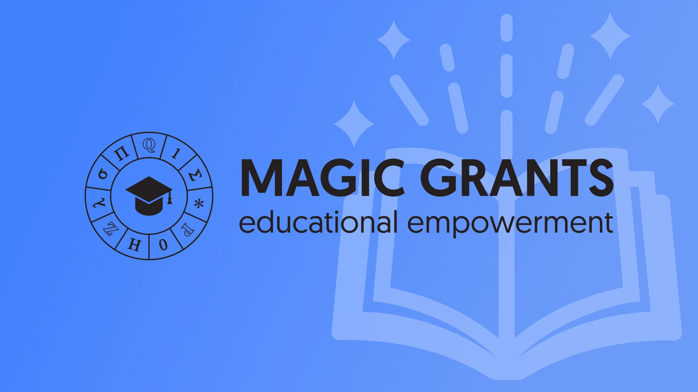

---
date:
    created: 2024-07-22
categories:
    - Announcements
authors:
    - jonah
description: We're excited to announce a partnership with MAGIC Grants, a Public 501(c)(3) charity with the mission of supporting privacy projects like ours and providing undergraduate scholarships for students interested in cryptocurrencies and privacy.
schema_type: BackgroundNewsArticle
---
# Privacy Guides Partners With MAGIC Grants 501(c)(3)

In February, the OpenCollective Foundation (OCF)—[our fiscal host of 4 years](https://blog.privacyguides.org/2019/10/31/weve-joined-the-open-collective-foundation/)—sent us an email to [announce](https://docs.opencollective.foundation/) that they would be shutting down, and they would no longer be able to collect donations on our behalf (or for any of the hundreds of projects they provided fiscal hosting services to). We immediately began to consider multiple options for the future of this project, including forming our own non-profit or finding another [fiscal host](https://en.wikipedia.org/wiki/Fiscal_sponsorship).<!-- more -->

We're excited to announce a [partnership](https://magicgrants.org/2024/07/22/Privacy-Guides-Fund) with MAGIC Grants, a Public 501(c)(3) charity with the mission of supporting privacy projects like ours and providing undergraduate scholarships for students interested in cryptocurrencies and privacy. They will immediately take over all of the operations previously provided by OCF, including accepting donations on our behalf, handling any of our accounting and taxes, reimbursing team members and volunteers, and taking legal ownership of assets like our domains and servers.

This last point is important, because we want to ensure Privacy Guides is never fully reliant on a single individual like myself. This setup ensures Privacy Guides never strays from its mission of providing free and accessible privacy and security resources to protect consumers.

Of course, all of our projects including the [open-source](https://github.com/privacyguides/privacyguides.org) Privacy Guides website, our communities, and this blog remain editorially independent and volunteer led. This partnership only affects our administrative platform behind the scenes.

MAGIC Grants was the right choice for our project for a number of reasons:

1. They are a 501(c)(3) non-profit, which allows us to retain our tax deductible status in the United States, and means there are legal safeguards in place to prevent Privacy Guides from being used for personal profit.
2. They've provided us with a great deal of flexibility and independence over how we run our project, and added many safeguards to ensure the current Privacy Guides team retains ultimate control over the project. This means that nothing about Privacy Guides will change, now or in the future, due to outside influence.
3. They've generously offered to provide their services to us for no fee, in support of our shared core mission of creating great educational materials.

Finally, unlike OCF, MAGIC Grants is extremely flexible when it comes to accepting cryptocurrencies. Previously we have not been able to accept cryptocurrency donations, because OCF did not have the accounting tools in place to handle such transactions. MAGIC Grants is highly experienced in the cryptocurrency—and especially [Monero](https://www.privacyguides.org/en/cryptocurrency/)—space, and we will be able to accept completely private donations through that very soon.

Donations to Privacy Guides are considered restricted contributions which may only be used under the [Privacy Guides Fund agreement](https://magicgrants.org/funds/privacy_guides/) we have with MAGIC Grants, and not for any of MAGIC Grants’ other endeavors. You can make a general donation to MAGIC Grants on their [website](https://magicgrants.org/contribute/).

---

We considered forming our own organization, but estimated that the initial costs to do so would meet or exceed our current annual budget, which wasn't financially viable. We have reserved the right to spin off as an independent non-profit, or to transfer to another fiscal host in the future, if we feel it would be beneficial to do so.

Running this network of websites and services for free to the public is a time-consuming and costly endeavor. We do it because we believe it is the right thing to do, not because we are looking to make a profit. Any contributions have been either used to pay our expenses or saved in a reserve for expansion or times of need.

Your support of this project will help us keep our servers running and pay for other various expenses accrued by the team while developing this community. We do not operate Privacy Guides for personal profit, and all funds will be used to further our mission in one form or another.

If you like what we do, please consider contributing to our project at <https://www.privacyguides.org/en/about/donate/>.

---

Read more about the [Privacy Guides Fund announcement](https://magicgrants.org/2024/07/22/Privacy-Guides-Fund) on MAGIC Grants' blog.
