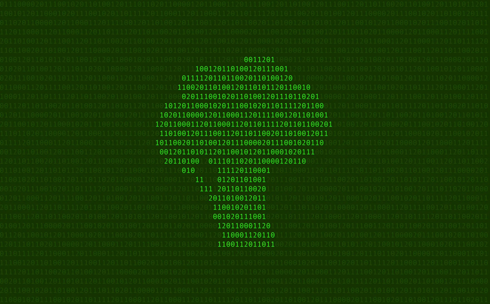

---
date:
    created: 2025-07-24T18:20:00Z
categories:
    - Opinion
authors:
    - em
description: Improving privacy can get overwhelming at first. It's important to move one step at a time, but remain persistent. Good privacy is like good health habits.
schema_type: AnalysisNewsArticle
preview:
  cover: blog/assets/images/privacy-is-like-broccoli/broccoli-cover.webp
---

# Privacy Is Like Broccoli

<small aria-hidden="true">Illustration: Em / Privacy Guides</small>

If you are just starting the journey to improve your privacy online, you might feel overwhelmed by all the information you recently learned. This is normal, don't panic!<!-- more -->

When we first start learning about how much data is collected on us, and all the things we need to do to protect it, it's very common to feel stressed and distressed.

In a state of panic, you might be tempted to try doing it all at once, driven by an urgent desire to delete yourself from the entire internet, like right now! While this feeling is very understandable, this is the wrong approach.

The right approach is to see privacy like broccoli. Yes, broccoli, you have not misread me.

## Privacy is like good health habits

Good privacy is very similar to good health habits. If you want to improve your health, and your plan for this is to take one week per year to stuff yourself with broccoli, spend 7 days in a bath, and exercise 20 hours per day that week (while in the bath eating broccoli, I presume), then for the rest of the year follow a strict diet of ice cream and chips without any exercise or hygiene, you will not in fact end up being healthier.

The best *sustainable* approach to become healthier is to adopt better practices that you can keep doing the *whole* year, at a reasonable pace.

Slowly, while you eat some broccoli with healthy meals once in a while, exercise moderately but regularly, and take care of your body in general, you will effectively improve your health over the months and years.

The same is true for data privacy.

Trying to stuff yourself with better privacy is a common and normal reaction after realizing how much of our personal data is getting exploited online. The extent to which our privacy rights are getting violated daily is understandably terrifying.

However, trying to fix it all at once can lead to the greatest danger of all: Giving up entirely.

As it is for good health habits, it's important to work on adopting good privacy habits slowly but *persistently*. These improvements need to be habits you will be able to maintain through the whole year.

For some privacy-enhancing tools, it might take more time to set it up and get used to it at first, but then take no extra time to keep using it through the year. Nevertheless, it's important to actually **keep using these tools**. If you spend money on a stationary bike, then leave it to collect dust in the garage, this isn't going to improve your health at all.

## What you can do concretely

There is so much you can do to improve your privacy online, but here's the good news: You should start with the *easiest*.

Here are a few things you can start doing to improve your data privacy. Start with the **easiest for you.** Complete goals **one at a time**. Once you are comfortable with one improvement, **then pick another one**.

Don't forget to keep using these tools and practices through the whole year, not just for one stuffing-broccoli week. The key here is persistence.

### Tools and services you can start using

Start with the improvements that are easier for you, and with the recommendations that are realistically applicable to your unique situation. Only you can determine what are the tools that work best for yourself. Don't do it all at once! Pace yourself, but stay persistent.

- [x] [**Browser**: Start using privacy-respectful browsers](https://www.privacyguides.org/en/desktop-browsers/)

- [x] [**Internet Search**: Use a privacy-focused search engine](https://www.privacyguides.org/en/search-engines/)

- [x] [**Communication**: Use Signal for your text messages, calls, and video chats whenever possible](https://www.privacyguides.org/en/real-time-communication/#signal)

- [x] [**Social Media**: Start using better social media like Mastodon](https://www.privacyguides.org/en/social-networks/)

- [x] [**Documents**: Use CryptPad for your collaborative documents and forms](cryptpad-review.md)

- [x] [**Security**: Enable multifactor authentication for your accounts](https://www.privacyguides.org/en/multi-factor-authentication/)

- [x] [**Passwords**: Start using a secure password manager](https://www.privacyguides.org/en/passwords/)

- [x] [**Email**: Migrate to a privacy-respectful email service](https://www.privacyguides.org/en/email/)

- [x] [**Virtual Private Network**: Protect your IP address with a trustworthy VPN service](https://www.privacyguides.org/en/vpn/)

- [x] [**Cloud**: Move your data to an end-to-end encrypted cloud storage](https://www.privacyguides.org/en/cloud/)

- [x] [Continue your journey with more recommendations here!](https://www.privacyguides.org/en/tools/)

### Practices and habits to adopt progressively

- [x] [**Use pseudonymity when creating accounts:**](stay-safe-but-stay-connected.md/#pseudonymity) Favor sharing only a nickname or a first name when possible. Create accounts using email aliases, unique passwords, and a VPN connection when you can. Avoid sharing your phone number as much as possible.

- [x] [**Limit the photos you share:**](stay-safe-but-stay-connected.md/#photo-sharing) Be careful when sharing photos of yourself online. Be mindful of the information it contains, such as precise location. Examine your photos for reflections that could share more details than you intended. Keep in mind that using the same photos on different services might link these services together. Never share photos of others without their prior consent!

- [x] [**Remove metadata:**](stay-safe-but-stay-connected.md/#file-metadata) Whenever you share a photo or a file somewhere, strip the metadata from this file before sharing it.

- [x] **Minimize shared data:** When filling a form or creating an account, don't share more information than what is necessary. Even if there is a question with a field, this field might not be mandatory to fill. Only fill the mandated information to obtain the service you need.

- [x] [**Opt out of data collection, say no:**](you-can-say-no.md) Whenever possible, try opting out of unnecessary data collection. Sometimes, options to opt out aren't advertised, but you can ask if there is one. Opt out of meetings or medical visits being recorded (often done from AI transcription tools), opt out of facial scans at airports (if you legally can), reject all cookies!

- [x] **Opt out of AI features:** Each time a service or app asks for your consent to use a "smart" feature, if you don't absolutely need it, choose No. Don't use AI features if you can avoid it. Unfortunately, many if not most of these features do collect your data, in a way that often makes it impossible to delete later. Unless you have reliable guarantees this feature is privacy-respectful, it's always safer to opt out and say no.

- [x] [**Delete your unused accounts:**](https://www.privacyguides.org/en/basics/account-deletion/) Get into the habit of deleting the accounts you no longer use (and the data it contains). If required, email the service to submit an official data deletion request. You will feel lighter and lighter over time!

- [x] **Continue your journey with us:** Keep consulting our many resources to adopt even more healthy privacy practices persistently!

## Persistence is key

There are a lot of recommendations above, but don't do it all at once. Be careful not to choke on broccoli!

Take steps to bookmark this information for later, and go through it slowly at a pace that doesn't overwhelm you. **Always take the easiest next step.**

Maybe keep a to-do list, use a privacy-respectful calendar app, or even a bingo card (gamified privacy!) for your privacy improvement goals for the year. Make it easy, and make it fun!

Perhaps joining a group of like-minded people may also help you to stay motivated. There's a truly wonderful community on our [Privacy Guides Forum](https://discuss.privacyguides.net/) you are welcome to join! Many people there will be able to help you if you have questions through your privacy journey. Give yourself the tools and support you need to succeed, you are not alone with this.

Your greatest enemy is yourself giving up.

Your greatest allies are the amazing variety of free privacy-preserving tools and services available to you, the numerous guides and communities out there to help you, and the friends you will make along the way.

Remember to stay healthy and persistent with your privacy! 🥦✨
