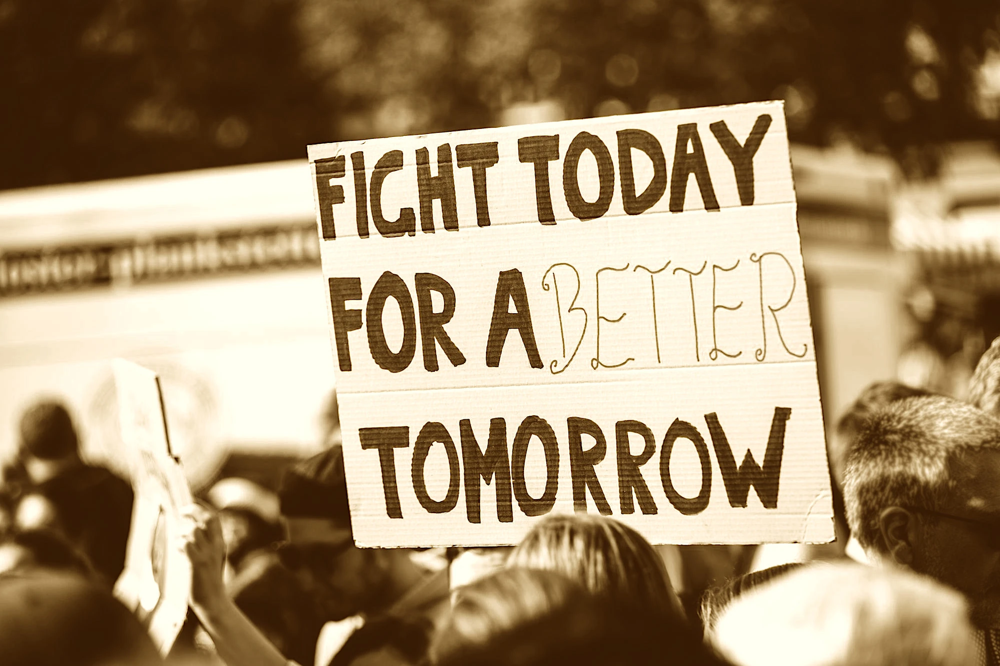

---
date:
    created: 2025-02-17T20:00:00Z
categories:
    - Opinion
authors:
    - em
description: Privacy is only dead if we let it die. Be careful about the all-or-nothing mindset in data privacy, it can do more damage than good to the cause. While striving for improvements, do not forget to cheer and celebrate each small win.
schema_type: OpinionNewsArticle
preview:
  color: "#28323F"
  text_color: "#FFD06F"
  site_logo: privacy-guides-logo-notext-darkbg.svg
---
# No, Privacy is Not Dead: Beware the All-or-Nothing Mindset

<small aria-hidden="true">Photo: Markus Spiske / Pexels</small>

In my work as a privacy advocate, I regularly encounter two types of discourse that I find very damaging to privacy as a whole. The first one is the idea that *privacy is dead*, implying it's not worth putting any effort to protect personal data anymore. This is the abdication mindset. This attitude is the one that scares me the most because without giving it a fight then of course the battle is lost in advance. **Like a self-fulfilling prophecy, privacy is dead if you let it die.**<!-- more -->

All human rights have seen advancements and improvements in history through long battles and hard-earned victories. There needs to be people willing to fight in order to win the fight. Losing a human right is easy. Protecting a human right always requires lots of effort.

The second mindset I want to bring up might seem like the diametric opposite, but in fact often leads to the same outcome overtime, and feeds the aforementioned. It's the mindset assuming that for anything to have value in data privacy it needs to be 100% perfectly private and secure.

While it's true we should strive to build better privacy-focused tools and practices every day, it's extremely important to keep an open mind and a nuanced approach in data privacy.

Now to be precise, I'm absolutely *not* talking about criticisms of false claims and snake oil. There's a lot of snake oil in data privacy and every misleading information and gimmick product should be exposed and severely condemned publicly.

What I'm talking about here is different. I'm referring to the idea that if a *good* product/tool/practice isn't perfect it isn't worth using it. This mindset is missing such an important point. The point isn't to make privacy perfect. The point here is to **reduce harm and improve privacy by small increments** at a pace that is realistically sustainable for an average person.

Here's a concrete example: Let's say your friend just told you they moved their communications from SMS to Signal. This is something to celebrate! Your friend just improved their data privacy a lot by deciding to start [using Signal instead of SMS](https://www.privacyguides.org/videos/2025/01/24/its-time-to-stop-using-sms-heres-why/). It is absolutely *not* the time to tell your friend things like "Okay, but you're not even using Firefox!" Cherish the win, encourage your friend to embrace Signal and appreciate the new protections it offers. Once your friend is comfortable with Signal, then you can slowly bring a new idea: "Hey Friend! I'm so glad we can communicate with Signal now, this is wonderful! I'd love to introduce you to this new browser now, I think you'd like it too!"

Help people move slowly but surely in the right direction, at their own pace, and with lots of positive reinforcements.

Another example of the same issue: Let's say someone posts on social media they just discovered (or recommend) this great PrivacyProduct™️ and love it! This is fantastic! This person just improved their privacy by starting to use a tool (or recommending a tool) that is *more* private than the previous one. Again, this is something to celebrate. It is absolutely *not* the time to reply something like "But this PrivacyProduct™️ logs your IP! Maybe it's end-to-end encrypted, but they log your IP! You should instead use this OtherPrivacyProduct™️ that is much less usable, has none of the features you need, and you will definitely hate it, but it's so much more private!"

When someone replies things like that, it only has the effect of discouraging people from adopting new tools that improve their privacy. **This sort of reply makes them want to stop sharing their enthusiasm about data privacy and go back to their old ways.** Even worse, this often has the effect of planting doubt in the minds of everyone else around who were also thinking about migrating from BigTechProduct™️ to the better PrivacyProduct™️. **This doubt brings inertia**, and with inertia they will just stay with BigTechProduct™️, and their privacy is now *much* worse for it.

I understand that we are all very passionate about data privacy and would love others to move so much faster to meet us here. But our impatience can sometimes create more damage to the cause. It is critical to push hard for privacy rights and practices with *governments* and *organizations*. Yes, push hard there, be relentless. Institutions only listen to the people when the people scream. But with *individuals*, when someone shares their excitement for data privacy, when someone shares their PrivacyProduct™️ recommendation that, even if imperfect, is still a great tool without misleading information, then **we should all celebrate and support this**.

Privacy isn't just about the tools we use. Privacy is a culture we need to build. Cultures come with mindsets and customs. I would love to see the privacy community thrive and celebrate together every win we get. **Tolerate imperfection and treasure improvement.** Every little step on the path to better privacy rights and better privacy practices is a win.

Celebrate and cheer loudly each little privacy win. This is how we all win.
