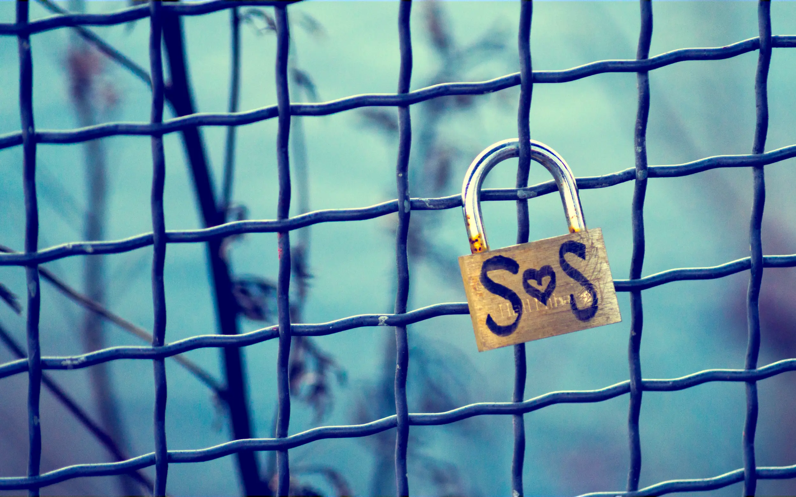

---
date:
    created: 2025-03-25T20:30:00Z
categories:
    - News
authors:
    - em
description: Privacy is a human right that should be granted to everyone, no matter the reason. That being said, it's also important to remember that for millions of people around the world, data privacy is crucial for physical safety. For people in extreme situations, privacy can literally mean life or death.
schema_type: NewsArticle
---
# Privacy Means Safety

<small aria-hidden="true">Photo: Georgy Rudakov / Unsplash</small>

Privacy is a human right that should be granted to everyone, no matter the reason. That being said, it's also important to remember that for millions of people around the world, data privacy is crucial for physical safety. For people in extreme situations, privacy can literally mean life or death.<!-- more -->

Many of us have experienced moments when our privacy concerns have been minimized or even completely dismissed.

This general hostility towards data protection is dangerous. Yes, dangerous. **Data privacy isn't a trivial matter.**

There are many circumstances where inadvertently or maliciously exposed data can put someone in grave danger. Worse, sometimes this danger might not even be known at the time, but might become incredibly important later on.

We should never downplay the serious risk of exposing someone's data, even if this isn't a situation we personally experience, or even understand.

Content Warning: This article contains mention of sexual assault, violence, and death.

## Leaked data can have grave consequences

This isn't a hypothetical situation. There has been many tragic events where people have been harmed and even killed because data about them was leaked, stolen, or otherwise revealed to someone hostile.

### Children

The data of children is something our society should be much more invested in protecting, yet most new legislation [proposed](the-future-of-privacy.md#chat-control-wants-to-break-end-to-end-encryption) or [passed](the-future-of-privacy.md#age-verification-wants-to-collect-your-sensitive-data) to supposedly protect the children are doing the complete *opposite*, endangering everyone's data, *including* the children's.

As for the data protection we already have, they are insufficient to protect most people's data, also including the children's.

In 2020, the Irish child and family agency, Tusla, was fined €75,000 for a breach of the General Data Protection Regulation (GDPR). Investigation [revealed](https://www.irishtimes.com/news/crime-and-law/tusla-becomes-first-organisation-fined-for-gdpr-rule-breach-1.4255692) three instances where data about children had been negligently disclosed to unauthorized parties.

In one case, the location and contact information of a mother and child was revealed to an alleged abuser. In another, the agency neglectfully [provided](https://www.irishtimes.com/ireland/social-affairs/2025/03/04/abusers-using-data-protection-law-to-get-details-on-victims/) the address of a child and the mother's phone number to a man accused of child sexual abuse.

Such data leaks should never be tolerated. Sadly, much stronger fines will be required to stop organizations from being so dangerously careless.

In 2018, an incredibly unfortunate 12-year-old gamer and his mother were both likely [traumatized for life](https://www.pcgamesn.com/fortnite/fortnite-stream-swatting) by a violent [swatting attack](https://en.wikipedia.org/wiki/Swatting) when the child's home address was exposed online. The outcome of this horrible attack could have ended much more tragically. The story doesn't explain how the child's address was found.

Swatting attacks have become such a [problem](#mistaken-identity) in the United States that the Federal Bureau of Investigation (FBI) recently [created](https://www.nbcnews.com/news/us-news/fbi-formed-national-database-track-prevent-swatting-rcna91722) a national database to help track and prevent such attacks.

### Victims of stalkers

Stalking victims are incredibly vulnerable to any data leak. People in such situation can often be gravely endangered by data broker services, data breaches, information they might have shared online recently or decades ago, and information shared about them by friends and family.

Unfortunately, this kind of horrifying situation isn't rare.

The danger to victims of online stalkers should never be minimized. Stalking and harassment are serious crimes that should be reported and severely punished. Overlooking these offenses is being ignorant to how quickly the consequences of such crimes can escalate.

In 2019, a 21-year-old Japanese pop star got stalked and sexually [assaulted](https://www.bbc.co.uk/news/world-asia-50000234) by a man who found her location from a picture she posted online. The photo had such high definition that the perpetrator was able to see and identify a specific train station that was visible *through a reflection in the singer's eyes*.

The aggressor also gathered information about the victim's home by examining the photos she posted from her apartment to determine the exact unit location. He then went to the train station he identified from the photo, waited for her, and followed her home.

In 2023, a podcast host and her husband were [killed](https://www.nbcnews.com/news/us-news/podcast-host-killed-stalker-deep-seated-fear-safety-records-reveal-rcna74842) by an online stalker. Despite having requested a protection order against the murderer, and despite blocking his phone number and social media accounts, after months of intense harassment online, the man eventually found the podcaster's home address, broke in, and fatally shot her and her husband.

### Victims of domestic violence

Victims of domestic violence are at an elevated risk of severe or even fatal repercussions when their data gets leaked or shared. People in this extreme situation often have to take extreme measures to protect data that could allow their abuser to find their new location.

Things as banal as exposing someone's license plate, or posting online a photo taken in a public space could literally get a person in such situation killed.

Moreover, some abusers are [weaponizing](https://www.irishtimes.com/ireland/social-affairs/2025/03/04/abusers-using-data-protection-law-to-get-details-on-victims/) subject access requests in an attempt to find the location of the victims fleeing them.

It is imperative to ensure that data access legislation cannot be misused in such a dangerous way. Data legally shared with a subject should never lead to the harm of someone else.

In another instance, a woman who was raped by a former partner was unable to safely receive counseling care because the notes from her counseling sessions could have been [shared](https://www.irishtimes.com/crime-law/courts/2025/01/17/calls-for-law-to-be-changed-to-end-access-to-rape-victims-counselling-notes/) in court with the perpetrator.

Data privacy regulations should protect such sensitive data from being shared without explicit and free consent from the patient.

### Healthcare seekers

People seeking essential healthcare in adverse jurisdictions can be prosecuted when their private communications or locations are intercepted.

In 2023, a mother from Nebraska (US) was arrested and criminally [charged](https://www.theverge.com/2023/7/11/23790923/facebook-meta-woman-daughter-guilty-abortion-nebraska-messenger-encryption-privacy) after she helped her 17-year-old daughter get an abortion.

The woman was arrested partly based on the Facebook messages she exchanged with her daughter discussing medication for the abortion. Police obtained a copy of the private Facebook conversation by serving a warrant to Meta, which the company quickly complied with.

### Whistleblowers and activists

Whistleblowers and activists are at especially high risk of harm, particularly if they have publicly opposed or exposed oppressive regimes or criminal groups.

Governments around the world, especially more authoritarian ones, have been increasingly [monitoring social media](https://privacyinternational.org/long-read/5337/social-media-monitoring-uk-invisible-surveillance-tool-increasingly-deployed) to track, identify, and persecute critics, activists, and journalists.

Authorities have also been mandating direct collaboration from service providers to arrest activists. In 2021, a French climate activist was [arrested](https://techcrunch.com/2021/09/06/protonmail-logged-ip-address-of-french-activist-after-order-by-swiss-authorities/) after Proton Mail was legally [compelled](https://proton.me/blog/climate-activist-arrest) by Swiss laws to log and share the activist's IP address with authorities.

In 2017, a 25-year-old working for the American National Security Agency (NSA) as a contractor was arrested after she was [identified](https://arstechnica.com/information-technology/2017/06/how-a-few-yellow-dots-burned-the-intercepts-nsa-leaker/) as the whistleblower who leaked a report about Russian electoral interference in the United States.

The whistleblower had mailed the classified document to The Intercept anonymously. However, when the news organization tried to confirm the authenticity of the document with the NSA, the agency was able to determine which printer was used to print this copy, and from there deanonymized [Reality Winner](https://en.wikipedia.org/wiki/Reality_Winner). The technique used to track the document was the reading of almost invisible [printer tracking dots](https://en.wikipedia.org/wiki/Printer_tracking_dots) that many laser printers and photocopiers produce on all printed documents.

This year on March 7th, community activist and whistleblower Pamela Mabini was [shot and killed](https://www.hrw.org/news/2025/03/11/activist-and-whistleblower-killed-south-africa) just outside her home in South Africa. She was an activist working with the [Maro Foundation](https://www.dailydispatch.co.za/local-heroes/2023-07-10-helping-others-is-the-reason-for-pamela-mabinis-smile/), a nonprofit organization dedicated to fighting poverty and gender-based violence.

Mabini's murder has sparked a debate on the importance of protections offered to whistleblowers [exposing criminals](https://www.citizen.co.za/news/another-high-profile-whistleblower-gunned-down-how-safe-speak-out/) to justice. Following the activist's death, organizations have been calling to fast-track the [Whistleblower Protection Bill](https://www.iol.co.za/news/south-africa/calls-for-government-to-fast-track-protection-bill-following-activists-murder-3e8adc20-be58-4f3d-9a55-4a5818171c92) to bring more protections to those fighting for justice in South Africa.

### Trans and queer activists

Trans and queer activists are at elevated risk of harassment online in today's political climate. In 2022, 28-year-old trans activist Clara Sorrenti was victim of a swatting attack after police believed a fake report about violent threats made by her aggressor.

She was arrested at gunpoint by the police, handcuffed, had her electronic devices seized, and her apartment searched for eight hours for non-existent evidence. The aggressor who made the false threats had [provided](https://www.cbc.ca/news/canada/london/trans-twitch-star-arrested-at-gunpoint-fears-for-life-after-someone-sent-police-to-her-london-ont-home-1.6546015) her name and home address to police.

### Journalists

Journalists around the world can become vulnerable to attacks even from governments when they report on oppressive regimes. This kind of situation can be extremely dangerous, considering the almost unlimited resources state-backed attackers can have to identify, track, and persecute their victims.

In 2018, the prominent journalist and critic of Saudi Arabia's government Jamal Khashoggi was [murdered](https://www.bbc.co.uk/news/world-europe-45812399). Despite being based in the United States, the journalist traveled to Istanbul's Saudi consulate in Turkey to pick up official documents. Khashoggi was killed inside the consulate a few days later on October 2nd.

Investigations revealed that people close to Khashoggi had their devices infected by NSO's [Pegasus spyware](https://freedom.press/digisec/blog/journalists-targeted-with-pegasus-yet-again/). This likely allowed the attacker to gather information about Khashoggi traveling outside the United States.

Many other journalists, politicians, and human rights activists have been [targeted](https://www.bbc.co.uk/news/world-57891506) by state-backed spyware such as Pegasus.

In 2022, Human Rights Watch [reported](https://www.hrw.org/news/2022/12/05/iran-state-backed-hacking-activists-journalists-politicians) that two of their staff members and at least 18 other activists, researchers, or journalists working on Middle East issues had been targeted by a phishing campaign coming from a group affiliated with the Iranian government. The entity succeeded in stealing emails and other sensitive data from at least three human rights defenders.

### Targeted harassment

Another danger of leaked data that shouldn't be minimized is targeted harassment. Targeted harassment can have devastating consequences ranging from silencing their victims, to suicide, to death by swatting attack.

A well-known example of targeted harassment is Gamergate. Gamergate was a loosely organized [harassment campaign](https://en.wikipedia.org/wiki/Gamergate_(harassment_campaign)) targeting women in the video game industry. It started in 2014 when Zoë Quinn's ex-partner published a blog post with false insinuation about Quinn, a video game developer.

Quinn was subsequently subjected to an incredibly intrusive [doxxing](https://en.wikipedia.org/wiki/Doxing) campaign, and even received rape threats and death threats. Attackers were able to steal an insecure password and [break into](https://time.com/4927076/zoe-quinn-gamergate-doxxing-crash-override-excerpt/) one of Quinn's account, which resulted in horrible consequences. The harassment campaign later expanded to target others who had defended Quinn online.

In another case, targeted harassment resulted in one death and a five years prison sentence. In 2020, Mark Herring started receiving requests asking him to give up his Twitter handle, which he refused. Herring's "crime" was to have been quick enough to secure the handle "@Tennessee" shortly after Twitter came online.

Over weeks, harassment escalated from sustained text messaging to random food delivery to his house. After Herring's harasser posted his home address in [a Discord chat room used by criminals](https://krebsonsecurity.com/2021/07/serial-swatter-who-caused-death-gets-five-years-in-prison/), someone used this data to direct a swatting attack at Herring's place. Police surrounded his home and demanded he crawl under a back fence, despite his health. After crawling under the fence, 60-year-old Mark Herring stoop up then collapsed from a heart attack, and died soon after.

### Mistaken identity

What is more, everyone can get victimized by exposed data, even people who are not online and even people who are not a whistleblower, a journalist, an activist, a victim of domestic violence, or someone who has committed the "unthinkable crime" of securing a cool Twitter handle.

In 2017, 28-year-old Andrew Finch was [shot and killed](https://edition.cnn.com/2019/09/14/us/swatting-sentence-casey-viner/index.html) by police during a swatting attack in the United States.

The attack was conducted after the perpetrator had an argument online over a multiplayer first-person shooter game. The perpetrator, who was later sentenced, threatened another player he was upset with to "swat" him. The perpetrator then enlisted another man to call the police and conduct the attack on the player, with the home address the player provided. This address turned out to be the previous address of the player, which was now Andrew Finch's address.

When police arrived at Andrew Finch's home and surrounded the place, Finch, completely unaware of what was happening, barely had the time to comply and get outside when the police shot and killed him at the front door.

The man who conducted the swatting attack for the perpetrator got [sentenced](https://en.wikipedia.org/wiki/2017_Wichita_swatting) to 20 years in federal prison.

In 2021, an Australian 15-year-old girl was [mistakenly targeted](https://www.abc.net.au/news/2021-03-26/canberra-family-doxxed-sent-death-threats-after-social-video/100014706) and later doxxed with her real information after she had been wrongly identified online as someone who had participated in a racist social media video posted on Facebook.

A few hours after her name was shared online, the girl started to be inundated by hateful messages and unspeakable threats from all around the world. Her phone number and home address were eventually shared online. Her family received hateful messages from strangers as well.

During the ordeal, her mother had to be hospitalized for heart disease. The girl, who had absolutely nothing to do with the racist video that spawned the attacks, contemplated suicide due to the violence of the harassment. She and her mother no longer felt safe.

Digital traces of the personal data that was exposed during the attacks will likely remain online forever, even if the girl and her family were completely innocent and unrelated to what triggered the cyber-swarming.

The 26-year-old American who incorrectly identified the Australian girl and shared her name and social media accounts online later apologized for his mistake.

## How data finds its way to an aggressor

### Targeted research, attack, and spyware

For targeted attacks, aggressors will often use simple techniques to find a victim's data from what is already leaked online or openly shared on social media. For more sophisticated attacks, perpetrators might use criminal methods such as impersonation for [SIM swap attacks](https://en.wikipedia.org/wiki/SIM_swap_scam). When attackers have more resources, such as state-backed attackers, more sophisticated processes might be used, like device infection with [NSO Group's spyware](https://citizenlab.ca/tag/nso-group).

### Maliciously stolen or negligently leaked

Data can be stolen maliciously in all sort of ways, but even more often and common, data is leaked online from banal *negligence*.

Once data is leaked online, it will likely become accessible to anyone looking for it eventually. Additionally, any data breach happening now has the potential to endanger someone years down the line. Perhaps it's a home address that has not changed in years, a phone number used for a decade, a legal name, a photograph, or even a [medical file](https://krebsonsecurity.com/2024/04/man-who-mass-extorted-psychotherapy-patients-gets-six-years/).

Unfortunately, the data broker industry thrives on bundling up all this data together in neat packages to be sold to anyone looking for it, making any attacker's job much easier.

#### Unencrypted data

When the data leaked or stolen is well encrypted, the [risk is reduced](https://www.maketecheasier.com/how-secure-stolen-encrypted-data/). If the leaked data cannot be decrypted easily, this will greatly mitigate the damage done by a breach. Conversely, unencrypted leaked data will always inflict maximum damage.

This is why we should demand that all the services we use implement strong, *end-to-end* encryption wherever possible.

### Obliviously shared without consent

Sometimes, the data endangering someone isn't leaked negligently or stolen maliciously, but simply shared by a friend or a family member oblivious to the danger.

This is [a cultural problem we all need to work on](the-privacy-of-others.md).

Despite all the technological protections we can put on data, and despite all the regulations we can ask organizations to comply with, if our culture doesn't understand the danger of sharing the data of others, we will fail to protect the most vulnerable people in our society.

## Protecting data for everyone's safety is a societal, communal, and individual responsibility

Protecting data isn't simply a matter of preference, although it can absolutely be. But for so many people around the world, it is vital to understand how *crucial* data privacy is.

As explicitly demonstrated above, data protection can literally mean life or death for people in vulnerable situations. Beyond that, it is unfortunately also true for anyone unlucky enough to get mistakenly targeted when their data is shared.

In all of these situations, **data privacy means safety**.

We must demand that governments, corporations, and organizations of all kinds do better to improve data protection practices and technologies.

As a community, we also have a responsibility to protect the most vulnerable people from harm caused by data leaks.

And finally, as individuals, we share this duty of care and must all work on improving the way we protect our own data, but even more importantly, the data of everyone around us.

**Privacy means safety, for everyone.**

---

Resources in the United States & Canada

If you or someone you know is in one of the situations described above, these additional resources may help. Make sure to take [appropriate measures](https://www.privacyguides.org/en/basics/threat-modeling/) to protect your privacy if your situation is sensitive. If you are in a high risk situation, you might want to access these resources using [Tor](https://www.privacyguides.org/en/advanced/tor-overview/) or [Tails](installing-and-using-tails.md).

**Suicide & Crisis Support Line** :material-arrow-right-bold: [988 Lifeline](https://988lifeline.org/) Phone number: 988 (US & Canada)

**Trans Peer Support** :material-arrow-right-bold: [Trans Lifeline Hotline](https://translifeline.org/hotline/) Phone number US: 1-877-565-8860 / Canada: 1-877-330-6366

**Stalking Victim Support**  :material-arrow-right-bold: US: [SafeHorizon](https://www.safehorizon.org/get-help/stalking/) / Canada: [The Canadian Resource Centre for Victims of Crime](https://crcvc.ca/wp-content/uploads/2021/09/Cyberstalking-_DISCLAIMER_Revised-Aug-2022_FINAL.pdf)

**Domestic Violence Victim Support** :material-arrow-right-bold: US: [The National Domestic Violence Hotline](https://www.thehotline.org/) Phone number: 1-800-799-7233 / Canada: [Canadian resources by situation and province](https://www.canada.ca/en/public-health/services/health-promotion/stop-family-violence/services.html)

**Reproductive Rights & Healthcare** :material-arrow-right-bold: US: [Planned Parenthood](https://www.plannedparenthood.org/) / Canada: [Action Canada for Sexual Health & Rights](https://www.actioncanadashr.org/resources/services)

**Journalists and Whistleblowers** :material-arrow-right-bold: US: [Freedom or the Press Foundation Guides & Resources](https://freedom.press/digisec/guides/) / Canada: [Canadian Association of Journalists](https://caj.ca/advocacy/digital-security/)

**Protesters** :material-arrow-right-bold: [The Protesters' Guide to Smartphone Security](activists-guide-securing-your-smartphone.md)

---

**Correction (Mar. 27):** This article was updated to correct a typo in a date. The previous version wrongly described the arrest of a French climate activist happening in 2012, when these events actually happened in 2021. 
