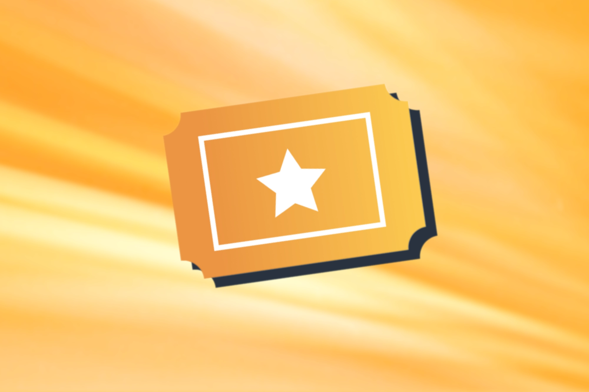
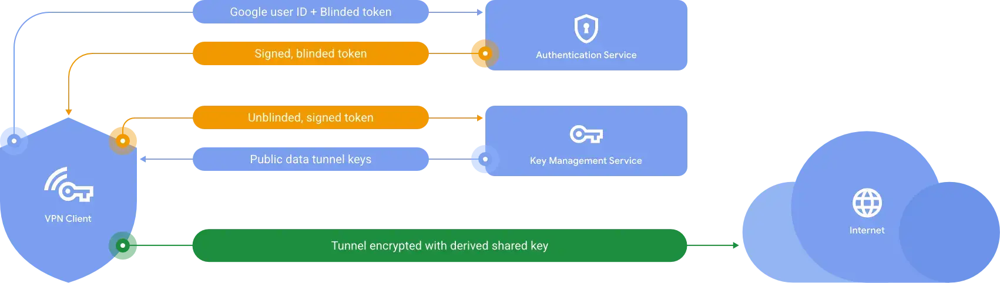

---
date:
    created: 2025-04-21T17:30:00Z
categories:
    - Explainers
authors:
    - fria
tags:
    - Privacy Pass
license: BY-SA
schema_type: BackgroundNewsArticle
description: |
  Privacy Pass is a new way to privately authenticate with a service. Let's look at how it could change the way we use services.
---
# Privacy Pass: The New Protocol for Private Authentication

<small aria-hidden="true">Background Image: Thomas Ensley / Unsplash</small>

Services that require authentication can correlate your activity on that service with your account, and that account is normally linked with payment information that could potentially link back to your real identity. With the Privacy Pass protocol, it doesn't have to be that way.<!-- more -->

## History

The story of Privacy Pass begins with a [paper](https://dl.acm.org/doi/pdf/10.1145/4372.4373) by David Chaum from 1985 (he actually has an earlier paper from [1982](https://chaum.com/wp-content/uploads/2022/02/chaum_dissertation.pdf), but I'll be referencing this one), in which he laments the ever-increasing data collection by companies and government agencies.

It's funny that all the way back in 1985 he talks about the same issues we deal with today: persistent identifiers tied to our real identity for transactions, government IDs, etc.

Chaum proposes three solutions to the state of affairs he describes.

### Pseudorandom Identifiers

Instead of persistent identifiers like we now have with our government IDs, credit cards, etc., Chaum suggests randomly generated identifiers. For example, you could have a one-time unique identifier for each transaction at a shop.

For ongoing relationships such as a bank, you can use a single pseudorandom identifier for that organization that you use continuously.

### Card Computers

One of the more quaint ideas in the paper is the idea of a small "card computer" on which you would perform transactions. Chaum's theoretical device resembles "a credit-card-sized calculator, and [includes] a character display, keyboard, and a limited distance communication capability (like that of a television remote control)".

Nowadays, we carry around credit-card sized computers like it's nothing. The secret "card number" he describes would probably be your device PIN or even biometric authentication, which are already used to authenticate transactions.

We still haven't *quite* reached Chaum's vision yet in some areas. His idea is for these "card computers" to fully replace ATMs and checkout terminals in stores. Essentially, he wants all transactions to be online transactions, with something like Apple Pay or Google Pay on your device mediating the transaction and using your device PIN to prevent fraudulent transactions.
Making all transactions online transactions is an interesting idea. I think most people can share in the frustration of dealing with checkout terminals, especially the self-checkout ones with cameras pointed at your face.

We're still falling short in a major area though.

> card computers could be purchased or constructed just like any other personal computer, and would have no secrets from or structures unmodifiable by their owners.

Current smartphones are non-upgradeable by their owners and can't be built from scratch like a desktop computer can. They also contain lots of black-box proprietary code. Even a Google Pixel, the gold standard of Android smartphone freedom that allows you to install your own operating system securely, still suffers from the same pitfalls.

### Cryptography

How do we ensure the pseudonyms can't be linked together? We already use cryptography to protect our communications. Chaum presents ways to similarly protect unlinkability using cryptography:

> Simple mathematical proofs show that, with appropriate use of the systems, even conspiracy of all organizations and tapping of all communication lines cannot yield enough information to link the pseudonyms-regardless of how clever the approach is or how much computation is expended.

## Blind Signatures

Digital signatures normally are used to ensure that something like a piece of software or a message comes from the original sender and hasn't been tampered with. You want to know who the signer is for this system to work.

But what if the signer and the one sending a request are different? Say you have a membership to a hypothetical *PrivacyGuides+ subscription service*, and you want to authenticate with it, but don't want to identify yourself. That's where blind signatures come in.

### How it Works

You can imagine blind signatures like an envelope that's been wrapped in [carbon paper](https://en.wikipedia.org/wiki/Carbon_paper) with a window showing your pseudonym for that account, whether it be an account number, username, etc. They never see anything but the account identifier, or whatever they need to verify that you're a valid customer.
The organization then signs it, indicating you're a valid customer, and you're allowed to access the service.

Later, when you're presented with a request to authenticate as an active subscriber of PrivacyGuides+, you unwrap the envelope and discard it along with the carbon paper. You rewrap it in a new envelope with a window showing the signature and a different pseudonym, and the requester can then be sure that you're allowed to access PrivacyGuides+.

<small aria-hidden="true">Illustration: [David Chaum](https://dl.acm.org/doi/pdf/10.1145/4372.4373)</small>

This system relies on the same strong cryptography that tried and true systems use, with the difference being the unlinkability between the credential issuer and the credential receiver.

## Problems

Services that don't require an account or payment to use are great; you can use them with Tor, clear your browser history, whatever you need to do to keep your activity private.

But logging into an account completely invalidates all of that. Every time you log in or authenticate with a service, you have to identify yourself as the same person, linking all your previous activity together. Increasingly, we're asked to provide personal information in order to be able to use certain websites or services.

### Linkability

As long as you're logged into an account with a service, all your previous and current activity can be linked together, along with any data you provided such as an email address, payment information, etc.

### Data Collection

A lot of websites and services want to — [or are forced to](https://en.wikipedia.org/wiki/Social_media_age_verification_laws_in_the_United_States) — filter out users below a certain age.

We're starting to see a rise in extremely privacy-invasive age verification systems such as submitting a government ID when you want to access a website or invasive facial scans.

### Blocking VPN and Tor Users

Bots are a rampant problem for online services, leading them to sometimes block non-residential IP addresses such as those used for commercial VPNs and Tor.

### CAPTCHAs

When VPN and Tor users aren't blocked, they often have to deal with annoying [CAPTCHAs](http://www.captcha.net) that take up your precious time and use invasive [fingerprinting](https://developers.google.com/recaptcha/docs/v3).

CAPTCHAs aren't even particularly good at detecting bots. With advances in AI, [bots can solve CAPTCHAs better than humans can](https://arxiv.org/pdf/2307.12108).

## Privacy Pass

Several blind signature-based solutions are in various states, some being implemented but not widely used, some being proposed browser APIs, and some being IETF standards.

The landscape is very confusing right now, so I'll try to elucidate what I've found.

[Privacy Pass](https://privacypass.github.io) started out as an attempt at a privacy-preserving way to bypass CAPTCHAs.

It started out and is still an extension that can be installed on the [Chrome](https://chromewebstore.google.com/detail/silk-privacy-pass-client/ajhmfdgkijocedmfjonnpjfojldioehi) or [Firefox](https://addons.mozilla.org/en-US/firefox/addon/privacy-pass/) extension store, but it's since expanded to become an [IETF standard](https://datatracker.ietf.org/wg/privacypass/about/).

The Privacy Pass protocol has massively outgrown its original purpose. It's been updated to support multiple different schemes and purposes.

There are three main roles that need to be played for the authentication mechanism to work. These can be filled by all the same party, by three separate parties, or any combination in between. You'll have increased privacy the more separation there is between each role, so ideally they should all be filled by different parties.

### Origin

The origin is the original website or service that's requesting a token for redemption. The client presents a valid token, or it must request more tokens.

### Attester

The attester is responsible for verifying something about the client. There are several ways it can achieve this, and it can use multiple at the same time if desired.

#### CAPTCHA

The attester can make the client solve a CAPTCHA to prove that it's not a bot. Not the most elegant solution but solving one CAPTCHA instead of multiple is preferable.

#### Client State

The attester can verify something about the client's state like the geographic location, whether the client has a valid account, or the number of issuance protocol invocations.

#### Trusted Device

If your client is running on hardware that's capable of producing device-level attestation, like a device with a secure element, then it can use that to verify that the device is trusted.

For example, in Apple's Private Access Token implementation, they use certificates stored in the Secure Enclave and verify that your Apple account is in good standing.

### Issuer

The issuer is responsible for issuing tokens in response to requests from clients.

The client presents tokens to the Origin once they're provided by the issuer.

<small aria-hidden="true">Illustration: [Cloudflare](https://blog.cloudflare.com/eliminating-captchas-on-iphones-and-macs-using-new-standard/)</small>

The tokens need to identify which issuers are trusted.

They can also be interactive or non-interactive. Interactive means that you need a fresh token based on the challenge, whereas a non-interactive token can be stored for later use.

Tokens can also be constrained to one specific Origin, or they can be used across Origins.

### Private State Tokens

[Private State Tokens](https://developers.google.com/privacy-sandbox/protections/private-state-tokens) (PSTs) are a [proposed browser API](https://github.com/WICG/trust-token-api) by Google as part of their [Privacy Sandbox](https://developers.google.com/privacy-sandbox). They're based on the Privacy Pass protocol.

The main benefit of PSTs is that they provide a secure place for websites to store their tokens so that you don't need a separate extension for every service.

A browser-level API, I imagine, would significantly reduce the development burden of browser-based services looking to implement Privacy Pass, but it would leave non-browser apps like VPNs high and dry.

### Private Access Tokens

[Private Access Tokens](https://blog.cloudflare.com/eliminating-captchas-on-iphones-and-macs-using-new-standard/) are based on Privacy Pass as well, but they don't seem to be specifically bound to the browser.

It's unclear to me what really makes Private Access Tokens different from Privacy Pass itself, other than that Private Access Tokens seem to call for separation of the Attester and Issuer while Privacy Pass allows the origin, attester, and issuer to be the same. Delegating each role to a different party adds extra privacy.

The origin website only knows your URL and IP from the initial connection.

The attester only knows the data needed to verify you as a valid user.

The issuer knows the site you visited, but doesn't know any of your device information that the attester used to verify you.

### Kagi

There are scant services actively using Privacy Pass to authenticate users, but a recent and very exciting example is [Kagi](https://blog.kagi.com/kagi-privacy-pass).

With their implementation, you can now install their extension for [Firefox](https://addons.mozilla.org/en-US/firefox/addon/kagi-privacy-pass/) and [Chrome](https://chromewebstore.google.com/detail/kagi-search/cdglnehniifkbagbbombnjghhcihifij). Safari isn't supported at the moment, but their [Orion](https://chromewebstore.google.com/detail/kagi-search/cdglnehniifkbagbbombnjghhcihifij) browser supports it and is WebKit-based.

The need for an extension and lack of support for some platforms highlights the need for widespread support for Privacy Pass in browsers and platforms. It's not reasonable to expect every single platform to implement Privacy Pass themselves and users likely don't want to install a separate extension for every platform either.

That said, I applaud Kagi for their efforts. They went above and beyond to protect their users' privacy. A few notes for future improvements, though.

#### No Account Requirement

Currently, Kagi requires an account in order to use it. Although they allow you to put in a fake email address on account creation since they don't [check it](https://kagifeedback.org/d/3813-enable-anonymous-registration-no-email/16), it's still a persistent identifier that could be eliminated.

Their announcement blog post states that the ability to use Kagi fully without an account is a possibility for the future with an invitation to request the feature on their [forum](https://kagifeedback.org/d/6163-kagi-privacy-pass), so feel free to add your voice. A fully accountless search engine that doesn't rely on ads would be great to see.

#### Separation of Origin, Attester, Issuer

Kagi uses the [Shared Origin, Attester, Issuer](https://www.ietf.org/archive/id/draft-ietf-privacypass-architecture-03.html?_fsi=jKxFixnl#section-4.1) model for their implementation, which leaves the possibility of data being correlated between each step of the process, such as device fingerprinting or IP address being used to correlate a user who is issued tokens with when they redeem them.

Kagi's onion service helps to mitigate this issue, but I think it would be a significant privacy improvement to separate all three entities.

#### Remove Requirement for an Extension

Having to install an extension is annoying as an end user and surely incurs some development cost in both the initial development and upkeep over time. I'm not sure how it would be possible to get rid of the extension as it seems like there's no good way to do so at the moment, but I'm hopeful that the Private State Token API could be used for that in the future if it ever gets fully standardized as a browser API.

## Future Possibilities

Overall, Privacy Pass is an exciting standard that is already improving the privacy of users on a wide scale.

### Easier Adoption

However, for widespread adoption of anonymous authentication for all online services, there needs to be an easier way for developers to implement it. I see Private State Tokens and Private Access Tokens as paths toward that goal, but they have their own limitations.

Private State Tokens seem to be restricted to browsers, which is mostly fine since so many online services are accessed through the browser. It does put services like VPNs that operate outside the browser in a tight spot though.

Private Access Tokens seem like a possible solution for device-wide Privacy Pass authentication, but the only place I've seen them implemented is in Apple's operating systems to identify users as real iOS or macOS users. I'd like to see wider adoption for more use cases than just that. It's unclear what the vision for Private Access Tokens is for the moment.

### Carriers

One of the biggest and most privacy-invasive services is mobile carriers. They take lots of personal information when you sign up, and then you have permanent identifiers, both IMSI identifying you as a subscriber and IMEI identifying your device, tied to that information while you use it. Because of how the cell network works, they also can tie that information to your physical location and all the traffic you send through their network.

[Cape](https://www.cape.co/research) is a privacy-focused carrier that says they're "studying the use of blinded tokens and zero-knowledge proofs to disaggregate subscriber information." This would have a massive impact on user privacy, possibly allowing a KYC'd mobile subscriber to use their carrier at least semi-anonymously (it's unclear how IMSI and IMEI fit into this scheme, as well as location information).

### VPNs

Commercial VPNs typically require some kind of account identifier, even if it's just a randomized number.

Apple's iCloud Private Relay uses RSA blind signatures to anonymously authenticate users to each of the two hops.

Google's former [VPN](https://www.gstatic.com/vpn/google_vpn_white_paper.pdf) service also used blind signatures to protect users.

<small aria-hidden="true">Image: [Google](https://www.gstatic.com/vpn/google_vpn_white_paper.pdf)</small>

Hopefully we can see more VPN companies start to use Privacy Pass to authenticate users, I think it would be a massive improvement to user privacy.

### Digital Cash

Part of Chaum's vision was anonymous digital transactions using blind signatures, which he made a reality with his company [DigiCash](https://chaum.com/wp-content/uploads/2022/01/05-27-94-World_s-first-electronic-cash-payment-over-computer-networks.pdf).

For whatever reason, *eCash*, as it was called, never caught on and the company filed for bankruptcy in 1998. We're left with the terrible current system where you need to input your credit card and personal information in order to make a transaction, which is easily traceable back to you. Not to mention the security implications, [credit card fraud](https://www.security.org/digital-safety/credit-card-fraud-report/) is rampant today.

The dream isn't dead, however. Chaum's [eCash 2.0](https://chaum.com/ecash-2-0/) is quantum-resistant and has been built and tested in the Bank for International Settlements' [Project Tourbillon](https://www.bis.org/about/bisih/topics/cbdc/tourbillon.htm).

### Digital ID

Laws are being passed forcing 18+ websites and even [app stores](https://thehill.com/policy/technology/5179865-utah-app-store-age-verification-law/) to collect verify the ID of users. This is a massive slap in the face to the privacy and security of everyone. Data breaches and tracking are inevitable under the current system.

Blind signatures could provide a private and secure way to verify age or other information without having to submit your entire ID or submit invasive face scans.
