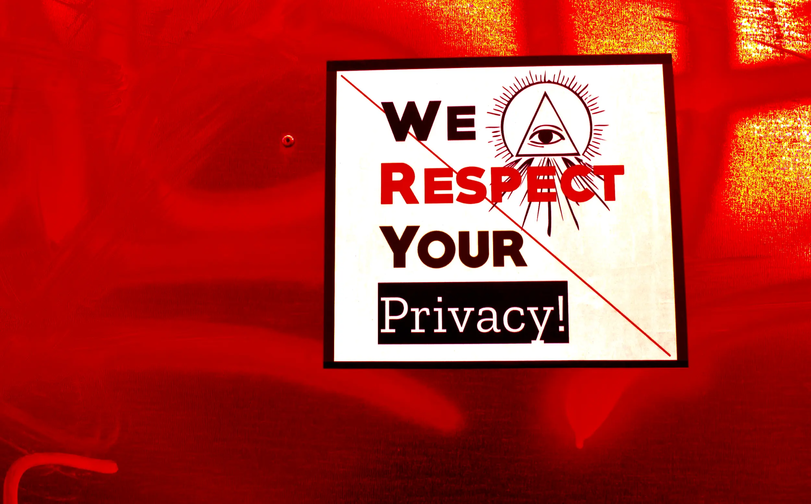

---
date:
    created: 2025-08-20T15:00:00Z
categories:
    - Opinion
authors:
    - em
description:
    Privacy washing is a widely used deceptive strategy. Learning to detect it better is an important skill to develop to help us to respond to it and report it.
schema_type: Opinion
preview:
  cover: blog/assets/images/privacy-washing-is-a-dirty-business/washing-cover.webp
---

# Privacy Washing Is a Dirty Business

<small aria-hidden="true">Photo: Marija Zaric / Unsplash</small>

Perhaps you haven't heard the term *privacy washing* before. Nonetheless, it's likely that you have already been exposed to this scheme in the wild. Regrettably, privacy washing is a widespread deceptive strategy.<!-- more -->

## What is privacy washing

Similarly to whitewashing (concealing unwanted truths to improve a reputation) and greenwashing (deceptively presenting a product as environmentally friendly for marketing purposes), privacy washing misleadingly, or fraudulently, presents a product, service, or organization as being responsible and trustworthy with data protection, when it isn't.

The term has been used for over a decade already. It's saddening to see that not only [this isn't a new problem](https://dataethics.eu/privacy-washing/), but it has only gotten worse through the years.

With the acceleration of data collection, the accumulation of data breaches, and the erosion of customers' trust, companies have an increased need for reassuring users to gain their business.

Despite consumers' rights and expectations, implementing proper data protection takes time, expertise, and money. Even if the long term benefits are colossal, the time invested often doesn't translate into direct *short term* profits, the main objective for most businesses. Additionally, sometimes collecting more data to sell it to third parties does translate into short term profits.

For these reasons, many companies quickly realize the need for *advertising* better privacy, but aren't necessarily willing to invest what it takes to make these claims true.

There comes privacy washing: "Your privacy is&ast; important to us." <small aria-hidden="true">&ast;not!</small>

Privacy washing comes with a selection of washer cycles, from malicious trap, to deceptive snake oil, and to the perhaps most common wash: plain negligence.

## Negligence, incompetence, or malevolence

In some other contexts, intentions might matter more. But when it comes to privacy washing, the result is often the same regardless of intentions: Personal data from users, customers, employees, patients, or children even being leaked and exploited in all sorts of ways.

Whether false claims come from negligence by failing to verify that data protections are properly implemented, incompetence to evaluate if they are, or maliciously trying to trick users in using a service that is actually detrimental to their privacy, harm is done, and sometimes permanently so.

Nonetheless, understanding the different types of privacy washing can help us to evaluate how to detect it, respond to it, and report it.

### Negligence and greed

They know what they are doing, but they care more about money

The most common occurrence of privacy washing likely comes from negligence and greed. One of the biggest driver for this is that the current market incentives it.

Today's software industry is largely inflated by venture capitalist funding, which creates expectations for a substantial return on investment. This funding model often encourages startups to quickly build an app following the [minimum viable product](https://en.wikipedia.org/wiki/Minimum_viable_product) principles, grow its user base as fast as possible, increase its value, and then sell it off for profits.

The problem is, this model is antithesis to implementing good privacy, security, and legal practices from the start. Data privacy cannot only be an afterthought. It must be implemented from the start, before users' data even gets collected.

Many startups fail to see how being thorough with data privacy will benefit them in the long term, and view privacy and security requirements only as a burden slowing down their growth. This mindset can result in perceiving privacy as a simple marketing asset, something businesses talk to users about for reassurance, but without putting any real effort into it beneath the surface.

This practice of course leads to *devastating consequences* for the users.

A tragic, yet emblematic occurrence of such mindset is the recent case of OceanGate's Titan deep-sea submersible, that [infamously imploded](https://globalnews.ca/news/11318623/titan-sub-report-oceangate-culture-critically-flawed/) during an exploration, killing its five passengers in an instant.

The final report blamed a problematic safety culture at OceanGate that was “critically flawed and at the core of these failures were glaring disparities between their written safety protocols and their actual practices.”

Perhaps [moving fast and breaking things](move-fast-and-break-things.md) wasn't such a good idea after all.

Alas, similar "glaring disparities" between policies and practices are widespread in the tech industry. While maybe not as dramatic and spectacular as an imploding submersible, [data leaks can also literally kill people](privacy-means-safety.md).

**Data privacy is the "passenger safety protocol" for software**, and it should never be trivialized.

Privacy isn't just "risk management", it is a human right. Analogous to safety protocols, organizations are responsible for ensuring their data protection policies are being followed, and are accurately describing their current practices. Anything less is negligence, at best.

Unfortunately, users (like passengers) often have very few ways to verify false claims about allegedly privacy-respectful features and policies. But this burden should never be on them in the first place.

### Incompetence and willful ignorance

They don't know what they are doing, or they just don't want to know

Partly related to negligence, is plain incompetence and willful ignorance. Some organizations might be well-intentioned initially, but either lack the internal expertise to implement proper privacy practices, or conveniently decide not to spend much time researching about what their data protection responsibilities are.

For example, most businesses have heard by now of the requirement to present a privacy policy to their users, customers, and even web visitors. Deplorably, in a failed attempt to fulfill this legal obligation, many simply copy someone else's privacy policy and paste it on their own website. Not only this is very unlikely to be compliant with applicable privacy regulations, but it also possibly infringes *copyright* laws.

Do not simply copy-paste another's privacy policy and claim it as your own!

It's important to remember that legal requirements for policies aren't the end goal here. **The true requirements are the data protection *practices*.**

The policies *must* accurately describe what the *practices* are in reality. Because not two organizations have the exact same internal practices and third-party vendors, not two organizations should have the exact same privacy policy.

**Copy-paste privacy policies aren't compliance, they're deception.**

A privacy policy that isn't accurately describing an organization's practices is a form of privacy washing. Sadly, a quite commonly used one, like some quick light-wash cycle.

It's worth noting these days that creating a privacy policy using generative AI will lead to the exact same problems related to accuracy and potential infringement of both privacy and copyright laws. This is *not* a smart "shortcut" to try.

While lack of understanding of policies and legal requirements is only one example of how incompetence can become a form of privacy washing, there are infinitely more ways this can happen.

As soon as data is collected by an organization (or by the third-party software it uses), there is almost certainly legal obligations to protect this data, to restrict its collection and retention, and to inform data subjects.

Organizations that do not take this responsibility seriously, or blissfully decide to remain unaware of it, while presenting an empty privacy policy, are effectively doing privacy washing.

Implementing protections and limiting collection cannot be an afterthought. Once data is leaked, there is often nothing that can be done to truly delete it from the wild. The damage caused by leaked data can be tragic and permanent.

Organizations must take this responsibility much more seriously.

### Malevolence and deception

They lie, and they want your data

Whereas greed and ignorance are common causes of privacy washing, this can quickly escalate to fraud and ambush.

Although it's worth noting that a large amount of negligence or incompetence can become indistinguishable from malice, there are organizations that deliberately lie to users to exploit them, or to trick them into unwillingly revealing sensitive information.

#### Anom, the secret FBI operation

Perhaps one of the most infamous example of this is the Anom honeypot. Anom was an encrypted phone company promising privacy and security, but that was in fact part of an undercover operation staged by the American Federal Bureau of Investigation (FBI), [Operation Trojan Shield](https://en.wikipedia.org/wiki/Operation_Trojan_Shield).

Investigative journalist Joseph Cox [reported](https://www.vice.com/en/article/inside-anom-video-operation-trojan-shield-ironside/) in 2021 that Anom advertised their products to criminal groups, then secretly sent a copy of every message on the device to the FBI. It was so secret, even Anom developers didn't know about the operation. They were told their customers were corporations.

A screenshot [shared](https://www.vice.com/en/article/operation-trojan-shield-anom-fbi-secret-phone-network/) by Motherboard shows an Anom slogan: "Anom, Enforce your right to privacy". It's hard to tell how many non-criminal persons (if any) might have accidentally been caught in this FBI net. Although this specific operation seems to have been narrowly targeting criminals, who knows if a similar operation could not be casting a wider net, inadvertently catching many innocent privacy-conscious users in its path.

#### Navigating VPN providers can be a minefield

Using a [trustworthy](https://www.privacyguides.org/en/vpn/) Virtual Private Network (VPN) service is a good strategy to improve your privacy online. That being said, evaluating trustworthiness is critical here. Using a VPN is only a transfer of trust, from your Internet Service Provider (ISP) to your VPN provider. Your VPN provider will still know your true IP address and location, and *could* technically see all your online activity while using the service, if they decided to look.

All [VPN services aren't equal](https://www.privacyguides.org/videos/2024/12/12/do-you-need-a-vpn/), unfortunately snake oil products and traps are everywhere in this market. Like for anything, do not assume that whoever screams the loudest is the most trustworthy. Loudness only means more investment in advertising.

For example, there is the interesting case of [Kape Technologies](https://en.wikipedia.org/wiki/Kape_Technologies), a billionaire-run company formerly known as Crossrider. This corporation has now acquired four different VPN services: ExpressVPN, CyberGhost, Private Internet Access, and Zenmate. This isn't that suspicious in itself, but Kape Technologies has also [acquired](https://cyberinsider.com/kape-technologies-owns-expressvpn-cyberghost-pia-zenmate-vpn-review-sites/) a number of VPN *review* websites, suspiciously always ranking its own VPN services at the top. This is a blatant conflict of interest, to say the least.

Sadly, on the VPN market [estimated](https://www.grandviewresearch.com/industry-analysis/virtual-private-network-market) at USD 41.33 billion in 2022, what is called a ["review" can often just mean *advertising*](the-trouble-with-vpn-and-privacy-review-sites.md).

Moreover, too many free VPN providers [break their privacy promises](https://iapp.org/news/a/privacy-violations-by-free-vpn-service-providers) regarding users' data. In 2013, Facebook [bought](https://gizmodo.com/do-not-i-repeat-do-not-download-onavo-facebook-s-vam-1822937825) the VPN provider Onavo, and included it in a Facebook feature deceptively labeled "Protect". As is now standard behavior for Facebook, the social media juggernaut actually collected and analyzed the data from Onavo users. This allowed Facebook to monitor the online habits of its users even when they weren't using the Facebook app. This is very much the opposite of data privacy, and of any implied promises to "Protect".

Then, there's the case of Hotspot Shield VPN, who was in 2017 accused of [breaking](https://www.zdnet.com/article/privacy-group-accuses-hotspot-shield-of-snooping-on-web-traffic/) its privacy promises by the Center for Democracy & Technology (CDT), a digital rights nonprofit organization. While promising "anonymous browsing", Hotspot Shield allegedly deployed persistent cookies and used more than five different third-party tracking libraries. The parent company AnchorFree denied the accusations. But even if perhaps it wasn't the case for AnchorFree, how tempting would it be for a business with an ad-based revenue model to utilize the valuable data it collects for more of this revenue. And indeed, many free VPN services do [monetize](https://thebestvpn.com/how-free-vpns-sell-your-data/) users' data.

Worse of all, there are even fake free VPN services. Like stepping on a landmine, criminals are [luring users](https://www.techradar.com/pro/criminals-are-using-a-dangerous-fake-free-vpn-to-spread-malware-via-github-heres-how-to-stay-safe) looking for a free VPN service and tricking them in downloading malware on their devices. While this might be stepping up above privacy washing, it's still a piece of software actively harming users and deceptively gaining their trust on the false promise of better privacy. Wherever privacy washing is being normalized by greedy or lazy organizations, criminals like this flourish.

#### Using compliance to appear legitimate

Another fraudulent case of privacy washing is organizations using false claims related to privacy law compliance to appear more legitimate.

Earlier this year, the digital rights organization Electronic Frontier Foundation (EFF) [called](https://www.eff.org/deeplinks/2025/01/eff-state-ags-time-investigate-crisis-pregnancy-centers) for an investigation on deceptive anti-abortion militant organizations (also called "[fake clinics](https://www.plannedparenthood.org/blog/what-are-crisis-pregnancy-centers)") in eight different US states.

These fake clinics were claiming to be bound by the Health Insurance Portability and Accountability Act (HIPAA) in order to appear like genuine health organizations. HIPAA is an American federal privacy law that was established in 1996 to protect sensitive health information in the United States.

Not only many of these fake clinics are not complying with HIPAA, but they collect extremely sensitive information without even being bound by HIPAA, because they *aren't* licensed healthcare providers. Worse, some have [leaked this data](https://jessica.substack.com/p/exclusive-health-data-breach-at-americas) in all sorts of ways.

Thanks to EFF's work, some of those fake clinics have now [quietly removed](https://www.eff.org/deeplinks/2025/08/fake-clinics-quietly-edit-their-websites-after-being-called-out-hipaa-claims) misleading language from their websites. But sadly, this small victory doesn't make these organizations any more trustworthy, it only slightly reduces the extent of their privacy washing.

#### Deceptive language and privacy-masquerading

Perhaps the most obvious and pernicious examples of privacy washing are organizations that are clearly building products and features harming people's privacy, while using pro-privacy language to disguise as privacy-respectful organizations. There are likely more occurrences of this than there are characters in this article's text.

Buzzwords like "military-grade encryption", "privacy-enhancing", and the reassuring classic "we never share your data with anyone" gets thrown around like candies falling off a privacy-preserving-piñata.

But **words are meaningless when they are deceitful**, and these candies quickly turn bitter once we learn the truth.

Google, the advertising company:

An infamous recent example of this is Google, who in 2023 [pushed](https://proton.me/blog/privacy-washing-2023) a new Chrome feature for targeted advertising and dared calling it: "Enhanced Ad Privacy"

This [enabled by default](https://www.eff.org/deeplinks/2023/09/how-turn-googles-privacy-sandbox-ad-tracking-and-why-you-should) technology allows Google to target users with ads customized around their browsing history. It's really difficult to see where the privacy is in this, even when squinting very hard.

But of course Google, and advertising company, has long mastered the art of misleading language around data privacy to reassure its valuable natural resource, the user.

Everyone is likely familiar by now with the infamously deceptive Chrome feature named "Incognito" mode. Being "Incognito" of course stops at your own device, where browsing history will not be kept. Complainants alleged that, despite Incognito mode being enabled, Google was still collecting personally identifiable user data. Understandably disgruntled users filed an official [class action lawsuit](https://www.theverge.com/2023/8/7/23823878/google-privacy-tracking-incognito-mode-lawsuit-summary-judgment-denied) to get reparation from this deception. In 2023, Google decided [to settle](https://www.bbc.co.uk/news/business-67838384) on this 5-billion dollars lawsuit.

Despite all it might claim in its advertising to users, Google, like many other big tech giants, have been for years lobbying [against better privacy](https://www.politico.com/news/2021/10/22/google-kids-privacy-protections-tech-giants-516834) protections.

World App, the biometric data collector:

Similarly, Sam Altman's World project loves to throw privacy-preserving language around to reassure prospect users and investors. But despite all its claims, data protection authorities around the world have been [investigating, fining, and even banning](sam-altman-wants-your-eyeball.md/#privacy-legislators-arent-on-board) its operations.

The World App (developed by the World project) is an "everything app" providing users with a unique identifier called a World ID. This World ID, which grants various perks and accesses while using the World App, is earned by providing biometric data to the organization, in the form of an iris scan.

Providing an iris scan to a for-profit corporation with little oversight will rightfully scare away many potential users. This is why the company has evidently invested heavily in branding itself as a "privacy-preserving" technology, claims that are [questionable](sam-altman-wants-your-eyeball.md/#how-privacy-preserving-is-it) to say the least.

Despite catchy declarations such as "privacy by default and by design approach", the World project has accumulated an impressive history of privacy violations, and multiplies contradicting and misleading statements in its own documentation.

**There are some stains that even a powerful, billionaire-backed, privacy wash just cannot clean off.**

Flo App, sharing your period data with Facebook:

In 2019, the Wall Street Journal [reported](https://therecord.media/meta-flo-trial-period-tracking-data-sharing) that the period tracking application Flo App had been sharing sensitive health data with Facebook (Meta), despite its promises of privacy.

The app developed by Flo Health, repeatedly reassured users that the very sensitive information they shared with the app would remain private and would not be shared with any third parties without explicit consent.

Despite this pledge, the Flo App did share sensitive personal data with third parties, via the software development kits incorporated into the app.

This extreme negligence (or malevolence) have likely harmed some users in unbelievable ways. Considering the state of abortion rights in the United States at the moment, it's not an exaggeration to say this data leak could [severely endanger](privacy-means-safety.md/#healthcare-seekers) Flo App's users, including with risk of imprisonment.

In response, users have filed several [class action lawsuits](https://www.hipaajournal.com/jury-trial-meta-flo-health-consumer-privacy/) against Flo Health, Facebook, Google, AppsFlyer, and Flurry.

Trivializing health data privacy while promising confidentiality to gain users' trust should never be banalized. This is a very serious infringement of users' rights.

## Remain skeptical, revoke your trust when needed

Regardless of the promises to safeguard our personal data, it's sad to say, but we can never let our guard down.

Privacy washing isn't a trend that is about to fade away, it's quite likely that it will even worsen in the years to come. We must prepare accordingly.

The only way to improve our safety (and our privacy) is to remain vigilant at all time, and grant our trust only sparsely. We also need to stay prepared to revoke this trust at any time, if we learn new information that justifies it.

Always remain skeptical when you encounter privacy policies that seem suspiciously too generic, official-looking badges on websites advertising unsupported claims of "GDPR compliance", reviews that are lacking supporting evidence and doubtfully independent, and over usage of buzzwords like "military-grade encryption", "privacy-enhancing", "fully encrypted", and (more recently) "AI-powered".

It's not easy to navigate the perilous waters of supposedly privacy-respectful software. And it's even worse in an age where AI-spawned websites and articles can create the illusion of trustworthiness with only a few clicks and prompts.

Learning how to spot the red flags, and the green(ish) flags, to protect ourselves from the deceptive manipulation of privacy washing is an important skill to develop to make better informed choices. We will discuss more on this in the next article.
