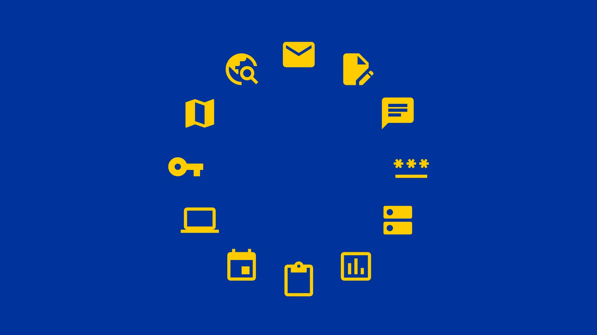

---
date:
    created: 2025-03-19T21:00:00Z
categories:
    - News
authors:
    - jonah
description: There is a growing sentiment that the US shouldn't be relied upon for the technologies that many people and businesses use every day. These privacy-centric recommendations come from a variety of European-based companies and organizations, that you should definitely consider checking out!
schema_type: NewsArticle
preview:
  color: "#003399"
  text_color: "#ffffff"
  site_logo: privacy-guides-logo-notext-colorbg-white.svg
  icon: simple/europeanunion
---
# Privacy-Respecting European Tech Alternatives

<small aria-hidden="true">Illustration: Jonah Aragon / Privacy Guides</small>

There is a growing sentiment that the US shouldn't be relied upon for the technologies that many people and businesses use every day. Lately, the US has been unilaterally [cutting off](https://archive.ph/EJ26f) access to critical technologies to European countries, prompting [calls for "radical action"](https://techcrunch.com/2025/03/16/european-tech-industry-coalition-calls-for-radical-action-on-digital-sovereignty-starting-with-buying-local/) to bolster European tech stacks from EU lawmakers.<!-- more -->

At Privacy Guides, we generally value technical guarantees over matters like jurisdiction. There is simply no alternative to privacy technologies like strong *end-to-end encryption* when it comes to protecting your information.

That being said, the United States *certainly* does not have a monopoly on the best technologies, and many of our favorite [recommended tools](https://www.privacyguides.org/en/tools/) come from Europe and all over the world. Tools from the European Union also generally benefit from much stronger data protection laws, thanks to the EU's General Data Protection Regulation (GDPR).

If supporting the European tech industry is something that is important to you, here's a non-exhaustive list of some of our favorites. We have many more recommendations throughout our website if you are interested in learning more about privacy-respecting tech alternatives!

## :material-email: Email Services

Many people and businesses are tied to Google's Gmail or Microsoft's Outlook products, but there are *far* more secure and private [alternative email providers](https://www.privacyguides.org/en/email/) out there!

### Tuta :flag_de:

{ align=right }
{ align=right }

Based in Hanover, Germany, **Tuta** is an email service with a focus on security and privacy through the use of encryption. Tuta has been in operation since 2011.

Free accounts start with 1 GB of storage.

[:octicons-info-16: More Info](https://www.privacyguides.org/en/email/#tuta){ .md-button .md-button--primary }
[:octicons-home-16:](https://tuta.com){ .card-link title="Homepage" }

### Proton Mail :flag_ch:

{ align=right }

Based in Geneva, Switzerland, **Proton Mail** is an email service with a focus on privacy, encryption, security, and ease of use. They have been in operation since 2013.

The Proton Mail Free plan comes with 500 MB of Mail storage, which you can increase up to 1 GB for free.

[:octicons-info-16: More Info](https://www.privacyguides.org/en/email/#proton-mail){ .md-button .md-button--primary }
[:octicons-home-16:](https://proton.me){ .card-link title="Homepage" }

## :material-file-document-edit: Office Suites

Of course, email isn't the only thing offered by solutions like Google Workspace and Microsoft 365. Many people use their entire suite of [productivity tools](https://www.privacyguides.org/en/document-collaboration/) to manage their businesses and collaborate with others.

Luckily, there are plenty of alternatives that incorporate strong encryption and can even be self-hosted, which will not only decrease your reliance on the traditional Big Tech companies, but keep your data far more secure as well.

### CryptPad :flag_fr:

Developed and hosted by *XWiki* in Paris, France, **CryptPad** is a complete online office suite with applications including Documents, Rich Text, Spreadsheets, Code/Markdown, Kanban, Slides, Whiteboard and Forms.

{ align=right }

**CryptPad** is a private-by-design alternative to popular office tools. All content on this web service is end-to-end encrypted and can be shared with other users easily.

[:octicons-info-16: More Info](https://www.privacyguides.org/en/document-collaboration/#cryptpad){ .md-button .md-button--primary }
[:octicons-home-16:](https://cryptpad.org){ .card-link title="Homepage" }

:material-star-box: We recently did a [full review of CryptPad](cryptpad-review.md), which you should definitely check out if you might be interested in switching!

### Nextcloud :flag_de:

**Nextcloud** comes from German startup *Nextcloud GmbH*, and offers a complete cloud drive alternative to Google Drive or OneDrive.

{ align=right }

**Nextcloud** is a suite of free and open-source client-server software for creating your own file hosting services on a private server you control.

[:octicons-info-16: More Info](https://www.privacyguides.org/en/document-collaboration/#nextcloud){ .md-button .md-button--primary }
[:octicons-home-16:](https://nextcloud.com){ .card-link title="Homepage" }

### LibreOffice :flag_de:

**LibreOffice** is developed by *The Document Foundation* based in Berlin, Germany. It's a free and open-source office suite with extensive functionality.

{ align=right }

Web-based editors aren't for everyone. If you need a full-fledged office suite that runs locally on your computer, **LibreOffice** is a fantastic alternative to Microsoft Office.

[:octicons-info-16: More Info](https://www.privacyguides.org/en/office-suites/#libreoffice){ .md-button .md-button--primary }
[:octicons-home-16:](https://libreoffice.org){ .card-link title="Homepage" }

## :material-search-web: Search Engines

One of the most frequently used tools on the internet is the venerable search engine. Switching from **Google** to an [alternative](https://www.privacyguides.org/en/search-engines/) is one of the biggest impact approaches to improving your privacy that you can make.

### Startpage :flag_nl:

Headquartered and developed in the Netherlands, Startpage is one great alternative to Google you could consider:

{ align=right }
{ align=right }

**Startpage** is a private search engine. One of Startpage's unique features is the [Anonymous View](https://startpage.com/en/anonymous-view), which puts forth efforts to standardize user activity to make it more difficult to be uniquely identified. The feature can be useful for hiding [some](https://support.startpage.com/hc/articles/4455540212116-The-Anonymous-View-Proxy-technical-details) network and browser properties. However, unlike the name suggests, the feature should not be relied upon for *total* anonymity.

[:octicons-info-16: Homepage](https://www.privacyguides.org/en/search-engines/#startpage){ .md-button .md-button--primary }
[:octicons-home-16:](https://startpage.com){ .card-link title="Homepage" }

It is worth noting that [since 2020](relisting-startpage.md), Startpage has been a subsidiary of American company System1. Their operations and employees remain in the Netherlands, and you can choose to utilize only European servers if you wish.

## :material-earth: Web Browsers

Web browsers are historically very tricky to build, and the three major browser engines, Chromium, Gecko (Firefox), and WebKit (Safari) are all *primarily* developed by American companies. This is a space that could certainly use improvement.

### Mullvad Browser :flag_se:

One of our [recommended browsers](https://www.privacyguides.org/en/desktop-browsers/) is spearheaded by Swedish VPN company *Mullvad*, although it's worth noting that its development is somewhat reliant on American non-profits Mozilla and the Tor Project, being a Tor Browser fork.

{ align=right }

**Mullvad Browser** is a version of Tor Browser with Tor network integrations removed. It aims to provide to VPN users Tor Browser's anti-fingerprinting browser technologies, which are key protections against mass surveillance programs. It is developed by the Tor Project and distributed by Mullvad, although it does *not* require the use of Mullvad's VPN.

[:octicons-info-16: More Info](https://www.privacyguides.org/en/desktop-browsers/#mullvad-browser){ .md-button .md-button--primary }
[:octicons-home-16:](https://mullvad.net/en/browser){ .card-link title="Homepage" }

## :material-map: Maps & Navigation

Mapping and location apps like Google Maps can track your every move, and that data is used by tech companies for a wide variety of purposes, including for military and defense. The best mapping apps for your privacy can be used completely offline:

### Organic Maps :flag_ee:

{ align=right }

Based in Estonia, **Organic Maps** is an open source, community-developed map display and satnav-style navigation app for walkers, drivers, and cyclists. The app offers worldwide offline maps based on OpenStreetMap data, and navigation with privacy — no location tracking, no data collection, and no ads. The app can be used completely offline.

[:octicons-info-16: More Info](https://www.privacyguides.org/en/maps/#organic-maps){ .md-button .md-button--primary }
[:octicons-home-16:](https://organicmaps.app){ .card-link title="Homepage" }

### OsmAnd :flag_nl:

{ align=right }

Based in the Netherlands, **OsmAnd** is an offline map and navigation application based on OpenStreetMap, offering turn-by-turn navigation for walking, cycling, driving, as well as public transport. It is open-source and does not collect any user data.

[:octicons-home-16: More Info](https://www.privacyguides.org/en/maps/#osmand){ .md-button .md-button--primary }
[:octicons-home-16:](https://osmand.net){ .card-link title="Homepage" }

## :material-form-textbox-password: Password Managers

### KeePassXC :flag_de:

{ align=right }

**KeePassXC** is a community fork of KeePassX, a native cross-platform port of KeePass Password Safe, with the goal of extending and improving it with new features and bug fixes to provide a feature-rich, cross-platform, and modern open-source password manager.

[:octicons-info-16: More Info](https://www.privacyguides.org/en/passwords/#keepassxc){ .md-button .md-button--primary }
[:octicons-home-16:](https://keepassxc.org){ .card-link title="Homepage" }

:material-star-box: We recently published an article on [securely using KeePassXC with a YubiKey](installing-keepassxc-and-yubikey.md)!

### Proton Pass :flag_ch:

{ align=right }

**Proton Pass** is an open-source, end-to-end encrypted password manager developed by the Swiss company Proton AG, the team behind Proton Mail. It securely stores your login credentials, generates unique email aliases, and supports and stores passkeys.

[:octicons-home-16: More Info](https://www.privacyguides.org/en/passwords/#proton-pass){ .md-button .md-button--primary }
[:octicons-home-16:](https://proton.me/pass){ .card-link title="Homepage" }

## :material-chat-processing: Instant Messengers

Switching off of WhatsApp, Facebook Messenger, or iMessage in favor of a more [private instant messenger](https://www.privacyguides.org/en/real-time-communication/) is an excellent way to safeguard your chats.

### Element :flag_gb:

Element is based in the United Kingdom, which is of course no longer in the European Union. However, it is a trusted messaging platform by the [French government](https://element.io/case-studies/tchap), and the [German military](https://element.io/case-studies/bundeswehr), among many other organizations in Europe and around the world looking for sovereignty from Big Tech messaging platforms like Slack and Google Messages.

{ align=right }

**Element** is the flagship client for the [Matrix](https://matrix.org/docs/chat_basics/matrix-for-im) protocol, an [open standard](https://spec.matrix.org/latest) for secure decentralized real-time communication.

Messages and files shared in private rooms (those which require an invite) are by default E2EE, as are one-to-one voice and video calls.

[:octicons-info-16: More Info](https://www.privacyguides.org/en/real-time-communication/#element){ .md-button .md-button--primary }
[:octicons-home-16:](https://element.io){ .card-link title="Homepage" }

### SimpleX :flag_gb:

Another open-source option from the United Kingdom, SimpleX chat has very strong security features, and can be entirely self-hosted anywhere in the world if you prefer the assurances a [custom server](https://simplex.chat/docs/server.html) can bring.

{ align=right }

**SimpleX Chat** is an instant messenger that doesn't depend on any unique identifiers such as phone numbers or usernames. Its decentralized network makes SimpleX Chat an effective tool against censorship.

[:octicons-info-16: More Info](https://www.privacyguides.org/en/real-time-communication/#simplex-chat){ .md-button .md-button--primary }
[:octicons-eye-16:](https://simplex.chat){ .card-link title="Homepage" }

### Briar :earth_africa:

Briar is an open source project not legally incorporated in any jurisdiction, although it has received funding from European initiatives like [NGI](https://ngi.eu/) and the [NLnet Foundation](https://nlnet.nl/), and includes many Europeans in their voluntary board and team.

{ align=right }

**Briar** is an encrypted instant messenger that [connects](https://briarproject.org/how-it-works) to other clients using the Tor Network, making it an effective tool at circumventing censorship. Briar can also connect via Wi-Fi or Bluetooth when in local proximity. Briar’s local mesh mode can be useful when internet availability is a problem.

[:octicons-info-16: More Info](https://www.privacyguides.org/en/real-time-communication/#briar){ .md-button .md-button--primary }
[:octicons-home-16:](https://briarproject.org){ .card-link title="Homepage" }

## More Services...

Looking for more? Here's a short (and non-exhaustive) list of other recommendations of ours which are based in Europe:

- [**VPN Services**](https://www.privacyguides.org/en/vpn/): :flag_se: [Mullvad](https://www.privacyguides.org/en/vpn/#mullvad) and :flag_ch: [Proton VPN](https://www.privacyguides.org/en/vpn/#proton-vpn)
- [**DNS Providers**](https://www.privacyguides.org/en/dns/#recommended-providers): :flag_fr: [dns0.eu](https://dns0.eu/), :flag_se: [Mullvad DNS](https://mullvad.net/en/help/dns-over-https-and-dns-over-tls), and :flag_ch: [Quad9](https://quad9.net/)
- [**Calendars**](https://www.privacyguides.org/en/calendar/): :flag_de: [Tuta](https://tuta.com/calendar) and :flag_ch: [Proton Calendar](https://proton.me/calendar)
- [**Notes Apps**](https://www.privacyguides.org/en/notebooks/): :flag_gb: [Joplin](https://joplinapp.org/) and :flag_ee: [Crypt.ee](https://crypt.ee/)
- [**Pastebins**](https://www.privacyguides.org/en/pastebins/): :flag_fr: [PrivateBin](https://privatebin.info/)
- [**Linux Distros**](https://www.privacyguides.org/en/desktop/): :flag_de: [openSUSE](https://www.opensuse.org/)

If you're in Europe and looking to build or host your *own* European technology, there are also plenty of alternatives to the typical American IT providers. Topics like cloud computing platforms, web analytics services, and content delivery networks are currently out of scope for what we cover here at Privacy Guides, but [European Alternatives](https://european-alternatives.eu/) is one great resource for finding more services like these.

At the end of the day, we trust *all* of our [recommended privacy tools](https://www.privacyguides.org/en/tools/) to keep you safe from prying eyes, but there are many valid reasons you may prefer to stick to the European market.
