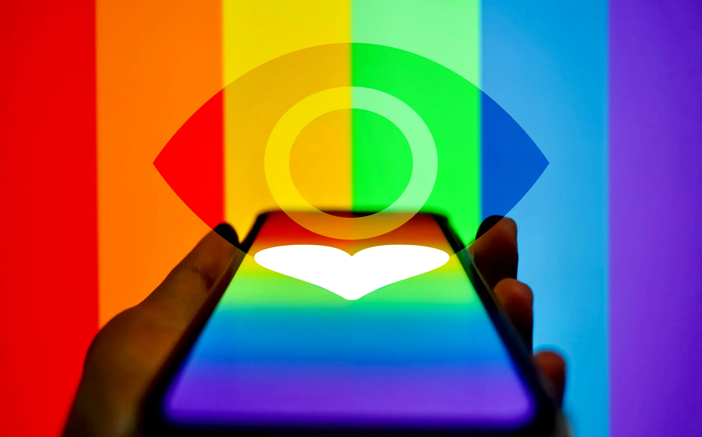

---
date:
    created: 2025-06-24T21:00:00Z
categories:
    - News
tags:
    - Pride Month
authors:
    - em
description: At the intersection of data privacy and LGBTQ+ experiences, it's inevitable to talk about queer dating apps. Unfortunately, most are horrible for data privacy.
schema_type: AnalysisNewsArticle
preview:
  cover: blog/assets/images/queer-dating-apps-beware-who-you-trust/dating-cover.webp
---

# Queer Dating Apps: Beware Who You Trust With Your Intimate Data

<small aria-hidden="true">Illustration: Em / Privacy Guides | Photo: Surasak Ch / Unsplash</small>

When discussing the intersection of data privacy and LGBTQ+ experiences, it's inevitable to also talk about queer dating apps. Due to a smaller percentage of the population and a number of factors complicating in-person dating, people part of the queer community are more likely to seek online platforms to meet lovers and friends. Unfortunately, using queer dating apps can be very dangerous for privacy, and even for safety.<!-- more -->

Dating apps are generally horrible for everyone's privacy, but the queer population is at an even higher risk of harm due to discrimination, and even [criminalization in certain regions](https://www.humandignitytrust.org/lgbt-the-law/map-of-criminalisation/).

Despite the risks, LGBTQ+ people still need to fulfill their social and romantic needs like anyone else.

This isn't an easy task outside the online realm either. Discrimination can be much worse in physical environments that aren't specifically catering to the queer community. In some regions, this can even mean a greater risk of physical aggression.

LGBTQ+ people aren't necessarily safe to date in the same ways cisgender heterosexual people are, increasing the need for safe spaces.

Another important factor is that a smaller percentage of the population necessarily creates a smaller dating pool. Even if someone were to avoid entirely online services, if they aren't located in a town large enough to host LGBTQ+ venues and events, or if they live in an environment where revealing their queer identity could be unsafe to them, online spaces might be their only viable option to [find connections](stay-safe-but-stay-connected.md).

Sadly, this isn't ideal. In today's world, it seems very few services (if any) are considering the importance of data privacy for dating apps seriously enough.

For this reason, it is crucial to acknowledge the dangers, and learn about ways to minimize the risks, and to stay safe while looking for romantic or sexual partners online.

## Dating apps are horrible for data privacy

Unfortunately, whether it's dating apps catering to everyone or to a narrower segment of the population, they are pretty much *all horrible for data privacy*.

Some apps might be worse than others, but at this time, there are no good, largely used, *and* privacy-respectful dating apps.

Due to the nature of dating apps, a major problem is that any dating app will unavoidably collect at least some of very sensitive personal data. This can include photos, intimate photos, sexual preferences, intimate conversations, detailed physical descriptions, and likely much more.

Because of this, a good privacy-respectful dating app would need to implement considerably stronger protections for this data, and obviously not share it with any third party. Regrettably, this isn't what is happening *at all*.

### They collect very sensitive information, legally and illegally

Necessarily, most dating apps will collect *at minimum* a nickname, email, photo, and descriptions of your personality and physical appearance. But, the majority of apps do not stop there.

Most dating apps also collect your location, IP address, and phone number (a strong quasi-static identifier that can be linked to your other accounts and legal identity).

Then, you might upload additional sensitive information, such as a detailed physical description, detailed personality description, health condition, religion, political views, sexual preferences, and even intimate photos in private chats. All this information is collected and stored by the dating app, and maybe even shared with third parties.

According to a [report from Mozilla](https://www.mozillafoundation.org/en/privacynotincluded/articles/data-hungry-dating-apps-are-worse-than-ever-for-your-privacy/), about 25% of apps also collect metadata on uploaded content. This means that if you do not [remove metadata](https://www.privacyguides.org/en/data-redaction/) from your photos and videos (or other file types) before uploading them, the dating app could collect it. This can include very precise information on where and when a photo or video was taken, for example.

Additionally, dating apps can collect a scandalous amount of information from your social media accounts if you use them to sign up with the app. Already in 2017 (this is likely much worse 8 years later into surveillance capitalism), The Guardian journalist Judith Duportail [reported](https://www.theguardian.com/technology/2017/sep/26/tinder-personal-data-dating-app-messages-hacked-sold) on her experience with Tinder after requesting a copy of her account data. Tinder had kept 800 pages of information on her, including Facebook likes, number of Facebook friends, Instagram photo links, ages of men she was interested in, and so on. From her experience she wrote:

> What will happen if this treasure trove of data gets hacked, is made public or simply bought by another company? I can almost feel the shame I would experience.

She is not alone in this. Every dating-app user is at risk of having their intimate data exposed if their account or the app's servers gets hacked, or if the company otherwise leaks or shares their data.

Tragically, data breaches and companies acquisitions aren't rare occurrences. It's more a matter of "when" than "if".

#### Identity verification

Moreover, many apps now require to "verify identity" by requesting users to submit a video selfie, official ID, or other means of verification.

This practice is intrusive at best, and straight out *dangerous* at worst. Any verification practice requiring a piece of official ID or a facial scan has the potential of endangering this data, and increases the risk of a data leak exposing your intimate dating information while being strongly linked to your legal identity.

No dating app should be requiring such sensitive information. Fighting bots and fake accounts isn't worth the risk this represents to users.

#### Biometric data

Even for users who might be careful to choose more privacy-respectful apps, or feel protected by stronger local legislation, trust can be broken.

In 2024, Bumble and Badoo settled a [class action lawsuit](https://www.the-sun.com/money/12327292/bumble-settlement-badoo-payment/) for allegedly infringing the privacy rights of users residing in Illinois US, by violating the [Biometric Information Privacy Act](https://en.wikipedia.org/wiki/Biometric_Information_Privacy_Act) (BIPA). The complainants alleged the apps, both owned by Bumble Inc, were capturing and storing users' facial scan biometrics it extracted from profile's content without the users' consent.

While users located in Illinois were entitled to financial compensation from the [settlement](https://topclassactions.com/lawsuit-settlements/closed-settlements/40m-bumble-badoo-bipa-class-action-settlement/), others located in regions with weaker local regulation didn't receive any compensation for this violation of their consent.

#### Artificial intelligence features

Finally, most dating services have now [integrated AI features in their platforms](https://www.platformer.news/grindr-ai-boyfriend-wingman-monetization-paid-taps/). This is dreadful for privacy.

The problem with current AI features is that most will not just generate data but will also *collect* data. Once data is integrated into a model, it's incredibly difficult (if not impossible) to delete it later.

Grindr's terms of service include a section specifying that, when using the platform, [you grant an irrevocable right to Grindr](https://www.grindr.com/terms-of-service) to "exploit Your User Content" to train "AI Technologies". **Your content is up for AI-grabs on Grindr.**

Horrifyingly, most other dating apps aren't better.

While other apps might be careful not to directly name "AI" or "training" in their terms of service, risking scaring users away, OkCupid, Hinge, and Plenty of Fish (all part of the Texas-based dating service conglomerate Match Group), describe a similar clause in their terms of service that could potentially include AI technologies training on users' content (if not already).

For example, OkCupid specifies in clause 7 of their [Terms & Conditions](https://okcupid-app.zendesk.com/hc/en-us/articles/23941864418203-Terms-Conditions) (emphasis added for clarity):

> By creating an account, **you grant to OkCupid a worldwide, perpetual, transferable**, sub-licensable, royalty-free **right and license to** host, store, use, copy, display, reproduce, adapt, edit, publish, translate, modify, reformat, **incorporate into other works, advertise, distribute and otherwise make available to the general public Your Content**, including any information you authorize us to access from Facebook or other third- party sources (if applicable), in whole or in part, and **in any way and in any format or medium currently known or developed in the future.** OkCupid's license to Your Content shall be non-exclusive, except that OkCupid's license shall be exclusive with respect to derivative works created through use of our Services. For example, **OkCupid would have an exclusive license to screenshots of our Services that include Your Content.**

Of course "any medium developed in the future" could include AI technologies, and/or anything else.

OkCupid has already integrated AI features in users' dating experience using OpenAI's ChatGPT for its services. Michael Kaye, OkCupid's head of communications, excitedly [told Mashable](https://mashable.com/article/okcupid-chatgpt-questions) that "daters who think ChatGPT is a lifesaver get almost 40 percent more Matches on OkCupid than those who think it's too big brother".

Well, perhaps users who accurately think "it's too big brother" have simply already left the app...

### They can expose legal identities

Besides the data privacy dangers created by integrating AI features in dating apps, [identity and age verification is another growing problem](age-verification-wants-your-face.md).

Unfortunately, it seems dating apps are more concerned with fighting fake accounts than protecting users' data, and are willing to sacrifice the latter for the former.

Of course, this security measure is only theatrical. Criminals will easily go around identity verification systems, while the inevitable data breaches will endanger and harm all trustworthy users at once.

#### Identity verification endangers the most vulnerable

Each time a dating application asks for a video selfie or an official piece of ID to prove identity or age, this data risks getting leaked and stolen later.

Moreover, requiring official IDs and face scans severely harm the most vulnerable users who need [protective practices to stay safe online](stay-safe-but-stay-connected.md/#practices-and-tools-that-help-in-various-contexts), for example by using a pseudonym. This is true for victims of domestic violence, victims of online stalking, as well as for the LGBTQ+ community.

Exposed legal identities, particularly in conjunction with dating data, can lead to identity theft, online harassment, doxxing, non-consensual outing, extortion, loss of employment, arrest, and even sexual and physical violence.

Pseudonymity can save lives online. Fighting pseudonymity isn't fighting crime, it's [fighting against the safety](https://journals.sagepub.com/doi/full/10.1177/17416590221111827) of the most vulnerable in our society.

#### Biometric data and dystopian third party

Continuing this horrifying trend, Match Group has announced this spring they are partnering with the [dystopian World App](sam-altman-wants-your-eyeball.md) to start testing age verification for Tinder in Japan. The World App generates unique identifiers based on biometric iris scan.

If having to scan your official ID to continue using Tinder is *bad*, having to scan your eyeball from a questionable third party app is even *worse*.

This practice will start for Tinder in Japan, but it's likely the verification process could be expanded to all users of Match Group apps in the near future.  Soon, the only way to avoid having to share biometric data with the World App to continue using your favorite dating app could be to leave the app entirely.

#### Payment information

Finally, payment information can also create a link between your dating account and your legal identity.

If you provide a credit card under your legal name to use a dating app, then this profile is inevitably linked to your legal identity.

It's possible that some application *might* use third-party software to manage payments, and that this data *might* not leak associated with your dating profile. However, this depends on which payment services the dating app works with, and what the company's security practices are.

### They sell users' data to data brokers

Sadly, not only most dating apps collect *way too much data* they don't secure properly, but they also willingly share this data with data brokers.

If you are not familiar with the [data broker industry](https://www.eff.org/deeplinks/2021/07/data-brokers-are-problem), data brokers are usually private for-profit companies that specialize in collecting personal information on everyone, using and scraping public records, social media accounts, various websites, other online sources, and any applications willing to work with them.

They then make this information [available to anyone](https://gizmodo.com/alleged-minnesota-shooter-used-data-brokers-to-find-lawmakers-addresses-2000616975) for sale. They do not care about your consent nor your safety, at all.

**Data brokers are the archenemy of privacy rights.**

And yes, dating apps share your dating data with them. California's Privacy Protection Agency even uses dating apps in its [example](https://cppa.ca.gov/data_broker_registry/) for the Data Broker Registry it keeps:

> For example, if a person signs up for a dating app, a data broker may buy all recent sign ups of that dating app from the app developer and sell the information to a gym that is looking to target potential new customers.

The chosen example of a data broker selling dating app data to a gym is quite mild. As explained in the next section, [what actually happens](#hateful-groups-tracking-users) with this data if often much more grim.

One type of data often [bought by data brokers](https://www.eff.org/issues/location-data-brokers) is location data. Location data can easily be used to precisely identify a user, a user's home address, a user's work address, a user's favorite venues, and a user's connections with others. **Many dating apps share location data.**

In 2022, The Markup [published](https://themarkup.org/privacy/2022/01/27/gay-bi-dating-app-muslim-prayer-apps-sold-data-on-peoples-location-to-a-controversial-data-broker) the results of an investigation from a 2018-2019 sample dataset they obtained from the data broker X-Mode. The dataset compiled location data collected from 107 different apps, including the dating app Bro "for bi, gay, and open-minded men".

While conducting research on apps from the Google app store in 2020, the Yale Privacy Lab uncovered several other queer dating apps selling data to X-Mode. At that time, the dating apps Wapo, Wapa, MEET MARKET, and FEM were all sharing users' location data with the same data broker.

Replying to journalists, Bro App's founder confirmed that the company no longer shares users' location with X-Mode.

But what other data and which other data brokers dating apps might be working with? How many other dating apps similarly share location data?

Seven years after this dataset was examined, and in a world where data is being collected from users exponentially more, how many dating apps have simply normalized this practice entirely?

This isn't a new problem, and this [isn't just about location data](https://www.vice.com/en/article/shady-data-brokers-are-selling-online-dating-profiles-by-the-millions/). But this problem is getting increasingly worse, and users must be properly informed on how their intimate data is used and shared.

With the advancements in computer performance over the years, collecting and storing data is cheaper than ever. Corporations and governments alike are eager to access this data for advertising and surveillance purposes. The same is true for special interest and criminal groups of all kinds.

**The data broker industry is thriving on exploiting our data without consent**, even in our most intimate activities.

### They monetize data for advertising

Data brokers and ad-tech companies are working together in similar ways to extract values from every data point they can find about you online. They feed each other in some sort of twisted exploitative synergy.

Dating apps are working with them as well.

In 2021, [Grindr was fined](https://www.bbc.com/news/technology-59651703) €6.5m by the Norwegian Data Protection Authority for sharing users' data without prior explicit consent. The data shared with advertisers included age, gender, advertising ID, IP address, GPS location, and the fact that someone used Grindr. This makes the data even more sensitive, potentially revealing a user's sexual orientation (which is a special category under the [GDPR Article 9](https://gdpr-info.eu/art-9-gdpr/)).

Last year, Grindr was sued for allegations of [sharing users' HIV status](https://www.bbc.com/news/articles/cj7mxnvz42no) with advertisers, in violation of UK's data privacy laws. Two years before, Grindr was [reprimanded](https://ico.org.uk/media2/migrated/4023128/grindr-reprimand.pdf) by the UK's Information Commissioner's Office (ICO) for its data protection (mal)practices.

In 2020, the CPO Magazine [reported](https://www.cpomagazine.com/data-privacy/many-of-the-major-dating-apps-are-leaking-personal-data-to-advertisers/) about tests conducted by the Norwegian Consumer Council that found some of the most popular dating apps sharing sensitive personal information with advertisers. Tinder, Grindr (again), and OkCupid were all found to share age, gender, device information, IP address, and GPS location with advertising and analytics platforms owned by Google, Facebook, Twitter (X), Amazon, and more.

Worse, it was also found that some of these apps sometime shared users' data related to their sexual orientation and dating interests. OkCupid even shared users data related to drug use and political views.

The same year, Tinder announced a partnership with the app Noonlight to implement a "panic button" feature to connect users with help in case of emergency. This seems great at first, but the problem is, it is yet another app that hasn't done its privacy homework properly to protect users. Gizmodo [found](https://gizmodo.com/tinders-new-panic-button-is-sharing-your-data-with-ad-t-1841184919) the partnering app was sharing users' data with major ad-tech businesses *every minute*, including with Facebook and Google.

Even your safety is being monetized and shared with Facebook.

### They don't safeguard data properly

In addition to collecting and monetizing a *large* amount of very sensitive data on every user, many dating apps have the unfortunate tendency to not take securing this data seriously enough.

Data breaches and leaks of all sorts are rampant with dating apps. Assume all data you upload there might become public, sooner than later. If you are not out publicly, be aware **a dating app data breach could out you against your will**.

Here are a few examples of past incidents:

- 2025: [Grindr, Tinder data breach](https://techcrunch.com/2025/01/13/gravy-analytics-data-broker-breach-trove-of-location-data-threatens-privacy-millions/?guccounter=1)

- 2025: [Translove, Pink, Brish data leak](https://cybernews.com/security/ios-dating-apps-leak-private-photos/)

- 2025: [Gay Daddy data leak](https://cybernews.com/security/gay-daddy-ios-app-exposes-users/)

- 2025: [Raw data leak](https://techcrunch.com/2025/05/02/dating-app-raw-exposed-users-location-data-personal-information/)

- 2025: [Headero data leak](https://beyondmachines.net/event_details/headero-dating-app-leaks-data-exposing-4-million-user-records-5-n-4-z-a/gD2P6Ple2L)

- 2023: [Coffee Meets Bagel data breach](https://www.bleepingcomputer.com/news/security/coffee-meets-bagel-says-recent-outage-caused-by-destructive-cyberattack/)

- 2023: [419 Dating, Meet You, Speed Dating App For American data leak](https://ciso.economictimes.indiatimes.com/news/data-breaches/dating-app-that-claims-50-million-users-suffer-data-breach/101910331)

- 2021: [MeetMindful data breach](https://www.zdnet.com/article/hacker-leaks-data-of-2-28-million-dating-site-users/)

- 2019: [Coffee Meets Bagel data breach](https://www.independent.co.uk/tech/coffee-meets-bagel-dating-app-hack-a8781176.html)

- 2019: [Heyyo data leak](https://www.zdnet.com/article/heyyo-dating-app-leaked-users-personal-data-photos-location-data-more/)

- 2019: [MobiFriends data breach](https://www.infosecurity-magazine.com/news/data-breach-exposes-four-million/)

These are only a few examples, and from all the examples of data exposure out there, it's important to remember these are likely only *a fraction* of the data breaches truly happening. The small fraction that actually gets detected and reported.

While nothing is ever 100% secure, **application developers must do much more** to protect users data adequately.

The constant news about data breaches and leaks is demonstrating how better security and better privacy is urgently needed, especially for such sensitive information.

### They can make deleting data difficult

One excellent practice every dating app should adopt is data minimization. Applications should only require users to *provide the absolute minimum* information necessary to run the service.

Then, as soon as this data is no longer required, data should be *thoroughly and permanently deleted*. For example, data should be *thoroughly deleted* when a user deletes it on their end, officially requests to have their data or their account deleted, or when an account becomes inactive after a certain period of time.

This practices greatly reduces the risk of data breaches and leaks, and releases the company from this legal responsibility. **You cannot endanger the data you do not have.**

Every organization and software developer *should* follow the [wise advice](https://www.schneier.com/blog/archives/2016/03/data_is_a_toxic.html) from renown cryptographer Bruce Schneier, and treat data like it's a toxic asset.

#### Data retention practices

It's difficult to know for sure for how long certain dating apps retain data behind the scene. Many lack transparency about their data retention practices.

Data retention periods should always be the shortest possible to provide the service. Sadly, many businesses might be tempted to retain it for much longer, especially in the age of AI-training datasets.

#### Data deletion practices

Additionally, not all dating apps have adopted proper data deletion practices.

The ideal practice is to empower users to be able to delete the data they wish to delete from within their account (e.g. being able to delete one message or one conversation). But also, companies should provide an option to request a *complete* and *permanent* account and data deletion from within the account, *without requiring additional information* from a user, and without requiring to email the company.

Many applications have implemented data deletion processes similar to the model described above to manage user's requests, but not all of them (yet).

Of course, organizations *must* also follow through, and *properly* delete this data in the *backend* as well as in the frontend.

This has important legal implications, because even for organizations lacking transparency and honesty, users could soon find out the truth in the next data breach. If the data was not fully deleted after a deletion request was made, this could have *severe* legal and financial consequences.

#### Investigating an app's data deletion process *before* creating an account

Unfortunately, some dating apps seem to have neglected this important process in their relationship with users.

Some applications and services are requiring *more* data to submit a data deletion request than what was even required to create the account in the first place. **This is bad.**

Despite being rated the best (or perhaps the "least bad") on [Mozilla's Privacy Not Included chart](https://www.mozillafoundation.org/en/privacynotincluded/categories/dating-apps/), the queer dating app Lex seems to require users to fill a *Google Form* that mandates providing first and last name, date of birth, email, phone number, and even a *home address*. One of the form seems to imply an official piece of ID might also be required. This is *extremely* intrusive.

Moreover, this practice would be directly sharing this personal information *with Google,* outing that this person (with this legal name, and at this home address) is queer and uses or used Lex.

Google Forms aren't a private way to share sensitive data. This isn't a great data privacy practice, to say the least.

It's also [unclear](https://help.lex.lgbt/article/69-how-can-i-delete-my-data) if Lex respond to data deletion requests from users located outside the protection of the GDPR (Europe) or the CCPA (California US) at all. Despite a number of regions worldwide benefiting from privacy laws granting rights similar to the [GDPR's Article 17](https://gdpr-info.eu/art-17-gdpr/).

Even if you have been careful to provide only minimal information when creating your account, it seems a simple data deletion request once you are done using the app would require you to share all this *extremely sensitive and identifying information* with Lex (and Google!).

At the time of this article's publication, Lex's current [privacy policy](https://help.lex.lgbt/article/51-privacy-policy) links to these two forms required from users to fill for [GDPR's Right to Erasure requests](https://docs.google.com/forms/d/e/1FAIpQLSdhK2fkBounO1PeN75s7OU0Ey1tmMpGEQYd9lD8EQWAH8DPKA/viewform) and [CCPA's Right to Delete requests](https://docs.google.com/forms/d/e/1FAIpQLScz7bDrVbjvB4uSiWjJky0JeePyv4Q-g3Cejz6pCCHiXlUEVw/viewform).

It goes without saying that you shouldn't email a copy of your passport to anyone, and you should never have to provide *more* information than the app already has on you to get your data deleted. This is especially true if all the data mentioned above gets shared with a third-party advertising company like Google, through the use of Google Forms.

Privacy Guides has reached out to Lex for clarification on its data deletion practices, but has not received any response at the time of this publication. This article will be updated with new information once we receive an answer.

Before creating an account with a dating app (or any other app for that matter), it's important to find information on what will be the process to delete your data and account once you are done with the app.

That way, you can choose to only use applications that will thoroughly respect your privacy rights, and your rights to delete your own data.

## Queer dating apps can be targeted

At this time, almost all popular dating apps are *horrible* for data privacy. But queer dating apps (or queer people using any dating app) are especially vulnerable targets for malicious actors.

Unfortunately, hateful groups, criminals, and even governments have been weaponizing dating apps to harass, exploit, arrest, or even attack queer people.

Dating app companies are partly responsible for facilitating this harm by selling users' data to data brokers and advertisers, and by repeatedly missing opportunities for improvements to secure their users' data.

Additionally, each time there is a new dating app data leak, whether from negligence, incompetence, greed, or malice, this leak risks [outing people against their will](importance-of-privacy-for-the-queer-community.md/#being-outed-against-ones-will). This alone can have devastating consequences, from feeling violated to getting arrested, or even killed.

In Morocco, where being gay is still illegal, a social media influencer [asked](https://www.levantx.com/series-source/violence-in-lockdown-sofia-talouni-and-gay-male-outings-in-morocco-under-covid) people in 2020 to join dating apps to out gay men around them. This resulted in a violent online harassment campaign with many gay men being outed against their will, chased from their homes, shunned by their family, and horrifyingly even led to some suicides.

Regrettably, even in countries where being queer is legal and generally accepted, [targeted harassment](privacy-means-safety.md/#trans-and-queer-activists) and attacks can happen.

For people who aren't out publicly, data revealed about their dating life could potentially out them immediately. But even for people who are out publicly, making details about their dating life public could trigger online hate, targeted harassment, and endanger them in many ways.

Queer dating apps have an even greater responsibility to protect their users' data.

Data related to one's sexual orientation is categorized as especially sensitive information by many privacy laws, generally requiring additional protections. For example, GDPR's [Article 9](https://gdpr-info.eu/art-9-gdpr/) specifies special conditions for handling data related to a "person's sex life or sexual orientation".

Companies and software developers must take this responsibility much more seriously.

### Hateful groups tracking users

In 2023, the Washington Post [revealed](https://www.pcmag.com/news/a-catholic-group-spent-millions-on-dating-app-data-to-out-gay-priests) that an American Catholic group based in Colorado had bought data brokers datasets from queer dating apps.

The religious group spent millions of dollars to access data from Grindr, Scruff, Growlr, Jack'd, and OkCupid in an attempt to out gay and bisexual priests. The group used these datasets to cross-reference locations with church residences. This level of hate and insidious spying seems quite ungodly.

Tragically, dating apps selling users' data to brokers and advertisers makes this type of targeting by hateful groups easily accessible to anyone willing to pay.

### Governments and authorities prosecuting users

In countries where homosexuality and transgender people are criminalized, even governments are guilty of these cruel practices.

In 2017, Human Rights Watch [reported](https://www.hrw.org/news/2017/05/01/south-koreas-military-sodomy-law-should-go) allegations of the South Korean army cracking down on gay service members using published screenshots from dating app chats. Although homosexuality isn't illegal for civilians in South Korea, same-sex intercourse is illegal in the military. This oppressive rule is aggravated by the fact that South Korean men are [obligated to enroll](https://en.wikipedia.org/wiki/LGBTQ_rights_in_South_Korea) for a mandatory period of service under the conscript system.

In 2018, organization Article 19 [completed](https://www.article19.org/resources/apps-arrests-abuse-egypt-lebanon-iran/) an investigation on the risk of dating apps usage by the LGBTQ+ community in Egypt, Lebanon, and Iran. The report demonstrates how authorities in Egypt used the geolocation feature of dating apps to entrap and arrest gay and transgender users.

In 2022, Article 19 supported another report [focusing](https://www.article19.org/wp-content/uploads/2022/03/Digital-Crime-Scenes-Report-3.pdf) on the persecution of queer people in Egypt, Lebanon, and Tunisia. The report explains how authorities in these regions used dating apps to set up trap meetings with users, and to collect digital "evidences" to charge queer users.

In 2025, Human Rights Watch [published](https://www.hrw.org/news/2025/05/26/uganda-anti-lgbt-law-unleashed-abuse-0) a report documenting the actions of authorities in Uganda following the 2023 enactment of the Anti-Homosexuality Act. In addition to spreading misinformation and hatred against LGBTQ+ people, leading to harassment and attacks, authorities have started to use dating apps to extort, entrap, and arrest queer people.

Sadly, if LGBTQ+ rights continue to regress like we have observed in the past months, this sort of government-sanctioned persecution might even become normalized in the UK and the US as well.

### Criminals blackmailing and attacking users

Along with hateful groups and authoritarian regimes, criminals are also targeting the queer community on dating apps. This type of crime is exponentially worse for users located in regions where being queer is criminalized, but it is still a danger for anyone worldwide.

Criminals have been [targeting](https://www.bleepingcomputer.com/news/security/lgbtq-plus-community-warned-of-extortionists-abusing-dating-apps/) users on queer dating apps for extortion scams. According to a report from the US Federal Trade Commission, criminals pose as potential dates sending explicit photos, then request users to reciprocate. If they get a reply, they blackmail the victim under threat of revealing this information. This type of extortion can have devastating consequences.

Dating apps are worsening this problem when requesting users to provide legal identification such as facial scans, official IDs, or home addresses. If this information leaks in the future, criminals will have an even easier time to extort and attack their victims, regardless of if they're still on the app or not.

## Reducing the risks when using dating apps

Despite how bad dating apps are for your privacy (and maybe also your safety), your social, sexual, and romantic needs are important to consider as well.

The best alternative for your data privacy is probably to favor in-person meetups and venues, whenever possible.

However, if this isn't accessible to you, and you decide using a dating app is worth the risks, here are a few things to keep in mind that can help to improve your privacy and to reduce the dangers when using a dating app.

### Investigating before creating an account

Before creating an account on a dating app (or any other apps), it's a good idea to take a look at its privacy policy (or privacy notice) and terms of service.

#### Researching privacy policy and terms of service

Most people *hate* doing this, but it can really help to discern which apps are better than others.

You don't have to read it all, but make sure to at least check the sections on what data they collect, with whom they share it, and how they use it.

Important pro-tip: Using your browser, search the page for an "@" sign to verify if the privacy policy includes a contact email address. It *should* have one. Sometimes, it will be a link to a contact page instead. If you cannot find any way to contact anyone at this organization by email, be suspicious.

If you decide to use this dating app, keep a local copy of its privacy policy and terms of service using the "Save to PDF" function from your browser. This *can* help legally by keeping a proof in time of what were the terms when you signed up (of course, they might change later, but that's a start).

#### Investigating usage of AI systems

Look in the privacy policy and terms of service for any mention of AI systems. Sometimes, it's not named directly and might be called something else like "automated system" or other expressions.

Be especially vigilant to check if the company **might use your content data to train these systems**. Make sure you have a way to at least opt out, or deactivate of any such training. AI systems training on your data is *atrocious* for your privacy.

#### Confirming data deletion processes and retention periods

Again usually through the app's policies, look at what the process will be when you'll want to get your data and account with this app fully deleted.

This is important because deleting your data once you are done using the app will greatly improve your data privacy and security, by protecting it from potential data breaches and undisclosed usage in the future (if the deletion is done thoroughly).

Additionally, deleting your data and account once you no longer need it minimizes the risk of an abandoned-account takeover by a criminal.

When you abandon an account without closing it and deleting its data properly, criminals might break in and start using your account and data without your knowledge. The longer the account sits there, the greater the risk.

Make sure the app describes a clear process you can manage yourself *from within* the account to fully delete your data and account, and that **it doesn't require more information** to delete your account than you had to provide to create it in the first place.

#### Evaluating reputation from history of data breaches

Finally, conduct a short research on the history of security practices for this dating app.

Look for trustworthy third-party reviews and information about the app. Always assume information and promises from the company itself are biased.

Check the news for reports of data breaches and leaks. Checks what security researchers and privacy professionals have to say about this app. Make sure to find trustworthy sources, and remain vigilant about AI-generated articles and review articles that are advertising in disguise.

### Choosing a dating app

As stated at length in this article, there aren't any *good* dating apps for your privacy, sadly. There are only "slightly less horrible" dating apps.

For more details on each, you can take a look at Mozilla's [Privacy Not Included chart](https://www.mozillafoundation.org/en/privacynotincluded/categories/dating-apps/) for dating apps. Check the details for each app you are interested in, not just the rating. However, keep in mind that even Lex, the first app listed there, doesn't seem to have great practices in regard to [data deletion](#investigating-an-apps-data-deletion-process-before-creating-an-account), and you might be unable to delete your account data fully if you decide to use this app. This might also be the case for some other apps listed there.

Alternatively, there are a few free dating apps that might offer a different approach with open source code. Applications that are open-source have the benefit of full transparency to examine its code, and potentially detecting any undisclosed data collection.

That being said, open-source applications aren't magically secure, and don't necessarily grant better privacy either. But code transparency helps to audit the application, and to detect any false claim related to privacy and security. The German dating app Alovoa is an example of this. You can take a look at its [code](https://github.com/Alovoa/Alovoa/) on GitHub.

However, the downside of any dating app that isn't massively popular is it will have fewer users, possibly making finding matches more difficult.

Nevertheless, using a niche dating app that fits better your values *could* potentially increase the chances of finding a match that also fit better your values.

Specifically to data privacy however, privacy-conscious people looking for a date online might have to wait for a truly privacy-respectful app to be developed, and to get more popular in the future.

### Minimizing the data shared

When using any dating app, you should always be careful with the information you share, not just for data privacy, but also for your physical safety.

Using a dating app still means talking with a lot of strangers online, and these strangers might have different intentions and goals than yours.

Of course, to find genuine matches, you also do need to share at least some information about yourself, and you shouldn't lie to potential partners.

The idea isn't to use fake information, the idea is simply to *minimize* the information you share, to increase your data privacy with the app, and your safety when interacting with strangers.

Once you have developed a certain level of trust with a dating app match, then you can [move to safer channels](stay-safe-but-stay-connected.md/#private-messaging-one-on-one-and-group-chats) to share more with them (if you wish) in a more secure and more private environment. You could share your Signal username with them to chat in an end-to-end encrypted environment, for example.

Warning: Only share when you fully trust!

Remember that there will be no content moderation in this end-to-end encrypted environment, because it is *truly private*. You should **never share any intimate details with someone you do not trust fully**, even on Signal (or any other end-to-end encrypted apps).

#### Sign up credentials

When signing up for a dating app, **never use a social media account**. Many applications now gives the option to sign up or sign in using your Google, Facebook, or Instagram account.

While this might seem convenient at first, it allows the applications to exchange data, and this is *incredibly bad for your privacy*.

Instead, always sign up for a dating service using new credential information that you have not used anywhere else before (new username, new email, new password). This will reduce the risk of your other accounts being linked with your dating app data, and vice versa.

#### Email address

To use a unique email address, you might want to create a proxy address known as an alias.

Email aliasing is a great technique to improve your privacy online. It allows you to register for services using a unique email address for each. You can also use these unique email addresses to give to your dating prospects to communicate with them. For email aliasing, SimpleLogin is a great service that we [recommend](https://www.privacyguides.org/en/email-aliasing/).

#### Phone number

Using a unique phone number is much more complicated, unfortunately.

From some countries, you might be able to find a trustworthy phone number proxy service, but those aren't always accepted to sign up for new accounts.

Generally, it's much harder to use proxy for a phone number, and account requiring phone numbers to sign up aren't the best for privacy.

A phone number is an identifier that most people rarely change, and that is strongly attached to your legal identity. If this data leaks in the future, your dating data could be linked to your legal identity, and to your other accounts in all sorts of ways.

Additionally, using a phone number or a verification code sent to your phone through SMS to log in makes your account vulnerable to [SIM swap attacks](https://en.wikipedia.org/wiki/SIM_swap_scam). Avoid apps that are requiring a phone number to sign up if you can.

If you absolutely cannot avoid it, then consider getting a secondary phone number on a spare phone that you only use for dating.

#### IP address

Your IP address is an identifier attached to the internet service you use, and can reveal your location (more or less accurately). Additionally, an IP address can potentially reveal your legal identity, and be linked to your other internet activities.

Any online services and websites you use and visit will know your IP address, including dating apps.

To protect from this, you would need to use a [trustworthy Virtual Private Network (VPN)](https://www.privacyguides.org/en/vpn/) provider. However, know that using a VPN is only a transfer of trust, from your Internet Service Provider (ISP) to your VPN provider.

If using a queer dating app could be dangerous in your country, keep in mind that your VPN provider would know you have visited one. You would need additional protections to go around this, such as using a service like [Tor](https://www.privacyguides.org/en/advanced/tor-overview/) (which might not be possible with some services).

Moreover, some dating services might not allow connection from a VPN server at all, or could trigger additional security checks and requirements to log in.

#### Mobile app permissions

After installing a dating app on a mobile device, make sure to go through your phone's settings to disable all the permissions you can.

Keep it at the absolute *minimum* required for you to use the app. **Don't give permissions for the app to access your contacts or photos.**

If enabled by default, disable accesses. Also disable accesses to your location, if you do not use this feature with the app. Ideally, enter your broad location instead (e.g. city only), and never allow precise geolocation from your phone.

#### Privacy settings and opting out

Before adding any information to your dating profile, go through the app's settings to select the strongest options available to protect your privacy.

Sometimes, apps make it hard to find where to opt out data sharing and AI training, but *be persistent* and look everywhere you can. This is worth the effort!

#### Account security

Securing your account is also important to protect your privacy. If you do not use a [strong and unique password](https://www.privacyguides.org/en/basics/passwords-overview/), a criminal could easily snoop in or even takeover your account.

In addition to choosing a long, complex, and unique password, make sure to enable multifactor authentication. Ideally, use an [authenticator app](https://www.privacyguides.org/en/multi-factor-authentication/) or [security key](https://www.privacyguides.org/en/security-keys/) for this.

If the only option you have is to enable multifactor authentication with a phone number, *and you have already signed up for the app using a phone number*, then this is better than nothing. If you have *not* signed up with the app using a phone number, then it might be better to not use this at all. It's preferable to not give your phone number to the app, if you can avoid it.

#### Name, nickname, and full name

Be careful with the name you choose to publish. Avoid sharing your last name with anyone until you have met them, trust them, and are discussing on safer channels with them.

Perhaps only use a nickname on the app, your fist name only, or a shortened version of your name if you can. **Do not lie, but avoid providing your complete legal identity from the app.**

#### Photos and videos

For photos, try to keep an awareness of whom will be able to see them. Some apps make your main profile picture visible to the entire internet!

If this is true for the app you use, perhaps choose a photo hiding your features a little as your main photo. Then, add more detailed photos inside your profile, if photos have more restricted visibility there.

No matter which photos you upload in a dating app, **do not ever use the same photos you have used on social media!**

This could allow *anyone* to cross-reference your dating profile with your social media accounts using this photo (or other accounts and websites where you used the same photo). Depending on your situation, this can be incredibly dangerous.

Ideally, only upload photos on the dating app that are new, or that you have only used with dating services.

Additionally, be extremely careful about which *other* information is visible in the photos you share.

Remain mindful of anything that could identify your home or work location, such as street signs, bus stops, street addresses, city landscapes, etc. Pay special attention to reflections in glasses, windows, mirrors, and other reflective surfaces.

#### Photo metadata

Furthermore, make sure to **[remove the metadata](https://www.privacyguides.org/en/data-redaction/)** from the photos and videos you want to upload, *before* you uploaded them in the dating app.

Photo metadata can reveal a lot about you. This includes device models as well as the precise date, time, and geolocation where a photo was taken, or a video was filmed. Any metadata attached to images and videos uploaded to the app, is likely to be collected by the app.

#### Intimate photos

Finally, if you trust a match enough to start sharing more intimate pictures, consider the dating app might not be the safest space for this.

Dating apps do not use end-to-end encryption, and *all* the data you upload there can be accessed by the company, and could be stolen in a data breach. Some dating apps were already [called out](https://www.techradar.com/pro/security/major-dating-app-data-breach-may-have-exposed-1-5-million-private-user-images-online) for this earlier this year.

Moreover, keep in mind that criminals are regularly hunting for victims on dating apps, requesting intimate pictures for [nefarious purposes](https://www.bbc.co.uk/news/articles/cyvjy0871dqo). Students and younger people are a growing target for extortion, [sextortion](https://www.tandfonline.com/doi/full/10.1080/01639625.2024.2317904), and even [sex trafficking](https://www.investigatewest.org/investigatewest-reports/a-washington-teen-was-trafficked-by-a-man-she-met-on-tinder-she-says-two-years-later-shes-still-waiting-for-justice-17706687) on dating apps.

*Always* keep in mind this risk when sharing intimate photos and videos with someone, *even on end-to-end encrypted platforms*.

#### Private conversations

When chatting in private with matches, remember that this conversation might not be as private as it feels.

As explained above, the company can technically still **read and collect all of your private conversations**, and this data could also leak in a data breach.

Additionally, nothing prevents anyone you are talking with from taking screenshots and publishing this information online. Unfortunately, this despicable practice isn't that uncommon.

Make sure you trust the person you are chatting with enough before sharing any details that strongly identifies you, your location, or your work location. Consider moving to safer encrypted channels when the conversation becomes more personal.

A note on anonymity

Keep in mind that all these measures will *not* make you completely anonymous on a dating app.

It will only *reduce* the data you expose to the company and its advertisers, to potential data breaches and leaks, as well as to criminal and governmental non-consensual accesses.

Achieving total anonymity online is very difficult. But following these privacy-enhancing practices will effectively help to reduce the risks, and keep you safer online.

## Let's hope for better dating apps in the future

It's disheartening to discuss a topic such as dating apps when the reality is there **aren't any good alternatives** to propose.

Dating *offline* is the best data privacy-preserving solution so far, but dating apps, moreover queer dating apps, exist for a reason: It's hard to find occasions to meet people to date in-person these days.

Many opportunities for this have slowly disappeared from our society in the past years. Online dating does provide a solution to meet people looking to date as well.

The even sadder truth is, technically, we *could* have great privacy-respectful dating apps.

However, the for-profit business model of most applications (not just dating apps) has incentive everyone to share and monetize users' data in horribly intrusive and abusive ways. This isn't a problem limited to dating apps.

Nonetheless, dating apps should be built with much greater protections for users' privacy. The unavoidable sensitive data they collect warrants exemplary security and privacy measures.

Let's hope that one day we will see a trustworthy dating-app developer come with a *truly* privacy-respectful dating app. One that uses serious security measures, data minimization practices, proper data deletion processes, code transparency, honest and complete policies, fully end-to-end encrypted private chat, and that doesn't sell nor share users' data with anyone.

Until then, stay safe out there. And keep in mind your privacy and safety when using queer dating apps.

## Additional resources

### Helplines

If you are feeling isolated, depressed, or suicidal, do not hesitate to reach out for help. These helplines are here to listen:

- [Mindline Trans+ (UK)](https://www.mindinsomerset.org.uk/our-services/adult-one-to-one-support/mindline-trans/): Confidential support helpline for people who identify as trans, agender, gender-fluid or non-binary.

- [Trans Lifeline Hotline (US and Canada)](https://translifeline.org/hotline/): Trans peer support (Phone number US: 877-565-8860 / Canada: 877-330-6366)

- [Suicide & Crisis Helpline (US and Canada)](https://988lifeline.org/): General support 24/7 (Phone number: 988)

- [Suicide & Crisis Helpline (International)](https://en.wikipedia.org/wiki/List_of_suicide_crisis_lines): List of suicide crisis lines around the world.

### International advocacy

- [Amnesty International](https://www.amnesty.org/en/what-we-do/discrimination/lgbti-rights/): Human rights organization running campaigns to protect and uphold the rights of LGBTI people globally.

- [Human Rights Watch](https://www.hrw.org/topic/lgbt-rights): Human rights non-profit who documents and exposes abuses based on sexual orientation and gender identity worldwide, and advocate for better protective laws and policies.
