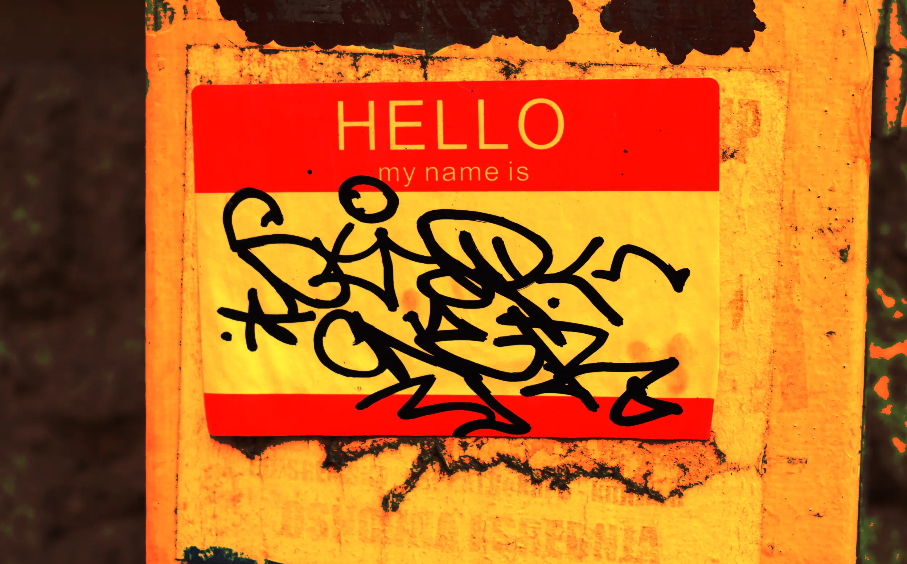

---
date:
    created: 2025-10-15T03:50:00Z
categories:
    - Explainers
authors:
    - em
    - jordan
description:
    Real-name policies have existed for over a decade, but these problems have become exponentially harmful in today's world. It's time to fight back against this unsafe and discriminatory privacy-invasive practice.
schema_type: AnalysisNewsArticle
preview:
  cover: blog/assets/images/real-name-policies/realname-cover.webp
---

# Real-Name Policies: The War Against Pseudonymity

<small aria-hidden="true">Illustration: Em / Privacy Guides | Photo: Marija Zaric / Unsplash</small>

Real-name policies have existed for well over a decade already, and the problems they cause aren't new. But these problems have become exponentially harmful in today's world, where real-name policies are coupled with monopolistic platforms, increased mass surveillance, AI technologies, and facial recognition capabilities. It's time to fight back against this unsafe and discriminatory privacy-invasive practice.<!-- more -->

Pseudonymity, or the use of a nickname or fictitious name online, has always been deeply valued on the internet. It grants people protections and freedoms that are often impossible to benefit from offline.

Women, and especially women who are part of male-dominated online communities, have regularly used pseudonyms to hide their gender online in order to protect themselves from sexual harassment, stalking, and physical violence even.

Transgender and gender-diverse people also regularly use pseudonyms for protection, or use new chosen names to explore their gender identity online.

Victims of domestic violence, victims of stalkers, activists, and even journalists often use pseudonyms to protect themselves from aggressors or oppressive regimes.

**Pseudonymity saves lives.** And yet, it is constantly under attack.

## What are real-name policies exactly?

Increasingly more platforms demand that users provide their legal name and official identifications in order to keep using a platform.

So called "real-name" policies are platform policies requiring users and subscribers to sign up and display their "real name," often equated to a *legal* name.

Facebook for example claims not to require a legal name, but only the "real" name a person uses in their daily life. Yet, the social media giant regularly demands official IDs to verify this "real" name, effectively requiring people associate their account with their *legal* identity.

Facebook has even repeatedly taken the liberty to decide which name was "real", and changed the displayed name of users based on verification processes **without any prior consent from users**. For people in vulnerable situations, this can be a *very* dangerous practice.

Facebook is perhaps the most infamous platform implementing such discriminatory and intrusive policy, but sadly, it's not the only one.

Increasingly more platforms demand that users provide their legal name and official identifications in order to keep using a platform. And this will likely be aggravated significantly by the recent trend for [age-verification](https://www.privacyguides.org/videos/2025/08/15/age-verification-is-a-privacy-nightmare/) policies.

### Explicit and implicit policies

There is always two levels of real-name policies: The name displayed publicly to everyone (explicitly required), and the name the platform has associated with the account in its database (implicitly associated).

While a requirement to expose one's legal name publicly has clear privacy risks, storing legal names without displaying it to other users is also problematic.

For explicit requirements, users who are obligated to display their legal name publicly are not only forced to create a permanent association of this account with their legal identity (with all the problems this can bring), but are also potentially exposing their identity and account to current or future attackers.

For example, this can and does enable stalkers to find their victims online (and offline) to cause them harm.

For implicit associations, as soon as a legal name is collected and associated with an account in the backend, whether from providing official documentation for age verification, account recovery, payment, or any other processes; this data is at risk of getting leaked or breached, and eventually shared publicly as well.

Once this data is [exposed](https://discuss.privacyguides.net/t/discord-data-breach-customers-personal-data-and-scanned-photo-ids-leaked/31904), this account now also becomes permanently associated with a legal identity, publicly.

Even without having an openly stated real-name policy, platforms collecting official documentation—or otherwise storing legal names associated with accounts—can effectively end up exposing their users to similar risks.

### What is a real name anyway?

Of course, your true *real* name is whatever you decide others should call you. Only *you* can decide this, and others should be respectful of your choice.

Your *legal* name, however, is a **data marker attached to your person that can be used to trace many of your activities online and offline**, with a high degree of precision going as far back as when you were born.

For everyone, but especially for vulnerable communities, exposing legal names on certain platforms can represent a significant risk. The [use of pseudonymity](https://www.techradar.com/pro/vpn/using-your-real-name-on-social-media-heres-why-you-should-think-twice) is a critical part of online safety, and people should be able to continue using this protective measure without raising suspicion.

## Who is impacted the most by real-name policies?

Everyone is impacted by real-name policies, but groups that are at higher risk of discrimination, violence, and online harassment are disproportionally harmed by them.

Moreover, anyone who for various reasons uses a name that doesn't match their official ID; has a legal name that doesn't match an expected American name pattern; needs to conceal their gender online for safety; or has to protect their identity online due to their work as an activist, journalist, dissident, or whistleblower can be severely impacted, silenced, and even endangered by requirements to provide a legal name online.

### Victims of domestic violence

For many people, using pseudonyms isn't just a good privacy practice, but it can be a matter of life and death.

For anyone who is experiencing or has experienced domestic violence, creating a new online identity hidden from the perpetrator can be essential for survival, to prepare a safe escape, or to keep having access to essential support and resources.

When people are forced to only use one identity online, an identity attached to their legal identity, this empowers aggressors to find their victims, to silence them, to control them, and to harm them.

**Technologies and policies are never neutral.** When policies and features make it difficult or impossible for vulnerable people to use these technologies safely, they are effectively excluding vulnerable people from the platforms.

Even if this might seem minor from the outside, when Big Tech becomes so monopolistic that it's almost impossible to fully avoid it in our daily lives, when someone cannot access social groups and support without a Facebook account, and can't find a new job without LinkedIn, then it's not just a minor problem anymore, it's a major problem.

**Platforms and online services should be safely accessible to everyone.** And this includes allowing the use of protective pseudonymity without requiring legal identification that could put the most vulnerable in life-threatening situations.

### Victims of stalking

Similarly to victims of domestic violence, victims of stalking must protect their identity online to stay safe from their stalkers. When platforms obligate people to use their legal names, explicitly or implicitly, they directly endanger these victims.

If a stalker or an aggressor knows a victim's legal name (which is often the case), then it's trivial to find their account on any platforms and services, regardless of if they have blocked them on one.

A good protection to prevent severe harassment is to create alternative accounts using a different name or different pseudonym unknown to the aggressor. This can give victims the peace of mind of knowing their stalker will not be able to find them there.

For anyone tempted to argue real-name policies reduce the number of perpetrators, this isn't the case.

Stalkers and predators of all kind feel generally quite comfortable using their own legal names, this isn't a problem for them. They feel confident knowing that victims generally have little recourses and support, and that there will be no consequences for them even when their legal name is known.

Despite the claims, removing pseudonymity doesn't remove misbehavior online, this has been demonstrated [again](https://theconversation.com/online-abuse-banning-anonymous-social-media-accounts-is-not-the-answer-170224), and [again](https://theconversation.com/online-anonymity-study-found-stable-pseudonyms-created-a-more-civil-environment-than-real-user-names-171374), and [again](https://allabouteve.co.in/harassment-of-women-on-linkedin/). Real-name policies don't reduce crime, it only restricts the victims' ability to protect themselves from such crime.

### Activists and political dissidents

Pseudonyms are hardly modern phenomena, and it's fair to say democracy wouldn't exist without it.

For activists and political dissidents around the world, using pseudonymity online can be a way to reclaim freedom of speech and criticize power in a safer way. Under oppressive regimes, online privacy can mean life or death.

This is another example showing how essential privacy rights are to democracy. **Real-name policies facilitate censorship, discrimination, and political repression.**

A Honduran blogger using the pseudonym [La Gringa](https://lagringasblogicito.blogspot.com/2011/10/my-ripples-will-continue.html) used her blog and Facebook page to criticize the Central American government for years.

Protecting her legal identity is essential to allow her to speak freely and stay safe from state repression. This isn't an exaggeration, Honduras is one of the most dangerous country for journalists. The Committee to Protect Journalists (CPJ) [recorded](https://latamjournalismreview.org/articles/almost-five-years-after-murder-of-honduran-journalist-gabriel-hernandez-authorities-still-waiting-for-results-of-their-investigations/) that 37 press workers were killed in the country between 1992 and 2023. Of these murders, 90% were unpunished.

But Facebook silenced La Gringa with its real-name policy, requiring her to provide a copy of her official ID to continue advocating on the platform. Evidently, this request is asking her to put her life in danger and cannot be compromised on.

Facebook's policy is essentially silencing any dissident and marginalized voices in oppressive regimes.

By letting the community report infractions to Facebook's real-name policy, this effectively allows Facebook's rules to be weaponized against marginalized groups already plagued with constant discrimination.

It also empowers abusers to silence their victims, and sides with oppressive regimes around the world to censor any critics they might have.

As reporter Kevin Morris [commented](https://www.dailydot.com/news/la-gringa-facebook-ban-real-id-dangerous-honduras/) in his Daily Dot piece on the topic: "Pseudonyms are hardly modern phenomena, and it's fair to say democracy wouldn't exist without it."

### Women

A site which requires real/verified names is automatically flagging itself as a potentially/probably unsafe space for women, or for anyone else at risk of harassment, violence, job discrimination, and the like.

Women have long used pseudonyms on the internet in order to conceal their gender online, and spare themselves from the sexual harassment and discrimination omnipresent on some platforms. This is even more common in male-dominated communities like online gaming, for example.

It's not rare to hear some people claiming that "there aren't any women in their online community." Well, there probably is.

Platforms allowing pseudonyms foster a culture of inclusivity where everyone can participate free from discrimination, regardless of their gender. Real-name policies encourage the opposite: platforms where participants are forced to either endure the abuse and compromise their physical safety, or be excluded entirely.

As pseudonymous author *skud* [wrote](https://geekfeminismdotorg.wordpress.com/2010/06/10/hacker-news-and-pseudonymity/) for the *Geek Feminism* blog in 2010:

> [...] women online are regularly admonished to use pseudonyms to protect themselves. Many websites with a culture of pseudonymity [...] have a very high proportion of female members, perhaps in part because of the sense of privacy and security that pseudonymity brings. A site which requires real/verified names is automatically flagging itself as a potentially/probably unsafe space for women, or for anyone else at risk of harassment, violence, job discrimination, and the like.

Women aren't exactly a minority group. While platforms should be inclusive to everyone of course, including minority groups, enforcing a policy that obligates roughly 50% of the population to lower its safety protections in order to participate should be obviously unacceptable.

### Indigenous people

Notwithstanding its own policy, Facebook has regularly suspended accounts with legal names wrongly targeted as fake, based on criteria rooted in colonialism. Indigenous communities have been exceedingly impacted by Facebook's real-name policy, despite following all the platform's rules as requested.

In 2009, Facebook abruptly [cut off account access](https://ictnews.org/archive/facebook-no-friend-to-american-indian-names/) to an Indigenous American woman named Robin Kills The Enemy, wrongly accusing her of registering under a false name. But her name was authentic, and indeed her *legal* name.

Facebook eventually reinstated her account, but only after a long process where she had to modify the spelling.

The burden shouldn't be on Indigenous people to have to prove their identity just because a US-based corporation can't seem to understand the global diversity of naming conventions.

Following Kills The Enemy's experience, a journalist started a Facebook group called "Facebook: don't discriminate against Native surnames!!!" that was joined by over a thousand people only a few days after its creation. Many users shared similar experiences and questioned the platform's treatment of Indigenous surnames.

Another woman named Melissa Holds The Enemy described a month-long process to recover her account.

An Indigenous man named Oglala Lakota Lance Brown Eyes had his account [suspended](https://colorlines.com/article/native-americans-say-facebook-accusing-them-using-fake-names/) by Facebook demanding his "real" name.

After Brown Eyes sent all the required proofs, Facebook decided without warning to Americanize his displayed name to "Lance Brown." **This is blatant racism.**

His name was eventually corrected and Facebook apologized, but only after Brown Eyes threatened the company with a class action lawsuit.

Dana Lone Hill also got her account suspended because of her Indigenous surname, and was forced to go through Facebook's intrusive verification process in order to recover her account.

The list goes on and on. Indigenous people have been forced by Facebook to modify and Americanize their *actual legal names*.

Many were forced to add hyphens, change the alphabet used, smash words together, or even remove parts of their legal name in order to please Facebook's arbitrary preferences, ignoring its own "real-name" policy.

This is yet another demonstration of systemic racism perpetrated by a monopolistic corporation quick to ignore the human rights and diversity of its users.

### People with non-Anglophone names

In another case, a woman from Japan named Hiroko Yoda [wasn't able to sign up](https://www.telegraph.co.uk/news/newstopics/howaboutthat/2632170/Woman-called-Yoda-blocked-from-Facebook.html) for a Facebook account due to her surname.

Despite being a common surname in Japan, it seems Facebook judged it more important to ban anyone trying to "impersonate" the popular Star Wars character.

Of course, the Star Wars character uses a Japanese name because its creator has drawn [inspiration](https://en.wikipedia.org/wiki/Yoda#Creation) from the Japanese culture. But Facebook still seems to somehow think that Star Wars comes first, and Japanese people must pay the price for daring to share a surname with the American Jedi.

A Facebook user from Hawaii named Chase Nahooikaikakeolamauloaokalani Silva also had his account suspended despite using his legal name.

As a proud Hawaiian, it was important for him to be able to display his Hawaiian given name. But Facebook just didn't like his *legal* name.

Silva reported to [HuffPost](https://www.huffpost.com/entry/facebook-chase-nahooikaikakeolamauloaokalani-silva_n_5833248) that "Facebook should not be able to dictate what your name is, what you go by, what you answer to," and he's right.

More broadly, Facebook's policy [prohibits](https://en.wikipedia.org/wiki/Facebook_real-name_policy_controversy) name with "too many" words, capital letters, or first names with initials. This assumes the default for names is the Americanized format of one first name, one (short) middle name, and one last name.

But this isn't a reality for most of the world. This extremely narrow vision of what a name should look like and how it should be formatted isn't compatible with many if not most cultures.

It's unbelievable (and unacceptable) that a platform with an estimated 2.28 billion active users, who seems to want to eat even more of the world every year, is being so ignorant of non-American cultures and global naming conventions in its policies and practices.

### The transgender community

For transgender and gender-diverse individuals, their legal name may be a "[dead name](https://en.wikipedia.org/wiki/Deadnaming)." A dead name is a name that they were assigned at birth but no longer identify with. Commonly, transgender people change their name as part of their gender transition.

In many countries around the world, there can be many bureaucratic hurdles required to change one's name, meaning that many trans people are unable to update their legal name to reflect their gender identity. Because they no longer identify with their dead name, keeping it private is of great importance for their mental health and safety.

23% of LGBTQ+ young people reported that they have been physically threatened or harmed in the past year due to either their sexual orientation or gender identity.

Referring to a trans person with their dead name is considered offensive and often involves misgendering someone too. For transgender people, being called a name that they no longer identify with invokes feelings of depression, anxiety, gender dysphoria, and lack of acceptance.

Using someone's dead name signals that you don't respect their identity and that you don't care about them enough to use their new name.

Unfortunately, transgender people still face widespread discrimination, that's why "dead naming" can be incredibly dangerous. Revealing someone's gender identity or sexuality without their consent is called "outing". By calling someone by their dead name, you may be inadvertently revealing someone is transgender. This can be not only traumatizing and frightening for the individual, but can also lead to violence or put this person in a dangerous situation.

The Trevor Project, a non-profit LGBTQ+ organization, conducts a yearly [survey](https://www.thetrevorproject.org/survey-2024/?_hsmi=305272848) on LGBTQ+ youth across the United States. In their 2024 release, they found that "23% of LGBTQ+ young people reported that they have been physically threatened or harmed in the past year due to either their sexual orientation or gender identity."

This is why when real-name policies come in, requiring transgender people to use their legal name for their social media accounts, this could force them to "come out" by displaying a name that they no longer identify with, therefore revealing they are transgender. The National LGBTQ Institute on Intimate Partner Violence [describes](https://lgbtqipvinstitute.org/coming-out-safely/) "coming out" as an "ongoing process, by which a person shares aspects of their identity with others."

Having aspects of their identity shared without their consent can put this person in significant physical danger because of unsupportive family members, friends, colleagues, and strangers. This is especially the case with LGBTQ+ youth, who are at heightened risk of online, verbal, physical harassment, or violence due to their identity.

Coming out can be a very daunting and scary process, particularly for transgender and gender-diverse people, and often can be an ongoing process over many years. In many cases, LGBTQ+ people choose instead to [hide their identity](https://www.stonewall.org.uk/news/new-research-shows-almost-40-of-lgbtq-employees-still-hide-their-identity-at-work) at social and work gatherings.

Platforms that enforce real-name policies take away the essential ability to control when and how that process plays out are nothing short of abusive. This might sound hyperbolic, however, "outing" is often used as a mean of control in abusive relationships to coerce an LGBTQ+ individual. The fact that social media platforms are exhibiting similar behavior is alarming.

Unfortunately, many websites don't allow updating the name attached to an account easily, often requiring to provide legal documentation showing proof that the name has been legally changed.

Having to provide your identification documents to use a website is not only terrible for your privacy, as it links your real life identity to your online account, it also puts your identity at risk.

Companies that process and verify identity documents are at a much higher risk of being targeted by malicious actors, because of the sensitive information they store and process.

One of the worst offenders of this is Facebook. They require everyone that signs up to use their legal name for their profile, and claim that this is to ensure safety on the platform so that everyone knows who they are talking to is who they say they are.

Many transgender and gender-diverse people use aliases on social media platforms to protect their identities and the identities of those around them, because they are more likely to be harassed or doxxed. Facebook's real-name policy has unforeseen consequences for these people, as one transgender Facebook user [found out](https://www.dailydot.com/news/facebook-real-names-cracking-down-transgender/):

> I woke up to find my Facebook account deleted. [...] I have had a Facebook since about 2007 or 2008. Other than when I was a kid and was afraid my parents would find out about my account (causing me to use an alias for a little while), my profile always bore my legal name. A week or so ago, however, I changed my display name to "Arc Angel."

Finally, because of the discrimination and danger that transgender people face in the real world, they often find refuge in online and internet communities. According to a report by [Hopelab](https://assets.hopelab.org/wp-content/uploads/2025/03/2025-Without-It-I-Wouldnt-Be-Here.pdf) of LGBTQ+ youth:

> Transgender young people more often agree that their online communities and friendships were important or very important (84%) when they began to explore their sexuality or gender compared to cisgender LGBQ+ young people (71%).

This is why it’s so important that they are able to freely express themselves with a pseudonymous or anonymous identity. If every online platform required these users to use their legal name, this would be extremely dangerous for transgender and gender-diverse people who often rely on online spaces for community, friendship, and support.

### LGBTQ+ people

Moreover, real-name policies disproportionately affect LGBTQ+ people, as they often prefer to not associate their legal name with their online activities. This is especially important for people living in countries where LGBTQ+ identities are [criminalized by law](https://en.wikipedia.org/wiki/Criminalization_of_homosexuality), meaning they can be jailed (or worse) if they associate their online activities with their real life identity.

Unfortunately, it gets even worse: harassers and trolls have weaponized Facebook's real-name policy, and are using it to silence their victims by mass reporting them as using a fake name.

In an [open letter](https://www.eff.org/document/open-letter-facebook-about-its-real-names-policy) to Facebook about its real-name policy in 2015, many LGBTQ+ and digital rights organizations warned Facebook that this was being used to silence LGBTQ+ people:

> Facebook users in the global LGBTQ community, South and Southeast Asia and the Middle East report that groups have deliberately organized (sometimes even coordinating via Facebook) to silence their targets using the "Report Abuse" button.

Despite all the recommendations and warnings by LGBTQ+ organizations and digital rights groups more than ten years ago, Facebook is still standing strong in its intention to keep the platform a "real name" only space.

Their help center still [states](https://www.facebook.com/help/229715077154790/Names+allowed+on+Facebook/) that you can only use a name that appears on your official identification documents:

> The name on your profile should be the name that your friends call you in everyday life. This name should also appear on a form of ID or document from our ID list.

Many platforms have been trying to improve the way they handle this and allow for users to select a preferred name that is displayed instead of their legal name. This is an improvement, however it isn't without issues.

Platforms shouldn't require you to provide your legal name to begin with.

### Stage performers and small businesses

In 2014, Facebook made the news for ramping up its real-name policy and suspending hundreds of accounts from marginalized and vulnerable people (more on this in the [next section](#facebook)). The platform was heavily criticized, and Facebook eventually reinstated many banned accounts.

At the time, drag performers were [severely impacted](https://www.cnn.com/2014/09/16/living/facebook-name-policy/) by the policy purge. Drag queen and activist Sister Roma reported having to change her Facebook profile to a legal name she had not used publicly for 27 years.

Retired burlesque dancer Blissom Booblé explained that using a pen name on Facebook was essential to continue her advocacy for LGBTQ+ homeless youth and to raise HIV awareness while staying free from discrimination at her workplace.

Drag queen Ruby Roo reluctantly complied with Facebook's policy in order to keep contact with his friends, but expressed concerns that people would not recognize him under his legal name. If nobody ever calls you by your legal name, does this still even count as your "real" name?

During an earlier purge in 2009, small-business entrepreneur Alicia Istanbul [suddenly lost access](https://www.sfgate.com/business/article/Real-users-caught-in-Facebook-fake-name-purge-3231397.php) to both her personal Facebook account and her jewelry design business page. Once this happens, the burden falls on users to carry on the lengthy and intrusive verification process to restore their accounts.

**There is no innocent until proven guilty with Big Tech.** This can represent significant losses in time and money for small businesses.

Additionally, many professionals such as teachers, doctors, therapists, and social workers regularly use pseudonyms so that clients and patients will not be able to find their personal accounts.

Everyone should have the right to separate their professional lives from their personal lives, and [using pseudonyms is a great practice](stay-safe-but-stay-connected.md/#pseudonymity) to this effect.

### Everyone else

Finally, everyone can be impacted negatively by real-name policies, not only marginalized or vulnerable groups.

Everyone should be able to choose the protections necessary for themselves, according to their own and unique [threat model](https://www.privacyguides.org/en/basics/threat-modeling/). If someone decides it's safer or more comfortable for them to use a platform under a pseudonymous account, they should be able to do so freely.

Privacy is a basic human right, and it should be accessible to all without requiring any justification.

The normalization of real-name policies online, aggravated by the growing identity and age verification industry, will have devastating consequences for everyone, and for democracies everywhere. **Real-name policies are authoritarian in nature and have a chilling effect on freedom of speech and other civil liberties.**

If we value privacy as a human right, we must push back against real-name policies, especially on social media.

## Where are real-name policies?

About ten years ago, pseudonymity became a heated news topic during the so-called [Nymwars](https://en.wikipedia.org/wiki/Nymwars), the wars against pseudo*nyms*.

The term mostly refers to a series of conflicts related to real-name policies in the 2010s. It emerged in relation to waves of policy enforcement from Facebook, Google, and the video-game giant Blizzard.

With the increasing push for age verification and "human authentication" online, the Nymwars are sadly likely to make a comeback very soon. And for some platforms, the war just never stopped.

Sometimes, your legal name might be required online of course. For example, for governmental and financial services. But way too many platforms and services collect legal names when there really isn't any strong justifications for it.

While Facebook was mentioned abundantly in previous examples, this problem isn't limited to Meta's social media. You've probably encountered real-name policies everywhere already, but here are some platforms (and even countries) that have been infamous for it:

### Facebook

In 2014, Facebook [made the news](https://www.aclunc.org/blog/my-name-why-aclu-facebook-today) (again) for enforcing a [horrible policy](https://www.zdnet.com/article/facebook-nymwars-disproportionately-outing-lgbt-performers-users-furious/) (again) that was [hurting](https://www.eff.org/deeplinks/2014/09/facebooks-real-name-policy-can-cause-real-world-harm-lgbtq-community) marginalized and vulnerable groups the most ([again](https://www.hrc.org/news/metas-new-policies-how-they-endanger-lgbtq-communities-and-our-tips-for-staying-safe-online)).

Several human rights groups, including the Electronic Frontier Foundation, Human Rights Watch, and Access Now even joined the [Nameless Coalition](https://www.accessnow.org/nameless-coalition-calls-on-facebook-to-change-its-real-name-policy/) to demand changes to Facebook's policy.

Facebook presented this ramping up of their real-name policy enforcement as something important for "authenticity" online. Despite this dubitable claim, Facebook was in all likelihood simply worried about protecting its financial assets, as ever.

Back in 2012, Facebook's share price plummeted after a quarterly filing with the Securities and Exchange Commission [revealed](https://www.theguardian.com/technology/2012/aug/02/facebook-share-price-slumps-20-dollars) that an estimated 8.7% of accounts on the platform may be fake, and 5% of active accounts were duplicates (numbers that aren't really that alarming, actually). But this backlash from investors evidently scared Facebook enough to justify intensifying its policy enforcement for accounts using pseudonyms, or suspected of being fake, presumably in an attempt to soothe shareholders.

Despite the unpopularity of these policies, the real customer for Facebook isn't its users, but its advertisers (who demand access to your data, Facebook's true product).

Advertisers want some assurance that they are paying for *real* humans to see their ads, otherwise this diminishes Facebook's value to them. **It's important to remember that Facebook is, and has always been, an advertising company.**

Despicably, Facebook even [encouraged](https://thenextweb.com/news/facebook-now-wants-snitch-friends-arent-using-real-name) people to "snitch on [their] friends if they are not using their real name."

> Please help us understand how people are using Facebook. Your response is anonymous and won't affect your friend's account. Is this your friend's real name?

This kind of prompt fosters mistrust and allows users to weaponize policies against people they simply don't like. Victims of these "report attacks" are often the most vulnerable and the most marginalized in our society. **Real-name policies have nothing to do with safety, in fact, they're horrible for safety.**

A decade later, Facebook still encourages and enforces its real-name policy in order to protect its most valuable asset to sell: Your personal data.

### LinkedIn

LinkedIn is another well-known platform that enforces a real-name policy.

The employment-oriented social media states in its [User Agreement](https://www.linkedin.com/help/linkedin/answer/a1337288/names-allowed-on-profiles) that "LinkedIn does not allow members to use pseudonyms, fake names, business names, associations, groups, email addresses, or special characters that do not reflect your real or preferred professional name."

It's unclear how LinkedIn would enforce or verify what is an allowed "preferred professional name."

Although this might make slightly more sense on a platform focused on employment, the policy still excludes some professionals and industries that regularly work using pseudonyms, such as performers, writers, visual artists, activists, and privacy advocates even.

Additionally, the platform uses the same colonialist discrimination as Facebook, assuming that all names worldwide are composed of "first, middle, and last names" only.

### Google, Quora, and Blizzard abandoned their policies

Google made the news in 2011 when it started implementing and enforcing its own real-name policy for its (now defunct) social media platform Google+, and by proxy for YouTube accounts when Google [migrated](https://www.theguardian.com/technology/2014/jul/16/youtube-trolls-google-real-name-commenter-policy) YouTube comments to a Google+ system in 2013.

The policy was [largely criticized](https://www.eff.org/deeplinks/2011/07/case-pseudonyms) after a wave of account suspensions, where some famous accounts were banned. In July 2014, Google [abandoned](https://en.wikipedia.org/wiki/Nymwars#Google) the policy altogether and removed restrictions on account names.

The question-answering social platform Quora also enforced a real-name policy for a long time.

Verification wasn't required, but names deemed "false" could be reported by the community. Again, this kind of reporting system facilitates abuse by allowing the weaponization of platform policies against marginalized groups.

Thankfully, Quora [eliminated](https://quorablog.quora.com/Allowing-everyone-to-contribute-to-Quora) the requirement to use a "real" name in 2021, and now allows users to register with protective pseudonyms.

The video-game developer Blizzard Entertainment spawned strong criticism online when the company [announced](https://en.wikipedia.org/wiki/Blizzard_Entertainment#Privacy_controversy_and_Real_ID) in 2010 that it would be implementing a real-name policy for Blizzard's forums.

Gamers were not amused. The community came together to fight back in force against the announced policy. Game magazines and forums were inundated with replies and condemnations.

At one point, a Blizzard employee trying to demonstrate that the policy "wasn't a big deal" willingly shared his real name on a public post. After this revelation, forum members started to post the employee's personal information, including his phone number, age, picture, home address, and even information related to his family members.

Other members were quick to share their own experiences and show how [unsafe](https://web.archive.org/web/20100628055329/http://ve3d.ign.com/articles/news/55728/Is-Blizzards-Real-ID-Safe-Or-A-Playground-For-Sexual-Deviants) a real-name policy would be. Following the powerful community backlash, Blizzard decided to cancel its plan for the invasive policy.

### South Korea

Despite the enforcement of the system, the number of illegal or malicious postings online has not decreased.

Terrifyingly, whole countries have enforced real-name policies online. In 2007, South Korea [implemented](https://www.koreatimes.co.kr/southkorea/20120823/online-real-name-system-unconstitutional) a name registration system for internet users in compliance with the country's Information Communications Law.

The law was initially enforced in an attempt to reduce malicious comments online, but **was later ruled unconstitutional and revoked in 2012**.

The Constitutional Court said in its verdict that "the system does not seem to have been beneficial to the public. Despite the enforcement of the system, the number of illegal or malicious postings online has not decreased."

### China

Sadly, not every country implementing such a system came to the same conclusion.

In China, the [Internet real-name system](https://en.wikipedia.org/wiki/Internet_real-name_system_in_China) obligates all internet service providers and online platforms to collect users' legal names, ID numbers, and more. This affects services such as internet access, phone service, social media, instant messaging, microblogging, and online gaming.

In 2023, large Chinese platforms announced that they would make public the legal names of any accounts with over 500,000 followers.

In July 2025, China centralized this control further with the launch of the [national online identity authentication](https://en.wikipedia.org/wiki/National_online_identity_authentication) system, which requires citizens to submit their personal information in order to receive an "Internet certificate" to access online accounts.

This effectively imposes a real-name policy on *all* internet services in the country, and makes this information accessible at all time by the government.

The new national cyber ID system has been [criticized](https://www.scmp.com/tech/tech-trends/article/3318302/china-rolls-out-voluntary-cyber-id-system-amid-concerns-over-privacy-censorship) over privacy and censorship concerns.

So far, it is not mandatory to share identity through the national online identity authentication (although services are still obligated to identity their users in other ways).

However, in a country where freedom of speech and access to information is increasingly restricted, it's easy to imagine the national real-name system could become obligatory everywhere soon.

## Real-name policies don't make the web safer

It has been demonstrated again and again that real-name policies do not reduce abuse and misbehavior online, and only end up harming the most vulnerable.

Despite the evidence and failed attempts, platform owners and policymakers obstinately continue to push for the implementation of these dangerous, authoritarian systems.

Platforms will often claim these policies are to protect users from harassment, but when action is required to truly protect users they refuse to act. Facebook, the most infamous platform for enforcing its real-name policy, [ranks the *worst* for online harassment](https://www.theverge.com/news/713976/online-harassment-meta-social-media-environmental-activists).

So, who are these real-name policies truly protecting?

It's clear that, as is the case for other oppressive policies such as [Age Verification](age-verification-wants-your-face.md) and [Chat Control](chat-control-must-be-stopped.md), "safety" is only an excuse for people to accept what this is truly about: **Corporate profit and government control.**

Unfortunately, as long as these platforms' business model is to sell users' data to advertisers and other stakeholders, there is no incentive for them to protect our privacy and our right to use protective pseudonyms, as the EFF's Director of Cybersecurity Eva Galperin aptly pointed out in her [talk](https://www.youtube.com/watch?v=d5czLwsa-wE) at the HOPE conference in 2012. **More data just means more money to them.**

When governments impose similar invasive practices, it's a **dangerous and slippery slope towards totalitarianism**.

Citizens need to be able to express their views freely online and criticize their government and its leaders without fear of reprisal. Real-name policies (explicit and implicit) are only a tool for censorship, and there is no democracy and no freedom under government censorship.

Fighting against policies attacking online pseudonymity, such as real-name policies, age-verification policies, and Chat Control proposals, isn't just a banal fight to keep using silly nicknames online. It's a battle for democracy, for civil liberties, and for human rights.

## What you can do about real-name policies

- [**Choose better platforms**](https://news.elenarossini.com/my-fediverse-starter-guide) that do not require you to share your legal name and official IDs, such as [Mastodon](mastodon-privacy-and-security.md) or other platforms connected to the Fediverse.

- [**Inform yourself**](https://safetycrave.com/why-should-not-use-real-names-online/) on the dangers related to using legal names online, and share this information with others.

- [**Say no**](you-can-say-no.md) to sharing official documentation with commercial platforms when it isn't strictly required and when you can avoid it.

- [**Understand the difference**](https://www.privacyguides.org/videos/2025/03/14/stop-confusing-privacy-anonymity-and-security/) between privacy, security, anonymity, and pseudonymity.

- [**Use pseudonyms**](stay-safe-but-stay-connected.md/#practices-and-tools-that-help-in-various-contexts) on platforms where you can. Use a pseudonym persistent across platforms if you want these accounts to be linked together for trust, or use different pseudonyms to keep them separated.

- **Make your voice heard!** Contact your government representatives to let them know that privacy is important to you, and explain to them that pseudonymity is essential for safety, democracy, and free speech online. Complain against platforms using these invasive and exclusionary practices. Citizen action matters, and abusive policies can be reversed.

Remember that pseudonymity isn't anonymity

Keep in mind that only using a pseudonym isn't enough to make you anonymous online. There are many other ways to tie an identity together, such as IP addresses, [browser fingerprinting](https://www.privacyguides.org/videos/2025/09/12/what-is-browser-fingerprinting-and-how-to-stop-it/), photo comparison, facial recognition, and so on and so forth. Pseudonymity is a great practice to *improve* your privacy and safety online, but alone it does have limitations.

