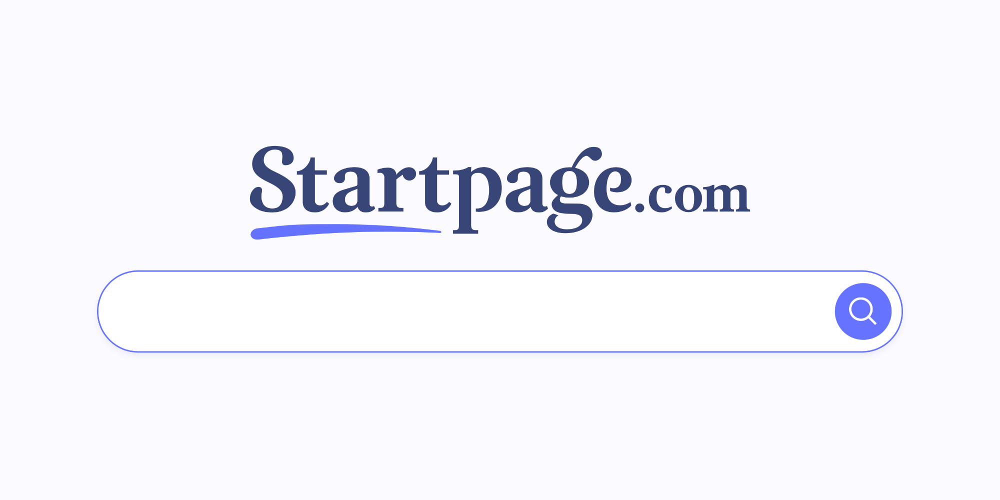

---
date:
    created: 2020-05-03
categories:
    - Announcements
authors:
    - contributors
links:
    - Search Engines: https://www.privacyguides.org/en/search-engines/
tags:
    - Search Engines
description: Startpage has been relisted in our search engine recommendations following their open communications with the Privacy Guides community.
schema_type: NewsArticle
---
# Relisting Startpage.com

Dear *Privacy Guides* Community,

In October 2019, we learned that System1 had become the majority shareholder in Startpage.com via a new System1 subsidiary, Privacy One Group. Due to the uncertainty surrounding the acquisition and the initial lack of clear communication from the Startpage team towards the privacy community, we were forced to delist Startpage from our [search engine recommendations](https://www.privacyguides.org/en/search-engines/).<!-- more --> In an [explanatory blog post](delisting-startpage.md), we asked for more clarity surrounding the situation, stating:

> ...there are still so many unanswered questions, we can no longer recommend the service with good confidence. If Startpage aims to be re-considered, they will have to answer the questions above, preferably along with an explanation of why it took them so long to get proper answers out to the public.

Shortly after this, the *Privacy Guides* team was able to get an open line of communication with Startpage.com CEO Robert Beens, who vocalized his regret for not answering our questions more quickly and providing more clarity to the community from the start. From their perspective nothing fundamental had changed due to the acquisition, except that they would now have the resources to market Startpage efficiently thanks to System1. Unfortunately, Startpage failed to put themselves in the place of their users, and understand that their lack of transparancy at the beginning would erode the trust they shared with the privacy community.

By December, Startpage had [responded](https://code.privacyguides.dev/privacyguides/privacytools.io/issues/1562#issue-737) to our questions. More recently they also clarified that [System1's privacy policy](https://web.archive.org/web/20201110100140/https://system1.com/terms/privacy-policy) does not relate to Startpage; Startpage's privacy policy remains [unchanged](https://web.archive.org/web/20201110100140/https://www.startpage.com/en/privacy-policy/):

> Having a new shareholder in the company will not change any aspect of the privacy we offer. We are a Dutch company and will continue to be so, fully complying with Dutch and EU privacy regulations (GDPR). We don’t store or share any personal data. No change either. Our clear privacy policy will stay the same. Management / founders (including myself) continue to have an important stake in the company and will continue to be fully committed to our privacy mission!

They also created new support pages clarifying the privacy implications of System1's relationship with Startpage:

- [Startpage CEO Robert Beens discusses the investment from Privacy One / System1](https://web.archive.org/web/20201110100140/https://support.startpage.com/index.php?/Knowledgebase/Article/View/1277/0/startpage-ceo-robert-beens-discusses-the-investment-from-privacy-one--system1)
- [What is Startpage's relationship with Privacy One/System1 and what does this mean for my privacy protections?](https://web.archive.org/web/20201110100140/https://support.startpage.com/index.php?/Knowledgebase/Article/View/1275/0/what-is-startpages-relationship-with-privacy-onesystem1-and-what-does-this-mean-for-my-privacy-protections)
- [What is the Startpage privacy-guarding data flow?](https://web.archive.org/web/20201110100140/https://support.startpage.com/index.php?/Knowledgebase/Article/View/1276/0/what-is-the-startpage-privacy-guarding-data-flow)

Additionally, Beens joined an [interview](https://invidio.us/watch?v=h-3fW0w2ayg) with Techlore in February answering his questions and further questions from the privacy community.

We prepared a [merge request](https://code.privacyguides.dev/privacyguides/privacytools.io/pulls/1592) in December for relisting Startpage in case we decided to do so, but did not have plans to merge it until the whole team felt confident (which we knew would take time). 5 months later, we sync'd up as a team, and decided to re-list them (with a warning explaining these events) which you can now find on our website [here](https://web.archive.org/web/20201110100140/https://www.privacytools.io/providers/search-engines). Our confidence and trust in Startpage has grown, and we're appreciative of Startpage's cooperation and willingness to address the concerns of our community.

We also hope this encourages any services that may end up being delisted for one reason or another to take action and improve themselves in this same fashion. We don't like delisting the services we've previously trusted and recommended, and we are always happy to see when steps are taken to regain community trust.

---

**2023-10-23:** This post has been edited to reflect the team's move from [PrivacyTools](https://www.privacyguides.org/en/about/privacytools/) to Privacy Guides.
