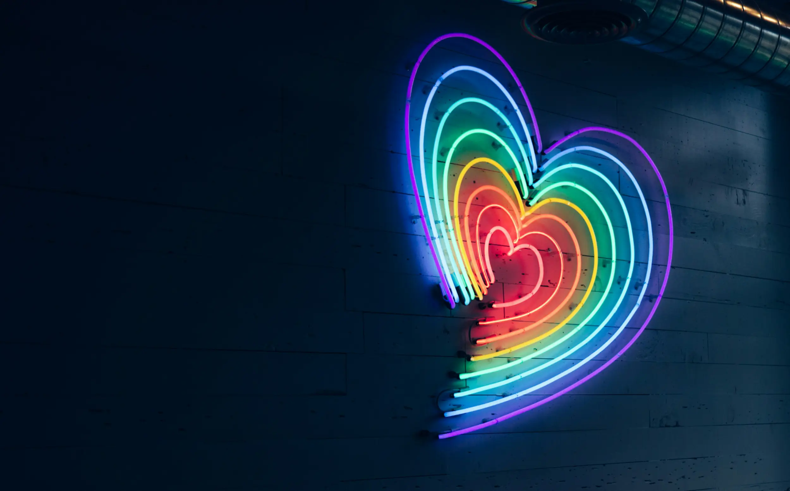

---
date:
    created: 2025-06-10T17:00:00Z
categories:
    - News
tags:
    - Pride Month
authors:
    - em
description: Balancing data protection and online connection can be difficult. Nevertheless, it's an essential skill to be able to stay safe online while staying connected.
schema_type: AnalysisNewsArticle
preview:
  cover: blog/assets/images/stay-safe-but-stay-connected/stay-connected-cover.webp
---

# Stay Safe, but Stay Connected

<small aria-hidden="true">Photo: Jiroe Matia Rengel / Unsplash</small>

In data privacy, we often talk about the dangers of data collection and exposed data. It can get overwhelming to learn more about all the information that is collected on us, especially at the beginning. As a coping mechanism, some people react by downplaying concerns, disregarding dangers, and ignoring precautions altogether. Others react the opposite way: by isolating themselves, and no longer sharing anything with anyone. But neither is a viable solution.<!-- more -->

Staying isolated to avoid *all* data exposure risks other dangers. Dangers that might not seem related to data privacy directly, but are nevertheless worth mentioning here: Suicide and depression are very real dangers that we cannot ignore.

Keeping our data safe shouldn't mean staying alone, and isolation is [especially dangerous for LGBTQ+ people](https://www.thetrevorproject.org/resources/article/facts-about-lgbtq-youth-suicide/).

The better approach is to adopt a **segmental perspective on data privacy**.

While not ignoring nor minimizing the risks, it's important to develop an awareness of which exposed data represents the biggest danger to us, which we have no control over, and which we can actually protect better.

This is the balanced way out of this Orwellian nightmare.

There are ways to stay together, to support each other, and to stay connected while also protecting our data and becoming an informed advocate for privacy rights.

## How to stay connected while staying safe

Numerous practices and tools can help to participate in online communities while also protecting one's data. There might be some sacrifices necessary of course, and each sacrifice should be weighted carefully for its benefit.

It's important to remember that the best approach to data privacy isn't an [all-or-nothing mindset](privacy-is-not-dead.md). This only leads to either giving up entirely, or getting disconnected from our communities.

The better mindset is to try to *improve* one's data privacy gradually, to *reduce* digital footprints where possible, and to continue to *advocate* for better legal and technical protections for the things we have no direct control over.

Here are some steps you can take to stay connected, while improving your digital safety:

## Practices and tools that help in various contexts

There are a number of practices that can be applied in various contexts, and will help reduce or separate your digital traces. These practices are all good to keep in mind with any platforms, accounts, and information you share.

If this is new to you, implementing *one* improvement at the time is a great way to avoid getting overwhelmed. Every small improvement will help, and add together over time.

You do not have to do all of this, only pick what works well for you and what you can realistically implement in your life. Remember that this will not make you fully anonymous online, but *reducing* your digital footprints still gives a lot of benefits.

### Pseudonymity

Pseudonymity is the practice of using a fictitious name (a pseudonym) when creating accounts to detach, even slightly, one's online presentation from their full legal identity.

There are different levels to this. It could mean sharing a first name but not a last name, using the name of a fictional character, or using an entirely made up name.

Using a pseudonym and a profile picture that isn't a self-portrait can help significantly to reduce digital footprints and improve online safety. It can also help to detach different accounts from each other, for example by using a certain name for a work account and a pseudonym for a personal alt account.

Remember that that this will not make you anonymous online, however. It will only help hide or separate your legal identity from your public-facing profile.

If you want to use more serious pseudonymity online, you will also need to consider using different email addresses to sign up, different phone numbers if required, different photos of course, but also different IP addresses, and so on and so forth.

### Virtual Private Network (VPN)

Using a [trustworthy VPN](https://www.privacyguides.org/en/vpn/) can also help to reduce the data identifying you online, and improve your pseudonymity.

Regardless of the name you choose for a profile, services (and sometimes other users even) can see your IP address. Your IP address can reveal your location more or less accurately, and can be used to identify the owner of the internet service account you use.

If you do not protect this information, services and authorities have the capacity to link all your accounts and online activities together, regardless of the name and profile picture you use.

You can mitigate this by using a *trustworthy* VPN (yes, trust is crucial here) that will act as a proxy for your IP address (and allow you to use different IP addresses for different accounts).

Your VPN provider however will still know what your real IP address is, this is why trusting your VPN provider is so important. To protect from this, you could use another method, such as the [Tor Network](in-praise-of-tor.md).

VPN blocks and security checks

Keep in mind that connecting to an account or website while using a VPN could trigger additional security checks, or even trigger blocks for certain websites and services.

Sometimes, it's simply a CAPTCHA to solve, but it could also be an alert or additional check for a social media account you usually connect to without a VPN.

In some situations, this can be resolved by selecting a different VPN server, choosing a server in the same region you are, or you might need to disable your VPN entirely to access some services.

### Browser fingerprinting

Limiting browser fingerprinting is important to reduce the data capable of identifying who you are from your browsing activity.

Even when using a pseudonym, fictitious profile picture, and trustworthy VPN, your activity could still be linked back to you simply based on how unique your system and browser configurations are.

Some [browsers](https://www.privacyguides.org/en/desktop-browsers/) offer increased protections against this type of tracking, such as Mullvad Browser and Tor Browser.

### File metadata

To protect your privacy online, it's important to remember to [delete metadata](https://www.privacyguides.org/en/data-redaction/) from the photos and files you share online. Even if you take care to not include identifying information in the photos, videos, and documents you share, you can still sometimes be easily re-identified from hidden file metadata alone.

Photos, PDF, images, and files of all sorts usually contain hidden metadata about your device, location, and more. Removing metadata before sharing photos or files is an important consideration to improve your privacy and safety online, especially when sharing files and photos publicly.

### Mobile applications

Limiting the mobile apps you keep on your devices is important, not only to improve privacy but also for device security.

Many mobile app developers use tracking technologies to collect information on users, sometimes well beyond their own app's usage. Additionally, each installed application increases the risk of potential vulnerabilities that could lower your system security.

Whenever possible, choose to use a secure browser instead of the application to access a service (unless this is an application you trust more than your browser application). If you use an Apple device, check the App Privacy section in the App Store to know what data each of your installed apps collects.

Delete all the apps you no longer need, as soon as you do not need them anymore.

Deleting the app does not delete the account

Remember that just deleting an app from your device will not necessarily delete your account and data. Depending on the service, even after deleting the app, your account might still be accessible through a web browser.

If you no longer need an account, it's important to first delete the data within it, then delete the account through the internal process, and, once this is completed, delete the application.

Otherwise, your abandoned account could still sit there and risk getting taken over by someone else, or expose your data in other ways.

### Photo sharing

When sharing photos online, especially on social media, it's essential for both privacy and safety to develop an awareness of what the information within this photo can reveal about you.

Even from a well-protected pseudonymous account, posting a photo from your home that reveals outside details could identify your location and identity. Sometimes, even details *inside* your home could pinpoint your location. Be particularly careful about reflections in glasses, mirrors, windows, and other reflective surfaces.

And of course, never share photos of others online without *their* prior consent.

## What to improve in each context

### Social media: Improving, deleting, replacing

While social media now occupies an immense role in our lives, it's unfortunately very difficult to protect one's privacy while using any corporate social media platforms.

Large commercial platforms like Facebook, Instagram, Threads, YouTube, TikTok, and X (Twitter) are fundamentally advertising businesses, and their only goal is to make more money. They achieve this goal by collecting data points on users that they sell as a feature to advertisers.

#### How to improve what you can

If you decide staying on a corporate platform is important to you, then it is crucial to harden all the settings available to improve privacy as much as allowed. Keep in mind however that this isn't a guarantee, and some platforms have already been caught [again](https://www.aa.com.tr/en/economy/facebook-to-pay-5bn-fine-for-violating-users-privacy/1540472) and [again](https://bgr.com/tech/facebook-whatsapp-privacy-fine/) not respecting their users' preferences.

Furthermore, to implement the protections discussed above, some commercial platforms are worse than others. For example, Facebook doesn't allow the use of pseudonyms anymore.

Moderation is also a safety issue to consider. If you want to choose and compare corporate platforms, the non-profit GLAAD has developed a yearly [Social Media Safety Index & Platform Scorecard](https://glaad.org/smsi/social-media-safety-index-2025/) to evaluate six major social platforms for safety for the LGBTQ+ community.

AI training on social media platforms

In addition to the privacy settings you should pay attention to, make sure to **turn off or opt out of any AI feature** you can on social media.

Unfortunately, many platforms have started to use and sell users content to train AI algorithms. This is very concerning for data privacy, and could make a lot of information about you impossible to delete from these systems afterward.

Again, remember however that there is no guarantee platforms will respect your preferences on this, and deleting and leaving corporate platforms might be the safest option.

Disclaimer for external resources

Privacy Guides does not necessarily endorse these linked websites. Links are provided as suggestions of external guides to follow for this specific purpose. We do not necessarily approve the other recommendations or guides presented on these external resources.

- [Improving privacy settings on X (formerly Twitter)](https://beconnected.esafety.gov.au/topic-library/social-media-apps/introduction-to-twitter/controlling-your-x-privacy-settings)
- [Improving privacy settings on Facebook](https://www.consumerreports.org/electronics-computers/privacy/facebook-privacy-settings-a1775535782/)
- [Improving privacy settings on Instagram](https://www.consumerreports.org/electronics-computers/privacy/instagram-privacy-settings-a3036233134/)
- [Improving privacy settings on Threads](https://www.myprivacy.blog/threads-privacy-setup-a-2025-technical-guide-for-users-under-25/)
- [Improving privacy settings on YouTube](https://www.groovypost.com/howto/manage-your-youtube-privacy-settings/)
- [Improving privacy settings on TikTok](https://www.maketecheasier.com/tiktok-privacy-settings/)
- [Improving privacy settings on Reddit](https://www.myprivacy.blog/reddit-privacy-guide-securing-your-presence-in-2025/)
- [Improving privacy settings on LinkedIn](https://www.presencesecure.com/linkedin-privacy-settings-guide/)

Additionally, with [the proliferation of age verification](age-verification-wants-your-face.md) regulations, more commercial platforms might soon not only require a legal name, but also require providing an official ID in order to continue using the platform, severely damaging online privacy for everyone.

In light of this, it might be a better idea to leave these intrusive and data exploitative platforms altogether, while deletion is still an option.

#### How to delete corporate social media accounts

[Deleting the accounts](https://www.privacyguides.org/en/basics/account-deletion/) you no longer use is an essential habit to adopt in order to improve both privacy and security online.

Unused accounts leave a data trail that can get exploited by platforms unchecked, for example with the recent addition of terms of service to allow [using all content for AI-training purposes](https://www.pcworld.com/article/2343263/facebook-wants-to-use-your-posts-for-ai-training-how-to-object.html). Moreover, keeping abandoned accounts increases significantly the risk of account takeover and data leak.

A healthy privacy habit is to request account and data deletion as soon as an account is no longer needed, rather than leaving the account abandoned.

Remember before deleting!

Before deleting any account, always make sure to:

1. Deactivate any sign-in option you might have used this account with. For example, if you use the sign in with Google or Facebook option with other accounts, make sure to log in these accounts and select another way to connect that doesn't rely on the account you are about to delete.

2. If you need to keep a copy of your own data, make sure to download and verify it before you delete the account.

3. In some situations, it can help to delete information within the account first. Go through your profile and delete or modify what you can manually.

4. If you want to stay in contact, inform the people you usually contact through this account of an alternative way to contact you.

- [Deleting X (formerly Twitter) posts](https://cyd.social/download/)
- [Deleting X (formerly Twitter) account](https://lifehacker.com/how-to-delete-your-x-account)
- [Deleting Facebook](https://lifehacker.com/tech/how-to-delete-your-facebook-account)
- [Deleting Instagram](https://lifehacker.com/tech/how-to-deactivate-or-delete-your-instagram)
- [Deleting Threads](https://www.pcmag.com/how-to/how-to-delete-threads-without-getting-rid-of-your-instagram-account)
- [Deleting YouTube (Google)](https://www.tech2geek.net/how-to-delete-your-youtube-account-2025-step-by-step-guide/)
- [Deleting TikTok](https://www.techlifeunity.com/delete-tik-tok-account)
- [Deleting Reddit](https://lifehacker.com/tech/how-to-delete-your-reddit-account)
- [Deleting LinkedIn](https://www.maketecheasier.com/how-to-delete-linkedin-account/)

#### Which better platforms to use to stay connected

While any data publicly accessible online can technically be collected by anyone, using alternative platforms that aren't advertising businesses can still greatly improve your data privacy online.

For example, platforms that are part of the Fediverse social network are predominantly non-profit, open-source software using a collection of connected servers generally run by volunteers.

The incentive isn't to monetize users data at all, the goal is simply to support the community. This is a *crucial* difference.

When moving to non-corporate platforms, you should also adopt all the good privacy practices listed above. The good news is you will not encounter resistance to do so there. These platforms will not endlessly exploit your data internally, like big tech social media does.

Fediverse-connected platforms tend to value users privacy and security much more. Because **their goal isn't to make profit from your data**.

You will still need to go through the settings to adjust and harden your privacy preferences, but you'll see already that almost no personal data is required to sign up, and there will be no advertising profile tracking you around (and no ads!).

- [Replacing X and Threads with :material-arrow-right-bold: Mastodon](https://joinmastodon.org/)
- [Replacing Facebook with :material-arrow-right-bold: Friendica](https://friendi.ca/)
- [Replacing Instagram with :material-arrow-right-bold: Pixelfed](https://pixelfed.org/)
- [Replacing YouTube with :material-arrow-right-bold: PeerTube](https://joinpeertube.org/)
- [Replacing TikTok with :material-arrow-right-bold: Loops](https://joinloops.org/)
- [Replacing Reddit with :material-arrow-right-bold: Lemmy](https://join-lemmy.org/)
- [Replacing Meetup or Facebook Groups with :material-arrow-right-bold: Mobilizon](https://mobilizon.org/)

### Private messaging: One-on-one and group chats

Many of the dangers described for social media also exist for messaging services.

When it comes to private messaging, you cannot trust any software that does not protect your communication with solid *end-to-end encryption*.

End-to-end encryption is a protection that will prevent third parties (including the platform itself) from having access to your messages. When well implemented, only the intended sender(s) and recipient(s) will have access to the messages your send using end-to-end encryption.

Popular messaging services and platforms such as [regular SMS](https://www.privacyguides.org/videos/2025/01/24/its-time-to-stop-using-sms-heres-why/), Discord, Slack, and most social media direct messages unfortunately do not offer this protection, and are horrible for data privacy.

Even messaging apps like WhatsApp, Facebook Messenger, Snapchat, and Telegram, that *can* be used with *some* end-to-end encryption, have other important data privacy problems that make them difficult to trust.

#### Signal

One of the best free end-to-end encrypted messenger you can use at this time for one-on-one and group conversations is [Signal](https://signal.org/).

While Signal requires a phone number to sign up, it will not collect any other data from you. Once installed, [activating the usernames feature](https://support.signal.org/hc/en-us/articles/6712070553754-Phone-Number-Privacy-and-Usernames) and adjusting phone number privacy is important to prevent sharing your phone number with others. That way, you will be able to simply share your *username* to start communicating with anyone.

Moreover, the [disappearing messages feature](https://support.signal.org/hc/en-us/articles/360007320771-Set-and-manage-disappearing-messages) will greatly help to reduce your data trail. Remember however that this will not prevent a malicious recipient from downloading or taking screenshots of the sensitive information you share with them. This is true for any service with disappearing messages. Only send sensitive information and photos to people you trust, even when using disappearing messages on encrypted platforms.

#### Other end-to-end encrypted messengers

While Signal might be the most popular and easier to use, there are many other instant messaging apps that offer solid end-to-end encryption features.

Some will not even require a phone number to sign up. However, because they are less popular, it might be more difficult to find other users willing to use them with you to communicate.

They also offer different features and experiences, that you might prefer, or not. If you prefer to use a different application, you can have a look at our other [recommended instant messaging](https://www.privacyguides.org/en/real-time-communication/) applications.

#### Matrix with Element

[Matrix](https://matrix.org/) is an open network for decentralized communication. This network uses a collection of connected servers, and can be accessed using different [client applications](https://matrix.org/ecosystem/clients/). Matrix clients will offer different experiences and features, and be available on different systems.

Using Matrix with the open-source client [Element](https://element.io/) is a good alternative to Slack and Discord's chat rooms. The Matrix protocol allows chat rooms to use end-to-end encryption.

Not all rooms are end-to-end encrypted

Remember that not every room uses end-to-end encryption on Matrix. You can verify this in Element, from the detailed room information panel, by the "Encrypted" or "Not encrypted" badge under a room's name.

Again, because this open-source protocol is developed by a non-profit organization, the goal isn't to collect data on users. There is no incentive to monetize users' data, and because of this, choosing these better alternatives will greatly improve your data privacy compared to using commercial platforms.

#### End-to-end encrypted emails

For email communication, moving away from large providers such as Google and Microsoft can improve your communication's privacy immensely.

Large providers of free email services tend to collect a lot of data on their users, sometimes including the content of their communications. Moving to a service that uses end-to-end encryption and better practices around metadata offers significant benefits.

Proton Mail and Tuta are two services implementing end-to-end encryption to protect the content of users' messages. For more details and options, you can look at our recommended [email services providers](https://www.privacyguides.org/en/email/) page.

Of course, when using any of these services, you will still have to take into account to whom you are sending the email. For end-to-end encryption to properly protect data both in transit and at rest, the sender needs to use a service *compatible* with the recipient.

There are methods and third-party applications that can be used to encrypt and decrypt a message from a provider that does not offer end-to-end encryption, but this adds additional steps casual users might not feel comfortable getting into.

That being said, if you use a Proton Mail address to email another Proton Mail user, by default all communication's content will be fully encrypted, and only accessible to you and the intended recipient. Similarly, if you use Tuta to email another Tuta user, communication will be fully end-to-end encrypted.

Communications between different providers will likely require additional steps, however, or will not benefit from end-to-end encryption on the server where the message is sent. For example, when sending an email from a Proton Mail to a Gmail account, if no additional protections are used, the content of this message will still be accessible to Google on the recipient's side.

All of this to say, be mindful when using email communication to exchange sensitive data, and make sure to verify inter-service compatibility to stay fully protected.

Even considering this, using a Tuta or Proton Mail account to communicate even with people using unencrypted services still has the benefit that your communication will at least be stored fully encrypted on *your* side.

### Online dating: Balancing authenticity and caution

Unfortunately, it is still extremely difficult to protect sensitive data while using dating apps. Very few dating apps are careful about protecting user's data properly, and many breaches have already happened to confirm this.

Moreover, using a dating app cannot be done completely anonymously. Inevitably, at least some photos or some personal information need to be shared. Pseudonymity on dating app can come at the cost of authenticity, which is very important when dating.

While not sharing someone's last name and address is certainly a recommended and cautious measure, not sharing any photos or any personal information isn't really an option in this context.

What can be done to improve privacy while not impacting authenticity and truthfulness when dating?

Sharing only a first name is a good start. Remaining mindful of selecting photos that do not reveal someone's exact home location is also a good safety measure.

Additionally, once a partner is trusted enough, moving to a more secure and more private end-to-end encrypted channel before sharing more intimate information or pictures can be a good idea.

Some dating apps might soon require official IDs or other sensitive identifiers for age verification purposes. This can be a dangerous practice if there is a risk of data leak, which, well, there always is. Choosing applications that prioritize their users' privacy and safety, and moving away from the ones who don't, is fundamental.

Before investing time in a dating app, make sure to review properly what personal information will be collected, how it can be deleted after (once you've found the love(s) of your life at last), and what data will remain or be requested for the deletion request.

Make sure to browse trustworthy sources to check which apps have better privacy practices, and which ones have been exposed for their bad behaviors. Then, choose accordingly an application you trust enough to share your intimate details with.

### In person: Groups and events

Many people still use commercial platforms such as Facebook Groups, Eventbrite, and Meetup to organize events and groups.

Regrettably, requiring attendees to provide information to a commercial platform collecting their data can put people at severe risk of harm, and completely exclude the most vulnerable.

When organizing events and groups for your community, select platforms that will *not* collect your attendees' data instead.

Sometimes, a good old static website to advertise an event is enough. Then, link to this page on social media to increase visibility. This method has worked for decades before, when people met in person even more.

The need to collect RSVP from attendees is rarely justified. It negatively impacts data privacy, risks endangering attendees in vulnerable situations (such as victims of domestic violence and stalking), and is usually greatly misleading anyway.

You will significantly improve your event's accessibility and safety by not requiring attendees leave a digital trace of where they will be physically.

If you want a service more structured than a static website, **[Mobilizon](https://mobilizon.org/) is an excellent free and open replacement to commercial platforms for groups and events**.

It was developed by the French non-profit Framasoft, and has no incentive to collect users' data. Accounts can be created from multiple [instances](https://instances.joinmobilizon.org/instances), and instances can even be self-hosted if group and event organizers wish more control over their data.

Finally, do not neglect the power of a good old paper poster for your local events. Posting in the streets, local libraries, and on school billboards is still an excellent and efficient way to invite locals to join your event, without the need for any data collection.

## Stay connected

Reaching out for connection can be difficult at time, but it's essential.

While using measures to protect your privacy and your safety, staying connected with your queer community is vital to find the support you need and to find a space where you can be yourself.

Peer support is a fundamental need for anyone. While protecting our data is also important, using a balanced approach to stay connected *while* staying safe is not just important to survive, but also to live and to thrive.

If you are feeling isolated, reach out for connections. You are not alone 💛

## Resources to help

If you are feeling isolated, depressed, or suicidal, do not hesitate to reach out for help. These helplines are here to listen:

- [Mindline Trans+ (UK)](https://www.mindinsomerset.org.uk/our-services/adult-one-to-one-support/mindline-trans/): Confidential support helpline for people who identify as trans, agender, gender-fluid or non-binary.

- [Trans Lifeline Hotline (US and Canada)](https://translifeline.org/hotline/): Trans peer support (Phone number US: 877-565-8860 / Canada: 877-330-6366)

- [Suicide & Crisis Helpline (US and Canada)](https://988lifeline.org/): General support 24/7 (Phone number: 988)

- [Suicide & Crisis Helpline (International)](https://en.wikipedia.org/wiki/List_of_suicide_crisis_lines): List of suicide crisis lines around the world.
