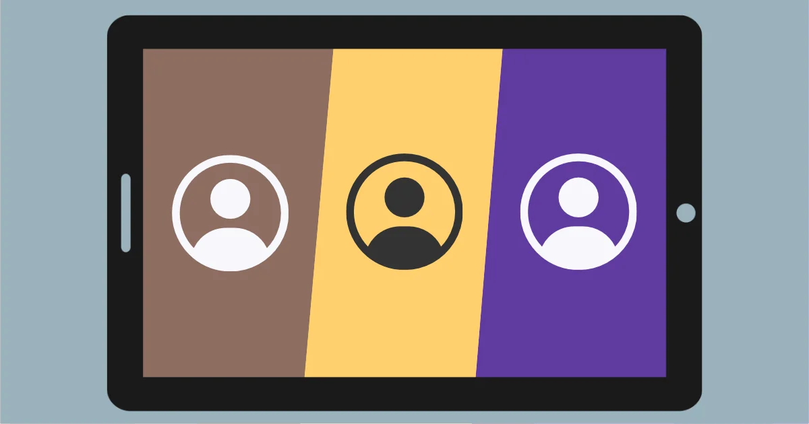

---
date:
    created: 2025-04-23T19:00:00Z
categories:
    - Tutorials
authors:
    - jonah
description: Android's ability to support multiple user profiles is one of the simplest ways to isolate applications and data on Android, which can provide you with huge privacy and security advantages.
schema_type: AnalysisNewsArticle
---
# How to Take Advantage of Multiple Users on Android

<small aria-hidden="true">Illustration: Jonah Aragon / Privacy Guides</small>

One of the simplest ways to isolate different applications and personal data on an Android device is to use **multiple users**. This is a feature which has been widely available on Android phones since 2014, but goes fairly underutilized by most people.<!-- more -->

Originally, this feature was intended to support multiple physical people sharing the same device, with the AOSP team envisioning a second user being added to a tablet for children to use, or critical response teams sharing a phone for on-call duty.

There are two main types of users on Android:

- The **system user**, which is the first user on the device. This user has special privileges and settings that only it can set. The name of this user defaults to "Owner" on English language devices.
- **Secondary users**, which are any users added to the device other than the system user. These users can be removed (either by the system user or by themselves) and cannot impact other users set up on the device.

## Advantages

While originally intended for multiple people, there are a number of advantages to setting up secondary users on your phone that will benefit even a single person!

### Isolating Apps

Apps installed in one user profile cannot communicate with apps installed in a different user profile. It is not possible to access the app data or storage of one user from a different user at all. The workspaces are completely isolated.

If you have multiple accounts with any apps that don't support multiple logins, this feature can really come in handy. Using multiple users allows you to have multiple, independent copies of an app installed on your device, one per user. Each app install can be logged in with different credentials and have access to different data.

### Isolating Data

Each user has its own set of files, contacts, and media. Apps installed by that user can only access data owned by that user.

This could come in handy if you have two different sets of contacts, say, a work address book and a personal address book, and you want to sync each one to a different user. It also allows you to have a profile for highly sensitive data that only needs to be accessed by a minimal number of apps.

### Resource Management

It is also possible to end the sessions of secondary users, which puts its data at rest (a more secure state) and stops its apps from running in the background.

This is particularly relevant when using a [custom ROM](https://www.privacyguides.org/en/android/distributions) with non-system Google Play Services, such as sandboxed Google Play on GrapheneOS. For example, you could have a secondary user with Google Play Services, and a primary user without, letting you choose when exactly you are making connections to Google. We'll delve deeper into this example later on.

Additionally, each user makes its own independent [VPN](https://www.privacyguides.org/en/vpn) connections. If you have two user sessions running, they could be connected to different VPN providers or different countries. You could even have one user connected to a VPN and one that doesn't use a VPN at all.

### GrapheneOS Specific

If you use [**GrapheneOS**](https://www.privacyguides.org/en/android/distributions/#grapheneos), you can take advantage of additional [features](https://grapheneos.org/features#improved-user-profiles){rel=nofollow} not available with a standard Android phone:

- **Notification forwarding**: Normally, only the notifications of the currently active user on Android are shown. On GrapheneOS, you can optionally configure secondary users to forward their notifications to the currently active profile, so you can make sure you don't miss anything important occurring in a background user session.

- **Additional user profiles:** GrapheneOS raises the maximum number of secondary users to 31, which means you have the option to be much more granular with how you isolate apps and data than you normally would (the maximum number is configurable by OEMs, but a stock Google Pixel only supports 3).

## Common Setups

When it comes to juggling multiple users, the best approach will always be highly dependent on your data, the apps you use, and your typical workflows.

It's important to think about how **you** use your device because you might use apps in conjunction with one another in ways that someone else might not. Similarly to [Qubes](https://www.privacyguides.org/en/os/qubes-overview), the correct number of isolated users and the apps you install within them is basically subjective. There's no "best" approach.

This being said, there are a few common or popular setups we see within the *Privacy Guides* [community](https://discuss.privacyguides.net/) which might make sense for you, or at least could help you start thinking about the best ways to isolate your apps and data from each other. You could also certainly use any combination of these approaches. At least within the confines of the maximum number of users available on your device, the sky's the limit!

### Isolating Google Dependencies

To preserve your privacy, the most commonly recommended "minimum" setup for multiple users on Android *with GrapheneOS* is a two-user setup, where only one secondary user has Google Play Services installed.

In this setup, the system user only contains apps that don't require Google Play Services, like open source apps installed with [Obtainium](https://www.privacyguides.org/en/android/obtaining-apps/#obtainium) or [F-Droid](https://www.privacyguides.org/en/android/obtaining-apps/#f-droid). The secondary user would contain apps from [Aurora Store](https://www.privacyguides.org/en/android/obtaining-apps/#aurora-store) or the Google Play Store that rely on Google Play Services, such as some banking apps, social media apps, etc.

This configuration is really only viable with GrapheneOS and sandboxed Google Play (or [another](grapheneos-or-calyxos.md) custom ROM with non-system microG) because that setup doesn't require Google Play Services be integrated with the system. On your typical stock Android device, Google Play Services will be installed with system-level permissions, meaning that it will be present in all user profiles on your phone.

### Minimal Owner Profile

Another frequently utilized configuration is keeping the system user as bare-bones as possible and *only* using (a) secondary user(s) to increase the security of your device.

This is because the system user has a number of special privileges that other users do not, such as the ability to enable ADB or other developer tools, for example. By avoiding regular usage of the system user, these settings become harder to unintentionally access.

An additional advantage of this approach is that it makes cleaning up and erasing portions of your device easier. Secondary users can be erased very easily if the need to do so for any reason arises. Doing so won't affect other users on the device. On the other hand, the system user can only really be erased with a full factory reset, which would also wipe out all users on the device at once.

### Per-Persona

Some people choose to group their apps on a "per-persona" basis, for example, having a user for school, one for work, one for games, one for social media, etc. If you find your time spent on your phone can be easily categorized into different groups of apps, this approach might make the most sense to you.

Not only does this limit the data that each group of apps can access (you can completely avoid accidentally sharing *personal* photos in your work chat, for example), but this approach can be also a huge boon to focus and productivity. Switching users on Android *does* add some friction, so keeping distractions in a separate user that can be disabled when you're not intentionally using them is an approach some find very helpful.

## Alternatives

### No Secondary Users At All

While secondary users can offer substantial privacy and security benefits, they are not necessary for everyone.

From a security perspective, all apps on Android are strongly sandboxed from each other. While this sandbox does not provide the complete isolation of data and interactions between apps, it does prevent apps from exploiting your device or other apps, and interactions that *do* occur between apps are typically gated behind permission prompts and other access controls. This means that for many [threat models](https://www.privacyguides.org/en/basics/threat-modeling/), enhancing app isolation beyond the default may be a bit overkill!

It's perfectly reasonable to decide that the standard sandboxing is all you require, *especially* if you have minimal apps installed in the first place, if you're only using [trustworthy](https://www.privacyguides.org/en/tools/) and open-source apps, or if you simply find managing multiple users too cumbersome for everyday use.

### Users vs. Profiles

Another alternative to multiple users on Android are **profiles**, which are separate workspaces contained within a single user.

The most well known implementation of profiles on Android is the **Work Profile** functionality. In normal usage, a Work Profile might be set up on your phone by your employer in order for them to install work-related apps without giving them full access to your device and personal apps. However, if you don't already have a work profile installed, you can also create a personally-managed one yourself by using an app like [Shelter](https://www.privacyguides.org/en/android/general-apps/#shelter) or Insular.

A big advantage of Work Profiles is that apps installed in the profile are accessible from your regular launcher without having to log out and switch user sessions. It is also very easy to multitask between apps installed in a work profile and personal apps.

Work profiles are much more isolated from your personal apps compared to the typical app sandbox, but they *do* share some underlying resources with the rest of your user profile, making them a bit of a middle-ground between standard app sandboxing and full multi-user isolation.

#### Private Space

In Android 15, a new feature called **Private Space** was introduced, which is very similar to work profiles in function, but does not require a separate management app like Shelter to use. Because this is a built-in feature, we always recommend using private profiles before or instead of using Work Profile functionality whenever possible.

Again, Private Space is a middle-ground between the standard sandboxing and multiple users. One example of a shared resource between the system user and the private profile within is the clipboard. This is a very significant vector to leak information between your standard apps and apps installed in the private space if you do not manage it properly.

Private Space is currently only available for the system user, not by secondary users. You also have the option to enable both a private space *and* a work profile, meaning you could have up to three semi-isolated workspaces contained within a single user.

## Sources

- <https://source.android.com/docs/devices/admin/multi-user>{rel=nofollow}
- <https://seprand.github.io/articles/best-user-profile-setup>{rel=nofollow}
- <https://arxiv.org/html/1904.05572v3/#S4.SS3>{rel=nofollow}
