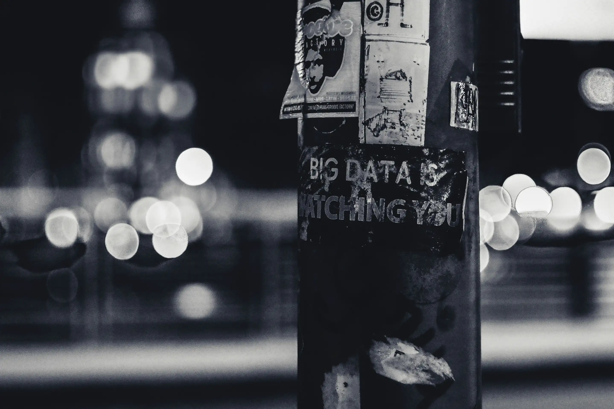

---
date:
    created: 2025-02-03T19:00:00Z
categories:
    - News
authors:
    - em
description: Privacy is intrinsically intertwined with politics. Each change in governance can have serious effects on privacy rights and privacy tools, for better or for worse. Let's examine with concrete examples how politics affect legislations that can have an immense impact on the privacy tools and features we use.
schema_type: NewsArticle
---

# The Future of Privacy: How Governments Shape Your Digital Life

<small aria-hidden="true">Photo: ev / Unsplash</small>

Data privacy is a vast subject that encompasses so much. Some might think it is a niche focus interesting only a few. But in reality, it is a wide-ranging field influenced by intricate relationships between politics, law, technology, and much more. Further, it affects **everyone** in one way or another, whether they care about it or not.<!-- more -->

I routinely read articles discussing changes in politics on the advocacy side of data privacy. Then, I read articles talking about changes in regulations on the legal side of data privacy. And then, I see all the articles and guides presenting new tools and privacy features on the tech side of data privacy. Of course, all of this is linked together.

Let's talk about how politics, law, and technological features are intertwined, all at once.

## Privacy laws are always one election away from getting better, or worse

Each change in government can have a serious effect on data privacy legislation. Privacy is a politically charged field. For example, authoritarian regimes might want to remove or weaken privacy rights to exert strict control over their population. While democratic governments generally bring more freedom and protections to its citizens, including privacy rights. It's important to keep in mind who in the past has bettered citizen rights and protections, and who has actively worked to undermine civil rights.

Each time a new government takes power, its values will be put forward and influence legislation in place, or legislation not in place yet. While the Western world has benefited from some improvements in data privacy law for the past few years, we must consider these gains are fragile and protections could get removed or lessened at any time.

Unfortunately, it seems there is currently a political push towards deregulation, mass surveillance, and a focus on corporate gains. This is **extremely worrisome for the future of privacy rights**, human rights, and individual liberties.

Following politics and advocating for better privacy rights and legislation is essential in improving access to privacy tools and features around the world. Privacy is never politically neutral.

## The tools you use might depend on government funding

Many [privacy tools](https://www.privacyguides.org/en/tools/) we use depend at least partially on government funding or on other tools which depend on government funding. This is especially true for open-source nonprofit organizations needing some (usually) more stable income, in addition to donations.

### Which privacy and security tools could be impacted

One notable example of a privacy-related project receiving government funding is the [Tor Project](https://www.torproject.org/). If this source of funding [were cut off](https://www.eff.org/deeplinks/2025/01/executive-order-state-department-sideswipes-freedom-tools-threatens-censorship), the impact on Tor could be quite detrimental, not only to the Tor Project but to all projects relying on Tor as well. Many privacy-focus software are built around the [Tor network](https://en.wikipedia.org/wiki/Tor_(network)). To name only a few, whistleblowing software such as [Hush Line](https://hushline.app/) and [SecureDrop](https://securedrop.org/) both utilize the Tor network to harden privacy. [Briar](https://briarproject.org/), [Cwtch](https://cwtch.im/), and [SimpleX](https://simplex.chat/), are examples of messaging applications also using Tor to add a layer of security and privacy to communications. **Tor is critical infrastructure** in the world of data privacy.

Another important project receiving government funding is [Let's Encrypt](https://letsencrypt.org/). Let's Encrypt is a nonprofit Certificate Authority providing [TLS](https://en.wikipedia.org/wiki/Transport_Layer_Security) certificates to websites. It is run by the Internet Security Research Group (ISRG), which [receives funding](https://www.abetterinternet.org/sponsors/) from the Sovereign Tech Agency, [supported by](https://www.sovereign.tech/faq) the German Federal Ministry for Economic Affairs and Climate Action. The ISRG also receives funding from the [Open Technology Fund](https://www.opentech.fund/) (OTF), which receives the [majority](https://www.opentech.fund/about/about-our-funding/) of its funding from the United States government, through the U.S. Agency for Global Media.

In current events, last month an [executive order](https://web.archive.org/web/20250131165539/https://new.nsf.gov/executive-orders) in the United States from the Trump administration led the National Science Foundation (NSF) to [freeze grant reviews](https://www.npr.org/sections/shots-health-news/2025/01/27/nx-s1-5276342/nsf-freezes-grant-review-trump-executive-orders-dei-science). This is currently impacting many important projects in the tech world, [including](https://www.linkedin.com/posts/sethmlarson_national-science-foundation-freezes-grant-activity-7290072485423656960-n2eJ/) the Python Software Foundation (PSF). **The repercussions of this freeze could be devastating for many open-source projects, in privacy and beyond.**

### Government funding should support civil liberties and protections

Governments funding nonprofit projects and organizations working on improving human rights, civil liberties, and technological security and safety is a good thing. This can bring an important source of stable income to nonprofit projects that could not stay afloat solely from donations.

However, this dependency can become precarious when governments aren't working for the good of the people anymore, and when organizations rely too heavily on such support, making them vulnerable to change in power. Such a change of regime can have devastating repercussions on the privacy tools we use.

## The GDPR gave you deletion features in your apps

On the good side of regulatory influence, there are regulations like the [General Data Protection Regulation](https://gdpr-info.eu/) (GDPR). Saying the GDPR revolutionized the world of data privacy would not be an overstatement. While many privacy regulations pre-date the GDPR, in the Western world none had the scope nor the grit the GDPR has.

### What is the GDPR

The GDPR is a data privacy regulation that was adopted by the European Union (EU) in 2016 and became effective in May 2018. Its scope encompasses all the EU member states as well as all the countries part of the European Economic Area (EEA), which together count 30 countries to this day. The United Kingdom also uses an [amended version](https://www.gdpreu.org/differences-between-the-uk-and-eu-gdpr-regulations/) of the GDPR post-Brexit.

However, the reach of the GDPR isn't limited to Europe. Every organization based *outside the EU* that is offering goods or services to, or is monitoring the behavior of, individuals located in the EU [must comply](https://commission.europa.eu/law/law-topic/data-protection/rules-business-and-organisations/application-regulation/who-does-data-protection-law-apply_en) as well. This means that **most organizations operating worldwide, regardless of where they are located in the world, must comply** with the GDPR.

As is often the case with data privacy laws, it took a few years before [Data Subjects](https://www.gdprsummary.com/gdpr-definitions/data-subject/) (your legal designation under the GDPR) noticed any concrete changes. One change that has become prominent in the past few years, and is likely a direct product of the GDPR, is data deletion features within apps and accounts.

### What does the GDPR have to do with data deletion features

An important right granted by the GDPR to Data Subjects is the [Right to Erasure](https://gdpr-info.eu/art-17-gdpr/) (or the Right to be Forgotten). Other legislation such as the [California Consumer Privacy Act](https://www.oag.ca.gov/privacy/ccpa) (CCPA) calls for a similar right, the *Right to Delete*. This and similar rights have existed before, but through the GDPR and its enforcement it has affected technology in a much broader and impactful way.

Slowly since 2018, applications requiring accounts have started to implement data deletion and account deletion features within the account itself. A probable reason for this is that due to the GDPR, and a now [growing number](https://iapp.org/resources/article/us-state-privacy-legislation-tracker/) of privacy regulations from various states in the United States, organizations are obligated to respond to Data Subject [requests](https://www.gdprsummary.com/data-subject-rights/) to get their personal data deleted. Managing this can be quite cumbersome for organizations. The burden of answering and implementing each data deletion request manually is often not worth the value of the data itself. Organizations with enough resources have simply added it as an internal product feature. This makes data deletion requests manageable by each Data Subject themselves (at least partially), freeing the organization from legally having to answer each individual request. When implemented properly, this is what we can call a win-win situation.

Request to delete

Unfortunately, not all applications have integrated automatic deletion features internally (yet). Additionally, some applications and accounts will allow you to delete information only partially this way.

If you wish to exercise or have questions related to your Right to Erasure or Right to Delete, first consult your local privacy regulation to check if you have this right as a *Data Subject*, *Individual,* or *Consumer*. Then, you can contact the organization's *Privacy Officer* with your request. You can usually find information about an organization's designated *Privacy Officer* by reading its privacy policy or privacy notice. In any case, it never hurts to ask.

## Chat Control wants to break end-to-end encryption

If you are not European, please bear with me. First, everyone outside of Europe should care about what is happening in Europe, regardless. But even if you don't care, you should know **this kind of mass surveillance proposition will inevitably leak west**, and if adopted will affect us all globally.

### What is Chat Control

In 2021, the EU [approved a derogation](https://www.patrick-breyer.de/en/chatcontrol-european-parliament-approves-mass-surveillance-of-private-communications/) to the [ePrivacy Directive](https://en.wikipedia.org/wiki/EPrivacy_Directive) to allow communication service providers to scan all exchanged messages to detect child sexual abuse material (CSAM). Although this first derogation was not mandatory, some policymakers kept pushing with new propositions.

A year later, a [new regulation](https://edri.org/wp-content/uploads/2022/10/EDRi-Position-Paper-CSAR-short.pdf) (CSAR) was proposed by the European Commissioner for Home Affairs to make scanning messages for CSAM *mandatory* for all EU countries, and also allow them to **break end-to-end encryption**. In 2023, the UK passed a similar legislation called the [Online Safety Act](https://hackaday.com/2023/10/29/the-uk-online-safety-bill-becomes-law-what-does-it-mean/). These types of messaging mass scanning regulations have been called by critics *Chat Control*.

### Why is Chat Control horrible for privacy, and for children

Such legislation might sound like a noble cause at first, but consider this: Scanning all messages exchanged for any reason treats everyone like a criminal, no matter what. **This is not hunting criminals, this is mass surveillance.** Not only is this horrifying for privacy rights, but it also endangers democracy. Once a system to mass monitor all written communications is implemented to (supposedly) stop CSAM, new topics to detect, block, and report could be added anytime, and by any future governments. There is nothing that would prevent much less reasonable topics from being added to the list to be filtered out at a later date.

Chat Control would hurt everyone, [including the children](https://digitalcommons.law.uw.edu/wlr/vol99/iss1/9/). Not only would mass scanning of all messages be [ineffective](https://volteuropa.org/news/chat-control-wont-protect-children) at reducing CSAM, but it would endanger the children even further by also scanning their communications. Because yes, children also communicate online. Parents also communicate sensitive information about their children online, with trusted family or doctors. All this data would get scanned and collected, only [one breach away](https://techcrunch.com/2025/01/28/powerschool-begins-notifying-students-and-teachers-after-massive-data-breach/) from being made public.

*Protecting the children* is a pretext regularly used to implement abusive regulations undermining individual liberties and protections. Do not get fooled by this demagogic stratagem. **Chat Control is the opposite of protecting the children.**

Chat Control would only lead to destroying the end-to-end encryption messaging features that are protecting us and the children so well already. Criminals exploiting children would simply move to underground channels, unbothered.

### Who opposes Chat Control

Thankfully, opposition from experts and advocates alike has been strong. To name only a few, Meredith Whittaker, president of the Signal Foundation which develops the messaging app [Signal](https://signal.org/), has taken [a clear stand](https://signal.org/blog/uk-online-safety-bill/) against Chat Control. The Electronic Frontier Foundation has also [firmly opposed](https://www.eff.org/deeplinks/2024/06/now-eu-council-should-finally-understand-no-one-wants-chat-control) Chat Control legislation. In the UK, the Open Rights Group has led [powerful campaigns](https://www.openrightsgroup.org/campaign/save-encryption/) to fight against the Online Safety Act. In Europe, privacy advocacy organization [noyb](https://noyb.eu/en/noyb-files-complaint-against-eu-commission-over-targeted-chat-control-ads) and former Member of the European Parliament Patrick Breyer have both been fervent defenders of privacy rights [raising relentless resistance](https://www.patrick-breyer.de/en/posts/messaging-and-chat-control/) to Chat Control.

Harmful policies such as Chat Control are a direct example of how politics can affect laws that can cause **unimaginable damage** to the privacy-preserving technologies we use every day.

## Age Verification wants to collect your sensitive data

Another potent example of the *protecting-the-children stratagem* to undermine privacy rights is [Age Verification legislation](https://www.jonaharagon.com/posts/age-verification-is-incompatible-with-the-internet/). In the past few years, this idea of controlling which online content should be accessible to children has raised new proposals around the world.

Age Verification policies generally start with the premise that some content should not be accessible to children online. Again, this could seem like a reasonable idea at first. Nobody would debate that children should be shielded from some type of content. Sadly, we have all witnessed how horrifying the internet can be at times. However, both the premise and methodology to achieve this goal are wrong.

### Who will decide what content should be walled online?

First, even putting aside the fact that there is plenty of disturbing content accessible *outside* the internet (newspapers, television, movies, radio, advertising, etc.), who would be [the deciders](https://www.eff.org/deeplinks/2025/01/impact-age-verification-measures-goes-beyond-porn-sites) of which specific content can be accessed by children or not? This can be extremely problematic, to say the least.

There is no objective measure to decide on this, and what might be deemed appropriate by one might not be by another. More importantly in the context of our discussion, what one government might judge appropriate might be very different from the next or previous administration.

This is again **a dangerous slippery slope opening the door wide to authoritarian policies**.

### Age Verification undermines privacy and security

Secondly, [how can age be verified online](https://www.woodhullfoundation.org/fact-checked/online-age-verification-is-not-the-same-as-flashing-your-id-at-a-liquor-store/)? Of course by collecting more data, on everyone. Age Verification policies don't affect only the children, they affect everyone who wants to access content online. If a website is deemed to display content that should not be accessed by children, the only way to enforce this rule would be to ask for some form of official identity verification from all adults who want to access it.

Proponents of these regulations often refer to "age assurance processes" and suppose these processes to be undoubtedly secure. Anyone familiar with data security will understand how naive this approach is. I will not go into the details here, but you probably can already see how having each private website (or third-party processor) collect such sensitive information from each visitor is horrendous for privacy rights, and data security as well. Of course, these websites or third-party "age assurance processors" will unavoidably become a large treasure trove for thieves, and their sensitive data will be [inevitably leaked or stolen](https://www.404media.co/id-verification-service-for-tiktok-uber-x-exposed-driver-licenses-au10tix/) sooner rather than later.

Age Verification is one of the biggest privacy threats online. Continuing in this direction could ultimately lead to the end of pseudonymous browsing. Additionally, this could also mean the end of your official ID having any value at all. After all, what unique identification value does a piece of ID keep after it has been leaked in a thousand different data breaches? Maybe even one day bought on a [darknet market](https://en.wikipedia.org/wiki/Darknet_market) by a curious teenager in need of accessing some website...

### Age Verification is already here, sadly

Regrettably, this is not a hypothetical scare. Age Verification legislation has already passed in [Australia](https://www.thehindu.com/news/international/what-is-australias-online-safety-amendment-about-explained/article69026251.ece), in the [UK](https://www.ofcom.org.uk/online-safety/protecting-children/age-checks-to-protect-children-online/), as well as in [many U.S. states](https://action.freespeechcoalition.com/age-verification-resources/state-avs-laws/). It is also on the table federally in the [United States](https://www.eff.org/deeplinks/2024/10/eff-new-york-age-verification-threatens-everyones-speech-and-privacy), [Canada](https://www.eff.org/deeplinks/2024/09/canadas-leaders-must-reject-overbroad-age-verification-bill), [France](https://www.politico.eu/article/france-doubles-down-on-social-media-age-limit-at-15/), [Norway](https://www.euractiv.com/section/politics/news/norwegian-government-sets-15-year-age-limit-for-using-social-media/), and [Europe](https://digital-strategy.ec.europa.eu/en/funding/call-tenders-development-consultancy-and-support-age-verification-solution).

There is some [tenacious opposition](https://www.eff.org/deeplinks/2024/12/global-age-verification-measures-2024-year-review) to Age Verification policies from digital rights and free speech advocates. Unfortunately, there is also a strong push in support of Age Verification from the rapidly growing "age assurance" and identity verification [industry](https://avpassociation.com/thought-leadership/2025-the-year-of-implementation-for-age-assurance/), and from many governments worldwide **moving towards a surveillance state**.

Again, government values are deciding on digital features that impact our data privacy in disastrous ways. If you want to **take a stand against Age Verification**, you can join the [Stop Online ID Checks](https://www.stoponlineidchecks.org/) campaign from the nonprofit organization Fight for the Future.

## The future of privacy

There's a lot to be worrying about in today's privacy landscape. Unfortunately, recent political tendencies in the Western world make it difficult to stay optimistic. The trend toward authoritarian regimes and surveillance capitalism is bad news for the future of privacy around the globe.

There is no question that privacy is intrinsically intertwined with politics, and can therefore never be politically neutral. The latest decisions taken by the new U.S. administration running full speed into deregulation and defunding, growing pressure in Europe to break end-to-end encryption in favor of a surveillance state, and invasive age verification policies to censor the web and collect even more data on every netizen is admittedly frightening.

But one thing frightens me even more than all of this. One thing that could end privacy rights, forever. This threat to privacy is never far and always looming.

This threat is giving up.

Despite all the gloom menacing privacy rights, **privacy will never be dead as long as we stand up to defend it**. Governments might have the power to remove our privacy rights on paper and proclaim privacy features illegal. But the people have the power to keep pushing for better privacy rights and to keep developing even more robust and more accessible privacy tools.

We must continue to advocate loudly for privacy rights and *all* human rights every chance we have. The fight for better privacy rights is only over when we give up.

**Do not give up.**
