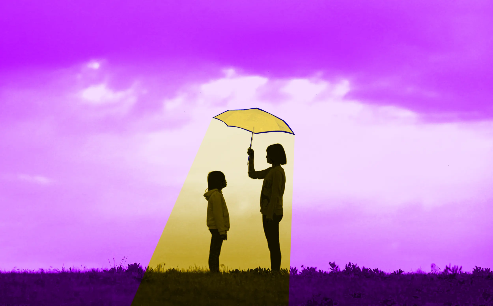

---
date:
    created: 2025-03-10T20:00:00Z
categories:
    - Explainers
authors:
    - em
description: In privacy, we talk a lot about how to protect our own data, but what about our responsibility to protect the data of others? If you care about privacy rights, you must also care for the data of the people around you. Together, we must start building a culture of data privacy where everyone cares for the data of others.
schema_type: NewsArticle
---
# Privacy is Also Protecting the Data of Others

<small aria-hidden="true">Illustration: Em / Privacy Guides | Photo: J W / Unsplash</small>

In privacy, we talk a lot about how to protect our own data, but what about our responsibility to protect the data of others?

If you care about privacy rights, you must also care for the data of the people around you. To make privacy work, we need to develop a culture that normalizes caring for everyone's data, not just our own. Privacy cannot solely be a personal responsibility, data privacy is team work.<!-- more -->

Whatever measures and tools you use to protect your own data, you would never be able to protect it fully without the collaboration of others.

In this context, the people around you might be your family or your friends, but also includes your boss, your doctor, your therapist, your school, your government, and any other person or organization that has control over some of your data.

Conversely, you are also in control of other people's data.

Even if you are not a boss, a doctor, or a therapist yourself, you probably have some photos of your friends, a list of contact information, and copies of sensitive conversations exchanged in private messages with your family. All of this data is under your guard too.

Once you have control over someone else's data, **you become its guardian**.

## Data protection is a communal responsibility

Now to be clear, this isn't necessarily in relationship with the law, although it can be part of it. In this context, I am referring more to ethics. Do we have a moral obligation to care for and protect others to at least the same level we wish to be protected ourselves?

As a connected society, we constantly exchange information with each other. This information is now mostly stored on digital mediums, and can be very easily duplicated and shared elsewhere. Actually, on a technical level, it's even *difficult* not to constantly involuntarily create duplicates of this data and send it elsewhere.

This is why **we must increase our vigilance** about protecting the data of others.

Considering the quantity of data that ends up in everyone's possession, data has become a communal responsibility.

## We must develop a culture that normalizes data privacy

Privacy is a human right, and a good starting point to protect any human right is legislation. Legislation is undeniably an aspect of data privacy that is in constant evolution, and we can hope that privacy laws will only get better over time. Well, let's not just hope, let's also work to make sure it does.

That being said, **laws simply aren't enough**.

To truly improve data privacy rights, we *must* integrate them into our *whole culture*. This might sound like an over-ambitious endeavor, but culture is flexible and evolves with people's needs.

In the past few decades, our culture and customs have begun to shift *against* data privacy. Some of us are old enough to remember a time when everyone didn't have a camera in their pocket. At that time, it would have been considered unacceptable in most places to suddenly point a recording camera at a stranger in the street and start filming them without any explanation and without their consent.

Now this kind of disrespectful behavior is a common occurrence, because everyone has the tool to do it. Our society evolved with technological tools, but **we neglected to course-correct our culture for it**.

We have reached a point where we need to develop a culture of individual responsibility towards each other's data.

This means caring not just for our own data, but **caring for everyone's data**, whether it's the data of our friends, our family, our employees, our patients, or even complete strangers in the streets, or online.

This will take a lot of time and effort, but we owe it to the next generations to start now.

## The principles we should consider in relation to privacy

Our society already has adopted or improved many ethical principles in the past decades that are intimately linked to data privacy.

Some of these principles and values have become much more prevalent in our culture recently, consent being one great example for this.

**Consent** in privacy is incredibly important. What one person might feel comfortable sharing publicly might be completely different from another person, for example. Privacy cannot be established on a fixed basis without considering individuality and circumstances.

Someone might be happy sharing their name on social media, and someone else might safeguard this information and only use pseudonyms. One person might feel safe sharing their home address online, yet another person could be killed for doing this.

This is why *informed* and *explicit* individual consent (with true choices) should always be the center of such decisions, for any type of personal information.

Other principles we must integrate in our culture of data privacy include **empathy** (my threat model isn't your threat model), **trust and respect** (secure this data properly if you must collect it), **safety** (consider someone could get severely harmed by a data breach), and **individual liberties** (sharing data must be a personal choice, even if there's no danger, it's still valid even if it's just a preference).

Of course, these are only a few principles indispensable to build a culture of data privacy, but since most people are already familiar with these we'll start here.

## How we can start building a better culture around data privacy

So, what concrete actions can we take *right now* to improve our culture around data privacy? What can we do today at the individual level to start better protecting the data of others?

Here are a few practices you can adopt in your daily life to improve the data of the people around you. However, I insist you not just demand others do this for you, but **do this for others too**. Re-shaping our culture needs to start with ourselves:

### :material-camera-off: Ask for consent before sharing/posting photos

Do not post photos of people online without their prior consent. Especially if there are children involved! Before sharing photos of others online, *always* ask for their consent first.

### :material-face-recognition: Be mindful when sharing photos of protests

Be very careful when [taking pictures during a protest](https://www.privacyguides.org/articles/2025/01/23/activists-guide-securing-your-smartphone/). There's a lot of nuance to this because it's also important to show protests and make them known (that's usually the goal!), but in some circumstances people might be put in danger if their faces are shown online associated with certain causes.

Be mindful and make sure no one is singled out without consent in your pictures if you post them online. When possible, try to blur/block the faces of the people you couldn't ask for consent.

### :material-car: Blur license plates

When taking photos in the streets and posting them online, be mindful to blur license plates. This might sound extreme but imagine a situation where someone is a victim of domestic violence and their abuser sees their car parked at a shelter, or at someone's place. This information could literally get someone killed. Always keep in mind different people have different [threat models](https://www.privacyguides.org/en/basics/threat-modeling/).

### :material-contacts: Safeguard contact information

Never share the contact information of someone with someone else (or something else) without their prior explicit consent. This includes email addresses, phone numbers, legal names, locations, photos, and *especially* home addresses. This information in the wrong hands could literally get someone killed. **Always ask first!**

Additionally, be vigilant when importing your contact list in a new application. This could get it shared further than you intended. Ideally, always keep your contact list in an end-to-end encrypted application only.

### :material-file-eye: Be careful when sharing files from and with others

If someone trusted you with a file (photo, music, video, PDF, text file, etc.), always ask for consent before sharing this file with someone else.

Additionally, always keep this file only locally or stored in a secure end-to-end encrypted service. If this person gives you consent to share this file, ensure that metadata has been [removed](https://www.privacyguides.org/en/data-redaction/) from it. This person might not be aware of the metadata on this file.

### :material-heart: Keep confidences secret

If someone trusts you enough to share something personal with you, do not betray that trust by talking about it with someone else, and *especially* not on unencrypted services such as Gmail or Twitter's DM. In doing so, you would expose this secret to even more unintended recipients. Respect people's trust in you. Do not share confidences.

### :material-message-text: Safeguard and delete private messages on social media

If you have private conversations on social media, be mindful not to spread this information elsewhere. If you delete your account, be mindful to also [delete](https://docs.cyd.social/docs/x/delete#delete-my-direct-messages) the information of others you have stored in your private messages. If someone wants to share sensitive information with you, always invite them to move to an end-to-end encrypted [messaging service](https://www.privacyguides.org/en/real-time-communication/) instead.

### :material-heart-box: Safeguard and delete intimate pictures you received

If someone trust you enough to send you intimate photos of themselves, take this responsibility *extremely* seriously. If they use an end-to-end encrypted service, do not move the photos out of there. If you do, you could inadvertently upload them to an unencrypted service and compromise the security of these pictures.

If your relationship with this person ends, you *should* delete all intimate pictures you have received. This is extremely important for their safety, and also possibly for *yours*. Things could get very problematic legally if your copies were to get accidentally leaked or stolen. No matter how difficult this might be emotionally, do the right thing and delete these pictures fully.

If you are still unconvinced about this one, maybe have a look at Ted Lasso season 3, [episode 8](https://screenrant.com/ted-lasso-season-3-episode-8-keeley-story-response/) which has a great story demonstrating the dangers related to this.

### :material-cellphone-screenshot: Avoid taking screenshot of people's posts

Each time you take a screenshot of someone's post to repost it somewhere else, you are effectively removing this person's ability to delete their content later. This is horrible for privacy *and* for consent. Instead, use links to other people's posts. That way, if they decide later to delete their content, the link will simply not work anymore, but their right to deletion will remain intact.

### :material-record-circle: Notify guests if you are using a smart speaker

If you are using a smart speaker device in your home such as Amazon's Echo (Alexa), Apple's HomePod (Siri), Google's Nest, inform your guests about it when they enter your home. These devices have the [capacity](https://www.makeuseof.com/tag/alexa-amazon-echo-privacy-risk/) to record all conversations, and there has already been instances of accidental privacy invasion [reported](https://www.cnet.com/home/smart-home/alexa-sent-private-audio-to-a-random-contact-portland-family-says/) about this. Even if you don't mind yourself, offer your guests to *unplug* your smart speaker while they are visiting you. The same is valid for any voice assistant on your phone.

### :material-eye-off: Do not use Windows Recall (or anything similar)

If you are a Microsoft user, make sure to [*disable*](https://www.ytechb.com/how-to-uninstall-microsoft-recall-in-windows-11/) Windows Recall from your computer. If it's enabled, this application will [continuously](https://www.theverge.com/2024/6/3/24170305/microsoft-windows-recall-ai-screenshots-security-privacy-issues) take screenshots of your computer, including the faces of anyone video-chatting with you on Signal, the email content of anyone contacting your through Tuta Mail, the secrets of anyone chatting with you on Matrix. Windows Recall completely defeats the protections of anyone using end-to-end encryption to contact you. This is a huge breach of trust! If you somehow use this feature, at least be mindful to disable it each time you communicate with others.

### :fontawesome-solid-glasses: Don't use Meta's Ray-Ban "AI" glasses!

Don't use "smart" glasses recording people.

Just don't.

Ever.

This is *extremely* creepy.

Never buy nor use this.

If you encounter someone in the street wearing this, run away.

## This is only a start, but together we can do this

Improving our culture around data privacy will take time and effort, but we have to start now. The best place to start is with yourself.

Remember:

"Be the change you wish to see in the world."

**Be the data protector you wish to see in the world.**
