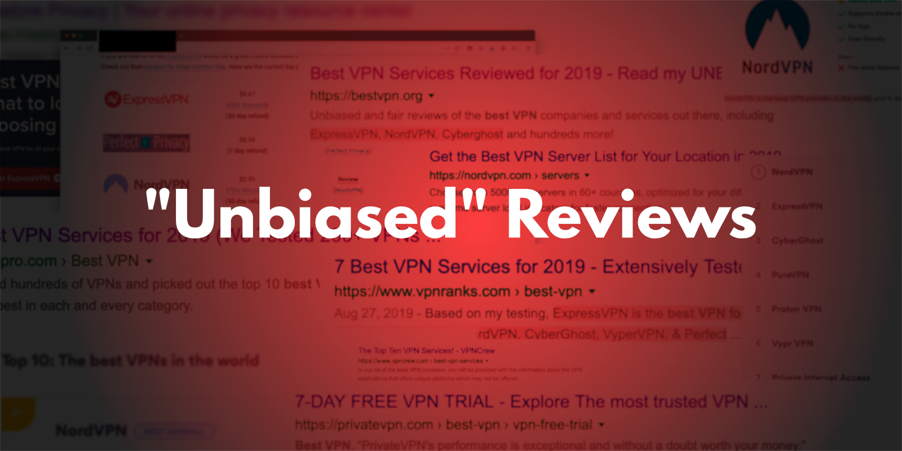
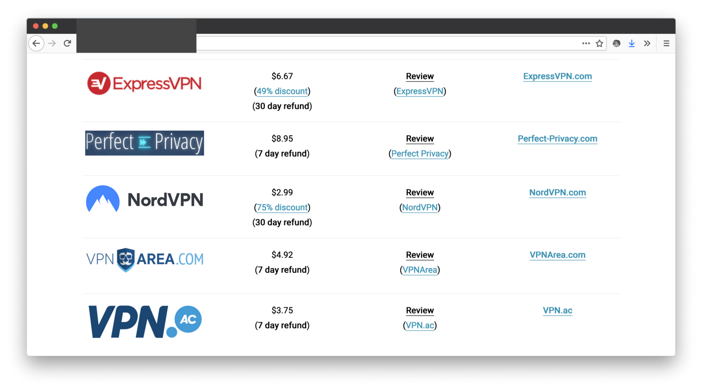

---
date:
    created: 2019-11-20
categories:
    - News
authors:
    - jonah
links:
    - Choosing a VPN: https://www.jonaharagon.com/posts/choosing-a-vpn/
    - Understanding VPNs: https://www.jonaharagon.com/posts/understanding-vpns/
    - VPN Recommendations: https://www.privacyguides.org/vpn/
tags:
    - VPN
license: BY-SA
description: There’s a massive problem in the privacy world. Many shady companies are disguising advertisements as genuine reviews, to the detriment of real news sources like Privacy Guides and to potential buyers of these services.
schema_type: AnalysisNewsArticle
---
# The Trouble With VPN and Privacy Review Sites

There’s a massive problem in the privacy world. Websites, social media accounts, and other platforms are constantly popping up out of nowhere, telling you to buy *The Greatest Service Ever* in order to solve all your privacy woes, whatever that may be. These websites often employ marketing teams to make sure their “reviews” are what you see first when you begin your research. Some of them are even operated by VPN providers themselves, operating under anonymous business entities to hide their bias, or doing it right out in the open, hoping you’ll mistake their advertising-filled press releases and blogs as insider knowledge of the VPN space.<!-- more -->

When a seemingly “unbiased review” on a site is merely a paid advertisement in disguise, that website is breaking their reader’s trust. From a consumer’s point of view, affiliate marketing and other paid promotional techniques like this make it near impossible to know when a review is genuine or not.

This isn’t going to be a lengthy blog post on advertising being bad, far from it. In fact, many of the VPN providers we recommend on *Privacy Guides* engage in responsible advertising across various platforms. The key is transparency: Their advertisements should *look like advertisements*, and nothing else.

I’m really looking to take the time here and identify “the bad” sites and resources that use these techniques to profit off a community just looking for reliable answers. Lots of sites like these will claim they’re acting in your best interest, but they’re just here to make money.

One common thing I’ll see on these sites is a ranked list of providers that are ostensibly the best ones to choose from. These sites have supposedly done all the work for you, so you can just click and go, assured you’re making the right choices.

So here’s my issue with ranking VPN providers: Let’s face it, VPN providers are all offering the same service, and they will either protect your information or they won’t. Ranking providers like this only serves as an easy way to guide users to a certain choice (in this case, the choice that will make the reviewers the most money).

Let’s look at one of these “review” sites for example, which will go unnamed for the purposes of this article. On their homepage they prominently list 10 providers as the “best” VPN services, in this order:

1. NordVPN
2. Surfshark
3. ExpressVPN
4. PerfectPrivacy
5. IPVanish
6. Mullvad
7. CyberGhost
8. Trust.Zone
9. ibVPN
10. Private Internet Access

To their credit, this review site also helpfully included an advertising disclosure in their footer. On this fairly well hidden away page, they note that they participate in affiliate programs from 8 providers, as follows:

- NordVPN
- SurfShark
- ExpressVPN
- Perfect-Privacy
- IPVanish
- CyberGhost
- Trust.Zone
- Private Internet Access

*Hmm*. Look familiar? Of the 73 providers this site had reviewed at the time of writing this article, **all eight** of the VPN providers paying this review site happened to make their top 10 recommendations. In fact, you’d have to scroll down to #6 before you found a provider that wouldn’t pay them, practically buried.

Furthermore, their list includes NordVPN, a company [notable for not disclosing security breaches](https://techcrunch.com/2019/10/21/nordvpn-confirms-it-was-hacked/) in a timely fashion, and ExpressVPN, a provider [notable for using weak 1024-bit encryption keys](https://www.goldenfrog.com/blog/some-providers-use-weak-1024-bit-keys-vyprvpn-explains-why-its-strong-keys-matter) to protect their users. By any objective standard, these providers do not deserve to be included in a top 10 recommendations list for securing anybody’s information. This review site in particular claims to have set criteria for their recommendations, but this just demonstrates that any criteria can be adjusted to fit any goal you may have.

If these sites truly wanted to be helpful, they would consolidate all the relevant information and present it to their users without making the choice for them. A provider is going to be better or worse for every user depending on their particular situation, and encouraging making an informed choice between options presented equally is far more beneficial to putting one over the other in a largely arbitrary fashion.

But that isn’t to say they should just throw all the providers in a big table and call it a day. Almost worse than the ranking scheme above is when sites provide out of context lists of providers, often just with pricing and a link. Sometimes they will link you to a full review (more on that in a bit), but for the most part these sites just expect you to follow their recommendations blindly.

These read like advertisements, because they usually are. Once again we see the usual suspects — NordVPN, ExpressVPN… — paraded as the gold standard in the VPN space, not out of any inherent value, but based on the value of their affiliate programs. To further this point, let’s take a look at how much each of the five providers above will pay you for a referral (on a one-month plan).

1. ExpressVPN: $13 for first month
2. NordVPN: $11.95 for first month
3. VPNArea: $4.95 for first month
4. VPN.ac: $2.90 for first month

*Unfortunately, Perfect Privacy would not share their commission rates publicly, but if anyone has any information on that I’d be happy to receive it. What I will say is that based on the information above, I would not be surprised if it fell right between ExpressVPN and NordVPN’s rates. Their one-month plan costs $12.99, so assuming a 100% match on the first month (the standard from NordVPN and ExpressVPN) that would add up quite nicely.*

Once again, we see a lineup of providers ordered in a way that *conveniently* pays the most to the website owner. And therein lies the issue with affiliate programs. Once you begin receiving financial compensation *on a per-signup basis*, you are now motivated to push the most users to the sites that pay more on a monthly basis, rather than the sites that will actually help the user.

Occasionally, these recommendations are coupled with a “review” that is supposedly independent and unbiased, but in reality are simply more marketing tools to persuade you towards their opinions. In most cases, these reviewers will simply copy the VPN provider’s own press releases and even media, presenting their advertising as fact to their readers. These reviews are always hidden away as well, with main navigation links directing users towards the more affiliate-link-laden lists and tables that they’d much rather you browse. The true value of these review articles is the [Search Engine Optimization (SEO) advantage they bring](https://www.pcmag.com/news/367640/how-a-vpn-review-site-dominated-google-search-with-a-scam) in the rankings on Google, and not much more. More traffic = More clicks, at the expense of good, independent content and integrity.

*Originally, this article contained a section about how ‘ThatOnePrivacySite’ was the last bastion of a hope in the VPN review world. However, that has since sold out to ‘Safety Detectives’, a site guilty of using all the affiliate tricks mentioned above. Goes to show, eh?*

At [Privacy Guides](https://privacyguides.org/), we’ve developed a set list of criteria, and we make that abundantly clear when you read our list of [recommended VPN providers](https://privacyguides.org/vpn/). We also refrain from using affiliate links. As we’ve discussed, they are fundamentally flawed ways to market a service, and using them would break the trust our community has in our recommendations.

We do have a sponsorship program, but all of our finances are handled in an incredibly transparent fashion. As a non-profit organization, the funding we receive cannot be used for private profit, and our community can see both where we receive money from and how it is being spent thanks to [Open Collective.](https://opencollective.com/privacyguides)  Additionally, the recommendations on our site are handled by an entirely separate team of editors and contributors than the administrative team such as myself that handles the sponsorships and finances. The editors have sole control over our recommendations and operate entirely independently and on a volunteer-basis to ensure the choices we make are for the benefit of the privacy community over one individual.

Ultimately, as a matter of policy our sponsors have no say over our recommendations, or whether they are recommended or a competitor is removed. We have given our community vast access to our website and internal workings to keep us in check and ensure we’re staying true to our word. This separation of management and editors is a strategy that has served the media industry well for decades, and makes all of our team and organization a more credible and trustworthy source of information.

## Summary

We have a lot of points we want to get across. The current landscape of privacy reviewers and “experts” weighing in on topics regarding the very companies that pay for their reviews is morally reprehensible, and just another way for big tech companies to collect all of our data more easily.

Review sites should make it abundantly clear when their reviews are paid for by the VPN companies in any fashion, whether that be via affiliate programs or good old-fashioned sponsorships. This can’t be via a hidden-away disclosure in the footer or not published at all, but *clear* and *close in proximity* to the claims published on their site. **Customers are not expecting or seeking out these disclosures** when they visit review sites, and can’t be expected to immediately discern whether you’re speaking from a place of unbiased fact, or from a place with the greatest financial incentive. Better yet, they should reconsider their entire business model. Our site is based solely on a community donation model that still keeps us sustained. It’s the more difficult way to build a site to be sure, actually working to gain the trust of a huge community, but the difference in quality and integrity is remarkable.

VPN providers should consider spending less money on paid reviews, and more money on securing and validating their infrastructure. Regular security audits are one fantastic way for companies to demonstrate their dedication to keeping their users secure. We strongly believe VPN services should consider our criteria, especially in regard to the ownership of their organization. Your VPN provider should not be hiding away in Panama controlled by anonymous leadership. While you *as a user* deserve privacy, transparency should be *required* of providers if you are expected to trust them. I would not give my money to some anonymous overseas investor, why would I give all of my internet traffic to some anonymous overseas administrator?

Finally, when you’re choosing a VPN provider, do your own research.  [Understand what a VPN actually does for you](https://www.jonaharagon.com/posts/understanding-vpns/).  [Understand what it is a security audit proves](https://www.pcmag.com/article/371839/what-does-a-vpn-security-audit-really-prove), find out who owns and operates the VPN service you want to use, and make sure their policies and technologies reflect your values.  [Ultimately gathering the information yourself](https://www.jonaharagon.com/posts/choosing-a-vpn/) and making an informed decision is the only way to make sure your privacy is being respected.
