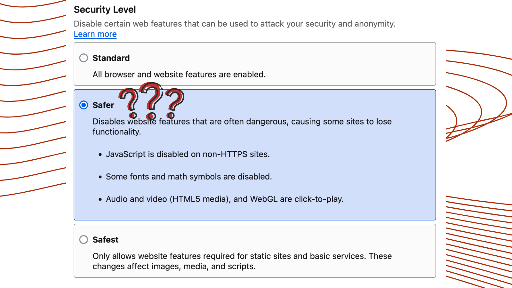
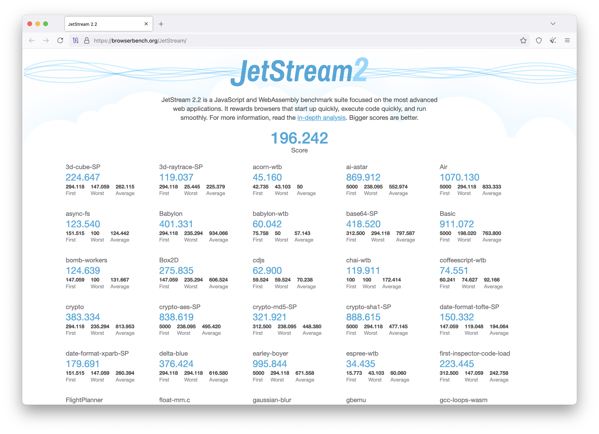
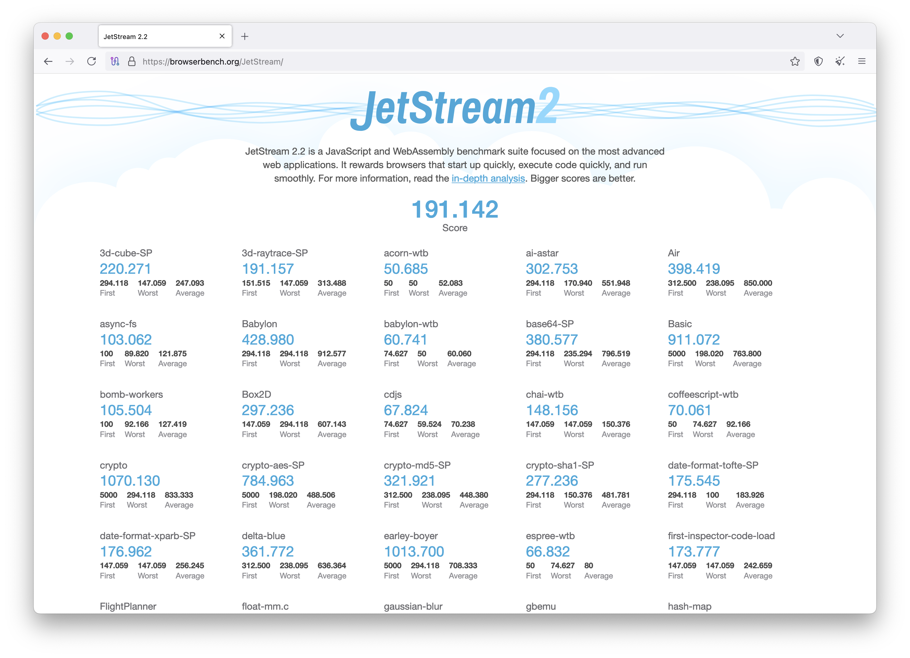
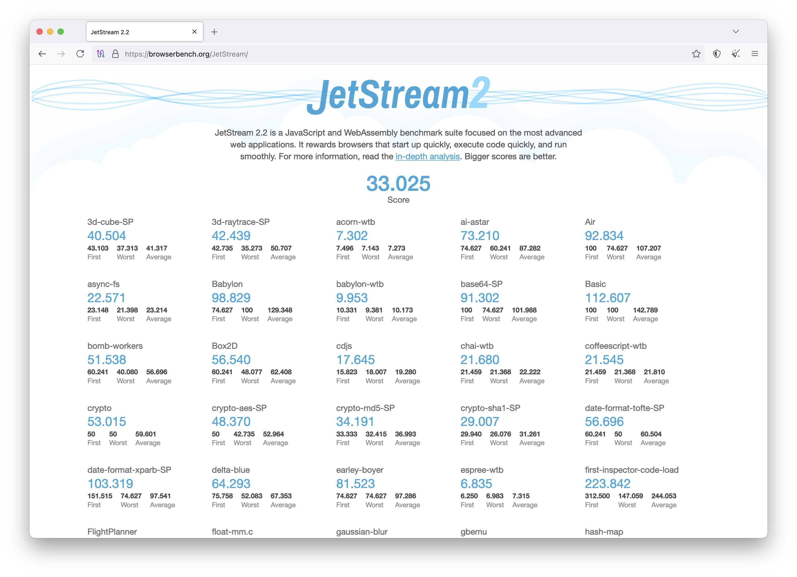

---
date:
    created: 2025-05-02T11:20:00Z
    updated: 2025-05-03T15:00:00Z
categories:
    - News
authors:
    - jonah
tags:
    - PSA
    - Tor
description: |
  PSA: The security level slider in Tor Browser (and Mullvad Browser) does not fully apply until restarting the browser. This presents a high risk to people who switch from Standard to Safer security during a browsing session in order to protect themselves from browser exploits.
schema_type: ReportageNewsArticle
preview:
  cover: blog/assets/images/tor-security-slider-flaw/cover.png
---
# A Flaw With the Security Level Slider in Tor Browser

<small aria-hidden="true">Illustration: Jonah Aragon / Privacy Guides</small>

[Tor Browser](https://www.privacyguides.org/en/tor/#tor-browser) and [Mullvad Browser](https://www.privacyguides.org/en/desktop-browsers/#mullvad-browser) users should be aware of a flaw with the Security Level slider: Not all protections advertised by the browser are properly engaged until the browser is fully restarted.<!-- more -->

This flaw was anonymously reported to *Privacy Guides* by a member of our [community](https://discuss.privacyguides.net/), and I confirmed it via the latest Tor Browser 14.5.1 on macOS. Additionally, I confirmed this behavior in Mullvad Browser 14.5.1 on macOS.

~~I was unable to find any documentation or open GitLab issues with Tor regarding the need to take additional steps before security settings are fully applied, and~~ Tor Browser documentation does not note that a restart is required, nor does it prompt users to restart the browser after security changes are made. (update: see below)

This presents a high risk to people who switch from Standard to Safer security during a browsing session with the goal to protect themselves from browser exploits.

## Demonstration

The effect can be easily demonstrated in your own Tor Browser install by running a JavaScript benchmark such as [JetStream 2.2](https://browserbench.org/JetStream/). These benchmarks rely on a technology called Just-in-Time (JIT) compilation to improve performance, but JIT is linked to numerous security vulnerabilities in modern web browsers. The "Safer" security level normally disables JIT entirely to prevent these issues, however, you can see virtually no performance impact when switching to the Safer security level in Tor Browser and running the benchmark again:

<figure markdown="span">
  
  <figcaption>JetStream 2.2 benchmark results in <strong>Standard</strong> mode</figcaption>
</figure>

<figure markdown="span">
  
  <figcaption>JetStream 2.2 benchmark results in <strong>Safer</strong> mode, <em>without</em> restarting Tor Browser</figcaption>
</figure>

While the performance is virtually identical between these two runs, *after* restarting Tor Browser and re-running the test, we see drastically lower performance results, in line with what we would expect with JIT properly disabled:

<figure markdown="span">
  
  <figcaption>JetStream 2.2 benchmark results in <strong>Safer</strong> mode, <em>after</em> restarting Tor Browser</figcaption>
</figure>

As you can see, there is no visible indicator that anything is different between the last two runs, and there was no prompt to restart the browser after changing these settings. However, this clearly indicates that JavaScript technologies that are meant to be disabled in Safer mode can still be accessed by websites until the browser is restarted, potentially opening you up to browser exploits if you are unaware of the additional steps required to secure yourself.

## Safest Mode

We have not tested or verified the full extent of security features which require a browser restart. We tested whether JIT remained enabled after switching to Safer mode because it was the easiest feature to test. Safest mode disables JavaScript entirely, so the demonstration above will not demonstrate this problem exists when switching to Safest mode.

However, it is possible that there are *other* features normally disabled by Safest mode which remain enabled until you restart your browser. Out of an abundance of caution, we recommend always restarting your browser after changing this setting, regardless of whether you are switching to Safer or Safest mode.

## Conclusion

The Tor Project advertises the security slider as a way to conveniently adjust the protections that the Tor Browser provides, but does not note additional steps necessary to ensure those settings actually go into effect.

This is our public service announcement to make sure you **always completely restart Tor Browser after adjusting your security settings.** Relying on these indicators can create a false sense of security and potentially expose users relying on this security level slider to greater risk than they expect based on Tor Browser's UI and documentation.

Hopefully, Tor Browser will prompt or force their users to restart the browser after adjusting these settings in a future update.

---

**Update (5/3):** A few hours following the publication of this article, the Tor Project emailed us the following statement:

> The Tor Project is aware of this issue, and it is being tracked and actively
> addressed. Those interested can follow the discussion and progress here:
> <https://gitlab.torproject.org/tpo/applications/tor-browser/-/issues/42572>. In
> addition to a restart prompt, we’re also exploring broader improvements to the
> security level system, including aligning it more closely with Tor Browser's
> updated threat model\[1] and possibly delegating even more of its back-end
> to NoScript for additional flexibility. These improvements may be part of the
> upcoming 15.0 release cycle.
>
> \[1]: <https://gitlab.torproject.org/tpo/applications/wiki/-/wikis/>
