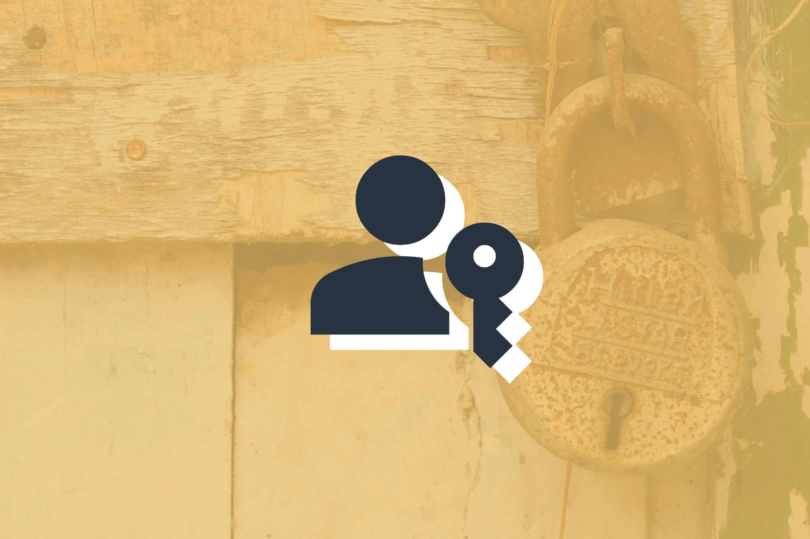

---
date:
    created: 2025-03-12T19:00:00Z
categories:
    - Explainers
authors:
    - fria
tags:
    - Passkeys
    - Passwords
license: BY-SA
---
# Toward a Passwordless Future

<small aria-hidden="true">Illustration: Jordan / Privacy Guides | Photo: Gowtham AGM / Unsplash</small>

Passwords are annoying, vulnerable to attack, and prone to human error. The multitude of issues with passwords has cost [millions](https://www.ibm.com/downloads/documents/us-en/107a02e94948f4ec) of dollars and forced terrible band-aid solutions in how we handle signing up for, logging in to, and securing online accounts. I'd like to break down some of these design paradigms that have entrenched themselves in our lives and how passkeys can lead to more secure and private online accounts.<!-- more -->

## How did we get here?

### Ancient Rome

Passwords are a surprisingly old concept, dating all the way back to ancient Rome. The ancient Roman historian Polybius in his *[Histories](http://www.perseus.tufts.edu/hopper/text?doc=Perseus%3Atext%3A1999.01.0234%3Abook%3D6%3Achapter%3D34)* describes how the Roman military would pass around a wooden tablet, or *tessera*, inscribed with a "watchword" that would allow them to identify each other as friendly.

### Prohibition

During Prohibition in the 1920s US, speakeasies, or private, unlicensed bars selling illegal alcohol, would require a spoken [password](https://prohibition.themobmuseum.org/the-history/the-prohibition-underworld/the-speakeasies-of-the-1920s/) to gain entry. The name comes from how quietly you had to say the password, so law enforcement didn't overhear.

### World War II

The US military later used [countersigns](https://en.wikipedia.org/wiki/Countersign_(military)#cite_note-2), consisting of a challenge and a password to identify allies. On D-Day, they used the challenge "flash" and the password "thunder." Thunder was used specifically because it was difficult for Germans to pronounce, since the English "th" sound doesn't exist in German. This is an example of a shibboleth, or a way of distinguishing groups of people based on cultural differences.

### 1960's

It wasn't long after the dawn of the electronic computer that a solution for authentication was needed. Computers in the 1950s were expensive and slow, only able to handle one problem at a time.

MIT's Compatible Time Sharing System (CTSS), pioneered by Fernando Corbató, aimed to solve this problem by allowing multiple users to do work at the same time, but they needed a way to authenticate specific users. "Putting a password on for each individual user as a lock seemed like a very straightforward solution" Corbató told Wired in an [interview](https://www.wired.com/2012/01/computer-password/).

These passwords weren't designed to be very secure. Fred Schneider, a computer science professor at Cornell University, said in the same Wired article "nobody wanted to devote many machine resources to this authentication stuff."

<small aria-hidden="true">Fernando Corbató with the CTSS | Photo: <a href="https://www.computerhistory.org/timeline/1961/">Computer History Museum</a></small>

### First Password Breach

The first password breach occurred not long after in 1962, detailed in a [pamphlet](https://www.multicians.org/thvv/compatible-time-sharing-system.pdf) written to commemorate the CTSS.

Allan Scherr, a Ph.D. researcher at MIT, wanted more time for his detailed simulations. He knew that the passwords were stored in a plaintext file, so he requested it to be printed offline and that was that: he now had everyone's password and all the time he could ask for.

A later incident in 1966 saw all users' passwords being printed at login due to the administrator accidentally swapping the master password file and the message of the day.

### Early Attempts at Securing Passwords

Clearly there was work to be done on securely storing passwords. A [paper](https://rist.tech.cornell.edu/6431papers/MorrisThompson1979.pdf) from 1979 by Robert Morris and Ken Thompson of Bell Laboratories outlines some requirements to bolster the security of passwords on a UNIX system.

#### Hashing

One of which is the need for passwords to not be stored in plaintext on the system, instead recommending storing a hash.

A hash is a one-way function: you give a certain input, and it spits out data that can't be easily reversed back to the input, even knowing the algorithm that was used. But, given the same input, you'll get the same output, allowing you to compare an inputted user password to a stored one.

In order to make it hard to brute force, the hashing algorithm should be fairly slow.

#### Password Requirements

They recommend certain requirements on the password entry program such as the classic 6-character minimum password length to prevent easily guessable passwords.

#### Salting

Password salting, a technique wherein a random string of characters is added to the end of the user's password before hashing, gets a mention as well. This prevents an attacker from simply pre-computing many password hashes ahead of time, and also prevents an attacker from knowing if the same password has been used on multiple systems just from comparing the hashes.

These guidelines would remain mostly unchanged for decades, save for improved hashing and salting algorithms.

## Unforeseen Consequences

What was originally a system designed for a few people sharing a computer in an academic and research setting has somehow remained almost unchanged decades later.

### Password Overload

Instead of remembering a single password for your computer, you now have potentially hundreds of passwords for various online accounts. A recent [survey](https://nordpass.com/blog/how-many-passwords-does-average-person-have/) by NordPass estimates that the average person has around 168 personal accounts, with a nearly 70% increase in just the last three years since the survey was taken. This is an untenable number of passwords for a human to remember, so we don't.

### Email Requirement

With the ever-present threat of users forgetting their passwords and therefore losing access to their account irrevocably, there needed to be a way to recover the account.

By the end of the dotcom bubble, email was fairly ubiquitous, so it made sense as a fallback way of authenticating. This had the added benefit of giving companies a way of contacting (read: spamming with ads) their customers.

While it's hard to say when it started happening, major websites like eBay were requiring email addresses on signup as far back as [1999](http://web.archive.org/web/19991122073209/http://pages.ebay.com/services/registration/register.html). Amazon was doing it back in [2001](https://web.archive.org/web/20011107052853/http://www.amazon.com/exec/obidos/flex-sign-in/?opt=oa&page=recs/sign-in-secure.html&response=tg/recs/recs-post-login-dispatch/-/recs). People I interviewed said that email-based signup was commonplace by the late 90s.

And so the precedent of requiring personal contact information to sign up for an account was born, at least partially due to the shortcomings of passwords.

### Terrible Security

#### Single Point of Failure

On top of the extra personal data now required for each online account, email acts as a one-stop shop for attackers looking to hack your accounts, either by getting into your email account itself or by sending you convincing password reset emails that send you to a phishing page that looks exactly like the real page.

With the advent of AI, phishing attacks have only gotten cheaper and easier.

Laughably, we're told to "look for typos" or "just feel out the vibes man" in order to defend against these attacks. What hope did we ever have?

This intersects a bit with how I think email is a terrible, outdated protocol that needs to be replaced, but that's a blog post for another day.

What's followed as a consequence of the tech industry's refusal to adapt to the security landscape is an unprecedented cybercrime industry, stealing an estimated [$44.2 million](https://aag-it.com/the-latest-phishing-statistics/) in 2021 through phishing scams. These are people whose only contribution to society is draining grandma's bank account, and they're absolutely raking it in.

#### Service Provider Negligence

But even if you do everything right and never fall for a phishing email, you can still be compromised due to the negligence of any one of the hundreds of service providers you rely on. Passwords need to be stored on a server somewhere, and if a service provider doesn't hash and salt them properly, a data breach will leave your account vulnerable.

Even if the *service provider* does everything right in terms of storing the password (which you have absolutely no way of verifying), in the event of a data breach the attackers will still have a hash of your password to attack.

There's typically also a period between the server receiving your password from the encrypted HTTPS tunnel and storing it securely as a hash where it handles your password in plaintext in order to compare it with what it has on file. Any vulnerabilities in the hardware could be catastrophic.

If you think this sounds like minor nitpicking, consider that in 2019, Facebook realized it had accidentally been storing [hundreds of millions of user passwords in plaintext](https://about.fb.com/news/2019/03/keeping-passwords-secure/).

#### Human Error

Even ignoring all of that, passwords rely on randomness to be secure, but they also rely on humans to generate them.

Humans are very bad at generating random numbers. We're so bad at it that it's possible to [uniquely identify](https://pubmed.ncbi.nlm.nih.gov/23626943/) you based on your pattern of "random" numbers.

That doesn't even matter though, since passwords, by requiring the user to type them whenever they want to log in and requiring the user to remember them, encourage minimum randomness and minimum length.

Most of us, even [IT experts](https://www.hipaajournal.com/92-of-it-leaders-guilty-of-password-reuse/), reuse passwords because we are so heavily incentivized to do so by how they fundamentally work.

The strategy historically has been to shame people for using bad passwords whenever their account gets hacked, which has prevented us from seeing the fundamental issues with the way we authenticate and instead making it every individual's responsibility to somehow fight the incentives of the system they rely on.

Imagine if every time you connected to a website with HTTPS, you had to come up with your own encryption key. Would that be a secure system?

## Band-aid Solutions

A common theme with passwords, and frankly many other things in the tech world, is stapling band-aid solutions on top of them to try and make them fit a modern use case they were never meant to serve.

### Password Managers

Password managers solve the issue of forgetting your passwords by acting as a secure repository for of all your passwords. You can even conveniently have them autofill your information for you on the login screen. They can generate strong passwords for you as well.

#### Single Point of Failure

Essentially, password managers try to eliminate the human error element of passwords. But in doing so, they introduce more attack surface: you now have a repository of all your login credentials conveniently located on your device, so if your device is compromised, all your accounts are also compromised.

So a user with a password manager has to worry about passwords being guessed, potential compromise of their email, or compromise of their password manager.

#### Security isn't Enforced

Not to mention that many of the protections of a password manager are optional. A user isn't required to generate secure passwords, many will just continue using the same passwords they always have.

#### Poor Phishing Protection

Although some argue autofill protects against phishing attacks, really it doesn't since as soon as it doesn't autofill, a user will simply copy and paste their password into the field. A proper anti-phishing mitigation would make it nearly impossible to authenticate with the wrong website. Autofill can introduce its own set of [vulnerabilities](https://github.com/google/security-research/security/advisories/GHSA-mhhf-w9xw-pp9x) as well.

### Salting and Hashing

Salting and hashing themselves I would consider band-aid solutions, as they were stapled on top of the existing system as security concerns grew. They rely a lot on the service providers implementing them properly and even still there are gaps in security as I previously mentioned.

### Two-Factor Authentication

Because of the risk of compromise with passwords, most websites implement some form of two-factor authentication.

#### Email 2FA

By far the most common is email 2FA, which on top of all the problems with using email as an authentication method stated before, usually only happens the first time you log in to a website on each device (until you clear your cookies that is).

#### SMS 2FA

SMS 2FA is also common. This method is vulnerable to [SIM swap attacks](https://www.verizon.com/about/account-security/sim-swapping) in which an attacker tricks your carrier into swapping your phone number onto a new SIM card under their control. SMS is also completely unencrypted, lacking even transport encryption.

The SS7 system underlying SMS is inherently [vulnerable to interception](https://youtu.be/wVyu7NB7W6Y?si=S8yzlWWh8zwuGraq). The idea of using SMS as a security tool is, frankly, laughable.

#### OTP

That brings us to [OTP](https://www.onelogin.com/learn/otp-totp-hotp) or One Time Password. This 2FA method relies on two things: a shared secret between you and the website called a "seed", and a "moving factor".

The moving factor changes, allowing you both to generate a temporary password based on the seed that you need to type in on login.

There are two main approaches to OTP.

##### HOTP

Hash-based Message Authentication Code OTP, or HOTP, increments the moving factor each time you successfully log in.

##### TOTP

In Time-based OTP or TOTP, the moving factor is time. The generated passwords will be valid for only about 30 to 60 seconds. The amount of time they're valid for is called a *time step*.

Of the two, TOTP is newer and considered more secure since the passwords are constantly expiring.

##### Issues

While a massive step up from SMS 2FA in terms of both privacy and security, they're still lacking in phishing resistance.

If you are sent to a fake login screen and put in your HOTP or TOTP password, the attacker can simply put that in to the real login screen. At least with TOTP there's a somewhat limited timeframe they can do it in, but these days phishing operations are fully automated, so it really doesn't matter.

Also since both you and the website are storing the same seed, any breach of either your device or the servers will leave you compromised. You could store your secret on a separate device or on a separate app on your phone, but this leaves the risk of either not having your phone with you to log in to your accounts or losing your TOTP codes due to the file getting corrupted or a bad update. Overall, OTP is better than SMS 2FA but still leaves a lot to be desired.

### Shoulder Surfing

Another oft-forgotten issue with passwords is that someone could just [watch you type it](https://www.insideedition.com/thieves-are-snatching-phones-and-stealing-personal-info-after-studying-victims-passwords-81548) in and hack your account that way. Most password fields replace the characters in your password with stars or dots to combat this, but they usually still give you the option to show your password in plaintext anyway. The screen isn't the only way you can leak your password either, someone filming or watching you type it in a keyboard or on your phone screen would have your password with little effort. A human doesn't even need to be present, AI models can now work out your password just by [listening](https://www.royalholloway.ac.uk/research-and-education/departments-and-schools/information-security/news/study-suggests-that-ai-can-detect-your-password-from-the-sound-of-keys-being-pressed/#:~:text=Artificial%20Intelligence%20can%20work%20out,Royal%20Holloway%2C%20University%20of%20London.) to you type it.

All of these are attempts, with varying success, at fixing the individual flaws with passwords rather than designing a solution from the ground up with security in mind. They add complexity, more steps in the process where either you or a service provider can screw something up.

## Passkeys: The Password Replacement

[Passkeys](https://fidoalliance.org/passkeys/) are FIDO credentials tied to a specific app or website that let you sign in with the same method you use to unlock your device, be that biometrics or a PIN.

<iframe title="Passkey Authentication" src="https://neat.tube/videos/embed/aa1e8c86-5ccb-41ca-bc20-7d1afe026759" frameborder="0" allowfullscreen="" sandbox="allow-same-origin allow-scripts allow-popups allow-forms" width="230" height="440"></iframe>

As long as you can remember your phone password, you can log in to your accounts. This frees you up to set a secure password on your device, since that's the only password you'd need to remember.

You may have heard of passkeys from Apple or Google and assumed they're some proprietary feature, but they're based on FIDO standards and the word "passkey" is meant to be a common noun like "password," not tied to any platform or company.

### No Personal Info

You also won't need to use a username or email when logging in with passkeys, although currently most implementations still require it. Passkeys can fully replace every aspect of logging in.

That means no email to send phishing attacks to or hack, and no SMS to be SIM swapped.

### Phishing Resistance

Passkeys operate using public-key cryptography just like how HTTPS works, so your private key isn't stored on the service provider's server, completely eliminating data breach issues with passwords. They were designed from the ground up to be phishing resistant and secure.

### Privacy

Since a unique key pair is generated for each account, you don't have to worry about being identified between accounts either. Hopefully soon you won't need to pay for that email aliasing service just to not be tracked across accounts.

### Protection Against Losing Your Account

You can even generate multiple passkeys per account in case you lose one somehow. Essentially this replaces the need for a recovery method; you can just add as many as you need, and they'll be available on all your devices anyway so losing your phone won't lock you out of your account.

### Anti-Shoulder Surfing

Passkeys fight shoulder surfing by allowing you to use biometrics on your device to sign in. Even in the event someone got your device password, they would still need the actual private key associated with your account, either through physical possession of your device or some other compromise of your password manager. Since the private key stays in your possession and is never sent anywhere unencrypted, the risk is minimal.

### Fully Syncable

Passkeys can be synced across devices and in the cloud as well, so you don't have to worry about losing them. And they'll be E2EE. Many password managers support passkeys, including Apple's and Google's built-in ones, so you can likely start using them right now.

### Try It Out

You can test out passkeys at [webauthn.io](https://webauthn.io). Even if your passkeys aren't synced to the device you're currently using, you can still login via a QR code, allowing your phone to act as a sort of wireless security key.

### Barriers

The main barrier to passkey adoption currently is lack of support from websites and apps. They either don't support passkeys at all, or still force you to sign up with a password, email, etc. with no way to delete them. I encourage you to contact any website or apps that don't have passkey support and request it, with the ability to signup and login without ever setting a password.
