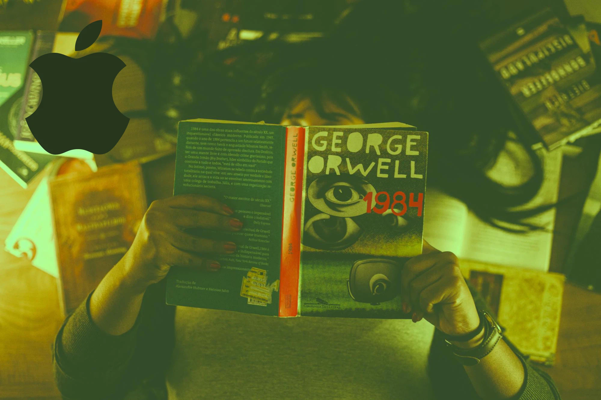

---
date:
    created: 2025-02-28T17:30:00Z
categories:
    - News
authors:
    - em
description: The UK government has served a technical capability notice to Apple under the UK Investigatory Act. Apple's response was to remove the Advanced Data Protection feature from the UK this week. What does this mean for Apple users in the UK and for encryption rights worldwide?
schema_type: ReportageNewsArticle
---
# The UK Government Forced Apple to Remove Advanced Data Protection: What Does This Mean for You?

<small aria-hidden="true">Illustration: Em / Privacy Guides | Photo: Edward Eyer / Pexels</small>

On February 7th this year, Joseph Menn [reported](https://www.washingtonpost.com/technology/2025/02/07/apple-encryption-backdoor-uk/) from the *Washington Post* that officials in the United Kingdom had contacted Apple to demand the company allows them to access data from any iCloud user [worldwide](https://data.parliament.uk/writtenevidence/committeeevidence.svc/evidencedocument/draft-investigatory-powers-bill-committee/draft-investigatory-powers-bill/written/26341.html). This included users who had activated Apple's [Advanced Data Protection](https://www.privacyguides.org/en/os/ios-overview/#icloud), effectively requesting Apple break its strong end-to-end encrypted feature.<!-- more -->

Sources familiar with the matter told the *BBC* and the *Washington Post* that UK's Home Office served a [technical capability notice](https://arstechnica.com/tech-policy/2017/05/investigatory-powers-act-legal-analysis/) to Apple under the UK Investigatory Powers Act. Details are scarce about exactly what happened between the UK government and Apple because [neither Apple nor the Home Office](https://www.bbc.co.uk/news/articles/cgj54eq4vejo) have publicly commented on the notice.

However, [last week](https://www.eff.org/deeplinks/2025/02/cornered-uks-demand-encryption-backdoor-apple-turns-its-strongest-security-setting) apparently in response, Apple has completely removed the opt-in Advanced Data Protection feature from the UK. As of the 21st, Apple users located in the UK cannot activate Advanced Data Protection (end-to-end encryption) for their iCloud Drive, iCloud Backup, Photos, Notes, and more.

This is terrible news for anyone in the UK, and a frightening omen for everyone worldwide.

## Why is end-to-end encryption so important?

**End-to-end encryption is a *crucial* technology for digital privacy and security.** When data is encrypted end-to-end, this means that only the sender(s)/owner(s) and intended recipient(s) (if any) can access it.

For example, if data stored on Apple's servers is end-to-end encrypted, this means that even Apple could not read this data. If a government wanted to scan all the end-to-end data stored by Apple, it would be impossible to do because even Apple does not possess the keys to decrypt (read) this data.

In the same line, if a criminal were to steal end-to-end encrypted data from Apple's servers, they would not be able to decrypt it either. **End-to-end encryption is the best defense against unauthorized access**, including data stolen by criminals or negligently leaked by organizations with poor security.

Any proposition to implement a "backdoor" to end-to-end encryption is *tragically misinformed*. While it might at first sound appealing and a fair way to grant access to supposedly benevolent entities only, this approach is *incredibly* naive and misguided.

Governments have repeatedly tried to propose these delusive policies, but it is simply impossible to add secret access to end-to-end encryption that would only be accessed by the intended groups no matter how good the intention. This is as absurd as poking a hole in a bowl and *demanding* only apple juice leak through it but not water or any other liquid. It's just impossible.

End-to-end encryption with a backdoor is simply not end-to-end anymore. As Signal Foundation's President Meredith Whittaker [said so well](https://signal.org/blog/uk-online-safety-bill/): "**Encryption is either broken for everyone, or it works for everyone. There is no way to create a safe backdoor.**"

The only way to keep the benefit of end-to-end encryption with all the protections it offers is to keep it thoroughly and strictly end-to-end, for everyone.

## Why some governments want to break encryption?

[Some governments](https://www.zdnet.com/article/the-encryption-war-is-on-again-and-this-time-government-has-a-new-strategy/) have been pushing really hard to demand access to end-to-end encrypted data from tech companies. While the ground for this might seem reasonable at first, it fails to consider how the technology works. **Encryption isn't magical, it is mathematical.**

American cryptographer Bruce Schneier [explains](https://www.schneier.com/blog/archives/2025/02/an-icloud-backdoor-would-make-our-phones-less-safe.html) this clearly, "it’s a restriction enforced by mathematics—cryptography—and not policy."

No matter how good a reason a third-party might have to decrypt a single piece of end-to-end encrypted data, if there is a way to access it by an unauthorized entity, then it offers no protection at all against any other accesses, whether legal or criminal.

Besides the this-is-actually-mathematically-impossible argument, let's say we were to remove end-to-end encryption protections entirely for everyone everywhere (which a backdoor would effectively do). The other problem governments and law enforcement seem to fail to understand is that **citizens' rights and safety should be the priority**.

Removing the lock on everyone's entry door possibly *could* make it easier for law enforcement to catch *some* criminals, it's true. But this would also **expose *everyone* to home invasion**, theft, vandalism, physical harm, and worse.

The price of removing the locks on everyone's doors is too high. Similarly, **the price of removing the locks on everyone's digital doors is also too high**.

Moreover, these governments always seem to assume that they, all well-intended benevolent governments of course, are assuredly reasonable and will only use this access to monitor the worst of criminals. Even if that was undoubtedly true *now*, these supposedly benevolent governments fail to consider these conditions might not always stay true.

What is a benevolent government today might very well turn into an authoritarian nightmare tomorrow.

Once implemented into the system, **the tools for mass surveillance can quickly turn against its own citizens** and victimize its most vulnerable population. This threat is always only [one change of government away](the-future-of-privacy.md).

## Why did Apple remove this feature from the UK?

Apple first introduced Advanced Data Protection in 2022. At the time, there was already in [a potential conflict](https://www.theguardian.com/technology/2022/dec/08/privacy-changes-apple-uk-government-online-safety-bill) with the UK's forthcoming Online Safety *Bill*, which despite [strong opposition](https://www.openrightsgroup.org/campaign/online-safety-bill-campaign-hub/) became law in 2023 and is now the Online Safety *Act*.

Although attacks on encryption coming from governments aren't new, policymakers in favor of mass surveillance have recently increased the pressure on tech organizations to implement and normalize systemic monitoring, even in democratic countries. This is an **extremely dangerous threat to privacy rights** and [human rights](https://www.amnesty.org/en/latest/news/2025/02/uk-encryption-order-threatens-global-privacy-rights/) around the world.

The giant Apple has long complied with law enforcement around the world and offers extensive [documentation](https://www.apple.com/legal/privacy/law-enforcement-guidelines-outside-us.pdf) to facilitate legal processes. However, when law enforcement requests access to data protected by end-to-end encryption, Apple does *not* have access to this data, by definition.

The only way for Apple to provide law enforcement with access to end-to-end encrypted data would be to either lie to customers and secretly break the encryption, or remove the feature entirely. Apple chose the latter this week.

This is horrifying news for anyone located in the UK losing access to this great protection. Moreover, it sets a dangerous precedent for other controlling governments to follow suit.

It's difficult to fully judge the situation while the notice process is shrouded in secrecy, but Apple could have certainly put more pressure against it. If there is a big tech company who can afford to fight back in defense of privacy rights it's certainly Apple. Especially with all the privacy promises Apple gave to its users.

At the risk of quoting Bruce Schneier's excellent [essay](https://www.schneier.com/blog/archives/2025/02/an-icloud-backdoor-would-make-our-phones-less-safe.html) twice in this article: **"The companies need to resist, and—more importantly—we need to demand they do."**

Each time a large organization like Apple gives in to oppressive requests, it increases the chance of these requests multiplying.

## Which Apple applications are affected?

At the moment, it's not possible for anyone located in the UK to activate Apple's opt-in Advanced Data Protection (ADP) feature anymore.

For UK users who have already activated ADP [instructions](https://www.macrumors.com/2025/02/26/advanced-data-protection-uk-need-to-know/) should follow soon, but it's probably a good time to look for alternative options (see [below](#what-to-do-if-you-are-living-in-the-uk)).

With ADP enabled, Apple users can benefit from end-to-end encryption on many more Apple applications. These applications include: iCloud Backup (including device and message backups), iCloud Drive, Photos, Notes, Reminders, Safari Bookmarks, Siri Shortcuts, Voice Memos, Wallet Passes, Freeform, and potentially some [third-party app data](https://support.apple.com/102651). If you cannot use ADP anymore, you will lose end-to-end encryption protections for these applications.

Some Apple services that aren't part of ADP will remain end-to-end encrypted in the UK (for now). Regardless, considering the political climate, it's likely a good idea to start [moving to alternatives](https://www.privacyguides.org/en/tools/) that are perhaps less likely to get compromised or removed in the near future.

Apple's applications that [still benefit](https://support.apple.com/102651) from end-to-end encryption to this day in the UK include: Passwords and Keychain, Health data, Journal data, Home data, iMessage (only if iCloud Backup is *disabled*!), Payment information, Apple Card transactions, Maps, QuickType Keyboard, Safari, Screen Time, Siri information, Wi-Fi passwords, Memoji.

## What does this mean for people in the UK, and the rest of the world?

For people in the UK, this is of course bad news and a very disappointing development. If this regional ADP block is maintained, it is a huge drawback for any Apple user's privacy rights, and a loss of data security as well.

For people outside the UK, **this is a loud warning alarm**. The UK government isn't the only one that has repeatedly tried to undermine encryption and privacy rights. While this might sound obvious for some authoritarian regimes, it's sadly also true for other governments considered open and democratic.

This push for mass surveillance seems to have gained even more force in the past few years, as end-to-end encryption features make their way more frequently into the market.

For anyone who cares about human rights, privacy rights, and democracy worldwide, **it is essential to push back hard against these legal proposal to undermine encryption**.

Likewise, it's not too late for UK residents to also push back and make themselves heard by their government by loudly opposing new (and old) legislation undermining encryption.

**Systemic surveillance should never be normalized.** Human rights can be lost, but they can also be won back with [strong opposition](https://www.openrightsgroup.org/press-releases/org-response-to-apple-killing-its-data-protection-tools-for-uk-users-encryption/).

## What to do about it?

But what about concrete actions? What can a concerned netizen of the world do right now?

Here are a few things that might help you protect your data better from now on, and find alternatives to the end-to-end encryption features you might have lost:

### What to do if you are living in the UK

- [x] Support and follow the Open Rights Group's [campaign to save encryption](https://www.openrightsgroup.org/campaign/save-encryption/).

- [x] Support [the petition](https://you.38degrees.org.uk/petitions/keep-our-apple-data-encrypted) organized by [Open Rights Group](https://www.openrightsgroup.org/) to tell your representatives you care about Apple's end-to-end encryption.

- [x] Replace iCloud Drive with an [end-to-end encrypted cloud service](https://www.privacyguides.org/en/cloud/).

- [x] Backup your Apple device(s) *locally only* and [encrypt your backups](https://support.apple.com/108353).

- [x] Stop syncing your photos with iCloud. Either use a recommended end-to-end encrypted [cloud service](https://www.privacyguides.org/en/cloud/) to sync it, or only keep your photos locally.

- [x] Replace Apple Notes with another [end-to-end encryption note application](https://www.privacyguides.org/en/notebooks/).

- [x] Replace Safari with a [privacy-respecting browser](https://www.privacyguides.org/en/desktop-browsers/).

- [x] If you can, [disable Siri entirely](https://www.digitaltrends.com/mobile/how-to-turn-off-siri/).

- [x] Go through all your Apple devices' settings, and be mindful to disable each option that could send data to Apple's servers if you do not want this data to potentially be scanned by a government or other entities.

- [x] Look for more privacy-respectful alternatives to Apple's products by browsing our [recommendations](https://www.privacyguides.org/en/tools/) section.

- [x] Continue to fight for privacy rights and encryption rights every chance you get! The battle isn't over.

### What to do if you are living in or outside the UK

Get information from and support organizations defending encryption rights like:

- [Global Encryption Coalition](https://www.globalencryption.org/about/) (you can even [join the coalition](https://www.globalencryption.org/about/members/)!)

- [Amnesty Tech](https://www.amnesty.org/en/tech/)

- [Center for Democracy & Technology](https://cdt.org/insights/cdt-joins-global-encryption-coalition-letter-on-uk-governments-use-of-investigatory-powers-act-to-attack-end-to-end-encryption/)

- [EFF](https://www.eff.org/deeplinks/2024/12/defending-encryption-us-and-abroad)

- [Fight for the Future](https://www.makedmssafe.com/)

- [Privacy Guides](https://donate.magicgrants.org/privacyguides) 💛

Use end-to-end encryption everywhere you can:

- [x] If you are an Apple user outside the UK, [activate Advanced Data Protection](https://support.apple.com/108756) on your devices.

- [x] Regardless of where you are and which device you use, **use end-to-end encryption features everywhere you can.**

- [x] If you cannot find a cloud service you trust, you can [locally encrypt your data](https://www.privacyguides.org/en/encryption/) before uploading it to a cloud service of your choice.

- [x] Look for other privacy-respectful alternatives browsing our [recommendations](https://www.privacyguides.org/en/tools/).

- [x] Fight for privacy rights and encryption rights every chance you get!
