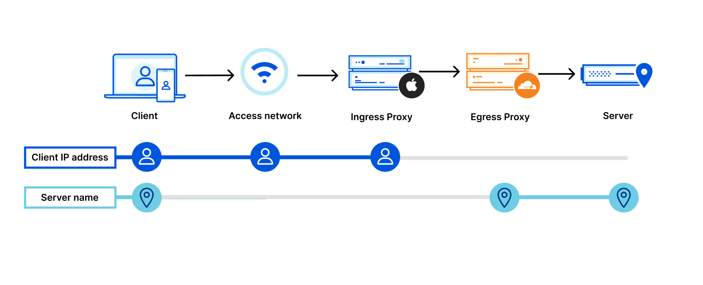

---
date:
    created: 2024-11-17
categories:
    - Opinion
authors:
    - fria
tags:
    - MPR
    - VPN
license: BY-SA
---
# Where are all the Multi-Party Relays?

Multi-Party Relays (MPRs) are a technology that aims to provide better privacy protections than VPNs do. MPRs showed a lot of promise when they first emerged, but years later there are fewer options than ever. What happened?<!-- more -->

## Traditional VPNs

The original purpose of Virtual Private Networks (VPNs) was to access a network privately when you're not physically there, with encryption in between, so you can securely access your files or manage your network from wherever you are. It extends the security you'd expect from being physically at your LAN to anywhere you are.

[Commercial VPNs](https://www.privacyguides.org/en/basics/vpn-overview) like Proton VPN use this technology to allow you to connect to *their* network, and then connect to your destination. This keeps sites and services you connect to from knowing your real IP address and using it as a metric to track you. But there's a problem here: you now need to fully trust your VPN provider in the same way you need to trust your ISP with all your internet traffic. This "shifting trust" problem has haunted VPNs for as long as they've been marketed as a privacy product. It's clear that a better solution is needed.

## The Alternative: Tor

Mix networks like [Tor](https://www.privacyguides.org/en/advanced/tor-overview) have solved this problem by decoupling the sender from the destination. No relay along the path has all the information: the entry (or *guard*) relay knows who you are but not where you're going, the middle relay knows the other two relays, and the exit relay knows the destination but not the sender. There's also separate encryption between each relay.

<figure markdown>
  
  
  <figcaption>Tor circuit pathway</figcaption>
</figure>

Tor provides great privacy properties, but the relays are run by volunteers, so they can be extremely slow and unreliable. Anyone who's tried to download a file while connected to Tor knows how painful it can be. Even normal browsing can be slow, with potentially minutes collectively wasted on loading times in any given browsing session. Tor is hands down the most private way to [browse the web](https://www.privacyguides.org/en/tor), and if your threat model calls for it there is no substitute. But for VPN users who want better privacy, an obvious next step is a paid solution where you have access to fast and reliable servers like on a VPN, and *also* separation between who you are and what you're connecting to.

## A Solution: Multi-Party Relays

Enter Multi-Party Relays. Services like iCloud Private Relay and (the unfortunately discontinued) INVISV Multi-Party Relay take inspiration from mix networks like Tor and separate the sender from the destination using two relays operated by different parties, as the name implies. There's separate encryption between each relay as well. MPRs *do* require you to trust that the two parties don't collaborate to correlate your traffic, so keep that in mind.

Typically, the first relay is controlled by the provider (either Apple or INVISV in the previous examples), and the second relay is controlled by another company such as Fastly or Cloudflare. These are big names, so you won't need to worry about reliability.

<figure markdown>
  
  <figcaption>source: <a href="https://blog.cloudflare.com/icloud-private-relay/">blog.cloudflare.com</a></figcaption>
</figure>

They also provide *speed*. Private Relay uses the QUIC protocol and as a result it's lightning fast. You wouldn't even know you were connecting to two servers in between your cat videos. The reliability is so good that I forget I even have it on. It even integrates with Safari and gives you a different IP address for different websites, similar to Tor's stream isolation.

So why haven't MPRs taken off? INVISV's Pretty Good Phone Privacy service never seemed to make it out of [beta](https://invisv.com/pgpp/#pgpp-release-notes). INVISV [partnered](https://invisv.com/articles/vivaldi-privacy-guard) with Vivaldi, but I can't seem to find any mention of it in the Vivaldi settings or on their website outside of the original [announcement](https://vivaldi.com/blog/desktop/privacy-guard-your-privacy-matters-vivaldi-browser-snapshot-3319-12/). INVISV ultimately [shut down](https://invisv.com/articles/service_shutdown.html) their service back in June. I hope to see more from them in the future because they were providing something that currently isn't possible to get anymore on Android.

That leaves [iCloud Private Relay](https://support.apple.com/en-us/102602) as the only commercial offering that I'm aware of, but it's limited to Apple devices only. Great for Apple users, but everyone else is left high and dry. As is Apple's way, they didn't want any extra inconvenience from using their service, so they restrict you to your real country and timezone. You don't have the same freedom to choose a server wherever in the world you want like a [traditional VPN service](https://www.privacyguides.org/en/vpn) would allow.

There is one more honorary mention: [OHTTP](https://blog.cloudflare.com/stronger-than-a-promise-proving-oblivious-http-privacy-properties). It's a new protocol with a design based on the same principles as those of MPRs: two servers, a relay and a gateway, that decouple the sender from the destination. It's already seeing use by large companies to maintain user privacy for things like Google's Safe Browsing and Apple's new Safari Highlights feature. Unfortunately, it's not quite comparable to MPRs. According to Cloudflare:

> OHTTP is not a general purpose proxy protocol: it's fit for purpose, aimed at transactional interactions between clients and servers (such as app-level APIs).

So it can't cover all the traffic on your device. Still, it's a promising protocol and I hope it becomes more widespread.

It really is a shame to see such a promising technology go so underutilized. Perhaps VPN companies could make their own MPR product and fill the gap in the market. Only time will tell.
