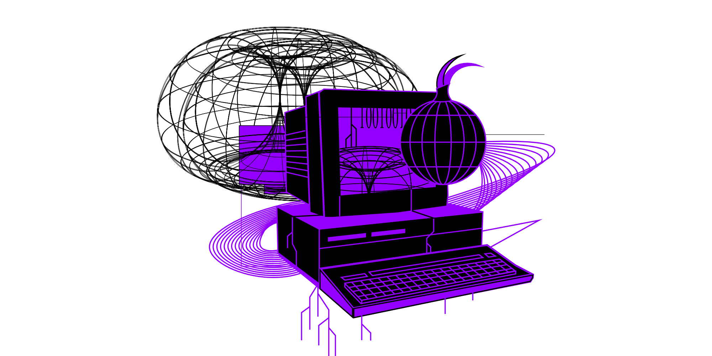

---
date:
    created: 2020-05-04
categories:
    - Opinion
authors:
    - sam-howell
links:
    - 'Tor Network <small>Relays and Bridges</small>': https://www.privacyguides.org/tor/#relays-and-bridges
tags:
    - Tor
    - Self-Hosting
license: BY-SA
description: Each Tor relay is the direct result of an individual deciding to sacrifice money, time and effort for the cause of fighting for a freer Internet.
schema_type: OpinionNewsArticle
---
# Why I Decided to Run a Tor Relay

It makes me smile when I come across someone struggling with the decision of whether to get a [VPN](https://www.privacyguides.org/vpn/). It makes me smile not because of the indecision and relative lack of knowledge, but because it wasn't so long ago I was in exactly the same position—perceiving VPNs to be some kind of extreme measure only the paranoid and the criminal resorted to. How wrong I was.<!-- more -->

In just a few months I've come to realize that something like a VPN is in fact a basic measure one might take in the effort to more freely roam the Internet—tainted as it is by censorship, surveillance and many other forms of state control. So where do you go from realizing these issues if you know them to be the threats that they are to democracy and freedom? You seek to *take control*.

You discover the [Tor Project](https://www.torproject.org/)—or rather, you learn more about a network that's been around for years and for years has suffered the type of reputation which only blinds everyday people from its incredible potential for positive change in numerous oppressed countries around the world.

At the time of writing there are over 6,300 Tor relays, and I like to think this number will continue to grow steadily. Each one—no matter its uptime, bandwidth or overall reputation, or whether it’s a Guard, Middle or Exit—each one is the direct result of an individual deciding to sacrifice money, time and effort for the cause of fighting for a freer Internet: enabling millions of users—journalists, bloggers, whistleblowers, activists and everyday people like you and I—to communicate anonymously, and therefore safely, wherever we are in the world.

Like many others, at first I was unsure about running my own relay. The usual doubts and questions arose: surely it's too difficult; I don’t know much about servers, and it’s surely expensive and beyond my skill-set to configure one as a Tor relay. But then I watched this talk ([Invidious Link](https://invidious.privacyguides.net/watch?v=Wl5OQz0Ko8c), [YouTube Link](https://youtube.com/watch?v=Wl5OQz0Ko8c)) by the articulate, intelligent and passionate Tor Project developer Jacob Appelbaum (if you do nothing else today, watch it).

Jacob couldn’t have made a better case for direct action, requesting of the audience:

> Raise your hand if you think anonymity is something that is good, and you think is a fundamental human right that we should all have...
> Now raise your hand if you want to do something about it...
> Now keep your hand up if you’re going to run a Tor relay...
> Everybody that put your hand down, why aren’t you running a Tor relay? You can do something about it right now.

And this is when it struck me, as I hope it struck many others at that talk: Am I doing enough? Can I claim to take this subject seriously if I’m not willing to invest the effort to really *be a part* of the solution? Not simply to donate money—which of course is still a great way to contribute—but to truly, technologically support the Tor network.

It struck me that I have enough money, time and access to the right information to run my own relay. So it begged the question: Why *wouldn’t* I?

At the time of writing my relay has been flagged ‘valid’, ‘running’ and ‘fast’ and is on track to have relayed around 750GB by the end of the month. It feels good. It feels really good.

---

*Sam is an elearning designer and privacy advocate interested in free (libre) software and how it can protect civil liberties. This article was [originally published](https://web.archive.org/web/20200508115203/https://samhowell.uk/dark/blog/blog-Tor_Relay.html) on my personal blog at [samhowell.uk](https://samhowell.uk), on February 15th, 2019.*
