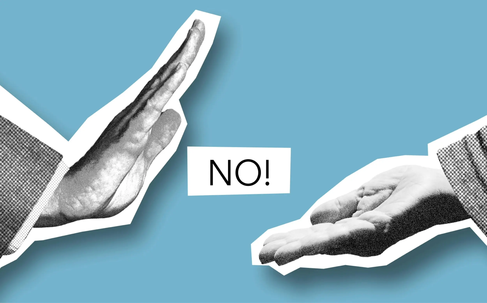

---
date:
    created: 2025-06-17T18:00:00Z
categories:
    - Opinion
authors:
    - em
description: |
    Sometimes, it can feel like our data is collected completely outside of our control or consent. But we still have a powerful weapon to fight back: The power to say no.
schema_type: Opinion
preview:
  cover: blog/assets/images/you-can-say-no/no-cover.webp
---

# You Can Say NO

<small aria-hidden="true">Photo: Gabby K / Pexels</small>

In the age of facial recognition and age verification, it might feel like our data is being harvested left and right, completely outside our control or consent. Yet, we still have a powerful weapon to fight back against surveillance: The power to say no.<!-- more -->

The power to say no is one we severely underutilize. Of course, there are circumstances where it can be difficult (impossible even!) to refuse. Saying no can come at a cost, but this isn't true everywhere, and (more importantly) that cost might be worth paying.

There are many occasions where we could indeed refuse to comply with privacy-invasive requests, but miss the opportunity.

However, it is vital as a community and as individuals that we exercise this right every time we possibly can, if we want to stand a fighting chance against the normalization of mass surveillance.

## Why people surrender

Many people agree to privacy-invasive requests despite feeling uncomfortable about it. They might not necessarily agree as much as *not refuse*, but the result is the same. There are many factors responsible for this:

### Time pressure

Sometimes, when a new request is rushed, people do not have sufficient time to evaluate the consequences of saying yes or no.

It's hard to make an informed decision when we get suddenly asked by a polite cashier "can I have your postal code?", or some airport worker instructing us to "just stand in line here to have your photo taken". We might get caught off guard and simply not process what is really happening.

When we do not have enough time or energy to properly evaluate the consequences of data collection, our default response should always be no. It's much easier to add data later on if needed, than to delete it.

### Default pressure

Other times, we might not even know we have a right to object.

There are so many instances in privacy where data collection is presented to us as just the normal way to proceed, without informing us properly about our other options. Of course, this is often by design, because people might never accept such intrusive practices otherwise.

For privacy consent, like for any other types of consent, it's important to remember that lack of an explicit and informed yes should equal to a no.

When we do not have sufficient information about why this data is collected and how it will be processed, our default response should always be to ask if there is an option to opt out or refuse.

### Peer pressure

Then, there's the peer pressure when everyone else is doing it.

Everyone else is on this platform, it must be okay. Everyone else has agreed to being recorded during this meeting, it must be okay. Everyone else is sharing a photo of their face, it must be okay. Everyone else is scanning their irises, it must be okay.

Do not get duped by popularity. Sometimes, the most popular things people are doing are the worst things to do. Even if it can be really hard to resist peer pressure and to swim against the tide, it's important to make informed decisions free from the influence of trends.

When we know a service, platform, or product doesn't respect our privacy rights, we should feel proud to take a stand and refuse to use it ourselves, even if everyone else uses it (for now).

Whether it's because we have been pressured in time, pressured by peers, or simply because we did not know we could say no, it is crucial we take the time to reflect on this preventively, in order to be prepared to say no the next time we have a chance to.

## There are consequences for saying no, but worse ones for saying yes

Unquestionably, saying no isn't free from consequences.

When refusing to provide an official ID to recover an account, we might lose that account. When refusing to provide biometric data to register, we might lose the opportunity to use this service. When refusing to participate in a privacy-invasive social media, we might lose friends who don't want to contact us using privacy-respectful platforms instead.

But what are the consequences for saying yes?

If we say yes all the time, even when we clearly have an option to object, to report, or to refuse to participate, we will soon lose our right to say no.

If everyone acquiesces to privacy-invasive requests and practices, companies and governments might soon think there is no point in keeping an opt-out option available at all, since most people are subserviently complying without making a fuss.

At the individual level, of course this means our data will be collected, processed, compiled, shared, and monetized in ways we know little about. Each time we say yes, it's a new data point in our tracking history to observe, judge, categorize, and manipulate us.

At the collective level, it's nothing less than the loss of our human rights and democracies.

Collectively, we have the power to tilt the balance in favor of privacy rights when we stand firm for it by refusing to consent to intrusive requests every time we can.

By refusing, we clearly express our rejection of this invasion and demand our right to privacy be respected. This sends a clear message to corporations and governments alike that the population does care about privacy rights.

If we value the right to privacy, it's our collective duty to protect it.

## How to say no?

How can we individually and collectively work to push for privacy rights by saying no everywhere we can?

Here are a few examples of practices you can adopt in your daily life that collectively will help to fight for privacy:

### Stop

Stop using the privacy-invasive platforms and services that you can. Move away and opt for [better social media, products, and services](https://www.privacyguides.org/en/tools/) that do respect your privacy and do not monetize your data.

This will take some time of course. Be patient. Pick one change at the time. Maybe this week [delete your Facebook account](https://www.privacyguides.org/en/social-networks/), and next month [migrate your emails](https://www.privacyguides.org/en/email/) away from Gmail.

Each time you stop using services from software companies that build their wealth on monetizing your data, you are saying no and taking a stand for privacy rights.

### Refuse

Refuse all cookies! It can be a real pain to browse the web with all these cookie banners. Of course, companies are hoping for [decision fatigue](https://en.wikipedia.org/wiki/Decision_fatigue) to manipulate you in clicking "yes, yes, yes, agree, continue, whatever!" But each time you comply in despair, you let them win against what you really want.

Websites are not obligated to have cookie banners if they do not use any privacy-invasive cookies. This annoyance doesn't come from legislation, it comes from the greed and stubbornness of corporations to harvest your data. There would be no cookie banners at all if they simply stopped tracking you and collecting your data.

Sabotage their plans by taking the time to find the "Reject All" button through their disingenuous button labyrinth.

Similarly, many privacy-invasive features maliciously try to present as "ethical" because you can "opt out". But what good is this protection if no one uses it? Put a spoke in their wheel, look for the hidden *opt-out* option, and refuse to participate every single time.

Beyond the digital realm, there are many in-person situations where you might have a right to refuse data collection as well.

For example, you may have the right to refuse face scans in airports and demand a "traditional" human verification instead. Look into your local regulation to find out more about this. If everyone refused to scan their face at the airport every time they can, this practice would soon die.

When you say yes to this, you are unfortunately contributing to the normalization of this invasive practice.

Finally, refuse to be recorded. Depending on your local regulation, it's likely there is a legal requirement to inform you when a meeting or interview will be recorded. It's also likely that you have a right to refuse. Exercise this right every time you can. Additionally, depending on your local regulation, report instances where you couldn't and should have been able to refuse.

### Report

Each time you witness a practice that violates privacy laws, report it to the data protection authority for your location.

Stay aware of which privacy law(s) are applicable in your region, and which official entity is responsible for enforcing the law. Your privacy protections are related to your *own* location, regardless of where the organization is based.

In Europe, this entity is often called a Data Protection Authority (DPA), but outside of Europe it's often called something else. It might be a Privacy Commissioner or a Supervisory Authority, for example (but not always either). Read the law (or summary of) for your region, it will include a description of whom this entity is and how to report non-compliance.

Report every infraction you see when you have the time. Sometimes, it's really as simple as sending a short email to the enforcing entity. One single complaint can trigger a full investigation sometimes. This can make an enormous difference.

If you can, reporting can also mean reporting to the media.

When you experience an invasive practice or witness a serious data protection violation, report it to the media if you are comfortable sharing. Personal accounts of such experience are important for collective awareness. The more people know, the more people talk, the more we stand a chance to keep our privacy rights alive. Make noise!

### Advocate

Talk to your friends, family, co-workers, and acquaintances about their options to opt out data collection, and their right to refuse and to say no.

Tell them about how important this is with the social media, software, and services they use. Tell them about the importance of looking for the rejection options on cookie banners, finding information on how to object to face scans at the airport, and refusing the use of AI note-takers during their medical consultations.

Talk about this topic on social media! Share news about privacy-invasive practices. Inform people on how they can opt out, refuse, and say no in your specific region.

## Saying no is a collective and individual responsibility

**Refusal is a powerful way to protest.** But like any protest, it must gather in numbers to have an impact at the collective level. The larger the number of people opting out and saying no, the stronger the message sent.

That being said, do not minimize the impact your individual actions have. **Every single action matters, even the smallest one.** Movements always start at the individual level. If nobody starts, then nobody follows.

By saying no each time, by stopping, refusing, reporting, and advocating, you are starting a movement. When advocating for the right to refuse privacy-invasive practices, you are growing a movement. Each of these contributions matters.

The consequences for not saying no would be leaving the next generations without any protections for their privacy. It would be disastrous for their individual rights, but also disastrous for democracy, freedom of speech, and so many rights we currently take for granted.

We cannot let our society slip into authoritarian mass surveillance. For ourselves and for the next generations, we must fight by saying no, every time we possibly can.
