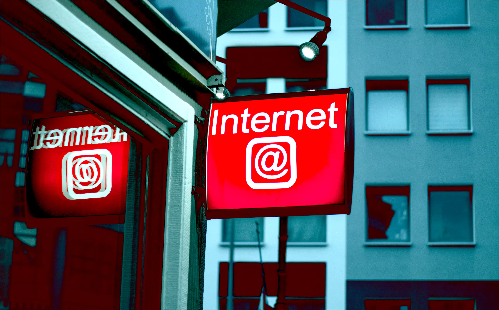

---
date:
    created: 2025-05-16T16:00:00Z
categories:
    - Opinion
authors:
    - em
description: If you, like myself, have been inhabiting the internet for a few decades, you're probably familiar with the old adage IRL (In Real Life). The acronym was used a lot when the distinction between online life and offline life was much greater than it is now. In today's world, can we really keep referring to our digital life as being somehow disconnected from our real life?
schema_type: OpinionNewsArticle
preview:
  cover: blog/assets/images/your-online-life-is-irl/irl-cover.webp
---

# Your Online Life Is IRL

<small aria-hidden="true">Leon Seibert / Unsplash</small>

If you, like myself, have been inhabiting the internet for a few decades, you're probably familiar with the old adage IRL: In Real Life.

The acronym was used a lot when the distinction between online life and offline life was much greater than it is now. In today's world, can we really keep referring to our digital life as being somehow disconnected from our "real life"?<!-- more -->

While it's true that pseudo-anonymity online is still alive and well, most people don't hide their real identity online because it's much different from their personality offline, but generally simply as a protection.

Even when using pseudonyms, online life is still part of *real life*.

The proportion of time we spend on the connected world today is also far greater than it was before. We often chat with friends online, work online, communicate with our family online, play games online, assist to events online, go to school online, watch recipe videos online, and so on and so forth.

## Our offline life is happening (and tracked) online too

Another thing that has changed is how much data about what we do offline ends up getting collected and stored *online*.

Maybe it's the places we visit during the day getting [tracked by our phones](https://www.pcmag.com/how-to/how-to-get-google-to-quit-tracking-you) and then stored by Google in our profile.

Maybe it's our [smart speaker recording](https://www.lifewire.com/can-alexa-record-conversations-5205324) an intimate conversation and sending it to Amazon.

Completely outside our control, maybe it's the street cameras, cellular towers, car license readers [tracking our movement](https://www.aclum.org/en/publications/what-you-need-know-about-automatic-license-plate-readers) outside as we go about our day.

Or even more dystopian, maybe it's our [doctor using an AI note-taking app](https://theconversation.com/some-clinicians-are-using-ai-to-write-health-records-what-do-you-need-to-know-237762), sending a copy of our very personal in-person medical consultation to who knows which for-profit company.

## Our digital lives and IRL lives are intertwined

All this data collected on what we do *offline*, can sometimes [get aggregated](https://epic.org/issues/consumer-privacy/data-brokers/) together with the data collected on us *online*, even while using pseudo-anonymity.

The social media account where we use a pseudonym and cat profile picture to stay anonymous can get aggregated from the same IP address we used to log in another account using our legal name.

Our offline data and our online data often get connected and bundled up together. This is especially concerning with the growing practice of [social media monitoring](https://privacyinternational.org/long-read/5337/social-media-monitoring-uk-invisible-surveillance-tool-increasingly-deployed) used by governments and companies.

## What we do online have offline consequences

Taking this into account, there isn't a separation between our *online* life and *offline* life anymore.

What we do online affects what we do offline, and vice versa. All of our life, online and offline, is *In Real Life* now.

Our digital life and communications can affect our employment, our dating life, our family life, our housing situation, and even the capacity we have to visit a country [or not](https://globalnews.ca/news/11090232/french-scientist-denied-us-entry-critical-trump-text-messages/).

## The data collected on us online should be cared for even more

Because there isn't much separation anymore, we should treat all data collected about us online as sensitive data intrinsically attached to our person.

An invasion of online privacy, of our online life, becomes the same as an invasion of our home, our body, our IRL life. Not only because this data can be used to find our IRL location, identify our person, and have important repercussions offline, but also because all data about us is an essential part of who we are.

It's not just data points, it's a part of us.

Considering how the world has evolved in the past decades, and shows no sign of slowing down its greedy appropriation of every single piece of information about us, **we should defend our online lives as fiercely as we would our offline lives**.

We need to fight for a future anchored in human rights, and for this, we need to firmly enforce the principle that **digital rights are fundamental human rights**.
