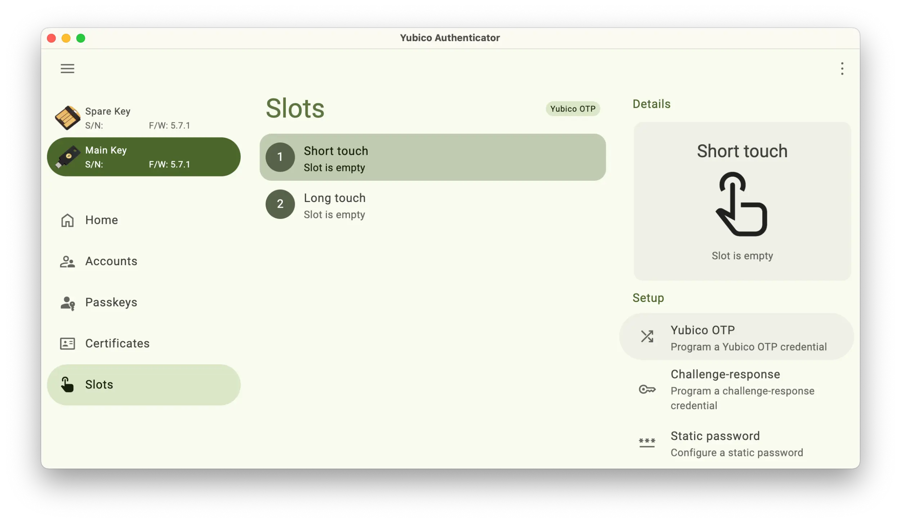

---
date:
    created: 2025-03-06T22:00:00Z
categories:
    - Tutorials
authors:
    - em
description: This tutorial demonstrates how to reset a YubiKey close to factory defaults and create a backup of most YubiKey applications on a spare key.
schema_type: AnalysisNewsArticle
---
# How to Reset Your YubiKey and Create a Backup


<small aria-hidden="true">Photo: Yubico</small>

If you are not familiar with it already, a YubiKey is a physical [security key](https://www.privacyguides.org/en/security-keys/) produced by [Yubico](https://www.yubico.com/) that can be used for various authentication and security purposes. One common usage is to use it as a second factor of authentication for a [service or product](https://www.yubico.com/works-with-yubikey/catalog/). This tutorial explains how to reset a YubiKey to factory defaults and create a near copy of it for backup purposes.<!-- more -->

The biggest security *advantage* to using a physical security key is that it's something you have that cannot be accessed remotely or easily emulated.

The biggest security *disadvantage* of using a physical security key is the risk of losing it. This is why you should always **get two** physical security keys, to use the second one as a **backup**.

There are many brands of physical security key, but this tutorial is specifically for YubiKey, one of the [most recommended brands](https://www.privacyguides.org/en/security-keys/).

To follow this tutorial, you will need to have **two YubiKeys** from either the series 5, 5 FIPS, 4, or 4 FIPS. Both these keys should not be currently in use with any of your accounts, as described in [Step 1](#step-1-remove-your-keys-from-all-accounts).

<div class="admonition danger" markdown>
<p class="admonition-title">Danger! Reset is irreversible!</p>

Do **not** skip Step 1 below! If one or both of your YubiKey(s) are registered with any account before starting the reset, **you must** first remove the key(s) from this account's settings.
Once a YubiKey application is reset, this operation is irreversible and previous settings will be lost permanently. **Be very careful about this!**

</div>

## :material-shield-key: Why would you need to reset your YubiKey?

Resetting your YubiKey *isn't* something you should be doing regularly.

If you use your key with a lot of services, it can be a laborious and even dangerous task, for example if you forget to remove an account and get permanently locked out once your key is reset. However, there are a few situations where you might want to do this:

### You accidentally "doxxed" yourself

When using a security key regularly, it isn't rare to accidentally touch your YubiKey and inadvertently trigger its [Challenge-response](https://docs.yubico.com/yesdk/users-manual/application-otp/challenge-response.html) in an inappropriate field. If this happens in the *wrong field*, this information could get stored in a service provider's log files for example.

Perhaps you also just "doxxed" yourself by unintentionally texting your key's Challenge-response to a puzzled recipient in a personal unencrypted social media Direct Message (true story).

The privacy risk of this is low but, depending on your situation, leaking your YubiKey's One-Time Password (OTP) Challenge-response in a plain text field *could* technically create a link between accounts. This is because despite the second part of the string changing every time, the first 12 characters are static, meaning this part always remains the same. This static part is the [Public ID](https://docs.yubico.com/yesdk/users-manual/application-otp/yubico-otp.html) of your YubiKey. When resetting your YubiKey, you can change this static part.

### Your key is compromised

Another situation that could make you want to reset your YubiKey is if you are in a very high risk situation and a sophisticated malicious actor had physical access to your key, especially if your key's firmware is [older than 5.7](https://www.yubico.com/support/security-advisories/ysa-2024-03/). If this person or group were able to physically accessed your key with older firmware, under some rare conditions, they [*could*](https://arstechnica.com/security/2024/09/yubikeys-are-vulnerable-to-cloning-attacks-thanks-to-newly-discovered-side-channel/) have cloned it.

If you are at risk and this happens to you, you would first need to revoke access to all the services you've used your compromised key with.

Then, to re-register a key with your services, the safest course of action would be to get an entirely new set of keys. But if this isn't possible, a second option could be to reset your key and re-register it with new credentials.

### You need to set up a backup

This is the most common situation we will be focusing on. You might need to reset your YubiKeys' applications simply to create a clone of it so that you have a backup.

Keeping a backup of your key is especially important for usages such as setting up a YubiKey as a second factor of authentication with KeePassXC, for example.

Some services will allow you to register two or more *different* keys to authenticate your account, but other services might only allow you to register one. This is when you want to make sure your have a backup of this key.

## :material-toolbox: Requirements and preparation

For this tutorial you will need:

- [x] Two YubiKeys (from series 5, 5 FIPS, 4, or 4 FIPS)
- [x] Computer running Linux, macOS, or Windows
- [x] Internet connection
- [x] Ability to install software on this computer

<div class="admonition success" markdown>
<p class="admonition-title">It is recommended to follow this tutorial from a desktop computer.</p></div>

### Step 1: Remove your keys from all accounts

First, make sure you are *not* using these two YubiKeys with any account, service, or product. **The importance of this cannot be stressed enough.** You do not want to realize next month you are *permanently locked out* of an account because you reset your key and forgot it was set up with that account.

If you are using these keys with any account, remove the keys from the setting of each account and test multiple times that you are able to log in without it. Ideally, start with fresh keys.

<div class="admonition tip" markdown>
<p class="admonition-title">YubiKey's applications can be reset independently</p>

Depending on your situation, you might want to reset one of your YubiKeys' application and not all.

Except for the YubiKey Bio Series Multi-protocol Edition (which we don't cover in this tutorial), each YubiKey application can be reset independently without affecting the others. You could for example reset your OTP slots without affecting your FIDO2 settings, and vice versa. For this tutorial, we will reset every application. Skip the ones you do not need to reset.

</div>

### Step 2: Download and install the Yubico Authenticator

Go to this Yubico website [page](https://www.yubico.com/products/yubico-authenticator/#h-download-yubico-authenticator), click on the link for your specific Operating System, then download and [install](https://docs.yubico.com/software/yubikey/tools/authenticator/auth-guide/installation.html) the **Yubico Authenticator** application on your computer.


### Step 3: Open the Yubico Authenticator and plug in your keys

Open the **Yubico Authenticator** application. If you can, insert both your YubiKeys in your computer's ports. If you can't insert both keys at once, insert your main YubiKey first, then for each step unplug your main key once you are done, plug in your spare key, and repeat each step.


From the "Home" section, you can see your keys' serial number, firmware version, as well as which applications are installed on your key. You can also set labels for each key and change the interface's color to make it easier to see which key you are configuring.


<div class="admonition tip" markdown>
<p class="admonition-title">If you don't see the menu options</p>

If you do not see the menu on the left (Home, Accounts, Passkeys, Certificates, Slots), make the **Yubico Authenticator** window wider or click on the 3-bar button on the upper-left. If you do not see the menu on the right (Device, Application), click on the 3-dot button on the upper-right.

</div>

## :material-key-alert: Resetting your YubiKey to factory defaults

<div class="admonition info" markdown>
<p class="admonition-title">Disabling applications</p>

From the "Device" menu, you can click on "Toggle applications" to enable or disable applications independently. Note that disabling a YubiKey application doesn't reset it, all credentials and settings will be [preserved](https://docs.yubico.com/software/yubikey/tools/authenticator/auth-guide/settings.html#toggle-yubikey-applications-on-off).

</div>

### Step 4: Delete your YubiKey's One-Time Password (OTP) application

This step will not reset your YubiKey's OTP application to exact factory defaults, but it will emulate a factory reset very closely once you have added new credentials in the following sections.

#### 4.1. From the Yubico Authenticator

Click on the "Slots" button in the left-side menu. You will see 2 slots listed there labeled as "Short touch" and "Long touch" slots. If these slots are configured already, under the label you will see "Slot is configured". Click on each configured slot.


#### 4.2. Delete credential

This will open a new menu on the right. Click on "Delete credential" (if you cannot see this option, it could be because your program window isn't big enough, scroll down to see more options).


A "Delete credential" message will pop up with a warning, click "Delete" on the lower-right.


Verify that you see both slots labeled with "Slot is empty" in the Slots section.


### Step 5: Reset your YubiKey's FIDO2, OATH, and PIV applications

<div class="admonition warning" markdown>
<p class="admonition-title">Compatibility:</p>

This step might not work fully with models older than YubiKey 5 and 5 FIPS Series

</div>

#### 5.1. Reset OATH

From the **Yubico Authenticator**, in the "Device" menu on the right, click on "Factory reset". On the "Factory reset" popup section, click on "OATH". You will see a checkmark appear over "OATH", then click on "Reset" on the lower-right.

<div class="admonition danger" markdown>
<p class="admonition-title">Danger! This step is irreversible!</p>

**Reset cannot be reversed!** Make sure you have properly unpaired all your accounts from this key before clicking "Reset".

</div>


#### 5.2. Reset FIDO2

From the "Device" menu, click on "Factory reset" again. This time click on "FIDO2". You will see a checkmark appear over "FIDO2", then click on "Reset" on the lower-right.


You will be prompted to unplug your YubiKey from your computer. Unplug it, wait for the Status message to change with "Reinsert your YubiKey" then plug it in again.

When prompted to "Touch the button on your YubiKey now", touch the gold part of your key.

You will see a confirmation message saying "FIDO application reset". You can now click on "Close" on the lower-right.


#### 5.3. Reset PIV

From the "Device" menu again, click on "Factory reset" again. This time click on "PIV". You will see a checkmark appear over "PIV", then click on "Reset" on the lower-right.


<div class="admonition success" markdown>
<p class="admonition-title">Reset your spare key too!</p>

If you inserted both of your keys at once, click on your spare key on the left-side key menu. Repeat the 3 steps above for your spare key. If you inserted only one key at the time, insert your second key and repeat this process.

</div>

### Step 6: Reset your YubiKey's OpenPGP and YubiHSM Auth applications

<div class="admonition warning" markdown>
<p class="admonition-title">Compatibility for YubiHSM Auth</p>

The YubiHSM Auth application is only available for YubiKeys with firmware version 5.4 or higher. Use the **Yubico Authenticator** to determine your YubiKey's firmware version.

</div>

To reset the OpenPGP and YubiHSM Auth applications of your YubiKey, you will need to install a Yubico CLI program called [**ykman CLI**](https://docs.yubico.com/software/yubikey/tools/ykman/Using_the_ykman_CLI.html) and use a terminal application.

You can install **ykman CLI** using a package manager such as **pip** or **brew**, or by downloading the package from the Yubico developer's website:

#### 6.1. Install ykman CLI

:material-monitor: From any OS, using the **pip** package manager:

Open a terminal application and type:

``` console { .yaml .copy }
pip install --user yubikey-manager
```

<div class="admonition info" markdown>
<p class="admonition-title">For Linux users</p>

Yubico makes the **ykman CLI** Python program files available on its [website](https://developers.yubico.com/yubikey-manager/Releases/) and on its [GitHub repository](https://github.com/Yubico/yubikey-manager). Consult the documentation provided to ensure you have all the programs required for the installation. Certain third-party package maintainers might also offer **ykman CLI** (also called YubiKey Manager CLI) for several Linux distributions other than Ubuntu.

</div>

:material-linux: From Linux (Ubuntu), using the Yubico developer's website:

On [this page](https://developers.yubico.com/yubikey-manager/Releases/), download the latest **`tar.gz`** file and decompress it. Run the **ykman** Python program using the command line from the directory you have installed it in.

:material-linux: From Linux (Ubuntu), using Yubico's **yubico/stable PPA** type:

Open a terminal application and type:

``` console title="Terminal"
sudo apt-add-repository ppa:yubico/stable
sudo apt update
sudo apt install yubikey-manager
```

:material-apple: From macOS, using the [Homebrew](https://brew.sh/) package manager:

Open a terminal application and type:

``` console { .yaml .copy }
brew install ykman
```

:material-apple: From macOS, using the Yubico developer's website:

On [this page](https://developers.yubico.com/yubikey-manager/Releases/), download the latest **`mac.pkg`** file, then double-click on it to complete the installation.

:material-microsoft-windows: From Windows, using the Yubico developer's website:

On [this page](https://developers.yubico.com/yubikey-manager/Releases/), download the latest **`win64.msi`** file, then double-click on it to complete the installation.

#### 6.2. Navigate to the application directory

You might need to navigate to the application's directory first:

<div class="admonition tip" markdown>
<p class="admonition-title">Installation path</p>

If you have chosen a different installation path from default, you will need to navigate to this installation path instead.

</div>

:material-apple: From macOS, in the terminal navigate to:

``` console { .yaml .copy }
cd /Applications/Yubico\ Authenticator.app/Contents/MacOS/
```

:material-microsoft-windows: From Windows, in the command prompt navigate to:

64-bit Systems:

``` console { .yaml .copy }
"C:\Program Files\Yubico\YubiKey Manager CLI\ykman.exe "
```

32-bit Systems:

``` console { .yaml .copy }
"C:\Program Files (x86)\Yubico\YubiKey Manager CLI\ykman.exe "
```

#### 6.3. Reset the applications

To make sure you reset both keys properly in this step, **only plug one key at the time** in your computer. Complete all the operations, unplug your main key then plug in your *spare* key and repeat.

Once your main key is plugged in, in the terminal or command prompt type this line:

``` console { .yaml .copy }
ykman openpgp reset
```

When prompted with this warning, type ++y++:

``` console
"WARNING! This will delete all stored OpenPGP keys and data and restore factory settings. Proceed? [y/N]:"
```

You should see this confirmation message:

``` console
"Reset complete. OpenPGP data has been cleared and default PINs are set."
```

<div class="admonition warning" markdown>
<p class="admonition-title">Security warning</p>

This operation will set default PINs for your YubiKey's OpenPGP application.

If you need to use this application later, you will need the default PINs. After reset, you should set up a new unique PIN and Admin PIN for this application, as explained on [Step 11](#step-11-generate-and-copy-an-openpgp-key-and-subkeys-to-your-yubikeys).

You can see more setting commands for this application in Yubico's [documentation](https://docs.yubico.com/software/yubikey/tools/ykman/OpenPGP_Commands.html).

</div>

From the terminal, type this line:

``` console { .yaml .copy }
ykman hsmauth reset
```

When prompted with this warning, type ++y++:

``` console
"WARNING! This will delete all stored YubiHSM Auth data and restore factory setting. Proceed? [y/N]:"
```

You should see this confirmation message:

``` console
"Reset complete. All YubiHSM Auth data has been cleared from the YubiKey."
```


<div class="admonition success" markdown>
<p class="admonition-title">Reset your spare key too!</p>

Don't forget to unplug your *main* key, plug in your *spare* key, and repeat the process from [Step 6.3](#63-reset-the-applications) to reset your spare key as well.

</div>

<div class="admonition info" markdown>
<p class="admonition-title">The ykman CLI program</p>

You can use the **ykman CLI** program to do a lot more with your YubiKey. If you want to explore this program further, you can consult Yubico's [documentation](https://docs.yubico.com/software/yubikey/tools/ykman/Using_the_ykman_CLI.html).

</div>

## :material-key-change: Setting up and backing up of your YubiKeys

Now that you have a set of two freshly reset YubiKeys, we will set up your main key while creating a backup of each application that allows it to your spare key. The goal here is to create a spare key that you can safely keep as a backup, in the unfortunate event that you were to lose your main key.

Keep in mind that your accounts and services will be only as protected as your *least* secured key. Make sure to **protect both keys** well.

### Step 7: Secure your keys

Before starting to use your keys, Yubico [recommends](https://docs.yubico.com/software/yubikey/tools/authenticator/auth-guide/piv-certificates.html) changing the default [PIN](https://docs.yubico.com/software/yubikey/tools/authenticator/auth-guide/piv-certificates.html#changing-the-pin), [PUK](https://docs.yubico.com/software/yubikey/tools/authenticator/auth-guide/piv-certificates.html#changing-the-puk), and [Management Key](https://docs.yubico.com/software/yubikey/tools/authenticator/auth-guide/piv-certificates.html#changing-the-management-key) from their factory values. If you are using a YubiKey from the 5 FIPS Series with firmware 5.7 or later, changing this is required to enter the [FIPS approved mode](https://docs.yubico.com/software/yubikey/tools/authenticator/auth-guide/settings.html#settings-home-fips-status).

#### 7.1. From the Yubico Authenticator

On the left-side menu, click on the "Certificates" button. You will see a section for various certificates in the center and in the right-side "Manage" menu, buttons to "Change PIN", "Change PUK", and "Management key".


#### 7.2. Change the default PIN

Click on the "Change PIN" button and a section will pop up. Enter a new PIN that is between 6 and 8 characters long, then click "Save".


#### 7.3. Change the default PUK

Click on the "Change PUK" button and a section will pop up. Enter a new PUK number that is between 6 and 8 characters long, then click "Save".


#### 7.4. Change the default Management key

Click on the "Management key" button and a section will pop up. Enter or generate a "New management key" with a maximum of 64 characters. You can also change the encryption algorithm to "TDES", "AES128", "AES192", or "AES256" and add a pin protection by clicking on "Protect with PIN".  Then click "Save".


<div class="admonition success" markdown>
<p class="admonition-title">Secure your spare key too! Don't forget to repeat all of these steps for your spare key!</p></div>

### Step 8: Create and register each key's OTP

First, you will need to set up your keys' OTP and register them with [YubiCloud](https://www.yubico.com/products/yubicloud/). For security reasons, this setup [cannot be cloned](https://support.yubico.com/hc/en-us/articles/360016614880-Can-I-duplicate-a-YubiKey) on your spare key. For services using OTP, you will need to register both of your keys which each service or product.

<div class="admonition tip" markdown>
<p class="admonition-title">Add both keys</p>

Each time you secure a new account with your YubiKey, make sure to add both keys right at the start. This will save you the complication of going back to add your spare key to your accounts later on.

</div>

#### 8.1. From the Yubico Authenticator

Click on the "Slots" button in the left-side menu. You will see 2 slots listed there labeled as "Short touch" and "Long touch" slots, both slots should be empty after the reset.

Click on the first "Short touch" slot, then on the right-side menu, click on the "Yubico OTP" button in "Setup". A "Yubico OTP" section will pop up with three text fields.




#### 8.2. For the Public ID field

The [**Public ID**](https://developers.yubico.com/OTP/OTPs_Explained.html) of your YubiKey will be the first 12 characters of your key's OTP string. This is the static part that *could* technically create a link between your accounts if you leak it somewhere inappropriate.

You can click on the "Use serial" star button on the right to generate a [ModHex](https://docs.yubico.com/yesdk/users-manual/application-otp/modhex.html) string from your key's serial number, or you can type your own manually.

<div class="admonition info" markdown>
<p class="admonition-title">If you decide to manually type your Public ID</p>

- Remember the string must be **12-characters** long

- You must only choose characters comprised within: **`bcdefghijklnrtuv`**

- Because this string remains constant, to increase your privacy, favor a random string that isn't recognizable or specifically interesting. For example, resist the temptation to choose something irresistibly cool like "`vvbetterdude`" or "`vvfiercenerd`".

</div>

#### 8.3. For the Private ID field

The [**Private ID**](https://developers.yubico.com/OTP/OTPs_Explained.html) of your YubiKey will also be 12-characters long but will not show in your key's OTP string. This **Private ID** can be used to store a private identity that can be accessed by a remote validation server holding the AES key used to encrypt the OTP.

You can click on the "Generate random" circle-arrow button on the right to generate a random ID, or you can type your own manually.

<div class="admonition info" markdown>
<p class="admonition-title">If you decide to manually type your Private ID</p>

- Remember the string must be **12-characters** long

- You must only choose characters comprised within: **`abcdef0123456789`**

- If you want to increase your privacy, again favor a random string that isn't recognizable or specifically interesting. For example, resist the overwhelming temptation to choose something unbearably cool like "`c0de1337cafe`" or "`bada55babe42`"

</div>

#### 8.4. For the Secret key field

The **Secret key** of your YubiKey's OTP is a 32-character long random string. Again, you can click on the "Generate random" circle-arrow button on the right to generate a random Secret key, or you can type your own manually. If you decide to use your own Secret key, characters must be comprised within the allowed **`abcdef0123456789`**.

<div class="admonition tip" markdown>
<p class="admonition-title">To remove automatic carriage return</p>

Automatically once you have filled all the fields, the option "Append" will get a checkmark. This means that each time you trigger your key's OTP, a carriage return will be added so that you will not have to press ++return++ each time. If you do not wish this to happen, you can click on "Append" to disable it.

</div>

#### 8.5. Save your OTP credentials

On the drop-down menu next to Append at the bottom, click on "No export file" and select "Select file". This will allow you to save this information locally and create a backup. You will need this information to register your keys later in [Step 8.7](#87-register-your-keys).

<div class="admonition danger" markdown>
<p class="admonition-title">Caution! Safeguard this file properly!</p>

This text file contains sensitive information in plain text. Make sure to pick a location to store it that is secure and encrypted. For example, do **not** store this file in a cloud service that isn't end-to-end encrypted. Ideally, only keep this file offline on an encrypted drive.

</div>


Once all the information is filled, click on "Save" at the lower-right. The file you save will have the following coma-separated format:

``` console
[serial_number],[public_id],[private_id],,[secret_key],[date],
```

#### 8.6. Set up the OTP credentials for your spare key

To set up the OTP for your spare key, go back to the "Slots" section and click on your *spare* key listed on the upper-left key menu. If you were only able to plug one key at the time, unplug your *main* key and plug in your *spare* key. Repeat Steps 8.1 to 8.5 with your spare key. Make sure to select a different file name for [Step 8.5](#85-save-your-otp-credentials) to not overwrite your main key's credential file.

#### 8.7. Register your keys

Now you will need to upload your keys' OTP credentials to the YubiCloud validation service. To avoid confusion, unplug one of your key and only keep one key plugged in at the time during the registration process.

Go to Yubico's [validation page](https://upload.yubico.com/) from a secure browser. Open the credentials file you have saved on [Step 8.5](#85-save-your-otp-credentials) and copy each field in the corresponding section.


For the "OTP from YubiKey" field, click on the text field and touch your key's gold part to generate it. Then click on "I'm not a robot", solve the annoying CAPTCHA, and click on "Upload".

On the next page, you should see "Yubico OTP key upload" and under it the confirmation: "Success!" and "Key upload successful".

Under you key's Public ID, you will see 3 steps validating your key. This can take some time, be patient and do not close this page.

Once your key's OTP credentials are fully uploaded to YubiCloud's validation server, you will see a "Try it out" green button appear. Click on it.


On this testing page, you can verify that your key's OTP slot works properly. Click on the "Yubico OTP" text field and touch the gold part of your key. You should see a small popup message on the lower-left confirming "OTP is valid". Try it a few times, then you can close this page.


Finally, unplug your main key, plug in your *spare* key, and repeat this step using your spare key's saved credentials. It's important to **register both your main and spare keys**.

### Step 9: Create and clone your key's Challenge-response

<div class="admonition success" markdown>
<p class="admonition-title">For use with KeePassXC</p>

This step is not necessary for all services, but is important for some services and products that will only allow you to register one key. For example, this is important if you wish to use YubiKey as a second factor to unlock your KeePassXC password database.

</div>

#### 9.1. From the Yubico Authenticator

If you can, insert both your main and spare keys at once, and start configuring your main key on the upper-left key menu.

Click on the "Slots" button in the left-side menu. You will see 2 slots listed there labeled as "Short touch" and "Long touch" slots.


<div class="admonition success" markdown>
<p class="admonition-title">Verify configuration</p>

If you have configured your keys' OTP in the previous step, the "Short touch" slot should now be labeled with "Slot is configured" and the "Long touch" slot should be empty.

</div>

Click on the "Long touch" slot, and on the right-side menu click on the "Challenge-response" button in "Setup". A "Challenge-response" section will pop up with a "Secret key" text field.


#### 9.2. Generate a Secret key and save it

Click on the "Generate random" circle-arrow button on the right to generate a key. Before clicking save, you must copy this **Secret key** at least temporarily somewhere safe. This is how you will be able to clone your key's [Challenge-response](https://docs.yubico.com/yesdk/users-manual/application-otp/challenge-response.html) to your spare key.

<div class="admonition danger" markdown>
<p class="admonition-title">Caution! Safeguard this Secret key properly!</p>

This **Secret key** can be used to clone your YubiKey's Challenge-response on any other keys.

If you only want to create one spare key, only copy this Secret key to a local text file and delete it fully once the configuration is completed and tested.

If you want to keep it to create more spare keys later on, make sure to choose a location to store it that is secure and encrypted. For example, do **not** store this Secret key in a cloud service that isn't end-to-end encrypted. Do **not** store this Secret key in the same password manager you will unlock it with. Ideally, only keep this Secret key locally, offline, on an encrypted drive.

</div>

Click on "Require touch" if you wish to have to touch your YubiKey each time your key's Challenge-response is solicited. This is recommended as it will limit your key's Challenge-response being triggered unintentionally. Then, click on "Save" on the lower-right.

#### 9.3. Clone your key's Challenge-response to your spare key

Back to the "Slots" section, click on your *spare* key in the upper-left key menu. The click on "Long touch" and on "Challenge-response" again. Make sure you have selected your *spare key* this time.


In the "Challenge-response" text field for your "Secret key", instead of generating a random one, paste the Secret key you have copied from your main key in the previous step. Click again on "Require touch" to enable it if you wish (optional), then click "Save". You should now see both your spare key's "Short touch" and "Long touch" labeled as configured.


<div class="admonition tip" markdown>
<p class="admonition-title">Make a note of which application is in each slot</p>

Although you can swap your YubiKey's slots, make a note of which application you have set up in which slot. If later on you need to delete an application to configure a different one, you want to make sure you delete the right one.

</div>

### Step 10: Register and copy your key's OATH-TOTPs, Passkeys, Static passwords, and OATH-HOTPs

<div class="admonition info" markdown>
<p class="admonition-title">YubiKey only has 2 configurable slots</p>

You can only set up 2 YubiKey slot applications at the time.

If you have already configured the 2 slots for the **Yubico OTP** and **Challenge-response** applications, and want to keep it that way, you will have no space to add a Static password or OATH-HOTP codes.

In this case, you might want to skip the optional Steps 10.3, 10.4, and 10.5. You will still be able to add OATH-TOTP codes and Passkeys, because these applications are not stored in slots.

</div>

#### 10.1. Register and copy OATH Time-based One-Time Password (OATH-TOTP) codes

To copy the OATH-TOTP authentication codes to your spare key, you will need to [use the same QR code](https://docs.yubico.com/software/yubikey/tools/authenticator/auth-guide/tips.html#oath-accounts) your were provided when originally registering an account on your main key.

When you [add a new account](https://docs.yubico.com/software/yubikey/tools/authenticator/auth-guide/oath.html#oath-add-an-account) to your YubiKey's OATH-TOTPs, keep a copy of the QR code provided by the service or product to be able to register it again with your spare key. Ideally, register both keys at once. Make sure to **secure this QR code properly**, as it could be used to register it with any other authenticator.

<div class="admonition tip" markdown>
<p class="admonition-title">If you have already registered an account</p>

If you have already registered an account and have not kept the QR code for your spare key, you can deregister your main key from this account and start the process over to add an authenticator app to this account. This time, use the QR code provided to register both keys at once, or securely keep a copy of the QR code to add it later.

</div>

Once you have registered a new OATH-TOTP code on your main key, you will not need to provide another time-based one-time password to this account when registering your spare key. You will only need to configure your spare key's OATH-TOTP code in the **Yubico Authenticator** application.

If you successfully completed the setup for both your main and spare keys, the OATH-TOTP code generated should be the same on both keys. You will be able to see all the OATH-TOTP codes registered on your keys from the **Yubico Authenticator**. For this, click on the "Accounts" button on the left-side menu.


To keep your accounts secure, delete the copy of the QR code you have kept once you have completed the registration setup for a new OATH-TOTP account on both your main and spare key (unless you need to keep a backup for other purposes).

Additionally, always make sure to note and secure well any account recovery information provided when adding a second factor of authentication. This is important to avoid getting locked out permanently of services or products.

#### 10.2. Register and copy Passkeys

To copy your [**Passkeys**](https://docs.yubico.com/software/yubikey/tools/authenticator/auth-guide/fido2.html#fido2) to your spare key, simply repeat the same setup process that was used to register the Passkey to your main YubiKey. To see a list of all the Passkeys stored on your key, in the **Yubico Authenticator** click on the "Passkeys" button on the left-side menu.


From the "Passkeys" section, you can also click on the "Set PIN" button the on right to [set up a password](https://docs.yubico.com/software/yubikey/tools/authenticator/auth-guide/fido2.html#creating-and-managing-the-fido2-pin) protection for your Passkeys.


#### 10.3. Optional: Delete YubiKey's slot(s) to install other application(s)

If you are not using the **Yubico OTP** and/or **Challenge-response** applications installed and copied in the previous steps, you might want to delete one or both slots to install either the **Static password** or the **OATH-HOTP** application instead. YubiKeys only have 2 slots, so you cannot use them all at once.

To delete a slot, click on the "Slots" button on the left-side menu, then select the slot you wish to delete. On the right-side menu, scroll down the "Setup" menu and click on "Delete credential".


You will be prompted with a warning message, then select "Delete". **Be careful however**, once deleted, there will be no way to restore the credentials you had stored there unless you have noted it elsewhere.


#### 10.4. Optional: Setup and copy Static passwords

To set up the [**Static password**](https://docs.yubico.com/software/yubikey/tools/authenticator/auth-guide/yubico-otp.html#static-passwords) application on your key, you must first allocate a slot to it. Click on the "Slots" button on the left-side menu, select the slot you wish to use, then click on "Static password" in the right-side menu.


A section will pop up with a text field, click on the "Generate random" circle-arrow button on the right to generate a **Password**. You can click on "Append" to deselect the carriage return if you prefer it removed from the end of your Password. This means you will have to press ++return++ manually to confirm each entry.

By default, the "Keyboard MODHEX" will be selected, but you can select a different "keyboard" if you prefer. This will change the type of characters used in your random Password.


Before confirming, copy this Password in a secure local text file temporarily. Then click "Save". Back to the "Slots" section, click on your *spare* key in the upper-left key menu. Then click on the same slot you have used with you main key and select again "Static password" on the right. When prompted with the text field again, paste the Password you have copied (make sure to select the same "keyboard" type). Then, click on "Save".


<div class="admonition tip" markdown>
<p class="admonition-title">If you forgot to note your Static password</p>

You can trigger your **Static password** from your main key by opening a secure local text file and touch the gold part of your YubiKey. If you have configured your **Static password** in the "Short touch" slot, only touch the key for a second. If you have configured it in the "Long touch" slot, touch your key for about 3 seconds until a string is generated (make sure not to trigger a different application). You can then copy this Static password string to your spare key.

</div>

#### 10.5. Optional: Setup and copy OATH HMAC-based One-Time Password (OATH-HOTP) codes

To set up [**OATH-HOTP**](https://docs.yubico.com/software/yubikey/tools/authenticator/auth-guide/yubico-otp.html#yubico-otp-hotp) 6 or 8 digits counter-based codes on your YubiKeys, you must first allocate a slot to it. Click on the "Slots" button on the left-side menu, select the slot you wish to use, then click on "OATH-HOTP" in the right-side menu.


An "OATH-HOTP" section will pop up with a "Secret key" text field. Enter a unique and secure Secret key of your choice.

Make sure the Secret key you choose has:

- **A maximum of 32 characters**

- An **even** number of characters (ex: not 31, but 32 will work)

- Only uses characters comprised within: letters from a to z, numbers from 2 to 7

<div class="admonition bug" markdown>
<p class="admonition-title">If you are asked for an Access code</p>

If you type a Secret key that is longer than 32 characters, you might encounter a bug where an "Access code" window will pop up, even if your key doesn't have any access code set up. If this happens, verify that your Secret key has 32 or fewer characters, and an even number of characters.

</div>


Keep a **secure copy of this Secret key in a local text file**. You will need it to register with the validation server for each account, and for your spare key.

You can click on "Append" to deselect it if you prefer the carriage return not be included at the end of your Secret key. This means you will have to press ++return++ manually to confirm each entry. Select either "6 digits" or "8 digits" for your OATH-HOTP codes, then click "Save".

To configure your spare key for the [OATH-HOTP](https://www.yubico.com/resources/glossary/oath-hotp/) counter-based codes, you will need to repeat this step with your *spare* key and use the [same](https://docs.yubico.com/software/yubikey/tools/authenticator/auth-guide/tips.html#register-a-spare-yubikey) OATH-HOTP Secret key and OTP length as your main key's configuration.

### Step 11: Generate and copy an OpenPGP key and subkeys to your YubiKeys

<div class="admonition info" markdown>
<p class="admonition-title">Default PINs</p>

If you have reset the **OpenPGP application** on [Step 6.3](#63-reset-the-applications), you will need both default PINs to set up new ones. After a factory reset of the OpenPGP application, the default PIN is "123456", and the default Admin PIN is "12345678".

</div>

#### 11.1. Secure your YubiKeys' OpenPGP application with a new PIN and Admin PIN

To secure this application after a reset, you should first set up new unique PINs for it. To do so, you will need to use the **ykman CLI** program you have installed on [Step 6.1](#61-install-ykman-cli) from a terminal application.

First, navigate to the application directory as described on [Step 6.2](#62-navigate-to-the-application-directory).

To change the first **default PIN**, type the following command in the terminal:

``` console { .yaml .copy }
ykman openpgp access change-pin
```

When prompted, enter the default PIN: **123456**.

Then, enter a **new unique 6-127 digits PIN**, and confirm this new PIN.

Your terminal should confirm with the message "User PIN has been changed." Note this new PIN somewhere secure where you will find it back easily, you will need it for the next steps.

To change the **default Admin PIN**, type the following command in the terminal:

``` console { .yaml .copy }
ykman openpgp access change-admin-pin
```

When prompted, enter the default PIN: **12345678**.

Then, enter a **new unique 8-127 digits PIN**, and confirm this new Admin PIN.

Your terminal should confirm with the message "Admin PIN has been changed." Note this new Admin PIN somewhere secure where you will find it back easily, you will need it for the next steps.


<div class="admonition success" markdown>
<p class="admonition-title">Secure your spare key as well!</p>

Unplug your *main* YubiKey and plug in your *spare* YubiKey. Repeat these steps to secure your spare key as well.

</div>

#### 11.2. Open or install the appropriate GPG application for your OS

Use the pre-installed software (Linux), or download and install a third-party software such as [GPG Suite](https://gpgtools.org/gpgsuite.html) (macOS) or [GPG4Win](https://www.gpg4win.org/download.html) (Windows) to generate and manage an OpenPGP key.

<div class="admonition warning" markdown>
<p class="admonition-title">Security recommendation</p>

Yubico strongly [recommends](https://support.yubico.com/hc/en-us/articles/360013790259-Using-Your-YubiKey-with-OpenPGP) to generate OpenPGP keys on an offline system, such as a live Linux distribution.

</div>

#### 11.3. Generate an OpenPGP key externally

Open a terminal application and type the following command:

``` console { .yaml .copy }
gpg --expert --full-gen-key
```

When prompted to select the type of key you wish to generate, enter `1` for "RSA and RSA (default)".

When asked "What keysize do you want?", type `4096`. Type `4096` as well for the subkey.


Follow the instructions to choose an expiration date for your OpenPGP key, and confirm with ++y++.

When prompted with "GnuPG needs to construct a user ID to identify your key", enter the **name** and **email address** you wish to use with this key. Finally, enter a **comment** you want associated with this key (optional), and confirm with `O` for Okay.

Once confirmed, a dialogue box should pop up from your **GPG software**. Create a **passphrase** to protect your OpenPGP key.


Go back to your terminal application, and type this command to find your OpenPGP key's ID:

``` console { .yaml .copy }
gpg --list-keys --keyid-format=long
```

If you have multiple keys already stored on your computer, this command will list all of your keys.

Only look at the last "key block" listed, and note its **key ID**. Each "key block" starts with a **`pub`** line, followed by a **`uid`** line(s), with potentially one or more **sub** lines (for subkeys).

Your OpenPGP **key ID** will be a string of numbers and uppercase letters on the **`pub`** line, after the "rsa4096" key type, and separated by a **/** character as follows:

``` console
pub     rsa4096/[key_id]
```

Note this **[key_id]** for the next steps.

#### 11.4. Add subkeys

You do not need to have any of your YubiKeys plugged in yet for this step.

<div class="admonition note" markdown>
<p class="admonition-title">You might not need to add each subkey type</p>

For this step, we will add one subkey for each of the 3 YubiKey OpenPGP application slots: **Signature key**, **Encryption key**, and **Authentication key**.

Depending on your usage, you might only need a specific type and not the others. Pick and choose what you need and ignore instructions for the others, if they're not relevant to you.

</div>

In a terminal application, type:

``` console
gpg --expert --edit-key [key_id]
```

This will start a **`gpg`** program prompt in your terminal. From there, type:

``` console { .yaml .copy }
addkey
```


When prompted with "Please select what kind of key you want" type `8`.

You will be asked to toggle on or off some subkey options.  Here, we will generate all 3 subkeys at once, but adjust this step to your required usage. You might also need different encryption algorithms for different subkeys (see options available from the previous **`gpg`** program question).

<div class="admonition tip" markdown>
<p class="admonition-title">To generate subkeys separately</p>

To add a **Signature subkey**: Toggle `E` to *disable* encrypt.

To add an **Encryption subkey**: Toggle `S` to *disable* sign.

To add an **Authentication subkey**: Toggle `S`, then toggle `E`, then toggle `A` to keep only Authenticate *enable*.

</div>

To generate all 3 subkeys, type ++a++ to *enable* Authenticate as well (Sign and Encrypt will already be enabled). On the line above the options, you should now see "Current allowed actions: Sign Encrypt Authenticate".

The type ++q++ to confirm your selection (Finished).


You will then be asked to choose a keysize, type `4096`.

Select an **expiration date** again (it should be the **same as the main OpenPGP key**). Confirm with ++y++ then ++y++ again.

When prompted by your GPG software, enter your OpenPGP key's passphrase, then click "OK".

Once the **`gpg`** prompt is back in your terminal, exit the program by typing `quit`, then save the changes with ++y++.

<div class="admonition info" markdown>
<p class="admonition-title">For more options on subkeys</p>

You might want to consult Yubico's [documentation](https://support.yubico.com/hc/en-us/articles/360013790259-Using-Your-YubiKey-with-OpenPGP) for more information on OpenPGP keys and subkeys.

</div>

#### 11.5. Backup your OpenPGP Private Key and subkeys

<div class="admonition danger" markdown>
<p class="admonition-title">Security warning</p>

Be careful to store your PGP Private Key securely. This information is very sensitive and should never be shared or stored on an unencrypted volume. For better security, store it externally offline on a fully encrypted USB stick.

</div>

If it is reasonably secure to store your private key and subkeys locally on your current device, type the following lines in your terminal (replace `[key_id]` with your specific key's ID).

<div class="admonition tip" markdown>
<p class="admonition-title">Change de default path</p>

Unless you change the path, this command will create a backup of your private key located in the directory you currently are in your terminal.

If you wish to store your private key backup elsewhere, navigate to another directory or add a specific path before the `backup_private_key.asc`. For example: `/Volumes/[secure_volume]/[secure_directory]/backup_private_key.asc`

</div>

``` console
gpg --armor --output backup_private_key.asc --export-secret-key [key_id]
```

You will be prompted by your GPG software to enter your OpenPGP key's passphrase, enter it then click "OK".

To also keep a copy of your subkeys, type the following line:

``` console
gpg --armor --output backup_private_subkeys.asc --export-secret-subkeys [key_id]
```

You will be prompted by your GPG software again to enter your OpenPGP key's passphrase, enter it then click "OK".

#### 11.6. Move your OpenPGP key and subkeys to your YubiKeys

**Insert your YubiKey** in your computer's port, then type:

``` console
gpg --edit-key [key_id]
```

This will show the details for the OpenPGP key (**`sec`**) you just created and its subkeys (**`ssb`**).

In the terminal **`gpg`** prompt, type the command:

``` console { .yaml .copy }
keytocard
```


When prompted with "Really move the primary key? (y/N)" type ++y++.

<div class="admonition bug" markdown>
<p class="admonition-title">If you encounter an error</p>

If you encounter a problem at this step, you might want to exit the terminal **`gpg`** program with `quit`, unplug your YubiKey from your computer, plug it in again, then start [Step 11.6](#116-move-your-openpgp-key-and-subkeys-to-your-yubikeys) over.

</div>

Assuming you have created all 3 subkey types in the previous step, when prompted with "Your selection?", type `1` to move the **Signature subkey** to your YubiKey:

``` console title="Terminal" hl_lines="1 2 6"
gpg> keytocard
Really move the primary key? (y/N) y
Please select where to store the key:
   (1) Signature key
   (3) Authentication key
Your selection? 1
```

Your GPG software will pop up and require you enter your OpenPGP key's passphrase. There will then be 2 more popups requiring you enter the OpenPGP application's **Admin PIN** you have just setup on [Step 11.1](#111-secure-your-yubikeys-openpgp-application-with-a-new-pin-and-admin-pin). You will be asked for your Admin PIN *twice*.


Back to the terminal **`gpg`** prompt, type `key 1` then `keytocard` again. This time select `2` to move the **Encryption subkey** to your YubiKey:

``` console title="Terminal" hl_lines="1 5 8"
gpg> key 1

---- [key_information] ----

gpg> keytocard
Please select where to store the key:
   (2) Encryption key
Your selection? 2
```

Again, enter your OpenPGP key's passphrase and your OpenPGP application's Admin PIN when prompted by your GPG software.

Back to the terminal **`gpg`** prompt, type `key 1` then `key 2` then `keytocard` again. This time select `3` to move the **Authentication subkey** to your YubiKey:

``` console title="Terminal" hl_lines="1 5 9 14"
gpg> key 1

---- [key_information] ----

gpg> key 2

---- [key_information] ----

gpg> keytocard
Please select where to store the key:
   (1) Signature key
   (2) Encryption key
   (3) Authentication key
Your selection? 3
```

Enter your OpenPGP key passphrase and your OpenPGP application's Admin PIN when prompted by your GPG software.

Finally, type `quit`, then ++y++ to save the changes before exiting the **`gpg`** terminal program.

#### 11.7. Verify that all your subkeys are stored properly to your YubiKey

From the terminal, type:

``` console { .yaml .copy }
gpg --card-edit
```

This will display the information stored inside your YubiKey's OpenPGP application.

From the information displayed in the terminal, you can see your YubiKey's serial number, version, some attributes, your OpenPGP key information, and the 3 subkey slots.

If you have completed the steps above properly, above "General key info" you should see the lines "Signature key", "Encryption key", and "Authentication key" all have information stored in it. Otherwise, instead of a string of uppercase letters and numbers you will see "[none]".

If all 3 slots are filled as expected, type `quit` to leave this **card** program.

#### 11.8. Copy your OpenPGP key and subkeys to your spare YubiKey

To make this operation work, you will have to delete your local key and subkeys and restore them from your backups.

First, **unplug your main YubiKey**. For the next step, you will need your OpenPGP key's and subkeys' *grip* strings. Type the following command in your terminal:

``` console { .yaml .copy }
gpg --list-secret-keys --with-keygrip
```

If you have multiple keys listed, only look at the last block for OpenPGP key and subkeys you just created.

Note carefully the **Keygrip** string for each key and subkeys.

For your OpenPGP key, look at the lines starting with "`sec>`" on the left. The **Keygrip** string will be just above "Card serial no".

For the subkeys, look at each block starting with "`ssb>`" on the left. The **Keygrip** string will be on the second line for each. It should look something like this:

``` console title="Terminal" hl_lines="3 7 9"
sec>  rsa4096 2025-03-04 [SC] [expires: 2025-03-06]
      ABC42ABC42ABC42ABC42ABC42[key_id]
      Keygrip = [key_grip]
      Card serial no. = 0000 [yubikey_serial_number]
uid           [ultimate] Name (Comment) <email@example.org>
ssb>  rsa4096 2025-03-04 [E] [expires: 2025-03-06]
      Keygrip = [subkey_grip]
ssb>  rsa4096 2025-03-04 [SEA] [expires: 2025-03-06]
      Keygrip = [subkey_grip]
```

Send a delete command for each key and subkeys:

<div class="admonition danger" markdown>
<p class="admonition-title">Danger! Make sure to delete the right key!</p>

If you have multiple keys stored on this computer, when noting the **Keygrip** make sure to note the correct one for the OpenPGP key you have just created and all its subkeys. You would not want to delete *another* important key you need.

For safety, it is recommended to keep a backup of your other keys as well before running the deletion commands below.

</div>

You will need to send a delete command to the GPG agent in order to be able to restore and copy your subkeys to your spare YubiKey. Type the following command and replace `[key_grip]` with the string you have noted above:

``` console
gpg-connect-agent "DELETE_KEY [key_grip]" /bye
```

Once you see the "OK", type the following command for your subkeys and replace `[subkey_grip]` with the strings you have noted above.

<div class="admonition success" markdown>
<p class="admonition-title">Repeat this command for each subkey with their respective Keygrip string.</p></div>

``` console
gpg-connect-agent "DELETE_KEY [subkey_grip]" /bye
```

Restore your key and subkeys:

To restore your OpenPGP key and subkeys from your backup, type the following command (add the specific directory path you used, if any):

``` console { .yaml .copy }
gpg --import backup_private_key.asc
```

Enter your OpenPGP key's passphrase when prompted by your GPG software. Then, for your subkeys type:

``` console { .yaml .copy }
gpg --import backup_private_subkeys.asc
```

Enter your OpenPGP key's passphrase again if prompted by your GPG software.

Copy your OpenPGP key and subkeys to your spare YubiKey:

**Plug in your *spare* YubiKey** in your computer's port. Make sure your main YubiKey is *unplugged*.

Repeat all the operations from [Step 11.6](#116-move-your-openpgp-key-and-subkeys-to-your-yubikeys) for your *spare* YubiKey. Use the same OpenPGP **[key_id]** you have used with your main YubiKey.

Again, verify that all your YubiKey's OpenPGP application slots have been filled properly by repeating [Step 11.7](#117-verify-that-all-your-subkeys-are-stored-properly-to-your-yubikey) with your spare YubiKey.

You can now `quit` this **card** program, unplug your *spare* YubiKey, plug in your main YubiKey again, and type `gpg --card-edit` again to verity that both your main and spare YubiKeys have the exact same "Signature key", "Encryption key", and "Authentication key" registered.

Following this procedure correctly, each of these subkey slots should be identical on your main and spare YubiKeys. The "General key info" should also be identical between your YubiKeys, but each "Serial number" should be different.

<div class="admonition info" markdown>
<p class="admonition-title">The gpg-card program</p>

From this command, you can change other parameters for your YubiKey's OpenPGP application if needed. To see more options, you can consult Yubico's [documentation](https://developers.yubico.com/PGP/PGP_Walk-Through.html).

</div>

<div class="admonition bug" markdown>
<p class="admonition-title">Troubleshooting</p>

If you need additional help to troubleshoot, reset, setup, or copy information to your spare YubiKey, you can contact Yubico's Customer Support service from [this form](https://support.yubico.com/hc/en-us/requests/new).

</div>

## :material-key-chain: Review your configuration

Once you have fully reset and reconfigured your 2 YubiKeys, make sure that you have:

- [x] Registered both keys with the YubiCloud validation server.

- [x] Tested each YubiKey application you will use on both keys before registering them with any service or product.

- [x] Configured properly all the protections and pins available to secure your keys.

- [x] Deleted the temporary files containing secrets that you no longer need for backup purposes.

- [x] Stored your spare key in a different secure location, once it's registered with your services and accounts.

Finally, do not forget to register your freshly re-programmed YubiKey(s) with the services and accounts you had to remove it from. Do not leave your accounts unprotected!

<div class="admonition info" markdown>
<p class="admonition-title">More information</p>

This tutorial only covers a few features and usages possible with YubiKeys, consult **Yubico Authenticator**'s [complete documentation](https://docs.yubico.com/software/yubikey/tools/authenticator/auth-guide/) and [guides](https://www.yubico.com/setup/) for more information.

</div>

<small aria-hidden="true">Unless credited otherwise, all screenshots from: Privacy Guides</small>
