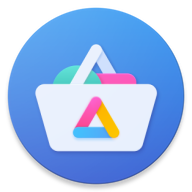
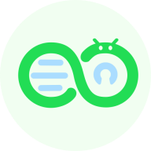

{ align=right }

The **Android Open Source Project** is an open-source mobile operating system led by Google which powers the majority of the world's mobile devices. Most phones sold with Android are modified to include invasive integrations and apps such as Google Play Services, so you can significantly improve your privacy on your mobile device by replacing your phone's default installation with a version of Android without these invasive features.

[:octicons-home-16:](https://source.android.com/){ .card-link title=Homepage }
[:octicons-info-16:](https://source.android.com/docs){ .card-link title=Documentation}
[:octicons-code-16:](https://cs.android.com/android/platform/superproject/){ .card-link title="Source Code" }

These are the Android operating systems, devices, and apps we recommend to maximize your mobile device's security and privacy. To learn more about Android:

- [General Android Overview :material-arrow-right-drop-circle:](android/overview.md)
- [Why we recommend GrapheneOS over CalyxOS :material-arrow-right-drop-circle:](android/grapheneos-vs-calyxos.md)

## AOSP Derivatives

We recommend installing one of these custom Android operating systems on your device, listed in order of preference, depending on your device's compatibility with these operating systems.

!!! note

    End-of-life devices (such as GrapheneOS or CalyxOS's "extended support" devices) do not have full security patches (firmware updates) due to the OEM discontinuing support. These devices cannot be considered completely secure regardless of installed software.

### GrapheneOS

!!! recommendation

    { align=right }
    { align=right }

    **GrapheneOS** is the best choice when it comes to privacy and security.

    GrapheneOS provides additional [security hardening](https://en.wikipedia.org/wiki/Hardening_(computing)) and privacy improvements. It has a [hardened memory allocator](https://github.com/GrapheneOS/hardened_malloc), network and sensor permissions, and various other [security features](https://grapheneos.org/features). GrapheneOS also comes with full firmware updates and signed builds, so verified boot is fully supported.

    [:octicons-home-16: Homepage](https://grapheneos.org/){ .md-button .md-button--primary }
    [:octicons-eye-16:](https://grapheneos.org/faq#privacy-policy){ .card-link title="Privacy Policy" }
    [:octicons-info-16:](https://grapheneos.org/faq){ .card-link title=Documentation}
    [:octicons-code-16:](https://grapheneos.org/source){ .card-link title="Source Code" }
    [:octicons-heart-16:](https://grapheneos.org/donate){ .card-link title=Contribute }

GrapheneOS supports [Sandboxed Google Play](https://grapheneos.org/usage#sandboxed-google-play), which runs [Google Play Services](https://en.wikipedia.org/wiki/Google_Play_Services) fully sandboxed like any other regular app. This means you can take advantage of most Google Play Services, such as [push notifications](https://firebase.google.com/docs/cloud-messaging/), while giving you full control over their permissions and access, and while containing them to a specific [work profile](android/overview.md#work-profile) or [user profile](android/overview.md#user-profiles) of your choice.

Google Pixel phones are the only devices that currently meet GrapheneOS's [hardware security requirements](https://grapheneos.org/faq#device-support).

### DivestOS

!!! recommendation

    { align=right }

    **DivestOS** is a soft-fork of [LineageOS](https://lineageos.org/).
    DivestOS inherits many [supported devices](https://divestos.org/index.php?page=devices&base=LineageOS) from LineageOS. It has signed builds, making it possible to have [verified boot](https://source.android.com/security/verifiedboot) on some non-Pixel devices.

    [:octicons-home-16: Homepage](https://divestos.org){ .md-button .md-button--primary }
    [:simple-torproject:](http://divestoseb5nncsydt7zzf5hrfg44md4bxqjs5ifcv4t7gt7u6ohjyyd.onion){ .card-link title=Onion }
    [:octicons-eye-16:](https://divestos.org/index.php?page=privacy_policy){ .card-link title="Privacy Policy" }
    [:octicons-info-16:](https://divestos.org/index.php?page=faq){ .card-link title=Documentation}
    [:octicons-code-16:](https://github.com/divested-mobile){ .card-link title="Source Code" }
    [:octicons-heart-16:](https://divested.dev/index.php?page=donate){ .card-link title=Contribute }

DivestOS has automated kernel vulnerability ([CVE](https://en.wikipedia.org/wiki/Common_Vulnerabilities_and_Exposures)) [patching](https://gitlab.com/divested-mobile/cve_checker), fewer proprietary blobs, a custom [hosts](https://divested.dev/index.php?page=dnsbl) file, and [F-Droid](https://www.f-droid.org) as the app store. Its hardened WebView, [Mulch](https://gitlab.com/divested-mobile/mulch), enables [CFI](https://en.wikipedia.org/wiki/Control-flow_integrity) for all architectures and [network state partitioning](https://developer.mozilla.org/en-US/docs/Web/Privacy/State_Partitioning), and receives out-of-band updates.

DivestOS also includes kernel patches from GrapheneOS and enables all available kernel security features via [defconfig hardening](https://github.com/Divested-Mobile/DivestOS-Build/blob/master/Scripts/Common/Functions.sh#L758). All kernels newer than version 3.4 include full page [sanitization](https://lwn.net/Articles/334747/) and all ~22 Clang-compiled kernels have [`-ftrivial-auto-var-init=zero`](https://reviews.llvm.org/D54604?id=174471) enabled.

DivestOS implements some system hardening patches originally developed for GrapheneOS. DivestOS 16.0 and higher implements GrapheneOS's [`INTERNET`](https://developer.android.com/training/basics/network-ops/connecting) and SENSORS permission toggle, [hardened memory allocator](https://github.com/GrapheneOS/hardened_malloc), [exec-spawning](android/grapheneos-vs-calyxos.md#additional-hardening), [JNI](https://en.wikipedia.org/wiki/Java_Native_Interface) [constification](https://en.wikipedia.org/wiki/Const_(computer_programming)), and partial [bionic](https://en.wikipedia.org/wiki/Bionic_(software)) hardening patchsets. 17.1 and higher features GrapheneOS's per-network full [MAC randomization](https://en.wikipedia.org/wiki/MAC_address#Randomization) option, [`ptrace_scope`](https://www.kernel.org/doc/html/latest/admin-guide/LSM/Yama.html) control, and automatic reboot/Wi-Fi/Bluetooth [timeout options](https://grapheneos.org/features).

!!! warning

    DivestOS firmware update [status](https://gitlab.com/divested-mobile/firmware-empty/-/blob/master/STATUS) and quality control varies across the devices it supports. We still recommend GrapheneOS depending on your device's compatibility. For other devices, DivestOS is a good alternative.

    Not all of the supported devices have verified boot, and some perform it better than others.

## Android Devices

When purchasing a device, we recommend getting one as new as possible. The software and firmware of mobile devices are only supported for a limited time, so buying new extends that lifespan as much as possible.

Avoid buying phones from mobile network operators. These often have a **locked bootloader** and do not support [OEM unlocking](https://source.android.com/devices/bootloader/locking_unlocking). These phone variants will prevent you from installing any kind of alternative Android distribution.

Be very **careful** about buying second hand phones from online marketplaces. Always check the reputation of the seller. If the device is stolen, there's a possibility of [IMEI blacklisting](https://www.gsma.com/security/resources/imei-blacklisting/). There is also a risk involved with you being associated with the activity of the previous owner.

A few more tips regarding Android devices and operating system compatibility:

- Do not buy devices that have reached or are near their end-of-life, additional firmware updates must be provided by the manufacturer.
- Do not buy preloaded LineageOS or /e/ OS phones or any Android phones without proper [Verified Boot](https://source.android.com/security/verifiedboot) support and firmware updates. These devices also have no way for you to check whether they've been tampered with.
- In short, if a device or Android distribution is not listed here, there is probably a good reason, so check our [discussions](https://github.com/privacyguides/privacyguides.org/discussions) page.

### Google Pixel

Google Pixel phones are the **only** devices we recommend for purchase. Pixel phones have stronger hardware security than any other Android devices currently on the market, due to proper AVB support for third-party operating systems and Google's custom [Titan](https://security.googleblog.com/2021/10/pixel-6-setting-new-standard-for-mobile.html) security chips acting as the Secure Element.

!!! recommendation

    { align=right }

    **Google Pixel** devices are known to have good security and properly support [Verified Boot](https://source.android.com/security/verifiedboot), even when installing custom operating systems.

    Beginning with the **Pixel 6** and **6 Pro**, Pixel devices receive a minimum of 5 years of guaranteed security updates, ensuring a much longer lifespan compared to the 2-4 years competing OEMs typically offer.

    [:material-shopping: Store](https://store.google.com/category/phones){ .md-button .md-button--primary }

Secure Elements like the Titan M2 are more limited than the processor's Trusted Execution Environment used by most other phones as they are only used for secrets storage, hardware attestation, and rate limiting, not for running "trusted" programs. Phones without a Secure Element have to use the TEE for *all* of those functions, resulting in a larger attack surface.

Google Pixel phones use a TEE OS called Trusty which is [open-source](https://source.android.com/security/trusty#whyTrusty), unlike many other phones.

The installation of GrapheneOS on a Pixel phone is easy with their [web installer](https://grapheneos.org/install/web). If you don't feel comfortable doing it yourself and are willing to spend a bit of extra money, check out the [NitroPhone](https://shop.nitrokey.com/shop) as they come preloaded with GrapheneOS from the reputable [Nitrokey](https://www.nitrokey.com/about) company.

A few more tips for purchasing a Google Pixel:

- If you're after a bargain on a Pixel device, we suggest buying an "**a**" model, just after the next flagship is released. Discounts are usually available because Google will be trying to clear their stock.
- Consider price beating options and specials offered at brick and mortar stores.
- Look at online community bargain sites in your country. These can alert you to good sales.
- Google provides a list showing the [support cycle](https://support.google.com/nexus/answer/4457705) for each one of their devices. The price per day for a device can be calculated as: $\text{Cost} \over \text {EOL Date }-\text{ Current Date}$, meaning that the longer use of the device the lower cost per day.

## General Apps

We recommend a wide variety of Android apps throughout this site. The apps listed here are Android-exclusive and specifically enhance or replace key system functionality.

### Shelter

!!! recommendation

    { align=right }

    **Shelter** is an app that helps you leverage Android's Work Profile functionality to isolate or duplicate apps on your device.

    Shelter supports blocking contact search cross profiles and sharing files across profiles via the default file manager ([DocumentsUI](https://source.android.com/devices/architecture/modular-system/documentsui)).

    [:octicons-repo-16: Repository](https://gitea.angry.im/PeterCxy/Shelter#shelter){ .md-button .md-button--primary }
    [:octicons-code-16:](https://gitea.angry.im/PeterCxy/Shelter){ .card-link title="Source Code" }
    [:octicons-heart-16:](https://www.patreon.com/PeterCxy){ .card-link title=Contribute }

    ??? downloads

        - [:simple-googleplay: Google Play](https://play.google.com/store/apps/details?id=net.typeblog.shelter)
        - [:simple-fdroid: F-Droid](https://f-droid.org/en/packages/net.typeblog.shelter)

!!! warning

    Shelter is recommended over [Insular](https://secure-system.gitlab.io/Insular/) and [Island](https://github.com/oasisfeng/island) as it supports [contact search blocking](https://secure-system.gitlab.io/Insular/faq.html).

    When using Shelter, you are placing complete trust in its developer, as Shelter acts as a [Device Admin](https://developer.android.com/guide/topics/admin/device-admin) to create the Work Profile, and it has extensive access to the data stored within the Work Profile.

### Auditor

!!! recommendation

    { align=right }
    { align=right }

    **Auditor** is an app which leverages hardware security features to provide device integrity monitoring for [supported devices](https://attestation.app/about#device-support). Currently, it only works with GrapheneOS and the device's stock operating system.

    [:octicons-home-16: Homepage](https://attestation.app){ .md-button .md-button--primary }
    [:octicons-eye-16:](https://attestation.app/privacy-policy){ .card-link title="Privacy Policy" }
    [:octicons-info-16:](https://attestation.app/about){ .card-link title=Documentation}
    [:octicons-code-16:](https://attestation.app/source){ .card-link title="Source Code" }
    [:octicons-heart-16:](https://attestation.app/donate){ .card-link title=Contribute }

    ??? downloads

        - [:simple-googleplay: Google Play](https://play.google.com/store/apps/details?id=app.attestation.auditor)
        - [:simple-github: GitHub](https://github.com/GrapheneOS/Auditor/releases)
        - [:material-cube-outline: GrapheneOS App Store](https://github.com/GrapheneOS/Apps/releases)

Auditor performs attestation and intrusion detection by:

- Using a [Trust On First Use (TOFU)](https://en.wikipedia.org/wiki/Trust_on_first_use) model between an *auditor* and *auditee*, the pair establish a private key in the [hardware-backed keystore](https://source.android.com/security/keystore/) of the *Auditor*.
- The *auditor* can either be another instance of the Auditor app or the [Remote Attestation Service](https://attestation.app).
- The *auditor* records the current state and configuration of the *auditee*.
- Should tampering with the operating system of the *auditee* after the pairing is complete, the auditor will be aware of the change in the device state and configurations.
- You will be alerted to the change.

No personally identifiable information is submitted to the attestation service. We recommend that you sign up with an anonymous account and enable remote attestation for continuous monitoring.

If your [threat model](basics/threat-modeling.md) requires privacy, you could consider using [Orbot](self-contained-networks.md#orbot) or a VPN to hide your IP address from the attestation service.
To make sure that your hardware and operating system is genuine, [perform local attestation](https://grapheneos.org/install/web#verifying-installation) immediately after the device has been installed and prior to any internet connection.

### Secure Camera

!!! recommendation

    { align=right }
    { align=right }

      **Secure Camera** is a camera app focused on privacy and security which can capture images, videos and QR codes. CameraX vendor extensions (Portrait, HDR, Night Sight, Face Retouch, and Auto) are also supported on available devices.

    [:octicons-repo-16: Repository](https://github.com/GrapheneOS/Camera){ .md-button .md-button--primary }
    [:octicons-info-16:](https://grapheneos.org/usage#camera){ .card-link title=Documentation}
    [:octicons-code-16:](https://github.com/GrapheneOS/Camera){ .card-link title="Source Code" }
    [:octicons-heart-16:](https://grapheneos.org/donate){ .card-link title=Contribute }

    ??? downloads

        - [:simple-googleplay: Google Play](https://play.google.com/store/apps/details?id=app.grapheneos.camera.play)
        - [:simple-github: GitHub](https://github.com/GrapheneOS/Camera/releases)
        - [:material-cube-outline: GrapheneOS App Store](https://github.com/GrapheneOS/Apps/releases)

Main privacy features include:

- Auto removal of [Exif](https://en.wikipedia.org/wiki/Exif) metadata (enabled by default)
- Use of the new [Media](https://developer.android.com/training/data-storage/shared/media) API, therefore [storage permissions](https://developer.android.com/training/data-storage) are not required
- Microphone permission not required unless you want to record sound

!!! note

    Metadata is not currently deleted from video files but that is planned.

    The image orientation metadata is not deleted. If you enable location (in Secure Camera) that **won't** be deleted either. If you want to delete that later you will need to use an external app such as [ExifEraser](data-redaction.md#exiferaser).

### Secure PDF Viewer

!!! recommendation

    { align=right }
    { align=right }

    **Secure PDF Viewer** is a PDF viewer based on [pdf.js](https://en.wikipedia.org/wiki/PDF.js) that doesn't require any permissions. The PDF is fed into a [sandboxed](https://en.wikipedia.org/wiki/Sandbox_(software_development)) [webview](https://developer.android.com/guide/webapps/webview). This means that it doesn't require permission directly to access content or files.

    [Content-Security-Policy](https://en.wikipedia.org/wiki/Content_Security_Policy) is used to enforce that the JavaScript and styling properties within the WebView are entirely static content.

    [:octicons-repo-16: Repository](https://github.com/GrapheneOS/PdfViewer){ .md-button .md-button--primary }
    [:octicons-code-16:](https://github.com/GrapheneOS/PdfViewer){ .card-link title="Source Code" }
    [:octicons-heart-16:](https://grapheneos.org/donate){ .card-link title=Contribute }

    ??? downloads

        - [:simple-googleplay: Google Play](https://play.google.com/store/apps/details?id=app.grapheneos.pdfviewer.play)
        - [:simple-github: GitHub](https://github.com/GrapheneOS/PdfViewer/releases)
        - [:material-cube-outline: GrapheneOS App Store](https://github.com/GrapheneOS/Apps/releases)

## Obtaining Applications

### GrapheneOS App Store

GrapheneOS's app store is available on [GitHub](https://github.com/GrapheneOS/Apps/releases). It supports Android 12 and above and is capable of updating itself. The app store has standalone applications built by the GrapheneOS project such as the [Auditor](https://attestation.app/), [Camera](https://github.com/GrapheneOS/Camera), and [PDF Viewer](https://github.com/GrapheneOS/PdfViewer). If you are looking for these applications, we highly recommend that you get them from GrapheneOS's app store instead of the Play Store, as the apps on their store are signed by the GrapheneOS's project own signature that Google does not have access to.

### Aurora Store

The Google Play Store requires a Google account to login which is not great for privacy. You can get around this by using an alternative client, such as Aurora Store.

!!! recommendation

    { align=right }

    **Aurora Store** is a Google Play Store client which does not require a Google Account, Google Play Services, or microG to download apps.

    [:octicons-home-16: Homepage](https://auroraoss.com/){ .md-button .md-button--primary }
    [:octicons-code-16:](https://gitlab.com/AuroraOSS/AuroraStore){ .card-link title="Source Code" }

    ??? downloads

        - [:simple-fdroid: F-Droid](https://f-droid.org/en/packages/com.aurora.store/)
        - [:simple-gitlab: GitLab](https://gitlab.com/AuroraOSS/AuroraStore/-/releases)

Aurora Store does not allow you to download paid apps with their anonymous account feature. You can optionally log in with your Google account with Aurora Store to download apps you have purchased, which does give access to the list of apps you've installed to Google, however you still benefit from not requiring the full Google Play client and Google Play Services or microG on your device.

### F-Droid

{ align=right width=120px }

F-Droid is often recommended as an alternative to Google Play, particularly in the privacy community. The option to add third-party repositories and not be confined to Google's walled garden has led to its popularity. F-Droid additionally has [reproducible builds](https://f-droid.org/en/docs/Reproducible_Builds/) for some applications and is dedicated to free and open-source software. However, there are problems with the official F-Droid client, their quality control, and how they build, sign and deliver packages, outlined in this [post](https://wonderfall.dev/fdroid-issues/).

Sometimes the official F-Droid repository may fall behind on updates. F-Droid maintainers reuse package IDs while signing apps with their own keys, which is not ideal as it does give the F-Droid team ultimate trust. The Google Play version of some apps may contain unwanted telemetry or lack features that are available in the F-Droid version.

We have these general tips:

- Check if the app developers have their own F-Droid repository first, e.g. [Bitwarden](https://bitwarden.com/), [Samourai Wallet](https://www.samouraiwallet.com/), or [Newpipe](https://newpipe.net/), which have their own repositories with less telemetry, additional features or faster updates. This is the ideal situation and you should be using these repositories if possible.
- Check if an app is available on the [IzzyOnDroid](https://apt.izzysoft.de/fdroid/) repository. The IzzyOnDroid repository pulls builds directly from GitHub and is the next best thing to the developers' own repositories. We recommend that you download the GitHub builds and install them manually first, then use IzzyOnDroid for any subsequent updates. This will ensure that the signature of the applications you get from IzzyOnDroid matches that of the developer and the packages have not been tampered with.
- Check if there are any differences between the F-Droid version and the Google Play Store version. Some applications like [IVPN](https://www.ivpn.net/) do not include certain features (eg [AntiTracker](https://www.ivpn.net/knowledgebase/general/antitracker-faq/)) in their Google Play Store build out of fear of censorship by Google.

Evaluate whether the additional features in the F-Droid build are worth the slower updates. Also think about whether faster updates from the Google Play Store are worth the potential privacy issues in your [threat model](basics/threat-modeling.md).

#### Neo Store

The official F-Droid client targets a [low API level](https://wonderfall.dev/fdroid-issues/#3-low-target-api-level-sdk-for-client--apps) and does not use the [seamless updates](https://www.androidcentral.com/google-will-finally-bring-seamless-app-updates-alternative-app-stores-android-12) feature introduced in Android 12. Targeting lower API levels means that the F-Droid client cannot take advantage of the new improvements in the application sandboxes that comes with higher API levels. For automatic updates to work, the F-Droid client requires that the [Privileged Extension](https://f-droid.org/en/packages/org.fdroid.fdroid.privileged/) be included in the operating system, granting it more privileges than what a normal app would have, which is not great for security.

To mitigate these problems, we recommend [Neo Store](https://github.com/NeoApplications/Neo-Store) as it supports seamless updates on Android 12 and above without needing any special privileges and targets a higher API level.

!!! recommendation

    { align=right }

    **Neo Store** is a modern F-Droid client made with MaterialUI, forked from [Foxy Droid](https://github.com/kitsunyan/foxy-droid).

    Unlike the official F-Droid client, Neo Store supports seamless updates on Android 12 and above without the need for a privileged extension. If your Android distribution is on Android 12 or above and does not include the [F-Droid privileged extension](https://f-droid.org/en/packages/org.fdroid.fdroid.privileged/), it is highly recommended that you use Neo Store instead of the official client.

    [:octicons-repo-16: Repository](https://github.com/NeoApplications/Neo-Store){ .md-button .md-button--primary }
    [:octicons-code-16:](https://github.com/NeoApplications/Neo-Store){ .card-link title="Source Code" }

    ??? downloads

        - [:simple-android: IzzyOnDroid (APK)](https://android.izzysoft.de/repo/apk/com.machiav3lli.fdroid)
        - [:simple-github: GitHub](https://github.com/NeoApplications/Neo-Store/releases)

### Manually with RSS Notifications

For apps that are released on platforms like GitHub and GitLab, you may be able to add an RSS feed to your [news aggregator](/news-aggregators) that will help you keep track of new releases.

   

#### GitHub

On GitHub, using [Secure Camera](#secure-camera) as an example, you would navigate to its [releases page](https://github.com/GrapheneOS/Camera/releases) and append `.atom` to the URL:

`https://github.com/GrapheneOS/Camera/releases.atom`

#### GitLab

On GitLab, using [Aurora Store](#aurora-store) as an example, you would navigate to its [project repository](https://gitlab.com/AuroraOSS/AuroraStore) and append `/-/tags?format=atom` to the URL:

`https://gitlab.com/AuroraOSS/AuroraStore/-/tags?format=atom`

#### Verifying APK Fingerprints

If you download APK files to install manually, you can verify their signature with the [`apksigner`](https://developer.android.com/studio/command-line/apksigner) tool, which is a part of Android [build-tools](https://developer.android.com/studio/releases/build-tools).

1. Install [Java JDK](https://www.oracle.com/java/technologies/downloads/).

2. Download the [Android Studio command line tools](https://developer.android.com/studio#command-tools).

3. Extract the downloaded archive:

    ```bash
    unzip commandlinetools-*.zip
    cd cmdline-tools
    ./bin/sdkmanager --sdk_root=./ "build-tools;29.0.3"
    ```

4. Run the signature verification command:

    ```bash
    ./build-tools/29.0.3/apksigner verify --print-certs ../Camera-37.apk
    ```

5. The resulting hashes can then be compared with another source. Some developers such as Signal [show the fingerprints](https://signal.org/android/apk/) on their website.

    ```bash
    Signer #1 certificate DN: CN=GrapheneOS
    Signer #1 certificate SHA-256 digest: 6436b155b917c2f9a9ed1d15c4993a5968ffabc94947c13f2aeee14b7b27ed59
    Signer #1 certificate SHA-1 digest: 23e108677a2e1b1d6e6b056f3bb951df7ad5570c
    Signer #1 certificate MD5 digest: dbbcd0cac71bd6fa2102a0297c6e0dd3
    ```
