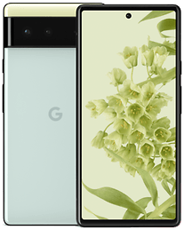
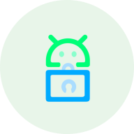

These are the Android operating systems, devices, and apps we recommend to maximize your mobile device's security and privacy. We also have additional Android-related information:

- [General Android Overview and Recommendations :material-arrow-right:](android/overview.md)
- [Android Security and Privacy Features :material-arrow-right:](android/security.md)
- [GrapheneOS vs CalyxOS Comparison :material-arrow-right:](android/grapheneos-vs-calyxos.md)

## AOSP Derivatives

Generally speaking we recommend installing one of these custom Android operating systems on your device, listed in order of preference, depending on your device's compatibility with these operating systems. If you are unable to run any of the following operating systems on your device, you are likely going to be best off sticking with your stock Android installation (as opposed to an operating system not listed here such as LineageOS), but we would recommend upgrading to a new device if at all possible.

!!! note

    End-of-life devices (such as GrapheneOS or CalyxOS's "extended support" devices) do not have full security patches (firmware updates) due to the original equipment manufacturer (OEM) discontinuing support. These devices cannot be considered completely secure regardless of installed software.

### GrapheneOS

!!! recommendation

    { align=right }
    { align=right }

    **GrapheneOS** is the best choice when it comes to privacy and security.

    GrapheneOS provides additional [security hardening](https://en.wikipedia.org/wiki/Hardening_(computing)) and privacy improvements. It has a [hardened memory allocator](https://github.com/GrapheneOS/hardened_malloc), network and sensor permissions, and various other [security features](https://grapheneos.org/features). GrapheneOS also comes with full firmware updates and signed builds, so [verified boot](https://source.android.com/security/verifiedboot) is fully supported.

    [Visit grapheneos.org](https://grapheneos.org/){ .md-button .md-button--primary } [Privacy Policy](https://grapheneos.org/faq#privacy-policy){ .md-button }

Notably, GrapheneOS supports [Sandboxed Google Play](https://grapheneos.org/usage#sandboxed-google-play). Google Play Services can be run fully sandboxed like a regular user app and contained in a work profile or user [profile](#android-security-privacy) of your choice. This means that you can run apps dependant on Play Services, such as those that require push notifications using Google's [Firebase Cloud Messaging](https://firebase.google.com/docs/cloud-messaging/) service. GrapheneOS allows you to take advantage of most [Google Play Services](https://en.wikipedia.org/wiki/Google_Play_Services) whilst having full user control over their permissions and access.

Currently, only [Pixel phones](https://grapheneos.org/faq#device-support) meet its hardware security requirement and are supported.

### CalyxOS

!!! recommendation

    { align=right }

    **CalyxOS** is a system with some privacy features on top of AOSP, including [Datura firewall](https://calyxos.org/docs/tech/datura-details), [Signal](https://signal.org) integration in the dialer app, and a built in panic button. CalyxOS also comes with firmware updates and signed builds, so [verified boot](https://source.android.com/security/verifiedboot) is fully supported.

    [Visit calyxos.org](https://calyxos.org/){ .md-button .md-button--primary } [Privacy Policy](https://calyxinstitute.org/legal/privacy-policy){ .md-button }

To accomodate users who need Google Play Services, CalyxOS optionally includes [MicroG](https://microg.org/). With MicroG, CalyxOS also bundles in the [Mozilla](https://location.services.mozilla.com/) and [DejaVu](https://github.com/n76/DejaVu) location services.

Currently, CalyxOS only supports [Pixel phones](https://calyxos.org/docs/guide/device-support/).

### DivestOS

!!! recommendation

    { align=right }

    **DivestOS** is a [soft-fork](https://en.wikipedia.org/wiki/Fork_(software_development)#Forking_of_free_and_open-source_software) of [LineageOS](https://lineageos.org/).
    DivestOS inherits many [supported devices](https://divestos.org/index.php?page=devices&base=LineageOS) from LineageOS. It has signed builds, making it possible to have [verified boot](https://source.android.com/security/verifiedboot) on some non-Pixel devices.

    [Visit divestos.org](https://divestos.org){ .md-button .md-button--primary } [Privacy Policy](https://divestos.org/index.php?page=privacy_policy){ .md-button }

DivestOS has automated kernel vulnerability ([CVE](https://en.wikipedia.org/wiki/Common_Vulnerabilities_and_Exposures)) [patching](https://gitlab.com/divested-mobile/cve_checker), fewer proprietary blobs, a custom [hosts](https://divested.dev/index.php?page=dnsbl) file, and [F-Droid](https://www.f-droid.org) as the app store. It includes [UnifiedNlp](https://github.com/microg/UnifiedNlp) for network location. Its hardened WebView, [Mulch](https://gitlab.com/divested-mobile/mulch), enables [CFI](https://en.wikipedia.org/wiki/Control-flow_integrity) for all architectures and includes [network state partitioning](https://developer.mozilla.org/en-US/docs/Web/Privacy/State_Partitioning).

DivestOS also includes kernel patches from GrapheneOS and enables all available kernel security features via [defconfig hardening](https://github.com/Divested-Mobile/DivestOS-Build/blob/master/Scripts/Common/Functions.sh#L758). All kernels newer than version 3.4 include full page [sanitization](https://lwn.net/Articles/334747/) and all ~22 Clang-compiled kernels have [`-ftrivial-auto-var-init=zero`](https://reviews.llvm.org/D54604?id=174471) enabled.

DivestOS 16.0, 17.1, and 18.1 implements GrapheneOS's [`INTERNET`](https://developer.android.com/training/basics/network-ops/connecting) permission toggle, [hardened memory allocator](https://github.com/GrapheneOS/hardened_malloc), [exec-spawning](#additional-hardening), [JNI](https://en.wikipedia.org/wiki/Java_Native_Interface) [constification](https://en.wikipedia.org/wiki/Const_(computer_programming)), and partial [bionic](https://en.wikipedia.org/wiki/Bionic_(software)) hardening patchsets. 17.1 and 18.1 feature GrapheneOS's per-network full [MAC randomization](https://en.wikipedia.org/wiki/MAC_address#Randomization) option, and [`ptrace_scope`](https://www.kernel.org/doc/html/latest/admin-guide/LSM/Yama.html) control, and automatic reboot/Wi-Fi/Bluetooth [timeout options](https://grapheneos.org/features). All branches additionally have various miscellaneous patches courtesy of GrapheneOS.

!!! attention

    DivestOS firmware update [status](https://gitlab.com/divested-mobile/firmware-empty/-/blob/master/STATUS) varies across the devices it supports. For Pixel phones, we still recommend using GrapheneOS or CalyxOS. For other supported devices, DivestOS is a good alternative.

    Not all of the supported devices have [verified boot](https://source.android.com/security/verifiedboot), and some perform it better than others.

## Android Devices

Avoid buying phones from mobile network operators. These often have a **locked bootloader** and do not support [OEM unlocking](https://source.android.com/devices/bootloader/locking_unlocking). These phone variants will prevent you from installing any kind of alternative Android distribution.

Be very **careful** about buying second hand phones from online marketplaces. Always check the reputation of the seller. If the device is stolen there's a possibility of [IMEI blacklisting](https://www.gsma.com/security/resources/imei-blacklisting/). There is also a risk involved with you being associated with the activity of the previous owner.

A few more tips regarding Android devices and operating system compatibility:

- Do not buy devices that have reached or are near their end-of-life, additional firmware updates must be provided by the manufacturer.
- Do not buy preloaded LineageOS or /e/ OS phones or any Android phones without proper [Verified Boot](https://source.android.com/security/verifiedboot) support and firmware updates. These devices also have no way for you to check whether they've been tampered with.
- In short, if a device or Android distribution is not listed here, there is probably a good reason, so check our [discussions](https://github.com/privacyguides/privacyguides.org/discussions) page.

### Google Pixel

!!! recommendation

    { align=right }

    **Google Pixel** devices are known to have good security and properly support [Verified Boot](https://source.android.com/security/verifiedboot), even when installing custom operating systems.

    Beginning with the **Pixel 6** and **6 Pro**, Pixel devices receive a minimum of 5 years of guaranteed security updates, ensuring a much longer lifespan compared to the 2-4 years competing OEMs typically offer.

    [Visit store.google.com](https://store.google.com/category/phones){ .md-button .md-button--primary }

Unless you know you have a specific need for [CalyxOS/microG features](https://calyxos.org/features/) that are unavailable on GrapheneOS, we strongly recommend GrapheneOS over other operating system choices on Pixel devices.

[More about GrapheneOS vs CalyxOS](android/grapheneos-vs-calyxos.md){ .md-button }

The installation of GrapheneOS on a Pixel phone is easy with their [web installer](https://grapheneos.org/install/web). If you don't feel comfortable doing it yourself and are willing to spend a bit of extra money, check out the [NitroPhone](https://shop.nitrokey.com/shop) as they come preloaded with GrapheneOS from the reputable [Nitrokey](https://www.nitrokey.com/about) company.

A few more tips for purchasing a Google Pixel:

- If you're after a bargain on a Pixel device, we suggest buying an "**a**" model, just after the next flagship is released. Discounts are usually available because Google will be trying to clear their stock.
- Consider price beating options and specials offered at [brick and mortar](https://en.wikipedia.org/wiki/Brick_and_mortar) stores.
- Look at online community bargain sites in your country. These can alert you to good sales.
- Google provides a list showing the [support cycle](https://support.google.com/nexus/answer/4457705) for each one of their devices. The price per day for a device can be calculated as: $\text{Cost} \over \text {EoL Date }-\text{ Current Date}$, meaning that the longer use of the device the lower cost per day.

### Other Devices

Google Pixel phones are the only devices which are fully supported by all of our recommended Android distributions. Additionally, Pixel devices have stronger hardware security than any other Android device currently on the market, due to Google's custom Titan security chips acting as the Secure Element for secrets storage and rate limiting. Secure Elements are more limited and have a smaller attack surface than the Trusted Execution Environment (TEE), which is also used to run "trusted" programs. Most other phones do not have a Secure Element and have to using the TEE for both secrets storage, rate limiting, and trusted computing."

If you are unable to purchase a Pixel device, any device which is supported by CalyxOS should be reasonably secure and private enough for most users after installing CalyxOS.

In any case, when purchasing a device we recommend getting one as new as possible. The software and firmware of mobile devices are only supported for a limited time, so buying new extends that lifespan as much as possible. 

We do not recommend the following devices over a Google Pixel device, but we do have some notes on devices from other manufacturers:

#### OnePlus

If you are unable to obtain a Google Pixel, recent OnePlus devices provide a good balance of security with custom operating systems and longevity, with OnePlus 8 and later devices receiving 4 years of security updates. CalyxOS has [experimental support](https://calyxos.org/news/2022/04/01/fairphone4-oneplus8t-oneplus9-test-builds/) for the **OnePlus 8T** and **9**.

DivestOS has support for most OnePlus devices up to the **OnePlus 7T Pro**, with varying levels of support.

#### Fairphone

!!! danger

    Out of the box, Fairphone devices are incredibly insecure. [Fairphone's stock bootloader trusts the public AVB signing key](https://forum.fairphone.com/t/bootloader-avb-keys-used-in-roms-for-fairphone-3-4/83448/11), meaning any system can be installed and the phone will trust it as if it is the stock system. This essentially breaks verified boot on a stock Fairphone device.

    This problem is solved when you install a custom operating system such as CalyxOS or DivestOS and trust the developer's signing keys rather than the stock system's. To reiterate, **you must install a custom operating system with custom boot keys to use Fairphone devices in a secure manner.**

CalyxOS has [experimental support](https://calyxos.org/news/2022/04/01/fairphone4-oneplus8t-oneplus9-test-builds/) for the **Fairphone 4**. DivestOS has builds available for the **Fairphone 3**.

While Fairphone markets their devices as receiving 6 years of support, the SOC (Qualcomm Snapdragon 750G on the Fairphone 4) has a considerably sooner EOL date. This means that firmware security updates from Qualcomm for the Fairphone 4 will end in September 2023, regardless of whether Fairphone continues to release software security updates.

## General Apps

### Orbot

!!! recommendation

    { align=right }

    **Orbot** is a free proxy app that routes your connections through the Tor Network.

    [Visit orbot.app](https://orbot.app/){ .md-button .md-button--primary }

    **Downloads**
    - [:fontawesome-brands-google-play: Google Play](https://play.google.com/store/apps/details?id=org.torproject.android)
    - [:pg-f-droid: F-Droid](https://guardianproject.info/fdroid)
    - [:fontawesome-brands-github: GitHub](https://github.com/guardianproject/orbot)
    - [:fontawesome-brands-gitlab: GitLab](https://gitlab.com/guardianproject/orbot)

Orbot can proxy individual apps if they support SOCKS or HTTP proxying. It can also proxy all your network connections using [VpnService](https://developer.android.com/reference/android/net/VpnService) and can be used with the VPN killswitch (⚙️ Settings → Network & internet → VPN → ⚙️ → Block connections without VPN).

For resistance against traffic analysis attacks, consider enabling *Isolate Destination Address* ( ⁝ →Settings → Connectivity). This will use a completely different Tor Circuit (different middle relay and exit nodes) for every domain you connect to.

!!! attention

    Orbot is often outdated on the Guardian Project's [F-Droid repository](https://guardianproject.info/fdroid) and [Google Play](https://play.google.com/store/apps/details?id=org.torproject.android) so consider downloading directly from the [GitHub repository](https://github.com/guardianproject/orbot) instead.

    All versions are signed using the same signature so they should be compatible with each other.

### Shelter

!!! recommendation

    { align=right }

    **Shelter** is an app that helps you leverage the Android work profile to isolate other apps.

    Shelter supports blocking contact search cross profiles and sharing files across profiles via the default file manager ([DocumentsUI](https://source.android.com/devices/architecture/modular-system/documentsui)).

    [Visit gitea.angry.im](https://gitea.angry.im/PeterCxy/Shelter){ .md-button .md-button--primary }

    **Downloads:**
    - [:fontawesome-brands-google-play: Google Play](https://play.google.com/store/apps/details?id=net.typeblog.shelter)
    - [:pg-f-droid: F-Droid](https://f-droid.org/en/packages/net.typeblog.shelter)
    - [:fontawesome-brands-github: GitHub](https://github.com/PeterCxy/Shelter)
    - [:fontawesome-brands-git-alt: Source](https://gitea.angry.im/PeterCxy/Shelter)

!!! attention

    As CalyxOS includes a device controller, we recommend using their built in work profile instead.

    Shelter is recommended over [Insular](https://secure-system.gitlab.io/Insular/) and [Island](https://github.com/oasisfeng/island) as it supports [contact search blocking](https://secure-system.gitlab.io/Insular/faq.html).

    When using Shelter, you are placing complete trust in its developer as Shelter would be acting as a [Device Admin](https://developer.android.com/guide/topics/admin/device-admin) for the work profile and has extensive access to the data stored within it.

### Auditor

!!! recommendation

    { align=right }
    { align=right }

    **Auditor** is an app which leverages hardware security features to provide device integrity monitoring for [supported devices](https://attestation.app/about#device-support). Currently it works with GrapheneOS and the device's stock operating system.

    [Visit attestation.app](https://attestation.app){ .md-button .md-button--primary }

    **Downloads:**
    - [:fontawesome-brands-google-play: Google Play](https://play.google.com/store/apps/details?id=app.attestation.auditor)
    - [:fontawesome-brands-github: GitHub](https://github.com/GrapheneOS/Auditor)

Auditor performs attestation and intrusion detection by:

- Using a [Trust On First Use (TOFU)](https://en.wikipedia.org/wiki/Trust_on_first_use) model between an *auditor* and *auditee*, the pair establish a private key in the [hardware-backed keystore](https://source.android.com/security/keystore/) of the *Auditor*.
- The *auditor* can either be another instance of the Auditor app or the [Remote Attestation Service](https://attestation.app).
- The *auditor* records the current state and configuration of the *auditee*.
- Should tampering with the operating system of the *auditee* after the pairing is complete, the auditor will be aware of the change in the device state and configurations.
- The user will be alerted to the change.

No personally identifiable information is submitted to the attestation service. We recommend that you sign up with an anonymous account and enable remote attestation for continuous monitoring.

If your [threat model](threat-modeling.md) requires privacy you could consider using Orbot or a VPN to hide your IP address from the attestation service.
To make sure that your hardware and operating system is genuine, [perform local attestation](https://grapheneos.org/install/web#verifying-installation) immediately after the device has been installed and prior to any internet connection.

### Secure Camera

!!! recommendation

    { align=right }
    { align=right }

      **Secure Camera** is an camera app focused on privacy and security which can capture images, videos, and QR codes. CameraX vendor extensions (Portrait, HDR, Night Sight, Face Retouch, and Auto) are also supported on available devices.

    [Visit github.com](https://github.com/GrapheneOS/Camera){ .md-button .md-button--primary }

    **Downloads:**
    - [:fontawesome-brands-google-play: Google Play](https://play.google.com/store/apps/details?id=app.grapheneos.camera.play)
    - [:fontawesome-brands-github: GitHub](https://github.com/GrapheneOS/Camera/releases)

Main privacy features include:

- Auto removal of [Exif](https://en.wikipedia.org/wiki/Exif) metadata (enabled by default)
- Use of the new [Media](https://developer.android.com/training/data-storage/shared/media) API, therefore [storage permissions](https://developer.android.com/training/data-storage) are not required
- Microphone permission not required unless you want to record sound

!!! note

    Metadata is not currently deleted from video files but that is planned.

    The image orientation metadata is not deleted. If you enable location (in Secure Camera) that **won't** be deleted either. If you want to delete that later you will need to use an external app such as [Scrambled Exif](https://gitlab.com/juanitobananas/scrambled-exif/).

### Secure PDF Viewer

!!! recommendation

    { align=right }
    { align=right }

    **Secure PDF Viewer** is a PDF viewer based on [pdf.js](https://en.wikipedia.org/wiki/PDF.js) that doesn't require any permissions. The PDF is fed into a [sandboxed](https://en.wikipedia.org/wiki/Sandbox_(software_development)) [webview](https://developer.android.com/guide/webapps/webview). This means that it doesn't require permission directly to access content or files.

    [Content-Security-Policy](https://en.wikipedia.org/wiki/Content_Security_Policy) is used to enforce that the JavaScript and styling properties within the WebView are entirely static content.

    [Visit github.com](https://github.com/GrapheneOS/PdfViewer){ .md-button .md-button--primary }

    **Downloads:**
    - [:fontawesome-brands-google-play: Google Play](https://play.google.com/store/apps/details?id=app.grapheneos.pdfviewer.play)
    - [:fontawesome-brands-github: GitHub](https://github.com/GrapheneOS/PdfViewer/releases)

### PrivacyBlur

!!! recommendation

    { align=right }

    **PrivacyBlur** is a free app which can blur sensitive portions of pictures before sharing them online.

    [Visit privacyblur.app](https://privacyblur.app/){ .md-button .md-button--primary }

    **Downloads:**
    - [:fontawesome-brands-google-play: Google Play](https://play.google.com/store/apps/details?id=de.mathema.privacyblur)
    - [:pg-f-droid: F-Droid](https://f-droid.org/en/packages/de.mathema.privacyblur/)
    - [:fontawesome-brands-github: GitHub](https://github.com/MATHEMA-GmbH/privacyblur)

!!! warning

    You should **never** use blur to redact [text in images](https://bishopfox.com/blog/unredacter-tool-never-pixelation). If you want to redact text in an image, draw a box over the text. For this we suggest [Pocket Paint](https://github.com/Catrobat/Paintroid) or [Imagepipe](https://codeberg.org/Starfish/Imagepipe).

## App Stores

### GrapheneOS's App Store

GrapheneOS's app store is available on [GitHub](https://github.com/GrapheneOS/Apps/releases). It supports Android 12 and above and is capable of updating itself. The app store has standalone applications built by the GrapheneOS project such as the [Auditor](https://attestation.app/), [Camera](https://github.com/GrapheneOS/Camera), and [PDF Viewer](https://github.com/GrapheneOS/PdfViewer). If you are looking for these applications, we highly recommend that you get them from GrapheneOS's app store instead of the Play Store, as the apps on their store are signed by the GrapheneOS's project own signature that Google does not have access to.

### Aurora Store

The Google Play Store requires a Google account to login which is not great for privacy. The [Aurora Store](https://auroraoss.com/download/AuroraStore/) (a Google Play Store proxy) does not, and works most of the time.

### F-Droid

F-Droid is often recommended as an alternative to Google Play, particularly in the privacy community. The option to add third party repositories and not be confined to Google's [walled garden](https://en.wikipedia.org/wiki/Closed_platform) has led to its popularity. F-Droid additionally has [reproducible builds](https://f-droid.org/en/docs/Reproducible_Builds/) for some applications, and is dedicated to free and open source software. However, there are problems with the official F-Droid client, their quality control, and how they build, sign and deliver packages, outlined in this [post](https://wonderfall.dev/fdroid-issues/).

Sometimes the official F-Droid repository may fall behind on updates. F-Droid maintainers reuse package IDs while signing apps with their own keys, which is not ideal as it does give the F-Droid team ultimate trust. The Google Play version of some apps may contain unwanted telemetry or lack features that are available in the F-Droid version.

We have these general tips:

- Check if the app developers have their own F-Droid repository first, e.g. [Bitwarden](https://bitwarden.com/), [Samourai Wallet](https://www.samouraiwallet.com/), or [Newpipe](https://newpipe.net/), which have their own repositories with less telemetry, additional features or faster updates. This is the ideal situation and you should be using these repositories if possible.
- Check if an app is available on the [IzzyOnDroid](https://apt.izzysoft.de/fdroid/) repository. The IzzyOnDroid repository pulls builds directly from GitHub and is the next best thing to the developers' own repositories. We recommend that you download the GitHub builds and install them manually first, then use IzzyOnDroid for any subsequent updates. This will ensure that the signature of the applications you get from IzzyOnDroid matches that of the developer and the packages have not been tampered with.
- Check if there are any differences between the F-Droid version and the Google Play Store version. Some applications like [IVPN](https://www.ivpn.net/) do not include certain features (eg [AntiTracker](https://www.ivpn.net/knowledgebase/general/antitracker-faq/)) in their Google Play Store build out of fear of censorship by Google.

Evaluate whether the additional features in the F-Droid build are worth the slower updates. Also think about whether faster updates from the Google Play Store are worth the potential privacy issues in your [threat model](threat-modeling.md).

#### Droid-ify

The official F-Droid client targets a [low API level](https://wonderfall.dev/fdroid-issues/#3-low-target-api-level-sdk-for-client--apps) and does not utilize the [seamless updates](https://www.androidcentral.com/google-will-finally-bring-seamless-app-updates-alternative-app-stores-android-12) feature introduced in Android 12. Targeting lower API levels means that the F-Droid client cannot take advantage of the new improvements in the application sandboxes that comes with higher API levels. For automatic updates to work, the F-Droid client requires that the [Privileged Extension](https://f-droid.org/en/packages/org.fdroid.fdroid.privileged/) be included in the operating system, granting it more privileges than what a normal app would have, which is not great for security.

To mitigate these problems, we recommend [Droid-ify](https://github.com/Iamlooker/Droid-ify) as it supports seamless updates on Android 12 and above without needing any special privileges and targets a higher API level.

!!! recommendation

    { align=right }

    **Droid-ify** is a modern F-Droid client made with MaterialUI, forked from [Foxy Droid](https://github.com/kitsunyan/foxy-droid).

    Unlike the official F-Droid client, Droid-ify supports seamless updates on Android 12 and above without the need for a privileged extension. If your Android distribution is on Android 12 or above and does not include the [F-Droid privileged extension](https://f-droid.org/en/packages/org.fdroid.fdroid.privileged/), it is highly recommended that you use Droid-ify instead of the official client.

    **Downloads:**
    - [:fontawesome-brands-android: APK Download](https://android.izzysoft.de/repo/apk/com.looker.droidify)
    - [:fontawesome-brands-github: GitHub](https://github.com/Iamlooker/Droid-ify)
