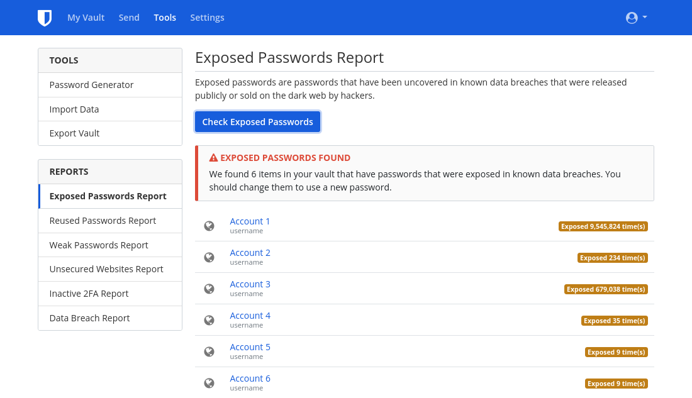

It can be easy to accumulate a number of online accounts over time, many of which you may no longer use. Deleting these unused accounts is an important step in reclaiming your privacy, as dormant accounts are vulnerable to having their credentials stolen and for abuse to occur without your knowledge. A data breach is when a service's security is breached by hackers and they are able to exfiltrate a copy of the user database. Data breaches are unfortunately all [too common](https://haveibeenpwned.com/PwnedWebsites) these days; practicing good digital hygiene is the best way to minimize the impact these have on your life. [Deceptive design](https://www.deceptive.design/) patterns can often introduce inconveniences along the way, this guide aims to help you navigate through the account deletion process.

## Finding Old Accounts

### Password Manager

If you have a password manager that you've used for your entire digital life, this part will be very easy. They often include built-in functionality for detecting if your credentials were exposed in a data breach, such as Bitwarden's [Data Breach Report](https://bitwarden.com/blog/have-you-been-pwned/).

<figure markdown>
  
</figure>

Even if you don't think you've used a password manager before, you may have used the one in your browser or your phone without even realizing it, for example: [Firefox Password Manager](https://support.mozilla.org/kb/password-manager-remember-delete-edit-logins), [Google Password Manager](https://passwords.google.com/intro)
and [Edge Password Manager](https://support.microsoft.com/en-us/microsoft-edge/save-or-forget-passwords-in-microsoft-edge-b4beecb0-f2a8-1ca0-f26f-9ec247a3f336).

Desktop platforms also often have a password manager which may help you recover passwords you've forgotten about:

- Windows [Credential Manager](https://support.microsoft.com/en-us/windows/accessing-credential-manager-1b5c916a-6a16-889f-8581-fc16e8165ac0)
- macOS [Keychain](https://support.apple.com/en-md/guide/mac-help/mchlf375f392/mac)
- iOS [Passwords](https://support.apple.com/en-us/HT211146)
- Linux, Gnome Keyring, which can be accessed through [Seahorse](https://help.gnome.org/users/seahorse/stable/passwords-view.html.en), or [KDE Wallet Manager](https://userbase.kde.org/KDE_Wallet_Manager)

### Email

If you didn't use a password manager in the past or you think you have accounts that you never added to your password manager, another option is to log in to the email account(s) that you believe you signed up on. Go to the search bar on your email client and type "verify" or "welcome". Almost every time you make an online account, the service will send a verification link or a welcome message to your email. This can be a good way to find old, forgotten accounts.

## Deleting Old Accounts

### Log In

In order to delete your old accounts, you'll need to first make sure you can log in to them. Again, if the account was in your password manager, this step is easy. If not, you can try to guess your password. Failing that, there is usually a "forgot password?" link toward the bottom of the login screen. It may also be possible that accounts you've abandoned have already been deleted, sometimes services prune all old accounts.

When you click it, it will most likely ask you for your email that you signed up with. Type in the email you think you used and see if you are sent a reset link. If the site returns an error message saying that email is not associated with an account, or you never receive a reset link after multiple attempts, then you do not have an account under that email address; try a different one. If you can't figure out which email address you used, or you no longer have access to that email, you can try contacting the service's support. Unfortunately there is no guarantee that you will be able to reclaim access your account.

### GDPR (EEA residents only)

Residents of the EEA have additional rights regarding data erasure specified in [Article 17](https://www.gdpr.org/regulation/article-17.html) of the GDPR. If it's applicable to you, read the privacy policy for any given service to find information on how to exercise your right to erasure. Reading the privacy policy can prove important, as some services have a "Delete Account" option that only disables your account and for real deletion you have to take additional action. Sometimes actual deletion may involve filling out surveys, emailing the data protection officer of the service, or even proving your residence in the EEA. If you plan to go this way, do **not** overwrite account information—your identity as an EEA resident may be required. Note that the location of the service does not matter; GDPR applies to anyone serving European users. If the service does not respect your right to erasure, you can contact your national [Data Protection Authority](https://ec.europa.eu/info/law/law-topic/data-protection/reform/rights-citizens/redress/what-should-i-do-if-i-think-my-personal-data-protection-rights-havent-been-respected_en) and you may be entitled to monetary compensation.

### Overwriting Account information

In some situations where you plan to abandon an account it may make sense to overwrite the account information with fake data. Once you've made sure you can log in, change all the information in your account to fake information. The reason you want to do this is many sites will retain information you previously had even after account deletion. The hope is that they will overwrite the previous information with the newest data you entered. Once again though, there is no guarantee that there won't be old backups.

For the account email, either create a new burner email account via your provider of choice or create an alias using an [email aliasing service](/email/#email-aliasing-services). Do not use temporary email providers, as many sites will give a period of time in which your account can be reactivated. Delete your burner email account after this period expires.

### Delete

After replacing all your info, you can check [JustDeleteMe](https://justdeleteme.xyz) for instructions on deleting the account for a specific service. Some sites will graciously have a "Delete Account" option, while others will force you to speak with a support agent. Overall, the process can vary quite a bit for different sites, and for some it may be impossible to delete.

For services that don't allow account deletion, the best thing to do is fake all your info as mentioned above. Then, enable MFA and any extra security features you can and change the password to a randomly-generated one that is the maximum allowed size (a [password manager](/passwords/#local-password-managers) can be useful for this).

If you're satisfied that all information you care about is removed, you can safely forget about this account. If not, it might be a good idea to keep the credentials stored with your other passwords and occasionally re-login to reset the password.

Even when you are able to delete an account, there is no guarantee that all your information will be removed. In fact, some companies are required by law to keep certain information, particularly when related to financial transactions. It's mostly out of your control what happens to your data when it comes to websites and cloud services.

## Avoid New Accounts

As the old saying goes, "an ounce of prevention is worth a pound of cure." Whenever you feel tempted to sign up for a new account, ask yourself "Do I really need this? Can I accomplish what I need to without an account?" It can often be much harder to delete an account than to create one and even after deleting or changing the info on your account, there might be a cached version from a third party like archive.org. Avoid the temptation when you're able to; your future self will thank you!

--8<-- "includes/abbreviations.en.md"
