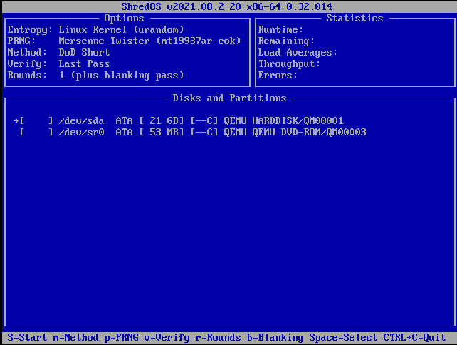

**Erasing data** from your computer may seem like a simple task, but if you want to make sure the data is truly unrecoverable, there are some things you should consider.

!!! tip
    You should use [full disk encryption](../encryption.md#os-full-disk-encryption) on your storage devices. If your device is stolen or needs to be returned under warranty your privacy may be at risk.

To erase a storage device **thoroughly**, you should securely erase the whole device and not individual files.

## Erasing Your Entire Drive

When you delete a file, the operating system marks the space where the deleted file was as "empty". That "empty" space can be fairly easily undeleted, yielding the original file.

### Magnetic storage

If the disk is a magnetic storage device such as spinning hard disk we suggest using [`nwipe`](https://en.wikipedia.org/wiki/Nwipe). `nwipe` can be installed in most Linux distributions. If you wish to use a complete boot environment on a system, consider using [ShredOS Disk Eraser](https://github.com/PartialVolume/shredos.x86_64). ShredOS boots straight into `nwipe` and allows you to erase available disks. To install it to a flash USB stick see the [installation methods](https://github.com/PartialVolume/shredos.x86_64/blob/master/README.md#obtaining-and-writing-shredos-to-a-usb-flash-drive-the-easy-way-).

Once you have your boot media, enter your system's UEFI settings and boot from the USB stick. Commonly used keys to access UEFI are ++f2++, ++f12++, or ++del++. Follow the on-screen prompts to wipe your data.

### Flash Storage

For [flash memory](https://en.wikipedia.org/wiki/Flash_memory) (SSD, NVMe etc) devices we suggest the ATA Secure Erase command. Methods such as `nwipe` should not be used on flash storage devices as it may damage their performance. The "Secure Erase" feature is often accessible through the UEFI setup menu.

It is also possible to complete a Secure erase using the [`hdparm`](https://ata.wiki.kernel.org/index.php/ATA_Secure_Erase) command, or [Microsoft Secure Group Commands](https://docs.microsoft.com/en-us/windows-hardware/drivers/storage/security-group-commands).

Physical destruction may be necessary to securely erase devices such as memory cards and unusable hard disks.

## Erasing Specific Files

Securely shredding **individual files** is difficult if not impossible. Copies can exist in a variety of ways such as through manual, or automatic backups, [wear leveling](https://en.wikipedia.org/wiki/Wear_leveling) (on modern [flash storage](https://en.wikipedia.org/wiki/Solid-state_drive)), caching and filesystem [journaling](https://en.wikipedia.org/wiki/Journaling_file_system).

Wear leveled devices do not guarantee a fixed relationship between [logical blocks addressed](https://en.wikipedia.org/wiki/Logical_block_addressing) through the interface. This means that the physical locations in which the data is stored may be different to where it is actually located, therefore shredding may not provide adequate security.

--8<-- "includes/abbreviations.en.md"
